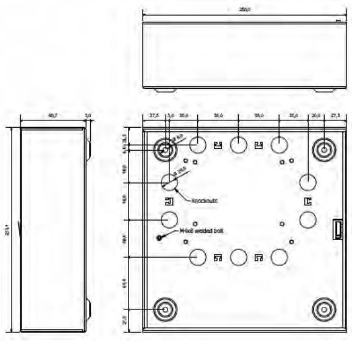
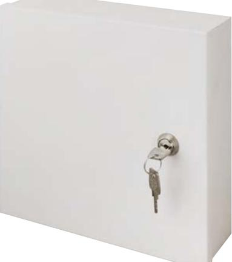
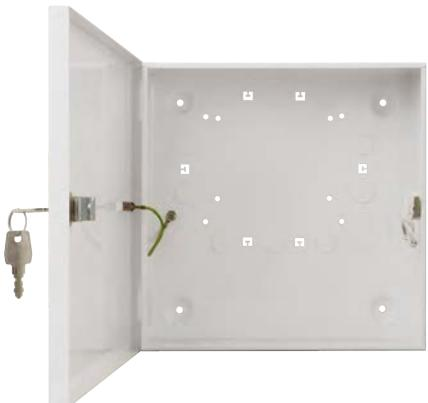
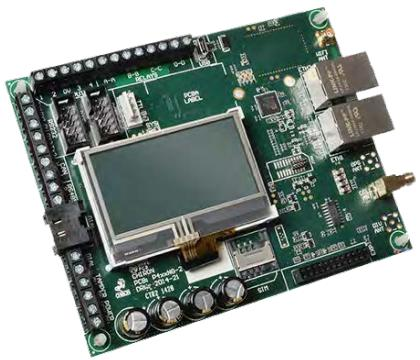

Chiron Security Communications has designed a dedicated enclosure for the IRIS Touch 4-NG series used in installations that have to comply with the VDS installation regulations. The reference of this enclosure is T-NG-ENC. The T-NG-ENC is an integral part of the the IRIS Touch 4-NG series VDS G115801 certification.

## **Details**

Dimensions:

- Height: 251.4mm
- Width: 250mm
- Depth: 80.7mm

Material: Sheet steel #0.7 Colour: RAL9003 (White)

Included:

- Tamperswitch
- Lock + key
- Resistors (15K + 4K7)

**Chiron Security Communications AG Phone: +41 44 308 38 13 Email: sales@chironsc.ch**