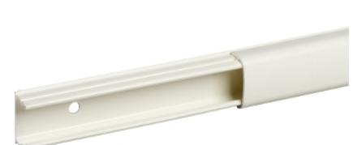

## ISM14125P Minikanal 12x20 BT PVC

| Produktdata            |              |
|------------------------|--------------|
| Produktområde          | OptiLine     |
| Kabelanslutningssystem | Kanalisation |
| Product type           | Minikanal    |
| Trunking type          | Minikanal    |

## Teknisk data

| Kanalmaterial                      | Plast                                                                                                |
|------------------------------------|------------------------------------------------------------------------------------------------------|
| Partisionering fack                | 1 fack                                                                                               |
| Colour                             | Vit (RAL 9003)                                                                                       |
| Trunking dimension                 | 12 x 20 mm                                                                                           |
| Monteringsmetod                    | Förstansade montagehål100 mm Skruvmontage kraftkabel: Självhäftande tejp lågspänningskabel:    |
| Material                           | PVC (polyvinyl chloride)                                                                             |
| Quantity per package               | 42 m                                                                                                 |
| Operating temperature              | -15…60 °C                                                                                            |
| Längd                              | 2100 mm                                                                                              |
| Höjd                               | 20 mm                                                                                                |
| Bredd                              | 12 mm                                                                                                |
| Miljö                              |                                                                                                      |
| Standarder                         | 73/23/EEC EN 50085-1:2005 EN 50085-2-1:2006                                                    |
| IP-kapslingsklass                  | IP40                                                                                                 |
| IK-skyddsgrad                      | IK07                                                                                                 |
| Hållbarhetsinformation             |                                                                                                      |
| Hållbarhetsstatus                  | Green Premium-produkt                                                                                |
| REACh-förordning                   | REACh-Deklaration                                                                                    |
| Innehåller ej REACh SVHC-ämnen     | Ja                                                                                                   |
| EU RoHS-direktiv                   | Proaktiv överensstämmelse (produkten utanför EU RoHS juridiska omfattning) EU RoHS-deklaration |
| Innehåller ej giftiga tungmetaller | Ja                                                                                                   |
| Kvicksilverfri                     | Ja                                                                                                   |
| RoHS-undantagsinformation          | Ja                                                                                                   |
| RoHS-förordning Kina               | RoHS-deklaration Kina                                                                                |
| Miljöupplysning                    | Produktmiljöprofil                                                                                   |
| Cirkulationsprofil                 | Inget behov av särskilda återvinningsåtgärder                                                        |

