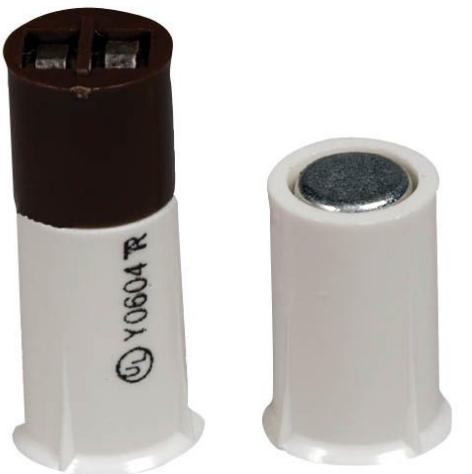

# **ISN-CSTB-TC Terminal Connection Contacts (16 mm)**

The contacts are available in brown or white. All models have a compact, short magnet with an adhesive strip and are designed with a terminal connection for fast and easy installation. Use on window frames.

- **Note** The photograph shows model ISN-CSTB-TCFW.
# **Functions**

UL and X

## **Installation/Configuration Notes**

## **Compatibility Information**

All contact models are compatible with control panel models that accept contact inputs.

#### **Parts Included**

| Quantity Per Package | Component |
|----------------------|-----------|
| 10                   | Contacts  |
| 10                   | Magnets   |

- ▶ **Closed loop**
- ▶ **Terminal connection design**
- ▶ **Does not require soldering or splicing**
- ▶ **No need to push B-Connectors (beanies) behind walls through small holes**

#### **Technical Specifications**

#### **Specifications for All Models**

| Gap Width:                   | 16 mm (0.625 in.)                     |
|------------------------------|---------------------------------------|
| Contact Dimensions:          | 9.5 mm x 25 mm (0.375 in. x 1 in.) |
| Switch Configuration Type:   | Single pole single throw (SPST)       |
| Maximum Contact Resistance:  | 150 μΩ (micro-ohm)                    |
| Minimum Breakdown Voltage:   | 250 VDC                               |
| Insulation Resistance:       | 1010 Ω                                |
| Electrostatic Cap:           | 0.3 PF                                |
| Contact Capacity:            | 10 VAC                                |
| Maximum Conductive Current:  | 1.0 A                                 |
| Maximum Voltage:             | 100 V                                 |
| Operating Temperature Range: | 7.2°C to -95.56°C (-45°F to -140°F)   |

## **Specifications for ISN-CSTB-TCB/W Models**

Standard Magnet Dimensions (W x L): 14.8 mm x 9 mm (0.58 in. x 0.36 in.)

#### **Specifications for ISN-CSTB-TCFB/W Models**

Bare Thin Magnet Dimensions (W x L): 3.2 mm x 9 mm (0.125 in. x 0.36 in.)

#### **Package Information**

ATTENTION! Each package contains ten contacts and ten magnets.

| Ordering Information                                                                                                                                                                                                                         |               |
|----------------------------------------------------------------------------------------------------------------------------------------------------------------------------------------------------------------------------------------------|---------------|
| Brown Terminal Connection Contact Brown recessed contact with 9.5 mm (0.375 in.) diameter. Includes standard magnet.Package contains ten con tacts and ten magnets.                                                              | ISN-CSTB-TCB  |
| White Terminal Connection Contact White recessed contact with 9.5 mm (0.375 in.) diameter. Includes standard magnet.Package contains ten con tacts and ten magnets.                                                              | ISN-CSTB-TCW  |
| Brown Terminal Connection Contact with Flat Magnet Brown recessed contact with 9.5 mm (0.375 in.) diameter. Includes a smaller flat magnet for tight-fitting applica tions. Package contains ten contacts and ten magnets. | ISN-CSTB-TCFB |
| White Terminal Connection Contact with Flat Magnet White recessed contact with 9.5 mm (0.375 in.) diameter. Includes a smaller flat magnet for tight-fitting applica tions. Package contains ten contacts and ten             | ISN-CSTB-TCFW |

Europe, Middle East, Africa:

magnets.

Bosch Security Systems B.V. P.O. Box 80002 5600 JB Eindhoven, The Netherlands Phone: + 31 40 2577 284 Fax: +31 40 2577 330 emea.securitysystems@bosch.com www.boschsecurity.com

# Americas:

Bosch Security Systems, Inc. 130 Perinton Parkway Fairport, New York, 14450, USA Phone: +1 800 289 0096 Fax: +1 585 223 9180 security.sales@us.bosch.com www.boschsecurity.us

#### Asia-Pacific:

Bosch Security Systems Pte Ltd 38C Jalan Pemimpin Singapore 577180 Phone: +65 6319 3450 Fax: +65 6319 3499 apr.securitysystems@bosch.com www.boschsecurity.com

#### Represented by

© Bosch Security Systems 2006 | Data subject to change without notice F1876928651 | Cur: en-US, V5, 15 Sep 2006