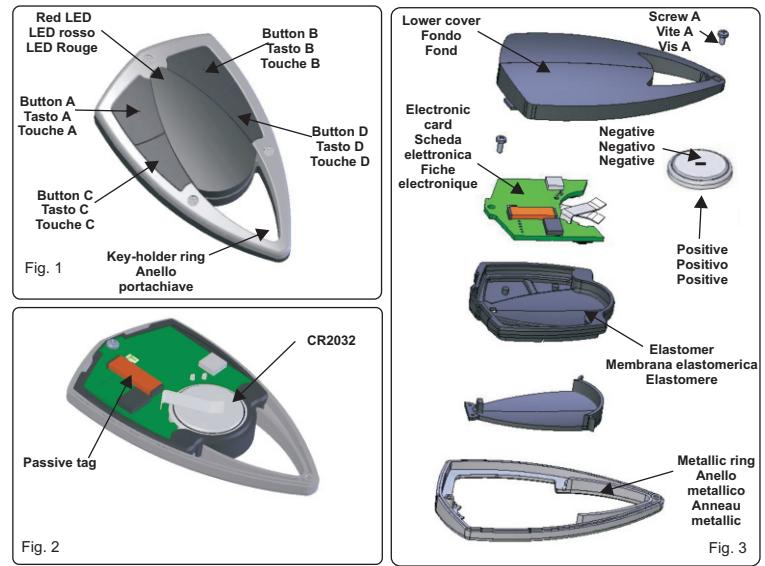

# **TRASMETTITORE 074A Mod. S7TR2641E4 UK**

 Il trasmettitore ERONE mod. S7TR2641E4 ( Fig. 1 ) è un radiocomando operante a 433,92 MHz in AM/ASK che può essere equipaggiato di tag passivo a125 KHz Fig. 2 ). E' stato progettato per l'utilizzo in sistemi di apertura automatica, antifurto e controllo accessi e consente la massima sicurezza di trasmissione grazie ad un codice di sicurezza del tipo Keeloq® Hopping code. Il codice di sicurezza è composto da un Numero Seriale a 16 bit ( 65526 combinazioni ) e da un Facility Code a 8 bit ( 256 combinazioni ). Il trasmettitore radio ed il transponder inviano lo stesso Numero Seriale ma il codice di sicurezza inviato via radio cambia ad ogni attivazione, evitando così il rischio di scanning, copia e ritrasmissione. Un particolare algoritmo permette di mantenere sincronizzati il ricevitore ed il trasmettitore. L'antenna del trasmettitore è realizzata da un innovativo sistema che sfrutta l'anello metallico ( fig. 3 ) del contenitore per realizzare un miglioramento dell'efficienza. Il fabbricante, CDVI Wireless Spa, dichiara che l'apparecchiatura radio S7TR2641E4 è conforme alla direttiva 2014/53/UE. Il testo completo della dichiarazione di conformità UE è disponibile al seguente indirizzo internet: www.erone.com. ( mod. S7TR2641E4T, S7TR2641E4TM - **IT**

#### The radiocontrol ERONE type S7TR2641E4 ( Fig. 1 ) is a transmitter operating 433,92 MHz in AM/ASK modulation. It can be equipped with a 125 KHz passive tag ( type Fig. 2 ). It has been designed for automatic closing systems, anti-burglar systems and access control systems, thanks to its very high security coding system (Keeloq® Hopping code). The security code is composed by a Serial Number ( 65526 combinations ) and by a Facility Code ( 256 combinations ). The radio transmitter and the transponder send the same S7TR2641E4T, S7TR2641E4TM -

S/N but the security code sent by radio changes at each activation, avoiding any scanning and copying risk. A special algorithm allows to keep synchronised transmitter and receiver. The metallic ring operates as antenna (Fig. 3 ), improving the efficency of the RF transmission.

Hereby, CDVI Wireless Spa, declares that the radio equipment type S7TR2641E4 is in compliance with directive 2014/53/EU. The full text of the EU declaration of conformity is available at the following internet address: www.erone.com.

#### **Technical specifications**

|                          | Number of keys :        | 4                            |
|--------------------------|-------------------------|------------------------------|
|                          | Supply :                | 3 Vdc                        |
|                          | Battery :               | lithium battery CR 2032 - 3V |
| Caratteristiche tecniche | Battery life :          | 12 - 18 months               |
|                          | Current consumption :   | 15 mA                        |
|                          | Operating frequency :   | 433.92 MHz                   |
|                          | Security RF protocol :  | Keeloq® Hopping code         |
|                          | Code combinations :     | 64 2                      |
|                          | S/N combinations :      | 65536                        |
|                          | Facility Codes :        | 256                          |
|                          | Modulation :            | AM / ASK                     |
| µ                        | Rated e.r.p. :          | 150 ÷ 200 W µ             |
|                          | Range in free space :   | 100 ÷ 200 m                  |
|                          | Operating temperature : | -10 ÷ +55 °C                 |
|                          | Overall dimensions :    | 72 x 42 x 13 mm              |
|                          | Weight :                | 32 gr.                       |
|                          |                         |                              |

#### **Coding**

Each transmitter is manufactured and sold with a different univocal serial number set-in-factory. The real transmitted code is the result of a special algorithm which combines a serial number, a manufacturer key and a synchronisation number.

#### **Memorization**

The transmitter security code has to be stored onto the receiver or the receivers memory available. Your own installer or reseller will perform this operation during the installation or will give you the necessaries instructions during the selling. Don't forget that the still free buttons of your transmitter can be used for further wireless functions. Ask your installer the best suitable receiver.

#### **Battery access**

To access the battery unscrew the screw A ( Fig. 3 ) using a screwdriver from the bottom and remove the cover. Remove the old battery with an edge and insert the new one of the same type ( CR2032). Place the battery with the negative pole upward (Fig. 3 ) .

NOTE: The disposal of the unloaded battery must have effected making use of the special containers.

| Troubleshooting                                                                     |                                 |  |  |
|-------------------------------------------------------------------------------------|---------------------------------|--|--|
| Fault                                                                               | Solution                        |  |  |
| The system does not receiver the transmitter signal. The transmitter led is OFF. | Replace the transmitter battery |  |  |
| The system does not receiver the transmitter signal The transmitter led is ON.   | Check the receiver supply       |  |  |

| Numero di tasti :             | 4                                |
|-------------------------------|----------------------------------|
| Tensione di alimentazione :   | 3 Vdc                            |
| Batteria :                    | 1 batteria al litio CR 2032 - 3V |
| Durata media della batteria : | 12 - 18 mesi                     |
| Consumo :                     | 15 mA                            |
| Frequenza portante :          | 433.92 MHz                       |
| Modulation :                  | AM / ASK                         |
| E.r.p. nominale :             | 150 ÷ 200 W µ                 |
| Protocollo di sicurezza :     | Keeloq® Hopping code             |
| Combinazioni totali :         | 64 2                          |
| Combinazioni Numero seriale : | 65536                            |
| Facility Codes :              | 256                              |
| Portata in spazio libero :    | 100 ÷ 200 m                      |
| Temperature di utilizzo :     | -10 ÷ +55 °C                     |
| Dimensioni :                  | 72 x 42 x 13 mm                  |
| Peso :                        | 32 gr.                           |
|                               |                                  |

## **Codifica**

Ogni trasmettitore è prodotto con un codice seriale di fabbrica differente ed infalsificabile. Il codice effettivamente trasmesso è formato da un numero seriale, un codice costruttore ed un numero di sincronizzazione.

## **Memorizzazione del codice del trasmettitore nel ricevitore**

Il trasmettitore deve essere memorizzato sul ricevitore o su tutti i ricevitori a disposizione dell'utente. Il Vostro rivenditore provvederà a tale operazione in sede di installazione o Vi darà le opportune istruzioni durante la vendita. Per la memorizzazione, seguire la procedura indicata nelle istruzioni del ricevitore specifico utilizzato.

# **Accesso al vano batteria**

Per accedere al vano batteria, svitare con un cacciavite a stella la vite A ( Fig. 3 ) dal lato inferiore del contenitore e rimuovere il fondo. Estrarre la batteria scarica con un oggetto appuntito e sostituirla con una nuova dello stesso tipo ( CR2032) . Posizionare la batteria con il polo negativo verso l'alto (Fig. 2).

ATTENZIONE : Lo smaltimento della batteria scarica deve essere effettuato facendo uso degli appositi contenitori.

#### **Diagnostica di guasto**

| Anomalia                                                              | Soluzione                                 |
|-----------------------------------------------------------------------|-------------------------------------------|
| Emissione radio non verificabile Il Led del trasmettitore è spento | Sostituire la batteria del trasmettitore  |
| Emissione radio non verificabile                                      | Verificare l'alimentazione del ricevitore |

 L'émetteur ERONE type S7TR2641E4 (Fig.1) est un émetteur radio operant à 433,92 MHz en modulation AM/ASK et peut être équipé de tag passif à 125KHz. ( mod. S7TR2641E4T, S7TR2641E4TM ). Il a été conçu spécifiquement pour les systèmes de fermeture automatique, les systèmes anti-intrusion et les systèmes de **FR**

contrôle d'accès, grâce à son système de codage haute sécurité (Keeloq® Hopping code). Le code de sécurité est composé d'un Numéro de Série (65526 combinaisons possibles) et d'un Code Site (256 combinaisons possibles). L'émetteur radio et le badge proximité envoient le même Numéro de badge mais le code de sécurité envoyé par radio change à chaque nouvelle activation, annulation, vérification ou reproduction à risques. Un algorithme particulier permet la synchronisation permanente de l'émetteur et du récepteur. L'anneau métallique du boîtier sert comme antenne, ce qui améliore de manière significative l'efficacité de la transmission. Le fabricant, CDVI Wireless Spa, déclare que le produit radio S7TR2641E4 est conforme à la directive 2014/53/UE. Le texte intégral de la déclaration de conformité est disponible à l'adresse internet suivante: www.erone.com.

|                                   | Caractéristiques Techniques |
|-----------------------------------|-----------------------------|
| Nombre de canaux :                | 4                           |
| Alimentation :                    | 3 Vcc                       |
| Pile :                            | lithium CR2032 - 3V         |
| Durée de vie des piles :          | 12 - 18 mois                |
| Consommation :                    | 15 mA                       |
| Fréquence de fonctionnement :     | 433.92 MHz                  |
| Protocole de sécurité :           | Keeloq® Hopping Code        |
| Combinaisons totales :            | 64 2                     |
| Combinaisons de numéro de Série : | 65536                       |
| Code site:                        | 256                         |
| Modulation :                      | AM/ASK                      |
| Taux de e.r.p :                   | 150 ÷ 200µ W             |
| Portée :                          | 100 ÷ 200m                  |
| Température de fonctionnement :   | -10 ÷ +55°C                 |
| Dimensions :                      | 72 x 42 x 13 mm             |
| Poids :                           | 32 gr.                      |

## **Codage**

Chaque émetteur est fabriqué et vendu avec un numéro de série de fabrication différent et infalsifiable. Le code de l'émetteur est le résultat d'un algorithme particulier qui combine un numéro de série, un numéro de fabrication et un numéro de synchronisation.

#### **Mémorisation**

Le code de sécurité de l'émetteur doit être enregistré dans la mémoire directement accessible des différents récepteurs. Votre propre installateur ou revendeur devra se charger de cette opération durant l'installation ou devra vous fournir les informations nécessaires durant la vente. Notez que les boutons de l'émetteur restant libres pourront être utilisés pour de futures fonctions sans fil. Pour connaître la meilleure configuration possible, demandez conseils à votre installateur.

# **Accéder aux batteries**

Pour accéder au pile à l'aide d'un tournevis dévisser la vis A (Fig. 3) qui se trouve à l'arrière de l'émetteur et enlever le couvercle. Remplacer l'ancienne par la nouvelle de même type (CR2032). Placer le pôle négatif de la pile en haut (Fig.3).

ATTENTION : Les piles usagées doivent être placées dans des bacs de collecte pour le recyclage.

| Problème                                                                    | Solution                             |
|-----------------------------------------------------------------------------|--------------------------------------|
| Le système ne reçoit pas le signal émis La led de l'émetteur est ETEINTE | Remplacer la pile de l'émetteur      |
| Le système de reçoit pas le signal émis La led de l'émetteur est ALLUMEE | Vérifier l'alimentation de récepteur |

# **GARANZIA**

La garanzia è di 24 mesi dalla data di fabbricazione apposta all'interno. Durante tale periodo se l'apparecchiatura non funziona correttamente a causa di un componente difettoso, essa verrà riparata o sostituita a discrezione del fabbricante. La garanzia non copre l'usura della batteria e l'integrità del contenitore plastico. La garanzia viene prestata presso la sede del fabbricante.

# **GARANTIE**

Emetteur fabriqué et vendu avec un numéro de série unique sélectionné lors de la fabrication. Période de garantie : 24 mois à compter de la date de fabrication, uniquement pour les composants électronique, ne couvrant pas le boîtier.

# **GUARANTEE**

The guarantee period of all Erone products is 24 months, beginning from the manufacturer date. During this period, if the product does not work correctly, due to a defective component, the product will be repaired or substituted at the discretion of the producer. The guarantee does not cover the plastic container integrity. After-sale service is supplied at the producer's factory.

Manufactured by CDVI Wireless Spa Via Piave, 23 - 31020 San Pietro di Feletto (TV) - Italy Tel. +39-0438-450860 - Fax +39-0438-455628 web: www.erone.com - e-mail: info@erone.com