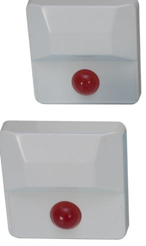
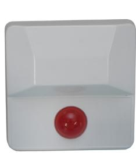
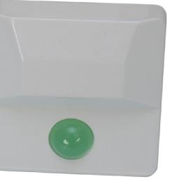
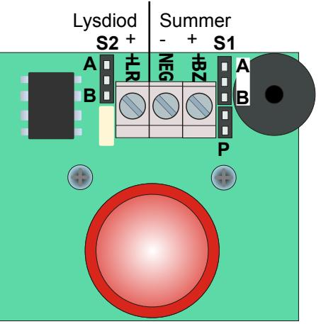

## **Indikeringsdioder**

**Best.nr: 20514-17**

## **Allmänt**

Indikeringstablå för olika slag av indikering, exempelvis indikering av överfall eller tillkopplingsstatus.

Indikeringsdioden är 20 mm i diameter och finns i tre modeller:

20514: Grön lysdiod.

20515: Röd lysdiod.

20516: Valbar blink- eller lysdiod.

20517: Valbar blink- eller lysdiod samt inkopplingsbar piezosummer.

## **Inkoppling**

**Bygel: P** Av = 24 V På = 12 V **S1** A = Summer fast ton B = Summer pulserande ton **S2** A = Lysdiod fast sken B = Lysdiod blinkar

## **Tekniskt specifikation**

Spänning: 12 – 24 VDC. Ström: Max 22 mA lysdiod. Max 20 mA summer. Mått: 80 x 80 x 20 mm.