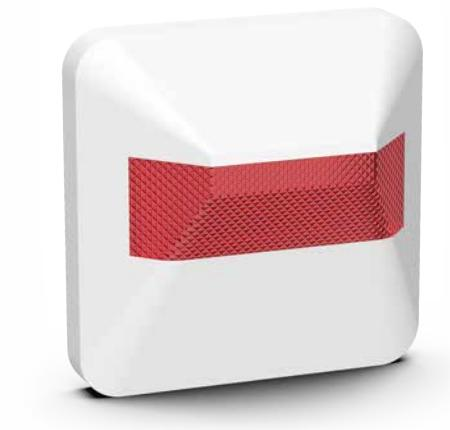

## **Indikeringslampa**

IRK

## E-nummer: 6308449

IRK indikeringslampa är avsedd att användas tillsammans med branddetektorer. Indikatorn är tänkt för tillfällen där detektorn är monterad i dolda eller svåråtkomliga utrymmen. Den monteras på en för brandförsvaret väl synlig plats. Enheten kan förses med dekal "Dold branddetektor" IRK är speciellt lämplig för extraindikering utanför rum där man på avstånd vill se larmande detektors position t.ex. på äldreboende, etc. Parallellindikatorn, IRK, monteras utanpåliggande i egen kapsling.

## **Specifikationer**

| Djup (mm):  | 36  |
|-------------|-----|
| Bredd (mm): | 86  |
| Höjd (mm):  | 86  |
| Färg:       | Vit |