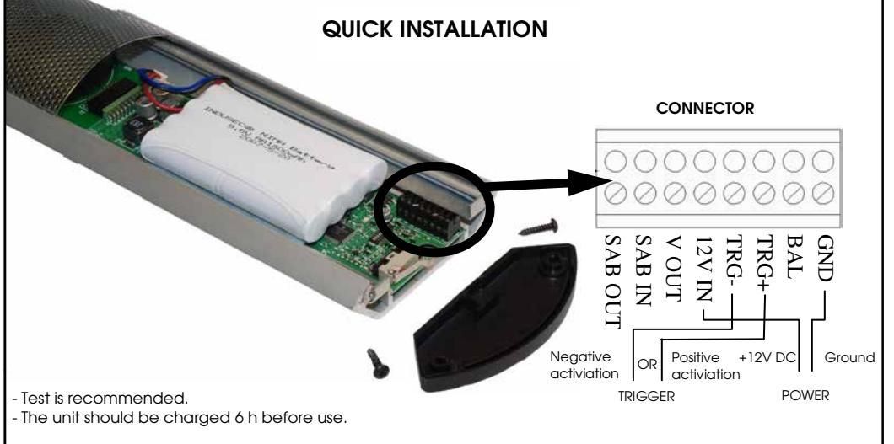
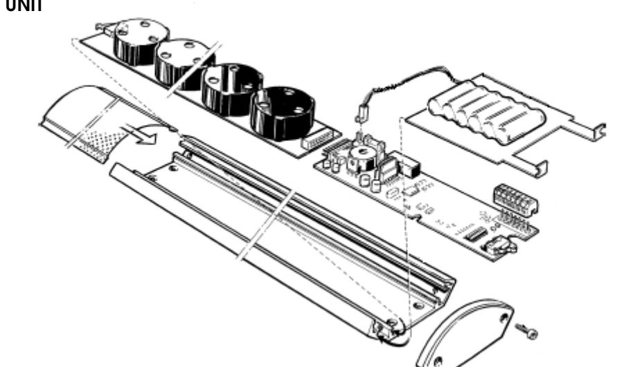
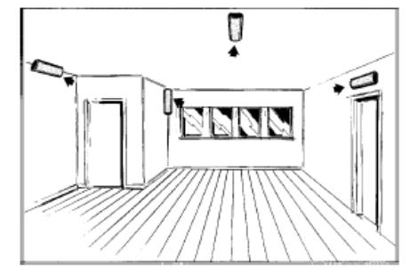
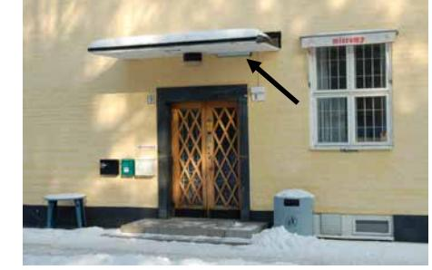
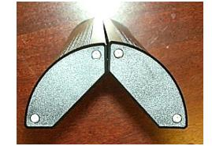
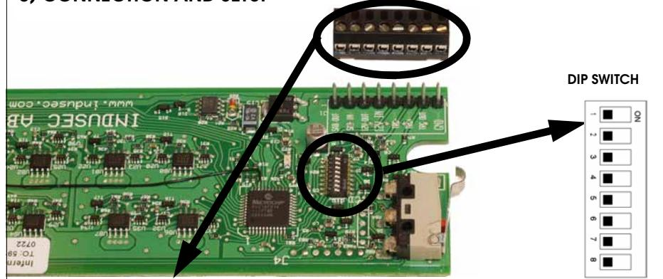
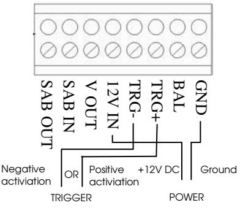
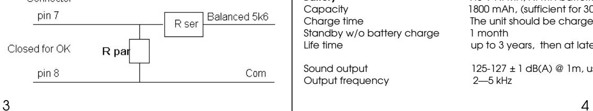

# Inferno Intenso

Sound Barrier

#### INSTALLATION INSTRUCTIONS

The Inferno Sound Barrier is intended for professional use only and should be handled and installed by authorized installers.

- - Do not connect the unit to other supplies than 12 (12-16) V DC.
- - It will not work properly before the unit has been charged for 6 hours.
- The battery must be changed at least every third year.
- - While dealing with the PCB's inside the unit, precautions must be observed for handling electrostatic discharge sensitive devices.
- It´s recommended to use earplugs when installing

Tools needed:

- Screwdriver
- Torx wrench
- Screws and drill for mounting the unit

Indusec makes no representation that this product will prevent personal injury or property loss or that the product will in all cases provide adequate warning or protection. Purchaser should understand that a properly installed and maintained alarm system may only reduce the risk of a burglary, robbery or fire without warning, but the alarm is not insurance or a guarantee that such will not occur or that there will be no personal injury or property loss as a result. THEREFORE, INDUSEC, SHALL NOT BE LIABLE FOR ANY CONSEQUENTIAL OR INCIDENTAL DAMAGES IN CONNECTION WITH THE USE, INSTALLATION AND/OR MAINTENANCE OF THE PRODUCT. Including, but not limited to the liability for any property demage, bodily injury, ot other loss based on a claim that the product failed to give warning, or any cost of expense of providing substitute equipment or service during periods of malfunction, nonuse or maintenence. In no event shall the liability of Indusec exceed the purchase price of the product.

1) THE UNIT

## 2) MOUNTING

Inferno Intenso Inferno Outdoor

### Option: Multiple units

 Multiple units can be attached together forming either a semi circle or a full circle. The Semi-circle unit can be mounted either on the wall or the ceiling while the Omni version works best hanging from the ceiling.

1 2 

Copyright Indusec — all rights reserved

Indusec

# Inferno Intenso

CONNECTOR

GND = Ground BAL = Bad battery signal, see below TRG + = Positive activation TRG - = Negative activation

- 12 V IN = Charge +12 V DC
- V OUT = Reserve
- SAB IN = Tamper out
- SAB OUT = Tamper in

#### Bad battery signal

- Dip switch: 8 ON - Connector: pin 7 and 8 (BAL and GND)

1. Charging Indication ON = A red light will lit when charging. OFF = No indication when charging. (default) 2. Delay between received trigger signal and the alarm sounding. ON = 30 s OFF = 0 s (default) 3. Test Mode ON = Test mode, four short different-pitched sound signals. OFF = Normal mode (default) 4. Alarm Signal Length ON = Infinite alarm OFF = 3 min, after a new trig is needed (default) 5. Reserve 6. Fixed Alarm Signal Length ON = 45 s OFF = Normal mode (default) 7. Sound level ON = 127 ± 1 dB(A) @ 1m. 20 s and then 124 ± 1 dB(A) @ 1m. NOTE! Very high sound level. OFF = 125 ± 1 dB(A) @ 1m (default) 8. Automatic Battery Check ON = Bad battery signal on pin 7 on Connector, see below OFF = Led flash => Bad battery (default) Time to change battery. 

### Option: Tamper

The tamper loop is an extra mechanical security protection. It is not needed for the function of the siren. 

The tamper loop consists of a series connection that enters at the Connector at SAB IN goes through the microswitch at the end of the board, runs through the CPU board through the middle connector to the speaker board through the microswitch on that very end and back to the Connector at SAB OUT.

The loop can contain other normally-closed switches such as magnetic contacts or mercury tilt switches in the alarm set-up.

## 4) ASSEMBLING THE UNIT

- 1. Before applying power to the unit, ensure that Dip switch 3 is in the ON position = Test mode.
- 2. Assemble the two PCB's and the battery. Attach the battery cable to the connector.
- 3. Power can now be applied.
- 4. Set Dip switch 1 to ON. A red LED on the CPU circuit board should light up.
- 5. Dip switch 1 can be in either in ON or OFF mode.
- 6. Set the Dip switch 3 to OFF = Normal mode. Attach the grid and the two end caps.
- 7. The Inferno is assembled and ready for use.

## 5) TEST

We recommend testing the unit either before mounting or during assembling.

Without a connected Tamper loop it is only necessary to connect the two PCB's, the battery and power.

Test procedure (The battery will need about 20 minutes to charge before testing.); 1. Set Dip switch 3 to ON position. 

2. Activate either Trigger signal. 

3. The unit should generate four short different-pitched sound signals indicating that the unit works.

- 4. Switch off the Trigger signal.
- 5. Set Dip switch 3 to OFF position. (Normal operation mode)

6. The test is complete.

## 6) SPECIFICATIONS

Coverage Up to 150 cubic meters (60 square meters x 2.5)

### Electrical interface

Cables 0.25 – 1.0 square mm, ( AWG 22 – 18 )

Power Supply 12 – 16 V DC, < 150 mA Activation Signals Trig ( - ): 0 – 0.5 V, (10 mA) Trig ( + ): 9 – 18 V, (10 mA) 

Battery 9.6 V Ni-MH, NI-MH batteries performance is improved if charged/discharged.Capacity 1800 mAh, (sufficient for 30 minutes continuous alarm) Charge time The unit should be charged 6 hours before use. Standby w/o battery charge 1 month

 Life time up to 3 years, then at latest it has to be replaced 

Sound output 125-127 ± 1 dB(A) @ 1m, user selectable Output frequency 2—5 kHz

In the interest of improving internal design, operational function, and/or reliability, Indusec reserves the right to make changes to the products described in this document without notice. Indusec does not assume any liability that may occur due to the use or application of the product(s) or circuit layout(s) described herein. www.indusec.com Copyright Indusec — all rights reserved