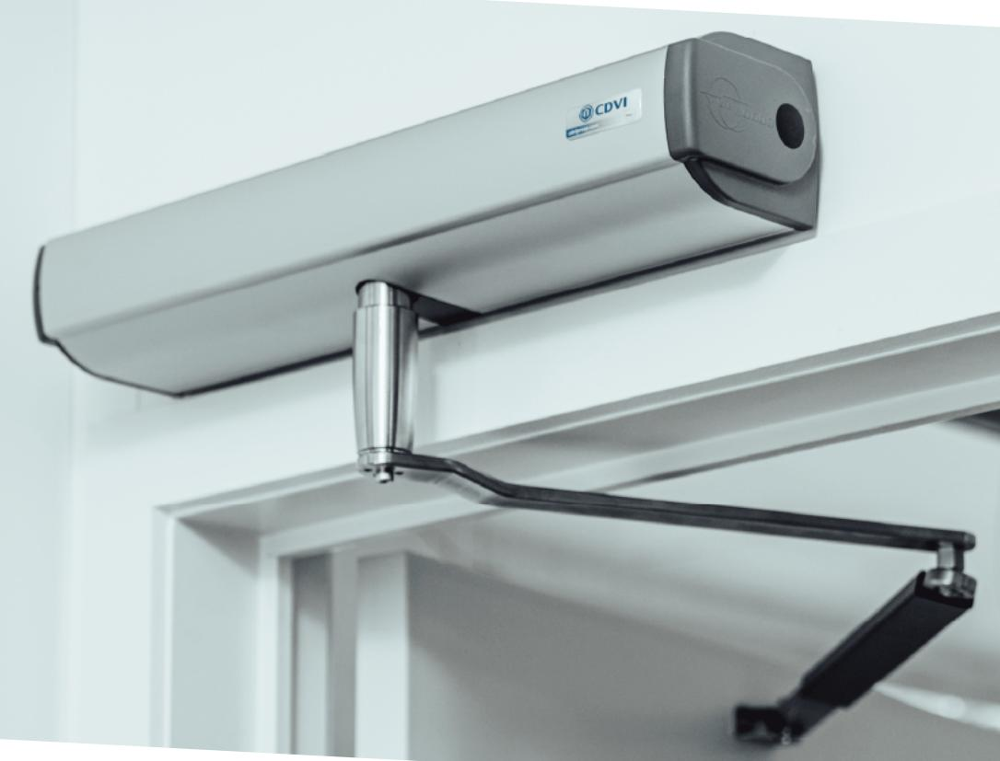
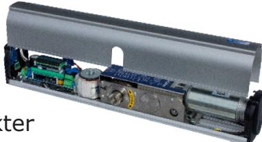
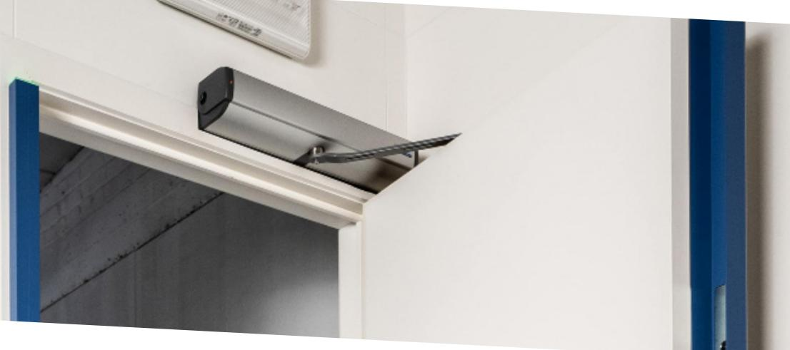
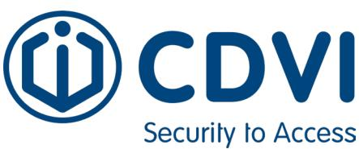

## Innovativ slagdörrsautomatik

www.cdvi.se

Digiway är en serie innovativa slagdörrautomatiker för inner- och ytterdörrar. Det är en kraftfull dörrautomatik utrustad med en kompakt elmotor. Med sin returfjäder är den i princip ljudlös.

## **Med installatören i åtanke**

Digiway förenklar slutanvändarens vardag avsevärt. Men vi tillvekar alltid produkter för att ta hänsyn även till installatörens behov. Därför är installation och driftsättning av våra dörrautomatiker enkel, tydlig och smidig.

- Allt är inkluderat i paketet. Inga extrakort eller moduler tillkommer.
- Alla dörrautomatiker har inbyggd bluetooth så du kan sköta programmeringen från din smartphone eller surfplatta.
- Manualerna är på svenska och har tydliga inkopplingsanvisningar.
- Loggfunktion för senaste hinderupptäckter. I appen kan du t.ex. se signaler från säkerhetssensorer, öppna knappar osv.
- Har inbyggd radiomottagare för att underlätta tillgänglighetsanpassning.
- Digiway kommer med 5-års garanti vid tecknande av serviceavtal. Automatiken kan själv påkalla service när det är dags.
- Digiway Tropical är en fuktskyddad modell för montage i t.ex. simhallar.
- Vi erbjuder 24 volt modell för batteribackup avsett framför allt brandcellsgränser.

## **Digiway funktioner**

- Låsstyrning
- Brandfunktion
- Två driftlägen
- Säkert tillslag
- Styrning av armbågskontakter
- Bortkoppling av styrning
- Tidsfördröjning
- Dag- & nattläge

## **Vi uppfyller säkerhetskraven**

Digiway är godkända enligt EN16005 med High Performance och Low Energy i samma enhet och levereras alltid med alla funktioner, så att du slipper extrakort och tilläggsmoduler.

Modellen Digiway SR är brandgodkänd upp till 60 minuter och uppfyller kraven för både till- och frångänglighet.

Datavägen 12 B 436 32, Askim

Tel: 031-760 19 30 E-mail: info©cdvi.se Hemsida:www.cdvi.se