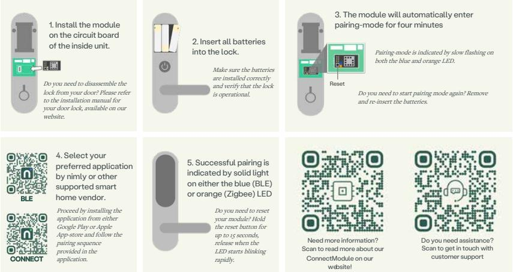

## Installation Guide Connect Module

Necessary components: Connect Module, compatible nimly door lock and compatible gateway from nimly or other supported smart home vendor (not required for BLE-application)

