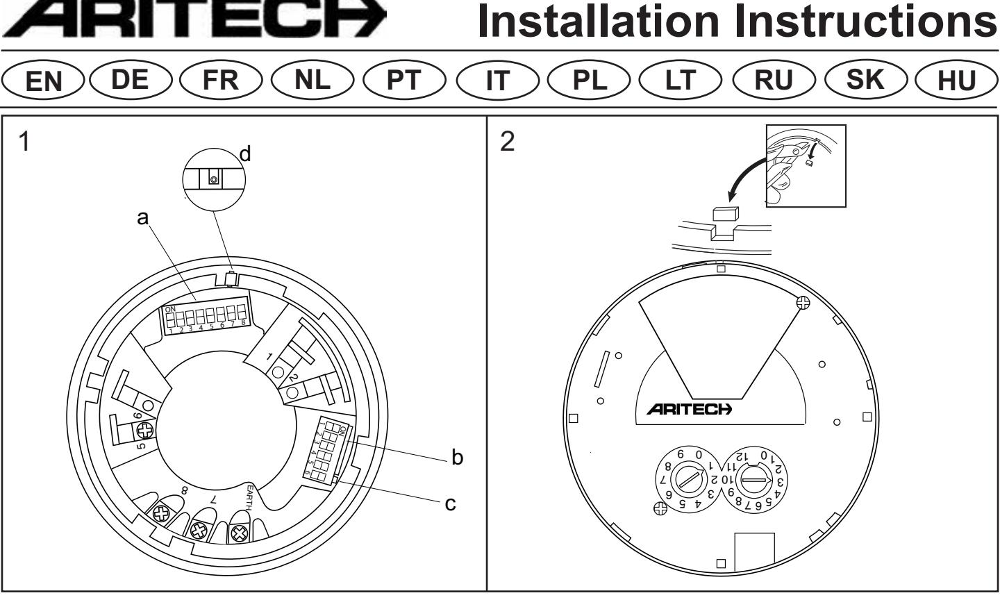
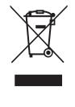
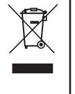
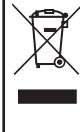
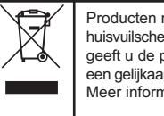
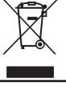
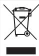
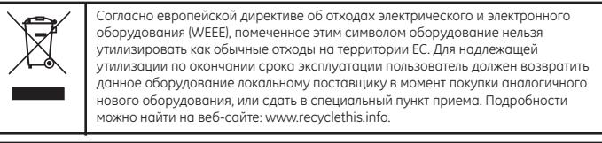

DB2368IAS Series Addressable Loop Powered Base Sounder with integrated short-circuit isolator

## **EN Installation instructions**

## **Description**

This document includes installation information for the Aritech DB2368IAS addressable, loop powered base-sounder with integrated short-circuit isolator.

The DB2368IAS base-sounder is designed for use in Aritech addressable fire systems running the 2000 Series protocol and is designed for indoor use only.

The sounder can be put into different operating modes.

To avoid sound interference between devices in the same locality, the sounders are synchronised automatically.

#### **Installation**

**CAUTION:** This product must be installed by qualified personnel adhering to the TS54-14 specification and any other applicable local authority regulations.

The DB2368IAS is polarity sensitive.

**WARNING:** The IU2016 isolator and DB2003 mounting base must not be installed in the same loop as the DB2368IAS Base-Sounder with integrated isolator.

**NOTE:** The foam gasket supplied with the device must always be installed to ensure compliance with the ingress protection requirements of EN54-3.

## **Placement and spacing**

Locate ceiling mounted detector bases near the centre of the room or hall whenever possible. Always place bases a minimum of 100 mm from any wall. When the base is wall mounted, the top of the base should be 100-300 mm from the ceiling. When more than one detector is used, use the spacing of 9 m as a guide on smooth ceilings. Other spacing may be used depending on ceiling height, high air movement, and other conditions or response requirements.

UTC Fire & Security BV. Kelvinstraat 7, NL- 6003DH Weert, The Netherlands. +31 495 45 67 35 +31 495 55 00 42

## **Where NOT to place detectors**

One of the major causes of nuisance alarms is improper placement of detectors. Avoid locating detectors:

- Too close to kitchens or wood stoves where smoke can be generated.
- In garages and furnace rooms (due to exhaust fumes).
- Too close to bathrooms. This can cause problems from steamy baths or showers.
- Where normal ambient air temperature can exceed 40°C, such as attics.

## **Electrical connections**

| Terminal | Line                       |
|----------|----------------------------|
| 1        | Not used                   |
| 2        | Not used                   |
| 5        | Line in / out (positive)   |
| 6        | Not used                   |
| 7        | Line in (negative)         |
| 8        | Line out (negative)        |
| EARTH    | Screen or functional earth |

## **Addressing**

Each device requires a numeric address between 1 and 128 for identification purposes. This is set using switches 1- 8 on the Address Selector DIP switch (see figure 1a). See the table at the end of this document for a complete list of address settings.

Issue 1.0 (July 2011) INS539-1 Copyright © 2010 UTC Fire & Security BV. All Rights Reserved

## **Tone selection and volume control**

The device tone is set using switches 1-5 on the Tone Selector DIP switch (see figure 1b). See the table at the end of this document for a complete list of tone / DIP switch settings.

Switch 6 on the Tone Selector DIP switch is used to select the required sound output (See figure 1c). The default setting (switch OFF) is high output. Changing the switch to ON reduces the sound output by 8 dB.

## **Installing the detector head**

To install a detector head, insert the head and rotate it clockwise until it is properly aligned and "sets" into the base.

#### **Stand-alone installation**

The DB2368IAS base-sounder can be used as a stand-alone device without a detector. For this purpose sounder "caps" are available that may be fitted instead of the detector.

| Part Number | Description             |
|-------------|-------------------------|
| AS2368CAP-R | Red cap for DB2368IAS   |
| AS2368CAP-W | White cap for DB2368IAS |

## **Locking mechanism**

The detector or cap can be locked in position as follows:

- i. Remove the plastic tab on the detector or cap as shown in figure 2, before attaching to the base-sounder.
- ii. Once the detector or cap is attached to the base-sounder, lock into position by unscrewing the 1.5mm, AF hexagon socket head screw until it prevents the detector or cap from being rotated. (See figure 1d)

## **Isolator**

The sounder incorporates an integrated short-circuit isolator. The yellow LED on the side of the device will illuminate whenever the isolator activates.

## **Maintenance and testing**

Basic maintenance is reduced to an annual inspection. Do not modify internal wiring or circuitry. Test all devices after installation.

## **Troubleshooting**

The analogue value returned to the control panel in the communications protocol can be used to check the status of the sounder and isolator as follows:

| Analogue value | Status                             |
|----------------|------------------------------------|
| 1              | Sounder fault                      |
| 4              | Isolator activated                 |
| 5              | Sounder fault + isolator activated |
| 32             | Normal state                       |
| 33             | 1st sound activated                |
| 34             | 2nd sound activated                |
| 35             | 3rd sound activated                |

Before investigating individual units for faults, check the system wiring is fault free. Earth faults on data loops may cause communication errors.

Common problems and causes include:

| Problem        | Possible Cause                                                                      |
|----------------|-------------------------------------------------------------------------------------|
| No response or | Incorrect address setting or incorrect loop wiring                                  |
| missing        | (polarity reversed)                                                                 |
|                | Device fails to operate Control panel has incorrect cause and effect programming |

## **Technical specification**

| Supply voltage  17 to 28 VDC                    |                       |
|-------------------------------------------------|-----------------------|
| Current consumption @ 24 VDC:                   |                       |
| Switch on surge  < 1.2 mA                       |                       |
| Standby  < 400 µA                               |                       |
| Alarm  5.1 mA                                   |                       |
| Isolated  <6 mA                                 |                       |
| Isolator pass current  800 mA max.              |                       |
| Peak Sound Level @ 90º ± 3 dB(A)  90 dBA at 1m* |                       |
| Number of Tones  32                             |                       |
| Frequency Range  400 - 2850 Hz*                 |                       |
| Volume Adjustment …………………… 8db (Typical)        |                       |
| Synchronisation  Automatic with other           |                       |
|                                                 | AS2300 range sounders |
| Casing  High Impact ABS                         |                       |
| IP rating (gasket fitted)  IP21                 |                       |
| Cable size  min.0.28mm2/max. 2.5mm2             |                       |
| Operating temperature  -10°C to +55°C           |                       |
| Storage temperature  -10ºC to +55ºC             |                       |
| Relative humidity (non condensing) 5% to 95%    |                       |
| Dimensions (dia x h)  115 x 43mm                |                       |
| Weight  140g                                    |                       |
| Device Type Code  0E (H)                        |                       |

*Depends on selected tone and input voltage. See tone table for details. Certified on tones 2,3,6,7 & 13 only.

| Certification and approvals information |                                                                                                                                                 |  |
|-----------------------------------------|-------------------------------------------------------------------------------------------------------------------------------------------------|--|
| Product code                            | D2368IAS-R & DB2368IAS-W                                                                                                                        |  |
| Description                             | Addressable Sounder with Integrated Isolator                                                                                                    |  |
| Certification                           |                                                                                                                                                 |  |
| Compliance                              | EN54-3 Type A                                                                                                                                   |  |
|                                         | EN54-17                                                                                                                                         |  |
|                                         | CPD certification body BRE Global Ltd and LPCB                                                                                                  |  |
| CPD certificate number 0832-CPD-1682    |                                                                                                                                                 |  |
| CPD certificate year                    | The year of certification is included in the first two digits of your product serial number (located on the product identification label) |  |
| Technical Data Document              | 18-187219                                                                                                                                       |  |

Products marked with this symbol cannot be disposed of as unsorted municipal waste in the European Union. For proper recycling, return this product to your local supplier upon the purchase of equivalent new equipment, or dispose of it at designated collection points. For more information see: www.recyclethis.info.

## **DE Installationsanleitung**

#### **Beschreibung**

In diesem Dokument sind Informationen über den Aritech DB23681AS adressierbaren, von der Schleife gespeisten Base-Sounder mit eingebautem Kurzschluss-Isolator angegeben.

Der DB2368IAS Base-Sounder ist zur Anwendung in Aritech adressierbaren Brandmeldeanlagen konzipiert, die unter dem Protokoll der Serie 2000 laufen, und ist nur zur Verwendung in Innenräumen bestimmt.

Der Sounder kann auf verschiedene Betriebsmodi geschaltet werden.

Um Toninterferenzen zwischen verschiedenen Geräten am gleichen Ort zu vermeiden, werden die Sounder automatisch synchronisiert.

#### **Installation**

**VORSICHT:** Dieses Produkt darf nur von Fachpersonal entsprechend TS54-14 Spezifikationen und allen anderen zutreffenden örtlichen Vorschriften installiert werden.

Der DB2368IAS ist polaritätssensibel.

ACHTUNG! Der IU2016 Isolator und der DB2003 Sockel dürfen nicht in derselben Schleife wie der DB2368IAS Base-Sounder mit eingebautem Isolator installiert werden.

### **Anordnung und Abstand**

Wo möglich die an der Decke befestigten Meldersockel in der Mitte des Raumes oder Flur anordnen. Die Sockel immer wenigstens 100 mm von jeder Wand anordnen. Wenn der Sockel an der Wand angebracht wird, sollte sich die Oberkante des Sockels 100-300 mm entfernt von der Decke befinden. Kommt mehr als ein Sounder zur Anwendung, einen Abstand von 9 m als Richtlinien auf glatten Decken einhalten. Andere Abstän-de können je nach Deckenhöhe, Bewegung hoher Luft und anderen Bedingungen oder Reaktionsanforde-rungen verwendet werden.

#### **Wo Melder NICHT angeordnet sein dürfen**

Einer der Hauptgründe für unerwünschten Alarm ist die falsche Anordnung von Meldern. Melder nicht an folgenden Orten anordnen:

- Zu nahe an Küchen oder Holzöfen, wo Rauch erzeugt werden könnte.
- In Garagen oder Räumen, wo Öfen aufgestellt sind (aufgrund der Abgase) • Zu nahe an Badezimmern. Dampf von Badewannen und Duschen könnten Probleme verursachen.
- Wo normale die Umgebungslufttemperatur 40 °C übersteigen kann, z. B. in Dachböden.

#### **Elektrische Anschlüsse**

| Anschluss-klemme | Ring                           |
|------------------|--------------------------------|
| 1                | Nicht belegt                   |
| 2                | Nicht belegt                   |
| 5                | Ring IN /OUT (Plus)            |
| 6                | Nicht belegt                   |
| 7                | Ring IN (Minus)                |
| 8                | Ring OUT (Minus)               |
| ERDE             | Abschirmung oder Funktionserde |

#### **Adressierung**

Jedes Gerät benötigt eine numerische Adresse zwischen 1 und 128 zwecks Identifikation. Diese wird mit Schaltern 1 – 8 auf dem Adressenselektor-DIP-Schalter (s. Abb. 1a) eingestellt. Am Ende dieses Dokuments befindet sich eine Tabelle mit der kompletten Liste der Adresseneinstellungen.

#### **Tonauswahl und Lautstärkenregelung**

Der Geräteton wird mit den Schaltern 1 – 5 am Tone Selector DIP-Schalter (s. Abb. 1b) eingestellt. Am Ende dieses Dokuments befindet sich eine Tabelle mit einer kompletten Liste der Ton/ DIP-Schaltereinstellungen.

Schalter 6 am Tone Selector DIP-Schalter dient zur Regelung der gewünschten Tonausgabe (s. Abb. 1c). Die Standardeinstellung (Schalter AUS) ist hohe Lautstärke. Wird der Schalter auf EIN gestellt, wird die Tonaus-gabe um 8 dB verringert.

#### **Den Messkopf installieren**

Zur Installation eines Messkopfes wird der Kopf eingeführt und im Uhrzeigersinn gedreht, bis er ordnungs-gemäß ausgerichtet und im Bodenteil eingepasst ist.

#### **Stand-alone-Installation**

Der DB2368IAS Base-Sounder kann als Stand-alone-Gerät ohne einen Melder eingesetzt werden. Furudiesen Zweck sind Sounder-Deckel verfuugbar, die anstatt des Melders eingebaut werden können

| Teilnummer  | Beschreibung                |
|-------------|-----------------------------|
| AS2368CAP-R | Roter Deckel für DB2368IAS  |
| AS2368CAP-W | Weißer Deckel für DB2368IAS |

#### **Verriegelung**

Der Melder oder Deckel kann wie folgt in Position verriegelt werden: i. Die Kunststofflasche am Melder oder Deckel, wie in Abb. 2 gezeigt, entfernen, bevor er am Base-Sounder befestigt wird.

- ii. Wenn der Melder oder der Deckel am Base-Sounder befestigt worden ist, in Position verriegeln, indem die 1,5 mm AF Zylinderschraube gelockert wird, bis der Melder oder der Deckel nicht länger gedreht werden können. (S. Abb. 1d)
#### **Isolator**

Der Sounder ist mit einem integrierten Kurzschluss-Isolator ausgestattet. Die gelbe LED an der Seite des Geräts wird aufleuchten, wenn der Isolator aktiviert.

#### **Wartung und Prufung**

Die grundlegendeWartung ist auf eine jährliche Inspektion beschränkt. Die Innenverdrahtung darf nichtmodifiziertwerden. Alle Geräte nach dem Einbau prufen!

#### **Fehlerbehebung**

Der analoge, an der Steuertafel im Kommunikationsprotokoll erhaltene Wert,kannwie folgt verwendetwerden, den Status des Sounders und Isolator zu prufen:

| Analoge Wert | Status                              |  |
|--------------|-------------------------------------|--|
| 1            | Sounder-Fehler                      |  |
| 4            | Isolator aktiviert                  |  |
| 5            | Sounder-Fehler + Isolator aktiviert |  |
| 32           | Normaler Zustand                    |  |
| 33           | 1. Ton aktiviert                    |  |
| 34           | 2. Ton aktiviert                    |  |
| 35           | 3. Ton aktiviert                    |  |

Bevor einzelne Einheiten auf Fehler gepruftwerdenerst die Systemverdrahtung auf Fehler prufen. Erdschlusse an Datenschleifen können Kommunikationsfehler verursachen.

#### Häufig auftretende Fehler und Ursachen sind u. a.:

| Problem             | Mögliche Ursache                         |
|---------------------|------------------------------------------|
| Keine Reaktion oder | Falsche Adresseneinstellung oder falsche |
| fehlt               | Schleifenverdrahtung                     |
| Betriebsausfall des | Die Ursache- und-Wirkungs-Programmierung |
| Geräts              | der Steuertafel ist fehlerhaft           |

### **Technische Spezifaktion**

| Versorgungsspannung  17 bis 28 VDC                   |                            |
|------------------------------------------------------|----------------------------|
| Stromverbrauch bei 24 VDC                            |                            |
| Einschaltspitze …………………… < 1,2 mA                    |                            |
| Standby  < 400 RA                                    |                            |
| Alarm (Sounder)  5,1 mA                              |                            |
| Getrennt  <6 mA                                      |                            |
| Durchlassstrom des Isolators max. 800 mA             |                            |
| Spitzengeräuschpegel @ 90° ± dB(A)……… 90dBA at 1m*   |                            |
| Anzahl der Töne…………………………… 32                        |                            |
| Frequenzbereich ………………………… 400-2850 HWA              |                            |
| Lautstärkenregelung …………………… 8db (Typisch)           |                            |
| Synchronisierung ………………………… automatisch mit anderen  |                            |
|                                                      | Soundern im AS2300 Bereich |
| Gehäuse …………………………………… schlagfestes ABS              |                            |
| IP-Schutzart ………………………………… IP21                      |                            |
| Kabelstärke .………………………………… min. 0,2 8mm2/max. 2,5mm2 |                            |
| Betriebstemperatur ………… -10°C bis +55°C              |                            |
| Lagertemperatur ………………………… -10ºC bis +55ºC           |                            |
| Relative Feuchte (nicht kondensierend)  5% bis 95%   |                            |
| Abmessungen (Ø x H) ………………… 115 x 43mm               |                            |
| Gewicht ……………………………………… 140g                         |                            |
| Gerätetypcode …………………………… 0E (H)                     |                            |

*Hängt von dem jeweilig gewählten Ton und Eingabespannung ab. (Siehe Tontabelle fur weitere Einzelheiten. Nur fur Töne 2, 3, 6, 7 und 13 zertifiziert.

| Zertifizierung- und Genehmigungsinformation |                                                                                                                                     |  |
|---------------------------------------------|-------------------------------------------------------------------------------------------------------------------------------------|--|
| Produktcode                                 | D2368IAS-R & DB2368-IAS-W                                                                                                           |  |
| Beschreibung                                | Adressierbare Sounder mit integriertem Isolator                                                                                     |  |
| Zertifizierung                              |                                                                                                                                     |  |
| Konformität                                 | EN54-3 Typ A EN54-17                                                                                                             |  |
| CPD Zertifizierungsstelle                   | BRE Global Ltd und LPCB                                                                                                             |  |
| CPD Zertifikatnummer                        | 0832-CPD-1682                                                                                                                       |  |
| Ausstellungsjahr des CPD Zertifikats     | Das Jahr der Zertifizierung ist durch die ersten zwei Ziffern der Seriennummer des Produkts (am Produkt-Kennschild) angegeben |  |
| Technisches Datenblatt                   | 18-187219                                                                                                                           |  |

Produkte die mit diesem Symbol gekennzeichnet sind, durfen nicht als unsortierter städtischer Abfall in der europäischen Union entsorgt werden. Furdie korrekte Wiederverwertung bringen Sie dieses Produkt zu Ihrem lokalen Lieferanten nach dem Kauf der gleichwertigen neuen Ausrustungzuruck, oder entsorgen Sie das Produkt an den gekennzeichneten Sammelstellen. Weitere Informationen hierzu finden Sie auf der folgenden Website: www.recyclethis.info.

## **FR Notice d'instructions**

### **Description**

Ce document comprend des informations relatives à l'installation d'une base de sirène adressable de série Aritech DB2368IAS, mécanique en boucle fermée avec un isolateur de court circuit intégré.

La base de sirènes de série DB2368IAS est conçue pour être utilisée sur des réseaux d'incendie adressables, de type Aritech, qui utilisent le protocole de série 2000 et incluent des modèles pour une utilisation intérieure et extérieure.

Les sondeurs ont différents modes de fonctionnement.

Les sons sont automatiquement synchronisés pour éviter toute interférence avec des sondeurs situés à proximité.

## **Installation**

**ATTENTION:** Ce produit doit être installé par un personnel qualifié qui respecte le cahier des charges TS54-4 et toutes les autres règles applicables propres à l'autorité locale.

La série DB2368IAS est sensible à la polarité.

**ATTENTION!** L' isolateur IU2016 et le support de la base DB2003 ne doivent pas être installés sur la même boucle puisque la base DB2368IAS est déjà munie d'un isolateur intégré.

## **Emplacement et espacement**

Placer si possible les supports de plafond de détection près du centre de la pièce ou de la salle. Placer les supports à un minimum de 100 mm de chaque mur. Quand la base est fixée au mur, le haut de la sirène devrait être entre 100 et 300 mm du plafond. Quand plus d'un détecteur est utilisé, laisser 9m d'espace entre les détecteurs sur les plafonds lisses. Un espacement différent peut s'appliquer selon la hauteur du plafond, la puissance de circulation d'air et d'autres conditions ou besoins.

## **Emplacements à éviter pour poser des détecteurs**

Une des principales causes de mal fonctionnement des sirènes est le mauvais emplacement des détecteurs. Eviter de placer des détecteurs :

- A proximité des cuisines ou des poêles à bois qui dégagent de la fumée. • Dans les garages et les salles à chaudières (en raisons des fumées du pot
- d'échappement). • A proximité des salles de bain où la vapeur des bains ou des douches peut poser problème.
- Lieux où la température ambiante peut dépasser 40°C, comme les greniers par exemple.

## **Elektrische Anschlüsse**

| Borne          | Ligne                                                                              |
|----------------|------------------------------------------------------------------------------------|
| 1              | Inutilisée                                                                         |
| 2              | Inutilisée                                                                         |
| 5              | bus (ligne à polarité positive)                                                    |
| 6              | Inutilisée                                                                         |
| 7              | entrée du bus (ligne à polarité négative)                                          |
| 8              | sortie du bus (ligne à polarité négative)                                          |
| Borne de terre | câble blindé raccordé à la terre ou conducteur de mise à la terre fonctionnelle |

## **Adressage**

Chaque outil nécessite une adresse numérique d'identification comprise entre 1 et 128. Des interrupteurs 1-8 de commutateur d'adresse DIP, permettent d'effectuer ce paramétrage. (Voir figure 1a). Reportez-vous à la table figurant en bas de ce document, pour obtenir une liste complète des paramétrages d'adresse.

## **Sélection du son et réglage du volume**

Le son de l'appareil se règle à l'aide d'interrupteurs 1-5 du commutateur DIP (voir figure 1b). Reportez-vous à la table figurant en bas de ce document, pour obtenir une liste complète des paramétrages du son / commutateur DIP. L'interrupteur 6, du commutateur de sélecteur de sons DIP, permet de sélectionner le volume du son (voir figure 1c). Le réglage par défaut (hors circuit) correspond à un volume important. Positionnez l'interrupteur sur ON pour réduire la sortie du son à 8dB.

## **Installation de la tête de détection**

Pour installer la tête de détection, insérer la tête et la faire tourner dans le sens inverse des aiguilles d'une montre jusqu'à ce qu'elle soit fixée convenablement dans la base.

## **Installation en autonome**

La base de sirène DB2368IAS peut s'utiliser seule sans détecteur. <<Des couvercles >> sont ainsi disponibles pour être installés à la place du détecteur.

| Numéro de la pièce | Description                    |  |
|--------------------|--------------------------------|--|
| AS2368CAP-R        | Couvercle rouge pour DB2368IAS |  |
| AS2368CAP-W        | Couvercle blanc pour DB2368IAS |  |
|                    |                                |  |

#### **Mécanisme de verrouillage**

Le détecteur ou le couvercle peut être mis en position de verrouillage de la façon suivante :

- i. Retirer la languette en plastique du détecteur ou du couvercle comme sur la figure 2, avant de fixer ces derniers à la base.
- ii. Une fois le détecteur ou le couvercle rattaché à la base de sirène, verrouiller en dévissant la vis à six pans creux de 1.5mm jusqu'à ce qu'on ne puisse plus tourner le détecteur ou le couvercle (voir figure 1d).

## **L'isolateur**

Le sondeur incorpore un isolateur de court circuit intégré. La lumière jaune LED sur le côté de l'appareil s'allume quand l'isolateur se met en marche.

## **Maintenance et essais**

La maintenance de base se limite à une inspection par an. Ne modifiez pas le câblage ou les circuits internes. Testez tous les appareils après l'installation.

#### **Dépannage**

Les codes rattachés au protocole de communications apparaissant sur l'écran du tableau de bord peuvent être utilisés pour vérifier le statut du sondeur et de l'isolateur de la manière suivante :

| Analoge waarde | Status                                             |
|----------------|----------------------------------------------------|
| 1              | Erreur dans le sondeur                             |
| 4              | Activation de l'isolateur                          |
| 5              | Erreur dans le sondeur + activation de l'isolateur |
| 32             | Normal                                             |
| 33             | 1er son activé                                     |
| 34             | 2e son activé                                      |
| 35             | 3e son activé                                      |

Avant de rechercher les défauts de chacune des unités, vérifiez que le câblage du système est correct. Les défauts à la terre sur les boucles de données, peuvent entraîner des erreurs de communication.

Problèmes les plus fréquents et leurs causes :

| Problème           | Cause possible                                           |
|--------------------|----------------------------------------------------------|
| Pas de réponse ou  | boucle incorrecte, câblage incorrect (polarité inversée) |
| paramétrage de     |                                                          |
| l'adresse manquant |                                                          |
| L'appareil ne      | la programmation du tableau de bord est incorrecte       |
| fonctionne pas     |                                                          |

## **Spécification technique :**

| Tension d'alimentation  17 à 28 VDC                  |                 |
|------------------------------------------------------|-----------------|
| Consommation de courant @ 24 VDC:                    |                 |
| Surtension de l'alimentation  < 1.2 mA               |                 |
| Réserve  < 400 µA                                    |                 |
| Alarme  5.1 mA                                       |                 |
| Isolé <6 mA                                          |                 |
| Limite de courant avant isolation 800 mA max.        |                 |
| Niveau sonore de crête @ 90º ± 3 dB(A)  90 dBA à 1m* |                 |
| Nombre de sons  32                                   |                 |
| Bande de fréquences  400 - 2850 Hz*                  |                 |
| Réglage du volume …………………… 8db (typique)             |                 |
| Synchronisation  Automatique avec une de             |                 |
|                                                      | sondeurs AS2300 |
| Boîtier  ABS à résistance élevée                     |                 |
|                                                      | aux chocs       |
| Valeur nominale IP (base de faible profondeur)  IP21 |                 |
| Taille du câble  min.0.28mm2/max. 2.5mm2             |                 |
| Température d'exploitation  -10°C à +55°C            |                 |
| Température de stockage  -10ºC à +55ºC               |                 |
| Degré hygrométrique (sans condensation) 5% à 95%     |                 |
| Dimensions (dia x h)  115 x 43mm                     |                 |
| Poids  140g                                          |                 |
| Code du type d'unité  0E (H)                         |                 |

*dépend du son sélectionné et de la tension d'entrée. Pour de plus amples détails, reportez-vous à la table de son. Certifiée uniquement pour les sons 2, 3, 6, 7 et 13.

| Informations relative s à la certification et à l'agrément |                                                                                                                                                                                       |  |
|------------------------------------------------------------|---------------------------------------------------------------------------------------------------------------------------------------------------------------------------------------|--|
| Code produit                                               | D2368IAS-R & DB2368IAS-W                                                                                                                                                              |  |
| Description                                                | Base de sirène adressable avec isolateur de court circuit intégré                                                                                                                  |  |
| Certification                                              |                                                                                                                                                                                       |  |
| Conformité                                                 | EN54-3 Type A EN54-17                                                                                                                                                              |  |
| Organisme de certification DPC                             | BRE Global Ltd and LPCB                                                                                                                                                               |  |
| Numéro de certificat DPC                                   | 0832-CPD-1682                                                                                                                                                                         |  |
| Année du certificat DPC                                    | L'année de certification correspond aux deux premiers caractères numériques du numéro de série de votre produit (mentionnés sur l'étiquette d'identification du produit). |  |
| Fiche technique                                            | 18-187219                                                                                                                                                                             |  |

Les produits marqués de ce symbole peuvent pas être éliminés comme déchets municipaux non triés dans l'Union européenne. Pour le recyclage, retourner ce produit à votre fournisseur au moment de l'achat d'un nouvel équipement équivalent, ou à des points de collecte désignés. Pour plus d'informations, voir: www.recyclethis.info.

# **NL Montageinstructies**

## **Beschrijving**

In dit document vindt u informatie over de installatie van de Aritech DB2368IAS adresseerbare, lusgevoede sirenes met geïntegreerde kortsluitbeveiliging.

De DB2368IAS sirene is ontworpen voor Aritech adresseerbare brandalarmsystemen die gebruik maken van het protocol van de 2000-serie, en kan alleen binnenshuis worden gebruikt.

De sirene kan op verschillende alarmmodi worden ingesteld.

De geluidssignalen worden automatisch gesynchroniseerd zodat interferentie tussen sirenes binnen dezelfde ruimte wordt voorkomen.

#### **Installation**

**LET OP:** Dit product moet worden geïnstalleerd door gekwalificeerde vakmensen die zich houden aan de norm TS54-14 en elke overige toepasbare plaatselijke regelgeving.

De DB2368IAS is polariteitgevoelig.

**WAARSCHUWING:** De IU2016 beveiliging en DB2003 bodemplaat mogen niet in dezelfde lus worden geïnstalleerd als de DB2368IAS sirene met geïntegreerde beveiliging.

## **Plaatsing en onderlinge afstand**

Plaats plafonddetectors waar mogelijk in het midden van de kamer of hal. Plaats de bodemplaten altijd minimaal 100 mm vanaf de muren. Als de bodemplaat aan de muur wordt bevestigd, moet de bovenkant van de bodemplaat 100-300 mm van het plafond zijn verwijderd. Als meer dan een detector wordt gebruikt, gebruik dan als leidraad een tussenruimte van 9 m op vlakke plafonds. Er kunnen andere tussenruimtes worden gebruikt, afhankelijk van de hoogte van het plafond, hoge luchtbeweging en andere omstandigheden of alarmvereisten.

## **Waar detectors NIET te plaatsen**

Een van de grootste oorzaken van vals alarm is het verkeerd plaatsen van detectors. Plaats geen detectors:

- Te dicht bij keukens of houtbranders die rook kunnen voortbrengen.
- In garages en stookruimtes (vanwege uitlaatgassen)
- Te dicht bij badkamers. Dit kan problemen veroorzaken door stoom van baden of douches.
- Waar de normale omgevingstemperatuur hoger dan 40°C kan worden, zoals zolders.

## **Elektrische aansluitingen**

| Uitgang | Lijn                        |
|---------|-----------------------------|
| 1       | Niet in gebruik             |
| 2       | Niet in gebruik             |
| 5       | Lijn in / uit (positief)    |
| 6       | Niet in gebruik             |
| 7       | Lijn in (negatief)          |
| 8       | Lijn uit (negatief)         |
| AARDE   | Scherm of functionele aarde |

### **Adressering**

Voor identificatiedoeleinden is voor elk toestel een numeriek adres tussen 1 en 128 vereist. Dit adres wordt ingesteld door middel van dipschakelaar 1 – 8 op het adresschakelblok (zie afb. 1a). In de tabel aan het eind van dit document vindt u de volledige lijst met adresinstellingen.

## **Toonselectie en volumeregeling**

Het geluidssignaal wordt ingesteld door middel van dipschakelaars 1-5 op het toonschakelblok (zie afb. 1b). In de tabel aan het eind van dit document vindt u de volledige lijst van toon / dipschakelaarinstellingen.

Met dipschakelaar 6 op het toonschakelblok selecteert u het geluidsvolume (zie afb. 1c). De fabrieksinstelling (schakelaar op OFF) is Hoog Volume. Door deze schakelaar op ON te zetten wordt het geluidsvolume met 8dB verminderd.

## **De detectorkop installeren**

De detectorkop wordt geïnstalleerd door de kop in de bodemplaat te steken en hem met de klok mee te draaien tot hij correct is uitgelijnd en in de bodemplaat is vergrendeld.

## **Op zichzelf staande installatie**

De DB2368IAS Sirene kan op zichzelf en zonder detector worden gebruikt. Voor dit doel zijn "deksels" verkrijgbaar die in de ruimte van de detector kunnen worden aangebracht.

| Onderdeelnr. | Beschrijving               |
|--------------|----------------------------|
| AS2368CAP-R  | Rood deksel voor DB2368IAS |
| AS2368CAP-W  | Wit deksel voor DB2368IAS  |

## **Vergrendelingsmechanisme**

De detector of het deksel kan als volgt in positie worden vergrendeld:

- i. Verwijder voor het koppelen aan de sirene de plastic lip op de detector of het deksel zoals getoond in afb. 2.
- ii. Zodra de detector of het deksel aan de sirene is gekoppeld, vergrendelt u deze door het losschroeven van de 1,5 mm, AF zeskantige inbusbout tot de detector of het deksel niet langer kan roteren. (Zie afb. 1d)

## **Beveiliging**

De sirene bevat een geïntegreerde kortsluitbeveiliging. Het gele LED-lampje aan de zijkant van het toestel gaat branden wanneer de beveiliging wordt geactiveerd.

### **Onderhoud en controle**

Het basisonderhoud blijft beperkt tot een jaarlijkse inspectie. Wijzig in geen geval de interne bedrading of het schakelschema. Controleer na de installatie de werking van alle toestellen.

## **Bij problemen**

De analoge waarde die naar het schakelpaneel in het communicatieprotocol wordt teruggezonden, kan worden gebruikt om de status van de sirene en beveiliging als volgt te controleren:

| Analoge waarde | Status                                  |
|----------------|-----------------------------------------|
| 1              | Defect sirene                           |
| 4              | Beveiliging geactiveerd                 |
| 5              | Defect sirene + beveiliging geactiveerd |
| 32             | Normale staat                           |
| 33             | 1e toon geactiveerd                     |
| 34             | 2e toon geactiveerd                     |
| 35             | 3e toon geactiveerd                     |

Controleer dat de bedrading van het systeem storingvrij is voordat u afzonderlijke units op defecten controleert. Aardefouten in datalussen kunnen communicatiefouten veroorzaken.

Algemene problemen en oorzaken omvatten:

| Probleem           | Mogelijke oorzaak                               |
|--------------------|-------------------------------------------------|
| Geen respons of    | Foutief adres ingesteld of fout in bedradinglus |
| ontbreekt          | (polariteit omgekeerd)                          |
| Toestel werkt niet | Bedieningspaneel is verkeerd geprogrammeerd     |
|                    | voor oorzaak en gevolg                          |

#### **Technische gegevens:**

| Voedingsspanning  17 – 28 V DC                        |
|-------------------------------------------------------|
| Stroomverbruik bij 24 V DC:                           |
| Piek bij inschakelen < 1.2 mA                         |
| Stand-by < 400 µA                                     |
| Alarm 5.1 mA                                          |
| Beveiligd < 6 mA                                      |
| Toelaatbare stroom 800 mA max.                        |
| Hoogste geluidsniveau op 90º ± 3 dB(A)  90 dBA op 1m* |
| Aantal tonen  32                                      |
| Frequentiebereik  400 - 2850 Hz*                      |
| Volumeregeling  8db (typisch)                         |
| Synchronisatie  Automatisch met andere AS2300         |
| bereiksirenes                                         |
| Behuizing Slagvast ABS                                |
| IP-classificatie IP21                                 |
| Kabeldikte min.0.28mm2/max. 2.5mm2                    |
| Bedrijfstemperatuur  -10°C tot +55°C                  |
| Opslagtemperatuur  -10ºC tot +55ºC                    |
| Relatieve vochtigheid (zonder condens)  5% tot 95%    |
| Afmetingen (dia x h)  115 x 43mm                      |
| Gewicht  140g                                         |
| Code toesteltype  0E (H)                              |

*Afhankelijk van geselecteerde toon en ingangsspanning. Raadpleeg de toontabel voor meer informatie. Alleen gecertificeerd voor tonen 2,3,6,7 en 13.

#### **Informatie over certificaten en goedkeuringen**

| Productcode                 | D2368IAS-R & DB2368IAS-W                                                                                                                               |
|-----------------------------|--------------------------------------------------------------------------------------------------------------------------------------------------------|
| Beschrijving                | Adresseerbare sirene met geïntegreerde beveiliging                                                                                                     |
| Certificaat                 |                                                                                                                                                        |
| Conform met                 | EN54-3 Type A EN54-17                                                                                                                               |
| CPD certificatie-instelling | BRE Global Ltd en LPCB                                                                                                                                 |
| CPD certificatienummer      | 0832-CPD-1682                                                                                                                                          |
| CPD certificatiejaar        | De eerste twee cijfers van het serienummer van uw toestel geven het certificatiejaar aan (het serienummer vindt u op het identi ficatielabel) |
| Technisch datadocument      | 18-187219                                                                                                                                              |

Producten met deze label mogen niet verwijderd worden via de gemeentelijke huisvuilscheiding in de Europese Gemeenschap. Voor correcte vorm van kringloop, geeft u de producten terug aan uw locale leverancier tijdens het aankopen van een gelijkaardig nieuw toestel, of geef het af aan een gespecialiseerd verzamelpunt. Meer informatie vindt u op de volgende website: www.recyclethis.info.

## **PT Manual de Instalação**

## **Descrição**

Este documento inclui a informação de instalação do sinalizador de base alimentado em circuito fechado, com isolador de curto circuito integrado Aritech DB2368IAS.

O sinalizador de base DB2368IAS está concebido para utilização em sistemas de incêndio endereçáveis da Aritech com o protocolo de Série 2000 e são concebidos apenas para utilização interior.

O sinalizador pode ser colocado em modos de funcionamento diferentes.

Para evitar interferência de som entre dispositivos no mesmo local, os sinalizadores são automaticamente sincronizados.

### **Installazione**

**CUIDADO:** Este produto deve ser instalado por pessoal qualificado aderindo à especificação TS54-14 e a qualquer outro regulamento local aplicável.

#### O DB2368IAS é sensível à polaridade.

**AVISO!** O isolador IU2016 e a base de montagem DB2003 não devem ser instalados no mesmo circuito que o sinalizador de base DB2368IAS com isolador integrado.

### **Colocação e espaçamento**

Localizar as bases detectoras montadas no tecto perto do centro da sala ou espaço sempre que possível. Colocar sempre as bases a um mínimo de 100 mm de cada parede. Quando a base estiver montada na parede, o topo da base deverá estar a 100-300 mm do tecto. Quando é utilizado mais do que um detector, utilize o espaçamento de 9 m como guia em tectos planos. Poderá ser utilizado outro espaçamento, dependendo da altura do tecto, do movimento do ar superior ou de outras condições ou necessidades de resposta.

## **Onde NÃO colocar os detectores**

Uma das causas principais de avarias nos alarmes é a colocação incorrecta dos detectores. Evitar colocar detectores:

- Demasiado perto de cozinhas ou de fogões, de onde poderá ser gerado fumo.
- Em garagens ou salas de máquinas (devido à exaustão de fumos).
- Demasiado perto de casas de banho. Poderão advir problemas de banho de vapor ou de chuveiros.

• Quando a temperatura ambiente normal possa exceder os 40 ºC, tais como sótãos.

#### **Ligações eléctricas**

| Terminal | Linha                               |  |
|----------|-------------------------------------|--|
| 1        | Não utilizado                       |  |
| 2        | Não utilizado                       |  |
| 5        | Linha de entrada / saída (positiva) |  |
| 6        | Não utilizado                       |  |
| 7        | Linha de entrada (negativa)         |  |
| 8        | Linha de saída (negativa)           |  |
| TERRA    | Blindagem ou terra                  |  |

## **Endereçamento**

Cada dispositivo necessita de um endereço numérico entre 1 e 128 para fins de identificação. Isto é definido utilizando os comutadores 1-8 no interruptor DIP de selector de endereço (consultar a figura 1a). Consultar a tabela no final deste documento para uma lista completa de definições de endereços.

## **Selecção de tom e controlo de volume**

O tom do dispositivo é definido utilizando os comutadores 1-5 no interruptor DIP de selector de tom (consultar a figura 1b). Consultar a tabela no final deste documento para uma lista completa de definições de tons / interruptores DIP.

O interruptor 6 no comutador DIP Selector de tom é utilizado para seleccionar a saída de som requerida (Consultar a figura 1c). A pré-definição (interruptor desligado) é volume elevado. A alteração do interruptor para ON reduz a saída de som em 8 dB.

## **Instalar a cabeça do detector**

Para instalar a cabeça do detector, insira-a e rode-a no sentido dos ponteiros do relógio até esta ficar completamente alinhada e "assente" na base.

#### **Instalação autónoma**

O sinalizador de base DB2368IAS pode ser utilizado como um dispositivo autónomo sem detector. Para tal, estão disponíveis "tampas" de sinalizador que podem ser colocadas em vez do detector.

| Peça número | Descrição                     |
|-------------|-------------------------------|
| AS2368CAP-R | Tampa vermelha para DB2368IAS |
| AS2368CAP-W | Tampa branca para DB2368IAS   |

#### **Mecanismo de bloqueio**

O detector ou a tampa podem ser bloqueados em posição, conforme se segue:

- i. Remover a patilha de plástico do detector ou da tampa, como ilustrado na figura 2, antes de ligar ao sinalizador de base.
- ii. Quando o detector ou a tampa estiver ligado ao sinalizador de base, bloqueie em posição, desapertando o parafuso de cabeça chata hexagonal de 1,5 mm AF até que este impeça a rotação do detector ou da tampa. (Consultar a figura 1d).

#### **Isolador**

O sinalizador possui um isolador integrado de curto-circuito. O LED amarelo do lado do dispositivo será iluminado de cada vez que o isolador for activado.

#### **Manutenção e testes**

Amanutenção básica resume-se a uma inspecção anual. Não alterar a cablagem ou os circuitos internos. Testar todos os dispositivos depois da sua instalação.

#### **Resolução de problemas**

O valor análogo devolvido ao painel de controlo no protocolo de comunicações pode ser utilizado para verificar o estado do sinalizador e do isolador, conforme se segue:

| Valor análogo | Estado                                   |
|---------------|------------------------------------------|
| 1             | Falha do sinalizador                     |
| 4             | Isolador activado                        |
| 5             | Falha do sinalizador + isolador activado |
| 32            | Estado normal                            |
| 33            | 1º som activado                          |
| 34            | 2º som activado                          |
| 35            | 3º som activado                          |

Antes de investigar as unidades individualmente quanto a falhas, verificar que o sistema de cablagem não apresenta falhas. Falhas na ligação à terra nos circuitos de dados podem causar erros de comunicação.

Os problemas e causas mais comuns incluem:

| Problema               | Causa possíveis                                  |
|------------------------|--------------------------------------------------|
| Sem resposta ou        | Definição de endereço incorrecta ou ligação do   |
| resposta em falt       | circuito incorrecta (polaridade invertida)       |
| Falha no funcionamento | O painel de controlo possui uma causa incorrecta |
| do dispositivo         | de causa e efeito                                |

## **Especificações técnicas:**

| Tensão de alimentação  17 a 28 VCC                       |        |
|----------------------------------------------------------|--------|
| Consumo de corrente a 24 VCC:                            |        |
| Surto de ligação  < 1.2 mA                               |        |
| Standby  < 400 µA                                        |        |
| Alarme  5.1 mA                                           |        |
| Isolador  <6 mA                                          |        |
| Corrente de passagem do isolador  800 mA máx.            |        |
| Nível de som de pico a @ 90º ± 3 dB(A)  90 dBA a 1m*     |        |
| Número de tons  32                                       |        |
| Intervalo de frequência  400 - 2850 Hz*                  |        |
| Ajuste de volume  8db (Geral)                            |        |
| Sincronização  Automática com outros sinalizadores série |        |
|                                                          | AS2300 |
| Caixa  ABS de alto impacto                               |        |
| Classificação IP  IP21                                   |        |
| Dimensão do cabo  min. 0,28mm2/max. 2,5mm2               |        |
| Temperatura de funcionamento  -10°C a +55°C              |        |
| Temperatura de armazenamento  -10ºC a +55ºC              |        |
| Humidade relativa (não condensada) ………… 5% a 95%         |        |
| Dimensões (diam. x a)  115 x 43mm                        |        |
| Peso  140g                                               |        |
| Código do tipo de dispositivo  0E (H)                    |        |

*Depende do tom seleccionado e da tensão de alimentação. Consultar a tabela de tons para mais pormenores. Certificado apenas nos tons 2,3,6,7 & 13.

| Informação de certificação e aprovações |                                                                                                                                                                     |  |
|-----------------------------------------|---------------------------------------------------------------------------------------------------------------------------------------------------------------------|--|
| Código de produto                       | D2368IAS-R & DB2368IAS-W                                                                                                                                            |  |
| Descrição                               | Sinalizador endereçável com isolador integrado                                                                                                                      |  |
| Certificação                            |                                                                                                                                                                     |  |
| Conformidade                            | EN54-3 Tipo A                                                                                                                                                       |  |
|                                         | EN54-17                                                                                                                                                             |  |
| Órgão de certificação CPD               | BRE Global Ltd e LPCB                                                                                                                                               |  |
| Número de certificação CPD              | 0832-CPD-1682                                                                                                                                                       |  |
| Ano de certificação CPD                 | O ano de certificação está incluído nos dois primeiros dígitos do número de série do produto (localizado na etiqueta de identificação do produto).         |  |
| Documento de dados técnicos 18-187219   |                                                                                                                                                                     |  |
|                                         | Os produtos assinalados com este símbolo não podem ser eliminados como resíduos urbanos indiferenciados na União Europeia. Para uma reciclagem adequada, devolve |  |

este produto ao seu fornecedor local aquando da compra de um produto novo equivalente ou elimine-o nos pontos de recolha designados. Para mais informação, consulte :www.recyclethis.info.

## **IT Istruzioni di installazione**

#### **Descrizione**

Questo documento contiene informazioni sull'installazione di sirene indirizzabili alimentate da loop Aritech DB2368IAS con isolatore integrato di corto circuito.

La sirena DB2368IAS è stata progettata per essere utilizzata nei sistemi antincendio indirizzabili Aritech che gestiscono il protocollo serie 2000 ed è stata progettata solo per uso interno.

La sirena può essere impostata in modalità operative diverse.

I toni vengono sincronizzati automaticamente per evitare l'interferenza fra sirene diverse nella stessa località.

#### **Installazione**

**ATTENZIONE:** Questo prodotto deve essere installato da personale qualificato nel rispetto della norma TS54-14 e di qualsiasi altro regolamento locale pertinente

Il DB2368IAS è sensibile alla polarità.

**AVVERTENZA!** : l'isolatore IU2016 e la base di montaggio DB2003 non devono essere installati nello stesso loop della sirena DB2368IAS con isolatore integrato.

#### **Posizionamento e spaziatura**

In generale, le basi dei rilevatori montati a parete devono essere posizionate in prossimità del centro della stanza o della hall ad almeno 10 mm dalle pareti. Quando la base viene installata a parete, la parte superiore della base deve risultare ad almeno 100-300 mm dal soffitto. Qualora sia necessario l'utilizzo di più rilevatori, una spaziatura di 9 m può essere utilizzata come regola generale su soffitti piani. Potrà risultare comunque necessaria una spaziatura differente in funzione dell'altezza dei soffitti, del movimento d'aria o di altre condizioni o requisiti di risposta.

## **Dove NON installare i rilevatori**

Una delle maggiori cause di falsi allarmi è l'errato posizionamento dei rilevatori. Evitare di posizionare i rilevatori:

- troppo vicino a cucine o stufe a legna dove è probabile venga generato del fumo.
- in garage e sale forni (a causa dei fumi di scarico). • troppo vicino ai bagni dove possono generare problemi dovuti a docce o
- bagni carichi di vapore.
- dove la temperatura dell'acqua può superare i 40°C, come nei sottotetti.

#### **Collegamenti elettrici**

| Terminale | Linea                                |
|-----------|--------------------------------------|
| 1         | Non utilizzata                       |
| 2         | Non utilizzata                       |
| 5         | Entrata / uscita di linea (positiva) |
| 6         | Non utilizzata                       |
| 7         | Entrata di linea (negativa)          |
| 8         | Uscita di linea (negativa)           |
| TERRA     | Schermo o terra funzionale           |

#### **Impostazione dell'indirizzo**

A ciascun dispositivo occorre assegnare un indirizzo numerico compreso fra 1 e 128 a scopo identificativo. Per far questo si usano gli interruttori 1- 8 sul dip-switch del selettore indirizzi (vedere figura 1a). Per un elenco completo dei valori d'impostazione degli indirizzi, vedere la tabella al fondo di questo documento.

#### **Scelta del tono e controllo del volume**

Il tono del dispositivo viene impostato per mezzo degli interruttori 1-5 sul dip-switch del selettore toni (vedere figura 1b) Per un elenco completo dei valori d'impostazione dei toni / dip-switch , vedere la tabella al fondo di questo documento.

L'interruttore 6 sul dip-switch del selettore toni viene usato per impostare il volume sonoro (vedere figura 1c). Il valore pre-impostato (interruttore OFF) è volume alto. Spostando l'interruttore su ON si riduce l'emissione sonora di 8 dB.

## **Installazione della testa del rilevatore**

Per installare la testa del rilevatore, inserirla e ruotarla in senso orario fino a che non è correttamente allineata e fissata nella base.

#### **Installazione autonoma**

La sirena DB2368IAS può essere utilizzata come dispositivo autonomo senza il rilevatore. Per questo motivo sono disponibili "cappucci" da installare al posto del rilevatore.

| Numero del pezzo | Descrizione                    |
|------------------|--------------------------------|
| AS2368CAP-R      | Cappuccio rosso per DB2368IAS  |
| AS2368CAP-W      | Cappuccio bianco per DB2368IAS |

## **Meccanismo di bloccaggio**

Il rilevatore o il cappuccio possono essere bloccati come segue:

- i. Togliere la linguetta di plastica sul rilevatore o il cappuccio come illustrato nella figura 2, prima di inserire la sirena.
- ii. Quando il rilevatore o il cappuccio è fissato alla sirena, bloccarlo svitando la vite AF a testa esagonale incassata da 1,5 mm fino a che diventa impossibile ruotare il rilevatore o il cappuccio. (vedere figura 1d)

#### **Isolatore**

All'interno della sirena si trova un isolatore integrato a corto circuito. Il LED giallo sul lato del dispositivo si illumina all'attivazione dell'isolatore.

#### **Manutenzione e collaudo**

La manutenzione di base si riduce a un'ispezione annuale. Non modificare la cavetteria o il circuito interno. Collaudare tutti gli apparecchi dopo l'installazione.

#### **Localizzazione dei guasti**

Per verificare lo stato della sirena e dell'isolatore può essere utilizzato il valore analogico rimandato sul quadro comandi nel protocollo delle comunicazione come segue:

| Valore analogico | Stato                                    |
|------------------|------------------------------------------|
| 1                | Guasto nella sirena                      |
| 4                | Isolatore attivato                       |
| 5                | Guasto nella sirena + isolatore attivato |
| 32               | Stato normale                            |
| 33               | 1° suono attivato                        |
| 34               | 2° suono attivato                        |
| 35               | 3° suono attivato                        |

Prima di indagare su eventuali guasti di apparecchi singoli, controllare che non via siano guasti sulla cavetteria del sistema. I guasti a terra sui loop di trasmissione dei dati possono causare errori di comunicazione.

#### Problemi e cause comuni sono:

| Problema             | Causa possibile                              |
|----------------------|----------------------------------------------|
| Mancanza di risposta | Impostazione indirizzo sbagliato o cablaggio |
|                      | del loop errato (polarità invertita)         |
| L'apparecchio non    | Il quadro comandi ha una programmazione      |
| funziona             | causa-effetto errata                         |

#### **Caratteristiche tecniche**

| Tensione di alimentazione  17 to 28 VDC                 |                       |
|---------------------------------------------------------|-----------------------|
| Consumo di corrente @ 24 VDC:                           |                       |
| Sovracorrente all'accensione  < 1,2 mA                  |                       |
| Standby  < 400 µA                                       |                       |
| Allarme  5,1 mA                                         |                       |
| Isolato  <6 mA                                          |                       |
| Corrente di passaggio dell'isolatore 800 mA max.        |                       |
| Livello sonoro massimo @ 90º ± 3 dB(A)  90dBA dBA a 1m* |                       |
| Numero di toni  32                                      |                       |
| Campo di frequenza  400 - 2850 Hz*                      |                       |
| Regolazione volume …………………… 8db (valore normale)        |                       |
| Sincronizzazione  Automatica con altre                  |                       |
|                                                         | sirene a campo AS2300 |
| Custodia  ABS ad alta resistenza                        |                       |
|                                                         | all'urto              |
| Protezione IP  IP21                                     |                       |
| Dimensione cavi  min.0,28 mm2                           | /max. 2,5 mm2         |
| Temperatura di esercizio  da -10°C a +55°C              |                       |
| Temperatura di stoccaggio  da -10ºC a +55ºC             |                       |
| Umidità relativa (senza condensa) da 5% a 95%           |                       |
| Dimensioni (dia x h)  115 x 43 mm                       |                       |
| Peso  140 g                                             |                       |
| Codice del tipo di apparecchio  0E (H)                  |                       |

*dipende dal tono selezionato e dalla tensione d'ingresso. Per i dettagli vedere la tabella dei toni. Certificato solo sui toni 2,3,6,7 & 13

| Informazioni sulla certificazione e le omologazioni |                                                                                                                                                         |
|-----------------------------------------------------|---------------------------------------------------------------------------------------------------------------------------------------------------------|
| Codice Prodotto                                     | D2368IAS-R & DB2368IAS-W                                                                                                                                |
| Descrizione                                         | Sirena indirizzabile con isolatore integrato                                                                                                            |
| Certificazione                                      |                                                                                                                                                         |
| Conformità                                          | EN54-3 Tipo A EN54-17                                                                                                                                |
| Ente di certificazione CPD                          | BRE Global Ltd and LPCB                                                                                                                                 |
| N. del certificato CPD                              | 0832-CPD-1682                                                                                                                                           |
| Anno del certificato CPD                            | L'anno di certificazione è incluso nelle prime due cifre del n. di matricola del prodotto (situato sull'etichetta identificativa del prodotto) |
| Documento dei Dati tecnici                          | 18-187219                                                                                                                                               |

I prodotti contrassegnati da questo simbolo non possono essere smaltiti nei comuni contenitori per lo smaltimento rifiuti, nell'Unione europea. Per il corretto smaltimento, potete restituirli al vostro fornitore locale a seguito dell'acquisto di un prodotto nuovo equivalente, oppure rivolgervi e consegnarli presso i centri di raccolta preposti. Per maggiori informazioni vedere: www.recyclethis.info.

## **PL Instrukcja montażu**

### **Opis**

Niniejszy dokument obejmuje informacje dotyczące montażu dla adresowalnych, zasilanych z pętli sygnalizatorów akustycznych w podstawie Aritech DB2368IAS z wbudowanym izolatorem zwarć.

Sygnalizator akustyczny w podstawie DB2368IAS został zaprojektowany do użytku w adresowalnych systemach przeciwpożarowych Aritech obsługujących protokół serii 2000 i jest przystosowany jedynie do użytku wewnątrz budynków.

Sygnalizatory można ustawić na różne tryby pracy.

Sygnały są automatycznie synchronizowane, co zapobiega zakłóceniom pomiędzy sygnalizatorami położonymi w bliskiej odległości od siebie.

> **UWAGA:** Produkt ten musi zostać zainstalowany przez wykwalifikowany personel stosujący się do warunków specyfikacji TS54-14 i innych odpowiednich przepisów władz lokalnych.

#### **Montaż**

Seria DB2368IAS jest wrażliwa na polaryzację.

**UWAGA!** Izolator IU2016 oraz podstawa montażowa DB2003 nie mogą zostać zamontowane w tej samej pętli co sygnalizator akustyczny w podstawie DB2368IAS z wbudowanym izolatorem.

#### **Umieszczenie i odstępy**

Ustawić podstawę czujnika do montażu na sufitach blisko środka pomieszczenia lub holu, jeśli jest to możliwe. Podstawa musi zostać ustawiona w minimalnej odległości 100 mm od którejkolwiek ze ścian. W przypadku podstaw do montażu na ścianach górna część podstawy powinna znajdować się w odległości 100-300 mm od sufitu. W przypadku użycia więcej niż jednego czujnika należy używać odstępu 9 m jako wyznacznika na gładkich sufitach. Można korzystać z innych odległości przy montowaniu w zależności od wysokości sufitu, wysokiego ruchu powietrza, innych warunków lub wymagań.

### **Gdzie NIE umieszczać czujników**

Jedną z najczęstszych przyczyn zakłóceń pracy alarmów jest nieodpowiednie ustawienia czujników. Czujników nie należy umieszczać:

- zbyt blisko pomieszczeń kuchennych oraz pieców, które mogą być źródłem dymu, • w garażach i hali pieców (z powodu spalin),
• zbyt blisko łazienek z powodu pary wydobywającej się przy prysznicach i kąpielach,

• w miejscach, gdzie normalna temperatura otoczenia może przekroczyć 40°C, na przykład na strychach

## **Połączenia elektryczne**

| Terminal   | Lina                               |
|------------|------------------------------------|
| 1          | Nieużywany                         |
| 2          | Nieużywany                         |
| 5          | Wejście / wyjście (dodatnie)       |
| 6          | Nieużywany                         |
| 7          | Wejście (ujemne)                   |
| 8          | Wyjście (ujemne)                   |
| UZIEMIENIE | osłona lub uziemienie funkcjonalne |

#### **Adresowanie**

Każde urządzenie wymaga adresu numerycznego pomiędzy 1 a 128 w celach identyfikacyjnych. Jest on ustawiany przy pomocy przełączników 1- 8 na mikroprzełączniku DIP selektora adresów (patrz rysunek 1a). Tabela znajdującą się na końcu niniejszego dokumentu zawiera pełną listę ustawień adresowych.

#### **Wybór sygnału i kontrola głośności**

Sygnał urządzenia można ustawić korzystając z przełączników 1- 5 na mikroprzełączniku DIP selektora sygnałów (patrz rysunek 1b). Tabela znajdującą się na końcu niniejszego dokumentu zawiera pełną listę sygnałów/ustawień mikroprzełącznika DIP.

Przełącznik 6 na mikroprzełączniku DIP selektora sygnałów służy do wyboru wymaganej głośności dźwięku (patrz rysunek 1c). Ustawienia domyślne (WYŁĄCZENIE) to punkt wysokiej głośności dźwięku. Zmiana przełącznika na tryb WŁĄCZONY zmniejsza wyjście akustyczne o 8 dB.

#### **Montaż głowicy czujnika**

W celu zainstalowania głowicy czujnika należy umieścić głowicę w podstawie i przekręcić ją w kierunku zgodnym z ruchem wskazówek zegara aż głowica odpowiednio ustawi się i "wpasuje" w podstawę.

#### **Instalacja sygnalizatora w wersji samodzielnej**

Sygnalizator akustyczny w podstawie DB2368IAS można stosować jako urządzenie samodzielne bez czujnika. Do tego celu zamiast czujników można zainstalować tzw. "pokrywy".

| Numer części | Opis                           |
|--------------|--------------------------------|
| AS2368CAP-R  | Czerwona pokrywa dla DB2368IAS |
| AS2368CAP-W  | Biała pokrywa dla DB2368IAS    |

#### **Mechanizm blokujący**

Czujnik lub pokrywa może zostać zablokowany w swojej pozycji w następujący sposób:

- i. Należy usunąć plastikową zapadkę znajdującą się na czujniku lub pokrywie zgodnie z rysunkiem, 2. przed umieszczeniem sygnalizatora w podstawie.
- ii. Po przyłączeniu czujnika lub pokrywy do podstawy sygnalizatora należy zablokować go poprzez odkręcenie 1,5 mm, śruby imbusowej do momentu, aż zapobiegnie to możliwości obrócenia czujnika lub pokrywy (patrz rysunek 1d).

#### **Izolator**

Sygnalizator posiada wbudowany izolator zwarć. Kiedy izolator zostanie aktywowany, na boku urządzenia zaświeci się na żółto dioda LED.

#### **Konserwacja i testowanie**

Podstawowe czynności konserwacyjne przeprowadzane są co roku. Nie należy modyfikować okablowania wewnętrznego lub zespołu obwodów elektrycznych. Po zakończeniu montażu należy przetestować wszystkie urządzenia.

#### **Postępowanie w przypadku wystąpienia problemów**

Wartość analogowa powracająca do panelu sterowania w protokole komunikacyjnym może zostać użyta w celu sprawdzenia status sygnalizatora i izolatora zgodnie z poniższym:

| Wartość analogowa | Status                                          |
|-------------------|-------------------------------------------------|
| 1                 | Błąd sygnalizatora                              |
| 4                 | Izolator został aktywowany                      |
| 5                 | Błąd sygnalizatora + Izolator został aktywowany |
| 32                | Stan normalny                                   |
| 33                | 1. dźwięk aktywowany                            |
| 34                | 2. dźwięk aktywowany                            |
| 35                | 3. dźwięk aktywowany                            |

Przed przystąpieniem do badania poszczególnych jednostek urządzenia pod kątem wykrycia usterek należy sprawdzić czy w systemie okablowania nie wystąpiły usterki. Usterki uziemienia na pętlach informacyjnych mogą powodować błędy komunikacyjne.

Najczęściej występujące problemy są wywoływanie przez:

| Problem                                   | Prawdopodobna przyczyna                                                        |  |
|-------------------------------------------|--------------------------------------------------------------------------------|--|
| Brak odpowiedzi                           | Niepoprawne ustawienia adresowe lub niepoprawne                                |  |
|                                           | okablowanie pętli (zmiana polaryzacji)                                         |  |
|                                           | Urządzenie nie działa Panel kontrolny ma niepoprawne programowanie             |  |
|                                           | przyczynowo skutkowe                                                           |  |
| Specyfikacja techniczna:                  |                                                                                |  |
|                                           | Napięcie zasilania  17 do 28 VDC                                               |  |
| Zużycie prądu przy 24 VDC:                |                                                                                |  |
| Prąd udarowy przy włączeniu < 1,2 mA      |                                                                                |  |
|                                           | Tryb gotowości  < 400 µA                                                       |  |
|                                           | Alarm  5,1 mA                                                                  |  |
|                                           | Izolowany <6 mA                                                                |  |
|                                           | Przepuszczalność prądu izolatora  800 mA max.                                  |  |
|                                           | Punkt najwyższej głośności przy 90º ± 3 dB(A)  90 dBA przy 1m*                 |  |
|                                           | Liczba sygnałów 32                                                             |  |
|                                           | Zakres częstotliwości 400 - 2850 Hz*                                           |  |
|                                           | Dostosowywanie głośności …………………… 8db (typowo)                                 |  |
|                                           | Synchronizacja  automatyczna z innymi                                          |  |
|                                           | sygnalizatoramizseriiAS2300                                                    |  |
|                                           | Obudowa polimerABS wysokiej klasy                                              |  |
|                                           | Stopień ochrony IP  IP21                                                       |  |
|                                           | Rozmiar kabla min.0,28mm2 /max. 2,5mm2                                      |  |
|                                           | Temperatura pracy -10°C do +55°C                                               |  |
| Temperatura przechowywania -10ºC do +55ºC |                                                                                |  |
|                                           | Wilgotność względna (bez kondensacji)… 5% do 95%                               |  |
|                                           | Wymiary (średnica x wysokość)  115 x 43 mm                                     |  |
|                                           | Waga  140g                                                                     |  |
|                                           | Rodzaj kodu urządzenia 0E (H)                                                  |  |
|                                           | * zależy od wybranego sygnału i napięcia wejściowego; szczegóły znajdują się w |  |

tabeli sygnałów; certyfikowany tylko na sygnałach 2,3,6,7 i 13.

| Informacje na temat certyfikatów i zatwierdzeń |                                                                                                                                                       |  |
|------------------------------------------------|-------------------------------------------------------------------------------------------------------------------------------------------------------|--|
| Kod produktu                                   | D2368IAS-R & DB2368IAS-W                                                                                                                              |  |
| Opis                                           | Adresowalny sygnalizator akustyczny z wbu                                                                                                             |  |
|                                                | dowanym izolatorem zwarć                                                                                                                              |  |
| Certyfikat                                     |                                                                                                                                                       |  |
| Zgodne z                                       | EN54-3 rodzaj A                                                                                                                                       |  |
|                                                | EN54-17                                                                                                                                               |  |
| Organ certyfikatu CPD                          | BRE Global Ltd and LPCB                                                                                                                               |  |
| Numer certyfikatu CPD                          | 0832-CPD-1682                                                                                                                                         |  |
| Rok certyfikatu CPD                            | Pierwsze dwie cyfry naszego numeru seryjnego (umieszczonego na tabliczce indentyfikacyjnej produktu) reprezentują rok przyznania certyfikatu |  |
| Dokument zawierający dane techniczne        | 18-187219                                                                                                                                             |  |

W Unii Europejskiej produkty oznaczone tym symbolem mogą być usuwane tylko jako posegregowane odpady komunalne. Dla zapewnienia właściwej utylizacji, należy zwrócić ten produkt do dostawcy przy zakupie ekwiwalentnego, nowego urządzenia albo dostarczyć go do wyznaczonego punktu zbiórki. Więcej informacji można znaleźć na stronie internetowej www.recyclethis.info

## **LT Montavimo instrukcijos**

## **Aprašymas**

Šiame dokumente pateikta informacija apie "Aritech" adresuojamą, iš kontūro maitinamą garso signalizatorių DB2368IAS su pagrindu ir integruotu trumpojo jungimo skyrikliu.

DB2368IAS garso signalizatorius su pagrindu yra skirtas naudoti "Aritech" adresuojamose priešgaisrinėse sistemose, veikiančiose 2000 serijos protokolo pagrindu; jis yra skirtas naudoti tik patalpose.

Garso signalizatorius gali veikti skirtingais veikimo režimais.

Siekiant išvengti toje pačioje vietoje įrengtų prietaisų garso trukdžių, garso signalizatoriai sinchronizuojami automatiškai.

## **Montavimas**

**DĖMESIO:** šį gaminį turi montuoti kvalifikuoti darbuotojai, laikydamiesi TS54-14 specifikacijos ir visų kitų taikomų vietos valdžios institucijų išleistų taisyklių

DB2368IAS yra jautrus poliškumui.

**ĮSPĖJIMAS!** IU2016 skyriklis ir DB2003 montavimo pagrindas neturi būti montuojami tame pačiame kontūre, kaip ir DB2368IAS garso signalizatorius su pagrindu ir integruotu skyrikliu.

## **Išdėstymas ir atstumai**

Kai tik įmanoma, ant lubų montuojamus aptiktuvų pagrindus išdėstykite arti patalpos ar koridoriaus centro. Pagrindus visada išdėstykite minimaliu 100 mm atstumu nuo bet kokios sienos. Kai pagrindas yra montuojamas ant sienos, pagrindo viršus turi būti 100–300 mm atstumu nuo lubų. Kai naudojamas daugiau nei vienas aptiktuvas, ant lygių lubų kaip rekomendaciją galite naudoti 9 m atstumą. Atstumai gali būti kitokie ir priklauso nuo lubų aukščio, oro judesių viršuje ir kitų sąlygų ar reikalavimų dėl atsako.et d'autres conditions ou besoins.

## **Kur NEGALIMA montuoti aptiktuvų**

Viena iš pagrindinių klaidingų pavojaus signalų priežasčių – tai neteisingas aptiktuvų išdėstymas. Aptiktuvų nepatariama išdėstyti:

- Pernelyg arti virtuvės įrenginių ar malkinių ugniakurų, kur gali susidaryti dūmai.
- Garažuose ir kūryklų patalpose (dėl išmetamų dūmų).
- Pernelyg arti vonios kambarių. Problemų gali kilti dėl garuojančių vonių ar dušų.
- Vietose, kuriose įprasta aplinkos temperatūra gali viršyti 40°C, pavyzdžiui, mansardose.

## **Elektrinės jungtys**

| Gnybtas | Linija                               |
|---------|--------------------------------------|
| 1       | Nenaudojama                          |
| 2       | Nenaudojama                          |
| 5       | Linijos įvadas / išvadas (teigiamas) |
| 6       | Nenaudojama                          |
| 7       | Linijos įvadas (neigiamas)           |
| 8       | Linijos išvadas (neigiamas)          |
| ŽEMĖ    | Ekranas arba funkcinis įžeminimas    |

## **Adresavimas**

Identifikavimo tikslu kiekvienam prietaisui turi būti priskirtas skaitmeninis adresas nuo 1 iki 128. Jis nustatomas naudojant adresų selektoriaus DIP perjungiklio 1–8 jungiklius (žr. 1a pav.). Visas adresų nuostatų sąrašas pateiktas lentelėje, kurią rasite šio dokumento pabaigoje.

## **Tono parinkimas ir garsumo reguliavimas**

Signalizatoriaus tonas nustatomas naudojant tono selektoriaus DIP perjungiklio 1–5 jungiklius (žr. 1b pav.). Visas tonų ir DIP perjungiklio nuostatų sąrašas pateiktas lentelėje, kurią rasite šio dokumento pabaigoje.

Tonų selektoriaus DIP perjungiklio 6 jungiklis naudojamas skleidžiamo garso lygiui parinkti (žr. 1c pav.). Standartinė nuostata (perjungiklis padėtyje OFF) atitinka didžiausią skleidžiamo garso lygį. Nustačius perjungiklį į padėtį ON skleidžiamo garso lygis sumažinamas 8 dB.

## **Aptiktuvo galvutės montavimas**

Jei norite sumontuoti aptiktuvo galvutę, įstatykite galvutę ir pasukite ją pagal laikrodžio rodyklę, kol ji bus tinkamai sulygiuota ir įsitvirtins pagrinde.

### **Pavienis montavimas**

DB2368IAS garso signalizatorių su pagrindu galima naudoti kaip pavienį prietaisą be aptiktuvo. Tuo tikslu galima naudoti garso signalizatoriaus " dangtelius", kurie montuojami vietoje aptiktuvo.

| Dalies numeris | Aprašymas                             |
|----------------|---------------------------------------|
| AS2368CAP-R    | Raudonas dangtelis, skirtas DB2368IAS |
| AS2368CAP-W    | Baltas dangtelis, skirtas DB2368IAS   |

## **Fiksuojamasis mechanizmas**

Aptiktuvą arba dangtelį galima užfiksuoti vietoje taip:

- i. Prieš tvirtindami prie garso signalizatoriaus su pagrindu pašalinkite plastikinę aptiktuvo arba dangtelio ąselę, kaip parodyta 2 pav.
- ii. Kai aptiktuvas arba dangtelis pritvirtinami prie garso signalizatoriaus su pagrindu, užfiksuokite jį atsukdami 1,5 mm AF varžtą su šešiabriaune lizdine galvute, kol jis neleis aptiktuvui arba dangteliui pasisukti. (Žr. 1d pav.)

## **Skyriklis**

Garso signalizatoriuje yra integruotas trumpojo jungimo skyriklis. Kai skyriklis suaktyvinamas, prietaiso šone įsižiebia geltonas šviesdiodis.

## **Priežiūra ir bandymas**

Pagrindinė priežiūra yra apribota tik kasmetine patikra. Nemodifikuokite vidinių laidų arba grandinių. Baigę montuoti išbandykite visus prietaisus.

## **Trikčių aptikimas ir šalinimas**

Analoginė vertė, grąžinama į valdymo pultą ryšio protokole, gali būti naudojama garso signalizatoriaus ir skyriklio būsenai patikrinti taip:

| Analoginė vertė | Būsena                                            |
|-----------------|---------------------------------------------------|
| 1               | Signalizatoriaus triktis                          |
| 4               | Skyriklis suaktyvintas                            |
| 5               | Signalizatoriaus triktis + skyriklis suaktyvintas |
| 32              | Normali būsena                                    |
| 33              | Suaktyvintas 1-asis garsas                        |
| 34              | Suaktyvintas 2-asis garsas                        |
| 35              | Suaktyvintas 3-asis garsas                        |

Prieš ieškodami atskirų prietaisų trikčių patikrinkite, ar nėra trikčių sistemos laidų jungtyse. Duomenų kontūrų įžeminimo triktys gali sukelti ryšio klaidas.

Dažniausiai pasitaikančios problemos ir jų priežastys yra tokios:

| Problema            | Galima priežastis                                                                                |
|---------------------|--------------------------------------------------------------------------------------------------|
| Nėra atsako         | Neteisingas adreso nustatymas arba neteisingai sujungti kontūro laidai (sukeistas poliškumas) |
| Prietaisas neveikia | Valdymo pulte neteisingai užprogramuota priežastis ir rezultatas                              |

#### **Techninė specifikacija:**

Maitinimo įtampa ............................................... nuo 17 iki 28 V (nuolatinė srovė)

| Srovės sąnaudos esant 24 V nuolatinės srovės įtampai:             |                        |
|-------------------------------------------------------------------|------------------------|
| Įjungimo viršsrovis  < 1,2 mA                                     |                        |
| Parengtis  < 400 µA                                               |                        |
| Pavojaus signalas  5,1 mA                                         |                        |
| Atskirtas  < 6 mA                                                 |                        |
| Skyriklio praleidimo srovė  maks. 800 mA                          |                        |
| Maksimalus garsumo lygis esant 90º ± 3 dB(A)  90 dBA 1 m atstumu* |                        |
| Tonų skaičius  32                                                 |                        |
| Dažnių diapazonas  400–2850 Hz*                                   |                        |
| Garsumo reguliavimas …………………… 8db (tipinis)                       |                        |
| Sinchronizavimas  Automatinis su kitais AS2300 serijos            |                        |
|                                                                   | garso signalizatoriais |
| Korpusas  Didelio atsparumo smūgiams ABS                          |                        |
| IP klasė  IP21                                                    |                        |
| Kabelio dydis  min. 0,28 mm2/maks. 2,5 mm2                        |                        |
| Veikimo temperatūra  nuo -10°C iki +55°C                          |                        |
| Laikymo temperatūra  nuo -10ºC iki +55ºC                          |                        |
| Santykinis oro drėgnumas (be kondensacijos). nuo 5 % iki 95 %     |                        |
| Matmenys (skersm. x h)  115 x 43 mm                               |                        |
|                                                                   |                        |
| Svoris  140 g                                                     |                        |

*Priklausomai nuo parinkto tono ir įvado įtampos. Išsamesnė informacija pateikta tonų lentelėje. Sertifikuoti tonai yra tik 2,3,6,7 ir 13.

| Sertifikavimo ir patvirtinimo informacija |                                                                                                                                                                                                                                                                                                                                      |  |
|-------------------------------------------|--------------------------------------------------------------------------------------------------------------------------------------------------------------------------------------------------------------------------------------------------------------------------------------------------------------------------------------|--|
| Gaminio kodas                             | D2368IAS-R ir DB2368IAS-W                                                                                                                                                                                                                                                                                                            |  |
| Aprašymas                                 | Adresuojamas garso signalizatorius su integruotu skyrikliu                                                                                                                                                                                                                                                                        |  |
| Sertifikavimas                            |                                                                                                                                                                                                                                                                                                                                      |  |
| Atitiktis                                 | EN54-3, A tipas EN54-17                                                                                                                                                                                                                                                                                                           |  |
| CPD sertifikavimo institucija             | 'BRE Global Ltd.' ir LPCB                                                                                                                                                                                                                                                                                                            |  |
| CPD sertifikato numeris                   | 0832-CPD-1682                                                                                                                                                                                                                                                                                                                        |  |
| CPD sertifikavimo metai                   | Sertifikavimo metus nurodo pirmieji du jūsų gaminio serijos numerio (nurodyto ant jūsų gaminio identifikavimo etiketės) skaitmenys                                                                                                                                                                                          |  |
| Techninių duomenų dokumentas              | 18-187219                                                                                                                                                                                                                                                                                                                            |  |
|                                           | Įrangą, pažymėtą šiuo simboliu, draudžiama šalinti Europos Sąjungos viešose nerūšiuotų atliekų šalinimo sistemose. Eksploatavimui nebetinkamą gaminį grąžinkite pardavėjui, kai perkate naują analogišką įrangą, arba pristatykite jį į tam skirtą surinkimo vietą. Daugiau informacijos rasite šioje interneto svetainėje: |  |

## **RU Инструкции по монтажу**

#### **Описание**

www.recyclethis.info.

В настоящем документе содержится информация по монтажу адресного, питаемого по кольцевой схеме и имеющего низкое звучание извещателя с интегрированной схемой защиты от короткого замыкания серии DB2368IAS компании Aritech.

Извещатель с низким звучанием серии DB2368IAS предназначается для использования в адресных системах пожарной сигнализации компании Aritech, которые работают по протоколу серии 2000 (2000 Series), и для установки только внутри помещений.

Извещатель может настраиваться на разные рабочие режимы.

Звуковые сигналы извещателей автоматически синхронизируются, с тем чтобы не допускать перекрывания сигнализации от извещателей, расположенных поблизости на одной и той же площадке.

### **Монтаж**

**ПРЕДУПРЕЖДЕНИЕ:** Данное изделие должно устанавливаться квалифицированными специалистами с соблюдением технических условий TS54-4 и любых других применимых инструкций местных служб

Устройства серии DB2368-IAS требуют соблюдения полярности.

**ПРЕДУПРЕЖДЕНИЕ:** Изолятор IU2016 и монтажная плата DB2003 не должны устанавливаться в той же кольцевой схеме, что и интегрированный изолятор извещателя DB2368IAS.

#### **Размещение и интервал расстановки**

Если это возможно, устанавливайте опоры детекторов на потолке в центре помещения. Всегда размещайте опоры на расстоянии не менее 100 мм от любой стены. При монтаже опоры на стене верх опоры должен отстоять от потолка на 100-300 мм. В случае применения более одного детектора интервал расстановки на гладком потолке должен составлять 9 м. В зависимости от высоты потолка, верхнего перемещения воздуха и других условий или требований к реагированию могут использоваться и другие интервалы расстановки.

#### **Где НЕ следует размещать детекторы**

Одной из главных причин выдачи ложной сигнализации является неправильное размещение детекторов. Избегайте располагать детекторы:

- слишкомблизкоккухнеилидеревяннымпечам,гдеможетвыделятьсядым;
- в гаражах и котельных (с присутствием выхлопных газов);
- слишкомблизкокваннымкомнатам(сприсутствиемпараотваннойилидуша);
- в местах, где нормальная температура окружающего воздуха может превышать 40°C, например, на чердаках.

#### **Электрические соединения**

| Концевик | Линия                               |
|----------|-------------------------------------|
| 1        | Не используется                     |
| 2        | Не используется                     |
| 5        | Ввод / вывод линии (плюс)           |
| 6        | Не используется                     |
| 7        | Ввод линии (минус)                  |
| 8        | Вывод линии (минус)                 |
| ЗЕМЛЯ    | Экран или функциональное заземление |

#### **Aдресация**

Для целей идентификации каждое устройство требует присвоения цифрового адреса от 1 до 128. Это задается с помощью выключателей 1-8 на DIP-переключателе выбора адреса (см. Рис. 1a). Полный список адресных настроек приводится в таблице в конце данного документа.

#### **Выбор звукового тона и регулировка громкости**

Звуковой тон устройства настраивается с помощью выключателей 1- 5 на DIP-переключателе выбора звукового тона (см. Рис. 1b). Полный перечень настроек звукового тона/ DIP-переключателей приводится в таблице в конце данного документа.

Для выбора громкости звука используется выключатель 6 на DIPпереключателе выбора звукового тона (см. Рис. 1c). Настройкой по умолчанию (выключатель в положении ВЫКЛ.) является высокая громкость. Перевод выключателя в положение ВКЛ. приводит к снижению громкости звука на 8 дБ

#### **Установка головки детектора**

| Номер по каталогу | Описание                       |
|-------------------|--------------------------------|
| AS2368CAP-R       | Красный колпачок для DB2368IAS |
| AS2368CAP-W       | Белый колпачок для DB2368IAS   |

Для установки головки детектора вставьте головку и поверните ее по часовой стрелке до правильного выравнивания и посадки по месту в гнезде.

#### **Автономная установка**

Извещатель DB2368IAS может использоваться как автономное устройство без детектора. Для этой цели предлагаются "колпачки" извещателя, которые могут устанавливаться вместо детектора.

#### **Запорный механизм**

Детектор или колпачок может быть заперт по месту следующим образом:

- i. Отделите пластмассовый язычок на детекторе или колпачке, как показано на Рис. 2, прежде чем прикреплять его к извещателю.
- ii. После прикрепления детектора или колпачка к извещателю зафиксируйте его по месту путем вывинчивания винта 1.5 мм, AF с внутренним шестигранником в головке так, чтобы он препятствовал повороту детектора или колпачка (см. Рис. 1d).

#### **Изолятор**

Извещатель содержит интегрированный изолятор защиты от короткого замыкания. При срабатывании изолятора загорается желтый светодиод сбоку устройства.

#### **Техническое обслуживание и проверка**

Техническое обслуживание заключается в ежегодной одноразовой проверке. Не вводите изменения в во внутреннюю проводку или в схему. Проверяйте все устройства после их установки.

#### **Поиск и устранение неисправностей**

Аналоговое значение, выводимое на панель управления по протоколу передачи данных, может использоваться для проверки статуса извещателя и изолятора следующим образом:

| Аналоговое значение | Статус                                            |
|------------------------|---------------------------------------------------|
| 1                      | Неисправность извещателя                          |
| 4                      | Извещатель активирован                            |
| 5                      | Неисправность извещателя + извещатель активирован |
| 32                     | Нормальное состояние                              |
| 33                     | 1-й звук активирован                              |
| 34                     | 2-й звук активирован                              |
| 35                     | 3-й звук активирован                              |

Прежде чем проводить поиск неисправностей в отдельных устройствах, проверьте отсутствие дефектов в электропроводке системы. Неисправности заземления в контурах данных могут вызывать ошибки связи.

Общие проблемы и их причины включают следующее:

#### **Выбор звукового тона и регулировка громкости**

Звуковой тон устройства настраивается с помощью выключателей 1-5 на DIP-переключателе выбора звукового тона (см. Рис. 1b). Полный перечень настроек звукового тона/ DIP-переключателей приводится в таблице в конце данного документа.

Для выбора громкости звука используется выключатель 6 на DIPпереключателе выбора звукового тона (см. Рис. 1c). Настройкой по умолчанию (выключатель в положении ВЫКЛ.) является высокая громкость. Перевод выключателя в положение ВКЛ. приводит к снижению громкости звука на 8 дБ

#### **Установка головки детектора**

Для установки головки детектора вставьте головку и поверните ее по часовой стрелке до правильного выравнивания и посадки по месту в гнезде.

#### **Автономная установка**

Извещатель DB2368-IAS может использоваться как автономное устройство без детектора. Для этой цели предлагаются "колпачки" извещателя, которые могут устанавливаться вместо детектора.

#### **Запорный механизм**

Детектор или колпачок может быть заперт по месту следующим образом:

- i. Отделите пластмассовый язычок на детекторе или колпачке, как показано на Рис. 2, прежде чем прикреплять его к извещателю.
- ii. После прикрепления детектора или колпачка к извещателю зафиксируйте его по месту путем вывинчивания винта 1.5 мм, AF с внутренним шестигранником в головке так, чтобы он препятствовал повороту детектора или колпачка (см. Рис. 1d).

#### **Изолятор**

Извещатель содержит интегрированный изолятор защиты от короткого замыкания. При срабатывании изолятора загорается желтый светодиод сбоку устройства.

| Проблема           | Возможная причина                      |
|--------------------|----------------------------------------|
| Отсутствие или     | Неправильная настройка адреса или      |
| пропадание реакции | неправильная проводка (перепутана      |
|                    | полярность)                            |
| Устройство не      | Неправильное программирование          |
| работает           | причинно-следственной связи для панели |
|                    | управления                             |

#### **Технические характеристики**

| Напряжение питания  17 - 28 В пост. тока                 |                           |
|----------------------------------------------------------|---------------------------|
| Потребляемый ток при 24 В пост. тока:                    |                           |
| Бросок при включении  < 1,2 мА                           |                           |
| Режим ожидания  < 400 мкА                                |                           |
| Режим сигнализации 5,1 мА                                |                           |
| Режим изоляции  < 6 мА                                   |                           |
| Изолятор пропускает ток  800 мА макс.                    |                           |
| Пиковый уровень звука при 90 ± 3 дБА  дБА на расст. 1 м* |                           |
| Количество звуковых тонов  32                            |                           |
| Диапазон частот 400 - 2850 Гц*                           |                           |
| Регулировка громкости  8 дБ (типовая)                    |                           |
| Синхронизация  Автоматическая с др.                      |                           |
|                                                          | извещателями серии AS2300 |
| Корпус  Ударопрочный поликарбонат                        |                           |
| Класс защиты IP  IP21                                    |                           |
| Размер кабеля  мин. 0,28 мм2                             | /макс. 2,5 мм2            |
| Рабочая температура  -10°C - +55°C                       |                           |
| Температура при хранении  -10 C - +55 C                  |                           |
| Относительная влажность (без конденсации)  5% - 95%      |                           |
| Размеры (диам. x h)  115 x 43 мм                         |                           |
| Вес  140 г                                               |                           |
| Шифр типа устройства  0E (H)                             |                           |

* Зависит от выбранного звукового тона и входного напряжения. См. данные в таблице для звуковых тонов. Устройство сертифицировано только для звуковых тонов 2, 3, 6, 7 и 13.

| Данные по сертификации и допуску к эксплуатации    |                                                                                                                                    |  |  |
|----------------------------------------------------|------------------------------------------------------------------------------------------------------------------------------------|--|--|
| Код изделия                                        | D2368IAS-R и DB2368IAS-W                                                                                                           |  |  |
| Описание                                           | Адресный извещатель с                                                                                                              |  |  |
|                                                    | интегрированным изолятором                                                                                                         |  |  |
| Сертификация                                       |                                                                                                                                    |  |  |
| Соответствие стандарту                             | EN54-3 Type A EN54-17                                                                                                           |  |  |
| Сертификация CPD для корпуса BRE Global Ltd и LPCB |                                                                                                                                    |  |  |
| Номер сертификации CPD                             | 0832-CPD-1682                                                                                                                      |  |  |
| Год сертификации CPD                               | Год сертификации указан первыми двумя цифрами серийного номера вашего изделия (приводится на паспортной табличке изделия) |  |  |
| Документ Тех. данных                               | 18-187219                                                                                                                          |  |  |

## **SK Návod na inštaláciu**

## **Popis**

Tento dokument obsahuje informácie o inštalácii o adresovateľnej, slučkovo napájanej sirénovej jednotky (základňa + hlásič) s integrovaným skratovým izolátorom.

Jednotka sirény DB2368IAS je určená pre adresovateľné protipožiarne systémy Aritech s protokolom radu 2000 a výlučne pre interiérové použitie.

Siréna sa dá uviesť do rôznych prevádzkových režimov.

Tóny sa automaticky synchronizujú, aby sa zabránilo vzájomnému rušeniu medzi jednotlivými sirénami na rovnakom mieste.

## **Inštalácia**

**UPOZORNENIE:** Tento výrobok musí byť inštalovaný kvalifikovaným personálom a to v súlade so smernicou RS54-14 a všetkými ostatnými platnými miestnymi predpismi.

Zariadenie DB2368IAS si vyžaduje dodržanie správnej polarity.

**UPOZORNENIE:** Izolátor IU2016 a montážna základňa DB2003 nesmú byť inštalované v rovnakej slučke ako siréna DB2368IAS s integrovaným izolátorom.

## **Umiestnenie a odstupy**

Ak je to možné, na strop montovanú základňu detektora umiestnite poblíž stredu miestnosti čo chodby. Základňa musí byť vždy vzdialená najmenej 100 mm od steny. Ak sa základňa montuje na stenu, jej horná časť musí byť vždy 100-300 mm od stropu. Ak sa použije viac ako jeden detektor, druhý umiestite na hladkom strope v približne 9 m vzdialenosti. Použiť možno aj iné hodnoty odstupu, v závislosti od výšky stropu, pohybu vzduchu v hornej časti miestnosti a iných podmienok či požiadaviek na odozvu hlásiča.

## **Miesta, kde NIE je vhodné umiestňovať detektory**

Hlavnou príčinou nepríjemností s alarmami je nevhodné umiestnenie detektorov. Detektory neumiestňujte:

- Príliš blízko kuchýň alebo pecí na drevo, kde by mohol vznikať dym.
- Do garáží a kotolní (kvôli spalinám).
- Príliš blízko kúpeľni. Môže to spôsobiť problémy s parnými kúpeľmi či sprchami.
- Tam, kde normálna okolitá teplota presahuje 40°C, napríklad v manzardách.

## **Elektrické zapojenie**

| Terminál | Linka                           |
|----------|---------------------------------|
| 1        | Nepoužíva sa                    |
| 2        | Nepoužíva sa                    |
| 5        | Vstupná linka (kladná)          |
| 6        | Nepoužíva sa                    |
| 7        | Vstupná linka (záporná)         |
| 8        | Výstupná linka (záporná)        |
| ZEMNENIE | Tienenie alebo funkčné zemnenie |

## **Adresovanie**

Každé zariadenie vyžaduje pre identifikačné účely číselnú adresu v rozmedzí od 1 do 128. Táto sa nastavuje pomocou spínačov 1-8 na DIP spínači voliča adries (pozri obrázok 1a). Úplný zoznam nastavení adries nájdete v tabuľke na konci tohto dokumentu.

## **Výber tónu a ovládanie hlasitosti**

Tón zariadenia sa nastavuje spínačmi 1-5 na DIP spínači voliča tónov (pozri obrázok 1b). Úplný zoznam nastavení tónov/nastavení DIP spínača nájdete v tabuľke na konci tohto dokumentu.

Spínač 6 na DIP spínači voliča tónov sa používa na voľbu hlasitosti (pozri obrázok 1c). Východiskové nastavenie (spínač VYP) je nastavenie na vysokú hlasitosť. Zapnutím spínača sa zníži hlasitosť zvuku o 8 dB.

## **Inštalácia hlavy detektora**

Pri montáži hlavy detektora ju vložte a otočte doprava, kým správne nelícuje a "zapadne" do základne.

| Číslo dielu | Popis                        |
|-------------|------------------------------|
| AS2368CAP-R | Červená krytka pre DB2368IAS |
| AS2368CAP-W | Biela krytka pre DB2368IAS   |

## **Samostatná inštalácia**

Sirénu DB2368IAS možno použiť ako samostatné zariadenie bez detektora. Pre tento účel sú dostupné "krytky", ktoré sa umiestnia namiesto detektora.

#### **Zaisťovací mechanizmus**

Detektor alebo krytku možno v danej polohe zaistiť nasledovným postupom:

- i. Skôr ako ich pripojíte na sirénu, z detektora alebo krytky odstráňte plastový jazýček ako ukazuje obrázok 2.
- ii. Po nasadení detektora alebo krytky do sirény ich v polohe zaistite odskrutkovaním 1,5 mm skrutky s šesťhrannou imbusovou hlavou. (Pozri obrázok 1d)

#### **Izolátor**

Súčasťou sirény je integrovaný skratový izolátor. Žltá LED na boku zariadenia zasvieti vždy pri aktivácii izolátora.

### **Údržba a testovanie**

Základná údržba predstavuje len každoročnú kontrolu. Nemodifikujte internú kabeláž alebo obvody. Po nainštalovaní všetky zariadenia preskúšajte.

## **Riešenie problémov**

Stav sirény a izolátora možno skontrolovať podľa analógovej hodnoty komunikačného protokolu, prichádzajúcej na ovládací panel nasledovne:

| Analógová hodnota | Stav                                 |
|-------------------|--------------------------------------|
| 1                 | Porucha sirény                       |
| 4                 | Aktivovaný izolátor                  |
| 5                 | Porucha sirény + aktivovaný izolátor |
| 32                | Normálny stav                        |
| 33                | Aktivovaný prvý alarm                |
| 34                | Aktivovaný druhý alarm               |
| 35                | Aktivovaný tretí alarm               |

Skôr než začnete kontrolovať poruchy jednotlivých jednotiek, skontrolujte neporušenosť systémovej kabeláže. Poruchy zemnenia na dátových slučkách môžu spôsobiť komunikačné problémy.

Bežné problémy a ich príčiny:

| Problém          | Možná príčina                               |
|------------------|---------------------------------------------|
| Žiadna odozva    | Nesprávne nastavenie adresy alebo nesprávne |
| alebo vynechanie | zapojená slučka (otočená polarita)          |
| Zariadenie       | Ovládací panel nemá správne naprogramovanú  |
| nefunguje        | logiku príčiny a následku                   |

## **Technické špecifikácie**

| Prívodné napätie  17 až 28 V DC                                        |
|------------------------------------------------------------------------|
| Spotreba prúdu pri 24 V DC:                                            |
| Zapínací impulz  < 1,2 mA                                              |
| Pohotovostný režim  < 400 µA                                           |
| Alarm  5,1 mA                                                          |
| Izolovaný  < 6 mA                                                      |
| Prúd prechádzajúci izolátorom  Max. 800 mA                             |
| Vrcholová úroveň hlasitosti pri 90° ± 3 dB  90 dBA vo vzdialenosti 1m* |
| Počet tónov  32                                                        |
| Frekvenčný rozsah  400 - 2850 Hz*                                      |
| Nastavenie hlasitosti  8db (typické)                                   |
|                                                                        |
| Synchronizácia  Automatická s inými sirénami                           |
| série AS2300                                                           |
| Kryt  Vysoko odolný ABS polymér                                        |
| Klasifikácia IP  IP21                                                  |
| Veľkosť kábla  min. 0,28 mm2 / max. 2,5 mm2                            |
| Prevádzková teplota  -10°C to +55°C                                    |
| Skladovacia teplota  -10ºC až +55ºC                                    |
| Relatívna vlhkosť (nekondenzujúca)  5% až 95%                          |
| Rozmery (priemer x v)  115 x 43mm                                      |
| Hmotnosť  140g                                                         |

*Závisí od zvoleného tónu a vstupného napätia. Detaily nájdete v tabuľke tónov. Certifikované len pre tóny 2, 3, 6, 7 a 13.

| Informácie o certifikácii a schválení |                                                                                                                                               |
|---------------------------------------|-----------------------------------------------------------------------------------------------------------------------------------------------|
| Kód produktu                          | D2368IAS-R & DB2368IAS-W                                                                                                                      |
| Popis                                 | Adresovateľná siréna a kombinácia siréna/maják                                                                                             |
| Certifikácia                          |                                                                                                                                               |
| Spĺňa normy                           | EN54-3 Type A EN54-17                                                                                                                      |
| Certifikačný orgán CPD                | 0832                                                                                                                                          |
| Certifikačné číslo CPD                | 0832-CPD-1682                                                                                                                                 |
| Rok CPD osvedčenia                    | Certifikačný rok je uvedený v prvých dvoch čísliciach výrobného čísla vášho produktu (nachádza sa na identifikačnom štítku produktu) |
| Technická dokumentácia                | 18-187219                                                                                                                                     |

S produktmi označeny^mi ty^mto symbolom sa v Európskej únii nesmie nakladať ako s netriedeny^m komunálnym odpadom. Na správnu recykláciu vráťte tento produkt vášmu lokálnemu dodávateľovi pri nákupe ekvivalentného nového zariadenia alebo ho uložte v na to určeny^ch zberny^ch miestach. Pre viac informácii pozrite: www.recyclethis.info.

## **HU Telepítési utasítások**

## **Leírás**

Ez a dokumentum aAritech DB2368IAS címezhető, huroktáplálású, beépített rövidzárlat-leválasztót tartalmazó riasztó telepítési információit tartalmazza.

A DB2368-IAS riasztót a 2000 biztonsági protokollt alkalmazó Aritech címezhető tűzjelzőhöz tervezték, és csak beltéri használatra alkalmas.

A riasztót különböző üzemmódokba lehet kapcsolni.

Az azonos helyen lévő készülékek közötti hanginterferencia elkerülése érdekében a riasztók automatikusan szinkronizálódnak.

## **Telepítés**

**VIGYÁZAT:** Ezt a terméket szakembernek kell telepítenie, a TS54-14 előírásoknak és más vonatkozó helyi törvényes előírásoknak megfelelően.

A DB2368IAS polaritásérzékeny.

**VIGYÁZAT!** Az IU2016 leválasztót és a DB2003 tartólemezt tilos az integrált leválasztót tartalmazó DB2368IAS riasztóval azonos hurokra telepíteni.

### **Elhelyezés és térköz**

A mennyezetre szerelt érzékelőket lehetőség szerint a szoba vagy helység közepének közelébe telepítse. Az alaplemezeket a falaktól legalább 100 mm távolságra helyezze el. Amikor az alaplemezt falra szerelik, akkor a felső részének a mennyezettől 100-300 mm távolságra kell lennie. Ha egynél töb érzékelőt alkalmaznak, akkor sima mennyezet esetén 9 m irányadó térközt alkalmazzon. A mennyezet magassága, az erős légmozgás és egyéb körülmények vagy követelmények miatt más térközre lehet szükség.

## **Hova NE helyezzen el érzékelőket**

A téves riasztások egyik legfőbb oka az érzékelők nem megfelelő elhelyezése. Az érzékelőket ne helyezze:

- Konyhák vagy tűzhelyek közelébe, ahol füst keletkezhet.
- Garázsokban és kályhát tartalmazó helységekbe (a füstgázok miatt).
- Fürdőszobák közelébe. Ez problémát okozhat forró fürdők vagy zuhanyok esetén.
- Haanormálkülsőhőmérsékletmeghaladhatjaa40°Cértéket,mintpadlásokesetén.

#### **Elektromos csatlakozás**

| Kivezetés | Vonal                             |
|-----------|-----------------------------------|
| 1         | Nem használt                      |
| 2         | Nem használt                      |
| 5         | Vezeték be / ki (pozitív)         |
| 6         | Nem használt                      |
| 7         | Vezeték be (negatív)              |
| 8         | Vezeték ki (negatív)              |
| FÖLD      | Árnyékolás vagy funkcionális föld |

#### **Címzés**

Mindegyik készülék azonosításához egy 1 és 128 közötti címre van szükség. Ezt a címválasztó DIP kapcsoló 1- 8 gombjaival lehet beállítani (lásd 1a ábra). A címbeállítások teljes listájáért lásd a dokumentum végén lévő táblázatot.

## **Hangszín kiválasztása és hangerő beállítása**

A készülék hangszínét a hangszínválasztó DIP kapcsoló 1-5 kapcsolóival lehet beválasztani (lásd 1b ábra). A hangszín DIP kapcsolók beállításának teljes listájáért lásd a dokumentum végén lévő táblázatot.

A hangszínválasztó DIP kapcsolójának 6. kapcsolója a kívánt hang kiválasztására használható (lásd 1c ábra). Az alapértelmezett beállítás (kapcsoló KI) a magas kimenet. A kapcsoló BE értékre állítása a hangerőt 8 dB értékkel csökkenti.

#### **Az érzékelőfej felszerelése**

Egy érzékelőfej felszereléséhez helyezze be a feje, és forgassa el az óramutató járásának megfelelő irányba, amíg nem illeszkedik az alaplemezhez.

### **Független telepítés**

A DB2368IAS riasztót lehet érzékelő nélküli független készülékként is telepíteni. Ebból a célból hangjelző "sapkákat" lehet beszerelni, amelyeket az érzékelők helyére lehet szerelni.

**Alkatrészszám Leírás**

| AS2368CAP-R | Vörös sapka DB2368IAS-hez |
|-------------|---------------------------|
| AS2368CAP-W | Fehér sapka DB2368IAS-hez |

## **Zárómechanika**

Az érzékelőt vagy a sapkát a következők szerint rögzíteni a helyén:

- i. Távolítsa el az érzékelőn vagy a sapkán lévő műanyag fület a 2. ábrán látható módon, mielőtt csatlakoztatja a riasztóhoz.
- ii. Amikor az érzékelőt vagy a sapkát csatlakoztatja a riasztóhoz, akkor rögzítse a helyén az 1,5 mm imbuszfejű csavar kihajtásával, hogy a csavar feje megakadályozza az érzékelő vagy a sapka elfordulását. (Lásd 1d ábra)

#### **Leválasztó**

A riasztó egy rövidzárlat-leválasztót tartalmaz. A készülék oldalán lévő sárga LED világít, amikor a leválasztó aktiválódik.

#### **Karbantartás és ellenőrzés**

A karbantartás csak az éves vizsgálatra korlátozódik. Ne módosítsa a belső vezetékezést vagy áramköröket.Atelepítés előtt ellenőrizzen minden készüléket.

#### **Hibaelhárítás**

Akommunikációs protokollon a vezérlőpanelra visszaküldött analóg érték a riasztó és a leválasztó állapotának ellenőrzésére használható a következő módon:

| Analóg érték | Állapot                               |
|--------------|---------------------------------------|
| 1            | Riasztó hibája                        |
| 4            | Leválasztó aktiválva                  |
| 5            | Riasztó hibája + leválasztó aktiválva |
| 32           | Normál állapot                        |
| 33           | 1. hangjelzés aktiválva               |
| 34           | 2. hangjelzés aktiválva               |
| 35           | 3. hangjelzés aktiválva               |

Az egyes egységek hibamentességének vizsgálata előtt ellenőrizze a készülék vezetékeinek hibamentességét. Az adathurkokon lévő egyes földelések kommunikációs hibákat okozhatnak.

A gyakori problémák és okok a következők:

| Probléma              | Lehetséges ok                                  |
|-----------------------|------------------------------------------------|
| Nincs vagy hiányzó    | Nem megfelelő címbeállítás vagy nem megfelelő  |
| válasz                | hurokvezetékezés (felcserélt polaritás)        |
| Akészülék nem működik | Avezérlőpanel téves hiba- és hatásprogramozású |

## **Műszaki specifikáció**

| Tápfeszültség  17 - 28 VDC                                           |                        |
|----------------------------------------------------------------------|------------------------|
| Áramfelvétel 24 VDC feszültségen:                                    |                        |
| Bekapcsolási áramlöket  <1.2 mA                                      |                        |
| Készenlét  < 400 µA                                                  |                        |
| Riasztás  5,1 mA                                                     |                        |
| Leválasztot t <6 mA                                                  |                        |
| Leválasztó áthaladó árama  800 mA max.                               |                        |
| Legnagyobb hangnyomás 90º ± 3 dB(A) mellett . 90 dBA 1m távolságban* |                        |
| Hangszínek száma  32                                                 |                        |
| Frekvenciatartomány  400 - 2850 Hz*                                  |                        |
| Hangerő beállítása …………………… 8db (Jellemző)                           |                        |
| Szinkronizáció  Automatikus más AS2300                               |                        |
|                                                                      | tartományú riasztókkal |
| Ház  Nagyszilárdságú ABS                                             |                        |
| IP osztály  IP21                                                     |                        |
| Vezeték mérete  min. 0,28mm2/max. 2,5mm2                             |                        |
| Üzemi hőmérséklet  -10°C – +55°C                                     |                        |
| tárolási hőmérséklet  -10ºC – +55ºC                                  |                        |
| rtelatív páratartalom (kondenzációmentes) 5% – 95%                   |                        |
| Méretek (átm x ma)  115 x 43 mm                                      |                        |
| Tömeg  140 g                                                         |                        |
| Készülék típuskódja  0E (H)                                          |                        |
| Gerätetypcode …………………………… 0E (H)                                     |                        |
|                                                                      |                        |

*A választott hangszíntől és bemenő feszültségtől függ. A részletekért lásd a hangszínek táblázatát. Csak 2, 3, 6, 7 és 13 hangszínek esetén jóváhagyott.

| Minősítési és jóváhagyási információk |                                                                                                              |  |  |  |
|---------------------------------------|--------------------------------------------------------------------------------------------------------------|--|--|--|
| Termékkód                             | D2368IAS-R és DB2368IAS-W                                                                                    |  |  |  |
| Leírás                                | Címezhető riasztó beépített leválasztóval                                                                    |  |  |  |
| Minősítés                             |                                                                                                              |  |  |  |
| Megfelelőség                          | EN54-3 A típus EN54-17                                                                                    |  |  |  |
| CPD minősítő szervezet                | BRE Global Ltd és LPCB                                                                                       |  |  |  |
| CPD minősítési szám                   | 0832-CPD-1682                                                                                                |  |  |  |
| CPD tanúsítás éve                     | A tanúsítás éve a termék sorozatszámának első két számjegye (a termék azonosítási címkéjén található). |  |  |  |
| Műszaki adatok dokumentuma 18-187219  |                                                                                                              |  |  |  |

Az ezzel a szimbólummal jelölt termékeket az Európai Unióban tilos kidobni a szelektálatlan háztartási hulladékba. Az újrahasznosítás érdekében adja vissza ezt a terméket a helyi beszállítónak az új készülék megvásárlása esetén, vagy adja le egy kijelölt gyűjtőhelyen. További információkért lásd: www.recyclethis.info.

## DB2368IAS Series Addressable Loop Powered Base Sounder with integrated short-circuit isolator Installation Instructions

## **Address settings**

| 1          | 2          | 3         | 4         | 5         | 6         | 7         |
|------------|------------|-----------|-----------|-----------|-----------|-----------|
| 8          | 9          | 01        | 11        | 21        | 31        | 41        |
|            |            |           |           |           |           |           |
| 51         | 61         | 71        | 81        | 91        | 02        | 12        |
| 22         | 32         | 42        | 52        | 62        | 72        | 82        |
| 92 63   | 03 73   | 13 83  | 23 93  | 33 04  | 43 14  | 53 24  |
|            |            |           |           |           |           |           |
| 34         | 44         | 54        | 64        | 74        | 84        | 94        |
| 05         | 15         | 25        | 35        | 45        | 55        | 65        |
| 75         | 85         | 95        | 06        | 16        | 26        | 36        |
| 46 17   | 56 27   | 66 37  | 76 47  | 86 57  | 96 67  | 07 77  |
|            |            |           |           |           |           |           |
| 87         | 97         | 08        | 18        | 28        | 38        | 48        |
| 58         | 68         | 78        | 88        | 98        | 09        | 19        |
| 29 99   | 39 001  | 49 101 | 59 201 | 69 301 | 79 401 | 89 501 |
| 601        | 701        | 801       | 901       | 011       | 111       | 211       |
|            |            |           |           |           |           |           |
| 311        | 411        | 511       | 611       | 711       | 811       | 911       |
| 021 721 | 121 821 | 221       | 321       | 421       | 521       | 621       |
|            |            |           |           |           |           |           |

## DB2368IAS Series Addressable Loop Powered Base Sounder with integrated short-circuit isolator Installation Instructions

## **TONE SETTING**

| ALARM 1 | TONETYPE | TONEDESCRIPTION/ APPLICATION                            | DIPSWITCH            | ALARM 2 | 3 | ALARM Max.dBA@1m |
|------------|----------|---------------------------------------------------------|----------------------|------------|---|------------------|
| 1.         |          | 970Hz                                                   | ON 1 2 3 4 5 6 | 18         | 4 | 90               |
| 2.         |          | 800Hz/970Hz @2Hz                                        | ON 1 2 3 4 5 6    | 1          | 4 | 90               |
| 3.         |          | 800Hz – 970Hz @1Hz                                      | ON 1 2 3 4 5 6    | 1          | 4 | 90               |
| 4.         |          | 970Hz 1s OFF/1s ON                                      | ON 1 2 3 4 5 6    | 1          | 4 | 90               |
| 5.         |          | 970Hz, 0.5s/ 630Hz, 0.5s                                | ON 1 2 3 4 5 6    | 4          | 4 | 90               |
| 6.         |          | 554Hz, 0.1s/ 440Hz, 0.4s (AFNORNFS32 001 )              | ON 1 2 3 4 5 6    | 1          | 4 | 88               |
| 7.         |          | 500–1200Hz,3.5s/ 0.5sOFF(NEN2575:2000'DutchSlow whoop') | ON 1 2 3 4 5 6    | 1          | 4 | 89               |
| 8.         |          | 420Hz 0.625s ON/0.625s OFF(Australia AS1670 Alert tone) | ON 1 2 3 4 5 6    | 9          | 4 | 89               |
| 9.         |          | 500–1200Hz,0.5s/ 0.5sOFFx3/1.5sOFF(AS1670Evacuation)    | ON 1 2 3 4 5 6    | 1          | 4 | 87               |
| 10.        |          | 550Hz/440Hz @0.5Hz                                      | ON 1 2 3 4 5 6    | 19         | 4 | 90               |
| 11.        |          | 970Hz, 0.5s ON/0.5s OFFx 3/ 1.5s OFF(ISO8201 )          | ON 1 2 3 4 5 6    | 1          | 4 | 90               |
| 12.        |          | 2850Hz, 0.5s ON/0.5s OFFx 3/1.5s OFF(ISO8201)           | ON 1 2 3 4 5 6    | 1          | 4 | 84               |
| 13.        |          | 1200Hz – 500Hz @1Hz (DIN 33 404)                        | ON 1 2 3 4 5 6    | 1          | 4 | 87               |
| 14.        |          | 400Hz                                                   | ON 1 2 3 4 5 6    | 18         | 4 | 84               |
| 15.        |          | 550Hz, 0.7s/1000Hz, 0.33s                               | ON 1 2 3 4 5 6    | 1          | 4 | 90               |
| 16.        |          | 1500Hz – 2700Hz @3Hz                                    | ON 1 2 3 4 5 6    | 1          | 4 | 86               |
| 17.        |          | 750Hz                                                   | ON 1 2 3 4 5 6    | 1          | 4 | 83               |
| 18.        |          | 2400Hz                                                  | ON 1 2 3 4 5 6    | 1          | 4 | 84               |
| 19.        |          | 660Hz                                                   | ON 1 2 3 4 5 6    | 18         | 4 | 79               |
| 20.        |          | 660Hz 1.8s ON/1.8s OFF                                  | ON 1 2 3 4 5 6    | 19         | 4 | 79               |
| 21.        |          | 660Hz 0.15s ON/0.15s OFF                                | ON 1 2 3 4 5 6    | 19         | 4 | 78               |
| 22.        |          | 510Hz, 0.25s/ 610Hz, 0.25s                              | ON 1 2 3 4 5 6    | 1          | 4 | 89               |
| 23.        |          | 800/1000Hz 0.5s each (1Hz)                              | ON 1 2 3 4 5 6    | 1          | 4 | 90               |
| 24.        |          | 250Hz – 1200Hz @12Hz                                    | ON 1 2 3 4 5 6    | 1          | 4 | 85               |
| 25.        |          | 500Hz – 1200Hz @0.33Hz                                  | ON 1 2 3 4 5 6    | 1          | 4 | 90               |
| 26.        |          | 2400Hz – 2900Hz @ 9Hz                                   | ON 1 2 3 4 5 6    | 18         | 4 | 82               |
| 27.        |          | 2400Hz – 2900Hz @3Hz                                    | ON 1 2 3 4 5 6    | 18         | 4 | 84               |
| 28.        |          | 800Hz – 970Hz @100Hz                                    | ON 1 2 3 4 5 6    | 1          | 4 | 84               |
| 29.        |          | 800Hz – 970Hz @9Hz                                      | ON 1 2 3 4 5 6    | 1          | 4 | 87               |
| 30.        |          | 800Hz – 970Hz @3Hz                                      | ON 1 2 3 4 5 6    | 1          | 4 | 88               |
| 31.        |          | 800Hz, 0.25s ON/1s OFF                                  | ON 1 2 3 4 5 6    | 1          | 4 | 90               |
| 32.        |          | 500Hz – 1200Hz, 3.75s/0.25s OFF(AS2220)                 | ON 1 2 3 4 5 6    | 8          | 4 | 90               |