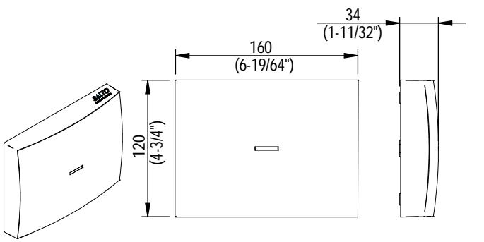
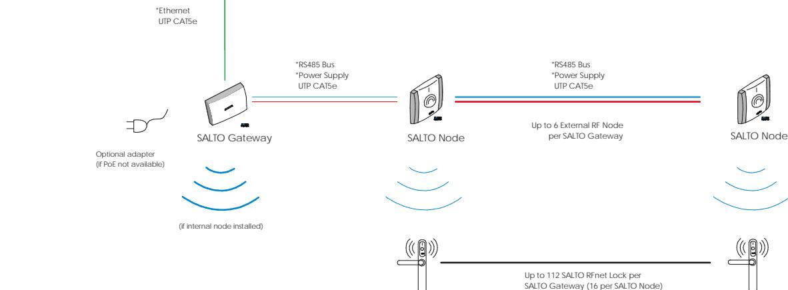
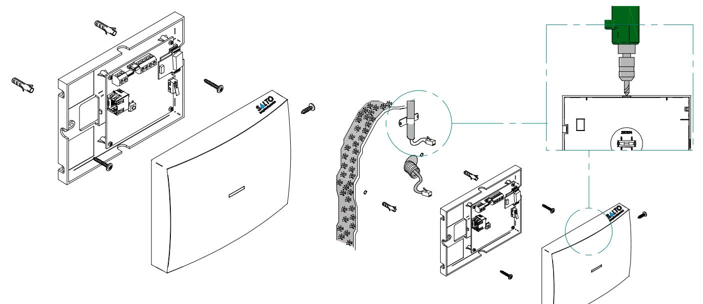
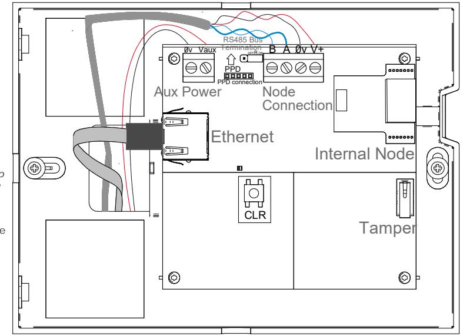
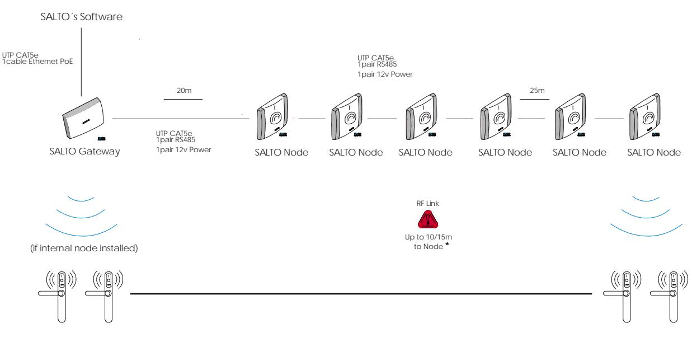

### **Installation guide Eng**

Power Ethernet RS485 bus to Nodes

*Guía de instalación* **E**

Guide d'installation **F**

### **Description Eng**

**The Gateway is the link between the PC and SALTO's wireless network SALTO RFnet or SALTO BLUEnet (wireless escutcheons). It gives real-time information to the PC. Gateways are completely managed through the SALTO Software, it collects all the information sent by escutcheons that belong to the Gateway. It has been designed with PoE technology, capable of power the SALTO Gateway through Ethernet infrastructure.**

### *Descripción*

**E**

*El Gateway hace de enlace entre el PC o servidor, donde se aloja la base de datos (conexión Ethernet estándar RJ45) y la red wireless SALTO RFnet o SALTO BLUEnet (escudos wireless). Los SALTO Gateways son gestionados a través del software de última generación de SALTO Systems, permitiendo que los operadores gestionen y se comuniquen de forma sencilla y segura con todos los puntos de acceso wireless. Dispone de tecnología PoE que le permite alimentarse a través de la infraestructura Ethernet.*

### Description **F**

Le gateway est le lien entre l'ordinateur et le réseau radio-fréquence SALTO RFnet ou SALTO BLUEnet (ensembles plaques béquilles radio-fréquence) de SALTO. Il fournit des informations en temps réel à l'ordinateur. Les gateways sont entièrement gérés par le logiciel de SALTO, qui recueille toutes les informations transmises par les ensembles plaques béquilles appartenant au gateway. Le gateway a été conçu avec la technologie PoE (alimentation électrique par câble Ethernet), qui prend en charge le gateway de SALTO sur l'infrastructure Ethernet. SALTO´s Software

 **Electrical characteristics Eng** *Características eléctricas Caractéristiques électriques* **E F**

# **Operation conditions**

|             | Min | Typ | Max | Unit |
|-------------|-----|-----|-----|------|
| Temperature | 0   | 25  | 60  | ºC   |
| Humidity    | 35  |     | 85  | %    |

# **Cable requirements**

| Ethernet                    | UTP CAT5e                                               |
|-----------------------------|---------------------------------------------------------|
|                             | Node Connection (AB) Generic twisted pair wire Note1 |
| Node Connection (Vdd)24 AWG |                                                         |
|                             |                                                         |

*Complies with IEC 60332 Standard.*

| Frequency Range    | 2400-2483 Mhz | Indoor Radio Range                         | 10/15m |
|--------------------|---------------|--------------------------------------------|--------|
| RF Standard        | IEEE 802.15.4 |                                            |        |
| Indoor Radio Range | 10/15m *   | Max output power                           | 8dBm   |
| Max output power   | 5dBm          |                                            |        |
|                    |               | Note 1: 1x2x24AWG or UTP CAT5e recommended |        |

*(*) Depending upon installed environment.*

## **PoE (IEEE 802.3af)**

|                   |                      | Unit |
|-------------------|----------------------|------|
| Class             | 2                    |      |
| MaxPower          | 5                    | W    |
| Ethernet Standard | 10BASE-T/100BASE- TX |      |

## **Auxiliary Power Supply**

|                               | Min          | Typ | Max                          | Unit |  |
|-------------------------------|--------------|-----|------------------------------|------|--|
| InputVoltageNote 2            | 10           | 12  | 15                           | V    |  |
| Currentconsumption            | 75 Note 3 |     | Note 4 500                   | mA   |  |
| SALTO BLUEnet Characteristics |              |     | (if internal node installed) |      |  |

|                 | SALTO RFnet Characteristics(if internal node installed) |                    |                      |
|-----------------|---------------------------------------------------------|--------------------|----------------------|
|                 |                                                         | Frequency Range    | 2400-2483,5 Mhz      |
|                 |                                                         | RF Standard        | Bluetooth Low Energy |
| Frequency Range | 2400-2483 Mhz                                           | Indoor Radio Range | 10/15m               |

Note 2: Use provided AC-DC power supply Note 3: No external/internal node connected Note 4: 6 external node connected

**European view**

# **Installation guide**

SALTO Gateway

 **Mechanical installation Eng** *Instalación mecánica Installation mécanique* **E F**

# **Electrical installation Eng** *Instalación eléctrica* **E Installation électrique**

- **When PoE and auxiliary power supplies are connected at the same time, Poe is disconnected. - Pressing CLR button 5 seconds, Gateway enters in addressing mode. Eng RS485 bus termination resistor is needed**
- *La alimentación auxiliar prevalece sobre la alimentación PoE en caso de conectar las dos a la vez. - Pulsando el botón CLR 5 segundos, el Gateway entra en modo direccionamiento.* **E**
- **-** Lorsque la PoE et les sources d'alimentation auxiliaires sont connectées simultanément, la PoE est déconnectée. - Appuyer pendant cinq secondes sur le bouton CLR permet de mettre le gateway en mode adressage. **F**
- **(ON position) when the node is located at the end of the bus, or there are not external nodes connected. Eng E**

**F**

- La résistance de terminaison du bus RS485 est nécessaire (position ON) quand le noeud se trouve à la fin du bus ou quand aucun noeud externe n'est connecté. **F**
- *La resistencia de terminación del bus RS485 es necesaria (posición ON) cuando el equipo esté situado en uno de los extremos del bus, o no hay nodos externos conectados.*

**Eng**

La source d'alimentation auxiliaire est nécessaire lorsque l'infrastructure Ethernet n'est pas branchée à la PoE.

**Auxiliary power supply needed when Ethernet infrastructure is not Poe (Power over Ethernet).**

**European view**

# **Installation guide**

SALTO Gateway

# **Configuration Eng** *Configuración* **E Configuration**

# **F**

**Addressing and configuration Eng**

**Gateway is a DCHP ready device. If there is no DCHP server on the local Ethernet network, user can manually configure a fixed IP address changing different parameter using SALTO Gateway Web Server:**

- **1. Pressing CLR button for 5 seconds, SALTO Gateway enters in addressing mode (green**
- **LED turns to orange). 2. Access to 192.168.0.234 IP address with a standard browser and configure network**
- **parameters as needed. 3. Pressing again CLR button for 5 seconds or confirming the configuration, the device is going to quit the addressing mode.**

**When addressing process success, configure the wireless network with SALTO's software (check the help of the application).**

*Direccionamiento y configuración*

- *El SALTO Gateway es un dispositivo que dispone de DHCP. Si no existe un servidor DHCP en la red local Ethernet, el usuario puede configurar una IP fija cambiando diferentes parámetros utilizando el SALTO Gateway Web Server:* **E**
	- *1. Pulsando el botón CLR 5 segundos el SALTO Gateway entra en modo direccionamiento (pasa del LED verde al naranja).*
	- *2. Acceder a la dirección IP 192.168.0.234 a través de un navegador web esándar y configurar los parámetros de red.*
	- *3. Pulsando otra vez el botón de CLR 5 segundos o confirmando la configuración, el dispositivo saldrá del modo direccionamiento.*

*Una vez direccionado, configurar la red wireless a través del software de SALTO (consultar la ayuda del programa).*

### Adressage et configuration **FF**

Le gateway est un appareil prêt pour le protocole DCHP. S'il n'y a aucun serveur DCHP sur le réseau Ethernet local, l'utilisateur peut manuellement configurer une adresse IP fixe en

- modifiant différents paramètres à l'aide du serveur web du gateway de SALTO : 1. Appuyez pendant cinq secondes sur le bouton CLR pour mettre le gateway de SALTO en mode adressage (la LED verte devient orange).
- 2. Accédez à l'adresse IP 192.168.0.234 à l'aide d'un navigateur standard et configurez les paramètres réseau si nécessaire.
- 3. Appuyez de nouveau pendant 5 secondes sur le bouton CLR ou confirmez la configuration, l'appareil quitte alors le mode adressage.

Une fois le processus d'adressage terminé avec succès, configurez le réseau radiofréquence avec le logiciel de SALTO (consultez l'Aide de l'application).

|                                |              |                   | Gatewayo2 |                          |
|--------------------------------|--------------|-------------------|-----------|--------------------------|
| Address configuration:         |              |                   |           | Mac Number: 000A83000010 |
|                                |              | Statio Dynamic |           |                          |
| Ladress :                      | 192          | 168               | 000       | 233                      |
| Netmask:                       | 255          | 255               | 255       | 000                      |
| Gaceway:                       | 192          | 168               | 000       | 001                      |
| C 1 102.168.000.234 1 |              |                   |           | Sond                     |
|                                |              |                   |           |                          |
|                                |              |                   | Gateway02 | Mac Number: 000A93000010 |
| Address configuration :        | C 0       | Statio Dynamic |           |                          |
| Mac Number :                   | 000283000010 |                   |           |                          |

|  | inspired access |
|--|-----------------|

### **Installation example Eng** *Ejemplo de instalación* **E Exemple d'installation F**

*(*) Depending upon installed environment.*

# **European view**

All contents current at time of publication. SALTO Systems S.L. reserves the right to change availability of any item in this catalog, its design, construction, and/or materials.

**3/4**

# **Installation guide**

SALTO Gateway

 **Signalling Eng** *Señalización Signalisation* **E**

**F**

## **The LED in the top layer of the Gateway shows the state of the system**

| Red            | Gateway in "Bootloader mode" state |  |  |
|----------------|------------------------------------|--|--|
| Flashing Green | No initialized by SALTO's software |  |  |

**The LEDs on the Ethernet Connector show the state of the Ethernet communication**

| LED COLOR       | DESCRIPTION                                 |
|-----------------|---------------------------------------------|
| No light        | No Ethernet Connection                      |
| Green           | Ethernet active                             |
| Flashing Orange | Data transfer taking place through Ethernet |

**Los LED del Gateway indican en todo momento el estado del sistema**

| COLOR LED | DESCRIPCIÓN              |  |  |
|-----------|--------------------------|--|--|
| No luz    | Alimentación no presente |  |  |
|           |                          |  |  |
|           |                          |  |  |
|           |                          |  |  |
|           |                          |  |  |

### **Operational test Test operacional Test de fonctionnement Eng E F**

**Once the product is installed, follow these steps to check the correct operation: Eng**

- **Visually chek that the LED is active after power on.**
- **When nodes and locks are installed, check that the LED is green.**
- **Check Ethernet connector LED to know communication state.**
- *Una vez instalada la unidad de control, para comprobar el correcto funcionamiento de la instalación, siga los siguiente pasos: - Comprobar visualmente que al alimentar el equipo el LED está activo.* **E**
	- *Comprobar que al instalar los nodos y las cerraduras el LED está en verde-*
	- *Para saber el estado de la conexión Ethernet, comprobar el estado de los LEDs.*

Lorsque le produit est installé, suivez ces étapes pour vérifier le bon fonctionnement: **F**

- *-* Vérifiez visuellement que la LED est allumée une fois effectuée la mise sous tension.
- *-* Lorsque les noeuds et les serrures sont installés, vérifiez que la LED est verte.
- *-* Vérifiez la LED du connecteur Ethernet pour connaître l'état de la communication.

### **Operational test Test operacional Test de fonctionnement Eng E F**

**This unit should be tested at least once a year as described in "Operational Test". Eng**

*Es recomendable realizar un testeo operacional una vez al año siguiendo el "Test Operacional".* **E**

Cette unité doit être testée au moins une fois par an comme décrit dans « Test de fonctionnement ». **F**

**Los LED situados en el conector Ethernet indican el estado de la conexión**

| LED COLOR | DESCRIPTION                  | LED COLOR        | DESCRIPTION                   |
|-----------|------------------------------|------------------|-------------------------------|
| No light  | Lack of power supply         | No luz           | Sin conexión Ethernet         |
| Green     | Everything is OK             | Verde            | Ethernet activo               |
| Orange    | Gateway in "Addressing mode" | Parpadeo Naranja | Transferencia de datos activa |

# **La LED située sur la couche supérieure du Gateway indique l'état dy système**

| LED COLOR                                                         | DESCRIPTION                                 |                 | COULEURS DE LA LED                                       | DESCRIPTION                                           |
|-------------------------------------------------------------------|---------------------------------------------|-----------------|----------------------------------------------------------|-------------------------------------------------------|
| No light                                                          | No Ethernet Connection                      |                 | Éteint                                                   | Absence d'alimentation électrique                     |
| Green                                                             | Ethernet active                             |                 | Vert                                                     | Tout fonctionne correctement                          |
| Flashing Orange                                                   | Data transfer taking place through Ethernet |                 | Orange                                                   | L'état du Gateway est en "mode adressage"             |
|                                                                   |                                             |                 | Rouge                                                    | L'état du Gateway est en "mode chargeur de démarrage" |
| Los LED del Gateway indican en todo momento el estado del sistema |                                             | Vert clignotant | Le Gateway n'est pas initialisé par le logiciel de SALTO |                                                       |

**Les LED situées sur le connecteur Ethernet indiquent l'état de la communication Ethernet**

| Verde          | El sistema funciona correctamente     | COULEURS DE LA LED | DESCRIPTION                                |
|----------------|---------------------------------------|--------------------|--------------------------------------------|
| Naranja        | Gateway en "Modo direccionamiento"    | Éteint             | Pas de connexion Ethernet                  |
| Rojo           | Gateway en "Bootloader"               | Vert               | Connexion Ethernet active                  |
| Parpadeo Verde | No inicializado por el software SALTO | Orange clignotant  | Transfert de données en cours via Ethernet |