#### VIKTIG INFORMATION

Läs bifogad installationsanvisning noggrant innan installation. Eltryckeslåsets måttskiss är inkluderad i förpackningen. Vid installation av produkten måste varningar och allmänna instruktioner följas. All bifogad dokumentation måste överlämnas av installatör till användare.

Före installation, säkerställ att dörr, karm är i gott skick och att rätt dörrhängning i kombination med beslag överensstämmer. Kontrollera certifikat innan installation i branddörr för att säkerställa att rätt kombination används. Kontrollera att dörrens konstruktion tillåter användning av eltryckeslås. Kan användas i dubbel svängdörr om dörrens konstruktion tillåter eltryckeslås. Beroende på dörrtyp (trä, stål eller aluminium) kan olika montage behövas (låshusstolpe eller skruv). Vid installation i pardörr med dörrstängare, kontrollera om dörrkoordinator krävs.

Under installation måste annan beslagning t.ex. tätningslister hanteras varsamt så att funktion på varken eltryckeslås eller övrig beslagning påverkas. Var observant att urtag överensstämmer med låshusstolpens måttskiss.

|               | Stendals EL AB Signalistgatan 17 721 31 Västerås, Sweden |   |   |          |  |  |  |
|---------------|----------------------------------------------------------------|---|---|----------|--|--|--|
| 0402 - 120-01 |                                                                |   |   | STEP 120 |  |  |  |
| EN 14846:2008 | 3                                                              | X | 8 |          |  |  |  |

KONTAKTA OSS

Kom ihåg att du alltid är välkommen att kontakta oss om du behöver hjälp. Maila eller ring vår tekniska support på info@steplock.se eller 021-480 12 13.

Efter installation, säkerställ att alla skruvar är åtdragna, skruvhuvuden inte sticker upp och att dörrbladet löper fritt.

För användning tillsammans med typgodkända dörrar i högst brandteknisk klass E/EI120. Kontrollera att dörrens godkännande tillåter användning av eltryckeslås enligt denna installationsanvisning.

Elektromekaniskt lås avsett för montage i dörrar med max vikt 200 kg. PGA11312A, STEP 120 i enkeldörr av oisolerade stålprofiler.

Säkerhetsegenskaperna på denna produkt är avgörande för dess överensstämmelse med EN 14846. Inga ändringar av något slag, andra än de som beskrivs i dessa anvisningar är tillåtna.

#### När det måste fungera.

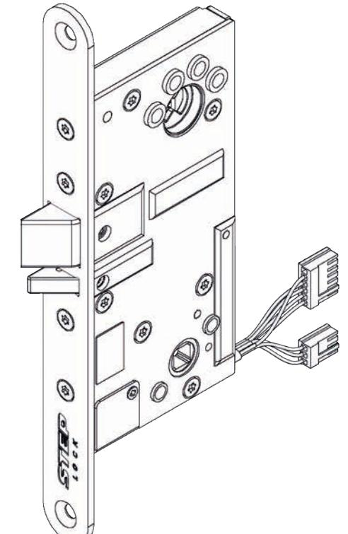

# Installationsanvisning STEP 120TM

Utgåva 5, 2019-10-20

## INNEHÅLL

| Teknisk specifikation STEP 120        | Symmetrisk/osymmetrisk låshusstolpe8 |
|---------------------------------------|--------------------------------------|
| - Måttskiss2                          | Urtagsritning9                       |
| - Artikelnummer, tekniska egenskaper3 | Installationsanvisning10             |
| - Strömförbrukning, kopplingsschema3  | Underhållsanvisning11                |
| Tillbehör4                            | Viktig information och CE-märkning12 |
| Kabelöverföring5                      | Kontakta oss12                       |
| Justering av ställbara funktioner6    |                                      |

### TEKNISK SPECIFIKATION STEP 120

### MÅTTSKISS

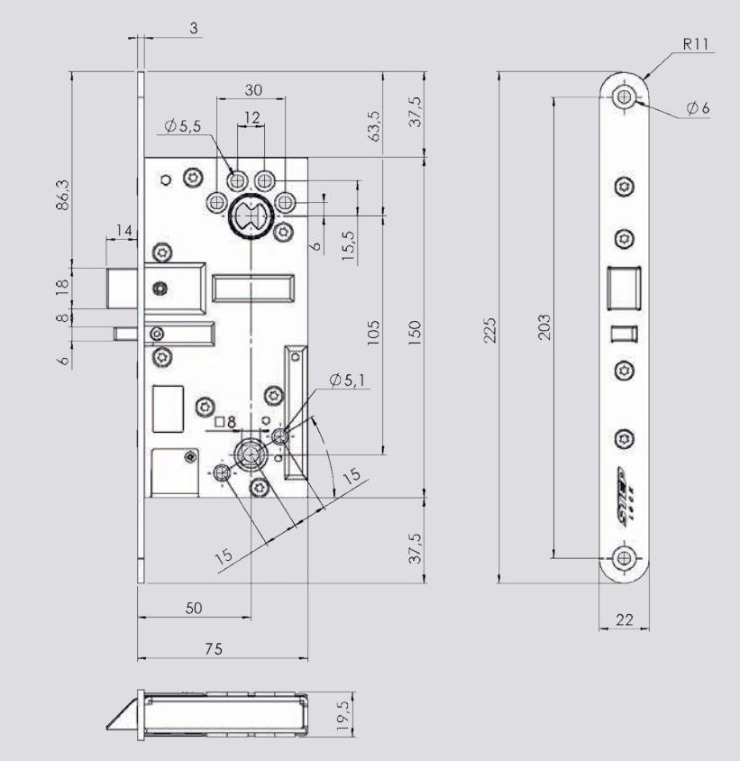

#### AVLÄGSNA TRYCKESPINNEN (gäller för art.nr ST120 och ST120-12)

För att kunna lossa tryckespinnen måste fjädern bakom tryckesroddaren tryckas ner. Använd en spårmejsel för att trycka ner fjädern och dra därefter tryckespinnen rakt ut.

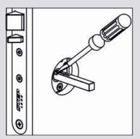

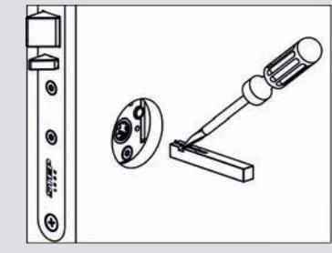

### UNDERHÅLLSANVISNING

- Kontrollera regelbundet eltryckeslåsets funktion.
- Kontrollera alltid eltryckeslåsets funktion i samband med provning av brandcellsgränser, utrymningsvägar eller liknande.
- Kontrollera regelbundet eltryckeslåsets fastsättning i dörrbladet samt monterade vred, trycken, cylindrar och slutbleck.
- Två gånger per år, eller vid behov, ska fallkolven och förreglingen smörjas med fett. Använd ett tunt skikt av DIN 51502 fett.
- Observera att eltryckeslåset aldrig får smörjas med olja.

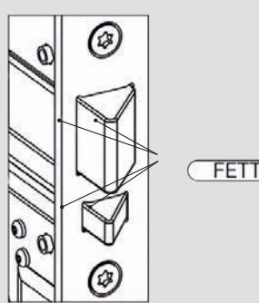

### INSTALLATIONSANVISNING

- 1. Se till att urtaget är rengjort från flisor och spån.
- 2. Anslut kontakterna.
- 3. Fäll in eltryckeslåset i dörrbladet och fixera stolpen med två skruvar. Använd bifogade FXTB 4,5x30 FZB i trädörrar och MFX M5x16 FZB i stål-/aluminiumdörrar.

Var noga med att kabeln inte kläms när eltryckeslåset fälls in.

- 4. Säkerställ att dörrspringan mellan låshusstolpen och slutblecket/ elslutbleckets montagestolpe är 3 mm + 2 mm / - 1 mm.
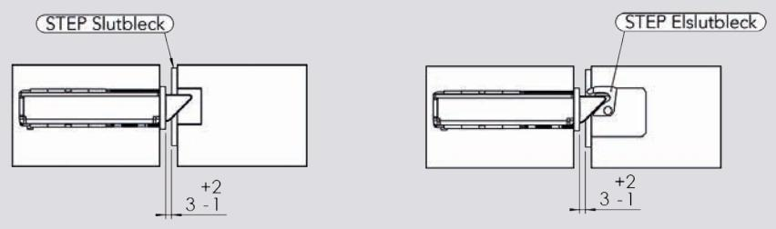

- 5. Gäller för art.nr ST120 och ST120-12. För in de två tryckespinnarna mot respektive sidas tryckesroddare. Använd en spårmejsel för att trycka ner fjädern och för sedan tryckespinnen rakt in. Säkerställ att tryckespinnens fjäder hakar i ordentligt bakom tryckesroddaren.
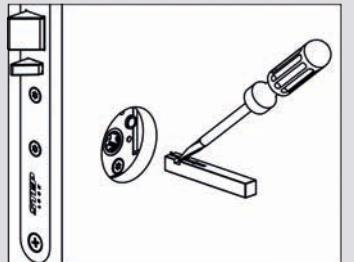

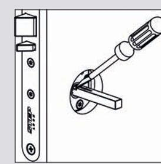

Observera att eltryckeslåset inte får övermålas.

### ARTIKELNUMMER OCH TEKNISKA EGENSKAPER

| Artikelnummer | Benämning                                                                  |
|---------------|----------------------------------------------------------------------------|
| ST120         | STEP 120 eltryckeslås, 24 V DC, klassisk kolvplacering, split funktion.    |
| ST120 KPL     | STEP 120 komplett set. Inklusive ST120, kabelöverföring och 10 m kabel.    |
| ST120-12      | STEP 120 eltryckeslås, 12 V DC, klassisk kolvplacering, split funktion.    |
| ST120-12 KPL  | STEP 120 komplett set. Inklusive ST120-12, kabelöverföring och 10 m kabel. |
| ST122         | STEP 120 eltryckeslås, 24 V DC, klassisk kolvplacering.                    |
| ST122 KPL     | STEP 120 komplett set. Inklusive ST122, kabelöverföring och 10 m kabel.    |
| ST122-12      | STEP 120 eltryckeslås, 12 V DC, klassisk kolvplacering.                    |
| ST122-12 KPL  | STEP 120 komplett set. Inklusive ST122-12, kabelöverföring och 10 m kabel. |

- Durability: Grade X enligt SS-EN 14846.
- Brandprovad för brandteknisk klass E/EI 120.
- Mikrobrytare enpoligt växlande, max. 30 V DC, 1 A.
- Dorndjup 50 mm.
- Inbyggda mikrobrytare indikerar stängt och förreglat läge samt tryckesmanövrering.
- Skyddsdiod finns inbyggd.
- Vändbar för att passa höger- och vänsterdörrar.
- Omställbar rättvänd/omvänd funktion.
- Omställbar elektriskt/mekaniskt manövrerad sida.
- Anpassat för runda och ovala skandinaviska cylindrar.
- Återfjädrande trycken rekommenderas.

### STRÖMFÖRBRUKNING OCH KOPPLINGSSCHEMA

#### Strömförbrukning i rättvänd och omvänd funktion

| 24 V DC + 15 % - 10 % | Max 60 mA  |
|-----------------------|------------|
| 12 V DC + 15 % - 10 % | Max 120 mA |

Strömförbrukning 0 mA i vila (rättvänd = låst, omvänd = olåst)

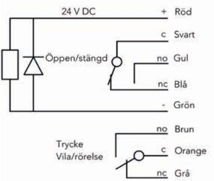

## TILLBEHÖR

Följande skruv- och kontaktkit levereras som standard:

| Artikelnr. | Benämning                                                                                                                                                                                                 |
|------------|-----------------------------------------------------------------------------------------------------------------------------------------------------------------------------------------------------------|
| ST1087     | Skruv- och kontaktkit: - 2 st träskruvar FXTB 4,5x30 FZB - 2 st maskingängade skruvar MFX M5x16 FZB - 1 st kopplingsplint och stift hane 6-polig - 1 st kopplingsplint och stift hane 3-polig |

Art.nr ST120, ST120-12, ST120 KPL och ST120-12 KPL levereras inklusive två tryckespinnar:

| Artikelnr. | Benämning                         |
|------------|-----------------------------------|
| ST1088-50  | 1 st STEP Tryckespinne, 8x8x50 mm |
| ST1088-60  | 1 st STEP Tryckespinne, 8x8x60 mm |

#### TRYCKESPINNAR

Dörrens tjocklek samt vilket trycke som ska användas, styr hur långa tryckespinnarna bör vara. Tabellen nedan visar hur tryckespinnarnas längd, L-A och L-B, kan styras av måtten A och B. Observera att även tryckets djup kan påverka valet av tryckespinnar.

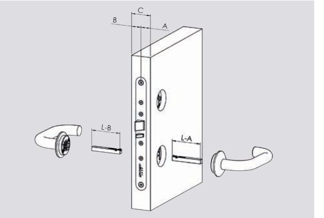

| A eller B  | L-A eller L-B |
|------------|---------------|
| 15 - 20 mm | 40 mm         |
| 18 - 30 mm | 50 mm         |
| 28 - 40 mm | 60 mm         |
| 38 - 50 mm | 70 mm         |
| 48 - 60 mm | 80 mm         |
| 58 - mm    | 90 mm         |

### TILLBEHÖR KOMPLETT SET

ST120 KPL, ST120-12 KPL, ST122 KPL och ST122-12 KPL är kompletta set som inkluderar eltryckeslåset, tillbehören beskrivet ovan, samt följande:

| Artikelnr. | Benämning                                          |
|------------|----------------------------------------------------|
| ST1086     | 10 m halogenfri kabel, 12 ledare                   |
| ST1283     | STEP Kabelöverföring. Innerdiameter fjäder 10,8 mm |

### URTAGSRITNING

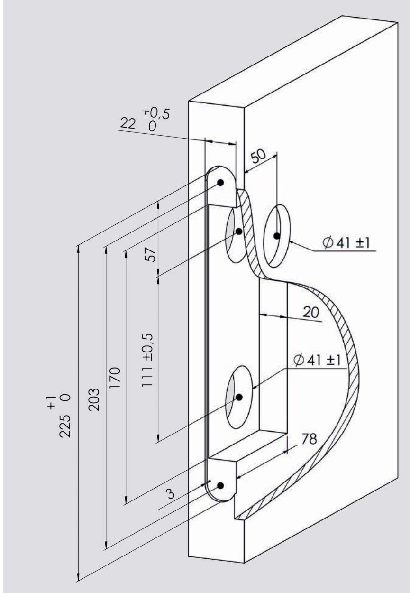

## SYMMETRISK/OSYMMETRISK LÅSHUSSTOLPE

STEP 120 levereras med en symmetrisk låshusstolpe som standard.

I sortimentet finns en osymmetrisk låshusstolpe för montage av STEP 120 i dörrar med osymmetriskt urtag.

| Artikelnr. | Benämning                             |
|------------|---------------------------------------|
| ST1293     | Osymmetrisk låshusstolpe för STEP 120 |
|            |                                       |
|            |                                       |

### BYTE AV LÅSHUSSTOLPE

1. Skruva ur de fyra skruvarna som fixerar den symmetriska låshusstolpen . A

2. Byt till den osymmetriska låshusstolpen och fixera åter de fyra skruvarna med 3 Nm återdragsmoment. B

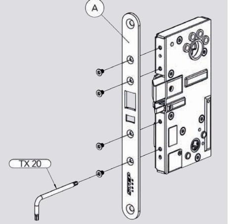

## KABELÖVERFÖRING

STEP Kabelöverföring är tillverkad i rostfritt stål och passar både trä-, stål- och aluminiumdörrar. Fjädern har en bred innerdiameter på 10,8 mm som underlättar genomföringen av kabeln.

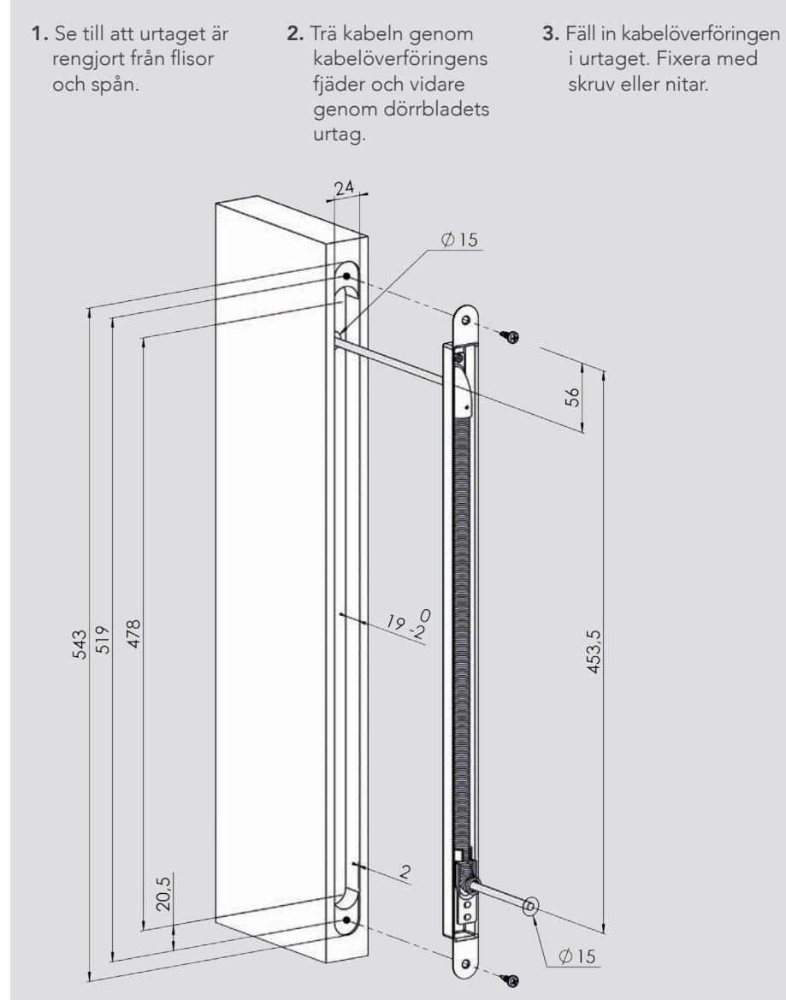

## ÄNDRA MEKANISKT STYRD SIDA (gäller för ST120 och ST120-12) STÄLLBARA FUNKTIONER

STEP 120 har flera ställbara funktioner. Samtliga funktioner kan ändras genom enkla justeringar på låshusets utsida.

- STEP 120 levereras som standard med rättvänd funktion för högerhängd dörr.
- STEP 120 med artikelnummer ST120 och ST120-12 levereras med splitfunktion där höger sida är mekaniskt styrd och vänster sida är elektriskt styrd.
- STEP 120 med artikelnummer ST122 och ST122-12 levereras utan splitfunktion där båda sidor är elektriskt styrda.

### ÄNDRA FRÅN HÖGER- TILL VÄNSTERHÄNGD DÖRR

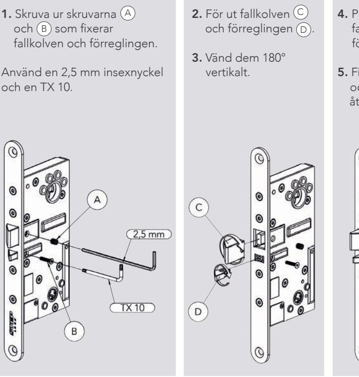

- 4. Placera tillbaka fallkolven och förreglingen.
- 5. Fixera med 2 Nm och med 1,8 Nm återdragsmoment. A B

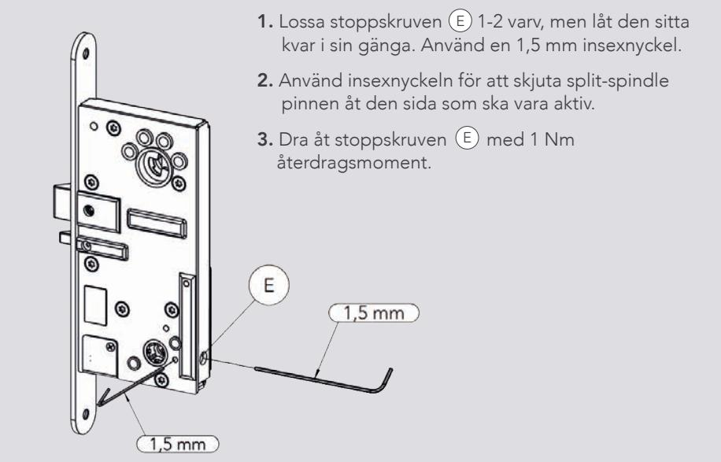

### ÄNDRA FRÅN RÄTTVÄND TILL OMVÄND FUNKTION

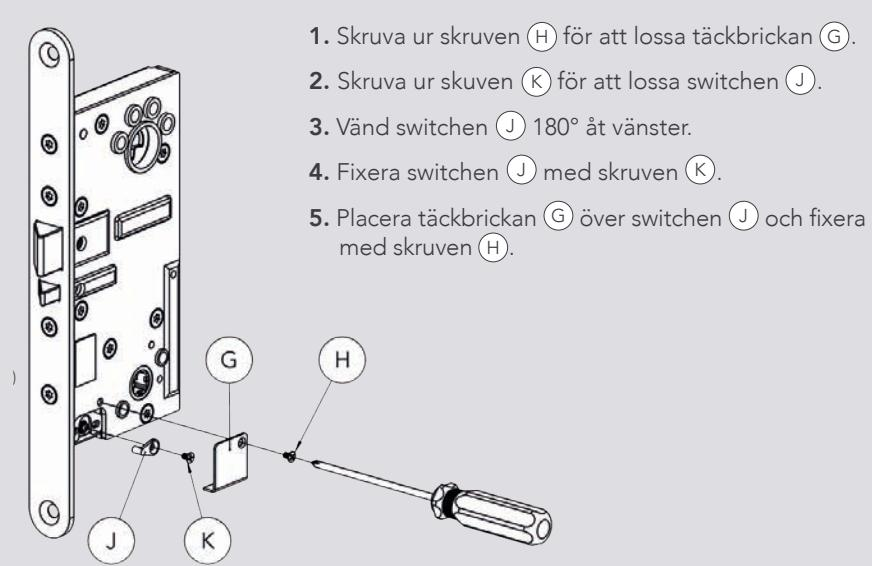