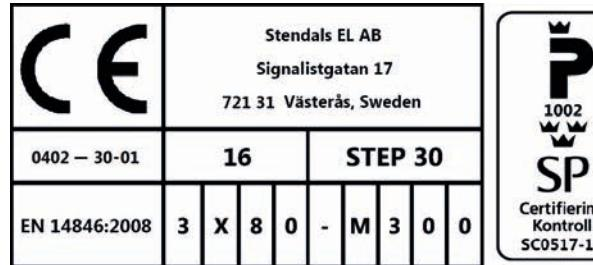
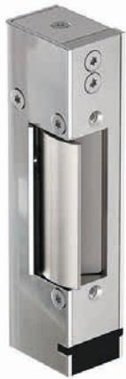
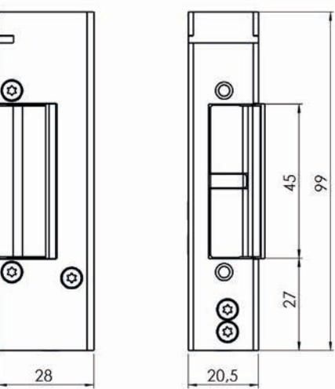
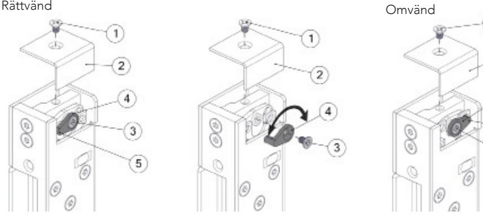
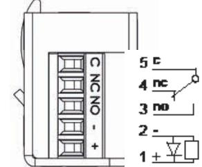
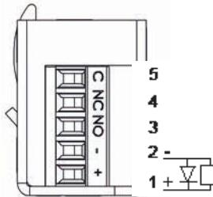
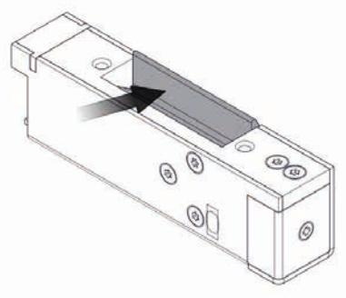

| Artikelnummer | Benämning                                                  |
|---------------|------------------------------------------------------------|
| ST30          | Rättvänd funktion 24V Dc                                   |
| ST30-12       | Rättvänd funktion 12V Dc                                   |
| ST300         | Rättvänd funktion 24V Dc inkl. kolvkontakt                 |
| ST300-12      | Rättvänd funktion 12V Dc inkl. kolvkontakt                 |
| ST31          | Omvänd funktion 24V Dc                                     |
| ST31-12       | Omvänd funktion 12V Dc                                     |
| ST301         | Omvänd funktion 24V Dc inkl. kolvkontakt                   |
| ST301-12      | Omvänd funktion 12V Dc inkl. kolvkontakt                   |
| ST35          | Ställbar rättvänd-omvänd funktion 24V Dc                   |
| ST35-12       | Ställbar rättvänd-omvänd funktion 12V Dc                   |
| ST305         | Ställbar rättvänd-omvänd funktion 24V Dc inkl. kolvkontakt |
| ST305-12      | Ställbar rättvänd-omvänd funktion 12V Dc inkl. kolvkontakt |

### Strömförbrukning

| 24 VDC +15% / -10%   | 12 VDC +15% / -10%   |
|----------------------|----------------------|
| 110 mAh / max 300 mA | 220 mAh / max 600 mA |

Läs bifogad installationsanvisning noggrant innan installation. Montagestolpens måttskiss är inkluderad i stolpens förpackning. Vid installation av produkten måste varningar och allmäna instruktioner följas. All bifogad dokumentation måste överlämnas av installatör till användare.

Före installation, säkerställ att dörr, karm är i gott skick och att rätt dörrhängning i kombination med beslag överensstämmer. Kontrollera certifikat innan installation i branddörr för att säkerställa att rätt kombination används. Kontrollera att dörrens konstruktion tillåter användning av elslutbleck. Kan användas i dubbel svängdörr om dörrens konstruktion tillåter elslutbleck. Beroende på dörrtyp (trä, stål eller aluminium) kan olika montage behövas (montagestolpe eller skruv). Vid installation i pardörr med dörrstängare, kontrollera om dörrkordinator krävs.

Under installation måste annan beslagning t.ex. tätningslister hanteras varsamt så att funktion på varken elslutbleck eller övrig beslagning påverkas. Var observant att urtag överensstämmer med montagestolpens måtskiss.

Efter installation, säkerställ att alla skruvar är åtdragna, skruvhuvuden inte sticker upp och att dörrbladet löper fritt.

Säkerhetsegenskaperna på denna produkt är avgörande för dess överensstämmelse med EN 14846. Inga ändringar av något slag, andra är de som beskrivs i dessa anvisningar är tillåtna.

Stendals El AB Signalistgatan 17 721 31 Västerås, Sweden +46 21-18 97 50 info@steplock.se www.steplock.se

2016-10-18 utgåva 3 Produkten är patenterad

# Installationsanvisning STEP 30 PreloadTM

Artikelnr. ST30, ST300, ST31, ST301, ST35, ST305, ST30-12, ST300-12, ST31-12, ST301-12, ST35-12, ST301-12

STEP 30 PreloadTM elslutbleck är konstruerat för att fungera under lång tid och klara många öppningscykler. Elslutblecket är vändbart för höger respektive vänsterhängda dörrar.

Listtrycksteknik möjliggör upplåsning trots tryck mot elslutblecket. Elslutblecket är omställbart från rättvänd till omvänd funktion (ST35, ST305, ST35-12 ST305-12).

#### Anpassade låshus

Enkel- och dubbelfall-lås i Connect serien Enkel- och dubbelfall-lås i Modul serien Enkel- och dubbelfall-lås i Smalprofil serien

# Måttskiss STEP 30

- Montera montagestolpen med 2st skruvar M4X6 TUFLOK (bifogas i stolpförpackning).
- Orginalstolpe måste användas, se respektive montageritning för att få rätt placering mot låshus.
- För att erhålla en god funktion skall dörrspringan mellan låshusets stolpe och elslutbleckets monteringsstolpe vara 3mm ± 1mm.
- Det skall finnas ett glapp mellan låsets fallkolv och elslutbleckets vridfall som skall vara 1mm ± 0,5mm.
- Undvik fil- och smärgelspån, då detta stör elslutbleckets funktion. Efter att urtag för slutblecket gjorts i karmen, skall urtaget rengöras så att inga flisor finns kvar.
- Var noga med att kabeln inte kläms när slutblecket trycks in i karmen.
- Elslutbleck eller montagestolpe får ej övermålas.

# Omställbart från rättvänd till omvänd funktion

### (ST35, ST305, ST35-12, ST305-12)

Elslutbleck STEP 30 PreloadTM kan lätt ställas om från rättvänd funktion (standard) till omvänd funktion.

- 1. Lossa skruven(1) för locket.
- 2. Ta bort locket(2).
- 3. Lossa skruven(3) i switchen(4)
- 4. Lyft upp switchen och byt till andra sidans hål enligt skiss.
- 5. Se till att axeln på switchen går igenom båda hålen(5).
- 6. Skruva fast switchen(4) med skruven(3).
- 7. Montera tillbaka locket(2) med skruven(1).

Elslutblecket skall matas med fast stabiliserad likspänning, som aviker max +15% / -10% från märkspänningen. STEP 30 PreloadTM har inbyggd skyddsdiod.

## Med kolvkontakt

(ST300, ST301, ST305, ST300-12, ST301-12, ST305-12)

Spänning enl. specifikation 24V Dc alt. 12V Dc

Indikering kolvkontakt öppen / stängd dörr

Utan kolvkontakt (ST30, ST31, ST35, ST30-12, ST31-12, ST35-12)

> Spänning enl. specifikation 24V Dc alt. 12V Dc

# Teknisk specifikation

- Vridfall i härdat ytbehandlat stål, låshus och monteringsstolpe i rostfritt stål.
- Inbyggd indikering för avkänning att dörren är stängd/öppen (kolvkontakt) för koppling till passersystem, larmanläggning etc. (ST300, ST301, ST305, ST300-12, ST301-12, ST305-12)
- Brythållfasthet 5kN (500kg)
- Garanterar öppning trots listtryck (400N,≈40kg) i rättvänd och omvänd funktion
- Knackskyddad
- Mikrobrytare enpoligt växlande
- Max. 30 VDC, 1 A
- Inbyggt transientskydd

# Underhållsanvisning

- Elslutbleckets funktion skall kontrolleras med jämna mellanrum.
- Elslutbleckets fastsättning i karm bör kontrolleras 2 ggr/år.
- Smörjning av vridfallen skall ske enligt bild med tunt skikt låsfett (DIN 51502) 2ggr/år. Olja får aldrig användas.

