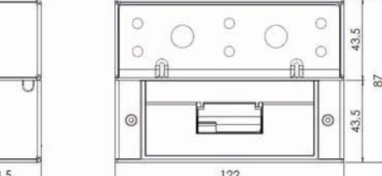
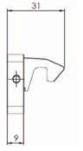
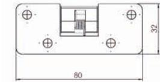
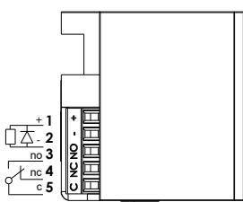

## VIKTIG INFORMATION

Läs bifogad installationsanvisning noggrant innan installation. Vid installation av produkten måste varningar och allmänna instruktioner följas. All bifogad dokumentation måste överlämnas av installatör till användare.

Före installation, säkerställ att dörr, karm är i gott skick och att rätt dörrhängning i kombination med beslag överensstämmer.

Kontrollera att dörrens konstruktion tillåter användning av ellås. Kan användas i dubbel svängdörr om dörrens konstruktion tillåter ellås. Beroende på dörrtyp (trä, stål eller aluminium) kan olika montage behövas (vinkelkonsol eller skruv). Vid installation i pardörr med dörrstängare, kontrollera om dörrkoordinator krävs.

|               | Stendals EL AB Signalistgatan 17 721 31 Västeras, Sweden |   |   |   |  |  |  |  |  |
|---------------|----------------------------------------------------------------|---|---|---|--|--|--|--|--|
| 0402 - 8-01   | STEP 8                                                         |   |   |   |  |  |  |  |  |
| EN 14846:2008 | 3                                                              | X | 8 | O |  |  |  |  |  |

KONTAKTA OSS

Kom ihåg att du alltid är välkommen att kontakta oss om du behöver hjälp. Maila eller ring vår tekniska support på info@steplock.se eller 021-480 12 13.

Under installation måste annan beslagning t.ex. tätningslister hanteras varsamt så att funktion på varken ellås eller övrig beslagning påverkas. Var observant att fästplaceringen överensstämmer med ellåsets och hakens måttskiss.

Efter installation, säkerställ att alla skruvar är åtdragna, skruvhuvuden inte sticker upp och att dörrbladet löper fritt.

Säkerhetsegenskaperna på denna produkt är avgörande för dess överensstämmelse med EN 14846.

Inga ändringar av något slag, andra är de som beskrivs i dessa anvisningar är tillåtna.

STEP 8 utan vinkelkonsoll.

STEP 8 med vinkelkonsoll med hus. Hake.

Installationsanvisning STEP 8TM

2021, utgåva 1

När det måste fungera.

## INSTALLATIONSANVISNING

- Anslut kontakterna i kopplingsplinten.
- Förborra hålen i karmen, använd den bifogade borrmallen.
- Montera STEP 8 med de bifogade skruvarna.
- Montera haken med de bifogade skurvarna.
- Säkerställ att det finns ett glapp mellan ellåsets vridfall och haken på 1 mm ± 0,5 mm.
- Observera att STEP 8 får ej övermålas.

# UNDERHÅLLSANVISNING

- Kontrollera regelbundet det utanpåliggande ellåsets funktion.
- Kontrollera regelbundet det utanpåliggande ellåset samt hakens fastsättning i karmen.
- Två gånger per år, eller vid behov, ska vridfallet smörjas med fett. Använd ett tunt skikt av DIN 51502 fett.
- Observera att STEP 8 aldrig får smörjas med olja.

## STRÖMFÖRBRUKNING OCH KOPPLINGSSCHEMA

| Strömförbrukning i rättvänd och omvänd funktion* F |                      |  |  |  |
|-------------------------------------------------------|----------------------|--|--|--|
| 24 V DC + 15 % - 10 %                                 | 110 mAh / max 300 mA |  |  |  |
| 12 V DC + 15 % - 10 %                                 | 220 mAh / max 600 mA |  |  |  |

D

C

B

A

E * Strömförbrukning 0 mA för vridfall i vila (rättvänd = låst, omvänd = olåst)

0

SS-ISO2768-1m

Revision Sheet

4 3 2 1

Inkoppling sker med skruvplint.

4 3 2 1

Title/Description Drawing no.

Designed by General tolerance Viewing Scale

Surface finish

2:1 Material Step 8 ST880

This document shall not be copied without owners written allowance and its content shall not be exposed for third part nor be used for unauthorized purpose.

B

A

Owner

Stendals El AB

F

E

D

C

## ARTIKELNUMMER

| Art.nr   | Beskrivning                                                                                               |
|----------|-----------------------------------------------------------------------------------------------------------|
| ST880    | Utanpåliggande lås STEP 8. Rättvänd funktion 24 V DC. Inkl. hake.                                         |
| ST880-12 | Utanpåliggande lås STEP 8. Rättvänd funktion 12 V DC. Inkl. hake.                                         |
| ST881    | Utanpåliggande lås STEP 8. Omvänd funktion 24 V DC. Inkl. hake.                                           |
| ST881-12 | Utanpåliggande lås STEP 8. Omvänd funktion 12 V DC. Inkl. hake.                                           |
| ST890    | Utanpåliggande lås STEP 8. Rättvänd funktion 24 V DC. Inkl. hake och vinkelkonsoll med hus, 90 grader. |
| ST890-12 | Utanpåliggande lås STEP 8. Rättvänd funktion 12 V DC. Inkl. hake och vinkelkonsoll med hus, 90 grader. |
| ST891    | Utanpåliggande lås STEP 8. Omvänd funktion 24 V DC. Inkl. hake och vinkelkonsoll med hus, 90 grader.   |
| ST891-12 | Utanpåliggande lås STEP 8. Omvänd funktion 12 V DC. Inkl. hake och vinkelkonsoll med hus, 90 grader.   |
| Art.nr   | Beskrivning tillbehör                                                                                     |
| ST860    | Vinkelkonsoll med hus, 90 grader.                                                                         |
| ST861    | Vinkelkonsoll. Anpassad för skjutdörr.                                                                    |
| ST862    | Vinkelkonsoll med hus, 45 grader.                                                                         |
| ST863    | Fästplatta.                                                                                               |
| ST864    | Hake.                                                                                                     |
| ST870    | Glasbeslag.                                                                                               |
| ST9088   | Distansplatta.                                                                                            |
| ST9088   | ST860 ST861 ST862 ST863 ST864 ST870                                                        |
|          |                                                                                                           |

## TEKNISK INFORMATION

- Durability: Grade X enligt SS-EN 14846.
- Corrosion: Grade M enligt SS-EN 14846.
- Omvänd funktion anpassad till krav enligt SS-EN 13637.
- Mikrobrytare enpoligt växlande, max. 30 V DC, 1A.
- Skyddsdiod finns inbyggd.
- Inbyggd indikering för avkänning att dörren är stängd/öppen (kolvkontakt).
- Brythållfasthet 9 kN (≈ 900 kg).
- Garanterar öppning trots listtryck på 1,5 kN (≈ 150 kg) i rättvänd och omvänd funktion.
- Knacksäkrad.
- Vändbar för att passa höger- och vänsterhängda slagdörrar.
- Anpassad för skjutdörrar.