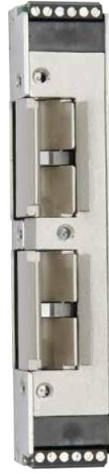
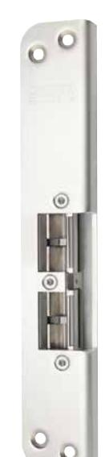
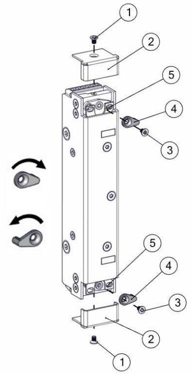
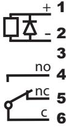
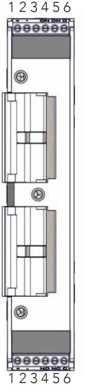

## Underhållsanvisning

- Elslutbleckets funktion skall kontrolleras med regelbundna mellanrum i samband med provning av brandcellsgränser och utrymningsvägar eller liknande.
- Elslutbleckets fastsättning i karm bör kontrolleras 2 ggr/år.
- Smörjning av vridfallen skall ske med tunt skikt låsfett (DIN 51502) 2ggr/år. Olja får aldrig användas.

# Installationsanvisning STEP 92 ReleaseTM

Artikelnr. ST925HP, ST925HP-12

STEP 92 ReleaseTM elslutbleck är konstruerat för att användas tillsammans med dubbelfallås och klara brandigenhållning och utrymning i kombination med dörrautomatik eller draghandtag. Det övre och undre vridfallet kan separat ställas i rättvänd eller omvänd funktion. Både vridfallet för tryckesfall och cylinderfall hanterar listtryck, vilket ger en driftsäker öppning med automatiska dörröppnare. Elslutblecket är vändbart för höger respektive vänsterhängda dörrar. Passar både enkeldörr och pardörr.

Anpassade låshus

Enkel- och dubbelfall-lås i Kaba 1400-serien Enkel- och dubbelfallås i Connect serien Enkel- och dubbelfallås i Modul serien Enkel- och dubbelfallås i Smalprofil serien

## Artikelnummer

| ST925HP    | Ställbar rättvänd-omvänd funktion 24V Dc inkl. kolvkontakt |
|------------|------------------------------------------------------------|
| ST925HP-12 | Ställbar rättvänd-omvänd funktion 12V Dc inkl. kolvkontakt |

### Strömförbrukning per vridfall*

| 24 VDC +15% / -10%  | 12 VDC +15% / -10%  |  |  |  |  |
|---------------------|---------------------|--|--|--|--|
| 110 mAh / max 300mA | 220 mAh / max 600mA |  |  |  |  |

*Strömförbrukning 0mA för vridfall i vila (rättvänd = låst, omvänd = olåst)

Läs bifogad installationsanvisning noggrant innan installation. Montagestolpens måttskiss är inkluderad i stolpens förpackning. Vid installation av produkten måste varningar och allmäna instruktioner följas. All bifogad dokumentation måste överlämnas av installatör till användare.

Före installation, säkerställ att dörr, karm är i gott skick och att rätt dörrhängning i kombination med beslag överensstämmer. Kontrollera certifikat innan installation i branddörr för att säkerställa att rätt kombination används. Kontrollera att dörrens konstruktion tillåter användning av elslutbleck. Kan användas i dubbel svängdörr om dörrens konstruktion tillåter elslutbleck. Beroende på dörrtyp (trä, stål eller aluminium) kan olika montage behövas (montagestolpe eller skruv). Vid installation i pardörr med dörrstängare, kontrollera om dörrkordinator krävs.

Under installation måste annan beslagning t.ex. tätningslister hanteras varsamt så att funktion på varken elslutbleck eller övrig beslagning påverkas. Var observant att urtag överensstämmer med montagestolpens måttskiss.

Efter installation, säkerställ att alla skruvar är åtdragna, skruvhuvuden inte sticker upp och att dörrbladet löper fritt.

För användning tillsammans med typgodkända dörrar i högst brandteknisk klass E120/EI120. Kontrollera att dörrens godkännande tillåter användning av elslutbleck enligt denna installationsanvisning.

Elslutbleck med två vridfall för enkel- och dubbelfallås. Vridfall till enkelfallås skall utföras med rättvänd funktion. Minst ett vridfall till dubbelfallås skall vara i rättvänd funktion.

3P08266, Step 92 i enkeldörr av trä

4P04083, Step 92 i isolerad enkeldörr av aluminium

Säkerhetsegenskaperna på denna produkt är avgörande för dess överensstämmelse med EN 14846. Inga ändringar av något slag, andra är de som beskrivs i dessa anvisningar är tillåtna.

|               | Stendals EL AB Signalistgatan 17 721 31 Västerås, Sweden |   |  |  |         |   |   |   |   |
|---------------|----------------------------------------------------------------|---|--|--|---------|---|---|---|---|
| 0402 - 92-03  | 16                                                             |   |  |  | STEP 92 |   |   |   |   |
| EN 14846:2008 | 3                                                              | X |  |  |         | M | 3 | O | 1 |

Stendals El AB Signalistgatan 17 721 31 Västerås, Sweden +46 21-18 97 50 info@steplock.se www.steplock.se

#### Montage

- Inkoppling av elslutblecket måste ske innan montagestolpen monteras på elslutblecket. Se kopplingsschema.
- Orginalstolpe i STEP 92 serien måste användas, se respektive måttskiss för rätt placering mot låshus.
- Montera montagestolpen med 3st M4X6 TUFLOK (bifogas i stolpförpackning).
- Urtag i karm görs efter måttskiss som medföljer respektive montagestolpe.
- Undvik fil- och smärgelspån, då detta stör elslutbleckets funktion. Efter att urtag för slutblecket gjorts i karmen, skall urtaget rengöras så att inga flisor finns kvar.
- Var noga med att kabeln inte kläms när slutblecket monteras i karmen.
- För att erhålla en god funktion skall dörrspringan mellan låshusets stolpe och elslutbleckets montagestolpe vara 3mm ± 1mm.
- Det skall finnas ett glapp mellan låsets fallkolv och elslutbleckets vridfall som skall vara 1mm ± 0,5mm.
- Undvik målarfärg på elslutblecket.
- Garantin bortfaller vid felaktigt montage.

# Omställbart från rättvänd till omvänd funktion

Elslutbleck STEP 92 kan lätt ställas om från rättvänd funktion (standard) till omvänd funktion.

- 1. Lossa skruven(1) för locket.
- 2. Ta bort locket(2).
- 3. Lossa skruven(3) i switchen(4)
- 4. Lyft upp switchen och byt till andra sidans hål enligt skiss.
- 5. Se till att axeln på switchen går igenom båda hålen(5).
- 6. Skruva fast switchen(4) med skruven(3).
- 7. Montera tillbaka locket(2) med skruven(1).

# Kopplingsschema STEP 92 ReleaseTM

Elslutblecket skall matas med fast stabiliserad likspänning max ± 10% från märkspänningen. STEP 92 har inbyggd skyddsdiod.

Spänning enl. specifikation 24V Dc alt. 12V Dc

Indikering kolvkontakt öppen / stängd dörr

## Teknisk specifikation

- Vridfall i härdat ytbehandlat stål, låshus och montagestolpe i rostfritt stål.
- Inbyggd indikering för avkänning att dörren är stängd/öppen (kolvkontakt) för koppling till passersystem, larmanläggning etc.
- Brythållfasthet 9kN (900kg)
- Garanterar öppning trots listtryck (1500N, ≈150kg) i rättvänd och omvänd funktion
- Knackskyddad
- Mikrobrytare enpoligt växlande Max. 30 VDC, 1 A
- Inbyggt transientskydd