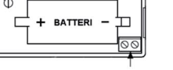
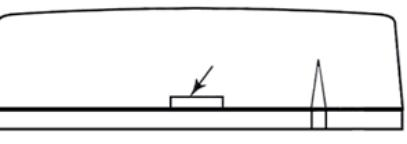
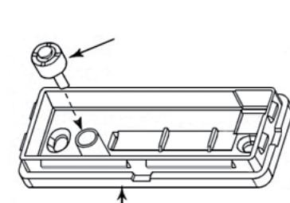
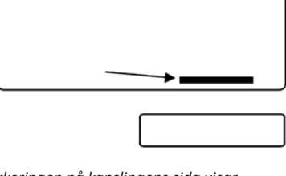

## Installationsguide - WS4945/8945

### **Aktivera batteriet i WS4945**

WS4945 levereras med ett redan monterat, men inte inkopplat, batteri. För att starta enheten – håll stadigt i WS4945, greppa sedan plastremsan och dra ut den i angiven riktning.

### **Programmera in WS4945 i systemet**

WS4945 kan programmeras in i systemet via automatisk inlärning eller manuellt genom att ESNnumret skrivs in. Alla DSC system stödjer inte automatisk inlärning via radio, se installationsguiden för systemet. Utför alltid ett räckviddstest innan WS4945 monteras fast.

### **1.1 Automatisk inlärning via radio**

- 1. Tryck [*8] [Installatörskod] [898] på någon av systemets knappsatser.
- 2. Håll sändaren i närheten av systemets radiomottagare.
- 3. Skapa sabotage (genom att öppna sändarens kapsling) eller för magnetdelen mot och sedan bort från sändaren.
- 4. Knappsatsen visar nu ESN numret (elektroniskt serienummer). Tryck [*] för att bekräfta.
- 5. Välj ledig sektionsplats för detektorn.
- 6. Välj en lämplig sektionstyp; t.ex Fördröjd sektion typ 1 [01].
- *Det elektroniska serienumret (ESN-nummer) är en 6-ställig hexadecimal kod som återfinns på en klisterlapp på detektorns bakstycke.*
- 7. Repetera steg 2 till 6 för att lägga till fler enheter.
- 8. Bekräfta att sändaren fungerar genom att utföra ett räckviddstest (bortser från övrig sektionsprogrammering).

### **2.1 Programmera in ESN-nummer manuellt (steg 1 av 3)**

- 1. Tryck [*][8] [Installatörskod] på någon av systemets knappsatser för att öppna installatörsläget.
- 2. Tryck [804] för att öppna programmering av radiomottagaren.
- 3. Välj en ledig sektion genom att ange undersekvens [01]-[32] (t.ex, [01] sektion 1... [32] sektion 32).
- 4. Ange det 6-ställiga ESN-numret (avläses på baksidan av sändaren), avsluta med "00" om denna sekvens innehåller 8 platser.
- 5. Upprepa steg 3 och 4 för att lägga till fler enheter.
- 6. Tryck [#] för att avsluta.
- 7. Bekräfta att sändaren fungerar genom att utföra ett räckviddstest (bortser från övrig sektionsprogrammering).

### **Räckviddstest**

- 1. Tryck [*8] [Installatörskod] [904] på någon av systemets knappsatser.
- 2. Skapa en sändning genom att öppna kapslingen (figur 3) eller genom att föra magnetdelen bort från sändaren.
- 3. Systemet indikerar placering med 1 pip för "Bra" och 3 pip för "Dålig". Detektorn bör omplaceras om resultatet konsekvent är "Dåligt" (utför alltid flera test i följd).

### **Om räckviddstestet inte lyckas, kontrollera att ESN-numret är korrekt inlagt och att batteriet är aktiverat. Steg 2.2 och 2.3 återstår om WS4945 progammeras in manuellt.**

### **2.2 Programmera sektionstyp**

- 1. Öppna sekvens [001] [002] för att programmera sektionstyp. Observera att [001] börjar på sektion 1 och avslutas med sektion 16, [002] börjar på sektion 17 och avslutas med sektion 32. Det är inte möjligt att välja sektion i dessa sekvenser, använd höger piltangent för att stega till vald sektion. PC1864 har även sekvens [003] [004].
- 2. Ange sektionstyp på motsvarande sektionsplats (t.ex [01] Fördröjd sektion typ 1).

*Kontrollera alltid att sektionen är inkopplad i rätt område, se sekvens [202] och framåt*

#### teletec Veterinärgränd 6, 121 63 Johanneshov Teknisk support: 08-602 16 66

# Installationsguide

## **2.3 Aktivera sektionsegenskapen "Trådlös sektion"**

- 1. Öppna sekvens [101] [164] beroende på vilken sektion som ska programmeras (sektion 1 = [101] osv.)
- 2. Aktivera (tänd) option [8] i sekvensen, se installationsguiden för vad övriga optioner i dessa sekvenser innebär.

### **Montering av sändare och magnet**

När en optimal placering testats fram kan WS4945 monteras permanent. Vid montering används lämpligen de skruvar som medföljer enheten vid leverans. Lossa sändarens bakstycke. Markera eventuella skruvhål, borra och plugga om så krävs och skruva sedan fast bakstycket på avsedd plats.

Om dubbelhäftande tejp används: Se till så att monteringsytan är helt ren och torr. Sätt först på tejpen på baksidan av WS4945 och tryck sedan hårt fast sändaren på avsedd plats. Bibehåll trycket i 10 – 15 sekunder för att garantera bra fäste. Det kan ta upp till 24 timmar innan tejpen hunnit fästa ordentligt.

### **Montera magneten** så den sitter mitt för pilen på sidan av sändaren.

Montera magneten högst 16 mm från sändaren. Tänk på att inte montera den för tätt så att de två delarna kan slå ihop om dörren/fönstret rör sig något (t.ex. på grund av temperaturförändring). Använd medföljande tejp eller skruv för att fästa magneten. Testa sedan funktionen genom att öppna och stänga dörren/fönstret.

### **Inkoppling av yttre kontakt**

I sändaren finns en kopplingsplint för t.ex en trådbunden magnetkontakt. Om denna ska utnyttjas, montera då kontakten enligt tillverkarens instruktioner. Koppla sedan in kontakten till plinten i WS4945. Denna ingång i WS4945 är normalt sluten och den är inte övervakad. Notera att endast en yttre kontakt får kopplas in. Denna kontakt får inte ha en längre kabel än 90 cm med ett maximalt motstånd på 100 ohm. Kontakten och sändaren ska vara monterade i samma utrymme. Om yttre kontakt är inkopplad används inte magnetdelen.

### **Sabotagekontakt**

Vid leverans är WS4945 försedd med en sabotagekontakt som larmar om sändarens kåpa lossas. Som ett extra skydd kan kontakten även larma om enheten bryts loss från underlaget, byt ut den korta gummiaktivatorn mot den längre för denna funktion.

### **Byte av batteri**

För att byta ut enhetens batteri ska du först öppna den genom att sätta en flat skruvmejsel i springan mellan kåpan och monteringsplattan och sedan vrida skruvmejseln försiktigt. När kåpan lyfts av är batteriet klart synligt, ta bort det gamla batteriet och byt ut det mot ett nytt av samma typ. Se till så att det nya batteriet monteras med rätt polaritet.

#### **Bra att veta!**

Om sektionen indikerar på räckviddstest men inte i driftläge är det fömodligen sektionsegenskap [8] som inte är aktiverad!

Om systemet indikerar "Systemsabotage" efter programmering av ESN saknas sabotage mot vägg i knappsatsen RFK5500, denna funktion kan programmeras bort genom att aktivera option [3] i sekvens [804] [90].

