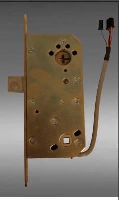
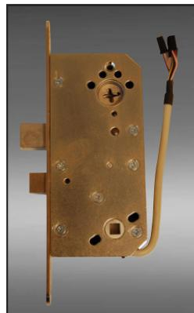
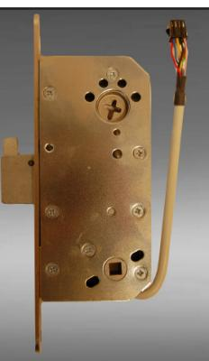
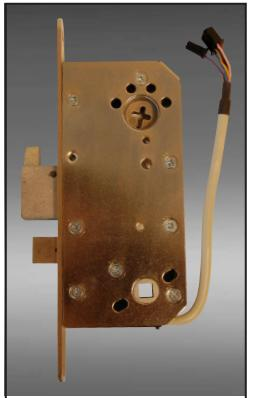
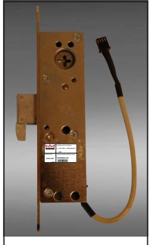

## DORMA Motorlås Intello

**DML 902** motorlås med regelfunktion

**DML 912**  motorlås med fall och regelfunktion

**DML 903** motorlås med hakregelfunktion

**DML 913** motorlås med fall och hakregelfunktion

**DML 803** lås smalprofil med hakregelfunktion

## DORMA Intello har följande funktioner:

## Ingångar:

- • Dagblockering, låset förblir olåst efter första godkända öppningen. Låser igen när dagblockeringen upphör
- • "Nödöppning", låset låser upp och förblir olåst tills "nödöppningssignalen" upphör
- • Extern magnet, möjlighet att ansluta extern magnetkontakt
- • Öppnaknapp, öppnar vid slutning
- • Extern öppning, öppnar vid strömsignal 10-35VDC/8-24DAC

Utgångar:

- • Dörr stängd, reläslutning vid stängd dörr
- • Dörr öppen, reläslutning vid öppen dörr
- • Larm, reläslutning om regeln hindras i sin rörelse, anslutningskabeln kopplas bort eller om magnetkontakten inte indikerar stängd dörr
- • Förlarm, reläslutning som träder i kraft innan larm aktiveras
- • Regel inne, reläslutning vid regel inne
- • Regel ute, reläslutning vid regel ute
- • Sabotage, mikrobrytarslutning som faller när locket till centralenheten öppnas
- • 12VDC för styrning av extern utrustning
- Expansionsportar:
- • EXP I/O, plats för expansionskort för USB-anslutning till PC för mjukvaruprogrammering av styrenhet
- • TMS1 & TMS2, plats för anslutning av indikeringspanel
- Mjukvara DORMA Intello:
- • PC programvara för administration av parametrar, ställa öppettider, larmtider m.m.
- • Inställning av serviceintervaller
- • Loggfil och statuskontroll m.m.

## Teknisk data:

| Driftspänning:         | 10-35 VDC / 8-24 VAC                             |
|------------------------|--------------------------------------------------|
| Strömförbrukning:      | 150mA vid motordrift, 50mA i viloläge            |
| Responstid vid impuls: | < 0,5 sek                                        |
| Styrenhet:             | CU-Intello                                       |
| Kabellängd:            | Max längd 10 meter                               |
| Lås:                   | Möjlighet att styra två lås från samma styrenhet |