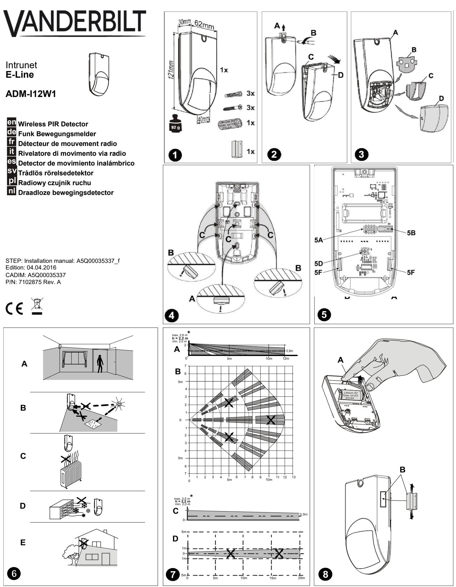
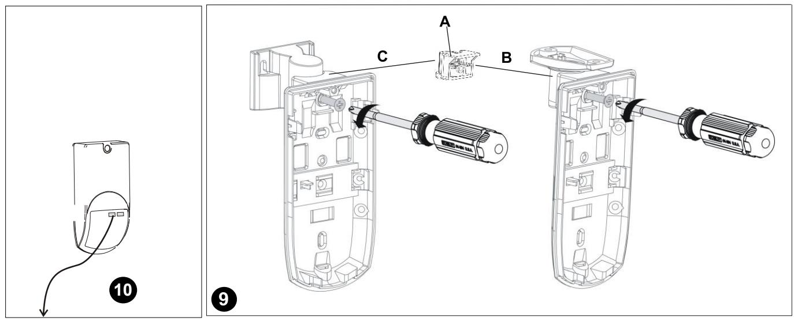
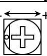
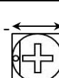
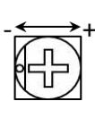
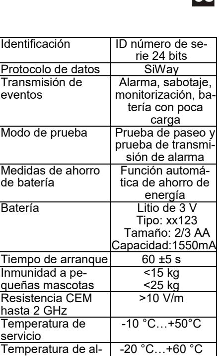
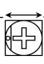
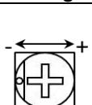

** Not e: Mounting heights other than 2.2 m are not certified by Telefication for EN compliance and will give a different coverage area.*

|                                                                 |            | en                    | de                    | fr                                | it                                         | es                           |                     |                                   | nl                  |
|-----------------------------------------------------------------|------------|-----------------------|-----------------------|-----------------------------------|--------------------------------------------|------------------------------|---------------------|-----------------------------------|---------------------|
| Red Rot Rouge Rosso Rojo Röd Czerwony Rood | 11 x 6 sec | Transmis sion test | Über mittlungstest | Test de transmis sion       | Test di trasmis sione                | Prueba de transmisión     | Överföring stest | Test trans misji               | Test over dracht |
|                                                                 |            | Alarm walktest     | Alarm Geht est     | Test de dé placement alarme | Allarme test di at traversa mento | Alarma Prueba de paseo | Larm gång test   | Test reakcji alarmu na ruch | Alarm loop test  |
|                                                                 |            | Detector active    | Melder aktiv          | Détecteur active               | Rivelatore attivo                       | Detector ac tivo          | Detektor ak tiv  | Czujnik ak tywny               | Detector actief  |

|                                                                 |  | CE                                                                                                                 |                                                                   |  |  |  |
|-----------------------------------------------------------------|---|--------------------------------------------------------------------------------------------------------------------|-------------------------------------------------------------------|--|--|--|
| Approvals Zulassungen                                        |  | Radio Equipment Directive 2014/53/EU; EMC Directive 2014/30/EU; Low Voltage Directive 2014/35/EU                |                                                                   |  |  |  |
| Agréments                                                       |  | Security Grade 2, Environmental Class II                                                                           |                                                                   |  |  |  |
| Approvazioni                                                    |  | Low Voltage condition level 2.4Vdc                                                                                 |                                                                   |  |  |  |
| Homologaciones Godkännanden Dopuszczenia Goedkeuringen |  | EN 50130-4:2011 EN 61000-6-3:2007/A1:2011 EN 60950-1:2006+A11:2009+A12:2011+A1:2010+A2:2013 EN 62479:2010 | EN 301 489-1 V1.9.2 EN 301 489-3 V1.6.1 EN 300 220-2 V2.4.1 |  |  |  |

|           |                               | en                                    | de                                  | fr                                               | it                                           | es                                            |                                  |                                                   | nl                              |
|-----------|-------------------------------|---------------------------------------|-------------------------------------|--------------------------------------------------|----------------------------------------------|-----------------------------------------------|----------------------------------|---------------------------------------------------|---------------------------------|
|          |                              | Details for ordering               | Bestell-infor mationen           | Informations relatives à la commande       | Informazioni relative all'or dinazione | Datos de pedido                            | Beställnings information      | Informacje po trzebne przy zamówieniu       | Bestelinformatie                |
| ADM-I12W1 | V54538-F105-A100 PIR Detector | 868 MHz                               | PIR Detektor 868 MHz             | Détecteur PIR 868 MHz                         | Rivelatore PIR 868 MHz                    | Detector PIR 868 MHz                       | PIR Detektor 868 MHz          | Detektor PIR 868 MHz                           | PIR detector 868 MHz         |
| AO-C25*   | V54539-F102-A100              | Curtain lens set (12 pcs)          | Vorhang Linsen Set (12 stk)      | Kit de lentilles ri deau (12 pièces)       | Kit lenti a tenda (12 pz.)                | Kit de lentes cortina (12 unds.)        | Ridålinssats (12 st)          | Zestaw soczewek do kurtyny (12 szt.)           | Gordijn lenzen set (12 stk)  |
| AO-WL10k* | V54539-F103-A100              | Whitelight fil ter set (12 pcs) | Weisslicht Filter Set (12 Stück) | Kit de filtre lu mière blanche (12 pièces) | Kit di filtri luce bianca (12 pz.)        | Kit de filtros de luz blanca (12 unds.) | Vitljusfilter, sats (12 st)   | Zestaw filtrów do światła białego (12 szt.) | Witlicht filter set (12 stk) |
| AZ-MBG2*  | V54539-F105-A100              | Mounting bra ckets grade 2      | Montagehalter Grade 2            | Support de mon tage Grade 2                | Supporto di montaggio grado 2          | Soporte de montaje Grado 2              | Monterings hållare grade 2 | Uchwyt montażowy Grade 2                       | Montageklem grade 2          |

* *Note: AO-C25, AO-WL10k and AZ-MBG2 are not certified for EN compliance.*

# **ADM-I12W1 motion detector**

The detector detects movement in the room under surveillance and initiates an alarm. It responds most sensitively to movement in the directions indicated by arrows **B / D**. The alarm is transferred by wireless. The back tamper recognizes if the detector is removed with force. **7 7**

# **Prerequisites**

The detector should be installed by people with specialist knowledge and in compliance with valid regulations.

tioning instructions .

The detector is only intended for indoor use. Note the posi-

**6**

# **Opening the detector**

- 1. Check the scope of delivery . **1**
- 2. Slide up the screw-on cover **A** and loosen the screw **B**. **2 2**
- 3. Pull the housing front **D** off the base **C**. **2 2**

# **Fitting the detector**

- 1. Fit the mounting base **C** as follows: **2**
- Define type of fastening **A / B**. (also refer to mounting bracket option) **4**
- Break open three fixing holes.
- Fit mounting base at the proposed height.

The mounting base should be secured using two screws **A / B** and the back tamper with one screw **C**. **4 4**

- 2. Pull out insulation strip between battery and bracket **A**. **8**
- 3. Press the tamper contact **B** to register the detector with the system. **5**

For safety reasons only use the battery supplied and not any other type.

- 4. Fold front **D** back onto mounting base **C** and secure with screw **B**. Slide down screw-on cover **A**. **2 2 2 2**
# **Programming**

To adjust the settings to the application, move the switches **A** into the corresponding positions: **5**

| Switch | Function        | ON   | OFF   |
|--------|-----------------|------|-------|
| 1      | LED             | *On  | Off   |
| 2      | Sensitivity     | *Low | High  |
| 3      | Auto Power Save | *On  | Off   |
| 4      | Pet Immunity    | 25kg | *15kg |

* Factory Setting

#### **Sensitivity setting D 5**

Turn potentiometer **D** into the position required to adjust detector to room size and field of vision. **5**

* *factory setting is the middle position (12-meter field of vision) Potentiometer settings other than the centre (factory) position are not certified by Telefication for EN compliance and will result in a different coverage area.*

# **ID registration**

You will find instructions for integrating the detector in the control panel in the control panel's installation manual.

# **Walk test**

- 1. Call up walk test mode in the control panel.
- 2. Hold a magnet to the right of the detector for 1 second **B. 8**
- 3. Run the walk test for alarm triggering in the whole detection area of the detector. **7**

# **Alarm transmission test**

- 1. Call up walk test mode in the control panel.
- 2. Hold a magnet to the right of the detector for at least 2 seconds **B. 8**
- 3. The alarm transmission test has now started. 11 test signals are sent to the control panel at an interval of 6 seconds (the LED flashes during each transmission). **10**
- 4. The test is passed if the control panel receives the test signals and indicates this accordingly.

# **Options**

# **Narrow angle lens kit AO-C25**

The kit enables the detection area coverage to be defined to a narrow angle as shown in **D**. **7**

Loosen the lens currently at the positions shown in **F** and remove from the detector. Insert adapter **C** in to detector and press down narrow angle lens. **5 3**

# **White light filter AO-WL10k***

The white light filter is needed for applications with extreme white light interference (> 4000 lux).

Loosen the lens currently at position **F** and remove this from the detector. Insert adapter **B** in to detector and press the lens back down. **5 3**

** Note: Not certified by Telefication for EN compliance.* 

**Wall & ceiling mounting brackets** The mounting brackets AZ-MBG2 **A** (ceiling **B** and wall **C** mounting) can be used to swivel the detector ±45°. **9 9 99**

| Technical data         |                   |
|------------------------|-------------------|
| Detection area cov     | 12 m              |
| erage                  |                   |
| wide angle B 7   |                   |
| Detection area cov     | 20 m              |
| erage                  |                   |
| narrow angle D 7 |                   |
| Range of wireless      | Up to 300 m out   |
| module                 | doors             |
| Frequency:             |                   |
| ADM-I12W1              | 868 MHz           |
| Identification         | ID serial number  |
|                        | 24 bits           |
| Data protocol          | SiWay             |
| Event transmission     | Alarm, sabotage,  |
|                        | surveillance, bat |
|                        | tery low          |
| Test mode              | Walk test & alarm |
|                        | transmission test |
| Battery power sav      | Automatic energy  |
| ing                    | saving function   |
| Battery                | Lithium 3 V       |
|                        | Type: xx123       |
|                        | Size: 2/3 AA      |
|                        | Capacity: 1550mAh |
| Warm up period         | 60 ±5 s           |
| Pet immunity           | <15 kg            |
|                        | <25 kg            |
| EMI rejection up to    | >10 V/m           |
| 2 GHz                  |                   |
| Operating tempera      | -10 °C…+50°C      |
| ture                   |                   |
| Storage tempera        | -20 °C…+60 °C     |
| ture                   |                   |
| Air humidity           | <85 %rF, not con  |
| EN 60721               | densing           |
| Type of housing        | IP41 / IK02       |
| protection             |                   |
| EN 60529,              |                   |
| EN 50102               |                   |

# **EC Declaration of Conformity**

Hereby, Vanderbilt International (IRL) Ltd declares that this radio equipment type is in compliance with all relevant EU Directives for CE marking. From 20/04/2016 it is in compliance with Directive 2014/30/EU (Electromagnetic Compatibility Directive) and Directive 2014/35/EU (Low Voltage Directive). From 13/06/2016 it is also in compliance with Directive 2014/53/EU (Radio Equipment Directive). The full text of the EU declaration of conformity is available at:

http://pcd.vanderbiltindustries.com/doc/wireless

#### **de Betriebsanleitung**

# **ADM-I12W1 Bewegungsmelder**

Der Melder erkennt Bewegungen im überwachten Raum und löst Alarm aus. Er reagiert am empfindlichsten auf Bewegungen in Pfeilrichtung **B / D**. Die Alarmübertragung wird mit Funk realisiert. Die Abreißüberwachung erkennt eine gewaltsame Entfernung des Melders. **7 7**

# **Voraussetzungen**

Die Installation sollte von Personen mit Fachkenntnis unter Einhaltung geltender Vorschriften vorgenommen werden.

Der Melder ist ausschließlich für die Innenanwendung vorgesehen. Positionierungshinweise beachten. **6**

## **Öffnen des Melders**

- 1. Prüfen Sie den Lieferumfang . **1**
- 2. Schieben Sie die Schraubenabdeckung **A** nach oben und lösen Sie die Schraube **B**. **2 2**
- 3. Ziehen Sie den Deckel **D** des Gehäuses vom Boden **C**. **2 2**

#### **Montieren des Melders**

- 1. Montieren Sie Melderboden **C** wie folgt: **2**
- Befestigungsart **A / B** festlegen. (Siehe auch Option Montagehalter) **4**
- Drei Befestigungslöcher ausbrechen.
- Melderboden auf der vorgeschlagenen Höhe montieren.

Der Melderboden ist mit zwei Schrauben **A / B** und die Abreißüberwachung mit einer Schraube **C** zu befestigen. **4 4**

- 2. Ziehen Sie den Isolationsstreifen zwischen der Batterie und der Halterung heraus **A**. **8**
- 3. Drücken Sie den Sabotage Kontakt **B**, um den Melder am System anzumelden. **5**

Aus Sicherheitsgründen verwenden Sie ausschliesslich die mitgelieferte Batterie und keine anderen Typen.

- 4. Klappen Sie den Deckel **D** wieder auf den Melderboden **C** und befestigen ihn mit der Schraube **B**. Schieben Sie die Schraubenabdeckung **A** nach unten. **2 2 2 2**
#### **Programmierung**

Um die Einstellungen auf die Anwendung anzupassen, setzen Sie die Schalter **A** in die entsprechenden Positionen: **5**

| Schalter | Funktion                   | ON    | OFF   |
|----------|----------------------------|-------|-------|
| 1        | LED                        | *Ein  | Aus   |
| 2        | Empfindlichkeit            | *Tief | Hoch  |
| 3        | Auto Power Save            | *Ein  | Aus   |
| 4        | Kleintier Unterdrückung | 25kg  | *15kg |

* Werkeinstellung

#### **Empfindlichkeitseinstellung D 5**

Drehen Sie das Potenziometer **D** in die gewünschte Position, um den Melder der Raumgröße und dem Sichtfeld anzupassen. **5**

* Werkeinstellung mittlere Position (Sichtfeld 12 Meter)

#### **ID-Registrierung**

Anweisungen zum Einbinden des Melders in die Zentrale finden Sie im Installationshandbuch der Zentrale.

#### **Gehtest**

- 1. Rufen Sie in der Zentrale den Gehtest Modus auf.
- 2. Halten Sie 1 Sekunde lang einen Magneten rechts neben den Melder. **B 8**
- 3. Führen Sie den Gehtest auf Alarmauslösung im ganzen Wirkbereich des Melders durch. **7**

#### **Alarmübermittlungstest**

- 1. Rufen Sie in der Zentrale den Gehtest Modus auf.
- 2. Halten Sie mindestens 2 Sekunden lang einen Magneten rechts neben den Melder **B**. **8**
- 3. Der Alarmübermittelungstest ist jetzt gestartet. Es werden 11 Testsignale im Abstand von 6 Sekunden an die Zentrale gesendet (die LED blinkt bei jeder Übertragung). **10**
- 4. Der Test ist erfolgreich, wenn die Zentrale die Testsignale empfängt und entsprechend anzeigt.

#### **Optionen**

#### **Vorhang-Linsen-Set AO-C25**

Das Set erlaubt die Festlegung des Wirkbereichs auf einen schmalen Vorhang gemäß **D**. **7**

Lösen Sie die bestehende Linse an den Positionen **F** und ziehen Sie diese vom Melder ab. Stecken Sie den Adapter **C** in den Melder und drücken Sie die Vorhang Linse fest. **5 3**

#### **Weisslicht Filter AO-WL10k**

Der Weisslicht Filter wird bei Anwendungen mit extremen Weisslicht Interferenzen (> 4000 lux) benötigt. Lösen Sie die bestehende Linse an den

Positionen **F** und ziehen Sie diese vom Melder ab. Stecken Sie den Adapter **B** in den Melder und drücken Sie die Linse wieder fest. **5 3**

#### **Montagehalter Wand & Decke 9**

Montagehalter AZ-MBG2 **A** an den Melder schrauben, so kann der Melder um ±45° geschwenkt werden. (Deckenmontage **B** und Wandmontage **C**). **9 9 9**

# **Technische Daten**

| Wirkbereich            | 12 m               |
|------------------------|--------------------|
| Volumetrisch B 7 |                    |
| Wirkbereich            | 20 m               |
| Vorhang D 7      |                    |
| Funkmodul              | Bis 300 m in       |
| Reichweite             | freiem Gelände     |
| Frequenz:              |                    |
| ADM-I12W1              | 868 MHz            |
| Identifizierung        | ID Seriennummer    |
|                        | 24 Bit             |
| Datenprotokoll         | SiWay              |
| Ereignisübertra        | Alarm, Sabotage,   |
| gung                   | Überwachung,       |
|                        | Batterie schwach   |
| Testmodus              | Gehtest & Alarm    |
|                        | übermittlungstest  |
| Batteriesparmass       | Automatische       |
| nahmen                 | Energiespar-Funk   |
|                        | tion               |
| Batterie               | Lithium 3 V        |
|                        | Typ: xx123         |
|                        | Grösse: 2/3 AA     |
|                        | Kapazität: 1550mAh |
| Anlaufzeit             | 60 ± 5 s           |
| Kleintier-Unterdrü     | < 15 kg            |
| ckung                  | < 25 kg            |
| EMV-Festigkeit bis     | > 10 V/m           |
| 2 GHz                  |                    |
| Betriebstemperatur     | -10 °C…+50°C       |
| Lagertemperatur        | -20 °C…+60 °C      |
| Luftfeuchtigkeit       | <85% RF            |
| EN 60721               | nicht betauend     |
| Gehäuse Schutzart      | IP41 / IK02        |
| EN 60529               |                    |
| EN 50102               |                    |

#### **EG-Konformitätserklärung**

Hiermit erklärt Vanderbilt International (IRL) Ltd, dass dieser Funkgerätetyp den Anforderungen aller relevanten EU-Richtlinien für die CE-Kennzeichnung entspricht. Ab dem 20.04.2016 entspricht er der Richtlinie 2014/30/EU (Richtlinie über elektromagnetische Verträglichkeit) und der Richtlinie 2014/35/EU (Niederspannungsrichtlinie). Ab dem 13.06.2016 entspricht er außerdem der Richtlinie 2014/53/EU (Richtlinie über Funkanlagen).

Der vollständige Text der EU-Konformitätserklärung steht unter http://pcd.vanderbiltindustries.com/doc/wireless

zur Verfügung.

# **Détecteur volumétrique ADM-l12W1**

Le détecteur détecte les mouvements dans la pièce surveillée et déclenche l'alarme. Il réagit le plus sensiblement aux mouvements dans le sens indiqué par la flèche **B / D**. La transmission de l'alarme se fait par radio. Le dispositif de surveillance d'arrachement détecte un retrait par la force du détecteur. **7 7**

# **Conditions préalables**

L'installation doit être effectuée par des personnes ayant les compétences techniques en respectant les prescriptions en vigueur.

Le détecteur est destiné à une utilisation intérieure uniquement. Respecter les conseils de positionnement . **6**

#### **Ouverture du détecteur**

- 1. Vérifier le contenu de la livraison . 2. Faire glisser le cache-vis **A** vers le **1 2**
- haut et desserrer la vis **B**. **2**
- 3. Enlever le couvercle **D** du boîtier du fond **C**. **2 2**

#### **Montage du détecteur**

- 1. Monter le fond du détecteur **C 2**
- comme suit : - déterminer le type de fixation **A / B**. (voir aussi: option support de montage) **4**
- pratiquer trois trous pour la fixation.
- monter le fond du détecteur à la hauteur proposée.

Le fond du détecteur doit être fixé au moyen de deux vis **A / B** et le dispositif de surveil-**4**

lance d'arrachement à l'aide d'une vis **C**. **4**

- Retirer l'isolant entre la batterie et le support **A**. **8**
- 3. Appuyer sur le contact d'autoprotection **B** pour enregistrer le détecteur dans le système. **5**

Pour des raisons de sécurité, ne pas utiliser d'autres types de batterie que celui fourni.

- 4. Rabattre le couvercle **D** sur le fond du détecteur **C** puis le fixer à l'aide de la vis **B**. Faire glisser le cache-vis **A** vers le bas. **2 2 2 2**
# **Programmation**

Pour adapter les réglages à l'application, placer les commutateurs **A** dans les positions correspondantes: **5**

| DIP sw | Fonction                | ON            | OFF   |
|--------|-------------------------|---------------|-------|
| 1      | LED                     | *On           | Off   |
| 2      | Sensibilité             | *Basse Elevée |       |
| 3      | Auto Power Save         | *On           | Off   |
| 4      | Immunité aux animaux | 25kg          | *15kg |

* Réglage d'usine

#### **Réglage de la sensibilité D 5**

Tourner le potentiomètre **D** dans la position souhaitée, pour adapter le détecteur à la surface de la pièce **5**

et au champ de visibilté. * Réglage d'usine : position moyenne (champ de visibilité 12 mètres)

#### **Enregistrement ID**

Vous trouverez des instructions relatives à l'intégration du détecteur dans l'équipement de contrôle et de signalisation dans le manuel d'installation de ce dernier.

#### **Test de déplacement**

- 1. Dans l'équipement de contrôle et de signalisation, activer le mode de test de déplacement.
- 2. Pendant une seconde, tenir un aimant à droite du détecteur. **B 8**
- 3. Effectuer le test de déplacement pour déclenchement d'alarme sur toute la zone efficace du détecteur. **7**

#### **Test de transmission d'alarme**

- 1. Dans l'équipement de contrôle et de signalisation, activer le mode de test de déplacement.
- 2. Pendant au moins deux secondes, tenir un aimant à droite du détecteur **B**. **8**
- 3. Le test de transmission d'alarme est à présent lancé. 11 signaux de test espacés de 6 secondes sont envoyés à l'équipement de contrôle et de signalisation (la DEL clignote à chaque transmission). **10**
- 4. Le test a réussi lorsque l'équipement de contrôle et de signalisation reçoit et affiche les signaux de test en fonction.

# **Options**

**Kit de lentilles rideau AO-C25**  Le kit permet de déterminer la zone efficace à un rideau étroit conformément à

**D**. Desserrer la lentille existante aux positions **F** et l'enlever du détecteur. Insérer l'adaptateur **C** dans le détecteur et fixer la lentille rideau en appuyant dessus. **5 3**

#### **Filtre lumière blanche AO-WL10k**

Le filtre lumière blanche est nécessaire pour des applications avec interférences de lumière blanche extrêmes (> 4000 lux).

Desserrer la lentille existante aux positions **F** et l'enlever du détecteur. Insérer l'adaptateur **B** dans le détecteur puis refixer la lentille en appuyant dessus. **5 3**

**Support de montage mur et plafond** Visser le support de montage AZ-MBG2 **A** sur le détecteur ; le détecteur peut ainsi pivoter de ±45°. (fixation au plafond **B** et fixation murale **C**) **9 9 9 9**

# **Caractéristiques techniques**

| Zone efficace          | 12 m                          |
|------------------------|-------------------------------|
| volumétrique B 7 |                               |
| Zone efficace          | 20 m                          |
| rideau D 7       |                               |
| Portée du module       | Jusqu'à 300 m en              |
| radio                  | terrain dégagé                |
| Fréquence :            |                               |
| ADM-I12W1              | 868 MHz                       |
| Identification         | Numéro de série ID 24 bits |
| Protocole de données   | SiWay                         |
| Transmission d'é       | Alarme, sabotage,             |
| vénement               | surveillance, bat             |
|                        | terie faible                  |
| Mode test              | Test de déplacement           |
|                        | et test de transmis           |
|                        | sion d'alarme                 |
| Mesures d'écono        | Fonction automa               |
| mie de la batterie     | tique d'économie              |
|                        | d'énergie                     |
| Batterie               | Lithium 3 V                   |
|                        | Type : xx123                  |
|                        | Taille : 2/3 AA               |
|                        | Capacité: 1550mAh             |
| Temps de stabilisation | 60 ±5 s                       |
| Suppression            | <15 kg                        |
| d'alarme pour ani      | <25 kg                        |
| maux domestiques       |                               |
| Stabilité CEM          | >10 V/m                       |
| jusqu'a 2 GHz          |                               |
| Température d'ex       | - 10 °C…+ 50 °C               |
| ploitation             |                               |
| Température de         | - 20 °C…+ 60 °C               |
| stockage               |                               |
| Humidité de l'air      | <85 % rF, sans                |
| EN 60721               | condensation                  |
| Type de protection     | IP41 / IK02                   |
| de boîtier             |                               |
| EN 60529               |                               |
| EN 50102               |                               |

# **Déclaration de conformité CE**

Par la présente, Vanderbilt International (IRL) Ltd déclare que le type d'équipement radio considéré est en conformité avec toutes les directives UE applicables relatives au marquage CE. Il sera en conformité avec les directives 2014/30/UE (directive compatibilité électromagnétique (CEM)) et 2014/35/UE (directive basse tension) à compter du 20.04.2016. Il sera également en conformité avec la directive 2014/53/UE (directive dite RED relative à l'équipement radio) à compter du 13.06.2016. **7**

Le texte intégral de la déclaration de conformité aux directives de l'Union européenne est disponible à :

http://pcd.vanderbiltindus-

tries.com/doc/wireless

# **Istruzioni per l'uso**

| ADM-I12W1 Rivelatore di movimento                                                     | Interruttore Funzione                                                                          |                                                                            | ON     | OFF                         | Dati tecnici                      |                                                                                        |                                   |
|---------------------------------------------------------------------------------------|------------------------------------------------------------------------------------------------|----------------------------------------------------------------------------|--------|-----------------------------|-----------------------------------|----------------------------------------------------------------------------------------|-----------------------------------|
| Il rivelatore rileva movimenti nel locale                                             | 1                                                                                              | LED                                                                        | *On    | Off                         | Area effettiva                    |                                                                                        | 12 m                              |
| sorvegliato 7 e fa scattare l'allarme.                                          | 2                                                                                              | Sensibilità                                                                | *Bassa | Alta                        | Volumetrica Area effettiva     | B 7                                                                                 | 20 m                              |
| Reagisce con la massima sensibilità nel caso di movimenti nella direzione indicata | 3                                                                                              | Risparmio en                                                               | *On    | Off                         | Tenda                             | D 7                                                                                 |                                   |
| dalle frecce B / D. La trasmissione degli 7                                     |                                                                                                | ergetico auto matico                                                    |        |                             |                                   | Raggio d'azione del modulo radio                                                    | Fino a 300 m all'aperto        |
| allarmi viene realizzata via radio. Il                                                | 4                                                                                              | Immunità                                                                   | 25kg   | *15kg                       | Frequenza:                        |                                                                                        |                                   |
| sensore antimanomissione rileva la rimozione violenta del rivelatore.     |                                                                                                | animali                                                                    |        |                             | ADM-I12W1                         |                                                                                        | 868 MHz                           |
| Presupposti                                                                           |                                                                                                | * Impostazione di fabbrica                                                 |        |                             | Identificazione                   |                                                                                        | Numero di serie ID 24 bit      |
| L'installazione dovrebbe essere effettuata                                            |                                                                                                | Regolazione della sensibilità                                              | 5      | D                           | Protocollo dati                   |                                                                                        | SiWay                             |
| da persone componenti, nell'osservanza                                                |                                                                                                | Ruotare il potenziometro                                                   |        | 5                           | Trasmissione eventi            |                                                                                        | Allarme, manomissione,         |
| delle norme vigenti.                                                                  |                                                                                                | D nella posizione                                                          |        |                             |                                   |                                                                                        | monitoraggio,                     |
| Il rivelatore è concepito esclusivamente per ambienti                     |                                                                                                | desiderata per adattare il rivelatore alla grandezza                    |        |                             | Modalità di test                  |                                                                                        | batteria debole Test di        |
| interni. Osservare le                                                           |                                                                                                | del locale e al campo                                                      |        |                             |                                   |                                                                                        | attraversamento e                 |
| indicazioni di posizionamento                                                         |                                                                                                | visivo.                                                                    |        |                             |                                   |                                                                                        | test di trasmissione           |
| 6                                                                                     |                                                                                                | * Impostazione di fabbrica posizione                                       |        |                             |                                   |                                                                                        | dell'allarme                      |
| Apertura del rivelatore                                                               |                                                                                                | centrale (campo visivo 12 metri)                                           |        |                             | Risparmio ener getico batteria |                                                                                        | Funzione automatica di         |
| 1. Verificare il contenuto della confezione 1                                      | Registrazione ID                                                                               | Le istruzioni per l'integrazione del                                       |        |                             |                                   |                                                                                        | risparmio energetico              |
| 2. Spingere il profilo coprivite A verso 2                                      |                                                                                                | rivelatore nella centrale sono riportate                                   |        |                             | Batteria                          |                                                                                        | Litio 3 V                         |
| l'alto e allentare la vite B. 2                                                 |                                                                                                | nel manuale di installazione della                                         |        |                             |                                   |                                                                                        | Tipo: xx123 Dimensione: 2/3 AA |
| 3. Togliere il coperchio D del 2 contenitore dal fondo 2 C.            | centrale.                                                                                      |                                                                            |        |                             |                                   |                                                                                        | Capacità: 1550 mAh                |
| Montaggio del rivelatore                                                              | 1. Richiamare                                                                                  | Test di attraversamento la modalità                                  |        | Test di                  | Tempo di avvia mento           |                                                                                        | 60 ±5 s                           |
| 1. Montare il fondo del rivelatore C nel 2                                      |                                                                                                | attraversamento nella centrale.                                            |        |                             | Pet immunity                      |                                                                                        | <15 kg                            |
| modo seguente:                                                                        |                                                                                                | 2. Tenere un magnete alla destra del                                       |        |                             |                                   |                                                                                        | <25 kg                            |
| - Stabilire il tipo di fissaggio A / B. 4 (Vedi anche l'opzione supporto di  |                                                                                                | rivelatore per un secondo. 3. Effettuare il test di attraversamento per | B 8 |                             | fino a 2 GHz                      | Resistenza EMC                                                                         | >10 V/m                           |
| montaggio)                                                                            |                                                                                                | l'attivazione dell'allarme nell'intera area                                |        |                             | Temperatura di                    |                                                                                        | -10 °C…+50°C                      |
| - Realizzare i tre fori di fissaggio.                                                 | effettiva                                                                                      | del rivelatore. 7                                                       |        |                             | esercizio Temperatura di       |                                                                                        | -20 °C…+60 °C                     |
| - Montare il fondo del rivelatore all'altezza proposta.                            |                                                                                                | Test di trasmissione dell'allarme                                          |        |                             | stoccaggio                        |                                                                                        |                                   |
|                                                                                       | 1. Richiamare                                                                                  | la modalità attraversamento nella centrale.                          |        | Test di                  | Umidità dell'aria EN 60721     |                                                                                        | <85 %rF senza condensa         |
| Il fondo del rivelatore deve essere fissato con due viti A 4                 |                                                                                                | 2. Tenere un magnete alla destra del                                       |        |                             |                                   | Tipo i protezione                                                                      | IP41 / IK02                       |
| / B e il sensore                                                          | rivelatore B per almeno 2 secondi. 8                                                     |                                                                            |        | del contenitore EN 60529 |                                   |                                                                                        |                                   |
| antimanomissione con una vite C. 4                                     | 3. Il test di trasmissione dell'allarme è ora iniziato. Ogni 6 secondi vengono     |                                                                            |        | EN 50102                    |                                   |                                                                                        |                                   |
|                                                                                       |                                                                                                | trasmessi 11 segnali di test alla                                          |        |                             |                                   |                                                                                        |                                   |
| 2. Estrarre la striscia isolante tra la batteria e il supporto A. 8          | centrale (il LED lampeggia durante 10                                                    |                                                                            |        |                             |                                   | Dichiarazione di conformità CE Con la presente Vanderbilt International             |                                   |
| 3. Premere il contatto antimanomissione                                               | ogni trasmissione).                                                                            |                                                                            |        |                             |                                   | (IRL) Ltd dichiara che questo tipo di                                                  |                                   |
| 5 B, per attivare il rivelatore sul                                                | 4. Il test è riuscito, se la centrale riceve i segnali di test e li visualizza di           |                                                                            |        |                             |                                   | apparecchio radio è conforme a tutte le                                                |                                   |
| sistema.                                                                              | conseguenza.                                                                                   |                                                                            |        |                             |                                   | relative Direttive UE per la marcatura CE. Dal 20/04/2016 è conforme alla Direttiva |                                   |
| Per ragioni di sicurezza deve                                                         | Opzioni                                                                                        |                                                                            |        |                             |                                   | 2014/30/UE (Direttiva sulla compatibilità                                              |                                   |
| essere utilizzata esclusivamente la batteria                              | Kit lenti a tenda AO-C25 Il kit consente di definire l'area effettiva in                    |                                                                            |        |                             |                                   | elettromagnetica) e Direttiva 2014/35/UE                                               |                                   |
| fornita in dotazione e non altri                                                      | modo da farla corrispondere a una tenda                                                        |                                                                            |        |                             |                                   | (Direttiva sulla bassa tensione). Dal 13/06/2016 è anche conforme con la            |                                   |
| tipi di batteria.                                                                     | stretta come mostrato in D. 7 Allentare la lente presente nelle posizioni             |                                                                            |        |                             |                                   | Direttiva 2014/53/UE (Direttiva sulle                                                  |                                   |
| 4. Riapplicare il coperchio D sul fondo 2                                       | 5                                                                                              | F e rimuoverla dal rivelatore. Inserire                                    |        |                             |                                   | apparecchiature radio).                                                                |                                   |
| del rivelatore C e fissarlo con la vite 2 2 2                             | l'adattatore C nel rivelatore e premere 3                                                |                                                                            |        |                             |                                   | Il testo completo della dichiarazione di conformità UE è disponibile presso         |                                   |
| B. Spingere il profilo coprivite A verso il basso.                              | in posizione la lente a tenda. Filtro luce bianca AO-WL10k                                  |                                                                            |        |                             | http://pcd.vanderbiltindus        |                                                                                        |                                   |
| Programmazione                                                                        |                                                                                                | Il filtro luce bianca è necessario nelle                                   |        |                             |                                   | tries.com/doc/wireless                                                                 |                                   |
| Per adattare le impostazioni                                                 |                                                                                                | applicazioni con estreme interferenze di                                   |        |                             |                                   |                                                                                        |                                   |
| all'applicazione, muovere gli interruttori 5                                       | luce bianca (> 4000 lux). Allentare la lente presente nelle posizioni                       |                                                                            |        |                             |                                   |                                                                                        |                                   |
| A nelle posizioni corrispondenti:                                                     | F e rimuoverla dal rivelatore. Inserire 5                                                   |                                                                            |        |                             |                                   |                                                                                        |                                   |
|                                                                                       | l'adattatore B nel rivelatore e premere 3 in posizione la lente.                      |                                                                            |        |                             |                                   |                                                                                        |                                   |
|                                                                                       |                                                                                                |                                                                            |        | 9                           |                                   |                                                                                        |                                   |
|                                                                                       | Supporto di montaggio parete e soffitto Avvitare il supporto di montaggio AZ                |                                                                            |        |                             |                                   |                                                                                        |                                   |
|                                                                                       | MBG2 A al rivelatore, in modo da poter 9 ruotare il rilevatore di ±45°. (Montaggio al |                                                                            |        |                             |                                   |                                                                                        |                                   |
|                                                                                       | soffitto 9                                                                                  | B e montaggio a parete                                                     |        | C) 9                     |                                   |                                                                                        |                                   |

#### **it**

#### **es Instrucciones de servicio**

<85 %rF sin condensación por humedad

IP41 / IK02

eventos

de batería

hasta 2 GHz

macenamiento

Humedad del aire EN 60721

Categoría de protección de la carcasa EN 60529 EN 50102

servicio

**es**

# **Detector de movimiento ADM-I12W1**

El detector detecta movimientos en el área monitorizada y activa una alarma. Reacciona con la mayor sensibilidad a movimientos en dirección de las flechas **B / D**. La transmisión de alarmas se realiza por radio. El sistema de monitorización contra retiradas violentas detecta un desmontaje forzado del detector. **7 7**

# **Condiciones previas**

La instalación deberá ser realizada por personas con conocimientos especializados, respetando la normativa en vigor.

El detector está previsto únicamente para la aplicación en interiores. Obsérvense las indicaciones de posicionamiento . **6**

# **Apertura del detector**

- 1. Compruebe el volumen de suministro . **1**
- 2. Desplace hacia arriba la tapa de cubierta del tornillo **A** y suelte el tornillo **B**. **2 2**
- 3. Desmonte la tapa **D** de la carcasa del fondo **C**. **2 2**

# **Montaje del detector**

- 1. Monte el fondo del detector **C** de la siguiente manera: **2**
- Definir el tipo de fijación **A** / **B**. (Ver también la opción soporte de montaje) - Abrir tres orificios de fijación. **4**
- Montar el fondo del detector a la altura sugerida.

El fondo del detector deberá fijarse con dos tornillos **A** / **4**

**B** y el sistema de monitorización contra retiradas violentas, con un tornillo **C**. **4**

- 2. Extraiga la tira aislante entre la batería y el soporte **A**. **8**
- 3. Pulse el contacto de sabotaje **B** para dar de alta el detector en el sistema. **5**

Por motivos de seguridad, utilice únicamente la batería suministrada, no utilice ningún otro tipo.

- 4. Vuelva a abatir la tapa **D** sobre el fondo del detector **C** y fíjela con el tornillo **B**. Desplace hacia abajo la tapa de cubierta del tornillo **A**. **2 2 2 2**
# **Programación**

Para adaptar los ajustes a la aplicación, sitúe los conmutadores **A** en las posiciones correspondientes: **5**

| Conm. | Función         | ON    | OFF   |
|-------|-----------------|-------|-------|
| 1     | LED             | *On   | Off   |
| 2     | Sensibilidad    | *Baja | Alta  |
| 3     | Ahorro energía  | *On   | Off   |
| 4     | Inmun. mascotas | 25kg  | *15kg |

* Ajuste de fábrica

#### **Ajuste de la sensibilidad D 5**

Gire el potenciómetro **D** a la posición deseada para adaptar el detector al tamaño del área y al campo visual. **5**

* Ajuste de fábrica: posición central (campo visual de 12 metros)

# **Registro de ID**

Para instrucciones acerca de la integración del detector en la unidad de control, consulte el manual de instalación de la unidad de control.

# **Prueba de paseo**

- 1. Llame el modo de prueba de paseo en la unidad de control.
- 2. Sitúe durante 1 segundo un imán a la derecha del detector. **B 8**

3. Ejecute la prueba de paseo para una activación de alarma en el área efectiva completa del detector. **7**

# **Prueba de transmisión de alarma**

- 1. Llame el modo de prueba de paseo en la unidad de control.
- 2. Sitúe durante al menos 2 segundos un imán a la derecha del detector **B**. **8**
- 3. Ahora está iniciada la prueba de transmisión de alarma. Se transmiten 11 señales de prueba en intervalos de 6 segundos a la unidad de control (el LED parpadea en cada transmisión). **10**
- 4. La prueba es correcta si la unidad de control recibe las señales de prueba y las indica de forma correspondiente.

# **Opciones**

# **Kit de lentes cortina AO-C25**

El kit permite restringir el área efectiva a una cortina estrecha según **D**. **7**

Afloje la lente existente en las posiciones **F** y retírela del detector. Inserte el adaptador **C** en el detector y apriete la lente cortina. **5 3**

# **Filtro de luz blanca AO-WL10k**

El filtro de luz blanca se necesita en aplicaciones con interferencias extremas causadas por luz blanca (> 4000 lux). Afloje la lente existente en las posiciones **F** y retírela del detector. Inserte el adaptador **B** en el detector y vuelva a apretar la lente. **5 3**

Soporte de montaje para pared y techo Atornillar el soporte de montaje AZ-MBG2 **A** en el detector para que éste pueda girarse ±45°. (Montaje en el techo **B** y montaje en pared **C**). **9 9 9 9**

# **Datos técnicos**

| Área efectiva         | 12 m           |
|-----------------------|----------------|
| Volumétrica B 7 |                |
| Área efectiva         | 20 m           |
| Cortina D 7     |                |
| Alcance del mó        | Hasta 300 m al |
| dulo inalámbrico      | aire libre     |
| Frecuencia:           |                |
| ADM-I12W1             | 868 MHz        |

de radio cumple con todas las directivas

**Declaración de conformidad CE** Por la presente, Vanderbilt International (IRL) Ltd declara que este tipo de equipo

de la UE relevantes para el marcado CE. Desde el 20/04/2016 cumple con la directiva 2014/30/UE (directiva de compatibilidad electromagnética) y con la directiva 2014/35/UE (directiva sobre baja tensión). Desde el 13/06/2016 cumple también con la directiva 2014/53/UE (directiva de equipos radioeléctricos). El texto completo de la declaración UE de conformidad está disponible en http://pcd.vanderbiltindustries.com/doc/wireless

# **Bruksanvisning**

3 Effektsparläge *På Av 4 Husdjursimmunitet 25kg *15kg

* Fabriksinställning

|                                                                                                                                      | ADM-I12W1 Rörelsedetektor                               |                 |           | Inställning av känslighet D 5                                                         | Tekniska data                                                         |                                                  |  |  |
|--------------------------------------------------------------------------------------------------------------------------------------|---------------------------------------------------------|-----------------|-----------|---------------------------------------------------------------------------------------------|-----------------------------------------------------------------------|--------------------------------------------------|--|--|
| Detektorn registrerar rörelser inom det övervakade området och utlöser ett 7 larm. Känsligheten är störst vid rörelser i |                                                         |                 |           | Vrid potentiometern D till 5 önskat läge för att anpassa detektorn till rummets | Täckningsom råde Volymetriskt B 7                            | 12 m                                             |  |  |
| pilens riktning B / D. Larmet överförs 7 trådlöst. Sabotageövervakningen                                                 |                                                         |                 |           | storlek och till synfältet. * Fabriksinställning mellanläge (synfält 12 meter)        | Täckningsom 7 råde Ridå D                                    | 20 m                                             |  |  |
|                                                                                                                                      | registrerar om detektorn tas bort med våld.             |                 |           |                                                                                             | Räckvidd, trådlös                                                     | Upp till 300 m i fri                             |  |  |
|                                                                                                                                      | Förutsättningar                                         |                 |           | ID-registrering                                                                             | modul                                                                 | terräng                                          |  |  |
| Installationen ska göras av fackkunniga personer och aktuella föreskrifter ska                                                    |                                                         |                 |           | Anvisningar om anslutning av detektorn till centralen finns i installationsmanualen      | Frekvens: ADM-I12W1                                                | 868 MHz                                          |  |  |
| följas.                                                                                                                              |                                                         |                 |           | för centralen.                                                                              | Identifiering                                                         | ID serienummer 24 bit                            |  |  |
|                                                                                                                                      | Detektorn är endast avsedd                              |                 |           | Gångtest                                                                                    | Dataprotokoll                                                         | SiWay                                            |  |  |
|                                                                                                                                      | för användning inomhus. Ob servera placeringsan 6 |                 |           | 1. Välj gångtest på centralen. 2. Håll en magnet till höger om detektorn                 | Överföring av händelser                                            | Larm, sabotage, övervakning, svagt batteri |  |  |
|                                                                                                                                      | visningarna                                             |                 |           | i 1 sekund. B 8                                                                       | Testmodus                                                             | Gångtest och                                     |  |  |
|                                                                                                                                      | Öppna detektorn                                         |                 |           | 3. Gör gångtestet för larmutlösning inom                                                    |                                                                       | larmöverföringstest                              |  |  |
| 1                                                                                                                                    | 1. Kontrollera att leveransen är komplett               |                 |           | detektorns hela täckningsområde 7                                                        | Åtgärder för att spara på batteriet                                | Automatisk energisparfunktion                 |  |  |
|                                                                                                                                      | 2. Skjut skruvskyddet 2                              | A uppåt och     |           | Larmöverföringstest 1. Välj gångtest på centralen.                                       | Batteri                                                               | Litium 3 V                                       |  |  |
|                                                                                                                                      | lossa skruven B. 2                                |                 |           | 2. Håll en magnet till höger om detektorn                                                   |                                                                       | Typ: xx123                                       |  |  |
|                                                                                                                                      | 3. Dra loss kåpan 2                                  | D från basen    | C. 2   | B i minst 2 sekunder. 8                                                                  |                                                                       | Storlek: 2/3 AA                                  |  |  |
|                                                                                                                                      | Montera detektorn                                       |                 |           | 3. Nu har larmöverföringstestet startat. 11                                                 |                                                                       | Kapazitet: 1550 mAh                              |  |  |
|                                                                                                                                      |                                                         | 2               |           | testsignaler sänds till centralen med                                                       | Ungefärlig                                                            | 3 år                                             |  |  |
|                                                                                                                                      | 1. Montera detektorns bas                               |                 | C så här: | intervall på 6 sekunder (LED blinkar 10                                               | batterilivslängd                                                      |                                                  |  |  |
|                                                                                                                                      | - Välj monteringssätt 4                              | A / B. (se även |           | till vid varje överföring).                                                                 | Självtest tid minimum                                              | 60 ±5 s 15 mA                                 |  |  |
|                                                                                                                                      | tillval monteringshållare) - Gör tre fästhål.        |                 |           | 4. Testet är godkänt om centralen tar                                                       | strömupptagning                                                       |                                                  |  |  |
|                                                                                                                                      | - Montera detektorns bas på föreslagen                  |                 |           | emot och indikerar testsignalerna.                                                          | Strömupptagning                                                       | 18 mA                                            |  |  |
| höjd.                                                                                                                                |                                                         |                 |           | Tillval                                                                                     | Inställning för                                                       | <15 kg                                           |  |  |
|                                                                                                                                      |                                                         |                 |           | Ridålinssats AO-C25                                                                         | små husdjur                                                           | <25 kg                                           |  |  |
|                                                                                                                                      | Detektorns bas ska monteras med två skruvar          | 4               | A / B och | Med denna sats kan du begränsa detekteringsområdet till en smal ridå      | EMC-tålighet upp till 2 GHz                                        | >10 V/m                                          |  |  |
|                                                                                                                                      | sabotageövervakningen med                               |                 |           | enligt D. 7                                                                           | Arbetstemperatur                                                      | -10 °C…+50 °C                                    |  |  |
|                                                                                                                                      | en skruv C. 4                                     |                 |           | Lossa den befintliga linsen vid                                                 | Lagringstemperatur                                                    | -20 °C…+60 °C                                    |  |  |
|                                                                                                                                      | 2. Dra bort isoleringsremsan mellan                     |                 |           | positionerna F och dra av den från 5                                                  | Luftfuktighet                                                         | <85 %rF,                                         |  |  |
|                                                                                                                                      | batteriet och hållaren 8                             | A.              |           | detektorn. Placera adaptern C i 3                                            | EN 60721                                                              | ickekondenserande                                |  |  |
|                                                                                                                                      |                                                         |                 |           | detektorn och tryck fast ridålinsen.                                                        | Skyddsklass                                                           | IP41 / IK02                                      |  |  |
|                                                                                                                                      | 3. Tryck ner sabotagekontakten                          | 5               | B för     |                                                                                             | EN 60529                                                              |                                                  |  |  |
|                                                                                                                                      | att registrera detektorn i systemet.                    |                 |           | Vitljusfilter AO-WL10k                                                                      | EN 50102                                                              |                                                  |  |  |
|                                                                                                                                      | Använd endast medföljande                               |                 |           | Vitljusfiltret behövs för användning vid                                                    | Larmklass                                                             | R                                                |  |  |
| batteri av säkerhetsskäl, ingen annan typ.                                                                                        |                                                         |                 |           | extrema vitljusinterferenser (> 4000 lux). Lossa den befintliga linsen vid   | EG-försäkran om överensstämmelse                                      |                                                  |  |  |
|                                                                                                                                      | 4. Sätt tillbaka kåpan 2                             |                 |           | positionerna F och dra av den från 5                                                  |                                                                       | Härmed försäkrar Vanderbilt International        |  |  |
| D på detektorns bas C och fäst den med skruven 2                                                                            |                                                         |                 | 2         | detektorn. Placera adaptern B i 3                                            |                                                                       | (IRL) Ltd att denna typ av radioutrustning       |  |  |
| 2                                                                                                                                    |                                                         |                 |           | detektorn och tryck fast linsen igen.                                                       | överensstämmer med alla relevanta EG                                  |                                                  |  |  |
| B. Skjut ner skruvskyddet A.                                                                                                      |                                                         |                 |           | 9 Monteringshållare för vägg och tak                                                     | direktiv för CE-märkning. Från 20/04/2016                             |                                                  |  |  |
|                                                                                                                                      |                                                         |                 |           | Skruvas en monteringshållare AZ-MBG2                                                        | överensstämmer den med direktiv 2014/30/EG (Direktiv om            |                                                  |  |  |
|                                                                                                                                      | Programmering                                           |                 |           | A fast på detektorn, så kan detektorn 9                                                  | elektromagnetisk kompatibilitet) och                                  |                                                  |  |  |
| Sätt kontakterna A i motsvarande 5                                                                                             |                                                         |                 |           | vridas ±45°. (Takmontering B och 9                                                    | direktiv 2014/35/EG (Direktiv om                                      |                                                  |  |  |
| lägen för att anpassa inställningarna till användningen:                                                                          |                                                         |                 |           | väggmontering C) 9                                                                    | lågspänning). Från 13/06/2016 överensstämmer den även med direktiv |                                                  |  |  |
|                                                                                                                                      |                                                         |                 |           |                                                                                             | 2014/53/EG (Direktiv om radioutrustning).                             |                                                  |  |  |
| Switch                                                                                                                               | Funktion                                                | ON              | OFF       |                                                                                             | Den fullständiga texten för EG-försäkran                              |                                                  |  |  |
| 1                                                                                                                                    | LED                                                     | *På             | Av        |                                                                                             | om överensstämmelse finns på                                          |                                                  |  |  |
| 2                                                                                                                                    | Känslighet                                              | *Låg            | Hög       |                                                                                             | http://pcd.vanderbiltindus                                            |                                                  |  |  |
|                                                                                                                                      |                                                         |                 |           |                                                                                             | tries.com/doc/wireless                                                |                                                  |  |  |

| Czujnik ruchu ADM-I12W1                                                                      |                                                                                                            |         | PrzełącznikFunkcja                                                       | ON                     | OFF               |                   |
|----------------------------------------------------------------------------------------------|------------------------------------------------------------------------------------------------------------|---------|--------------------------------------------------------------------------|------------------------|-------------------|-------------------|
| Czujnik rozpoznaje ruch w                                                           | 3                                                                                                          |         | Automatyczne                                                             | *On                    | Off               | 9                 |
| monitorowanym pomieszczeniu 7                                                          | i                                                                                                          |         | zasilanie                                                                |                        |                   |                   |
| włącza alarm. Najbardziej czułą reakcję                                                      | 4                                                                                                          |         | Odporność na                                                             | 25kg                   | *15kg             |                   |
| wykazuje na ruch w kierunku                                                      |                                                                                                            |         | zwierzęta                                                                |                        |                   |                   |
| wskazywanym przez strzałki B/D. 7                                                |                                                                                                            |         | * Ustawienie fabryczne                                                   |                        |                   |                   |
| Przekazywanie alarmu odbywa się za                                                           |                                                                                                            |         |                                                                          |                        |                   |                   |
| pomocą fal radiowych. Układ kontroli                                                         |                                                                                                            |         | Ustawianie czułości D 5                                            |                        |                   | Kurtyna D 7 |
| zerwania rozpoznaje próbę usunięcia czujnika przemocą.                           |                                                                                                            |         | Kręcąc potencjometrem                                                    |                        | D, 5           |                   |
|                                                                                              |                                                                                                            |         | ustawić go w odpowiedniej                                                |                        |                   | radiowego         |
| Warunki                                                                                      |                                                                                                            |         | pozycji, aby                                                          |                        | dopasować         | Częstotliwość:    |
| Instalację powinny wykonać osoby                                                             |                                                                                                            |         | czujnik do pomieszczenia                                           | i                      | wielkości pola |                   |
| posiadające wiedzę specjalistyczną przy                                                      |                                                                                                            |         | widzenia.                                                                |                        |                   |                   |
| zachowaniu obowiązujących przepisów.                                                         |                                                                                                            |         | * Ustawienie fabryczne – w pozycji                                       |                        |                   |                   |
| Czujnik jest przeznaczony                                                                    |                                                                                                            |         | środkowej (pole widzenia 12 metrów)                                      |                        |                   | Transmisja        |
| wyłącznie do użytku wewnątrz                                                                 |                                                                                                            |         |                                                                          |                        |                   | zdarzeń           |
| pomieszczeń. Przestrzegać 6                                                               | Rejestracja ID                                                                                             |         |                                                                          |                        |                   |                   |
| wskazówek dot. ustawienia                                                                    |                                                                                                            |         | Wskazówki dotyczące podłączenia czujnika do centrali znajdą Państwo w |                        |                   |                   |
| Otwieranie czujnika                                                                          |                                                                                                            |         | podręczniku instalacji centrali.                                         |                        |                   |                   |
| 1. Sprawdzić zakres dostawy 1                                                             |                                                                                                            |         |                                                                          |                        |                   | Sposób            |
| 2. Przesunąć pokrywę śruby A do góry 2                                                 |                                                                                                            |         | Test reakcji na ruch                                                     |                        |                   | oszczędzania      |
| i odkręcić śrubę B. 2                                                                  |                                                                                                            |         | 1. Uruchomić w centrali tryb testowania reakcji na ruch.              |                        |                   | baterii           |
| 3. Odłączyć pokrywę D obudowy od 2                                                     |                                                                                                            |         | 2. Po prawej stronie czujnika                                            |                        |                   |                   |
| denka C. 2                                                                             |                                                                                                            |         | przytrzymać przez jedną sekundę                                          |                        |                   |                   |
| Montaż czujnika                                                                              |                                                                                                            | magnes. | B 8                                                                   |                        |                   |                   |
| 1. Zamontować denko czujnika C 2                                                       |                                                                                                            |         | 3. Wykonać test reakcji na ruch pod                                      |                        |                   |                   |
| w następujący sposób:                                                                        |                                                                                                            |         | kątem włączania alarmu na całym                                          |                        |                   |                   |
| - Określić sposób mocowania A/B 4                                                      |                                                                                                            |         | obszarze detekcji 7                                                   | czujnika.              |                   |                   |
| (patrz też opcja z uchwytami                                                                 |                                                                                                            |         | Test transmisji alarmu                                                   |                        |                   |                   |
| montażowymi). - Wyłamać trzy otwory przeznaczone do                                       |                                                                                                            |         | 1. Uruchomić w centrali tryb testowania                                  |                        |                   |                   |
| zamocowania.                                                                                 |                                                                                                            |         | reakcji na ruch.                                                         |                        |                   | Temperatura       |
| - Zamontować denko czujnika na                                                               | 2. Po prawej stronie czujnika B 8                                                                    |         |                                                                          | robocza Temperatura |                   |                   |
| proponowanej wysokości.                                                                      | przytrzymać magnes przynajmniej                                                                            |         |                                                                          |                        |                   |                   |
| Denko czujnika należy                                                                        |                                                                                                            |         | przez dwie sekundy.                                                      |                        |                   | Wilgotność        |
| zamocować za pomocą                                                                          |                                                                                                            |         | 3. Rozpoczął się test transmisji alarmu. W                               |                        |                   | powietrza         |
| dwóch śrub A/B, natomiast 4                                                            | odstępie 6 sekund następuje przesłanie 11 sygnałów testowych do                                |         |                                                                          |                        | EN 60721          |                   |
| układ kontroli zerwania za                                                                   |                                                                                                            |         | 10                                                                       |                        |                   | obudowy           |
| pomocą jednej śruby C. 4                                                               |                                                                                                            |         | centrali (dioda LED każdej transmisji).                               |                        | miga podczas      | EN 60529,         |
| 2. Wyjąć pasek izolacyjny umieszczony                                                        |                                                                                                            |         | 4. Test przebiega pomyślnie, gdy                                         |                        |                   | EN 50102          |
| pomiędzy baterią a uchwytem A. 8                                                       |                                                                                                            |         | centrala odbiera sygnały testowe i                                       |                        |                   |                   |
| 5                                                                                            |                                                                                                            |         | odpowiednio je wyświetla.                                                |                        |                   |                   |
| 3. Nacisnąć styk sabotażowy B w celu zgłoszenia czujnika w systemie.                   | Opcje                                                                                                      |         |                                                                          |                        |                   |                   |
|                                                                                              |                                                                                                            |         | Zestaw soczewek do kurtyny AO-C25                                        |                        |                   |                   |
| Ze względów bezpieczeñstwa                                                                   |                                                                                                            |         | Zestaw pozwala na ustawienie wąskiej                                     |                        |                   |                   |
| należy stosować tylko baterie                                                                |                                                                                                            |         | kurtyny w obszarze detekcji czujnika                                     |                        |                   |                   |
| dostarczone wraz z urządzeniem - nie stosować                                       | zgodnie z                                                                                                  | 7       | D.                                                                       |                        |                   |                   |
| baterii innego typu.                                                                         | pozycjach                                                                                                  |         | Odkręcić istniejącą soczewkę w F i wyciągnąć ją z czujnika. 5      |                        |                   |                   |
|                                                                                              |                                                                                                            |         |                                                                          | 3                      |                   |                   |
| 4. Założyć pokrywę D na denko 2                                                        | W czujniku umieścić adapter C i mocno wcisnąć soczewkę kurtyny. Filtr do światła białego AO-WL10k |         |                                                                          |                        |                   |                   |
| czujnika C i zamocować śrubą B. 2 2 Przesunąć pokrywę śruby A na dół. 2 |                                                                                                            |         |                                                                          |                        |                   |                   |
|                                                                                              |                                                                                                            |         | Filtr do światła białego jest potrzebny do                               |                        |                   |                   |
| Programowanie                                                                                |                                                                                                            |         | stosowania czujnika w warunkach                                          |                        |                   |                   |
| W celu dopasowania ustawień A do 5                                                     |                                                                                                            |         | ekstremalnych interferencji światła                                      |                        |                   |                   |
| zastosowania należy ustawić przełączniki                                                     | białego (> 4000 luksów).                                                                                   |         |                                                                          |                        |                   |                   |
| w odpowiedniej pozycji:                                                                      |                                                                                                            |         | Odkręcić istniejącą soczewkę w 5                                      |                        |                   |                   |
| PrzełącznikFunkcja ON OFF                                                              | pozycjach                                                                                                  |         | F i wyciągnąć ją z czujnika. W czujniku umieścić adapter              | B 3                 |                   |                   |
| 1 LED *Wł. Wył.                                                                     |                                                                                                            |         | i ponownie mocno wcisnąć soczewkę.                                       |                        |                   |                   |
| 2 Czułość *Niska Wysoka                                                                |                                                                                                            |         | Uchwyt montażowy do ściany i sufitu                                      |                        | 9                 |                   |
|                                                                                              |                                                                                                            |         |                                                                          |                        |                   |                   |

Przykręcić uchwyt montażowy AZ-MBG2 **A** do czujnika, dzięki temu można obracać czujnik o ±45°. (Montaż na suficie **B** i montaż na ścianie **C**) **9 9**

# **Dane techniczne**

| 12 m                        |
|-----------------------------|
|                             |
| 20 m                        |
|                             |
| Do 300 m na                 |
| wolnym terenie              |
|                             |
| 868 MHz                     |
| Numer seryjny ID 24 bity |
| SiWay                       |
| Alarm, sabotaż,             |
| monitoring, słaba           |
| bateria                     |
| Test reakcji na ruch        |
| i test transmisji           |
| alarmu                      |
| Automatyczna funkcja        |
| oszczędzania energii        |
|                             |
| Litowa 3 V                  |
| Typ: xx123                  |
| Rozmiar: 2/3 AA             |
| Pojemność: 1550mAh          |
| 60 ±5 s                     |
| <15 kg                      |
| <25 kg                      |
| >10 V/m                     |
|                             |
|                             |
| -10°C…+50°C                 |
|                             |
| -20°C…+60°C                 |
|                             |
| <85% wilgotności            |
| względnej, brak             |
|                             |
| kondensacji                 |
| IP41/IK02                   |
|                             |
|                             |

#### **Deklaracja zgodności WE**

Vanderbilt International (IRL) Ltd deklaruje niniejszym, że ten typ urządzenia radiowego jest zgodny z wszystkimi odpowiednimi dyrektywami UE odnoszącymi się do oznakowania CE. Od dnia 20.04.2016 r. jest on zgodny z dyrektywą 2014/30/UE (dyrektywa na temat kompatybilności elektromagnetycznej) oraz dyrektywą 2014/35/UE (dyrektywa niskonapięciowa). Od 13.06.2016 r. jest także zgodny z dyrektywą 2014/53/UE (dyrektywa dotycząca urządzeń radiowych). Pełny tekst deklaracji zgodności UE jest dostępny na stronie: http://pcd.vanderbiltindustries.com/doc/wireless

# **ADM-I12W1Bewegingsdetector**

De detector herkent bewegingen in de bewaakte ruimte en genereert alarm. Deze reageert het beste op bewegingen in pijlrichting **B / D**. De alarmoverdracht wordt draadloos gerealiseerd. De breekbewaking herkent het bruut verwijderen van de detector. **7 7**

#### **Voorwaarden**

De installatie moet door personen met vakkennis en met inachtneming van de geldende voorschriften plaatsvinden.

De detector is uitsluitend voor binnen bedoeld. Plaatsingsinstructies respecteren. **6**

#### **Openen van de detector**

- 1. Controleer de leveringsomvang . **1**
- 2. Schuif de schroefafdekking **A 2**
- omhoog en maak de schroef **B**los. 3. Trek het deksel **D** van de behuizing van de bodem **C**. **2 2 2**

#### **Monteren van de detector**

1. Monteer de detectorbodem **C** als volgt: **2**

- Bevestigingstype A / B bepalen (zie ook optie montageklem). **4**
- Drie bevestigingsgaten uitbreken.
- Detectorbodem op de voorgestelde hoogte monteren.

De detectorbodem moet met twee schroeven **A / B** en de breekbewaking met één schroef **C** worden **4 4**

- 2. Trek de isolatiestrip tussen de batterij en de houder eruit **A**. **8**
bevestigd.

- 3. Druk op het sabotagecontact **B** om de detector bij het systeem aan te melden. **5**

Om veiligheidsredenen uitsluitend de meegeleverde batterij en geen andere typen gebruiken.

- 4. Zet het deksel **D** weer op de detectorbodem **C** en bevestig het met de schroef **B**. Schuif de schroefafdekking **A** omlaag. **2 2 2 2**
#### **Programmering**

Om de instellingen aan de toepassing aan te passen, de schakelaars **A** in de betreffende posities zetten: **5**

| Schakelaar | Functie            | ON   | OFF   |
|------------|--------------------|------|-------|
| 1          | LED                | *On  | Off   |
| 2          | Sensitivity        | *Low | High  |
| 3          | Auto Power Save | *On  | Off   |
| 4          | Pet Immunity       | 25kg | *15kg |

* Factory Setting

#### **Gevoeligheidsinstelling D 5**

Draai de potentiometer **D** in de gewenste positie om de detector aan de grootte van de ruimte en het gezichtsveld aan te passen. * Fabrieksinstelling middelste positie **5**

(gezichtsveld 12 meter)

#### **ID-registratie**

Aanwijzingen voor het integreren van de detector in de centrale staan in de installatiehandleiding van de centrale.

#### **Looptest**

- 1. Roep in de centrale de modus voor de looptest op.
- 2. Houd gedurende 1 seconde een magneet rechts naast de detector. **B 8**
- 3. Voer de looptest op het genereren van alarm in de gehele actieradius van de detector uit. **7**

#### **Test alarmoverdracht**

- 1. Roep in de centrale de modus voor de looptest op.
- 2. Houd minstens 2 seconden een magneet rechts naast de detector **B**. **8**
- 3. De test van de alarmoverdracht is nu gestart. Er worden 11 testsignalen met tussenpozen van 6 seconden naar de centrale verzonden (de LED knippert bij elke overdracht). **10**
- 4. De test is geslaagd als de centrale de testsignalen ontvangt en weergeeft.

# **Opties**

#### **Gordijn lenzen set AO-C25**

De set maakt het mogelijk de actieradius voor een smal gordijn vast le leggen volgens **D**. **7**

Maak de aanwezige lens los aan de posities **F** en trek deze van de detector af. Steek de adapter **C** in de detector en druk de gordijn lens vast. **5 3**

#### **Witlicht filter AO-WL10k**

Het witlicht filter is nodig bij extreme witlicht interferenties (> 4000 lux). Maak de aanwezige lens los aan de posities **F** en trek deze van de detector af. Steek de adapter **B** in de detector en druk de lens weer vast. **5 3**

#### **Montageklem wand & plafond 9**

Montageklem AZ-MBG2 **A** op de detector schroeven, zo kan de detector ±45° worden gedraaid. (Plafondmontage **B** en wandmontage **C**) **9 9 9**

#### **Technische gegevens**

| Actieradius            | 12 m                    |
|------------------------|-------------------------|
| volumetrisch B 7 |                         |
| Actieradius            | 20 m                    |
| gordijn D 7      |                         |
| Reikwijdte             | Tot 300 m in vrij       |
| draadloze module       | veld                    |
| Frequentie:            |                         |
| ADM-I12W1              | 868 MHz                 |
| Identificatie          | ID serienummer          |
|                        | 24 bit                  |
| Dataprotocol           | SiWay                   |
| Overdracht event       | Alarm, sabotage,        |
|                        | bewaking, batterij zwak |
| Testmodus              | Looptest & test         |
|                        | alarmoverdracht         |
| Besparing batterij     | Automatische            |
|                        | energiebesparing        |
| Batterij               | Lithium 3 V             |
|                        | Type: xx123             |
|                        | Grootte: 2/3 AA         |
|                        | Capaciteit: 1550mAh     |
| Zelftest tijd          | 60 ±5 s                 |
| Onderdrukking          | <15 kg                  |
| kleine dieren          | <25 kg                  |
| EMC-stabiliteit tot    | >10 V/m                 |
| 2 GHz                  |                         |
| Werktemperatuur        | -10 °C…+50°C            |
| Opslagtemperatuur      | -20 °C…+60 °C           |
| Luchtvochtigheid       | <85 %rF                 |
| EN 60721               | niet condenserend       |
| Bescherming            | IP41 / IK02             |
| behuizing              |                         |
| EN 60529               |                         |
| EN 50102               |                         |

#### **EC-verklaring van conformiteit**

Hiermee verklaart Vanderbilt International (IRL) Ltd dat dit type radioapparatuur voldoet aan alle toepasselijke EUrichtlijnen voor CE-markering. Vanaf 20- 04-2016 voldoet het aan richtlijn 2014/30/EU (Richtlijn Elektromagnetische compatibiliteit) en richtlijn 2014/35/EU (Laagspanningsrichtlijn). Vanaf 13-06- 2016 voldoet het ook aan richtlijn 2014/53/EU (Richtlijn Radioapparatuur). De volledige tekst van de EUconformiteitsverklaring is beschikbaar op http://pcd.vanderbiltindus-

tries.com/doc/wireless