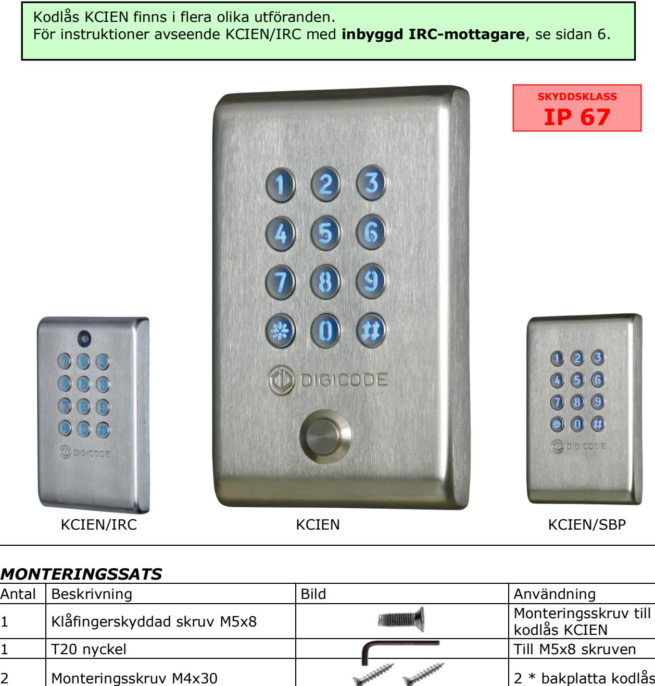
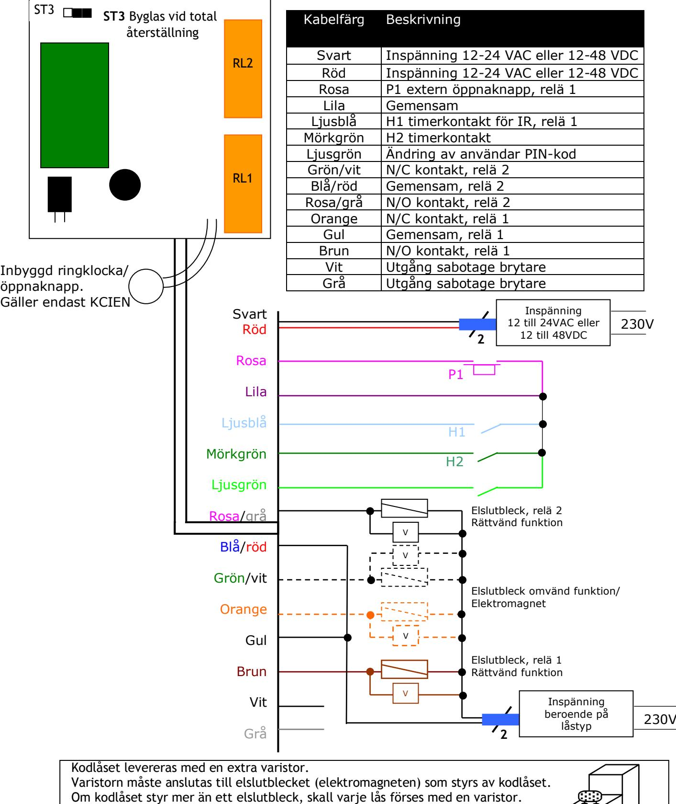

**Email: info@cdvi.se Web: www.cdvi.se**

**KCIEN, KCIEN/SBP, KCIEN/IRC** *ROSTFRITT KODLÅS MED BAKGRUNDSBELYST* 

*KNAPPSATS, 100 PIN-KODER*

I

1 Varistor 05D 680K Till låset

Dimensioner knappsats: 140 x 85 x 20 mm

2 Plastplugg S5 2 * bakplatta kodlås

| I. PRODUKTINFORMATION 3                             |  |
|-----------------------------------------------------|--|
| A. BESKRIVNING AV KCIEN3                            |  |
| B. STANDARDVÄRDEN 3                                 |  |
| C. SUMMER 3                                         |  |
| D. KODLÄNGD3                                        |  |
| E. INGÅNG FÖR EXTERN ÖPPNAKNAPP3                    |  |
| F. FÖRBRUKNING3                                     |  |
| II. PROGRAMMERING4                                  |  |
| A. PROGRAMMERA TIDER4                               |  |
| B. STÄLLA IN KODLÄNGD 4                             |  |
| C. ÄNDRA MASTERKODEN 4                              |  |
| D. TOTAL ÅTESTÄLLNING AV MINNET5                    |  |
| E. ÅTERSTÄLLA MASTERKODEN 5                         |  |
| F. PROGRAMMERA EN UNDERMASTERKOD5                   |  |
| G. LÄGGA TILL, ÄNDRA ELLER TA BORT EN ANVÄNDARKOD 5 |  |
| H. ANVÄNDARÄNDRING AV EGEN KOD 6                    |  |
| I. LJUDSIGNAL VID KNAPPTRYCKNING6                   |  |
| J. PROGRAMMERING AV KCIEN/IRC6                      |  |
| K. AKTIVERA IRC-SÄNDARE6                            |  |
| L. BEKRÄFTELSE AV IRC-SÄNDARE6                      |  |
| M. PROGRAMMERING AV KODGRUPPER 6                    |  |
| III. KOPPLINGSSCHEMA 7                              |  |
| IV. ANTECKNINGAR8                                   |  |
| MASTERKOD 8                                         |  |
| ANVÄNDARKODLISTA8                                   |  |

## I. PRODUKTINFORMATION

#### *A. BESKRIVNING AV KCIEN*

Inspänning 12 – 24 VAC fri spänning Inspänning 12 – 48 VDC fri spänning 12-siffrig bakgrundsbelyst knappsats EPROM minneslagring 100 valfria PIN-koder med 4-, 5- eller 6-siffrig kod 2 reläutgångar, N/O eller N/C-kontakt 6A/250V 1 valfri masterkod, 4-, 5- eller 6 siffrig Summer 1 ingång för extern öppnaknapp 1 inbyggd ringklocka/öppnaknapp i knappsatsen (gäller ej KCIENSBP)

#### *B. STANDARDVÄRDEN*

Öppningstid: 1 sekund Kodlängd: 5-siffrig Masterkod: 12345 Programmeringslägestid: 120 sekunder Undermasterkod: * och #

Bakgrundsbelysningstid: 10 sekunders belysning av knappsatsen

#### *C. SUMMER*

| 1 kort pipsignal    | kodlåset spänningssatt                             |
|---------------------|----------------------------------------------------|
| 1 lång pipsignal    | data sparas i programmeringsläge eller godkänd kod |
| 2 korta pipsignaler | åtkomst till eller avsluta programmeringsläget     |
| 4 korta pipsignaler | databehandlingsfel                                 |

#### *D. KODLÄNGD*

#### **Masterkoden och användarnas PIN-koderna kan vara 4-, 5- eller 6-siffriga**

Alla knappar på knappsatsen kan användas för att programmera en kod. Masterkoden *KAN INTE* användas som användarkod. Koderna 0000, 00000 och 000000 kan endast användas för att ta bort en PIN-kod. För att ta bort en specifik kod: ersätt den med 0000 om det är en 4-siffrig kod respektive med 00000 eller 000000.

#### *E. INGÅNG FÖR EXTERN ÖPPNAKNAPP*

#### **Detta är en normalt öppen krets som fungerar vid aktivering av relä 1. Denna funktion är speciellt användbar för kontroll av lås.**

Ingång P1 aktiverar relä 1 (Utgången kan programmeras)

Timeringång H1 används endast för kodlås med inbyggd IR-sensor (KCIEN/IRC).

Timeringången H2 (om ansluten) gör det möjligt att använda alla knappar på knappsatsen som en extra öppnaknapp. Om timerkontakten är öppen, används 0-knappen som vanligt för användarkoder och om kontakten är sluten, fungerar alla knappar som öppnaknapp utifrån.

#### *F. FÖRBRUKNING*

| 12V AC:                                 | 20mA i standby läge, 70mA max med 2 relän aktiverade |
|-----------------------------------------|------------------------------------------------------|
| 24V AC:                                 | 10mA i standby läge, 40mA max med 2 relän aktiverade |
| 12V DC:                                 | Max 90mA med 2 relän aktiverade och tänd belysning   |
| 24V DC:                                 | Max 50mA med 2 relän aktiverade och tänd belysning   |
| (Låsets förbrukning är inte inkluderad) |                                                      |

# II. PROGRAMMERING

#### *A. PROGRAMMERA TIDER*

#### **Detta avsnitt beskriver programmeringen av tiderna för bakgrundsbelysning och reläaktivering**

- 1. Knappa in masterkoden två gånger (masterkodens default-värde är 12345). 2 pipsignaler bekräftar att man är i programmeringsläget.
- 2. Knappa in ***0** för att programmera knappsatsens bakgrundsbelysningstid. 1 pigsignal hörs. Knappa alltid in tiden med 2 siffror som motsvarar öppettiden i sekunder – **10** för 10 sekunder upp till **99** för 99 sekunder. Bakgrundsbelysningen lyser 10 sekunder efter sista knapptryckning eller släcks efter det att en giltig kod matats in. Knappa in **00** för konstant belysning av knapparna. En pipsignal bekräftar programmerad tid.
- ***1**

***0**

- 3. Knappa in ***1** för att programmera tiden för reläutgång 1 (dörröppningstid). 1 pigsignal hörs. Om det är en låst utgång, matas tiden in i sekunder – **01** för 1 sekund upp till **99** för 99 sekunder. Knappa in **00** om det är en bistabil utgång (reläet ändrar tillstånd varje gång en korrekt PIN-kod anges). En pipsignal bekräftar programmerad tid.
- 4. Tryck på **#** för att lämna programmeringsläget. 2 pipsignaler bekräftar att knappsatsen är i standby läge. 4 pipsignaler indikerar ett programmeringsfel.

### *B. STÄLLA IN KODLÄNGD*

#### **Detta avsnitt beskriver programmeringen av kodlängden**

- 1. Knappa in masterkoden två gånger (masterkodens default-värde är 12345). 2 pipsignaler bekräftar att man är i programmeringsläget.
- ***4**
- 2. Knappa in ***4** för att programmera kodlängden. 1 pigsignal hörs. Tryck sedan **4, 5** eller **6** för att ange önskad kodlängd. En pipsignal bekräftar att kodlängden är programmerad.

***5**

- 3. Knappa sedan direkt in ***5** för att ändra masterkoden. 1 pigsignal hörs. Knappa in en ny 4-, 5- eller 6 siffrig masterkod. En pipsignal bekräftar att de nya masterkoden är programmerad.
- 4. Tryck på **#** för att lämna programmeringsläget. 2 pipsignaler bekräftar att knappsatsen är i standby läge.

|                            |       | Ändras kodlängden ändras även samtliga inlagda koder enligt nedan: |        |
|----------------------------|-------|--------------------------------------------------------------------|--------|
| Master- eller användarkod: | 12369 | Master- eller användarkod:                                         | 12369  |
| Modifierad 4-siffrig kod:  | 2369  | Modifierad 6-siffrig kod:                                          | 012369 |

## *C. ÄNDRA MASTERKODEN*

#### **Masterkoden används endast för att komma in i programmeringsläget.**

- 1. Knappa in masterkoden två gånger (masterkodens default-värde är 12345). 2 pipsignaler bekräftar att man är i programmeringsläget.
- ***5**
- 2. Knappa in ***5** för att ändra masterkoden. 1 pigsignal hörs. Knappa in den nya 4-, 5 eller 6 siffrig masterkod. En pipsignal bekräftar att masterkoden är programmerad.
- 3. Tryck på **#** för att lämna programmeringsläget. 2 pipsignaler bekräftar att knappsatsen är i standby läge.

#### *D. TOTAL ÅTESTÄLLNING AV MINNET*

#### **Detta avsnitt beskriver en total återställning av minnet där alla inlagda koder raderas**

- 1. Knappa in masterkoden två gånger (masterkodens default-värde är 12345). 2 pipsignaler bekräftar att man är i programmeringsläget.
- ***6**

**ST3**

- 2. Knappa in ***6** för att återställa Masterkoden och radera samtliga PIN-koder. 1 pigsignal hörs. Tryck på ***** och **#** för att bekräfta radering av kodlåsets hela minne. Vänta på 2 pipsignaler. Masterkoden återställs till sitt default-värde (12345) och alla PIN-koder raderas från knappsatsen.
När återställningen är klar, återgår knappsatsen till standby läge.

## **ELLER**

- 1. Slå av strömmen. Bygla **ST3**.
- 2. Slå på strömmen igen. Vänta några sekunder. En pipsignal bekräftar att minnet är raderat. Ta bort byglingen från **ST3**. Masterkoden återställs till sitt defaultvärde (12345) och alla PIN-koder raderas från minnet.

### *E. ÅTERSTÄLLA MASTERKODEN*

I standby läge, bygla **ST3**. Vänta en sekund och ta sedan bort bygligen.1 pigsignal hörs. Masterkoden återställs till sitt default-värde, 123456 för 6-siffrig kod respektive 12345 eller 1234 för 5- och 4-siffrig kodlängd.

#### *F. PROGRAMMERA EN UNDERMASTERKOD*

**Med undermasterkoden kan användaren ändra sin egen kod utan att behöva gå in i programmeringsläget. Av säkerhetsskäl måste användarkoderna ändras med jämna mellanrum. Med denna funktion kan användarna enklare och snabbare ändra sin egen kod.** 

- 1. Knappa in masterkoden två gånger (masterkodens default-värde är 12345). 2 pipsignaler bekräftar att man är i programmeringsläget.

- 2. Knappa in ***7** för att programmera en undermasterkod som ger användaren möjlighet att ändra sin egen PIN-kod. 1 pigsignal hörs. Knappa in en ny 2-siffrig undermasterkod. En pipsignal bekräftar att undermasterkoden är programmerad.
- 3. Tryck på **#** för att lämna programmeringsläget. 2 pipsignaler bekräftar att knappsatsen är i standby läge.

### *G. LÄGGA TILL, ÄNDRA ELLER TA BORT EN ANVÄNDARKOD*

Grupp 1: från plats **00** till plats **99**, reläutgång 1

- 1. Knappa in masterkoden två gånger (masterkodens default-värde är 12345). 2 pipsignaler bekräftar att man är i programmeringsläget.

- 2. **För att lägga till en användarkod**, knappa in användarens adress (mellan **00** och **99**). Om användaradressen är ledig, hörs en pipsignal. Knappa in den 4-, 5- eller 6 siffriga PIN-koden.
- 3. **För att ändra en användarkod**, knappa in användarens adress. 4 pipsignaler anger att användaradressen redan är programmerad. Knappa in en ny 4-, 5- eller 6 siffrig PIN-kod. En pipsignal bekräftar den nya användarkoden.
- 4. **För att ta bort en användarkod**, knappa in användarens adress. 4 pipsignaler hörs. Knappa in **00000** för en 5-siffrig kod eller **0000** respektive **000000** för en 4- eller 6 siffrig kod. En pipsignal bekräftar att PIN-koden är raderad. **OBS!** Om PIN-koden redan är använd eller är densamma som masterkoden, hörs 4 pipsignaler.
- 5. Tryck på **#** för att lämna programmeringsläget. 2 pipsignaler bekräftar att knappsatsen är i standby läge.

#### *H. ANVÄNDARÄNDRING AV EGEN KOD*

#### **För att en användare ska få tillstånd att ändra sin egen PIN-kod skall ljusgrön samt lila kabel tvinnas ihop.**

- 1. Knappa in den gamla PIN-koden. Reläet aktiveras och en pipsignal hörs.
- 2. Knappa in den 2-siffriga undermasterkoden (default-undermasterkod är ***** och **#**). En pipsignal bekräftar tillstånd för ändringen.
- 3. Knappa in den nya PIN-koden. 2 pipsignaler bekräftar den nya koden samtidigt som knappbelysningen släcks. Testa den nya PIN-koden för att försäkra dig om att ändringen gjorts.

#### *I. LJUDSIGNAL VID KNAPPTRYCKNING*

Summern är aktiverad i programmeringsläge och när reläet är slutet efter inmatning av giltig kod. För att aktivera ljudindikering vid knapptryckning:

- 1. Knappa in masterkoden två gånger (masterkodens default-värde är 12345). 2 pipsignaler bekräftar att man är i programmeringsläget.

- 2. Tryck ******. 1 pigsignal hörs. Tryck **0** för att avaktivera ljudsignal vid knapptryckning. Tryck **1** för att aktivera ljudsignalen vid knapptryckning. 1 pipsignal bekräftar den nya inställningen.
- 3. Tryck **#** för att lämna programmeringsläget. 2 pipsignaler bekräftar att man lämnat programmeringsläget.

#### *J. PROGRAMMERING AV KCIEN/IRC*

Programmeringsinstruktionerna är i övrigt desamma som för KCIEN och KCIEN/SBP. **För att IRC-funktionen skall fungera skall ljusblå samt lila kabel tvinnas ihop.**

- 1. Knappa in masterkoden två gånger (masterkodens default-värde är 12345). 2 pipsignaler bekräftar att man är i programmeringsläget.

- 2. Tryck ***#**. 1 pigsignal hörs. Välj aktuell IRC-kanal genom att trycka **1** till **7**, eller **9** för att välja alla kanaler.
- 3. Tryck **0** för att avaktivera eller **1** för att aktivera aktuell kanal. 1 pipsignal bekräftar den nya inställningen. Tex **9** följt av **1** aktiverar alla kanaler.
- 4. Tryck **#** för att lämna programmeringsläget. 2 pipsignaler bekräftar att man lämnat programmeringsläget.

#### *K. AKTIVERA IRC-SÄNDARE*

För att aktivera en IRC-sändare, tryck en gång på sändaren för att överföra koden. 2 pip bekräftar mottagandet. Tryck på sändaren en gång till för att aktivera reläet.

#### *L. BEKRÄFTELSE AV IRC-SÄNDARE*

Bakgrundsbelysningen blinkar till samt ett pip bekräftar godkänd IRC-sändare. Snabba blinkningar av bakgrundsbelysningen samt flera pip indikerar felaktig IRCsändare. Kontakta hyresvärden.

#### *M. PROGRAMMERING AV KODGRUPPER*

Grupp 1: från användarplats 00 till användarplats 59 för aktivering av relä 1 Grupp 2: från användarplats 60 till användarplats 99 för aktivering av relä 2

**Frånslagstid för relä 2:** tryck ***2 Undermasterkod för grupp 2:** tryck ***8** (defaultvärden 1 och 3)

# III. Kopplingsschema

Varistorn kontrollerar den överspänning som produceras av magnetspolen – backspänningsspikar. Det rekommenderas att använda en separat spänningskälla när man styr ett elektromagnetiskt lås.

# IV. Anteckningar

## *MASTERKOD*

| Masterkod |  |  |  | Masterkod |  |
|-----------|--|--|--|-----------|--|
| Masterkod |  |  |  | Masterkod |  |
|           |  |  |  |           |  |

| Masterkod |  |  |  |  |  |
|-----------|--|--|--|--|--|
| Masterkod |  |  |  |  |  |
|           |  |  |  |  |  |

Stryk över när ny kod programmeras. Skriv ner den nya koden i nästa lediga ruta. Använd blyerts för användarkoderna.

| Undermasterkod |  | Undermasterkod |  |
|----------------|--|----------------|--|
|                |  |                |  |
| Undermasterkod |  | Undermasterkod |  |
|                |  |                |  |
| Undermasterkod |  | Undermasterkod |  |
|                |  |                |  |

| Undermasterkod |  |  |  |  |
|----------------|--|--|--|--|
|                |  |  |  |  |
| Undermasterkod |  |  |  |  |
|                |  |  |  |  |
| Undermasterkod |  |  |  |  |
|                |  |  |  |  |

#### *ANVÄNDARKODLISTA*

| 00 | 34 | 68 |
|----|----|----|
| 01 | 35 | 69 |
| 02 | 36 | 70 |
| 03 | 37 | 71 |
| 04 | 38 | 72 |
| 05 | 39 | 73 |
| 06 | 40 | 74 |
| 07 | 41 | 75 |
| 08 | 42 | 76 |
| 09 | 43 | 77 |
| 10 | 44 | 78 |
| 11 | 45 | 79 |
| 12 | 46 | 80 |
| 13 | 47 | 81 |
| 14 | 48 | 82 |
| 15 | 49 | 83 |
| 16 | 50 | 84 |
| 17 | 51 | 85 |
| 18 | 52 | 86 |
| 19 | 53 | 87 |
| 20 | 54 | 88 |
| 21 | 55 | 89 |
| 22 | 56 | 90 |
| 23 | 57 | 91 |
| 24 | 58 | 92 |
| 25 | 59 | 93 |
| 26 | 60 | 94 |
| 27 | 61 | 95 |
| 28 | 62 | 96 |
| 29 | 63 | 97 |
| 30 | 64 | 98 |
| 31 | 65 | 99 |
| 32 | 66 |    |
| 33 | 67 |    |

Tryck **#** för att gå ur programmeringsläge. Två pip bekräftar att kodlåset är i standby läge.

| Ansvarig:           |        | Datum: |  |  |
|---------------------|--------|--------|--|--|
| Byggnad             |        |        |  |  |
| :Nr :            | Gata : |        |  |  |
| Stad :              |        |        |  |  |
| Övrig information : |        |        |  |  |