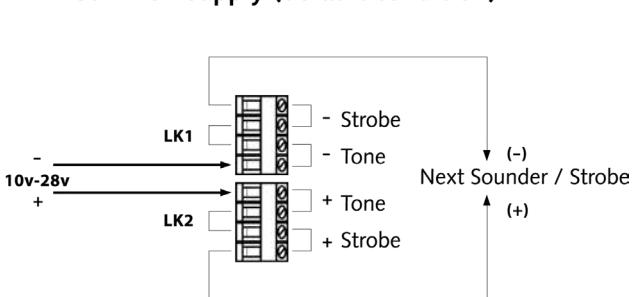
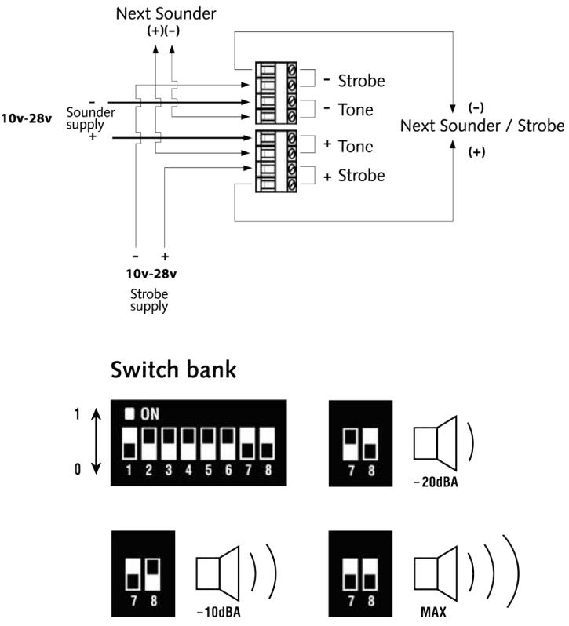
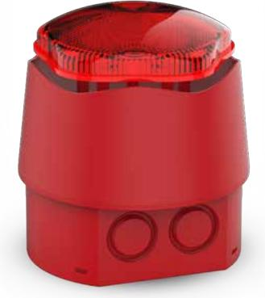

## **KOMBILARMDON SB-BE-EL-66**

Den kombinerade blixt / sirenen levereras med energisnål LED-blixt. Sirenen har 32 olika tonkaraktärer. Mycket låg energiförbrukning.

Godkänd enligt EN 54-3 och CPD certifierad. Kapslingsklass IP45 och IP66. Passar även bra i kombibrandlarm med 12 VDC spänning.

## **TEKNISKA SPECIFIKATIONER**

| Diameter (mm)               | 92               |
|-----------------------------|------------------|
| Höjd (mm)                   | 109              |
| Spänning (VDC)              | 9-30             |
| Strömförbrukning Blixt (mA) | 12-16            |
| Strömförbrukning Siren (mA) | 3-39 (se tabell) |
| Ljudstyrka (dBA)            | 94-110           |
| Ljudkaraktär                | 32 Toner         |
| Volymkontroll               | 3 Steg           |
| Vikt                        | 0.35kg           |
| Temperaturområde(C)         | -40 till +55 C   |
| Certifierad enligt          | CPD, EN54-3      |

## **ARTIKELNUMMER**

| Siren/Blixt IP45 | SB-BE-EL-45 | E6301036 |
|------------------|-------------|----------|
| Siren/Blixt IP66 | SB-BE-EL-66 | E6301035 |

| No. | Sound Frequencies and Patterns                              | Code 12345 | Description                  | EN54-3 28VDC | Typ SPL!@1 m on axis |     | Typ Current mA |     |
|-----|-------------------------------------------------------------|---------------|------------------------------|-----------------|----------------------------|-----|-------------------|-----|
|     |                                                             |               |                              |                 | 12V                        | 24V | 12V               | 24V |
| 1   | 800Hz to 950Hz swept at 120Hz                               | 00000         | Banshee Buzz LF              | -               | 94                         | 100 | 6                 | 12  |
| 2   | 800Hz to 950Hz swept at 9Hz                                 | 10000         | Banshee Fast Sweep LF        | √               | 94                         | 100 | 6                 | 12  |
| 3   | 800Hz to 950Hz swept at 3Hz                                 | 01000         | Banshee Slow Sweep LF        | -               | 94                         | 100 | 6                 | 12  |
| 4   | Continuous at 900Hz                                         | 11000         | Banshee Continuous LF        | -               | 94                         | 100 | 6                 | 12  |
| 5   | 830Hz to 970Hz swept at 9Hz                                 | 00100         | Banshee Fast Sweep LF (New)  | -               | 93                         | 100 | 6                 | 12  |
| 6   | 800Hz to 970Hz swept at 1Hz                                 | 10100         | Medium Sweep LF              | √               | 94                         | 100 | 6                 | 12  |
| 7   | Continuous at 950Hz                                         | 01100         | Continuous LF                | -               | 94                         | 99  | 6                 | 13  |
| 8   | Intermittent at 950Hz 1s on, 1s off                         | 11100         | Backup Alarm LF              | -               | 93                         | 99  | 7                 | 14  |
| 9   | Alternating 800Hz/1000Hz at 1Hz                             | 00010         | Alternate LF                 | -               | 94                         | 100 | 6                 | 13  |
| 10  | 800Hz/1000Hz swept at 0.5s                                  | 10010         | Medium Sweep LF              | -               | 94                         | 100 | 6                 | 12  |
| 11  | Alternating tones 800/950Hz at 3Hz                          | 01010         | Alternate LF                 | -               | 94                         | 101 | 6                 | 12  |
| 12  | 2400Hz to 2900Hz at 120Hz                                   | 11010         | Banshee buzz HF              | -               | 102                        | 109 | 16                | 35  |
| 13  | 2400Hz to 2900Hz at 9Hz                                     | 00110         | Banshee Fast Sweep HF        | -               | 103                        | 110 | 17                | 35  |
| 14  | 2400Hz to 2900Hz at 3Hz                                     | 10110         | Banshee Slow Sweep HF        | -               | 103                        | 110 | 17                | 35  |
| 15  | Continuous 2900Hz                                           | 01110         | Banshee Continuous HF        | -               | 103                        | 109 | 19                | 39  |
| 16  | 2450Hz to 3100Hz swept at 9Hz                               | 11110         | Banshee Fast Sweep HF (New)  | -               | 103                        | 109 | 18                | 36  |
| 17  | Intermittent at 2900Hz 1sec on, 1sec off                    | 00001         | Backup Alarm HF              | -               | 103                        | 109 | 18                | 36  |
| 18  | Alternating tones 2400/2900Hz at 3Hz                        | 10001         | Alternate HF                 | -               | 104                        | 110 | 16                | 36  |
| 19  | 500Hz rising to 1200Hz over 3.5 sec, silence 0.5sec,        | 01001         | Slow Whoop                   | √               | 95                         | 101 | 6                 | 12  |
| 20  | 1200Hz falling to 500Hz over 1sec, silence 10mS             | 11001         | Din Tone (DK)                | √               | 93                         | 100 | 5                 | 10  |
| 21  | 554Hz for 100ms and 440Hz for 400mS                         | 00101         | French Fire Sounder          | √               | 90                         | 96  | 4                 | 7   |
| 22  | 420Hz repeating 0.625 sec on, 0.625 sec off                 | 10101         | Australian Alert Signal      | -               | 89                         | 94  | 3                 | 6   |
| 23  | 500Hz to 1200Hz sweeping 3.75 secs on, 0.25 secs off        | 01101         | Australian Evacuation Signal | -               | 95                         | 101 | 6                 | 12  |
| 24  | 950Hz for 0.5s on 0.5s off, for 3 phases, silence for 1.5s  | 11101         | US Temporal Tone LF          | -               | 93                         | 99  | 5                 | 10  |
| 25  | 2900Hz for 0.5s on 0.5s off, for 3 phases, silence for 1.5s | 00011         | US Temporal Tone HF          | -               | 103                        | 109 | 13                | 26  |
| 26  | Intermittent 660Hz 150mS on, 150mS off                      | 10011         | Swedish Tone (Fire)          | -               | 90                         | 96  | 3                 | 6   |
| 27  | Continuous 660Hz                                            | 01011         | Swedish Tone (All Clear)     | -               | 91                         | 97  | 5                 | 9   |
| 28  | Intermittent 970Hz 500mS on, 500mS off                      | 11011         | ISO8201 LF                   | -               | 90                         | 96  | 5                 | 10  |
| 29  | Intermittent 2900Hz 500mS on, 500mS off                     | 00111         | ISO8201 HF                   | -               | 103                        | 109 | 13                | 27  |
| 30  | Yodel 800Hz/1000Hz, 0.25 sec                                | 10111         | BT Banshee (FP1063.1)        | -               | 94                         | 100 | 6                 | 12  |
| 31  | Continuous 1000Hz                                           | 01111         | BT Banshee (FP1063.1)        | -               | 88                         | 94  | 6                 | 14  |
| 32  | Bell Tone                                                   | 11111         | Bell Tone                    | -               | 94                         | 99  | 12                | 25  |