### dormakaba½

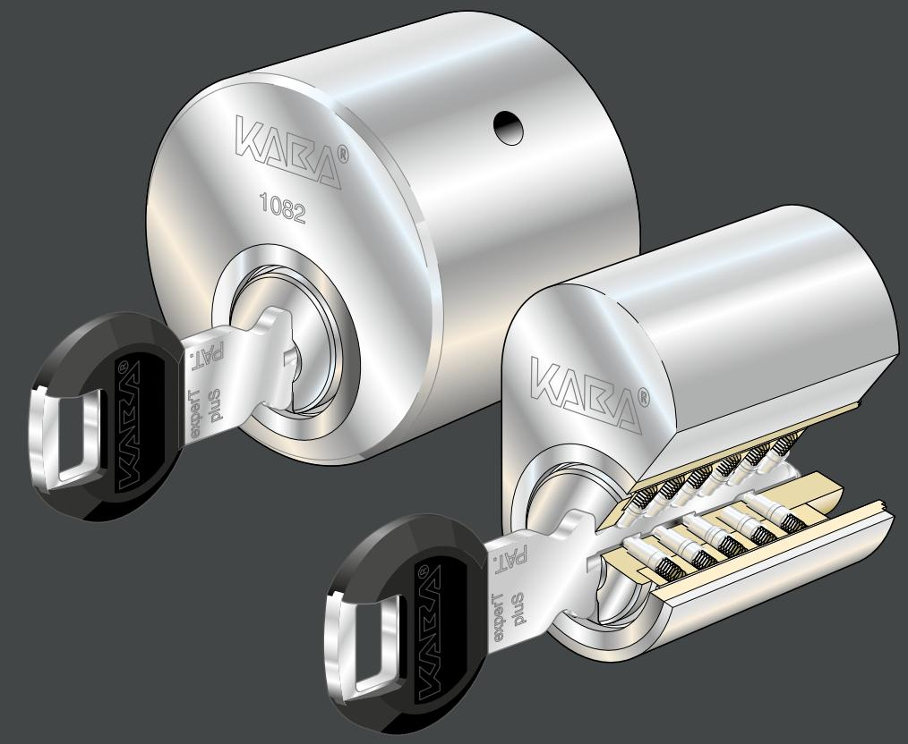

# Kaba experT pluS

Det optimala låssystemet

## **Kaba experT pluS** har juridiska skydd mot otillåten nyckelkopiering med patent sökt på nyckel och cylinder till 2033

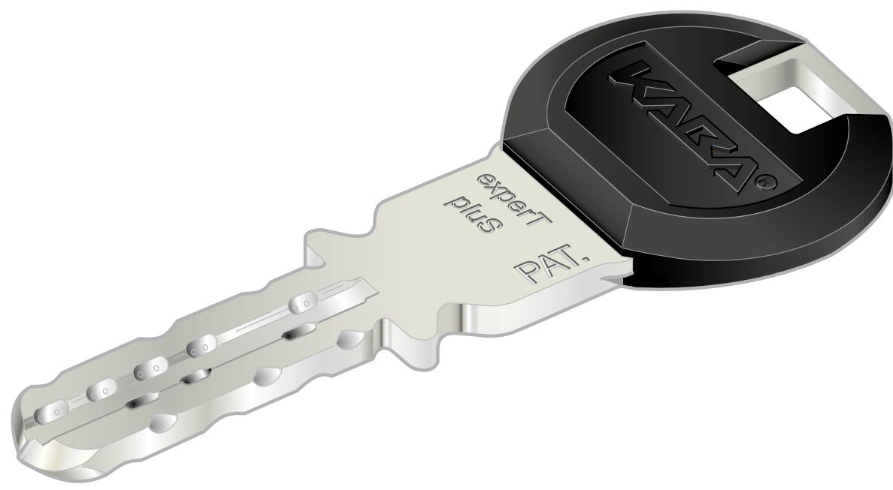

#### **Kabanyckeln – användarvänlig och vändbar**

Kabanyckeln är genom sin speciella utformning extremt användarvänlig. Istället för vassa kanter som sliter på cylindern och i fickan har Kabanyckeln precisionsfrästa delningar i nyckeln. Denna speciella teknologi gör att nyckeln får en mjuk och fin gång i cylindern. Det faktum att Kabanyckeln dessutom är vändbar innebär att det inte har någon betydelse åt vilket håll man vänder nyckeln när man sätter den i cylindern. Detta innebär att nyckelns livslängd fördubblas i och med att man bara använder ena halvan av nyckeln vid varje öppning eller låsning av cylindern.

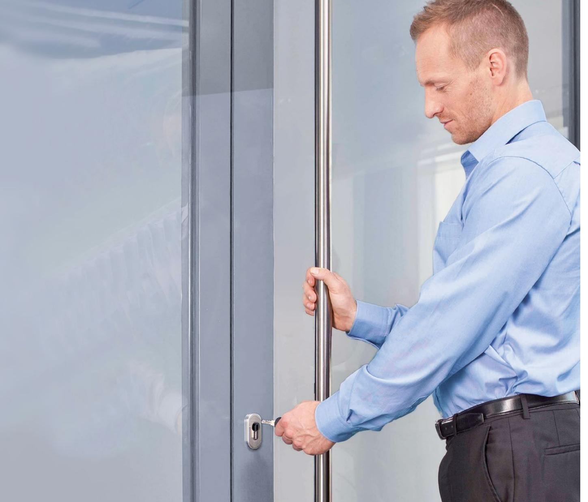

#### **Kabacylindern – ett litet under av prescision**

Kabas cylindrar är utvecklade för att tillfredställa kundernas speciella säkerhetsbehov. Med Kaba experT pluS erbjuder vi en cylinderserie som är anpassad till de flesta låshus på marknaden. Gemensamt för samtliga Kabacylindrar är den tekniska precisionen som ger cylindern mycket högt dyrkmotstånd och lång livslängd.

#### **Kabaprincipen skapar möjligheter**

Speciellt för Kabas låscylindrar (det vi kallar "Kabaprincipen") är att man använder sig av flera stiftrader placerade i olika vinklar i förhållande till varandra. Varje Kaba experT pluS-cylinder har 22 st stiftkanaler, varav två rader med sidstift och två rader med kantstift. Detta möjliggör ett stort antal olika låsningskombinationer.

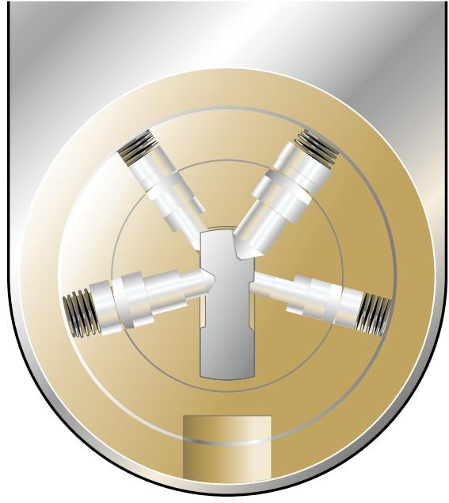

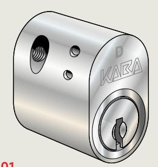

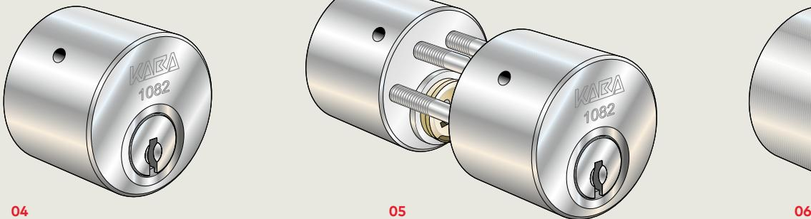

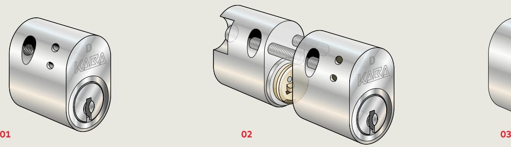

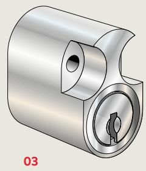

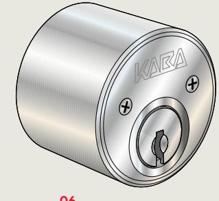

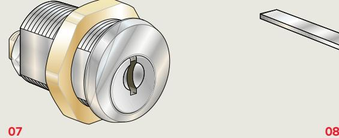

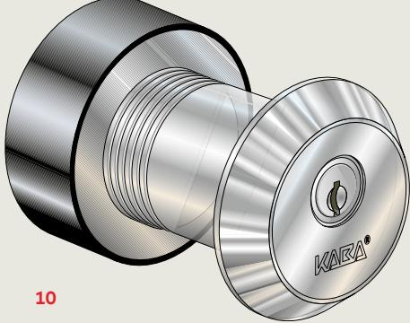

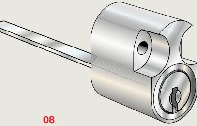

**01 2048, 2048D*** Oval enkelcylinder, utsida

**02 2048CF, 2048CFD*** Oval dubbelcylinder

**03 2048F** Oval enkelcylinder, insida

**04 1082*** Rund enkelcylinder, utsida

**05 1083*** Rund dubbelcylinder

**06 1084*** Rund enkelcylinder, insida

**07 1071** Cylinder för postboxar och skåp

**08 2048FG** Oval enkelcylinder för låsbara handtag

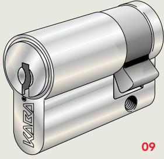

**09 4000** Europacylinder, enkel

**10 20067** Dörrnyckeltub avsedd att användas som tillfällig förvaringsplats för lägenhetsnycklar. Uppfyller Försäkringsförbundets krav för nyckelförvaringsenhet (DNT) i klass 2 enligt intyg av SBSC AB.

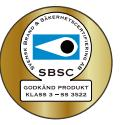

*2048D, 2048CFD, 1082, 1083 och 1084 kan ingå i Godkänd låsenhet enligt SS3522.

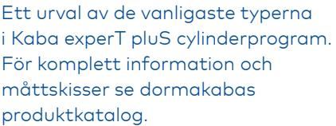

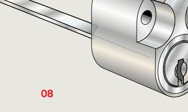

## **1 miljon** skäl att anlita en experT

**Frågan är om det finns någon låscylinder med högre kvalitet än Kaba experT pluS? Vi har genomfört test med konceptet Kaba experT, där mekaniken låses och låses upp, om och om igen – över 1 miljon låscykler, det är tio gånger så många som krävs för att uppnå försäkringsbolagens högsta klass. Det betyder också att du kan låsa och låsa upp din dörr cirka 27 gånger om dagen i 100 år utan att cylindern slits ut (förutsatt att Kabas skötselanvisningar följs).**

#### **Vi är supersäkra!**

Vi är så säkra på vår kvalitét att vi lämnar 12 års funktionsgaranti på fabriksproducerade Kaba experT pluS låscylindrar. Garantin gäller under förutsättning att kabas underhållsavtal tecknas med någon av våra licensierade servicepartners.

Fördelar med underhållsavtal:

- Kontinuerlig service förebygger framtida problem
- Ökar livslängden på låssystemet
- Överblick över framtida kostnader

Kaba tillhandahåller service-/ garantibok för att säkerställa att service sker.

#### **Säker nyckelhantering**

Kaba experT pluS-nyckeln är juridiskt skyddad genom patent. Nycklar får endast tillverkas hos en av kunden utvald Kaba experT pluS-licensierad låssmed.

Varje nyckel registreras och lämnas ut mot uppvisande av: • Rekvisition

- Legitimation
- Kontrollkort

#### **Integrera med Kaba elektroniska lås och passersystem**

Den som investerar i ett Kaba experT pluS låssystem har alltid möjlighet att integrera det med Kabas elektroniska lås och passersystem i framtiden. Kaba experT pluS-nyckeln uppgraderas genom att nyckelgreppet byts till ett legic- eller Mifaregrepp.

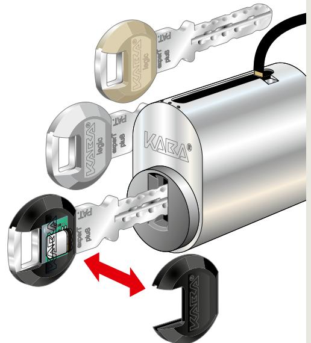

### **Hänglås**

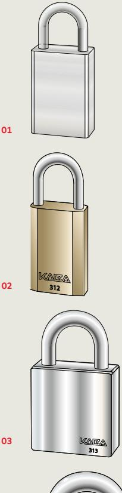

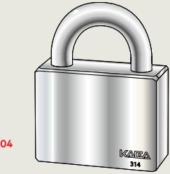

#### **01**

**310** Oklassat hänglås för invändig låsning. För modulcylinder 2000. Självlåsande med nyckeln urtagbar i både låst och olåst läge.

#### **02**

**312** Certifierat av SBSC i klass 2.

För låsning av källar- och vindskontor. Invändig låsning av galler och lucka i skyddsklass 1 och 2. I kombination med intygad kätting som låsning av båtar med vikt under 200 kg samt cykel. Levereras som standard ej självlåsande, nyckeln urtagbar endast i låst läge. Kan även erhållas självlåsande.

#### **03**

**313** Certifierat av SBSC i klass 3.

För invändig låsning av dörr, port och lucka i skyddsklass 1, 2 och 3 samt invändig låsning av galler i skyddsklass 3. I kombination med intygad kätting som låsning av motorcyklar och mopeder samt båtar med vikt över 200 kg och båtmotorer. Ej självlåsande, nyckeln urtagbar endast i låst läge.

#### **04**

**314** Certifierat av SBSC i klass 4.

För utvändig låsning av dörr, port, lucka och galler i skyddsklass 1, 2 och 3. Ej självlåsande, nyckeln urtagbar endast i låst läge.

6

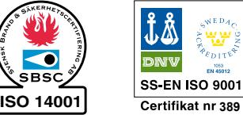

dormakaba Sverige AB F O Petersons gata 28 421 31 Västra Frölunda T: 016-16 15 00 T: 031-355 20 00 info.se@dormakaba.com www.dormakaba.se