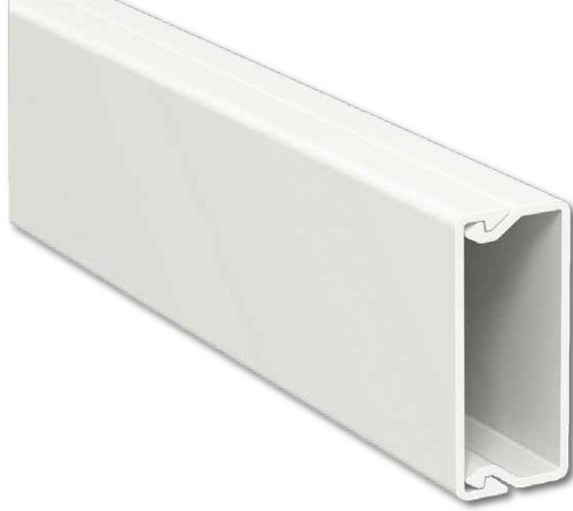

## **Kabelkanal CatMax**

## **17 x 20 mm dubbelhäftande tejp 2,1m halogenfri**

## **Produktinformation**

Artikelnummer

321510111

Produktområde Produktnamn Material Färg Dimension Montering

Antal per kartong Temperaturområde IP-kapslingsklass Längd Höjd Bredd Miljöegenskaper

Kanalisation CatMax ABS plast Vit RAL 9010 17 x 20 mm Förstansade hål C/C 200 mm dubbelhäftande tejp 63 m, 30 st -25 C - +60 C IP20 2100 mm 17 mm 20 mm Halogenfri o o

**Tillbehör**

| Artikelnummer |  |
|---------------|--|
| 321510114     |  |

| Innerhörn   | 321510114 |
|-------------|-----------|
| Ytterhörn   | 321510115 |
| L-Stycke    | 321510116 |
| T-stycke    | 321510117 |
| Skarvstycke | 321510118 |
| Ändstycke   | 321510119 |