#### **Kabelöverföring ABLOY EA280, EA281**

# **Användningsområde**

Kabelöverföring ABLOY EA280/EA281 är avsedda för överföring av kablar mellan dörr och karm.

# **Egenskaper**

För högsta driftsäkerhet ska mångtrådig mjuk kabel användas, max Ø 7,4 mm. ABLOY EA281 används om dörrens öppningsvinkel är större än 120 ° eller om sidoförskjutningen på överföringsfjädern är större än 40 mm.

#### **Funktion**

Kabelöverförningen installeras i övre delen på dörrens gångjärnssida. Urtag för skyddsblecket sker i dörren. Ledningsgenomdragning sker innan fastmontering. Borrningarna ska göras stora nog för att ledningarna ska kunna röra sig något bakom skyddsbleck och fjäder.

# **OBS!**

Aldrig mer än en kabel per överföring.

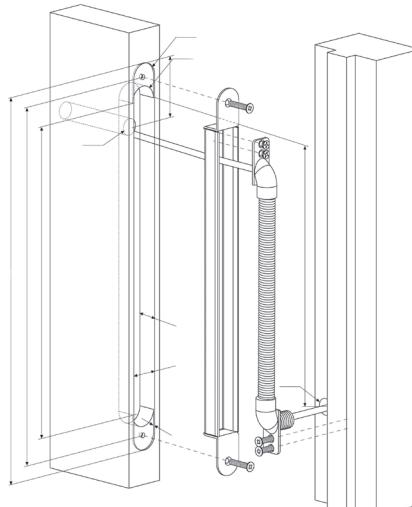

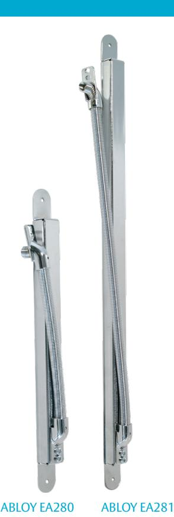

#### **SOLID 83**

# **Användningsområde**

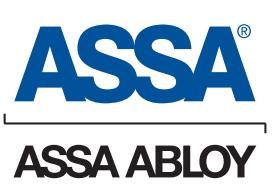

SOLID 83 är en 400 mm flexibel metallslang med fästen i vit plast. Kabel max Ø 6 mm.

SOLID 83/600

Samma som ovan, men 600 mm.

SOLID 83 finns också som metervara.

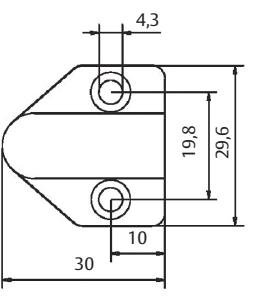

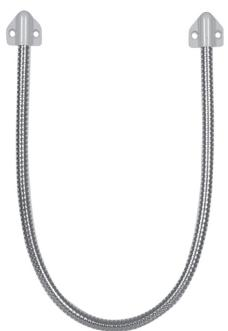

#### **Kabelöverföring ABLOY EA280, EA281**

# **Användningsområde**

Kabelöverföring ABLOY EA280/EA281 är avsedda för överföring av kablar mellan dörr och karm.

# **Egenskaper**

För högsta driftsäkerhet ska mångtrådig mjuk kabel användas, max Ø 7,4 mm. ABLOY EA281 används om dörrens öppningsvinkel är större än 120 ° eller om sidoförskjutningen på överföringsfjädern är större än 40 mm.

#### **Funktion**

Kabelöverförningen installeras i övre delen på dörrens gångjärnssida. Urtag för skyddsblecket sker i dörren. Ledningsgenomdragning sker innan fastmontering. Borrningarna ska göras stora nog för att ledningarna ska kunna röra sig något bakom skyddsbleck och fjäder.

#### **OBS!**

Aldrig mer än en kabel per överföring.

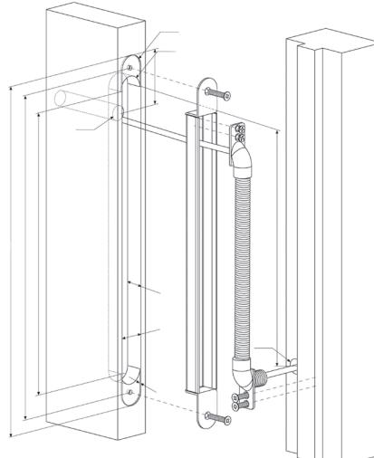

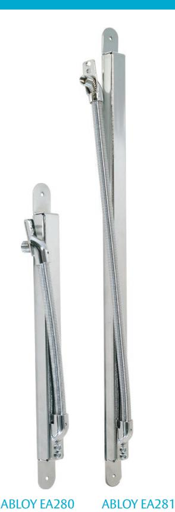

#### **SOLID 83**

#### **Användningsområde**

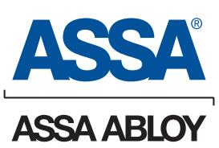

SOLID 83 är en 400 mm flexibel metallslang med fästen i vit plast. Kabel max Ø 6 mm.

SOLID 83/600 Samma som ovan, men 600 mm.

SOLID 83 finns också som metervara.

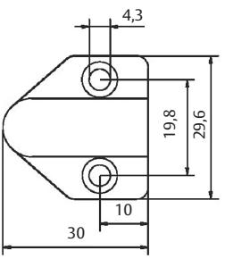

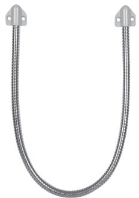

#### **Karmkontakt SOLID 88**

#### **Användningsområde**

Karmkontakt används för att överföra elektriska signaler mellan dörr och karm.

#### **Egenskaper**

4-polig karmkontakt tillverkad av grå plast med fjädrande kulor. OBS! Skall inte användas till motorlås.

#### **Tekniska data**

Ström: Max 0,5 A

Arbetsavstånd: Max 5 mm mellan dörr och karm Spänning: Max 24 VAC/VDC

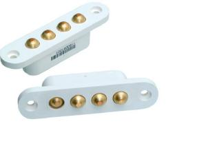

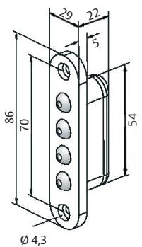

#### **Anslutningskablar ABLOY EA220, EA224, EA225, ASSA 817121, 817122**

ASSA och ABLOY färdigkontakterade mångtrådiga anslutningskablar är avsedda för att överföra signaler mellan lås och styrsystem.

Varje låstyp kräver en unik kabel, se tabeller nedan.

ASSAs kablar är speciellt konstruerade för att klara den svåra miljö som dörren utgör med stora temperaturskillnader och hårt slitage.

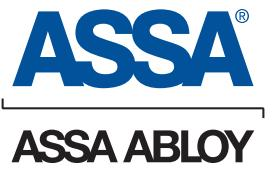

ASSA ABLOY, the global leader in door opening solutions, dedicated to satisfying end-user needs for security, safety and convenience.

ASSA AB P.O. Box 371 SE-631 05 Eskilstuna Sweden

phone +46 (0)16 17 70 00 fax +46 (0)16 17 72 10

Customer support: phone +46 (0)771 640 640 fax +46 (0)16 17 73 72 e-mail: helpdesk@assa.se

| Anslutningskablar till ASSA el- motor- och mikrobrytarlås |       |                                                |              |  |  |
|-----------------------------------------------------------|-------|------------------------------------------------|--------------|--|--|
| Kabeltyp                                                  | Längd | Passar till                                    | Ersätter     |  |  |
| EA220                                                     | 10 m  | 880, 884                                       | EA210, EA206 |  |  |
| EA225                                                     | 10 m  | Samtliga ASSA motorlås                         | EA215, 8855  |  |  |
| 81 71 21                                                  | 10 m  | 881, 885, 886                                  |              |  |  |
| 81 71 22                                                  | 10 m  | Samtliga Evolution mekaniska mikrobrytarlås |              |  |  |

| Anslutningskablar till ABLOY el- och motorlås |       |                            |                              |  |  |  |
|-----------------------------------------------|-------|----------------------------|------------------------------|--|--|--|
| Kabeltyp                                      | Längd | Passar till                | Ersätter                     |  |  |  |
| EA220                                         | 10 m  | EL580, EL582               | EA206, EA210, EA211, 8850 |  |  |  |
| EA224                                         | 10 m  | EL554, EL555, EL854, EL648 | EA214, 8853                  |  |  |  |
| EA225                                         | 10 m  | 8164, 8165, EL650          | EA215, 8855                  |  |  |  |

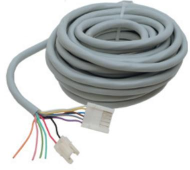

#### **Karmkontakt SOLID 88**

#### **Användningsområde**

Karmkontakt används för att överföra elektriska signaler mellan dörr och karm.

#### **Egenskaper**

4-polig karmkontakt tillverkad av grå plast med fjädrande kulor. OBS! Skall inte användas till motorlås.

#### **Tekniska data**

Ström: Max 0,5 A

Arbetsavstånd: Max 5 mm mellan dörr och karm Spänning: Max 24 VAC/VDC

#### **Anslutningskablar ABLOY EA220, EA224, EA225, ASSA 817121, 817122**

ASSA och ABLOY färdigkontakterade mångtrådiga anslutningskablar är avsedda för att överföra signaler mellan lås och styrsystem.

Varje låstyp kräver en unik kabel, se tabeller nedan.

ASSAs kablar är speciellt konstruerade för att klara den svåra miljö som dörren utgör med stora temperaturskillnader och hårt slitage.

ASSA ABLOY, the global leader in door opening solutions, dedicated to satisfying end-user needs for security, safety and convenience.

ASSA AB P.O. Box 371 SE-631 05 Eskilstuna Sweden

phone +46 (0)16 17 70 00 fax +46 (0)16 17 72 10

Customer support: phone +46 (0)771 640 640 fax +46 (0)16 17 73 72 e-mail: helpdesk@assa.se

| Anslutningskablar till ASSA el- motor- och mikrobrytarlås |       |                                                |              |  |
|-----------------------------------------------------------|-------|------------------------------------------------|--------------|--|
| Kabeltyp                                                  | Längd | Passar till                                    | Ersätter     |  |
| EA220                                                     | 10 m  | 880, 884                                       | EA210, EA206 |  |
| EA225                                                     | 10 m  | Samtliga ASSA motorlås                         | EA215, 8855  |  |
| 81 71 21                                                  | 10 m  | 881, 885, 886                                  |              |  |
| 81 71 22                                                  | 10 m  | Samtliga Evolution mekaniska mikrobrytarlås |              |  |

| Anslutningskablar till ABLOY el- och motorlås |       |                            |                              |  |  |  |
|-----------------------------------------------|-------|----------------------------|------------------------------|--|--|--|
| Kabeltyp                                      | Längd | Passar till                | Ersätter                     |  |  |  |
| EA220                                         | 10 m  | EL580, EL582               | EA206, EA210, EA211, 8850 |  |  |  |
| EA224                                         | 10 m  | EL554, EL555, EL854, EL648 | EA214, 8853                  |  |  |  |
| EA225                                         | 10 m  | 8164, 8165, EL650          | EA215, 8855                  |  |  |  |

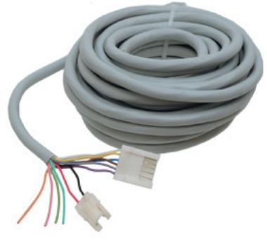