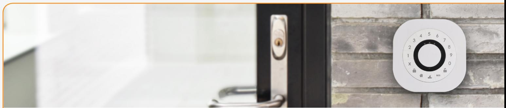
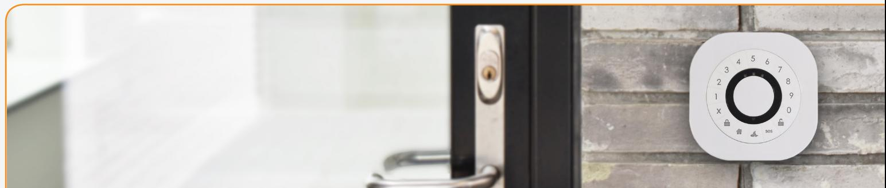

# **Keypad Enables secure access control**

The Zigbee-based Keypad includes a tag reader and allows for users to enable and disable an alarm system using a pin code and/or an RFID tag. In addition, access data can be updated remotely via a gateway to facilitate access control.

Key features are:

- RFID tag reader
- Battery-powered
- Tamper-protected
- Buzzer and LED

## **Saves battery when not in use**

The RFID only consumes energy when it is needed. The Keypad includes a sensor that detects when a person is within operating distance, which will enable the RFID and make the Keypad light up in the dark. This saves energy and allows for a longer battery lifetime.

- **• Easy installation**
- **• Secure communication**
- **• Intelligent backlight**

## **Numerous features and design options**

The Keypad includes a tamper switch that detects opening of the unit, which makes it suitable for alarm systems. Also, the Keypad includes a programmable buzzer for indication of entry, exit, alarms, or any other indication needed in your solution. Red, Green, and Yellow LEDs are available for indications of alarms, etc.

The Keypad can be delivered in white for indoor use or in black for outdoor use. The device has 16 buttons that you can design to fit your solution. The Keypad can be mounted on the wall using screws or double-sided tape.

#### www.develcoproducts.com

## **Keypad - Technical specifications**

**Model number: KEPZB-110**

### **General**

| Dimensions (WxHxD) | 90 x 90 x 22 mm                                                 |
|--------------------|-----------------------------------------------------------------|
| Color              | White (Optional: Black)                                         |
| Power supply       | Battery: 4 x AA Alkaline                                        |
|                    | Battery Life: 12 Months (Normal usage)                          |
|                    | Battery status and Warning                                      |
| Radio              | Sensitivity: - 100dBm                                           |
|                    | Output Power: + 8 dBm                                           |
| Environment        | For indoor and outdoor use                                      |
|                    | Operation Temperature: 0 – 50oC                                 |
| Functions          |                                                                 |
| Presence           | Detection of person present (within 5 – 10 cm)                  |
|                    | Detection interval 500 ms (1s reaction)                         |
| Key Pad            | '0' – '9' + 6 function buttons                                  |
|                    | Backlight: On when unit active (person present) and light level |
|                    | low                                                             |
| RFID               | Mifare reader.                                                  |
|                    | Reading distance: ~5 cm.                                        |
| Communication      |                                                                 |
| Wireless protocol  | Zigbee 3.0                                                      |
|                    | Zigbee end-device                                               |
| Certifications     | Conforming to CE, RoHS and REACH directives                     |