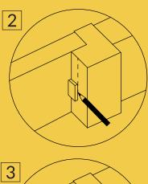
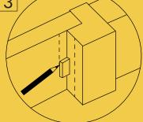
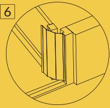
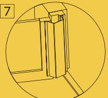
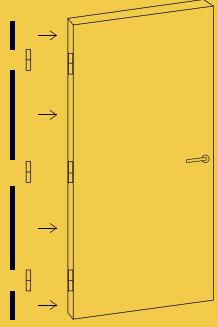

# FLEXSTOP

## Klämskydd TB

# Montering anslagssida (tappbärande gångjärn)

- 1. Torka av ytorna med rengöringsservetten.
- 2. När dörren är stängd. Mät ut 20 mm och dra ett streck som linje att följa på karmen för montaget av klämskyddet.
- 3. Gör likadant på dörren. Mät ut 20 mm och dra ett streck.
- Öppna dörren. 4.
- 5. Ta bort skyddsplasten från den dubbelhäftande tejpen på varje sida.
- Passa in klämskyddet mot det ritade 6. strecket på karmen och tryck fast klämskyddet när det följer hela linjen.
- 7. Gör likadant på dörren.
- 8. Säkerställ öppningsvinkel med en dörrstopp.

#### Montering gångjärnssida (Kan monteras på dörrblad eller karm)

- 1. Mät ut avståndet från dörrens underkant till gångjärnet.
- 2. Såga av klämskvddet, ta bort skyddsplasten och fäst klämskyddet.
- 3. Mät ut avståndet från dörrens nedre gångjärn till nästa gångjärn.
- 4. Såga av klämskyddet, ta bort skyddsplasten och fäst klämskyddet.
- 5. Mät ut avståndet mellan nästa gångjärn.
- Såga av klämskyddet, ta bort skyddsplasten och fäst klämskyddet. 6.

## Besök vår webb för mer information flexstop.se

