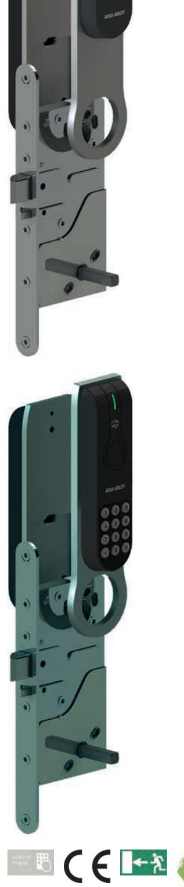
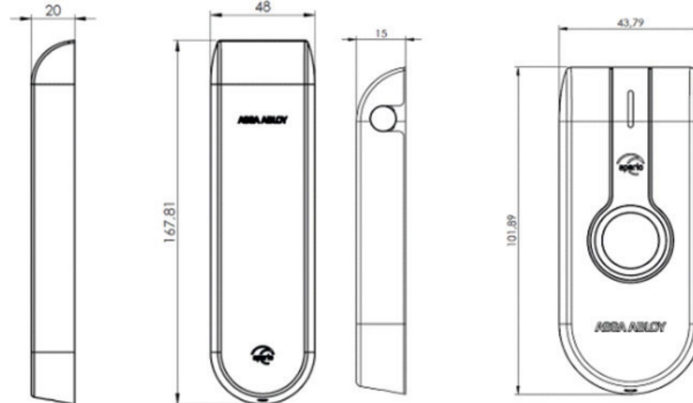
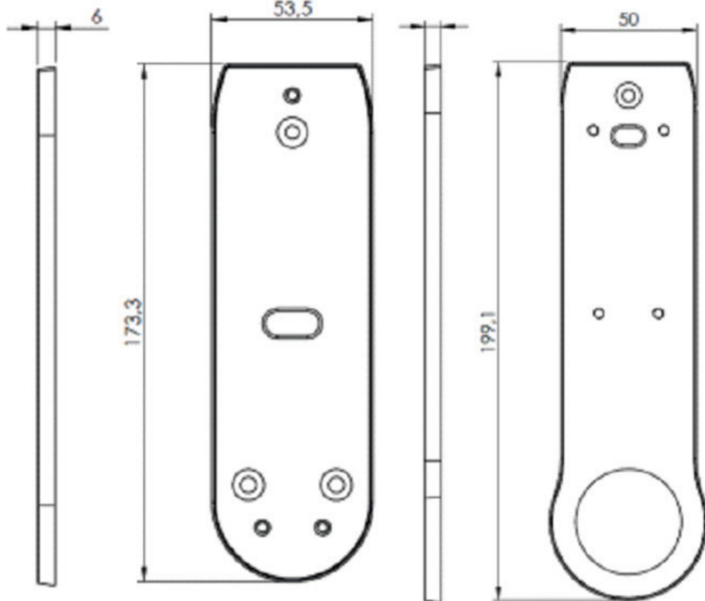
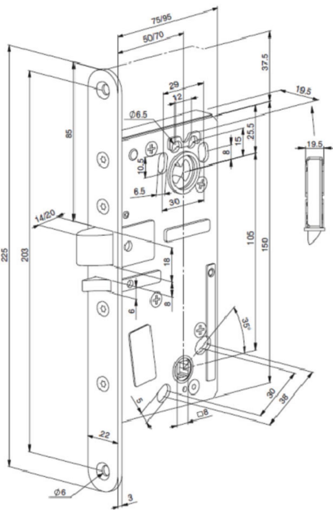

# L100 SCAND

Elektroniskt lås med RFID-läsare Skandinavisches Profil - Sicherheitsschloss mit integrieten Türsensoren

### **Produktbeskrivning**

- Kommunikation från hubben via RS485-bussen till online-passersystemet (adresserbart) beslut om tillträde tas via passersystemet
- Huvudelektronik på insidan läsare på utsidan inkl. anslutning för nödbatteri och indikeringslampor
- Intelligent splitfunktion möjliggör extremt temperaturområde (-40 till +65 °C) Utsidans handtag elektriskt manövrerat – insidans handtag är alltid mekaniskt inkopplat (öppningssensor medföljer)
- Inbyggda givare för låsregelns och dörrens läge, kan alltid öppnas med nyckel
- Möjligt att lagra upp till 10 nödkort (används endast om kommunikation med hubben saknas)
- LED för statusindikering

#### **Leveransomfattning**

- 1 lås med batteri (Lithium AA FR6) och installationsanvisning
- 1 läsare inkl. invändig och utvändig enhet
- Skruvar, flexibla kablar, borrmallar och spindlar (beroende på version)

### **Tekniska data - Elektroniskt lås med RFID-läsare**

|  | Autentisering                         | Tre autentiseringsnivåer (endast PIN, endast KORT, både PIN och KORT)                                                                                     |
|--|---------------------------------------|--------------------------------------------------------------------------------------------------------------------------------------------------------------|
|  | Code                                  | PIN-kod – 4 till 8 siffror                                                                                                                                   |
|  | Godkännanden                          | CE, EN179, EN1125, EN1634/1                                                                                                                                  |
|  | Mått                                  | Lås 150 x 95 x 88/19,5/98 (H x B x D), läsare, invändigt 167,8 x 48 x 20/utvändigt 101,8 x 43,7 x 15 (H x B x D)                                       |
|  | Dörrtyp                               | Standarddörrar                                                                                                                                               |
|  | Dörrens slagriktning                  | Vänster/Höger                                                                                                                                                |
|  | Nyckelhålsavstånd                     | Standarddörrar (50 mm)                                                                                                                                       |
|  | Avstånd                               | Avstånd standarddörrar 105 mm, spindel 8 mm                                                                                                                  |
|  | Framsida                              | 22 mm                                                                                                                                                        |
|  | Dörrtjocklek                          | Längd på spindel - Dörrtjocklek i (): 47/50 (40–54 mm); 57/50 (47/66 mm); 67/60 (61–80 mm); 74/50 (66–80 mm); 120/120 (88–100 mm); 80/50 (70–87 mm) |
|  | Batteri                               | 2 x Lithium AA (FR6)                                                                                                                                         |
|  | Batterilivslängd                      | > 100 000 cykler (max. 4 år)                                                                                                                                 |
|  | Radiostandard                         | IEEE 802.15.4 (2.4 GHz)                                                                                                                                      |
|  | Kryptering (radiokommunikation)    | AES 128 bits                                                                                                                                                 |
|  | Avstånd mellan RFID-läsare och hub | 25 meters räckvidd beroende på hubtyp och byggnadens planlösning                                                                                          |
|  | Skyddsklass                           | IP 44 innen / IP 55 außen                                                                                                                                    |
|  | Drifttemperaturområde                 | 10 °C till 65 °C invändigt/-40 °C till 65 °C utvändigt                                                                                                       |
|  | Luftfuktighet                         | < 85 % (icke-kondenserande)                                                                                                                                  |
|  | Dörrstatus                            | LED (röd/grön/orange)                                                                                                                                        |
|  | Dörrstatus                            | Dörrens position (öppen/stängd); regelns position (låst/olåst)                                                                                            |
|  | RFID-teknologi                        | iCLASS®/ISO 14443B; MIFARE™ classic; MIFARE™plus; MIFARE™ DESFire™ EV1; HID PROX/ EM410x, LEGIC® Advant (in progress)                                  |
|  | RFID-avläsning                        | UID / Sektor / Block / Application / File                                                                                                                    |
|  | Avläsningsavstånd                     | < 4 cm                                                                                                                                                       |
|  | Kommunikationsgränssnitt              | Micro USB firmware download and battery back up                                                                                                              |

ASSA ABLOY Scandinavia Förmansvägen 11 117 43 Stockholm www.assaoem.se/aperio

#### **Online-lås L100**

**Sidan 1 av 4 Senaste uppdatering: 08.05.2017 Produktark**

# L100 SCAND

Elektroniskt lås med RFID-läsare Skandinavisches Profil - Sicherheitsschloss mit integrieten Türsensoren

ASSA ABLOY Scandinavia Förmansvägen 11 117 43 Stockholm www.assaoem.se/aperio

### **Online-lås L100**

**Sidan 2 av 4 Senaste uppdatering: 08.05.2017 Produktark**

## L100 SCAND

Elektroniskt lås med RFID-läsare Skandinavisches Profil - Sicherheitsschloss mit integrieten Türsensoren

ASSA ABLOY Scandinavia Förmansvägen 11 117 43 Stockholm www.assaoem.se/aperio

**Online-lås L100**

**Sidan 3 av 4 Senaste uppdatering: 08.05.2017 Produktark**

L100 SCAND

Elektroniskt lås med RFID-läsare Skandinavisches Profil - Sicherheitsschloss mit integrieten Türsensoren

Powered by TCPDF (www.tcpdf.org)

**Online-lås L100**