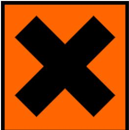
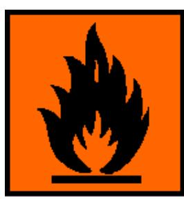

# **LIMSATS GDK 100 (E-NR 1647200)**

Limsatsen består av: Lim typ Loctite 326 Aktivator typ Loctite 7649 Rengöring typ Loctite 7063

Säkerhetsdatablad på dessa enligt bifogade dokument.

Loctite 326 Loctite 7649 Loctite 7063

Vänligen, se nedanstående sidor för mer information.

Alarmtech Sweden AB 2016-01-14

# **Säkerhetsdatablad enligt rådets förordning (EG) nr 1907/2006**

Sidan 1 / 18

LOCTITE AA 326 known as Loctite 326

SDB-nr : 168434 V003.1 Reviderat den: 03.07.2015 Utskriftsdatum: 13.01.2016 Ersätter version från: 24.02.2015

### **AVSNITT 1: Namnet på ämnet/blandningen och bolaget/företaget**

### **1.1 Produktbeteckning**

LOCTITE AA 326 known as Loctite 326

#### **Innehåller:**

2-Hydroxietylmetakrylat Hydroxipropylmetakrylat Akrylsyra 1-acetyl-2-fenylhydrazin

- **1.2 Relevanta identifierade användningar av ämnet eller blandningen och användningar som det avråds från** Avsedd användning: Akrylatlim
### **1.3 Närmare upplysningar om den som tillhandahåller säkerhetsdatablad**

Henkel Norden AB

Box 151 22 167 15 Bromma

SE

Tel.: +46 (0) 10 480 7700

ua-productsafety.norden@henkel.com

#### **1.4 Telefonnummer för nödsituationer**

+46 10 480 7500 (kontorstid)

+46 8-33 12 31

### **AVSNITT 2: Farliga egenskaper**

#### **2.1 Klassificering av ämnet eller blandningen**

| Klassificering (CLP):                                        |            |
|--------------------------------------------------------------|------------|
| Irriterande på huden                                         | Kategori 2 |
| H315 Irriterar huden.                                        |            |
| Ögonirritation                                               | Kategori 2 |
| H319 Orsakar allvarlig ögonirritation.                       |            |
| Sensibiliserande på huden                                    | Kategori 1 |
| H317 Kan orsaka allergisk hudreaktion.                       |            |
| Specifik organtoxicitet - enstaka exponering                 | Kategori 3 |
| H335 Kan orsaka irritation i luftvägarna.                    |            |
| Target organ: Luftvägsirritation                             |            |
| Långvariga faror för vattenmiljön                            | Kategori 3 |
| H412 Skadliga långtidseffekter för vattenlevande organismer. |            |

| Märkningsuppgifter (CLP): Faropiktogram: Varning Signalord: H315 Irriterar huden. Faroangivelse: H317 Kan orsaka allergisk hudreaktion. H319 Orsakar allvarlig ögonirritation. H335 Kan orsaka irritation i luftvägarna. H412 Skadliga långtidseffekter för vattenlevande organismer. Skyddsangivelse: rester enligt de regler som har utarbetats av lokala myndigheter.*** Skyddsangivelse: P261 Undvik inandning av ångor. Förebyggande P280 Använd skyddshandskar. P273 Undvik utsläpp till miljön. P302+P352 VID HUDKONTAKT: Tvätta med mycket vatten. Skyddsangivelse: P333+P313 Vid hudirritation eller utslag: Sök läkarhjälp. Åtgärder P337+P313 Vid bestående ögonirritation: Sök läkarhjälp. | 2.2 Märkningsuppgifter |                                                                                                                                                                                 |
|-----------------------------------------------------------------------------------------------------------------------------------------------------------------------------------------------------------------------------------------------------------------------------------------------------------------------------------------------------------------------------------------------------------------------------------------------------------------------------------------------------------------------------------------------------------------------------------------------------------------------------------------------------------------------------------------------------------------------------------------------------------------------|------------------------|---------------------------------------------------------------------------------------------------------------------------------------------------------------------------------|
|                                                                                                                                                                                                                                                                                                                                                                                                                                                                                                                                                                                                                                                                                                                                                                       |                        |                                                                                                                                                                                 |
|                                                                                                                                                                                                                                                                                                                                                                                                                                                                                                                                                                                                                                                                                                                                                                       |                        |                                                                                                                                                                                 |
|                                                                                                                                                                                                                                                                                                                                                                                                                                                                                                                                                                                                                                                                                                                                                                       |                        |                                                                                                                                                                                 |
|                                                                                                                                                                                                                                                                                                                                                                                                                                                                                                                                                                                                                                                                                                                                                                       |                        |                                                                                                                                                                                 |
|                                                                                                                                                                                                                                                                                                                                                                                                                                                                                                                                                                                                                                                                                                                                                                       |                        | ***Endast för konsumentmarknaden: P101 Ha förpackningen eller etiketten till hands om du måste söka läkarvård. P102 Förvaras oåtkomligt för barn. P501 Bortskaffa avfall och |
|                                                                                                                                                                                                                                                                                                                                                                                                                                                                                                                                                                                                                                                                                                                                                                       |                        |                                                                                                                                                                                 |
|                                                                                                                                                                                                                                                                                                                                                                                                                                                                                                                                                                                                                                                                                                                                                                       |                        |                                                                                                                                                                                 |

#### **2.3. Andra faror**

Inga vid avsedd användning.

### **AVSNITT 3: Sammansättning/information om beståndsdelar**

#### **3.2 Blandningar**

**Allmän kemisk karaktärisering:** Akrylatlim

#### **Angivande av ämnena enligt CLP (EG) nr 1272/2008:**

| Farliga komponenter CAS-nr.        | EG-nummer REACH Registreringsnum | Halt       | Klassificering                                                                                                                                                                                                                    |
|---------------------------------------|----------------------------------------|------------|-----------------------------------------------------------------------------------------------------------------------------------------------------------------------------------------------------------------------------------|
| 2-Hydroxietylmetakrylat 868-77-9   | mer 212-782-2 01-2119490169-29   | 20- 40 %   | Skin Irrit. 2 H315 Skin Sens. 1 H317 Eye Irrit. 2 H319                                                                                                                                                             |
| Isobornylmetakrylat 7534-94-3      | 231-403-1                              | 10- 20 %   | STOT SE 3 H335 Skin Irrit. 2 H315 Eye Irrit. 2 H319 Aquatic Chronic 2 H411                                                                                                                                   |
| Hydroxipropylmetakrylat 27813-02-1 | 248-666-3 01-2119490226-37          | 1- < 5 %   | Skin Sens. 1 H317 Eye Irrit. 2 H319                                                                                                                                                                                      |
| Akrylsyra 79-10-7                  | 201-177-9 01-2119452449-31          | 1- < 3 %   | Flam. Liq. 3 H226 Acute Tox. 4; Oral H302 Acute Tox. 4; hudrelaterad H312 Skin Corr. 1A H314 Acute Tox. 4; Inandning H332 STOT SE 3 H335 Aquatic Acute 1 H400 Aquatic Chronic 2 H411 |
| Kumenväteperoxid 80-15-9           | 201-254-7                              | 0,1- < 1 % | Acute Tox. 4; hudrelaterad H312 STOT RE 2 H373 Acute Tox. 4; Oral H302 Org. Perox. E H242 Acute Tox. 3; Inandning H331 Aquatic Chronic 2 H411 Skin Corr. 1B H314                           |
| 1-acetyl-2-fenylhydrazin 114-83-0  | 204-055-3                              | 0,1- < 1 % | Acute Tox. 3; Oral H301 Skin Irrit. 2 H315 Skin Sens. 1 H317 Eye Irrit. 2 H319 STOT SE 3; Inandning H335 Carc. 2 H351                                                                            |
| Metakrylsyra 79-41-4               | 201-204-4 01-2119463884-26          | 0,1- < 1 % | Acute Tox. 4; Oral H302 Acute Tox. 3; hudrelaterad H311                                                                                                                                                                  |

|  | Acute Tox. 4; Inandning H332 Skin Corr. 1A H314 |
|--|----------------------------------------------------------|
|  |                                                          |

**För fullständig ordalydelse av H-angivelser och andra förkortningar, se rubrik 16 "Annan information". Ämnen utan klassificering kan ha arbetsplatsrelaterade hygieniska gränsvärden inom gemenskapen.**

### **AVSNITT 4: Åtgärder vid första hjälpen**

#### **4.1 Beskrivning av åtgärder vid första hjälpen**

Inhalation: Uppsök frisk luft. Sök läkare om symtomen kvarstår.

Hudkontakt: Skölj med rinnande vatten, tvätta med tvål. Sök läkarvård om irritation kvarstår.

Ögonkontakt: Skölj genast i rinnande vatten (i 10 minuter), konsultera specialist.

Förtäring: Skölj munnen, drick 1-2 glas vatten, framkalla ej kräkning, sök läkare.

**4.2 De viktigaste symptomen och effekterna, både akuta och fördröjda** HUD: Rodnad, inflammation.

Hud: Utslag, Urtikaria (nässelutslag).

ÖGON: Irritation, konjunktivit (ögoninflammation).

LUFTVÄGAR: Irritation, hosta, andnöd, tryck över bröstet.

**4.3 Angivande av omedelbar medicinsk behandling och särskild behandling som eventuellt krävs** Se punkt: Beskrivning av åtgärder vid första hjälpen

### **AVSNITT 5: Brandbekämpningsåtgärder**

**5.1 Släckmedel Lämpliga släckmedel:** Koldioxid, skum, pulver.

**Av säkerhetsskäl olämpliga släckningsmedel:** Högtrycksvattenstråle

**5.2 Särskilda faror som ämnet eller blandningen kan medföra** Sönderdelningsrisk vid värmeinverkan. Oxider av kol, oxider av kväve, retande organiska ångor. Svaveloxider

**5.3 Råd till brandbekämpningspersonal** Använd inbyggd andningsapparat och fullständig skyddsklädsel, t.ex. larmställ.

### **AVSNITT 6: Åtgärder vid oavsiktliga utsläpp**

**6.1 Personliga skyddsåtgärder, skyddsutrustning och åtgärder vid nödsituationer** Undvik kontakt med ögonen och huden.

#### **6.2 Miljöskyddsåtgärder**

Förhindra utsläpp i avloppssystemet.

#### **6.3 Metoder och material för inneslutning och sanering**

Mindre spill tas upp med pappersduk och placeras i avfallsbehållare. Större spill vallas in med sand, jord eller liknande material och samlas upp i slutna behållare för vidare destruktion. Kontaminerat material tas om hand enligt punkt 13.

#### **6.4 Hänvisning till andra avsnitt**

Beakta råd i avsnitt 8.

### **AVSNITT 7: Hantering och lagring**

#### **7.1 Försiktighetsmått för säker hantering**

Använd endast på väl ventilerade platser. Undvik kontakt med ögonen och huden. Undvik upprepad eller långvarig kontakt med huden för att begränsa allergirisken Beakta råd i avsnitt 8.

Allmänna hygieniska åtgärder:

Tvätta händerna före raster och efter arbetets slut. Ät inte, drick inte eller rök inte under hanteringen. Sörj för god industrihygien

#### **7.2 Förhållanden för säker lagring, inklusive eventuell oförenlighet**

Förvaras i ursprungsbehållare vid 8-21°C (46,4-69,8°F). Restmaterial får inte återföras till behållarna eftersom kontamination kan reducera bulkproduktens hållbarhet.

**7.3 Specifik slutanvändning** Akrylatlim

### **AVSNITT 8: Begränsning av exponeringen/personligt skydd**

#### **8.1 Kontrollparametrar**

#### **Gränsvärden för exponering**

Gäller för

| Ingående ämnen [Reglerat ämne]            | ppm | mg/m3 | Typvärde             | Kortvarig exponeringskategori / Anmärkning | Rättslig grund |
|-------------------------------------------|-----|-------|----------------------|--------------------------------------------------|----------------|
| Akrylsyra 79-10-7 [AKRYLSYRA]       | 10  | 30    | Nivågränsvärde       |                                                  | SWO            |
| Akrylsyra 79-10-7 [AKRYLSYRA]       | 15  | 45    | Korttidsvärde        |                                                  | SWO            |
| Metakrylsyra 79-41-4 [METAKRYLSYRA] | 20  | 70    | Nivågränsvärde       |                                                  | SWO            |
| Metakrylsyra 79-41-4 [METAKRYLSYRA] | 30  | 100   | Korttidsvärde        |                                                  | SWO            |
| kumen 98-82-8 [KUMEN]               | 50  | 250   | Korttidsvärde:       | Riktgivande                                      | ECTLV          |
| kumen 98-82-8 [KUMEN]               | 20  | 100   | Nivågränsvärde       | Riktgivande                                      | ECTLV          |
| kumen 98-82-8 [ISOPROPYLBENSEN]     | 35  | 170   | Korttidsvärde        |                                                  | SWO            |
| kumen 98-82-8 [ISOPROPYLBENSEN]     | 25  | 120   | Nivågränsvärde       |                                                  | SWO            |
| kumen 98-82-8 [ISOPROPYLBENSEN]     |     |       | Beteckning för huden | Kan absorberas genom huden                       | SWO            |

#### **Predicted No-Effect Concentration (PNEC):**

| Namn i förteckningen                  | Environmental Compartment       | Exponerin gstid | Värde |     |                  |             | Anmärkningar |
|---------------------------------------|------------------------------------|--------------------|-------|-----|------------------|-------------|--------------|
|                                       |                                    |                    | mg/l  | ppm | mg/kg            | övrigt      |              |
| 2-Hydroxietylmetakrylat 868-77-9   | Sötvatten                          |                    |       |     |                  | 0,482 mg/L  |              |
| 2-Hydroxietylmetakrylat 868-77-9   | Havsvatten                         |                    |       |     |                  | 0,482 mg/L  |              |
| 2-Hydroxietylmetakrylat 868-77-9   | STP                                |                    |       |     |                  | 10 mg/L     |              |
| 2-Hydroxietylmetakrylat 868-77-9   | vatten (tillfälliga utsläpp) |                    |       |     |                  | 1 mg/L      |              |
| 2-Hydroxietylmetakrylat 868-77-9   | Sediment (sötvatten)            |                    |       |     | 3,79 mg/kg       |             |              |
| 2-Hydroxietylmetakrylat 868-77-9   | Sediment (havsvatten)           |                    |       |     | 3,79 mg/kg       |             |              |
| 2-Hydroxietylmetakrylat 868-77-9   | jord                               |                    |       |     | 0,476 mg/kg   |             |              |
| Hydroxipropylmetakrylat 27813-02-1 | Sötvatten                          |                    |       |     |                  | 0,904 mg/L  |              |
| Hydroxipropylmetakrylat 27813-02-1 | Havsvatten                         |                    |       |     |                  | 0,904 mg/L  |              |
| Hydroxipropylmetakrylat 27813-02-1 | STP                                |                    |       |     |                  | 10 mg/L     |              |
| Hydroxipropylmetakrylat 27813-02-1 | vatten (tillfälliga utsläpp) |                    |       |     |                  | 0,972 mg/L  |              |
| Hydroxipropylmetakrylat 27813-02-1 | Sediment (sötvatten)            |                    |       |     | 6,28 mg/kg       |             |              |
| Hydroxipropylmetakrylat 27813-02-1 | Sediment (havsvatten)           |                    |       |     | 6,28 mg/kg       |             |              |
| Hydroxipropylmetakrylat 27813-02-1 | jord                               |                    |       |     | 0,727 mg/kg   |             |              |
| Akrylsyra 79-10-7                  | Sötvatten                          |                    |       |     |                  | 0,003 mg/L  |              |
| Akrylsyra 79-10-7                  | Havsvatten                         |                    |       |     |                  | 0,0003 mg/L |              |
| Akrylsyra 79-10-7                  | vatten (tillfälliga utsläpp) |                    |       |     |                  | 0,0013 mg/L |              |
| Akrylsyra 79-10-7                  | STP                                |                    |       |     |                  | 0,9 mg/L    |              |
| Akrylsyra 79-10-7                  | Sediment (sötvatten)            |                    |       |     | 0,0236 mg/kg  |             |              |
| Akrylsyra 79-10-7                  | Sediment (havsvatten)           |                    |       |     | 0,00236 mg/kg |             |              |
| Akrylsyra 79-10-7                  | jord                               |                    |       |     | 1 mg/kg          |             |              |
| Akrylsyra 79-10-7                  | oral                               |                    |       |     | 0,0023 mg/kg  |             |              |
| Akrylsyra 79-10-7                  | Rovdjur                            |                    |       |     | 0,03 g/kg        |             |              |

#### **Derived No-Effect Level (DNEL):**

| Namn i förteckningen                  | Application Area      | Exponerin gsväg | Health Effect                                       | Exposure Time | Värde                            | Anmärkningar |
|---------------------------------------|--------------------------|--------------------|-----------------------------------------------------|------------------|----------------------------------|--------------|
| 2-Hydroxietylmetakrylat 868-77-9   | Arbetare                 | dermal             | långvarig exponering - systemiska effekter |                  | 1,3 mg/kg kroppsvikt/dygn  |              |
| 2-Hydroxietylmetakrylat 868-77-9   | Arbetare                 | Inandning          | långvarig exponering - systemiska effekter |                  | 4,9 mg/m3                        |              |
| 2-Hydroxietylmetakrylat 868-77-9   | allmänna befolkningen | dermal             | långvarig exponering - systemiska effekter |                  | 0,83 mg/kg kroppsvikt/dygn |              |
| 2-Hydroxietylmetakrylat 868-77-9   | allmänna befolkningen | Inandning          | långvarig exponering - systemiska effekter |                  | 2,9 mg/m3                        |              |
| 2-Hydroxietylmetakrylat 868-77-9   | allmänna befolkningen | oral               | långvarig exponering - systemiska effekter |                  | 0,83 mg/kg kroppsvikt/dygn |              |
| Hydroxipropylmetakrylat 27813-02-1 | Arbetare                 | dermal             | långvarig exponering - systemiska effekter |                  | 4,2 mg/kg kroppsvikt/dygn  |              |
| Hydroxipropylmetakrylat 27813-02-1 | Arbetare                 | Inandning          | långvarig exponering - systemiska effekter |                  | 14,7 mg/m3                       |              |
| Hydroxipropylmetakrylat 27813-02-1 | allmänna befolkningen | dermal             | långvarig exponering - systemiska effekter |                  | 2,5 mg/kg kroppsvikt/dygn  |              |
| Hydroxipropylmetakrylat 27813-02-1 | allmänna befolkningen | Inandning          | långvarig exponering - systemiska effekter |                  | 8,8 mg/m3                        |              |
| Hydroxipropylmetakrylat 27813-02-1 | allmänna befolkningen | oral               | långvarig exponering - systemiska effekter |                  | 2,5 mg/kg kroppsvikt/dygn  |              |
| Akrylsyra 79-10-7                  | Arbetare                 | Inandning          | lånvarig exponering - lokala effekter         |                  | 30 mg/m3                         |              |
| Akrylsyra 79-10-7                  | Arbetare                 | Inandning          | akut/ korttidsexponerin g - lokala effekter   |                  | 30 mg/m3                         |              |
| Akrylsyra 79-10-7                  | Arbetare                 | dermal             | akut/ korttidsexponerin g - lokala effekter   |                  | 1 mg/cm2                         |              |
| Akrylsyra 79-10-7                  | allmänna befolkningen | dermal             | akut/ korttidsexponerin g - lokala effekter   |                  | 1 mg/cm2                         |              |
| Akrylsyra 79-10-7                  | allmänna befolkningen | inhalation         | akut/ korttidsexponerin g - lokala effekter   |                  | 3,6 mg/m3                        |              |
| Akrylsyra 79-10-7                  | allmänna befolkningen | inhalation         | lånvarig exponering - lokala effekter         |                  | 3,6 mg/m3                        |              |

**Biologiska gränsvärden:**

inga

**8.2 Begränsning av exponeringen:**

Andningsskydd: Sörj för tillräcklig ventilation. En godkänd mask eller respirator utrustad med ett filter lämpligt för organiska ångor skall användas om produkten används i ett dåligt ventilerat utrymme Filtertyp: A

#### Handskydd:

Kemikaliebeständiga skyddshandskar (EN 374). Lämpliga material vid kortvarig kontakt eller stänk (Rekommendation: Lägst Skyddsklass 2, motsvarar > 30 minuters permeationstid enligt EN 374): Nitrilgummi (NBR; >= 0,4 mm tjocklek). Lämpliga material även vid längre, direkt kontakt (Rekommendation: Skyddsklass 6, motsvarar > 480 minuters permeationstid enligt EN 374): Nitrilgummi (NBR; >= 0,4 mm tjocklek). Uppgifterna grundar sig på litteraturangivelser och information från handsktillverkare, eller så är de härledda från studier av liknande ämnen. Iaktta att på grund av alla påverkande faktorer (t.ex. temperatur) så kan användningstiden för skyddshandskar mot kemikalier i praktiken vara betydligt kortare än den som fastställts enligt EN 374. Byt ut handskarna vid nötning.

Ögonskydd:

Skyddsglasögon med sidoskydd eller kemikaliesäkra glasögon skall bäras om risk för stänk finns.

Kroppsskydd: Använd lämpliga skyddskläder.

### **AVSNITT 9: Fysikaliska och kemiska egenskaper**

#### **9.1 Information om grundläggande fysikaliska och kemiska egenskaper**

| Utseende Lukt Lukttröskel              | Vätska Transparent Bärnstensfärgad Inga uppgifter Inga data tillgängliga / Inte tillämpligt |
|----------------------------------------------|---------------------------------------------------------------------------------------------------------|
| pH-värde                                     | Inga data tillgängliga / Inte tillämpligt                                                               |
| Initial kokpunkt                             | > 149,0 °C (> 300.2 °F)                                                                                 |
| Flampunkt                                    | > 93,3 °C (> 199.94 °F); Tagliabue closed cup                                                           |
| Sönderfallstemperatur                        | Inga data tillgängliga / Inte tillämpligt                                                               |
| Ångtryck (26,6 °C (79.9 °F))              | < 13 mbar                                                                                               |
| Densitet ()                               | 1,0 g/cm3                                                                                               |
| Skrymdensitet (skakdensitet, volymvikt)      | Inga data tillgängliga / Inte tillämpligt                                                               |
| Viskositet                                   | Inga data tillgängliga / Inte tillämpligt                                                               |
| Viskositet (kinematisk)                      | Inga data tillgängliga / Inte tillämpligt                                                               |
| Explosiva egenskaper                         | Inga data tillgängliga / Inte tillämpligt                                                               |
| Löslighet, kvalitativ (lösningsm: Vatten) | svag                                                                                                    |
| Stelningstemperatur                          | Inga data tillgängliga / Inte tillämpligt                                                               |
| Smältpunkt                                   | Inga data tillgängliga / Inte tillämpligt                                                               |
| Brandfarlighet                               | Inga data tillgängliga / Inte tillämpligt                                                               |
| Självantändningstemperatur                   | Inga data tillgängliga / Inte tillämpligt                                                               |
| Explosionsgräns                              | Inga data tillgängliga / Inte tillämpligt                                                               |
| Fördelningskoefficient: n-oktanol/vatten     | Inga data tillgängliga / Inte tillämpligt                                                               |
| Avdunstningshastighet                        | Inga data tillgängliga / Inte tillämpligt                                                               |
| Ångdensitet                                  | Inga data tillgängliga / Inte tillämpligt                                                               |
| Oxiderande egenskaper                        | Inga data tillgängliga / Inte tillämpligt                                                               |
|                                              |                                                                                                         |

### **9.2 Annan information**

Inga data tillgängliga / Inte tillämpligt

### **AVSNITT 10: Stabilitet och reaktivitet**

#### **10.1. Reaktivitet** Reagerar med starka syror. Reagerar med starka oxidationsmedel.

#### **10.2. Kemisk stabilitet**

Stabil vid rekommenderade lagringsförhållanden.

#### **10.3 Risken för farliga reaktioner**

Se avsnitt reaktivitet

### **10.4. Förhållanden som ska undvikas**

Ingen sönderdelning vid avsedd användning.

#### **10.5. Oförenliga material** Se avsnitt reaktivitet

#### **10.6. Farliga sönderdelningsprodukter**

Koloxider

### **AVSNITT 11: Toxikologisk information**

#### **11.1. Information om de toxikologiska effekterna**

#### **Allmänna uppgifter om toxikologi:**

Blandningen är klassificerad på grundval av tillgänglig riskinformation för ingredienserna enligt definitionen i klassificeringskriterierna för blandningar för varje riskklass eller differentiering i Bilaga I till Förordning 1272/2008/EG. Relevant tillgänglig hälsoinformation/ekologisk information för de ämnen som anges i avsnitt 3 ges i det följande.

#### **Specifik organtoxicitet – enstaka exponering:**

Kan orsaka irritation i luftvägarna.

#### **Akut oral toxicitet:**

Kan ge irritation i matsmältningsorganen.

#### **Hudirritation:**

Irriterar huden.

#### **Ögonirritation:**

Orsakar allvarlig ögonirritation.

#### **Sensibilisering:**

Kan orsaka allergisk hudreaktion.

#### **Akut toxicitet - förtäring:**

| Farliga komponenter                   | Värdetyp | Värde         | Exponeringsväg | Exponeri | art   | Metod                                       |
|---------------------------------------|----------|---------------|----------------|----------|-------|---------------------------------------------|
| CAS-nr.                               |          |               |                | ngstid   |       |                                             |
| Hydroxipropylmetakrylat 27813-02-1 | LD50     | > 2.000 mg/kg | oral           |          | Råtta | OECD Guideline 401 (Acute Oral Toxicity) |
| Akrylsyra 79-10-7                  | LD50     | 1.500 mg/kg   | oral           |          | Råtta | BASF Test                                   |
| Kumenväteperoxid 80-15-9           | LD50     | 550 mg/kg     | oral           |          | Råtta |                                             |
| Metakrylsyra 79-41-4               | LD50     | 1.320 mg/kg   | oral           |          | Råtta | OECD Guideline 401 (Acute Oral Toxicity) |

#### **Akut toxicitet - inandning:**

| Farliga komponenter | Värdetyp | Värde      | Exponeringsväg | Exponeri | art   | Metod                     |
|---------------------|----------|------------|----------------|----------|-------|---------------------------|
| CAS-nr.             |          |            |                | ngstid   |       |                           |
| Akrylsyra           | LC50     | > 5,1 mg/L | Ånga.          | 4 h      | Råtta | OECD Guideline 403 (Acute |
| 79-10-7             |          |            |                |          |       | Inhalation Toxicity)      |
| Metakrylsyra        | LC50     | 4,7 mg/L   | Inhalering     | 4 h      | Råtta | OECD Guideline 403 (Acute |
| 79-41-4             |          |            |                |          |       | Inhalation Toxicity)      |

#### **Akut toxicitet - kontakt med hud:**

| Farliga komponenter     | Värdetyp | Värde         | Exponeringsväg | Exponeri | art   | Metod                      |
|-------------------------|----------|---------------|----------------|----------|-------|----------------------------|
| CAS-nr.                 |          |               |                | ngstid   |       |                            |
| 2-Hydroxietylmetakrylat | LD50     | > 3.000 mg/kg | dermal         |          | Kanin |                            |
| 868-77-9                |          |               |                |          |       |                            |
| Hydroxipropylmetakrylat | LD50     | > 5.000 mg/kg | dermal         |          | Kanin |                            |
| 27813-02-1              |          |               |                |          |       |                            |
| Akrylsyra               | LD50     | 640 mg/kg     | dermal         |          | Kanin | BASF Test                  |
| 79-10-7                 |          |               |                |          |       |                            |
| Metakrylsyra            | Acute    | 500 mg/kg     | dermal         |          |       | Expertbedömning            |
| 79-41-4                 | toxicity |               |                |          |       |                            |
|                         | estimate |               |                |          |       |                            |
|                         | (ATE)    |               |                |          |       |                            |
| Metakrylsyra            | LD50     | 500 - 1.000   |                |          | Kanin | Dermal toxicitet Screening |
| 79-41-4                 |          | mg/kg         |                |          |       |                            |

### **Frätande/irriterande på huden:**

| Farliga komponenter CAS-nr. | Resultat                | Exponeri ngstid | art   | Metod                                                       |
|--------------------------------|-------------------------|--------------------|-------|-------------------------------------------------------------|
| Akrylsyra 79-10-7           | Starkt frätande.        | 3 min              | Kanin | OECD Guideline 404 (Acute Dermal Irritation / Corrosion) |
| Kumenväteperoxid 80-15-9    | Frätande                |                    | Kanin | Draize test                                                 |
| Metakrylsyra 79-41-4        | Category 1A (corrosive) | 4 h                | Kanin | OECD Guideline 404 (Acute Dermal Irritation / Corrosion) |

### **Allvarlig ögonskada/ögonirritation:**

| Farliga komponenter CAS-nr. | Resultat | Exponeri ngstid | art   | Metod     |
|--------------------------------|----------|--------------------|-------|-----------|
| Akrylsyra 79-10-7           | Frätande | 21 d               | Kanin | BASF Test |

#### **Luftvägs-/hudsensibilisering:**

| Farliga komponenter | Resultat              | Testtyp  | art     | Metod         |
|---------------------|-----------------------|----------|---------|---------------|
| CAS-nr.             |                       |          |         |               |
| Akrylsyra           | icke sensibiliserende | Skin     | Marsvin |               |
| 79-10-7             |                       | painting |         |               |
|                     |                       | test     |         |               |
| Metakrylsyra        | icke sensibiliserende | Buehlers | Marsvin | Buehlers test |
| 79-41-4             |                       | test     |         |               |

#### **Mutagenitet i könsceller:**

| Farliga komponenter CAS-nr.      | Resultat | Typ av studie / Administreringsvä g              | Metabolisk aktivering / Exponeringstid | art | Metod                                                                    |
|-------------------------------------|----------|--------------------------------------------------------|----------------------------------------------|-----|--------------------------------------------------------------------------|
| 2-Hydroxietylmetakrylat 868-77-9 | Negativ  | bacterial reverse mutation assay (e.g Ames test) | vid och utan                                 |     | OECD Guideline 471 (Bacterial Reverse Mutation Assay)              |
|                                     | Positiv  | in vitro kromosomavvikelse stest i däggdjur      | vid och utan                                 |     | OECD Guideline 473 (In vitro Mammalian Chromosome Aberration Test) |
| Akrylsyra 79-10-7                | Negativ  | bacterial reverse mutation assay (e.g Ames test) | vid och utan                                 |     |                                                                          |
| Kumenväteperoxid 80-15-9         | Positiv  | bacterial reverse mutation assay (e.g Ames test) | utan                                         |     | OECD Guideline 471 (Bacterial Reverse Mutation Assay)              |
| Kumenväteperoxid 80-15-9         | Negativ  | dermal                                                 |                                              | Mus |                                                                          |

### **Toxicitet vid upprepad dosering**

| Farliga komponenter CAS-nr. | Resultat | Exponering sväg      | Exponeringstid / Exponeringsfrekven s | art   | Metod |
|--------------------------------|----------|-------------------------|---------------------------------------------|-------|-------|
| Kumenväteperoxid 80-15-9    |          | Inhalering : Aerosol | 6 h/d5 d/w                                  | Råtta |       |

### **AVSNITT 12: Ekologisk information**

#### **Allmänna uppgifter om ekologi:**

Blandningen är klassificerad på grundval av tillgänglig riskinformation för ingredienserna enligt definitionen i klassificeringskriterierna för blandningar för varje riskklass eller differentiering i Bilaga I till Förordning 1272/2008/EG. Relevant tillgänglig hälsoinformation/ekologisk information för de ämnen som anges i avsnitt 3 ges i det följande.

#### **12.1. Toxicitet**

#### **Ekotoxicitet:**

Låt ej hamna i avloppssystemet/ytvatten/grundvatten. Skadliga långtidseffekter för vattenlevande organismer.

| Farliga komponenter                   | Värdetyp | Värde      | Studie av          | Exponerin | art                                                        | Metod                                   |
|---------------------------------------|----------|------------|--------------------|-----------|------------------------------------------------------------|-----------------------------------------|
| CAS-nr.                               |          |            | akut toxicitet  | gstid     |                                                            |                                         |
| 2-Hydroxietylmetakrylat               | LC50     | 227 mg/L   | Fish               | 96 h      | Pimephales promelas                                        | OECD Guideline                          |
| 868-77-9                              |          |            |                    |           |                                                            | 203 (Fish, Acute Toxicity Test)      |
| 2-Hydroxietylmetakrylat               | EC50     | 380 mg/L   | Daphnia            | 48 h      | Daphnia magna                                              | OECD Guideline                          |
| 868-77-9                              |          |            |                    |           |                                                            | 202 (Daphnia sp.                        |
|                                       |          |            |                    |           |                                                            | Acute Immobilisation                 |
|                                       |          |            |                    |           |                                                            | Test)                                   |
| 2-Hydroxietylmetakrylat 868-77-9   | NOEC     | 160 mg/L   | Algae              | 72 h      | Selenastrum capricornutum (new name: Pseudokirchnerella | OECD Guideline 201 (Alga, Growth     |
|                                       |          |            |                    |           | subcapitata)                                               | Inhibition Test)                        |
|                                       | EC50     | 345 mg/L   | Algae              | 72 h      | Selenastrum capricornutum (new name: Pseudokirchnerella | OECD Guideline 201 (Alga, Growth     |
|                                       |          |            |                    |           | subcapitata)                                               | Inhibition Test)                        |
| 2-Hydroxietylmetakrylat               | NOEC     | 24,1 mg/L  | chronic            | 21 d      | Daphnia magna                                              | OECD 211                                |
| 868-77-9                              |          |            | Daphnia            |           |                                                            | (Daphnia magna, Reproduction Test)   |
| Isobornylmetakrylat                   | LC50     | 1,79 mg/L  | Fish               | 96 h      |                                                            | OECD Guideline                          |
| 7534-94-3                             |          |            |                    |           |                                                            | 203 (Fish, Acute Toxicity Test)      |
| Isobornylmetakrylat                   | EC50     | 1,1 mg/L   | Daphnia            | 48 h      | Daphnia magna                                              | OECD Guideline                          |
| 7534-94-3                             |          |            |                    |           |                                                            | 202 (Daphnia sp.                        |
|                                       |          |            |                    |           |                                                            | Acute Immobilisation                 |
|                                       |          |            |                    |           |                                                            | Test)                                   |
| Isobornylmetakrylat 7534-94-3      | EC50     | 2,66 mg/L  | Algae              | 96 h      | Pseudokirchnerella subcapitata                             | OECD Guideline 201 (Alga, Growth     |
|                                       |          |            |                    |           |                                                            | Inhibition Test)                        |
| Hydroxipropylmetakrylat 27813-02-1 | LC50     | 493 mg/L   | Fish               | 48 h      | Leuciscus idus melanotus                                   | DIN 38412-15                            |
| Hydroxipropylmetakrylat               | EC50     | > 130 mg/L | Daphnia            | 48 h      | Daphnia magna                                              | OECD Guideline                          |
| 27813-02-1                            |          |            |                    |           |                                                            | 202 (Daphnia sp.                        |
|                                       |          |            |                    |           |                                                            | Acute Immobilisation                 |
|                                       |          |            |                    |           |                                                            | Test)                                   |
| Akrylsyra 79-10-7                  | LC50     | 27 mg/L    | Fish               | 96 h      | Salmo gairdneri (new name: Oncorhynchus mykiss)         | EPA OTS 797.1400 (Fish               |
|                                       |          |            |                    |           |                                                            | Acute Toxicity                          |
| Akrylsyra                             | EC10     | 0,03 mg/L  | Algae              | 72 h      | Scenedesmus subspicatus (new                               | Test) OECD Guideline                 |
| 79-10-7                               |          |            |                    |           | name: Desmodesmus                                          | 201 (Alga, Growth                       |
|                                       |          |            |                    |           | subspicatus)                                               | Inhibition Test)                        |
|                                       | EC50     | 0,13 mg/L  | Algae              | 72 h      | Scenedesmus subspicatus (new name: Desmodesmus          | OECD Guideline 201 (Alga, Growth     |
|                                       |          |            |                    |           | subspicatus)                                               | Inhibition Test)                        |
| Akrylsyra 79-10-7                  | NOEC     | 19 mg/L    | chronic Daphnia | 21 d      | Daphnia magna                                              | EPA OTS 797.1330 (Daphnid            |
|                                       |          |            |                    |           |                                                            | Chronic Toxicity                        |
| Kumenväteperoxid                      | LC50     | 3,9 mg/L   | Fish               | 96 h      | Oncorhynchus mykiss                                        | Test) OECD Guideline                 |
| 80-15-9                               |          |            |                    |           |                                                            | 203 (Fish, Acute                        |
|                                       |          |            |                    |           |                                                            | Toxicity Test)                          |
| Kumenväteperoxid 80-15-9           | EC50     | 18 mg/L    | Daphnia            | 48 h      | Daphnia magna                                              | OECD Guideline 202 (Daphnia sp.      |
|                                       |          |            |                    |           |                                                            | Acute                                   |
|                                       |          |            |                    |           |                                                            | Immobilisation Test)                 |
| Kumenväteperoxid                      | ErC50    | 3,1 mg/L   | Algae              | 72 h      | Pseudokirchnerella subcapitata                             | OECD Guideline                          |
| 80-15-9                               |          |            |                    |           |                                                            | 201 (Alga, Growth                       |
| Metakrylsyra                          | LC50     | 85 mg/L    | Fish               | 96 h      | Salmo gairdneri (new name:                                 | Inhibition Test) EPA OTS             |
| 79-41-4                               |          |            |                    |           | Oncorhynchus mykiss)                                       | 797.1400 (Fish                          |
|                                       |          |            |                    |           |                                                            | Acute Toxicity Test)                 |
| Metakrylsyra                          | EC50     | > 130 mg/L | Daphnia            | 48 h      | Daphnia magna                                              | EPA OTS                                 |
| 79-41-4                               |          |            |                    |           |                                                            | 797.1300 (Aquatic Invertebrate Acute |
|                                       |          |            |                    |           |                                                            | Toxicity Test,                          |
|                                       |          |            |                    |           |                                                            | Freshwater                              |
| Metakrylsyra                          | EC50     | 45 mg/L    | Algae              | 72 h      | Selenastrum capricornutum                                  | Daphnids) OECD Guideline             |
| 79-41-4                               |          |            |                    |           | (new name: Pseudokirchnerella                              | 201 (Alga, Growth                       |
|                                       | NOEC     | 8,2 mg/L   | Algae              | 72 h      | subcapitata) Selenastrum capricornutum                  | Inhibition Test) OECD Guideline      |
|                                       |          |            |                    |           | (new name: Pseudokirchnerella                              | 201 (Alga, Growth                       |

subcapitata) Inhibition Test)

### **12.2. Persistens och nedbrytbarhet**

### **Persistens/Nedbrytbarhet:**

Produkten är inte biologiskt nedbrytbar.

| Farliga komponenter CAS-nr.        | Resultat                   | Exponeringsväg | Nedbrytbarhet | Metod                                                                             |
|---------------------------------------|----------------------------|----------------|---------------|-----------------------------------------------------------------------------------|
| 2-Hydroxietylmetakrylat 868-77-9   | lätt biologiskt nedbrytbar | aerob          | 92 - 100 %    | OECD Guideline 301 C (Ready Biodegradability: Modified MITI Test (I))       |
| Isobornylmetakrylat 7534-94-3      |                            |                | 26,8 %        | OECD Guideline 301 D (Ready Biodegradability: Closed Bottle Test)           |
| Hydroxipropylmetakrylat 27813-02-1 | lätt biologiskt nedbrytbar | aerob          | 94,2 %        | OECD Guideline 301 E (Ready biodegradability: Modified OECD Screening Test) |
| Akrylsyra 79-10-7                  | lätt biologiskt nedbrytbar | aerob          | 81 %          | OECD Guideline 301 D (Ready Biodegradability: Closed Bottle Test)           |
| Kumenväteperoxid 80-15-9           |                            | inga uppgifter | 0 %           | OECD Guideline 301 B (Ready Biodegradability: CO2 Evolution Test)           |
| Metakrylsyra 79-41-4               | lätt biologiskt nedbrytbar | aerob          | 86 %          | OECD Guideline 301 D (Ready Biodegradability: Closed Bottle Test)           |

#### **12.3. Bioackumuleringsförmåga / 12.4. Rörligheten i jord**

#### **Rörlighet:**

Härdade bindemedel är immobila.

#### **Bioackumulering:**

Inga data tillgängliga.

| Farliga komponenter      |      | LogKow Biokoncentrations | Exponering | art       | Temperatur | Metod                     |
|--------------------------|------|--------------------------|------------|-----------|------------|---------------------------|
| CAS-nr.                  |      | faktor (BCF)             | stid       |           |            |                           |
| Isobornylmetakrylat      | 5,09 |                          |            |           |            | OECD Guideline 117        |
| 7534-94-3                |      |                          |            |           |            | (Partition Coefficient (n |
|                          |      |                          |            |           |            | octanol / water), HPLC    |
|                          |      |                          |            |           |            | Method)                   |
| Hydroxipropylmetakrylat  | 0,97 |                          |            |           |            |                           |
| 27813-02-1               |      |                          |            |           |            |                           |
| Akrylsyra                |      | 3,16                     |            |           |            |                           |
| 79-10-7                  |      |                          |            |           |            |                           |
| Akrylsyra                | 0,46 |                          |            |           | 25 °C      | OECD Guideline 107        |
| 79-10-7                  |      |                          |            |           |            | (Partition Coefficient (n |
|                          |      |                          |            |           |            | octanol / water), Shake   |
|                          |      |                          |            |           |            | Flask Method)             |
| Kumenväteperoxid         |      | 9,1                      |            | Beräkning |            | OECD Guideline 305        |
| 80-15-9                  |      |                          |            |           |            | (Bioconcentration: Flow   |
|                          |      |                          |            |           |            | through Fish Test)        |
| Kumenväteperoxid         | 2,16 |                          |            |           |            |                           |
| 80-15-9                  |      |                          |            |           |            |                           |
| 1-acetyl-2-fenylhydrazin | 0,74 |                          |            |           |            |                           |
| 114-83-0                 |      |                          |            |           |            |                           |
| Metakrylsyra             | 0,93 |                          |            |           | 22 °C      | OECD Guideline 107        |
| 79-41-4                  |      |                          |            |           |            | (Partition Coefficient (n |
|                          |      |                          |            |           |            | octanol / water), Shake   |
|                          |      |                          |            |           |            | Flask Method)             |

#### **12.5. Resultat av PBT- och vPvB-bedömningen**

| Farliga komponenter | PBT/vPvB |
|---------------------|----------|
| CAS-nr.             |          |

| 2-Hydroxietylmetakrylat 868-77-9 | Uppfyller inte kriterierna för persistenta, bioackumulerande och toxiska (PBT), mycket persistenta och mycket bioackumulerande(vPvB) |
|-------------------------------------|-----------------------------------------------------------------------------------------------------------------------------------------|
| Hydroxipropylmetakrylat             | Uppfyller inte kriterierna för persistenta, bioackumulerande och toxiska (PBT), mycket                                                  |
| 27813-02-1                          | persistenta och mycket bioackumulerande(vPvB)                                                                                           |
| Akrylsyra                           | Uppfyller inte kriterierna för persistenta, bioackumulerande och toxiska (PBT), mycket                                                  |
| 79-10-7                             | persistenta och mycket bioackumulerande(vPvB)                                                                                           |
| Metakrylsyra                        | Uppfyller inte kriterierna för persistenta, bioackumulerande och toxiska (PBT), mycket                                                  |
| 79-41-4                             | persistenta och mycket bioackumulerande(vPvB)                                                                                           |

#### **12.6. Andra skadliga effekter**

Inga data tillgängliga.

### **AVSNITT 13: Avfallshantering**

#### **13.1. Avfallsbehandlingsmetoder**

Avfallshantering av produkten:

Produkt deponeras enligt lokala och nationella lagar och förordningar.

Avfallshantering av ej rengjord förpackning:

Efter användning ska tuber, kartonger och flaskor som innehåller rester av produkt hanteras som kemiskt förorenat avfall och undanskaffas enligtlokala och nationella lagar och förordningar. Avfallshantera produkt/emballage enligt föreskrivna regler.

Avfallskod

08 04 09 rester av bindemedel och tätningsmedel som innehåller organiska lösningsmedel och andra farliga ämnen EAK-avfallskoderna är inte produkt- utan ursprungsrelaterade. Tillverkaren kan därför inte ange någon avfallskod för produkter som används inom olika branscher. De angivna koderna ska betraktas som en rekommendation för användaren.

### **AVSNITT 14: Transportinformation**

| 14.1. | FN-nummer                                                        |
|-------|------------------------------------------------------------------|
|       | Inget farligt gods i enlighet med RID, ADR, ADN, IMDG, IATA-DGR. |
| 14.2. | Officiell transportbenämning                                     |
|       | Inget farligt gods i enlighet med RID, ADR, ADN, IMDG, IATA-DGR. |
| 14.3. | Faroklass för transport                                          |
|       | Inget farligt gods i enlighet med RID, ADR, ADN, IMDG, IATA-DGR. |
| 14.4. | Förpackningsgrupp                                                |
|       | Inget farligt gods i enlighet med RID, ADR, ADN, IMDG, IATA-DGR. |
| 14.5. | Miljöfaror                                                       |
|       | Inget farligt gods i enlighet med RID, ADR, ADN, IMDG, IATA-DGR. |
| 14.6. | Särskilda försiktighetsåtgärder                                  |
|       | Inget farligt gods i enlighet med RID, ADR, ADN, IMDG, IATA-DGR. |
| 14.7. | Bulktransport enligt bilaga II till MARPOL 73/78 och IBC-koden   |
|       | Ej tillämpbart.                                                  |

### **AVSNITT 15: Gällande föreskrifter**

**15.1. Föreskrifter/lagstiftning om ämnet eller blandningen när det gäller säkerhet, hälsa och miljö** VOC-innehåll < 3,00 %

#### (EU)

#### **Hänvisning till härdade plaster:**

Observera Arbetsmiljöverkets gällande föreskrifter om kemiska arbetsmiljörisker 37§ vid hantering av produkten.

#### **15.2. Kemikaliesäkerhetsbedömning**

En säkerhetsrapport har inte utförts.

### **AVSNITT 16: Annan information**

Produktens märkning anges under avsnitt 2. Fullständig ordalydelse av alla förkortningar som angetts med koder i säkerhetsdatabladet:

- H226 Brandfarlig vätska och ånga.
H242 Brandfarligt vid uppvärmning.

- H301 Giftigt vid förtäring.
H302 Skadligt vid förtäring.

- H311 Giftigt vid hudkontakt.
- H312 Skadligt vid hudkontakt.
- H314 Orsakar allvarliga frätskador på hud och ögon.
- H315 Irriterar huden.
- H317 Kan orsaka allergisk hudreaktion.
- H319 Orsakar allvarlig ögonirritation.
- H331 Giftigt vid inandning.
- H332 Skadligt vid inandning.
- H335 Kan orsaka irritation i luftvägarna.
- H351 Misstänks kunna orsaka cancer.
- H373 Kan orsaka organskador genom lång eller upprepad exponering.
- H400 Mycket giftigt för vattenlevande organismer.
- H411 Giftigt för vattenlevande organismer med långtidseffekter.

#### **Övrig information:**

"Angivelserna stöder sig på vår nuvarande kännedom och syftar på produkten i levererat tillstånd. De ska beskriva våra produkter med avseende på säkerhetskrav och har därför ej för avsikt att beskriva några produktspecifika egenskaper."

#### **Märkningsuppgifter (DPD):**

Xi - Irriterande

R-fraser:

- R36/37/38 Irriterar ögonen, andningsorganen och huden.
- R43 Kan ge allergi vid hudkontakt.
- R52/53 Skadligt för vattenlevande organismer, kan orsaka skadliga långtidseffekter i vattenmiljön.

#### S-fraser:

- S24 Undvik kontakt med huden.
- S26 Vid kontakt med ögonen, spola genast med mycket vatten och kontakta läkare.
- S28 Vid kontakt med huden tvätta genast med mycket tvål och vatten.
- S37 Använd lämpliga skyddshandskar.
- S61 Undvik utsläpp till miljön. Läs särskilda instruktioner/varuinformationsblad.

Tilläggsinformation:

Endast för konsumentmarknaden: S2 Förvaras oåtkomligt för barn.

S46 Vid förtäring kontakta genast läkare och visa denna förpackning eller etiketten.

Innehåller:

2-Hydroxietylmetakrylat, Hydroxipropylmetakrylat

**Relevanta ändringar i detta säkerhetsdatablad är markerade med vertikala linjer i vänstra marginalen. Motsvarande text visas i annan färg på skuggat område.**

# **Säkerhetsdatablad enligt rådets förordning (EG) nr 1907/2006**

Sidan 1 / 13

LOCTITE SF 7649 known as Loctite 7649

SDB-nr : 179515 V002.4 Reviderat den: 07.08.2015 Utskriftsdatum: 13.01.2016 Ersätter version från: 27.02.2015

### **AVSNITT 1: Namnet på ämnet/blandningen och bolaget/företaget**

### **1.1 Produktbeteckning**

LOCTITE SF 7649 known as Loctite 7649

### **Innehåller:**

Aceton

- **1.2 Relevanta identifierade användningar av ämnet eller blandningen och användningar som det avråds från** Avsedd användning: Aktivator
- **1.3 Närmare upplysningar om den som tillhandahåller säkerhetsdatablad**
	- Henkel Norden AB Box 151 22 167 15 Bromma SE
	- Tel.: +46 (0) 10 480 7700

ua-productsafety.norden@henkel.com

### **1.4 Telefonnummer för nödsituationer**

+46 10 480 7500 (kontorstid)

+46 8-33 12 31

### **AVSNITT 2: Farliga egenskaper**

#### **2.1 Klassificering av ämnet eller blandningen**

| Klassificering (CLP):                              |            |
|----------------------------------------------------|------------|
| Aerosoler                                          |            |
| H222 Extremt brandfarlig aerosol.                  |            |
| H229 Tryckbehållare: Kan sprängas vid uppvärmning. |            |
| Ögonirritation                                     | Kategori 2 |
| H319 Orsakar allvarlig ögonirritation.             |            |
| Specifik organtoxicitet - enstaka exponering       | Kategori 3 |
| H336 Kan göra att man blir dåsig eller omtöcknad.  |            |
| Target organ: centrala nervsystemet                |            |
|                                                    |            |

### **2.2 Märkningsuppgifter**

**Märkningsuppgifter (CLP):**

| Faropiktogram:                   |                                                                                                                                                                                                                                                                                                                                                                                                                                                                                                                                                                                                                                                           |
|----------------------------------|-----------------------------------------------------------------------------------------------------------------------------------------------------------------------------------------------------------------------------------------------------------------------------------------------------------------------------------------------------------------------------------------------------------------------------------------------------------------------------------------------------------------------------------------------------------------------------------------------------------------------------------------------------------|
| Signalord:                       | Fara                                                                                                                                                                                                                                                                                                                                                                                                                                                                                                                                                                                                                                                      |
| Faroangivelse:                   | H222 Extremt brandfarlig aerosol. H229 Tryckbehållare: Kan sprängas vid uppvärmning. H319 Orsakar allvarlig ögonirritation. H336 Kan göra att man blir dåsig eller omtöcknad.                                                                                                                                                                                                                                                                                                                                                                                                                                                                    |
| Ytterligare uppgifter            | EUH066 Upprepad kontakt kan ge torr hud eller hudsprickor.                                                                                                                                                                                                                                                                                                                                                                                                                                                                                                                                                                                                |
| Skyddsangivelse:                 | P251 Får inte punkteras eller brännas, gäller även tömd behållare. P410+P412 Skyddas från solljus. Får inte utsättas för temperaturer över 50 °C/ 122 °F. P211 Spreja inte över öppen låga eller andra antändningskällor. P210 Får inte utsättas för värme, heta ytor, gnistor, öppen låga eller andra antändningskällor. Rökning förbjuden. P102 Förvaras oåtkomligt för barn. ***Endast för konsumentmarknaden: P101 Ha förpackningen eller etiketten till hands om du måste söka läkarvård. P102 Förvaras oåtkomligt för barn. P501 Bortskaffa avfall och rester enligt de regler som har utarbetats av lokala myndigheter.*** |
| Skyddsangivelse: Förebyggande | P261 Undvik inandning av ångor.                                                                                                                                                                                                                                                                                                                                                                                                                                                                                                                                                                                                                           |
| Skyddsangivelse: Åtgärder     | P337+P313 Vid bestående ögonirritation: Sök läkarhjälp.                                                                                                                                                                                                                                                                                                                                                                                                                                                                                                                                                                                                   |

#### **2.3. Andra faror**

Tryckbehållare. Får ej utsättas för höga temperaturer.

### **AVSNITT 3: Sammansättning/information om beståndsdelar**

#### **3.2 Blandningar**

#### **Allmän kemisk karaktärisering:**

Aktivator

#### **Angivande av ämnena enligt CLP (EG) nr 1272/2008:**

| Farliga komponenter CAS-nr. | EG-nummer REACH Registreringsnum | Halt           | Klassificering                                                    |
|--------------------------------|----------------------------------------|----------------|-------------------------------------------------------------------|
|                                | mer                                    |                |                                                                   |
| Aceton 67-64-1              | 200-662-2 01-2119471330-49          | > 75- < 100 %  | Flam. Liq. 2 H225 Eye Irrit. 2 H319 STOT SE 3 H336 |
| Propan 74-98-6              | 200-827-9 01-2119486944-21          | > 10- < 20 %   | Flam. Gas 1 H220 Press. Gas H280                         |
| 2-Etylhexansyra 149-57-5    | 205-743-6 01-2119488942-23          | > 0,1- < 0,5 % | Repr. 2 H361d                                                  |
| Kopparkarbonat 22221-10-9   | 244-846-0                              | > 0,1- < 0,5 % | Repr. 2 H361f                                                  |

**För fullständig ordalydelse av H-angivelser och andra förkortningar, se rubrik 16 "Annan information". Ämnen utan klassificering kan ha arbetsplatsrelaterade hygieniska gränsvärden inom gemenskapen.**

### **AVSNITT 4: Åtgärder vid första hjälpen**

#### **4.1 Beskrivning av åtgärder vid första hjälpen**

Inhalation: Uppsök frisk luft. Sök läkare om symtomen kvarstår.

Hudkontakt: Skölj med rinnande vatten, tvätta med tvål. Kontakta läkare.

Ögonkontakt: Skölj i rinnande vatten (i 10 minuter), konsultera eventuellt läkare.

Förtäring: Skölj munhålan, drick 1-2 glas vatten, framkalla ej kräkning. Kontakta läkare.

**4.2 De viktigaste symptomen och effekterna, både akuta och fördröjda** Ångor kan göra att man blir dåsig och omtöcknad.

ÖGON: Irritation, konjunktivit (ögoninflammation).

**4.3 Angivande av omedelbar medicinsk behandling och särskild behandling som eventuellt krävs** Se punkt: Beskrivning av åtgärder vid första hjälpen

### **AVSNITT 5: Brandbekämpningsåtgärder**

**5.1 Släckmedel Lämpliga släckmedel:** Koldioxid, skum, pulver.

**Av säkerhetsskäl olämpliga släckningsmedel:** Inga kända.

**5.2 Särskilda faror som ämnet eller blandningen kan medföra** Oxider av kol, oxider av kväve, retande organiska ångor.

### **5.3 Råd till brandbekämpningspersonal**

Använd inbyggd andningsapparat och fullständig skyddsklädsel, t.ex. larmställ.

#### **Tilläggsinformation:**

Kyl ner behållare i farozonen med spolande vatten.

### **AVSNITT 6: Åtgärder vid oavsiktliga utsläpp**

#### **6.1 Personliga skyddsåtgärder, skyddsutrustning och åtgärder vid nödsituationer**

Undvik kontakt med ögonen och huden. Sörj för tillräcklig ventilation. Beakta råd i avsnitt 8.

### **6.2 Miljöskyddsåtgärder**

Förhindra utsläpp i avloppssystemet.

#### **6.3 Metoder och material för inneslutning och sanering**

Mindre spill tas upp med pappersduk och placeras i avfallsbehållare. Större spill vallas in med sand, jord eller liknande material och samlas upp i slutna behållare för vidare destruktion. Kontaminerat material tas om hand enligt punkt 13.

### **AVSNITT 7: Hantering och lagring**

## **7.1 Försiktighetsmått för säker hantering**

Använd endast på väl ventilerade platser. Sörj för god ventilation. Undvik inandning av ångorna Förvaras åtskilt från tändkällor. Rök inte. Undvik kontakt med ögonen och huden. Beakta råd i avsnitt 8.

#### Allmänna hygieniska åtgärder:

Tvätta händerna före raster och efter arbetets slut. Ät inte, drick inte eller rök inte under hanteringen. Sörj för god industrihygien

#### **7.2 Förhållanden för säker lagring, inklusive eventuell oförenlighet**

Behållaren ska förvaras på en sval plats med god ventilation. Skyddas mot värme och direkt solljus. Lagring vid 5 till 25 °C rekommenderas.

#### **7.3 Specifik slutanvändning**

Aktivator

### **AVSNITT 8: Begränsning av exponeringen/personligt skydd**

#### **8.1 Kontrollparametrar**

#### **Gränsvärden för exponering**

Gäller för

SE

| Ingående ämnen [Reglerat ämne] | ppm | mg/m3 | Typvärde       | Kortvarig exponeringskategori / Anmärkning | Rättslig grund |
|--------------------------------|-----|-------|----------------|--------------------------------------------------|----------------|
| Aceton 67-64-1 [ACETON]  | 500 | 1.210 | Nivågränsvärde | Riktgivande                                      | ECTLV          |
| Aceton 67-64-1 [ACETON]  | 250 | 600   | Nivågränsvärde |                                                  | SWO            |
| Aceton 67-64-1 [ACETON]  | 500 | 1.200 | Korttidsvärde  |                                                  | SWO            |

#### **Predicted No-Effect Concentration (PNEC):**

| Namn i förteckningen        | Environmental Exponerin Värde Compartment gstid |  |      |     |            | Anmärkningar |  |
|-----------------------------|-------------------------------------------------------------|--|------|-----|------------|--------------|--|
|                             |                                                             |  | mg/l | ppm | mg/kg      | övrigt       |  |
| Aceton                      | vatten                                                      |  |      |     |            | 21 mg/L      |  |
| 67-64-1                     | (tillfälliga utsläpp)                                    |  |      |     |            |              |  |
| Aceton                      | STP                                                         |  |      |     |            | 100 mg/L     |  |
| 67-64-1                     |                                                             |  |      |     |            |              |  |
| Aceton                      | Sediment                                                    |  |      |     | 30,4 mg/kg |              |  |
| 67-64-1                     | (sötvatten)                                                 |  |      |     |            |              |  |
| Aceton                      | Sediment                                                    |  |      |     | 3,04 mg/kg |              |  |
| 67-64-1                     | (havsvatten)                                                |  |      |     |            |              |  |
| Aceton                      | jord                                                        |  |      |     | 29,5 mg/kg |              |  |
| 67-64-1                     |                                                             |  |      |     |            |              |  |
| Aceton                      | Sötvatten                                                   |  |      |     |            | 10,6 mg/L    |  |
| 67-64-1                     |                                                             |  |      |     |            |              |  |
| Aceton                      | Havsvatten                                                  |  |      |     |            | 1,06 mg/L    |  |
| 67-64-1                     |                                                             |  |      |     |            |              |  |
| 2-Etylhexansyra             | Sötvatten                                                   |  |      |     |            | 0,36 mg/L    |  |
| 149-57-5                    |                                                             |  |      |     |            |              |  |
| 2-Etylhexansyra 149-57-5 | Havsvatten                                                  |  |      |     |            | 0,036 mg/L   |  |
| 2-Etylhexansyra             | vatten                                                      |  |      |     |            | 0,493 mg/L   |  |
| 149-57-5                    | (tillfälliga                                                |  |      |     |            |              |  |
|                             | utsläpp)                                                    |  |      |     |            |              |  |
| 2-Etylhexansyra             | STP                                                         |  |      |     |            | 71,7 mg/L    |  |
| 149-57-5                    |                                                             |  |      |     |            |              |  |
| 2-Etylhexansyra             | Sediment                                                    |  |      |     | 6,37 mg/kg |              |  |
| 149-57-5                    | (sötvatten)                                                 |  |      |     |            |              |  |
| 2-Etylhexansyra             | Sediment                                                    |  |      |     | 0,637      |              |  |
| 149-57-5                    | (havsvatten)                                                |  |      |     | mg/kg      |              |  |
| 2-Etylhexansyra             | jord                                                        |  |      |     | 1,06 mg/kg |              |  |
| 149-57-5                    |                                                             |  |      |     |            |              |  |

#### **Derived No-Effect Level (DNEL):**

| Namn i förteckningen        | Application Area      | Exponerin gsväg | Health Effect                                       | Exposure Time | Värde                           | Anmärkningar |
|-----------------------------|--------------------------|--------------------|-----------------------------------------------------|------------------|---------------------------------|--------------|
| Aceton 67-64-1           | Arbetare                 | Inandning          | akut/ korttidsexponerin g - lokala effekter   |                  | 2420 mg/m3                      |              |
| Aceton 67-64-1           | Arbetare                 | dermal             | långvarig exponering - systemiska effekter |                  | 186 mg/kg kroppsvikt/dygn |              |
| Aceton 67-64-1           | Arbetare                 | Inandning          | långvarig exponering - systemiska effekter |                  | 1210 mg/m3                      |              |
| Aceton 67-64-1           | allmänna befolkningen | dermal             | långvarig exponering - systemiska effekter |                  | 62 mg/kg kroppsvikt/dygn  |              |
| Aceton 67-64-1           | allmänna befolkningen | Inandning          | långvarig exponering - systemiska effekter |                  | 200 mg/m3                       |              |
| Aceton 67-64-1           | allmänna befolkningen | oral               | långvarig exponering - systemiska effekter |                  | 62 mg/kg kroppsvikt/dygn  |              |
| 2-Etylhexansyra 149-57-5 | Arbetare                 | dermal             | långvarig exponering - systemiska effekter |                  | 12 mg/kg kroppsvikt/dygn  |              |
| 2-Etylhexansyra 149-57-5 | Arbetare                 | Inandning          | långvarig exponering - systemiska effekter |                  | 32 mg/m3                        |              |
| 2-Etylhexansyra 149-57-5 | allmänna befolkningen | dermal             | långvarig exponering - systemiska effekter |                  | 6 mg/kg kroppsvikt/dygn   |              |
| 2-Etylhexansyra 149-57-5 | allmänna befolkningen | Inandning          | långvarig exponering - systemiska effekter |                  | 8 mg/m3                         |              |
| 2-Etylhexansyra 149-57-5 | allmänna befolkningen | oral               | långvarig exponering - systemiska effekter |                  | 2,5 mg/kg kroppsvikt/dygn |              |

### **Biologiska gränsvärden:**

inga

#### **8.2 Begränsning av exponeringen:**

Andningsskydd: Sörj för god ventilation. Filtertyp: P2

Handskydd:

Kemikaliebeständiga skyddshandskar (EN 374). Lämpliga material vid kortvarig kontakt eller stänk (Rekommendation: Lägst Skyddsklass 2, motsvarar > 30 minuters permeationstid enligt EN 374): Nitrilgummi (NBR; >= 0,4 mm tjocklek). Lämpliga material även vid längre, direkt kontakt (Rekommendation: Skyddsklass 6, motsvarar > 480 minuters permeationstid enligt EN 374): Nitrilgummi (NBR; >= 0,4 mm tjocklek). Uppgifterna grundar sig på litteraturangivelser och information från handsktillverkare, eller så är de härledda från studier av liknande ämnen. Iaktta att på grund av alla påverkande faktorer (t.ex. temperatur) så kan användningstiden för skyddshandskar mot kemikalier i praktiken vara betydligt kortare än den som fastställts enligt EN 374. Byt ut handskarna vid nötning.

Ögonskydd: Använd skyddsglasögon.

Kroppsskydd: Använd lämpliga skyddskläder.

### **AVSNITT 9: Fysikaliska och kemiska egenskaper**

#### **9.1 Information om grundläggande fysikaliska och kemiska egenskaper**

Utseende Aerosol Lukt Stickande Lukttröskel Inga data tillgängliga / Inte tillämpligt pH-värde Ej tillämpbart. Initial kokpunkt 56 °C (132.8 °F) Flampunkt -18 °C (0.4 °F) Sönderfallstemperatur Inga data tillgängliga / Inte tillämpligt Ångtryck (20 °C (68 °F)) Densitet (20 °C (68 °F)) Skrymdensitet (skakdensitet, volymvikt) Inga data tillgängliga / Inte tillämpligt Viskositet Inga data tillgängliga / Inte tillämpligt Viskositet (kinematisk) Inga data tillgängliga / Inte tillämpligt Explosiva egenskaper Inga data tillgängliga / Inte tillämpligt Löslighet, kvalitativ (lösningsm: Vatten) Löslighet, kvalitativ (lösningsm: Aceton) Stelningstemperatur Inga data tillgängliga / Inte tillämpligt Smältpunkt Inga data tillgängliga / Inte tillämpligt Brandfarlighet Inga data tillgängliga / Inte tillämpligt Självantändningstemperatur Inga data tillgängliga / Inte tillämpligt Explosionsgräns undre övre Fördelningskoefficient: n-oktanol/vatten Inga data tillgängliga / Inte tillämpligt Avdunstningshastighet Inga data tillgängliga / Inte tillämpligt Ångdensitet Inga data tillgängliga / Inte tillämpligt Oxiderande egenskaper Inga data tillgängliga / Inte tillämpligt **9.2 Annan information**

Inga data tillgängliga / Inte tillämpligt

### **AVSNITT 10: Stabilitet och reaktivitet**

#### **10.1. Reaktivitet**

Reagerar med starka oxidationsmedel.

#### **10.2. Kemisk stabilitet**

Stabil vid rekommenderade lagringsförhållanden.

# **10.3 Risken för farliga reaktioner**

Se avsnitt reaktivitet

**10.4. Förhållanden som ska undvikas** Stabil

**10.5. Oförenliga material** Se avsnitt reaktivitet

**10.6. Farliga sönderdelningsprodukter** Retande organiska ångor.

Grön

230 mbar

0,8 g/cm3

Blandbar

#### Löslig

### 2,5 %(V)

13 %(V)

### **AVSNITT 11: Toxikologisk information**

#### **11.1. Information om de toxikologiska effekterna**

#### **Allmänna uppgifter om toxikologi:**

Blandningen är klassificerad på grundval av tillgänglig riskinformation för ingredienserna enligt definitionen i klassificeringskriterierna för blandningar för varje riskklass eller differentiering i Bilaga I till Förordning 1272/2008/EG. Relevant tillgänglig hälsoinformation/ekologisk information för de ämnen som anges i avsnitt 3 ges i det följande.

#### **Specifik organtoxicitet – enstaka exponering:**

Kan göra att man blir dåsig eller omtöcknad.

#### **Akut oral toxicitet:**

Anses ha låg toxicitet.

#### **Akut inhalativ toxicitet:**

Kan orsaka huvudvärk och yrsel.

#### **Hudirritation:**

Uttorkande. Gör huden mer känslig för andra kemikalier Förlängd eller upprepad kontakt kan irritera huden.

#### **Ögonirritation:**

Orsakar allvarlig ögonirritation.

#### **Akut toxicitet - förtäring:**

| Farliga komponenter CAS-nr. | Värdetyp | Värde       | Exponeringsväg | Exponeri ngstid | art   | Metod     |
|--------------------------------|----------|-------------|----------------|--------------------|-------|-----------|
| Aceton 67-64-1              | LD50     | 5.800 mg/kg | oral           |                    | Råtta |           |
| 2-Etylhexansyra 149-57-5    | LD50     | 3.640 mg/kg | oral           |                    | Råtta | BASF Test |

#### **Akut toxicitet - inandning:**

| Farliga komponenter CAS-nr. | Värdetyp | Värde   | Exponeringsväg | Exponeri ngstid | art   | Metod |
|--------------------------------|----------|---------|----------------|--------------------|-------|-------|
| Aceton 67-64-1              | LC50     | 76 mg/L |                | 4 h                | Råtta |       |

#### **Akut toxicitet - kontakt med hud:**

| Farliga komponenter | Värdetyp | Värde          | Exponeringsväg | Exponeri | art   | Metod                     |
|---------------------|----------|----------------|----------------|----------|-------|---------------------------|
| CAS-nr.             |          |                |                | ngstid   |       |                           |
| Aceton              | LD50     | > 15.688 mg/kg | dermal         |          | Kanin |                           |
| 67-64-1             |          |                |                |          |       |                           |
| 2-Etylhexansyra     | LD50     | > 2.000 mg/kg  | dermal         |          | Råtta | OECD Guideline 402 (Acute |
| 149-57-5            |          |                |                |          |       | Dermal Toxicity)          |

#### **Frätande/irriterande på huden:**

| Farliga komponenter CAS-nr. | Resultat         | Exponeri ngstid | art   | Metod                                                       |
|--------------------------------|------------------|--------------------|-------|-------------------------------------------------------------|
| 2-Etylhexansyra 149-57-5    | inte irriterande |                    | Kanin | OECD Guideline 404 (Acute Dermal Irritation / Corrosion) |

#### **Allvarlig ögonskada/ögonirritation:**

| Farliga komponenter | Resultat         | Exponeri | art   | Metod                       |
|---------------------|------------------|----------|-------|-----------------------------|
| CAS-nr.             |                  | ngstid   |       |                             |
| Aceton              | Irriterande.     |          | Kanin | OECD Guideline 405 (Acute   |
| 67-64-1             |                  |          |       | Eye Irritation / Corrosion) |
| 2-Etylhexansyra     | inte irriterande |          | Kanin | OECD Guideline 405 (Acute   |
| 149-57-5            |                  |          |       | Eye Irritation / Corrosion) |

### **Luftvägs-/hudsensibilisering:**

| Farliga komponenter CAS-nr. | Resultat              | Testtyp   | art     | Metod         |
|--------------------------------|-----------------------|-----------|---------|---------------|
| Aceton                         | icke sensibiliserende | Marsvin   | Marsvin | ospecificerad |
| 67-64-1                        |                       | maximerin |         |               |
|                                |                       | gstest    |         |               |

### **Mutagenitet i könsceller:**

| Farliga komponenter CAS-nr. | Resultat                                    | Typ av studie / Administreringsvä g              | Metabolisk aktivering / Exponeringstid | art | Metod                                                                    |
|--------------------------------|---------------------------------------------|--------------------------------------------------------|----------------------------------------------|-----|--------------------------------------------------------------------------|
| Aceton 67-64-1              | Negativ                                     | bacterial reverse mutation assay (e.g Ames test) | vid och utan                                 |     | OECD Guideline 471 (Bacterial Reverse Mutation Assay)              |
| Propan 74-98-6              | negative with metabolic activation | in vitro kromosomavvikelse stest i däggdjur      | vid och utan                                 |     | OECD Guideline 473 (In vitro Mammalian Chromosome Aberration Test) |
| 2-Etylhexansyra 149-57-5    | Negativ                                     | bacterial reverse mutation assay (e.g Ames test) | vid och utan                                 |     | Ames test                                                                |

#### **Toxicitet vid upprepad dosering**

| Farliga komponenter CAS-nr. | Resultat           | Exponering sväg    | Exponeringstid / Exponeringsfrekven s | art   | Metod                                                                    |
|--------------------------------|--------------------|-----------------------|---------------------------------------------|-------|--------------------------------------------------------------------------|
| Aceton 67-64-1              | LOAEL=20000 ppm | oral: dricksvatten | 13 wdaily                                   | Råtta | OECD Guideline 408 (Repeated Dose 90-Day Oral Toxicity in Rodents) |
| Aceton 67-64-1              | NOAEL=900 mg/kg | oral: dricksvatten | 13 wdaily                                   | Råtta | OECD Guideline 408 (Repeated Dose 90-Day Oral Toxicity in Rodents) |

### **AVSNITT 12: Ekologisk information**

#### **Allmänna uppgifter om ekologi:**

Blandningen är klassificerad på grundval av tillgänglig riskinformation för ingredienserna enligt definitionen i klassificeringskriterierna för blandningar för varje riskklass eller differentiering i Bilaga I till Förordning 1272/2008/EG. Relevant tillgänglig hälsoinformation/ekologisk information för de ämnen som anges i avsnitt 3 ges i det följande.

### **12.1. Toxicitet**

#### **Ekotoxicitet:**

Låt ej hamna i avloppssystemet/ytvatten/grundvatten.

| Farliga komponenter | Värdetyp | Värde      | Studie av | Exponerin | art                          | Metod              |
|---------------------|----------|------------|-----------|-----------|------------------------------|--------------------|
| CAS-nr.             |          |            | akut      | gstid     |                              |                    |
|                     |          |            | toxicitet |           |                              |                    |
| Aceton              | LC50     | 8.120 mg/L | Fish      | 96 h      | Pimephales promelas          | OECD Guideline     |
| 67-64-1             |          |            |           |           |                              | 203 (Fish, Acute   |
|                     |          |            |           |           |                              | Toxicity Test)     |
| Aceton              | EC50     | 8.800 mg/L | Daphnia   | 48 h      | Daphnia pulex                | OECD Guideline     |
| 67-64-1             |          |            |           |           |                              | 202 (Daphnia sp.   |
|                     |          |            |           |           |                              | Acute              |
|                     |          |            |           |           |                              | Immobilisation     |
|                     |          |            |           |           |                              | Test)              |
| Aceton              | NOEC     | 2.212 mg/L | chronic   | 28 d      | Daphnia magna                | OECD 211           |
| 67-64-1             |          |            | Daphnia   |           |                              | (Daphnia magna,    |
|                     |          |            |           |           |                              | Reproduction Test) |
| 2-Etylhexansyra     | LC50     | 270 mg/L   | Fish      | 96 h      | Lepomis gibbosus             | OECD Guideline     |
| 149-57-5            |          |            |           |           |                              | 203 (Fish, Acute   |
|                     |          |            |           |           |                              | Toxicity Test)     |
| 2-Etylhexansyra     | EC50     | 85,4 mg/L  | Daphnia   | 48 h      | Daphnia magna                | OECD Guideline     |
| 149-57-5            |          |            |           |           |                              | 202 (Daphnia sp.   |
|                     |          |            |           |           |                              | Acute              |
|                     |          |            |           |           |                              | Immobilisation     |
|                     |          |            |           |           |                              | Test)              |
| 2-Etylhexansyra     | EC10     | 33 mg/L    | Algae     | 72 h      | Scenedesmus subspicatus (new | OECD Guideline     |
| 149-57-5            |          |            |           |           | name: Desmodesmus            | 201 (Alga, Growth  |
|                     |          |            |           |           | subspicatus)                 | Inhibition Test)   |
|                     | EC50     | 61 mg/L    | Algae     | 72 h      | Scenedesmus subspicatus (new | OECD Guideline     |
|                     |          |            |           |           | name: Desmodesmus            | 201 (Alga, Growth  |
|                     |          |            |           |           | subspicatus)                 | Inhibition Test)   |

### **12.2. Persistens och nedbrytbarhet**

#### **Persistens/Nedbrytbarhet:**

Inga data tillgängliga.

| Farliga komponenter | Resultat                   | Exponeringsväg | Nedbrytbarhet | Metod                           |
|---------------------|----------------------------|----------------|---------------|---------------------------------|
| CAS-nr.             |                            |                |               |                                 |
| Aceton              | lätt biologiskt nedbrytbar | aerob          | 81 - 92 %     | EU Method C.4-E (Determination  |
| 67-64-1             |                            |                |               | of the "Ready"                  |
|                     |                            |                |               | BiodegradabilityClosed Bottle   |
|                     |                            |                |               | Test)                           |
| 2-Etylhexansyra     | lätt biologiskt nedbrytbar | aerob          | 99 %          | OECD Guideline 301 E (Ready     |
| 149-57-5            |                            |                |               | biodegradability: Modified OECD |
|                     |                            |                |               | Screening Test)                 |

#### **12.3. Bioackumuleringsförmåga / 12.4. Rörligheten i jord**

#### **Rörlighet:**

Produkten avdunstar snabbt.

**Bioackumulering:**

| Inga data tillgängliga. |  |
|-------------------------|--|
|                         |  |

| Farliga komponenter |       | LogKow Biokoncentrations | Exponering | art | Temperatur | Metod                     |
|---------------------|-------|--------------------------|------------|-----|------------|---------------------------|
| CAS-nr.             |       | faktor (BCF)             | stid       |     |            |                           |
| Aceton              | -0,24 |                          |            |     |            | OECD Guideline 107        |
| 67-64-1             |       |                          |            |     |            | (Partition Coefficient (n |
|                     |       |                          |            |     |            | octanol / water), Shake   |
|                     |       |                          |            |     |            | Flask Method)             |
| 2-Etylhexansyra     | 2,7   |                          |            |     |            | OECD Guideline 107        |
| 149-57-5            |       |                          |            |     |            | (Partition Coefficient (n |
|                     |       |                          |            |     |            | octanol / water), Shake   |
|                     |       |                          |            |     |            | Flask Method)             |

#### **12.5. Resultat av PBT- och vPvB-bedömningen**

| Farliga komponenter | PBT/vPvB |
|---------------------|----------|
| CAS-nr.             |          |

| Aceton 67-64-1 | Uppfyller inte kriterierna för persistenta, bioackumulerande och toxiska (PBT), mycket persistenta och mycket bioackumulerande(vPvB) |
|-------------------|-----------------------------------------------------------------------------------------------------------------------------------------|
| Propan            | Uppfyller inte kriterierna för persistenta, bioackumulerande och toxiska (PBT), mycket                                                  |
| 74-98-6           | persistenta och mycket bioackumulerande(vPvB)                                                                                           |
| 2-Etylhexansyra   | Uppfyller inte kriterierna för persistenta, bioackumulerande och toxiska (PBT), mycket                                                  |
| 149-57-5          | persistenta och mycket bioackumulerande(vPvB)                                                                                           |

### **12.6. Andra skadliga effekter**

Inga data tillgängliga.

### **AVSNITT 13: Avfallshantering**

#### **13.1. Avfallsbehandlingsmetoder**

Avfallshantering av produkten: Produkt deponeras enligt lokala och nationella lagar och förordningar.

Avfallshantering av ej rengjord förpackning: Avfallshantera produkt/emballage enligt föreskrivna regler.

Avfallskod

14 06 03 Andra lösningsmedel och lösningsmedelsblandningar

EAK-avfallskoderna är inte produkt- utan ursprungsrelaterade. Tillverkaren kan därför inte ange någon avfallskod för produkter som används inom olika branscher. De angivna koderna ska betraktas som en rekommendation för användaren.

### **AVSNITT 14: Transportinformation**

### **14.1. FN-nummer**

| ADR  | 1950 |
|------|------|
| RID  | 1950 |
| ADN  | 1950 |
| IMDG | 1950 |
| IATA | 1950 |
|      |      |

#### **14.2. Officiell transportbenämning**

| AEROSOLER           |
|---------------------|
| AEROSOLER           |
| AEROSOLER           |
| AEROSOLS            |
| Aerosols, flammable |
|                     |

#### **14.3. Faroklass för transport**

| ADR  | 2.1 |
|------|-----|
| RID  | 2.1 |
| ADN  | 2.1 |
| IMDG | 2.1 |
| IATA | 2.1 |
|      |     |

#### **14.4. Förpackningsgrupp**

ADR RID ADN IMDG IATA

#### **14.5. Miljöfaror**

| Ej tillämpbart. |
|-----------------|
| Ej tillämpbart. |
| Ej tillämpbart. |
| Ej tillämpbart. |
| Ej tillämpbart. |
|                 |

### **14.6. Särskilda försiktighetsåtgärder**

| ADR  | Ej tillämpbart.            |
|------|----------------------------|
|      | Tunnelrestriktionskod: (D) |
| RID  | Ej tillämpbart.            |
| ADN  | Ej tillämpbart.            |
| IMDG | Ej tillämpbart.            |
| IATA | Ej tillämpbart.            |
|      |                            |

#### **14.7. Bulktransport enligt bilaga II till MARPOL 73/78 och IBC-koden**

Ej tillämpbart.

### **AVSNITT 15: Gällande föreskrifter**

- **15.1. Föreskrifter/lagstiftning om ämnet eller blandningen när det gäller säkerhet, hälsa och miljö**
	- VOC-innehåll (EU)

99,2 %

**15.2. Kemikaliesäkerhetsbedömning** En säkerhetsrapport har inte utförts.

### **AVSNITT 16: Annan information**

Produktens märkning anges under avsnitt 2. Fullständig ordalydelse av alla förkortningar som angetts med koder i säkerhetsdatabladet:

H220 Extremt brandfarlig gas.

H225 Mycket brandfarlig vätska och ånga.

H280 Innehåller gas under tryck; kan explodera vid uppvärmning.

H319 Orsakar allvarlig ögonirritation.

H336 Kan göra att man blir dåsig eller omtöcknad.

H361d Misstänks kunna skada det ofödda barnet.

H361f Misstänks kunna skada fertiliteten.

#### **Övrig information:**

"Angivelserna stöder sig på vår nuvarande kännedom och syftar på produkten i levererat tillstånd. De ska beskriva våra produkter med avseende på säkerhetskrav och har därför ej för avsikt att beskriva några produktspecifika egenskaper."

#### **Märkningsuppgifter (DPD):**

Xi - Irriterande F+ - Extremt brandfarligt

R-fraser:

- R12 Extremt brandfarligt.
R36 Irriterar ögonen.

- R66 Upprepad kontakt kan ge torr hud eller hudsprickor.
- R67 Ångor kan göra att man blir dåsig och omtöcknad.

S-fraser:

S23 Undvik inandning av ånga.

- S26 Vid kontakt med ögonen, spola genast med mycket vatten och kontakta läkare.
- S37 Använd lämpliga skyddshandskar.
- S51 Sörj för god ventilation.

Tilläggsinformation:

Tryckbehållare. Får ej utsättas för direkt solljus och temperaturer över + 50 °C. Får ej punkteras eller brännas. Gäller även tömd behållare. Spraya inte mot öppen låga eller glödande material. Förvaras åtskilt från antändningskällor - Rök inte. Förvaras oåtkomligt för barn.

Endast för konsumentmarknaden: S2 Förvaras oåtkomligt för barn.

S46 Vid förtäring kontakta genast läkare och visa denna förpackning eller etiketten.

**Relevanta ändringar i detta säkerhetsdatablad är markerade med vertikala linjer i vänstra marginalen. Motsvarande text visas i annan färg på skuggat område.**

# **Säkerhetsdatablad enligt rådets förordning (EG) nr 1907/2006**

Sidan 1 / 13

LOCTITE SF 7063 known as Loctite 7063

SDB-nr : 179512 V003.14 Reviderat den: 23.10.2015 Utskriftsdatum: 13.01.2016 Ersätter version från: 15.06.2015

### **AVSNITT 1: Namnet på ämnet/blandningen och bolaget/företaget**

### **1.1 Produktbeteckning**

LOCTITE SF 7063 known as Loctite 7063

#### **Innehåller:**

Nafta (petroleum), vätebehandlad lätt, < 0,1% benzen

- **1.2 Relevanta identifierade användningar av ämnet eller blandningen och användningar som det avråds från** Avsedd användning:
Lösningsmedelsbaserad rengöringsmedel

### **1.3 Närmare upplysningar om den som tillhandahåller säkerhetsdatablad**

Henkel Norden AB Box 151 22 167 15 Bromma SE

Tel.: +46 (0) 10 480 7700

ua-productsafety.norden@henkel.com

### **1.4 Telefonnummer för nödsituationer**

+46 10 480 7500 (kontorstid)

+46 8-33 12 31

### **AVSNITT 2: Farliga egenskaper**

#### **2.1 Klassificering av ämnet eller blandningen**

| Klassificering (CLP):                                           |            |
|-----------------------------------------------------------------|------------|
| Aerosoler                                                       | Kategori 1 |
| H222 Extremt brandfarlig aerosol.                               |            |
| H229 Tryckbehållare: Kan sprängas vid uppvärmning.              |            |
| Irriterande på huden                                            | Kategori 2 |
| H315 Irriterar huden.                                           |            |
| Specifik organtoxicitet - enstaka exponering                    | Kategori 3 |
| H336 Kan göra att man blir dåsig eller omtöcknad.               |            |
| Target organ: centrala nervsystemet                             |            |
| Långvariga faror för vattenmiljön                               | Kategori 2 |
| H411 Giftigt för vattenlevande organismer med långtidseffekter. |            |

### **2.2 Märkningsuppgifter**

**Märkningsuppgifter (CLP):**

| Faropiktogram:                   |                                                                                                                                                                                                                                                                                                                                                                                                                                                                                                                                                                                                                                                           |
|----------------------------------|-----------------------------------------------------------------------------------------------------------------------------------------------------------------------------------------------------------------------------------------------------------------------------------------------------------------------------------------------------------------------------------------------------------------------------------------------------------------------------------------------------------------------------------------------------------------------------------------------------------------------------------------------------------|
| Signalord:                       | Fara                                                                                                                                                                                                                                                                                                                                                                                                                                                                                                                                                                                                                                                      |
| Faroangivelse:                   | H222 Extremt brandfarlig aerosol. H229 Tryckbehållare: Kan sprängas vid uppvärmning. H315 Irriterar huden. H336 Kan göra att man blir dåsig eller omtöcknad. H411 Giftigt för vattenlevande organismer med långtidseffekter.                                                                                                                                                                                                                                                                                                                                                                                                                  |
| Skyddsangivelse:                 | P251 Får inte punkteras eller brännas, gäller även tömd behållare. P410+P412 Skyddas från solljus. Får inte utsättas för temperaturer över 50 °C/ 122 °F. P211 Spreja inte över öppen låga eller andra antändningskällor. P210 Får inte utsättas för värme, heta ytor, gnistor, öppen låga eller andra antändningskällor. Rökning förbjuden. P102 Förvaras oåtkomligt för barn. ***Endast för konsumentmarknaden: P101 Ha förpackningen eller etiketten till hands om du måste söka läkarvård. P102 Förvaras oåtkomligt för barn. P501 Bortskaffa avfall och rester enligt de regler som har utarbetats av lokala myndigheter.*** |
| Skyddsangivelse: Förebyggande | P261 Undvik inandning av spray. P273 Undvik utsläpp till miljön.                                                                                                                                                                                                                                                                                                                                                                                                                                                                                                                                                                                       |
| Skyddsangivelse: Åtgärder     | P302+P352 VID HUDKONTAKT: Tvätta med mycket vatten.                                                                                                                                                                                                                                                                                                                                                                                                                                                                                                                                                                                                       |

#### **2.3. Andra faror**

Tryckbehållare. Får ej utsättas för höga temperaturer.

### **AVSNITT 3: Sammansättning/information om beståndsdelar**

#### **3.2 Blandningar**

**Allmän kemisk karaktärisering:**

Lösningsmedelsbaserad rengöringsmedel

#### **Angivande av ämnena enligt CLP (EG) nr 1272/2008:**

| Farliga komponenter CAS-nr.                                        | EG-nummer REACH Registreringsnum mer | Halt       | Klassificering                                                                                                         |
|-----------------------------------------------------------------------|-----------------------------------------------|------------|------------------------------------------------------------------------------------------------------------------------|
| Nafta (petroleum), vätebehandlad lätt, < 0,1% benzen 64742-49-0 | 01-2119475514-35 01-2119484651-34          | 50- 100 %  | Flam. Liq. 2 H225 Asp. Tox. 1 H304 Skin Irrit. 2 H315 STOT SE 3 H336 Aquatic Chronic 2 H411 |
| Etanol 64-17-5                                                     | 200-578-6 01-2119457610-43                 | 10- < 20 % | Eye Irrit. 2 H319 Flam. Liq. 2 H225                                                                           |
| Metylal 109-87-5                                                   | 203-714-2                                     | 10- 20 %   | Flam. Liq. 2 H225                                                                                                   |
| Koldioxid 124-38-9                                                 | 204-696-9                                     | 5- < 10 %  | Press. Gas H280                                                                                                     |

**För fullständig ordalydelse av H-angivelser och andra förkortningar, se rubrik 16 "Annan information". Ämnen utan klassificering kan ha arbetsplatsrelaterade hygieniska gränsvärden inom gemenskapen.**

#### **Innehållsdeklaration enligt Detergentförordningen 648/2004/EG**

> 30 % Alifatiska kolväten

### **AVSNITT 4: Åtgärder vid första hjälpen**

#### **4.1 Beskrivning av åtgärder vid första hjälpen**

Inhalation: Uppsök frisk luft. Sök läkare om symtomen kvarstår.

Hudkontakt: Skölj med rinnande vatten, tvätta med tvål. Sök läkarvård om irritation kvarstår.

Ögonkontakt: Skölj genast i rinnande vatten (i 10 minuter), konsultera specialist.

Förtäring: Skölj munnen, drick 1-2 glas vatten, framkalla ej kräkning, sök läkare.

**4.2 De viktigaste symptomen och effekterna, både akuta och fördröjda** HUD: Rodnad, inflammation.

Ångor kan göra att man blir dåsig och omtöcknad.

Förlängd eller upprepad kontakt kan ge ögonirritation.

**4.3 Angivande av omedelbar medicinsk behandling och särskild behandling som eventuellt krävs** Se punkt: Beskrivning av åtgärder vid första hjälpen

**AVSNITT 5: Brandbekämpningsåtgärder**

# **5.1 Släckmedel**

**Lämpliga släckmedel:** Skum, släckningspulver, kolsyra.

**Av säkerhetsskäl olämpliga släckningsmedel:** Inga kända.

### **5.2 Särskilda faror som ämnet eller blandningen kan medföra**

Ångor kan ansamlas i låga eller slutna utrymmen, förflyttas avsevärda sträckor till en antändningskälla, och återigen flamma upp. Oxider av kol, oxider av kväve, retande organiska ångor.

### **5.3 Råd till brandbekämpningspersonal**

Använd gasmask som är oberoende av omgivningsluften.

### **Tilläggsinformation:**

Kyl ner behållare i farozonen med spolande vatten.

### **AVSNITT 6: Åtgärder vid oavsiktliga utsläpp**

### **6.1 Personliga skyddsåtgärder, skyddsutrustning och åtgärder vid nödsituationer**

Förvaras åtskilt från antändningskällor Sörj för tillräcklig ventilation.

#### **6.2 Miljöskyddsåtgärder**

Förhindra utsläpp i avloppssystemet.

#### **6.3 Metoder och material för inneslutning och sanering**

Sopas upp med absorberande material. Förvaras i en delvis fylld, sluten behållare fram till deponeringen. Kontaminerat material tas om hand enligt punkt 13.

#### **6.4 Hänvisning till andra avsnitt**

Beakta råd i avsnitt 8.

### **AVSNITT 7: Hantering och lagring**

#### **7.1 Skyddsåtgärder för säker hantering**

Förvaras åtskilt från tändkällor. Rök inte. Sörj för god ventilation. Undvik inandning av ångorna Använd endast på väl ventilerade platser.

Allmänna hygieniska åtgärder:

Tvätta händerna före raster och efter arbetets slut. Ät inte, drick inte eller rök inte under hanteringen. Sörj för god industrihygien

### **7.2 Förhållanden för säker lagring, inklusive eventuell oförenlighet**

Förvara kallt och torrt. Ska ej förvaras i närheten av värmekällor, antändningskällor eller reaktiva material. Store between 0°C and 32°C. (32°F and 90°F)

#### **7.3 Specifik slutanvändning**

Lösningsmedelsbaserad rengöringsmedel

### **AVSNITT 8: Begränsning av exponeringen/personligt skydd**

### **8.1 Kontrollparametrar**

#### **Gränsvärden för exponering**

Gäller för

SE

| Ingående ämnen [Reglerat ämne]                                                        | ppm    | mg/m3  | Typvärde       | Kortvarig exponeringskategori / Anmärkning | Rättslig grund |
|---------------------------------------------------------------------------------------|--------|--------|----------------|--------------------------------------------------|----------------|
| Nafta, petroleum, vätebehandlad, lätt 64742-49-0 [BENSIN, INDUSTRI-, -OKTANTYP] | 200    | 900    | Nivågränsvärde |                                                  | SWO            |
| Nafta, petroleum, vätebehandlad, lätt 64742-49-0 [BENSIN, INDUSTRI-, -OKTANTYP] | 300    | 1.400  | Korttidsvärde  |                                                  | SWO            |
| Etanol 64-17-5 [ETANOL]                                                         | 500    | 1.000  | Nivågränsvärde |                                                  | SWO            |
| Etanol 64-17-5 [ETANOL]                                                         | 1.000  | 1.900  | Korttidsvärde  |                                                  | SWO            |
| Koldioxid 124-38-9                                                                 |        |        |                |                                                  |                |
| Koldioxid 124-38-9 [KOLDIOXID]                                                  | 5.000  | 9.000  | Nivågränsvärde | Riktgivande                                      | ECTLV          |
| Koldioxid 124-38-9 [KOLDIOXID]                                                  | 5.000  | 9.000  | Nivågränsvärde |                                                  | SWO            |
| Koldioxid 124-38-9 [KOLDIOXID]                                                  | 10.000 | 18.000 | Korttidsvärde  |                                                  | SWO            |

#### **Predicted No-Effect Concentration (PNEC):**

| Namn i förteckningen | Environmental Compartment       | Exponerin gstid | Värde |     |            |           | Anmärkningar |
|----------------------|------------------------------------|--------------------|-------|-----|------------|-----------|--------------|
|                      |                                    |                    | mg/l  | ppm | mg/kg      | övrigt    |              |
| Etanol 64-17-5    | Sötvatten                          |                    |       |     |            | 0,96 mg/L |              |
| Etanol 64-17-5    | Havsvatten                         |                    |       |     |            | 0,79 mg/L |              |
| Etanol 64-17-5    | vatten (tillfälliga utsläpp) |                    |       |     |            | 2,75 mg/L |              |
| Etanol 64-17-5    | Sediment (sötvatten)            |                    |       |     | 3,6 mg/kg  |           |              |
| Etanol 64-17-5    | jord                               |                    |       |     | 0,63 mg/kg |           |              |
| Etanol 64-17-5    | STP                                |                    |       |     |            | 580 mg/L  |              |
| Etanol 64-17-5    | oral                               |                    |       |     | 720 mg/kg  |           |              |
| Etanol 64-17-5    | Sediment (havsvatten)           |                    |       |     | 2,9 mg/kg  |           |              |

#### **Derived No-Effect Level (DNEL):**

| Namn i förteckningen                                | Application Area      | Exponerin gsväg | Health Effect                                       | Exposure Time | Värde                           | Anmärkningar |
|-----------------------------------------------------|--------------------------|--------------------|-----------------------------------------------------|------------------|---------------------------------|--------------|
| Nafta, petroleum, vätebehandlad, lätt 64742-49-0 | Arbetare                 | dermal             | långvarig exponering - systemiska effekter |                  | 773 mg/kg kroppsvikt/dygn |              |
| Nafta, petroleum, vätebehandlad, lätt 64742-49-0 | allmänna befolkningen | oral               | långvarig exponering - systemiska effekter |                  | 699 mg/kg kroppsvikt/dygn |              |
| Nafta, petroleum, vätebehandlad, lätt 64742-49-0 | allmänna befolkningen | dermal             | långvarig exponering - systemiska effekter |                  | 699 mg/kg kroppsvikt/dygn |              |
| Nafta, petroleum, vätebehandlad, lätt 64742-49-0 | allmänna befolkningen | Inandning          | långvarig exponering - systemiska effekter |                  | 608 mg/m3                       |              |
| Nafta, petroleum, vätebehandlad, lätt 64742-49-0 | Arbetare                 | Inandning          | långvarig exponering - systemiska effekter |                  | 2035 mg/m3                      |              |
| Etanol 64-17-5                                   | Arbetare                 | Inandning          | akut/ korttidsexponerin g - lokala effekter   |                  | 1900 mg/m3                      |              |
| Etanol 64-17-5                                   | Arbetare                 | dermal             | långvarig exponering - systemiska effekter |                  | 343 mg/kg kroppsvikt/dygn |              |
| Etanol 64-17-5                                   | Arbetare                 | Inandning          | långvarig exponering - systemiska effekter |                  | 950 mg/m3                       |              |
| Etanol 64-17-5                                   | allmänna befolkningen | Inandning          | akut/ korttidsexponerin g - lokala effekter   |                  | 950 mg/m3                       |              |
| Etanol 64-17-5                                   | allmänna befolkningen | dermal             | långvarig exponering - systemiska effekter |                  | 206 mg/kg kroppsvikt/dygn |              |
| Etanol 64-17-5                                   | allmänna befolkningen | Inandning          | långvarig exponering - systemiska effekter |                  | 114 mg/m3                       |              |
| Etanol 64-17-5                                   | allmänna befolkningen | oral               | långvarig exponering - systemiska effekter |                  | 87 mg/kg kroppsvikt/dygn  |              |

**Biologiska gränsvärden:**

inga

#### **8.2 Begränsning av exponeringen:**

Anvisningar för utformning av tekniska anläggningar: Sörj för god ventilation.

Andningsskydd: Sörj för tillräcklig ventilation. En godkänd mask eller respirator utrustad med ett filter lämpligt för organiska ångor skall användas om produkten används i ett dåligt ventilerat utrymme Filtertyp: A (EN 14387)

#### Handskydd:

Kemikaliebeständiga skyddshandskar (EN 374). Lämpliga material vid kortvarig kontakt eller stänk (Rekommendation: Lägst Skyddsklass 2, motsvarar > 30 minuters permeationstid enligt EN 374): Nitrilgummi (NBR; >= 0,4 mm tjocklek). Lämpliga material även vid längre, direkt kontakt (Rekommendation: Skyddsklass 6, motsvarar > 480 minuters permeationstid enligt EN 374): Nitrilgummi (NBR; >= 0,4 mm tjocklek). Uppgifterna grundar sig på litteraturangivelser och information från handsktillverkare, eller så är de härledda från studier av liknande ämnen. Iaktta att på grund av alla påverkande faktorer (t.ex. temperatur) så kan användningstiden för skyddshandskar mot kemikalier i praktiken vara betydligt kortare än den som fastställts enligt EN 374. Byt ut handskarna vid nötning.

#### Ögonskydd:

Skyddsglasögon med sidoskydd eller kemikaliesäkra glasögon skall bäras om risk för stänk finns. Skyddande ögonutrustning ska uppfylla EN166.

Kroppsskydd:

Använd lämpliga skyddskläder. Skyddskläder skall uppfylla EN 14605 för vätskestänk eller EN 13982 för damm.

Rekommenderad personlig skyddsutrustning:

Den information som tillhandahålls för personlig skyddsutrustning är endast för handledning. En fullständig riskbedömning bör genomföras innan du använder denna produkt för att bestämma lämplig personlig skyddsutrustning för att passa lokala förhållanden. Personlig skyddsutrustning skall överensstämma med relevant EN-standard.

### **AVSNITT 9: Fysikaliska och kemiska egenskaper**

| 9.1 Information om grundläggande fysikaliska och kemiska egenskaper |                                           |  |  |  |
|---------------------------------------------------------------------|-------------------------------------------|--|--|--|
| Utseende                                                            | Aerosol                                   |  |  |  |
|                                                                     | Färglös                                   |  |  |  |
| Lukt                                                                | kolväten                                  |  |  |  |
| Lukttröskel                                                         | Inga data tillgängliga / Inte tillämpligt |  |  |  |
|                                                                     |                                           |  |  |  |
|                                                                     |                                           |  |  |  |
| pH-värde                                                            | Inte tillämpligt                          |  |  |  |
| Initial kokpunkt                                                    | -78 °C (-108.4 °F)                        |  |  |  |
| Flampunkt                                                           | -18 °C (0.4 °F)                           |  |  |  |
| Sönderfallstemperatur                                               | Inga data tillgängliga / Inte tillämpligt |  |  |  |
| Ångtryck                                                            | 440 hPa                                   |  |  |  |
| (20 °C (68 °F))                                                     |                                           |  |  |  |
| Densitet                                                            | 0,742 g/cm3                               |  |  |  |
| (20 °C (68 °F))                                                     |                                           |  |  |  |
| Skrymdensitet (skakdensitet, volymvikt)                             | Inga data tillgängliga / Inte tillämpligt |  |  |  |
| Viskositet                                                          | Inga data tillgängliga / Inte tillämpligt |  |  |  |
| Viskositet (kinematisk)                                             | Inga data tillgängliga / Inte tillämpligt |  |  |  |
| Explosiva egenskaper                                                | Inga data tillgängliga / Inte tillämpligt |  |  |  |
| Löslighet, kvalitativ                                               | Inte blandbar                             |  |  |  |
| (lösningsm: Vatten)                                                 |                                           |  |  |  |
| Löslighet, kvalitativ                                               | Blandbar                                  |  |  |  |
| (lösningsm: Aceton)                                                 |                                           |  |  |  |
| Stelningstemperatur                                                 | Inga data tillgängliga / Inte tillämpligt |  |  |  |
| Smältpunkt                                                          | Inga data tillgängliga / Inte tillämpligt |  |  |  |
| Brandfarlighet                                                      | Inga data tillgängliga / Inte tillämpligt |  |  |  |
| Självantändningstemperatur                                          | Inga data tillgängliga / Inte tillämpligt |  |  |  |
| Explosionsgräns                                                     |                                           |  |  |  |
| undre                                                               | 0,8 %(V)                                  |  |  |  |
| övre                                                                | 15 %(V)                                   |  |  |  |
| Fördelningskoefficient: n-oktanol/vatten                            | Inga data tillgängliga / Inte tillämpligt |  |  |  |
| Avdunstningshastighet                                               | Inga data tillgängliga / Inte tillämpligt |  |  |  |
| Ångdensitet                                                         | Inga data tillgängliga / Inte tillämpligt |  |  |  |
| Oxiderande egenskaper                                               | Inga data tillgängliga / Inte tillämpligt |  |  |  |
|                                                                     |                                           |  |  |  |
| 9.2 Annan information                                               |                                           |  |  |  |

Antändningstemperatur 200 °C (392 °F)

### **AVSNITT 10: Stabilitet och reaktivitet**

### **10.1. Reaktivitet**

Starkt oxiderande ämnen.

# **10.2. Kemisk stabilitet**

Stabil vid rekommenderade lagringsförhållanden.

#### **10.3 Risken för farliga reaktioner**

Se avsnitt reaktivitet

#### **10.4. Förhållanden som ska undvikas**

Ingen sönderdelning vid avsedd användning. Värme, eld, gnistor och andra antändningskällor.

#### **10.5. Oförenliga material**

Se avsnitt reaktivitet

#### **10.6. Farliga sönderdelningsprodukter**

Inga kända vid avsedd användning.

### **AVSNITT 11: Toxikologisk information**

#### **11.1. Information om de toxikologiska effekterna**

#### **Allmänna uppgifter om toxikologi:**

Blandningen är klassificerad på grundval av tillgänglig riskinformation för ingredienserna enligt definitionen i klassificeringskriterierna för blandningar för varje riskklass eller differentiering i Bilaga I till Förordning 1272/2008/EG. Relevant tillgänglig hälsoinformation/ekologisk information för de ämnen som anges i avsnitt 3 ges i det följande.

#### **Specifik organtoxicitet – enstaka exponering:**

Kan göra att man blir dåsig eller omtöcknad.

#### **Akut oral toxicitet:**

Kan ge irritation i matsmältningsorganen.

#### **Hudirritation:**

Uttorkande. Gör huden mer känslig för andra kemikalier Irriterar huden.

#### **Ögonirritation:**

Kan ge lätt irritation på ögonen.

#### **Akut toxicitet - förtäring:**

| Farliga komponenter CAS-nr. | Värdetyp | Värde        | Exponeringsväg | Exponeri ngstid | art   | Metod |
|--------------------------------|----------|--------------|----------------|--------------------|-------|-------|
| Etanol 64-17-5              | LD50     | 13.700 mg/kg | oral           |                    | Råtta |       |

#### **Akut toxicitet - inandning:**

| Farliga komponenter CAS-nr. | Värdetyp | Värde      | Exponeringsväg | Exponeri ngstid | art   | Metod |
|--------------------------------|----------|------------|----------------|--------------------|-------|-------|
| Etanol 64-17-5              | LC50     | 124,7 mg/L |                | 4 h                | Råtta |       |

#### **Akut toxicitet - kontakt med hud:**

| Farliga komponenter | Värdetyp | Värde        | Exponeringsväg | Exponeri | art   | Metod |
|---------------------|----------|--------------|----------------|----------|-------|-------|
| CAS-nr.             |          |              |                | ngstid   |       |       |
| Etanol              | LDLo     | 20.000 mg/kg | dermal         |          | Kanin |       |
| 64-17-5             |          |              |                |          |       |       |
| Etanol              | LD50     | 15.800 mg/kg |                |          |       |       |
| 64-17-5             |          |              |                |          |       |       |

### **Frätande/irriterande på huden:**

| Farliga komponenter CAS-nr. | Resultat         | Exponeri ngstid | art   | Metod                                                       |
|--------------------------------|------------------|--------------------|-------|-------------------------------------------------------------|
| Etanol 64-17-5              | inte irriterande |                    | Kanin | OECD Guideline 404 (Acute Dermal Irritation / Corrosion) |

### **Allvarlig ögonskada/ögonirritation:**

| Farliga komponenter CAS-nr. | Resultat    | Exponeri ngstid | art   | Metod                                                    |
|--------------------------------|-------------|--------------------|-------|----------------------------------------------------------|
| Etanol 64-17-5              | Category II |                    | Kanin | OECD Guideline 405 (Acute Eye Irritation / Corrosion) |

### **Luftvägs-/hudsensibilisering:**

| Farliga komponenter CAS-nr. | Resultat              | Testtyp              | art     | Metod                           |
|--------------------------------|-----------------------|----------------------|---------|---------------------------------|
| Etanol 64-17-5              | icke sensibiliserende | Marsvin maximerin | Marsvin | Magnusson and Kligman Method |
|                                |                       | gstest               |         |                                 |

### **Mutagenitet i könsceller:**

| Farliga komponenter CAS-nr. | Resultat | Typ av studie / Administreringsvä g              | Metabolisk aktivering / Exponeringstid | art | Metod                                                       |
|--------------------------------|----------|--------------------------------------------------------|----------------------------------------------|-----|-------------------------------------------------------------|
| Etanol 64-17-5              | Negativ  | bacterial reverse mutation assay (e.g Ames test) | vid och utan                                 |     | OECD Guideline 471 (Bacterial Reverse Mutation Assay) |
|                                | Negativ  | in vitro kromosomavvikelse stest i däggdjur      | utan                                         |     |                                                             |

### **AVSNITT 12: Ekologisk information**

#### **Allmänna uppgifter om ekologi:**

Blandningen är klassificerad på grundval av tillgänglig riskinformation för ingredienserna enligt definitionen i klassificeringskriterierna för blandningar för varje riskklass eller differentiering i Bilaga I till Förordning 1272/2008/EG. Relevant tillgänglig hälsoinformation/ekologisk information för de ämnen som anges i avsnitt 3 ges i det följande.

### **12.1. Toxicitet**

#### **Ekotoxicitet:**

Låt ej hamna i avloppssystemet/ytvatten/grundvatten. Giftigt för vattenlevande organismer med långtidseffekter.

## LOCTITE SF 7063 known as Loctite 7063 Sidan 10 / 13

| Farliga komponenter                                                      | Värdetyp | Värde               | Studie av          | Exponerin | art                                                               | Metod                                                                  |
|--------------------------------------------------------------------------|----------|---------------------|--------------------|-----------|-------------------------------------------------------------------|------------------------------------------------------------------------|
| CAS-nr.                                                                  |          |                     | akut               | gstid     |                                                                   |                                                                        |
|                                                                          |          |                     | toxicitet          |           |                                                                   |                                                                        |
| Nafta (petroleum), vätebehandlad lätt, < 0,1% benzen 64742-49-0 | LC50     | > 1 - 10 mg/L       | Fish               |           |                                                                   | OECD Guideline 203 (Fish, Acute Toxicity Test)                   |
| Nafta (petroleum), vätebehandlad lätt, < 0,1% benzen 64742-49-0 | EC50     | 3 mg/L              | Daphnia            | 48 h      | Daphnia magna                                                     | OECD Guideline 202 (Daphnia sp. Acute Immobilisation Test) |
| Nafta (petroleum), vätebehandlad lätt, < 0,1% benzen 64742-49-0 | EC50     | > 1 - 10 mg/L       | Algae              |           |                                                                   | OECD Guideline 201 (Alga, Growth Inhibition Test)                |
| Etanol 64-17-5                                                        | LC50     | 14.200 mg/L         | Fish               | 96 h      | Pimephales promelas                                               | OECD Guideline 203 (Fish, Acute Toxicity Test)                   |
| Etanol 64-17-5                                                        | EC50     | 9.268 - 14.221 mg/L | Daphnia            | 48 h      | Daphnia magna                                                     | OECD Guideline 202 (Daphnia sp. Acute Immobilisation Test) |
| Etanol 64-17-5                                                        | EC50     | > 5.000 mg/L        | Algae              | 7 d       | Scenedesmus quadricauda                                           | OECD Guideline 201 (Alga, Growth Inhibition Test)                |
| Etanol 64-17-5                                                        | EC0      | 6.500 mg/L          | Bacteria           | 30 min    |                                                                   |                                                                        |
| Etanol 64-17-5                                                        | NOEC     | 2 mg/L              | chronic Daphnia | 10 d      |                                                                   |                                                                        |
| Metylal 109-87-5                                                      | LC50     | 6.990 mg/L          | Fish               | 96 h      | Pimephales promelas                                               | OECD Guideline 203 (Fish, Acute Toxicity Test)                   |
| Metylal 109-87-5                                                      | EC50     | > 500 mg/L          | Daphnia            | 48 h      | Daphnia magna                                                     | OECD Guideline 202 (Daphnia sp. Acute Immobilisation Test) |
| Metylal 109-87-5                                                      | EC10     | > 500 mg/L          | Algae              | 96 h      | Scenedesmus subspicatus (new name: Desmodesmus subspicatus) | OECD Guideline 201 (Alga, Growth Inhibition Test)                |
| Metylal 109-87-5                                                      | EC10     | 3.000 mg/L          | Bacteria           | 17 h      |                                                                   | DIN 38412, part 8 (Pseudomonas Zellvermehrungshe mm-Test)     |

### **12.2. Persistens och nedbrytbarhet**

### **Persistens/Nedbrytbarhet:**

Inga data tillgängliga.

### **Persistens och nedbrytbarhet:**

#### **Tensidnedbrytning**

Produkten innehåller inte ytaktiva ämnen som definieras i EUs förordning om tvätt- och rengöringsmedel (EG/648/2004).

| Farliga komponenter        | Resultat                   | Exponeringsväg | Nedbrytbarhet | Metod                           |
|----------------------------|----------------------------|----------------|---------------|---------------------------------|
| CAS-nr.                    |                            |                |               |                                 |
| Nafta (petroleum),         | lätt biologiskt nedbrytbar | aerob          | 89 %          | OECD Guideline 301 F (Ready     |
| vätebehandlad lätt, < 0,1% |                            |                |               | Biodegradability: Manometric    |
| benzen                     |                            |                |               | Respirometry Test)              |
| 64742-49-0                 |                            |                |               |                                 |
| Etanol                     | lätt biologiskt nedbrytbar | aerob          | 80 - 85 %     | OECD Guideline 301 D (Ready     |
| 64-17-5                    |                            |                |               | Biodegradability: Closed Bottle |
|                            |                            |                |               | Test)                           |
| Metylal                    |                            |                | 88 %          | OECD 301 A - F                  |
| 109-87-5                   |                            |                |               |                                 |

### **12.3. Bioackumuleringsförmåga / 12.4. Rörligheten i jord**

**Rörlighet:** Produkten avdunstar snabbt.

### SDB-Nr: 179512 V003.14

### **Bioackumulering:**

Inga data tillgängliga.

| Farliga komponenter CAS-nr.                                           |         | LogKow Biokoncentrations faktor (BCF) | Exponering stid | art | Temperatur | Metod                                                                                       |
|--------------------------------------------------------------------------|---------|------------------------------------------|--------------------|-----|------------|---------------------------------------------------------------------------------------------|
| Nafta (petroleum), vätebehandlad lätt, < 0,1% benzen 64742-49-0 | 4 - 5,7 |                                          |                    |     |            | OECD Guideline 107 (Partition Coefficient (n octanol / water), Shake Flask Method) |
| Etanol 64-17-5                                                        | -0,31   |                                          |                    |     |            |                                                                                             |

### **12.5. Resultat av PBT- och vPvB-bedömningen**

| Farliga komponenter                           | PBT/vPvB                                                                               |
|-----------------------------------------------|----------------------------------------------------------------------------------------|
| CAS-nr.                                       |                                                                                        |
| Nafta (petroleum), vätebehandlad lätt, < 0,1% | Uppfyller inte kriterierna för persistenta, bioackumulerande och toxiska (PBT), mycket |
| benzen                                        | persistenta och mycket bioackumulerande(vPvB)                                          |
| 64742-49-0                                    |                                                                                        |
| Etanol                                        | Uppfyller inte kriterierna för persistenta, bioackumulerande och toxiska (PBT), mycket |
| 64-17-5                                       | persistenta och mycket bioackumulerande(vPvB)                                          |
| Koldioxid                                     | Uppfyller inte kriterierna för persistenta, bioackumulerande och toxiska (PBT), mycket |
| 124-38-9                                      | persistenta och mycket bioackumulerande(vPvB)                                          |

#### **12.6. Andra skadliga effekter**

Inga data tillgängliga.

## **AVSNITT 13: Avfallshantering**

#### **13.1. Avfallsbehandlingsmetoder**

Avfallshantering av produkten: Avfallsbehandla enligt regler/föreskrifter.

### Avfallshantering av ej rengjord förpackning:

Efter användning ska tuber, kartonger och flaskor som innehåller rester av produkt hanteras som kemiskt förorenat avfall och undanskaffas enligtlokala och nationella lagar och förordningar. Avfallshantera produkt/emballage enligt föreskrivna regler.

Avfallskod

14 06 03 Andra lösningsmedel och lösningsmedelsblandningar

EAK-avfallskoderna är inte produkt- utan ursprungsrelaterade. Tillverkaren kan därför inte ange någon avfallskod för produkter som används inom olika branscher. De angivna koderna ska betraktas som en rekommendation för användaren.

### **AVSNITT 14: Transportinformation**

### **14.1. FN-nummer**

| ADR  | 1950 |
|------|------|
| RID  | 1950 |
| ADN  | 1950 |
| IMDG | 1950 |
| IATA | 1950 |
|      |      |

#### **14.2. Officiell transportbenämning**

| ADR  | AEROSOLER                                              |
|------|--------------------------------------------------------|
| RID  | AEROSOLER                                              |
| ADN  | AEROSOLER                                              |
| IMDG | AEROSOLS (Solvent Naphtha (Petroleum), Light Aromatic) |
| IATA | Aerosols, flammable                                    |

#### **14.3. Faroklass för transport**

| ADR  | 2.1 |
|------|-----|
| RID  | 2.1 |
| ADN  | 2.1 |
| IMDG | 2.1 |
| IATA | 2.1 |
|      |     |

#### **14.4. Förpackningsgrupp**

ADR RID ADN IMDG IATA

#### **14.5. Miljöfaror**

| ADR  | Miljöfarlig     |
|------|-----------------|
| RID  | Miljöfarlig     |
| ADN  | Miljöfarlig     |
| IMDG | Miljöfarlig     |
| IATA | Ej tillämpbart. |

### **14.6. Särskilda försiktighetsåtgärder**

| ADR  | Ej tillämpbart.            |
|------|----------------------------|
|      | Tunnelrestriktionskod: (D) |
| RID  | Ej tillämpbart.            |
| ADN  | Ej tillämpbart.            |
| IMDG | Ej tillämpbart.            |
| IATA | Ej tillämpbart.            |
|      |                            |

#### **14.7. Bulktransport enligt bilaga II till MARPOL 73/78 och IBC-koden**

Ej tillämpbart.

### **AVSNITT 15: Gällande föreskrifter**

- **15.1. Föreskrifter/lagstiftning om ämnet eller blandningen när det gäller säkerhet, hälsa och miljö**
	- VOC-innehåll (EU)

95 %

**15.2. Kemikaliesäkerhetsbedömning** En säkerhetsrapport har inte utförts.

### **AVSNITT 16: Annan information**

Produktens märkning anges under avsnitt 2. Fullständig ordalydelse av alla förkortningar som angetts med koder i säkerhetsdatabladet:

- H225 Mycket brandfarlig vätska och ånga.
H280 Innehåller gas under tryck; kan explodera vid uppvärmning.

- H304 Kan vara dödligt vid förtäring om det kommer ner i luftvägarna.
H315 Irriterar huden.

- H319 Orsakar allvarlig ögonirritation.
- H336 Kan göra att man blir dåsig eller omtöcknad.
- H411 Giftigt för vattenlevande organismer med långtidseffekter.

#### **Övrig information:**

"Angivelserna stöder sig på vår nuvarande kännedom och syftar på produkten i levererat tillstånd. De ska beskriva våra produkter med avseende på säkerhetskrav och har därför ej för avsikt att beskriva några produktspecifika egenskaper."

#### **Märkningsuppgifter (DPD):**

- F+ Extremt brandfarligt Xi Irriterande N Miljöfarlig

R-fraser:

- R12 Extremt brandfarligt.
R38 Irriterar huden.

- R67 Ångor kan göra att man blir dåsig och omtöcknad.
- R51/53 Giftigt för vattenlevande organismer, kan orsaka skadliga långtidseffekter i vattenmiljön.

S-fraser:

- S16 Förvaras åtskilt från antändningskällor. Rökning förbjuden.
- S23 Undvik inandning av ånga.
- S24 Undvik kontakt med huden.
- S51 Sörj för god ventilation.
- S61 Undvik utsläpp till miljön. Läs särskilda instruktioner/varuinformationsblad.

Tilläggsinformation:

Tryckbehållare. Får ej utsättas för direkt solljus och temperaturer över + 50 °C. Får ej punkteras eller brännas. Gäller även tömd behållare. Spraya inte mot öppen låga eller glödande material. Förvaras åtskilt från antändningskällor - Rök inte. Förvaras oåtkomligt för barn.

Endast för konsumentmarknaden: S2 Förvaras oåtkomligt för barn.

S46 Vid förtäring kontakta genast läkare och visa denna förpackning eller etiketten.

**Relevanta ändringar i detta säkerhetsdatablad är markerade med vertikala linjer i vänstra marginalen. Motsvarande text visas i annan färg på skuggat område.**