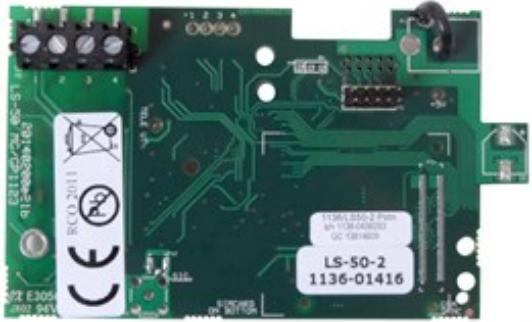

## LS-50-2 PSTN L-ÖVERFÖ.INT,FACE

Artikelnummer: 20140201, E-nummer: 6348565

Larmöverföringsinterface. Anslutningskort till larmsändare, PSTN. Modul för montage i undercentral. Följer undercentralens larmklass.

| Utförande:        | Inkopplingskort till UC-50 mot larmsändare |
|-------------------|--------------------------------------------|
| Temperaturområde: | +5°C till +40°C                            |
| Kommunikation:    | PSTN gränssnitt mot larmsändare            |
| Matningsspänning: | Matas från UC-50                           |
| Strömförbrukning: | 90mA vid sändning                          |