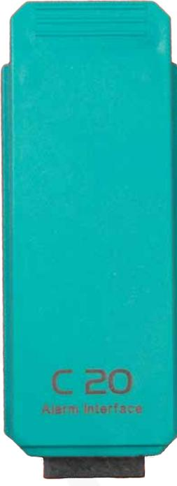
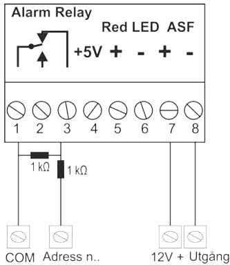
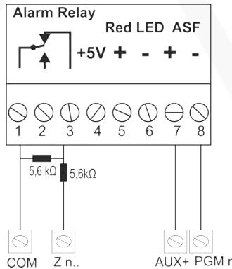
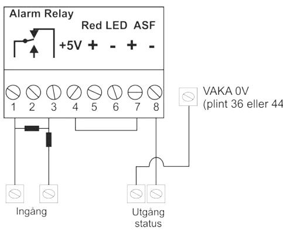

### Inkopplingsanvisning

Uppdaterad 2021-03-18

## **Larmmodul C20, 2-3220**

Larmmodul C20 används för att styra ett externt larmsystem med Axema VAKA.

### Inkoppling

- 1. Gör centralen spänningslös.
- 2. Montera modulen på valfri modulplats i dörrcentralen.
- 3. Montera den medföljande plinten under modulen och koppla in den enligt plintbeskrivningen.
- 4. Koppla till centralens spänning.

#### Plintbeskrivning

| Plint | Funktion                                                                                                                                                                                                                                                                                            |
|-------|-----------------------------------------------------------------------------------------------------------------------------------------------------------------------------------------------------------------------------------------------------------------------------------------------------|
| 1     | Larmrelä (C)                                                                                                                                                                                                                                                                                        |
| 2     | Larmrelä (NO)                                                                                                                                                                                                                                                                                       |
| 3     | Larmrelä (NC)                                                                                                                                                                                                                                                                                       |
| 4     | 5 V 20 mA utgång. Användbar i vissa ASF lösningar (Se plint 7 & 8)                                                                                                                                                                                                                                  |
| 5-6   | Ingång för extern styrning av röd lysdiod (5 är +, 6 är -), 5-24VDC. Om spänningen från larmpanelen är en spänning överstigande 12V, Viktigt: rekommenderar Axema att montera ett seriemotstånd (4,7kOhm) på plus sidan. Detta för att minimera strömförbrukning hos larmpanelen.       |
| 7-8   | Ingång för återkoppling från larmsystemets TILL/FRÅN-status, 5V-24VDC. . Om ASF-signalen från larmpanelen är en spänning överstigande Viktigt: 12V, rekommenderar Axema att montera ett seriemotstånd (4,7kOhm) på plus sidan. Detta för att minimera strömförbrukning hos larmpanelen. |

#### ASF-tips

Om ASF-signalen från manöverpanelen är slutande kontakt, koppla plint 4 till 7 i C20-plinten, 8 i C20-plinten till ena status-polen i larmpanelen, och den andra statuspolen i larmpanelen till 36 eller 44 (0V) i B28

## Tredjeparts larmsystem och C20

### Axema VAKA C20 och Galaxy

### Axema VAKA C20 och Teletec

#### C20 och inbrottslarm med potentialfri reläväxling för larmstatus

# Installation och konfiguration

Den här manualen behandlar endast montering och inkoppling av enheten.