R-CARD 5000

# **LockR Cabinet Driftsätta och installera**

Manualen beskriver hur du driftsätter och sedan monterar LockR Cabinet i passersystemet.

RCO Security AB Box 705 176 27 Järfälla

tel 08-546 560 00 info@rco.se

Klikk for norsk versjon! Suomeksi, paina tästä!

| Säkerhet och miljö                                                      | 3  |
|-------------------------------------------------------------------------|----|
| Om LockR Cabinet                                                        | 4  |
| Vad är LockR Cabinet?                                                | 4  |
| Komponenter – och versioner – som har stöd för LockR Cabinet 5 |    |
| Mifare-kort och konfigurationer                                         | 6  |
| Dataöverföring mellan LockR Cabinet och R-CARD M5 7               |    |
| OBS: Känsliga delar 10                                               |    |
| Sätt i batterierna                                                   | 11 |
| Driftsättning                                                        | 12 |
| Konfigurera undercentralernas minne                                     | 12 |
| Skapa offline-läsare i programmet                                       | 13 |
| Konfigurera dörrfunktioner                                              | 13 |
| Skapa dörrgrupper                                                       | 14 |
| Definiera åtkomst till offline-läsare                                   | 14 |
| Inställningar för initieringsläsare                                     | 15 |
| Konfigurera kortläsningen                                            | 15 |
| Överföra data mellan LockR Cabinet och R-CARD M5                     | 16 |
| Säkerhetskopiera databasen!                                          | 16 |
| Montering                                                               | 16 |
| Rekommenderade verktyg                                                  | 16 |
| Mått                                                                 | 17 |
| Gör så här                                                              | 18 |
| Visa användarna hur man initierar kort23                                |    |
| Visa användarna hur man använder LockR Cabinet23                        |    |
| Batteribyte                                                             | 24 |
| Byta ut kåpan eller hela enheten25                                      |    |
| Fabriksåterställning                                                 | 26 |
| Felsökning 27                                                        |    |
| Retur 27                                                             |    |
| Indikeringar 28                                                      |    |
| Specifikationer                                                         | 30 |
|                                                                         |    |

# **Säkerhet och miljö**

#### **Säkerhetsbestämmelser**

Förutsatt att produkten monteras enligt monteringsinstruktionen behöver inga särskilda säkerhetshänsyn vidtas.

## **CE-märkning**

Produkten uppfyller alla ställda produktsäkerhetskrav och är CE-märkt. CE-märken sitter på respektive enhets baksida. Märkskylten återfinns på chassit.

#### **Miljö**

Miljödeklaration finns att hämta på [www.rco.se,](https://www.rco.se/File/) under Mediearkivet > Kvalitet och miljö.

#### **Batterispecifikationer**

2 st. primärbatterier av typ CR2 (IEC CR15H270) som uppfyller batteri-säkerhetsstandard IEC 60086-4.

Varning! Endast ovanstående typ av batterier får användas. Fara kan uppstå med andra typer av batterier. Vid byte måste båda batterierna bytas och vara av samma fabrikat. **!** 

Varning! Vid felanvändning kan litium-batterier orsaka brand eller skada. Läs varningstexter på batteriförpackningen.

Vid service eller utbyte avlägsnas CR2-batterier inför transport.

#### **Uttjänta batterier**

#### **RoHS/WEEE**

Produkten uppfyller gällande regler enligt RoHS/WEEE samt REACH.

#### **Återvinning**

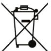

Produkten är märkt med den överkryssade soptunnan och kan lämnas till RCO för återvinning eller lämnas till återvinning enligt lokala föreskrifter.

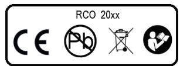

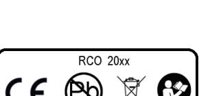

# **Om LockR Cabinet**

#### **Vad är LockR Cabinet?**

- Viktigt: LockR Cabinets kåpa och chassi är av säkerhetsskäl låsta mot varandra på elektronisk väg. Systemet kan inte fungera med två delar som inte hör ihop. **!**
LockR Cabinet består av ett cylinderlås med fallkolvsadapter och bygel för montering i skåp och på lådor.

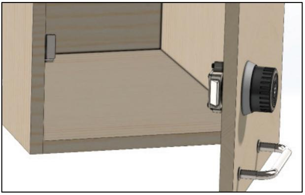

LockR Cabinet är en s.k. offline-enhet i RCO:s R-CARD 5000 passersystem. Att den är offline innebär att den kan installeras och användas som en kortläsare i passersystemet utan att vara fysiskt ansluten via kabel till systemet. Istället används en teknik där ett kort (passerkort, bricka, tag) initieras från en kabelansluten läsare i systemet. Kortet ger därefter passage[1](#page--1-12) vid en eller flera offline-enheter.

För att erhålla så lång drifttid som möjligt vid batteridrift har offline-läsaren en funktion som sätter den i viloläge när den inte används. För att sedan "väcka upp" enheten används en IR-lysdiod och mottagare placerad vid kortläsaren. När IR-ljuset reflekteras tillbaka till mottagaren av kortet som hålls framför kortläsaren, vaknar enheten upp och kortet avläses.

LockR Cabinet ansluts inte via kabel. Istället sker strömförsörjning med 2 st. CR2-batterier.

Vid batteribyte behålls lagrade inställningar för klocka och funktioner under ca. 3 timmar.

LockR Cabinet har en inbyggd rotationsgivare som känner av att man snurrar på vredet efter inkopplingen. Så fort man upphör att snurra, och vredet står stilla, så kopplar den ur enheten. Detta för att man ska slippa vänta.

För funktionsnedsatta som kan behöva ta ett omtag på vredet, så finns det en inställning som förlänger tiden, så att den inte kopplar ur innan man är klar med operationen.

Det går att installera upp till 2047 offline-enheter per domän i passersystemet.

1 *Passage* och *passerbehörigheter* är grundläggande begrepp i RCO:s system och motsvarar *öppning* och *behörighet att öppna* LockR Cabinet. Gäller i hela manualen.

| Komponent              | Version            |  |
|------------------------|--------------------|--|
| R-CARD M5              | 5.47 och senare    |  |
| UC-50                  | 2.82F8 och senare2 |  |
| DB-50                  | 3.x och senare     |  |
| DIO-5084               | Alla               |  |
| MIF-509, PROX/MIF-5093 | Alla               |  |
| Porttelefon PA-519     | Alla               |  |
| NoKey online (MIF-508) | Alla               |  |
| NoKey motor (MIF-528)  | Alla               |  |
| MIF-500                | Alla               |  |
| MIF-6004               | Alla               |  |
| MIF-663                | 1.03 och senare    |  |
| MIF-653                | 1.13 och senare    |  |

#### **Komponenter – och versioner – som har stöd för LockR Cabinet**

RCO:s produkter utvecklas kontinuerligt, vilket innebär att nya versioner av firmware lanseras. Nya versioner kan dels innebära att ny funktionalitet implementerats, eller att redan existerande har optimerats. Reader-509 kräver DB-50 eller DB-50 Light version 3.06 eller senare alt. DIO-5084 version 2.10 eller senare.

Rekommendation: Kör den senaste mjukvaruversion (firmware). Även R-CARD M5 bör hållas uppdaterad. Uppdateringar laddas ned från [RCO:s hemsida,](https://www.rco.se/) Mediearkivet > Mjukvara > Firmware resp. Mediearkivet > Mjukvara > Programvara R-CARD M5. (Inloggning krävs.)

4 Om två st. av dessa kortläsare används (t.ex. som in- och utläsare) tillsammans *med UC-50 version tidigare än 2.90* så kan de inte användas för initiering.

**!** 

2 Kontrollera UC-version: Välj Enheter > Systemenheter. Markera den aktuella enheten. På fliken Allmänt, kontrollera Typ. Här ska tillägget F8 finnas efter programversionen, t.ex. UC-50/8 Version 2.82F8. *Undercentraler som inte har F8 kan inte uppgraderas utan måste bytas ut.* Alla undercentraler i systemet bör ha samma version (helst senast möjliga version).

3 Kombinationen kombiläsare (PROX/MIF-509) och "kombikort" ska undvikas. Kombiläsaren kan dock sättas in som initieringsläsare för Mifare-kort.

#### **Mifare-kort och konfigurationer**

Hur informationen på kortet sparas och läses definieras i Mifare-profiler, som anger olika dataformat. Hur du skapar Mifare-profiler i systemet beskrivs i hjälpavsnittet "Konfigurera Mifare-kortläsningen".

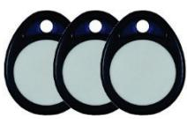

#### **Vilka kort kan användas?**

- Mifare Desfire EV2. Köps från kortutgivare som samarbetar med RCO Security. För att uppfylla kraven för SSF 1091/SSF 3522 låsklass 5 måste dessa kort användas. Kontakta RCO för mer information.
- Mifare Classic 4K-kort. Kan köpas från RCO Security.
- Kombikort (Mifare Classic + prox EM 4200). Kan köpas från RCO Security. RCOkombikort har samma ID-kod som läses ut av proxläsaren programmerad på Mifaredelens sektor 1.[5](#page--1-16)
- Mifare Classic 1K-kort. (Rekommenderas ej.)

#### **Om slutkunden redan har egna Mifare-kort**

Om slutkunden redan har egna Mifare-kort kan dessa eventuellt användas, förutsatt att du vet vilka sektorer som är lediga.

- Viktigt: Du som ska driftsätta en anläggning med Mifare-läsare måste vara väl medveten om—och göra klart för slutkunden—om och hur Mifare- eller kombikorten innehåller information utöver serienummer som ska nyttjas av systemet. Stäm av med slutkunden i vilken utsträckning korten ska användas till annat än passersystemet, exempelvis till kopieringsmaskiner eller annan utrustning. Det kan annars innebära ett stort merarbete att rätta till felaktiga profiler. **!**
5 I detta fall rekommenderas användningen av den i R-CARD M5 inbyggda profilgruppen Direkt RCO Kombikort.

#### **Dataöverföring mellan LockR Cabinet och R-CARD M5**

I ett offline-system ligger passerbehörigheterna sparade på Mifare-korten. De jämförs med offline-läsarens adress och aktuell tid. Från offline-läsarna överförs på samma sätt vissa händelser (se nedan) tillbaka till systemet när användaren passerar en online-läsare.

Vid behov kan data även överföras via en dator eller surfplatta som ansluts fysisk till LockR Cabinet. Programvaran R-CARD M5 ODM (Offline Device Manager) måste vara installerad på datorn/surfplattan.

#### **Via Mifare-korten och initieringsläsare**

Passerbehörigheter skrivs till kortet i samband med en passage vid en initieringsläsare (en vanlig kortläsare som aktiverats för denna funktion), som måste vara online mot systemet/UC-50, dock inte nödvändigtvis mot servern.

Ett kort kan bara vara initierat i en domän åt gången.[6](#page--1-17)

Kortet kan även föra över ytterligare information från R-CARD M5 Server till offline-läsarna, t.ex. en spärrlista. Information om kort som spärrats i R-CARD M5 kan alltså bäras med av ett giltigt kort från initieringsläsaren till offline-läsare.

Initieringsläsaren används också för att föra tillbaka följande information till R-CARD M5 Server från offline-läsarna:

- Gjorda passager (inte samtliga passager som gjorts i offline-läsarna, utan endast att passage gjorts med det specifika kortet under en tidsperiod).
- Varning för låg batterinivå.

#### **Via ODM-programmet**

Programvaran R-CARD M5 ODM (Offline Device Manager) installeras på en bärbar dator eller surfplatta med Windows operativsystem och USB-port. Datorn/surfplattan ansluts till offline-läsare via en USB-kabel med micro B-kontakt. Information kan då hämtas ur offlineläsare, exempelvis detaljer om gjorda passager.

ODM används även för överföring av programmerad funktionalitet från R-CARD M5 Server till offline-läsarna.

6 Hur lång tid som passerbehörigheter ska ges från initieringsläsaren till kortet kan justeras på respektive behörighetsgrupp (eller läsarbehörighet, om sådana används), från en timme till max. 365 dagar, alternativt helt utan begränsning. Om tiden t.ex. är satt till sex timmar innebär det att kortet får tillträde under sex timmar fr.o.m. en passage i initieringsläsaren. Därefter måste initieringsläsaren passeras på nytt för att förnya giltigheten.

#### **Alt. 1: ODM körs på Windows-platta eller bärbar dator**

ODM-programmet körs oftast på en bärbar dator (eller surfplatta med Windowsoperativsystem och USB-port) som inte har direkt kontakt med R-CARD M5 Server:

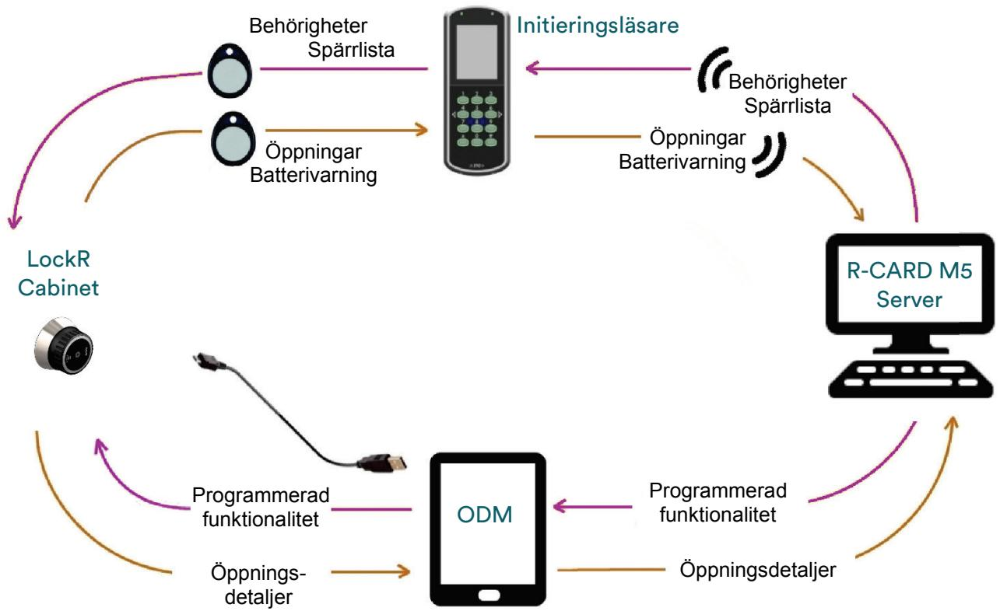

På den bärbara datorn eller surfplattan finns samma version av R-CARD M5 ODMprogrammet som på R-CARD M5-server/klienterna. Ingen licens behövs på den bärbara datorn eller surfplattan.

#### **Alt. 2: ODM körs på bärbar dator som har direkt kontakt med servern**

Om R-CARD M5 Klient, R-CARD M5 Server och ODM-programmet finns i en bärbar dator, eller om du har R-CARD M5 Klient och ODM-programmet på en bärbar dator som har direkt kontakt med R-CARD M5 Server, kan dataöverföringen i stället se ut så här:

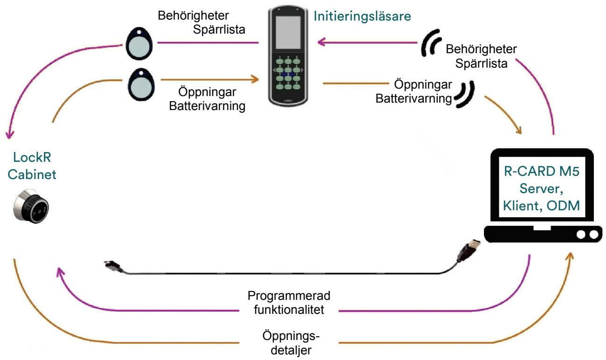

# **OBS: Känsliga delar**

Produkten innehåller ESD-känsliga komponenter. Vid batteribyte eller vid driftsättning vidrör ej produktens elektronik. **!** 

> Det är också viktigt att inte repa eller skada dessa ytor. Då förlorar produkten tätning mot fukt och vatten (IP67).[7](#page--1-18)

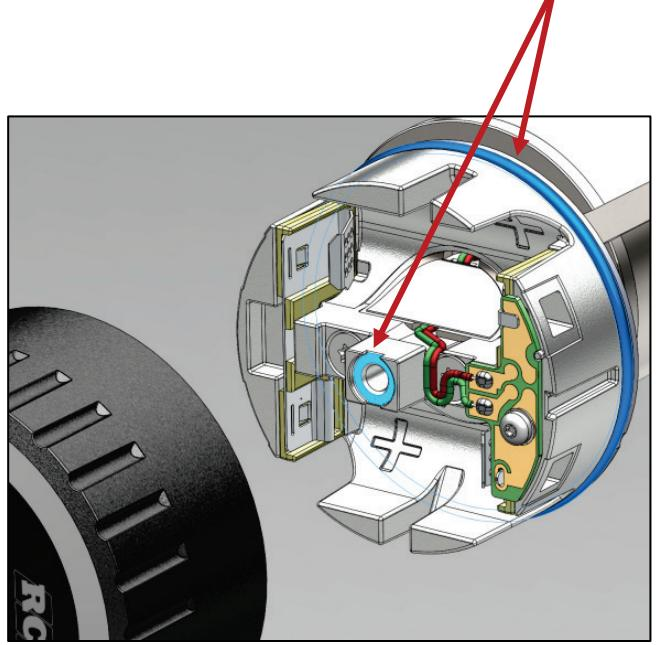

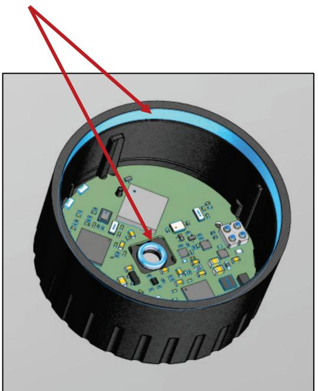

7 LockR Cabinet är endast avsedd för inomhusbruk och är inte IP-klassad.

# **Sätt i batterierna**

- Läs viktig information under ["Batterispecifikationer"](#page--1-19) på sidan [3!](#page--1-19) **!**
- **1** Skruva bort kåpan med en Torx T20 skruvmejsel.

Om kåpan sitter fast på grund av O-ringstätningen kan den behöva vickas lite för att lossna.

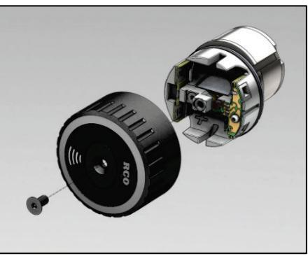

- **2** Sätt i 2 st. nya, torra, rumstempererade CR2 batterier enl. bilden.
Det finns markeringar för plus och minus i chassit. Kläm ihop fjädern på minussidan och vicka ner batteriet mot pluspolen.

Var försiktig med att inte skada kablarna till batterikortet.

När batterierna sätts på plats kan det hända att enheten svarar med växlande toner i upp till 30 sekunder. Detta är helt normalt och är en indikering på att enheten laddar realtidsklockans energibackup.

**3** Sätt fast kåpan.

Dra skruven med max. 0,5 Nm.

Om du inte har momentnyckel, dra åt skruven lätt tills den precis blir stum. Dra sedan åt lite extra, max. 15–20 grader till.

Får inte överdras! Kåpan kan skadas. **!** 

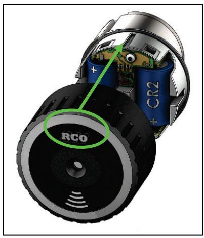

# **Driftsättning**

Processen underlättas om man driftsätter LockR Cabinet-enheter innan man monterar dem. Då kan dataöverföringen mellan enheterna och R-CARD M5 ske snabbt.

Programmering och driftsättning av offline-läsare—inklusive LockR Cabinet—i R-CARD M5 beskrivs utförligt i programmets hjälpfunktion. (Tryck på F1.)

#### **Konfigurera undercentralernas minne**

Beakta följande inställningar när du konfigurerar undercentralernas minne:

- Tidszoner: Tidszoner (maximalt antal. 199 per domän) behövs om läsarbehörigheter ska ges. Se nästa punkt.
- Läsarbehörigheter på kort ger möjlighet att ge behörighet till en eller flera utvalda dörrar (offline- eller online-läsare) i systemet, utöver de där tillträde ges via en behörighetsgrupp.

Tidszoner används då för att ange när tillträde beviljas i dörrarna utanför behörighetsgruppen.

Max. 3 läsarbehörigheter kan ges på varje kort.

- Antal offline dörrgrupper: Dörrgrupper används till att gruppera offline-läsare för tilldelning av behörigheter. Påverkar minnesutrymmet på kort. Max. antal dörrgrupper är 255 st.

Tips: Om anläggningen består av ett stort antal dörrar där bara en eller ett fåtal personer ska beviljas tillträde (t.ex. privata kontor) rekommenderas att nyttja funktionen Läsarbehörigheter på kort (se ovan) istället för att skapa ett stort antal dörrgrupper.

- Antal offline-enheter: Ange hur många offline-läsare som ska kunna skapas för domänen. Max. antal 2047 st. Påverkar minnesutrymmet på kort.
- Offlinestöd måste markeras på samtliga UC-50 som har kortläsare som ska användas som initieringsläsare. Inställningen finns i dialogrutan Zonägande, som visas när du dubbelklickar på undercentralen i fältet Enhet.

## **Skapa offline-läsare i programmet**

NoKey offline-läsare hämtas inte in som övriga kortläsare i systemet. Börja i stället så här:

- 1. Välj Enheter > Systemenheter.
- 2. Högerklicka på mappen Offline-enheter och välj Nya LockR Cylinder-enheter. (LockR Cabinet är en variant av LockR Cylinder.)
- 3. En ny dialogruta visas. Ange hur många cabinet-enheter som ska skapas och klicka på OK.
	- Rekommenderat tillvägagångssätt om flera offline-enheter ska ha identiska inställningar: Skapa en enhet, ange önskade inställningar, och kopiera sedan dessa egenskaper till nya enheter. Då skapas önskat antal kopior med inställningar lika som den först programmerade enheten. Därefter återstår endast att namnge de skapade kopiorna. **!**

Tryck på F1 i R-CARD M5 för hjälp med att skapa offline-läsare.

#### **Konfigurera dörrfunktioner**

När du skapar offline-läsare i programmet har de dörrfunktionen Standard som standard, vilket för LockR Cabinet innebär det att öppning sker med kort.

Om en annan funktionalitet önskas måste dörrfunktionerkonfigureras. Exempel:

- Du kan skapa olika tidsscheman för när skåpet ska vara olåst.
- Du kan konfigurera skåpet att låsas upp vid första öppning och låsas igen vid ett visst klockslag (inställning Låsöppna efter första passage, lås vid periodslut).
- Är dörrfunktioner aktiverade måste offline-enheterna uppdateras via ODM minst en gång vart tredje år. Efter treårsperioden löper ut går enheterna i annat fall över i högsta säkerhetsläge, kort + pinkod. **!**

Börja så här:

- 1. Klicka på plustecknet ( ) vid mappen Offline-enheter och välj önskad offline-läsare.
- 2. Klicka på dialogöppnaren ( ) till höger om Dörrfunktion i offline-läsarens egenskaper.
- 3. Dialogrutan Dörrfunktioner visas. Tryck på F1 för steg-för-steg instruktioner.

#### **Skapa dörrgrupper**

Offline-läsare kan inte väljas in i behörighetsgrupper på samma sätt som online-läsare. Istället skapas en dörrgrupp som innehåller en eller flera offline-läsare. Dörrgruppen väljs sedan in i behörighetsgruppen, vilket ger tillträde vid dörren eller skåpet.

Dörrgrupper används inte som standard. De måste väljas till när du konfigurerar undercentralens minne. Se sidan [12.](#page--1-20)

Börja så här:

- 1. Klicka på plustecknet ( ) vid mappen Offline-enheter.
- 2. Högerklicka på Dörrgrupper och välj Ny dörrgrupp.
- 3. Tryck på F1 för steg-för-steg instruktioner och tips.

#### **Definiera åtkomst till offline-läsare**

- 1. Skapa behörighetsgruppen som vanligt.
- 2. Lägg in de skapade dörrgrupperna för att tilldela passagerättigheter.

Du hittar dem på fliken Kortläsare/Områden > "underfliken" Offline-dörrgrupper. Dra–släpp dem från vänster till höger ruta.

- 3. Välj fliken Egenskaper igen och ange hur lång tid korten ska vara giltiga i LockR Cabinet efter varje initiering. Det gör du genom att expandera Offline-enheter och ange Säkerhetsnivå.
I onlinehjälpen finns mer information.

#### **Inställningar för initieringsläsare**

Minst en av systemets online-läsare måste vara inställd att fungera som initieringsläsare. Initieringsläsare skriver information till kortet om vilka offline-läsare som kortet ska fungera i, samt under vilken tidsrymd.

Max. 3 st. initieringsläsare per undercentral!

För att aktivera en kortläsare som initieringsläsare, markera Ska uppdatera offline-kort i kortläsarens egenskaper:

| Allmant Grafik                             |                                   |
|-----------------------------------------------|-----------------------------------|
| Egenskaper                                    | Inställningar                     |
| Benamning                                     | Entré                             |
| Typ                                           | READER-509K MIFARE, Version 1.10F |
| Enhetsnummer                                  | 52                                |
| Pos                                           | KL 1:2                            |
| Loqotypbild                                   |                                   |
| + Fri text (2 × 30 tecken)                    |                                   |
| Språkinställningar +                       |                                   |
| Dormiljo +                                 |                                   |
| Dörlarm +                                  |                                   |
| Lokal larmstyrning +                       |                                   |
| Dörrmiljö lokal larmstyrning/larmområden + |                                   |
| Summalarm +                                |                                   |
| Indikeringar +                             |                                   |
| Inställningar för offline-enheter i        |                                   |
| Initierar offline-kort                        |                                   |
| + RCO Access app                              |                                   |
| F Övrigt                                      |                                   |

#### **Konfigurera kortläsningen**

Vad som ska lagras på och läsas ifrån Mifare-korten, och hur, programmeras i R-CARD M5 med hjälp av och offlineprofiler och profilgrupper.

- 1. I R-CARD M5, välj Enheter > Konfig. Mif-läsare.
- 2. Tryck på F1 för steg-för-steg instruktioner och tips.

## **Överföra data mellan LockR Cabinet och R-CARD M5**

Hur dataöverföringen fungerar beskrivs på sidan [7.](#page--1-0) Rent praktiskt har du två val:

- Använda en bärbar dator eller en surfplatta med Windows-operativsystem och USBport.
- Använda en bärbar dator som har kontakt med R-CARD M5 Server.

Steg-för-steg instruktioner hittar du i onlinehjälpen.

#### **Säkerhetskopiera databasen!**

Det är av största vikt att R-CARD M5-databasen säkerhetskopieras regelbundet. Om databasen skulle försvinna blir samtliga LockR Cabinet-enheter omöjliga att driftsätta i ett nytt system och måste ovillkorligen bytas ut.

Anledningen är att konfigurationen är krypterad i databasen och kan inte återskapas i en ny databas. Även fabriksåterställning kräver tillgång till denna kryptering. Det innebär att driftsatta enheter utan tillhörande databas måste kasseras.

I R-CARD M5, välj Databas > Säkerhetskopiera. Tryck på F1 för instruktioner.

# **Montering**

Driftsätt LockR Cabinet med ODM innan du stänger skåpet, annars får du inte upp dörren! **!** 

#### **Rekommenderade verktyg**

- Vinkelhake med måttskala
- Skjutmått
- Blyertspenna med suddgummi
- Hammare
- Körnare
- 2 mm borr
- 6 mm borr
- 41 mm hålsåg
- Skruvdragare
- 3 mm insexnyckel med handtag
- Bits Philips 2

#### **Mått**

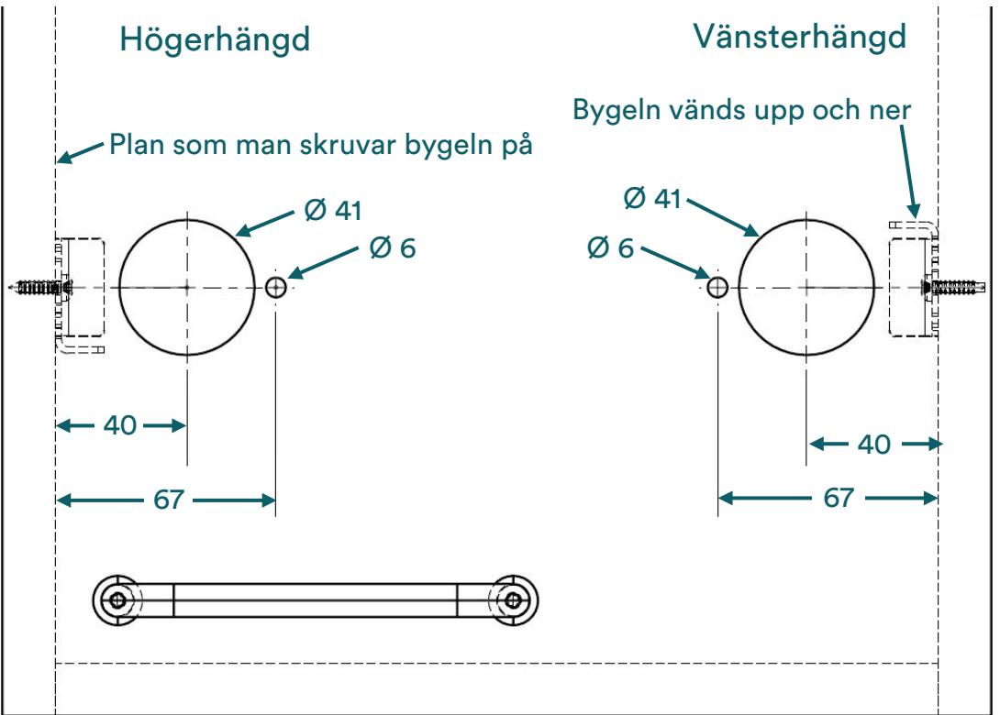

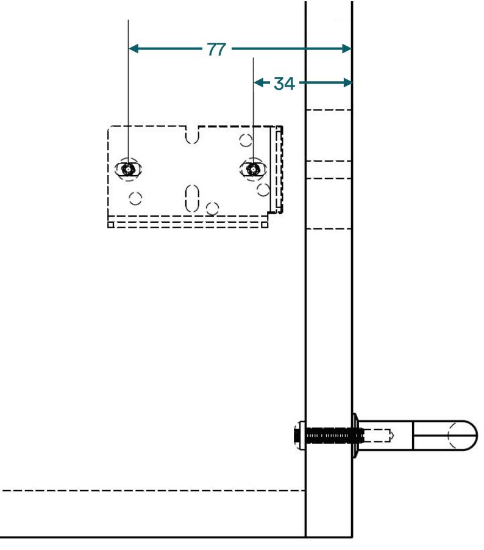

#### **Gör så här**

- **1** Mät upp tjockleken på karmen (A).
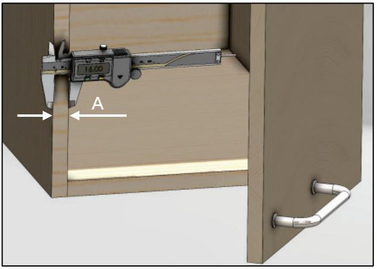

- **3** Mät upp tjockleken på luckan (B).
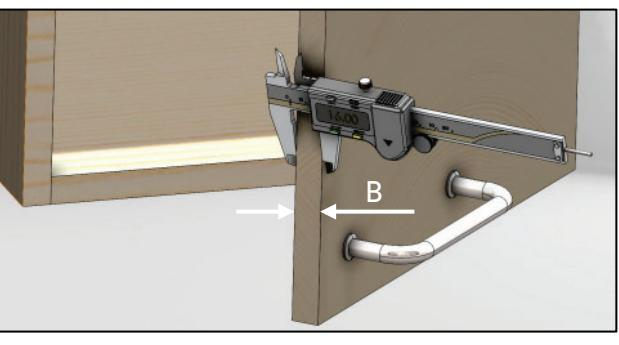

- **4** Kontrollera att sidan på luckan linjerar med karmen.
Om dessa inte linjerar måste man ta hänsyn till det när man ska borra hålen i luckan.

- Är det som på bilden får man dra av.
- Om det hänger över får man lägga till.

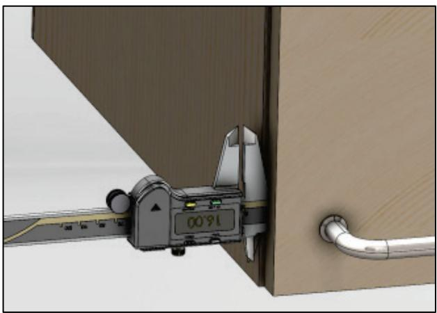

- **5** Markera höjden på luckan där LockR Cabinet ska sitta.
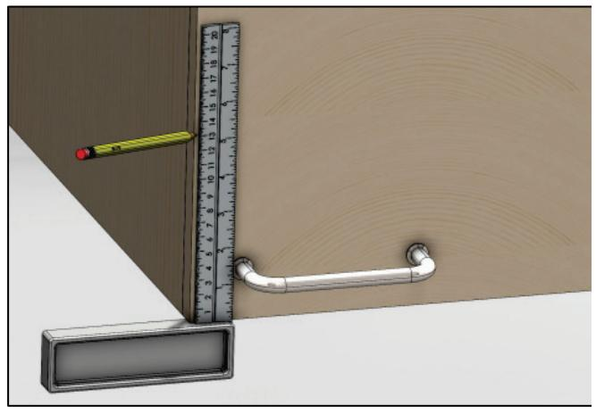

- **6** Markera höjden på karmen där bygeln ska sitta – samma höjd som på luckan.
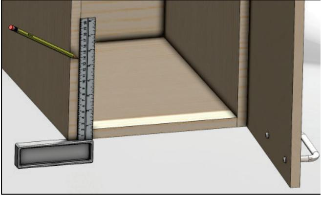

- **7** Markera var hålen på luckan ska borras enligt formeln.
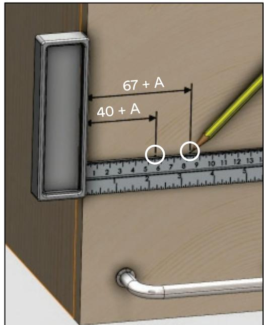

- **8** Markera var de två styrhålen i karmen ska sitta enligt formeln.
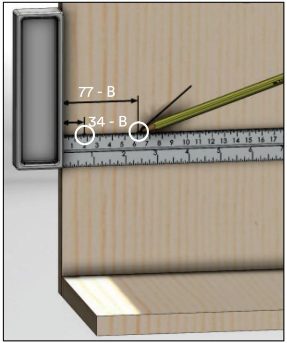

**9** Körna de 4 hålen.

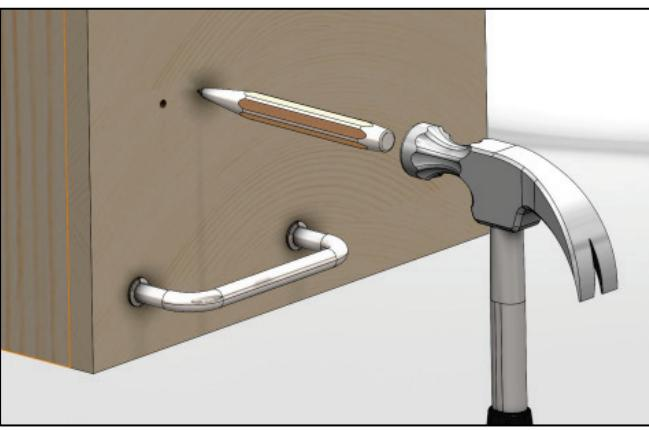

- **10** Borra upp hålen i luckan med en 6 mm borr och 41 mm hålsåg.
Borra upp hålen i karmen med en 2 mm borr. Ej genomgående hål i karmen!

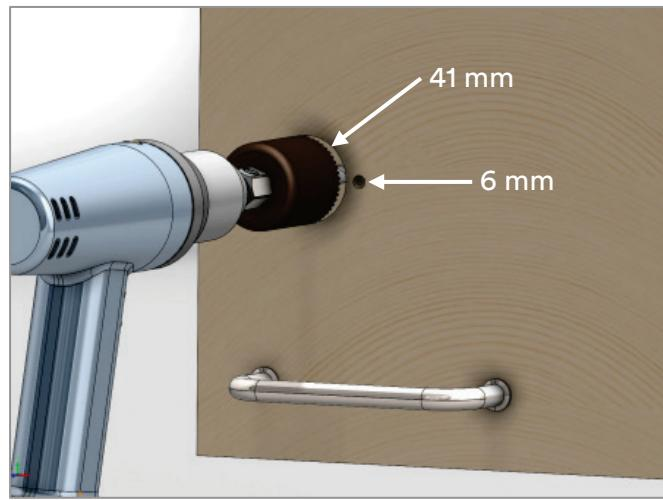

- **11** Linjera baksidan på LockR Cabinet så att den passar i adaptern. Rikta den blå delen så att den pekar mellan hålet och skruven.
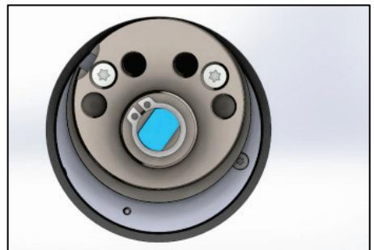

- **12** Montera LockR Cabinet. Dra fast de två inbyggda skruvarna korsvis med en 3 mm insexmejsel.
	- LockR Cabinets inkoppling måste justeras in i adaptern. Det får inte finnas någon springa emellan. **!**

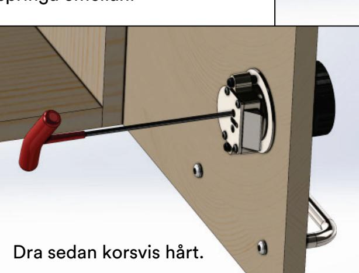

- **13** Dra nu fast enheten i dörren genom att korsvis dra åt mothållsskruvarna.
Om dörrbladet är tunt, byt till de två längre skruvarna som medföljer.

Dra fast ordentligt.

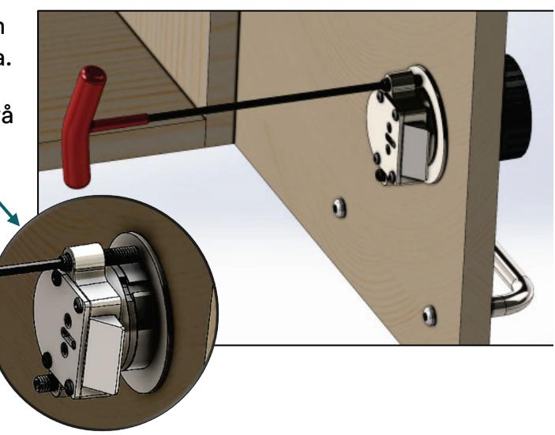

- **14** Dra fast låsbygeln med 2 skruvar så att det går att skjuta bygeln.
	- OBS! Konfigurera enheten innan du stänger dörren, annars kommer du inte in! **!**

Skjut låsbygeln så att glappet mellan luckan karmen är lämpligt.

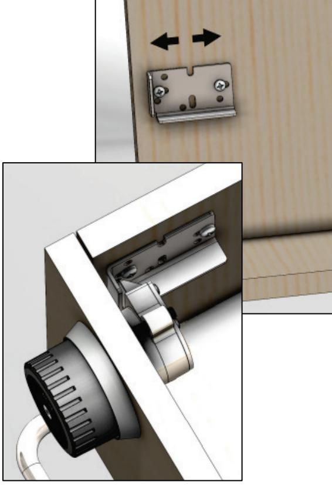

- **15** Lås fast bygeln i de två fasta hålen med 2 skruvar när glappet är optimalt.
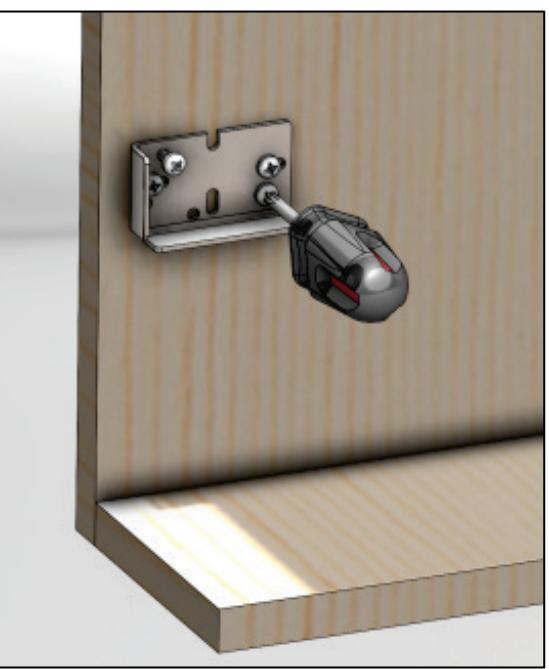

# **Visa användarna hur man initierar kort**

- Tips: Handboken Kortläsare och porttelefoner – Använda beskriver handhavandet av aktuella enheter med tillhörande bilder. Använd den som ett underlag och skriv ut en skylt, laminera och sätt upp den vid initieringsläsarna tills användarna har lärt sig handhavandet. Handboken kan laddas ned från [RCO:s hemsida,](https://www.rco.se/) under Mediearkivet > Manualer. (Inloggning krävs.) **!**
# **Visa användarna hur man använder LockR Cabinet**

- 1. Visa kort.
- 2. Enheten lyser grönt. Snurra vredet medsols.
- 3. Öppna luckan eller lådan.
- 4. Avvakta det bekräftande vita blinket.

Om enheten blinkar rött måste man korrigera det.

- 5. Stäng luckan eller lådan. Om den ska vara låst,[8](#page--1-18) kontrollera genom att dra i och snurra LockR Cabinet.
Man behöver inte visa kort för att låsa.

8 LockR kan programmeras i R-CARD M5 till att vara olåst vissa tider eller efter första öppning.

# **Batteribyte**

Batterivarning (gul lampa[9](#page--1-21)) börjar när ca. 10% av batterikapaciteten återstår. Rekommendation: Byt batteriet snarast efter att batterivarningen indikerat. Eventuellt schemalagt batteribyte i en större anläggning med utomhus-enheter bör ske på hösten eller tidig vinter. Anledningen är att batteriförbrukningen är störst vid låga temperaturer.

Vid batteribyte behålls lagrade inställningar för klocka och funktioner under ca. 3 timmar.

Läs viktig information under ["Batterispecifikationer"](#page--1-19) på sidan [3!](#page--1-19) **!** 

Akta känsliga delar! Se sidan [10!](#page--1-0)

- 1. Skruva bort kåpan med en Torx T20 skruvmejsel.
- 2. Peta ut de uttjänta batterierna med hjälp av ett max. 3 mm flatskruvmejsel.
- 3. Sätt i 2 st. nya, torra, rumstempererade CR2-batterier enl. bilden.
- 4. Sätt fast kåpan enl. beskrivningen på sidan [11.](#page--1-0) Skruven får inte överdras! Kåpan kan skadas.

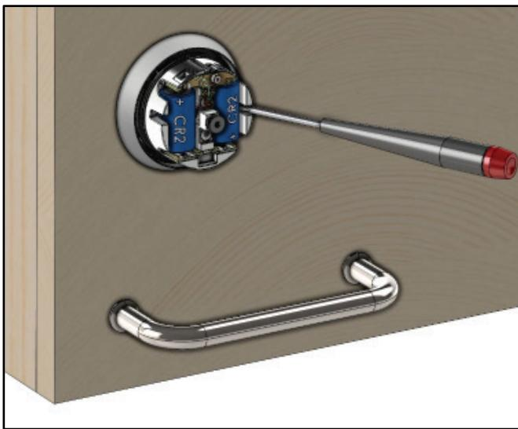

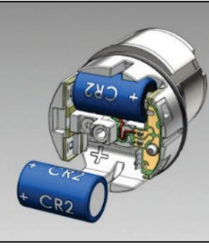

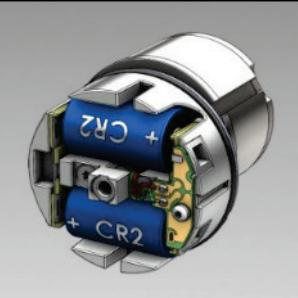

9 Batterivarning ger även pipljud, om Summer vid batterivarning markeras när man skapar offline-läsare i R-CARD M5.

# **Byta ut kåpan eller hela enheten**

- Vill du hämta logghändelser från den ursprungliga enheten innan de raderas måste det göras i ett separat förfarande. Steg-för-steg instruktioner hittar du i onlinehjälpen, under "Överföra uppdateringar till och hämta data från offline-läsare". **!**
I stora drag:

- 1. I R-CARD M5, högerklicka på den enhet vars kåpa ska bytas ut och välj Återställ enhet med ny kåpa.
Alternativt, högerklicka på den enhet som ska bytas ut helt och välj Byt ut enhet.

- 2. Kopiera filerna till bärbar dator eller surfplatta.[10](#page--1-15)
- 3. Starta ODM-programmet och ange "lösenordet" (krypteringsnyckeln).
- 4. I ett domänsystem, välj domän.
- 5. Klicka på Konfigurera enheter. Meddelandet Anslut till enhet via USB visas.
- 6. Skruva bort den gamla kåpan med en Torx T20 skruvmejsel.
- 7. Om den gamla kåpan/enheten inte ska kasseras direkt,[11](#page--1-22) fabriksåterställ den:
	- a) Anslut USB-kabeln till kåpan och klicka på Fabriksåterställning.
	- b) Enheten startar om. Avvakta tills Enhetens driftstatus (längst ner i ODMprogrammet) visar Slutför fabriksåterställningen genom att sätta på kåpan.
	- c) Sätt tillbaka kåpan för att processen ska avslutas.
- 8. Driftsätt den nya enheten:
	- a) Anslut USB-kabeln till den nya kåpan.
	- b) Välj önskad identitet i nedre rullgardinslistan.
	- c) Klicka på Driftsätt.

11 I regel ska defekta kåpor/enheter skickas tillbaka till RCO Security för undersökning. För att en enhet/kåpa ska kunna undersökas eller användas på något annat sätt *måste* den återställas med hjälp av aktuella ODMfiler enl. detta steg.

10 Om datorn har kontakt med R-CARD M5 Server (alt. 2 på sidan [12)](#page--1-0) behöver filerna inte kopieras.

- d) När överföringen är klar startar enheten om. Avvakta tills Enhetens driftstatus (längst ner i ODM-programmet) visar Slutför driftsättningen genom att sätta på kåpan.
- e) Sätt tillbaka kåpan för att processen ska avslutas.
- f) Testa funktion.
- 9. Återför data till R-CARD M5 med hjälp av ODM-programmet.

# **Fabriksåterställning**

Vid fabriksåterställning ställer sig enheten i olåst läge och förblir så tills den driftsätts på nytt.

- Viktigt! Ha alltid för vana att dra ut USB-kabeln ur offline-läsaren efter att fabriksåterställning gjorts och stänga ODM-programmet efter att data återförts till R-CARD M5 Server. **!**
Gör enl. nedan. Behövs utförligare instruktioner finns dessa i onlinehjälpen i R-CARD M5.

- 1. När du vill återställa en offline-läsare måste data först hämtas ur databasen. Kopiera data från databasen till filer med hjälp av ODM.

Kryssrutan Visa endast enheter med ändringar ska vara avmarkerad.

- 2. Kopiera filerna till bärbar dator eller surfplatta[.12](#page--1-23)
- 3. Starta ODM-programmet och ange "lösenordet" (krypteringsnyckeln).
- 4. I ett domänsystem, välj domän.
- 5. Klicka på Konfigurera enheter. Meddelandet Anslut till enhet via USB visas.
- 6. Skruva bort kåpan med en Torx T20 skruvmejsel och anslut USB-kabeln mellan offlineläsaren och datorn/surfplattan.
- 7. Klicka på Fabriksåterställning och bekräfta att enheten ska återställas.

- 8. När återställningen är klar kan du återställa flera enheter. Anslut USB-kabeln till nästa offline-läsare och klicka på Fabriksåterställning.

- 9. Kopiera filerna från bärbar dator eller surfplatta till dator som har kontakt med servern.[12](#page--1-18)
- 10. Överför data till databasen med hjälp av ODM.
	- Detta steg är avgörande för att LockR Cabinet ska kopplas loss från R-CARD M5-databasen utan att bli obrukbar. **!**

# **Felsökning**

Vanliga orsaker till att LockR Cabinet inte fungerar:

| Orsak                                 | Se följande för åtgärd                                              |
|---------------------------------------|---------------------------------------------------------------------|
| Undercentralen har inte programmerats | "Konfigurera undercentralernas minne" på                            |
| för offlinestöd.                      | sidan 12.                                                           |
| Enheten finns inte med i dörrgruppen. | "Skapa dörrgrupper" på sidan 14.                                    |
| Dörrgruppen finns inte med i          | "Definiera åtkomst till offline-läsare" på                          |
| behörighetsgruppen.                   | sidan 14.                                                           |
| Kort har inte knutits till            | Hjälpavsnitt "Lägga in                                              |
| behörighetsgruppen där dörrgruppen    | användarens/lägenhetens kort", underrubrik                          |
| och/eller initieringsläsaren ingår.   | "Koppla behörigheter till kortet".                                  |
| Kort har inte initierats.             | Hjälpavsnitt "Felsökning: Kort fungerar inte i offline-enheter". |

## **Retur**

Gör så här om en LockR Cabinet ska skickas tillbaka till RCO Security:

- 1. Anteckna vilket fel som förekommer. Räkna antalet röda blink (se tabell på sidan [29)](#page--1-0).
- 2. Montera ned enheten.
- 3. Fabriksåterställa enheten om möjligt. Detta görs via ODM – se [ovan.](#page--1-9)
- 4. Ladda ned returblanketten från [RCO:s webbplats](https://www.rco.se/file/) under Mediearkivet > Service. Fyll i blanketten och ange detaljer som antalet röda blink.
- 5. Skicka paketet enl. instruktionerna på returblanketten.

12 Om datorn har kontakt med R-CARD M5 Server (alt. 2 på sidan [10)](#page--1-0) behöver inte filerna kopieras.

# **Indikeringar**

LockR Cabinet är försedd med en LED-lampa och en inbyggd summer som indikerar status hos enheten. Indikering kan ske i samband med driftsättningen och vid passageförsök i enheten.

#### **Vid uppstart**

| Indikering                         | Betydelse                                                                                                                                                                                                                                                                                                                                                           |
|------------------------------------|---------------------------------------------------------------------------------------------------------------------------------------------------------------------------------------------------------------------------------------------------------------------------------------------------------------------------------------------------------------------|
| Växlande toner                     | Laddar RTC supercap (realtidsklockans superkondensator): När batterierna sätts på plats kan det hända att enheten svarar med växlande toner i upp till 30 sekunder. Detta är helt normalt och är en indikering på att enheten laddar realtidsklockans energibackup. Medans energibackupen laddas kommunicerar enheten inte med ODM-programmet. |
| 2 x röd blink                      | Fel vid ODM. Se "Överföra data mellan LockR Cabinet och R-CARD M5" på sidan 16.                                                                                                                                                                                                                                                                                  |
| 1 pipljud med 10 sek. mellanrum | CRC (Cyclic Redundancy Check) fel i bootloader. Kontakta RCO Teknisk Support.                                                                                                                                                                                                                                                                                 |
| 2 pipljud med 10 sek. mellanrum | CRC fel i applikation. Kontakta RCO Teknisk Support.                                                                                                                                                                                                                                                                                                             |
| Magenta (lila) (kort puls)         | RTC tidfel (fel i realtidsklockan).                                                                                                                                                                                                                                                                                                                                 |
| Gul (kort puls)13                  | Batterivarning.                                                                                                                                                                                                                                                                                                                                                     |
| Grön (kort puls)                   | Allt OK.                                                                                                                                                                                                                                                                                                                                                            |

13 Batterivarning ger även pipljud, om Summer vid batterivarning markeras när man skapar offline-läsare i R-CARD M5.

#### **Vid visning av kort/tag**

| Indikering                                   | Betydelse                                                                                                                                                                                                                |                               |  |
|----------------------------------------------|--------------------------------------------------------------------------------------------------------------------------------------------------------------------------------------------------------------------------|-------------------------------|--|
| Magenta (lila) + 3 pipljud                   | RTC tidfel. RTC har nollställts eftersom batterierna blivit urladdade. En ny ODM-session krävs för att åter få igång produkten i samband med batteribyte. Produkten kan dock användas med vaktmästarbehörighet. |                               |  |
| Gul13                                        | Batterivarning. Se "Batteribyte" på sidan 24. Tips: R-CARD M5 kan konfigureras att rapportera batterivarning via e-post.                                                                                           |                               |  |
| Grön + 1 pipljud                             | LockR Cabinet är inkopplad, kortet är läst och godkänt. Låset kan öppnas eller låsas.                                                                                                                                 |                               |  |
| Röd + 1 pipljud                              | Ingen tillgång. Behörighet saknas.                                                                                                                                                                                       |                               |  |
| Vit                                          | LockR Cabinet är frikopplad. Visas efter att man roterat cylindern.                                                                                                                                                   |                               |  |
| Röd blink i 5 sekunder + växlande pipljud | Motorkörningsfel. Låset kunde inte öppnas eller låsas enligt styrningen. Försök igen eller korrigera manuellt!                                                                                                        |                               |  |
| 1 x röd blink                                | Ej driftsatt.                                                                                                                                                                                                            |                               |  |
| 2 x röd blink                                | Fel vid ODM. Se "Överföra data mellan LockR Cabinet och R-CARD M5" på sidan 16.                                                                                                                                       |                               |  |
| 3 x röd blink                                | Fel i EESI.                                                                                                                                                                                                              |                               |  |
| 4 x röd blink                                | Fel i BLOBB.                                                                                                                                                                                                             |                               |  |
| 5 x röd blink                                | Fel i loggfil.                                                                                                                                                                                                           |                               |  |
| 6 x röd blink                                | Fel i spärrlista.                                                                                                                                                                                                        |                               |  |
| 7 x röd blink                                | Fel i läsare.                                                                                                                                                                                                            | Kontakta RCO Teknisk Support. |  |
| 8 x röd blink                                | Fel i underenhet.                                                                                                                                                                                                        |                               |  |
| 9 x röd blink                                | Fel i OTP-minne.                                                                                                                                                                                                         |                               |  |
| 10 x röd blink                               | Fel i flash-minne.                                                                                                                                                                                                       |                               |  |

# **Specifikationer**

| Låsets diameter             |                             | 39,9 mm |
|-----------------------------|-----------------------------|---------|
| Kåpans diameter             |                             | 52,2 mm |
| Cylinderringens diameter    |                             | 62,8 mm |
| Max. tjocklek på luckbladet | Med stödbricka och fallkolv | 22,8 mm |
|                             | Utan stödbricka             | 24,8 mm |
| Totallängd                  |                             | 74,1 mm |

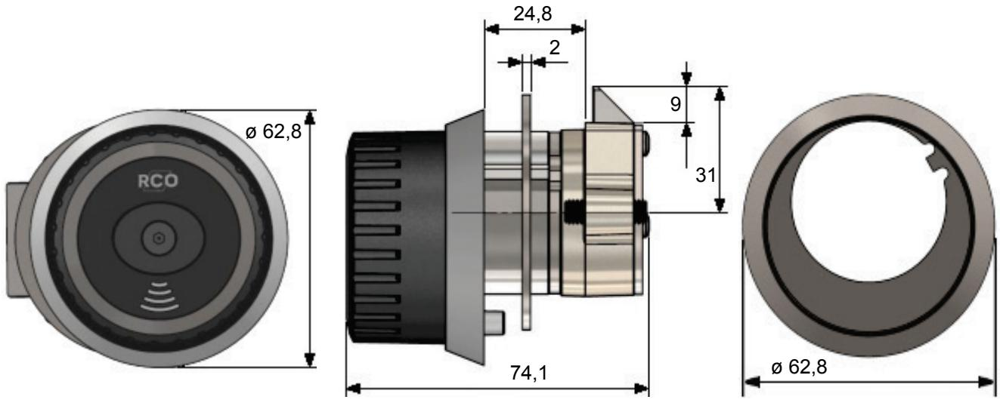

| Vikt                   |                                                                                                                                                                             | 585 g |
|------------------------|-----------------------------------------------------------------------------------------------------------------------------------------------------------------------------|-------|
| Matningsspänning       | 2 st. CR2-batterier (ingår ej) ska uppfylla IEC60086-4.                                                                                                                     |       |
| Strömförbrukning       | Aktiv: Max. 300 mA Vila/standby: 10–15µA                                                                                                                                 |       |
| Livslängd på batterier | Vid rumstemperatur: Ca. 3 år med 16 öppningar per dag. Vid -25 °C: 1 till 1,5 år med 20 öppningar per dag. Batterivarning när ca. 10% av batterikapaciteten återstår. |       |
| Temperaturområde       | -25 till +65 °C                                                                                                                                                             |       |
| Lästeknik              | Mifare® Classic, 1 eller 4 Kbyte Mifare® Desfire EV2                                                                                                                     |       |
| Sändarfrekvens         | 13,56 MHz                                                                                                                                                                   |       |
| Sändareffekt           | -10,99 dBµA/m vid 10 m                                                                                                                                                      |       |
| Läsavstånd             | Cirka 2–4 cm beroende på transponder. Svarta kort/taggar rekommenderas inte.                                                                                             |       |

| Klocka   | Inbyggd klocka och kalender som sätts vid driftsättning. Vid batteribyte behålls lagrade inställningar för klocka och funktioner under ca. 3 timmar. |
|----------|------------------------------------------------------------------------------------------------------------------------------------------------------------|
|          | Klockan kan driva +/- 5 minuter per år beroende på temperatur men justeras automatiskt varje gång ODM-programvaran kommunicerar med enheten.      |
| Standard | SS-EN 55032, utg 2:2015/AC1:2016 SS-EN 61000-6-2, utg 3:2005/C1:2005 ETSI EN 300 330 V2.1.1                                                       |

