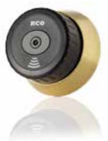

## LOCKR-CYL MIF80AM

LockR Cylinder Artikelnummer: 20181022, E-nummer: 5871331

LockR MIF80AM Offline rundcylinder med cylinderring av mässing. MIF80A ska användas inomhus på modulkistor med 90 graders vridning. Cylinderhål anpassade för ovalcylinder kan man behöva borra upp till 43 mm för att passa rundcylinder.

MIF80A stödjer lästeknikerna Desfire EV2 med RCO app eller Mifare Classic med sektorläsning. RCO rekomenderar att inte använda svarta taggar / kort.

LockR cylinder – Välj rätt modell

**Teknisk beskrivning**

Cylindern fungerar som en NoKey offline i systemet, vilket innebär att LockR Cylinder har samma systembegränsning: R-CARD M5 kan maximalt hantera 2047 offline-enheter (Cylindrar + NoKey) per domän. Kravet för att cylinder ska fungera är R-CARD M5 version M5 5.47 samt att objektet har relevant antal online-läsare med stöd för initiering av kort/taggar. Cylindern levereras med stöd för Desfire EV2 och Mifare Classic.

Vid batteribyte håller cylindern konfigurationen i 3 timmar. Om längre tid passerar måste cylindern omprogrammeras. Cylindern har inbyggd klocka och kalender som sätts vid driftsättning av ODM-programvaran. Klockan i enheten kan driva +- 30 sekunder per år i rumstemperatur. Klockan justeras automatiskt varje gång ODM-programvaran kommunicerar med enheten. ODM-programmet används alltid vid driftsättning, programmering, uppdatering av Flash samt vid behov av detaljerad händelselogg. 

| Utförande:                           | Rundcylinderring i mässing                   |
|--------------------------------------|----------------------------------------------|
| Matningsspänning:                    | 6V 2*CR2 Batterier skall uppfylla IEC60086-4 |
| Livslängd batterier:                 | 3 år med 8 användningar per dag              |
| Systemkrav R-CARD M5:                | 5.47 eller senare                            |
| Vikt:                                | 460g + (shims 32,5g)                         |
| Temperaturområde:                    | -25 till +65 °C                              |
| Lästekniker:                         | Desfire EV2/ Mifare classic                  |
| Kapslingsklassning:                  | Endast inomhus                               |
| IK-klassning:                        | IK8                                          |
| Sändarfrekvens:                      | 13,56 Mhz                                    |
| Inläsning som stöds:                 | Desfire EV2 RCO App, Classic sektor          |
| SS-EN 15684:2012                     | Certnr. 20-203                               |
| (1) Category of use:                 | Grade 1                                      |
| (2) Durability:                      | Grade 6                                      |
| (3) Fire/smoke resistance:           | Grade B                                      |
| (4) Environmental resistance:        | Grade 0                                      |
| (5) Mechanical key related security: | Grade 0                                      |
| (6) Electronic key related security: | Grade F                                      |
| (7) System management:               | Grade 3                                      |
| (8) Attack resistance:               | Grade 1                                      |