MANUAL SAFETRON 5000/5500

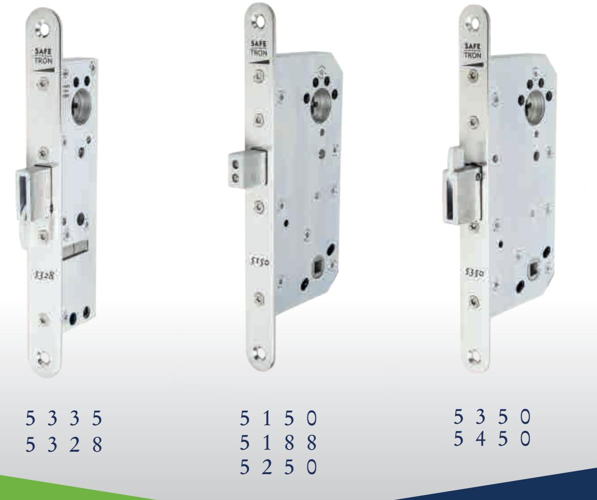

20150909 Rev. 2.0

## VIKTIG INFORMATION | VIKTIG INFORMASJON | IMPORTANT NOTICE

- Safetron motorlås är avsett för användning av allmänheten där det finns större incitament att vara försiktiga och där det finns hög risk för missbruk, t.ex. dörrar i offentliga byggnader. Avsett för dörrar upp till 200 kg dörrmassa, 25 N högsta stängningskraft. •
- Innan man monterar ett elektriskt motorlås bör man kontrollera att dörren hänger korrekt och att dörrbladet löper fritt. Det är inte rekommenderbart att installera Safetron motorlås i dörrar med ihålig kärna. Kontrollera att dörrens konstruktion medger montage av motorlås, exempelvis genom kontroll av dolda gångjärn, att dörrblad som greppar i varandra kan öppnas samtidigt, att dörrspringan mellan dörrblad är 3 mm +/- 1mm, att rörliga delar inte påverkar varandra. •
- Safetron motorlås får monteras i enkeldörrar eller pardörrar av trä, stål eller aluminium. •
- O.B.S Motorlås tillverkade enligt SS-EN 14846:2008 ger en hög grad av rimlig säkerhet förutsatt att de monteras på dörrar och karmar i gott skick. •
- Beaktande skall vidtas för säkerställande av att eventuella tätningar eller tätningslister inte hämmar motorlåsets funktion. •
- Se till att rätt lås monteras för den avsedda dörren (se produktkatalog) •
- Montagesättet skiljer sig inte mellan olika typer av dörrar, typ trä/metall. •
- Safetron motorlås är inte avsett för att användas på dubbel (svängdörr). •
- Fastställda anvisningar måste följas noga under installationen. De här instruktionerna måste överföras av installatören till användaren. •
- Kontrollera motorlåsets kolvar så att de i indraget läge inte förhindrar dörrens öppnings- och stängningsfunktion (se skötselanvisning) •
- Där motorlås monteras på dubbeldörrar (pardörrar) krävs att dörrstängare används som har dörr koordinator enligt EN 1158 (se standard) för att säkerställa rätt stängnings sekvens. •
- Alla komponenter specificerade för installationen skall användas för att uppfylla europastandard SS-EN 14846:2008. •

- Safetron motor lock is intended for use by the general public where there is more incentive to be careful and where there is a high risk of abuse, such as doors in public buildings. Intended for doors up to 200 kg door mass, 25 N maximum closing force.
- Before installing the lock check that the door hangs properly and that the door blade runs freely. It is not advisable to install Safetron motor lock in doors with a hollow core. Check that the door's design allows mounting of the motor lock, for example, through the control of offset hinges, that the door leaf meshing together can be opened simultaneously. The gap between door leaf and frame should be 3 mm +/- 1mm, check that no moving parts affect each other.
- Safetron motor lock may be installed in single or double leaf doors of wood, steel or aluminum.
- NOTE Motor lock manufactured according to EN 14846: 2008 provides a high degree of safety and reasonable security provided that they are mounted on the doors and frames in good condition.
- Care shall be taken to ensure that any seals or weather-stripping fitted to the complete door assembly does not inhibit the correct operations of the electrical operated lock or striking plate.
- Ensure that the lock model is suitable for the intended door (see product catalog)
- Installation method does not differ between different types of doors, type, wood / metal.
- Safetron motor lock is not intended for use on double action doors (revolving door).
- Established fixing instructions must be followed carefully during installation. These instructions and any maintenance instructions must be passed on by the installer to the user.
- Check bolt heads and keepers so that in the withdrawn position does not prevent the door opening and closing function (see Maintenance Instructions)
- Where motor lock mounted on double doors (double doors) requires door closers are used as the door coordinator of EN 1158 (see standard) to ensure the correct closing sequence.
- All components are specified for the installation shall be fitted in order to ensure compliance with this European standard SS-EN 14846:2008.

#### MONTERINGSANVISNING FÖR SAFTRON MOTORLÅS 5000/5500

#### **Varning!**

Säkerhetsegenskaperna för produkt är avgörande för dess överenstämmelse med EN 14846:2 008. Modifikationer eller andra ändringar på installation/produkter utöver de som beskrivs i denna dokumentation är inte tillåtna.

Safetron tar inget ansvar för produkter som inte monterats i enlighet med gällande anvisningar eller då underhållsinstruktioner inte följs.

#### **Specifikationer**

Safetron motorlås modell 5000/5500 är testade och certifierade i enligt EN 14846: 2008 Produkten uppfyller följande krav enligt EN 14846: 2008

#### SPECIFIKATIONER

Safetron motorlås i 5000 serien är testade och certifierade i enligt EN 14846: 2008 Produkten uppfyller följande krav enligt EN 14846: 2008

| Category of use | Durability and load on latch | Door mass and closing force | Suitability for use on fire/ smoke doors | Safety | Corrosion resistance and temperature | Security and drill resistance | Security electrical function | Security electrical manipula tion |
|--------------------|------------------------------------|-----------------------------------------|------------------------------------------------------|--------|-----------------------------------------------|-------------------------------------|------------------------------------|--------------------------------------------|
| 3                  | C                                  | 5                                       | 0                                                    | 0      | L                                             | 5                                   | 1                                  | 3                                          |

Dörrar

Max vikt: 200 kg Max stängkraft: 25 N Max dörrglipa: 6mm

Safetron 5150 Safetron 5188 Safetron 5250 Safetron 5328 Safetron 5335 Safetron 5350 Safetron 5450

#### Lås Tillbehör

Skandinaviskt oval och rundcylinder Godkänd borrplåt

## REKOMMENDATIONER VID INSTALLATION AV MOTORLÅS

Rekommendationer vid installation av motorlås:

- Läs igenom och följ installationsanvisningarna.
- I de fall inte dubbelcylinder inte används bör ett sk. magnetvred användas, detta för att säkerställa roddarens position så att kolven inte kan bli hindrad/spärrad.
- Motorlås bör i största mån användas elektriskt för bästa funktion. Därför bör användandet av nyckel minimeras.
- Service t.ex justering och smörjning skall ske av behörig installatör.

## REKOMMENDATIONER VID INSTALLATION AV MOTORLÅS

Kabel av typ data/tele/signal (enkelledare) med areor mellan 0,1-0,2 får inte användas som spänningsmatning av låset. Safetron ger ingen funktionsgaranti på installationer som inte följer rekommendationer. Se tabell nedan.

Rekommenderad minsta kabelarea mellan spänningskälla (trafo, ej passage system)-styrenhet-låshus (totallängd)

| Kabellängd | 0-10m   | 11-20m  | 21-40m  | 61-80m  | 81-100m |
|------------|---------|---------|---------|---------|---------|
| 12-24 VDC  | 0,17mm² | 0,34mm² | 0,68mm² | 1,36mm² | 1,7mm²  |

#### **O.B.S**

Det är viktigt att strömförsörjningen till styrenheten har rätt dimensionerad kabel för att inte få spänningsfall som stör låsets funktion.

Vid gemensam matning av flera lås/passagesystem/läsare/centraler och dylikt skall den sammanlagda strömförbrukningen tas i beaktande vid beräkning av kabelarea.

## 1. KOPPLINGSPLINT 1-4

## **1. Dagblockering**

Vid potentialfri slutning mellan plint 1 och 4 (jord) öppnar låset vid första öppningsimpulsen på plint 30 och 31 eller 28 och 29 samt förblir öppet tills slutningen bryts.

## **2. Nödöppning / Tidsstyrning**

Vid slutning mellan plint 2 och 4 (jord) öppnar låset direkt och förblir öppet tills slutningen bryts.

#### **3. Dörrmagnetkontakt**

Extern dörrmagnetkontakt alternativt till slutblecksmagnet, kopplas mellan plint 3 och 4 (jord)

## **4. Jord (gnd)**

ENDAST 5000

ENDAST 5000

Används ihop med plintarna 1-3

## 2. KOPPLINGSPLINT 5-12

Kopplingsplintarna 5-12 kopplas till låshuset med den medföljande anslutningskabel. O.B.S rätt färg till respektive plint nummer. Se kopplingsschema. sid 4

## 3.KOPPLINGSPLINT 13-27

13-14 **Larm** Kontakt sluter / bryter vid öppen dörr i mer än 2 min eller efter 6 försök att låsa. **Manipulation av kolv** aktiveras om kolv inte nått sitt inre läge inom 3 sek. **Vid kabelbortfall**

15-16 **Dörr stängd** kontakt sluter / när dörrmagnet är påverkad.

17-18 **Dörr öppen** Kontakt / bryter när dörrmagnet inte är påverkad.

19-20 **Larm vredfunktion** kontakt sluter/ bryter vid manuell öppning med vred.

21-22 **Regel inne** Kontakt sluter / bryter då regelkolven är inne i låskistan.

23-24 **Regel ute** Kontakt sluter / bryter då regelkolven är ute ( dörr låst)

25-26 **Impuls signal** Kontakt sluter / bryter vid öppnings impuls till låset( 30 och 31). Kan användas till elslutbleck vid daglåsning. Vid aktivering av dörrautomatik seriekopplas med regel inne 21-22. (se kopplingsschema)

27 **Jord (gnd)** Bör kopplas till skyddsjord för att eliminera yttre störningar.

#### 4. KOPPLINGSPLINT 28-31

28-29 **Aktivering med spänning** Aktiverar låset med en spänningsimpuls från t.ex porttelefon. 8-24 VAC /DC

30-31 **Aktivering** Aktivering av låset via potentialfri slutning mellan plint 30 och 31 t.ex kortläsare,kodlås, nyckelbrytare.

#### 5. KOPPLINGSPLINT 32-33

32-33 **Ingång för strömförsörjning** 10-35 VDC inga krav beträffande polaritet. 8-24 VAC inga krav beträffande polaritet.

Plint **B.** Utspänning = lika som matningsspänningen

## **Strömförbrukning**

150 mAvid aktivering.

## 6. SABOTAGEBRYTARE

Används för övervakning av styrenhet. Mikrobrytare aktiveras när styrenhetens lock avlägsnas.

## 7. SABOTAGESKYDDAD KABEL

Larm vid kabelbortfall plint 13-14

## 8. VRIDPOTENTIOMETER / ÖPPET

För justering av låsets öppettid. Justerbar, t = 1 ca 30 sek

## 9. ON

Lysdiod som indikerar att styrenhet är i drift.

## 10. HUVUDSÄKRING / RESERVSÄKRING

Säkring T 500mA ( trög )

ENDAST 5000

ENDAST 5000

## 11. CYLINDERRODDARE

#### **Modell 5150,5188, 5250,5350,5450**

Vid montering av låshus och cylinder ska långa urtaget i cylinderroddaren peka uppåt på båda sidorna.

#### **Modell 5328, 5335**

Vid montering av låshus och cylinder ska långa urtaget i cylinderroddaren peka mot stolpen på låskistan på båda sidor.

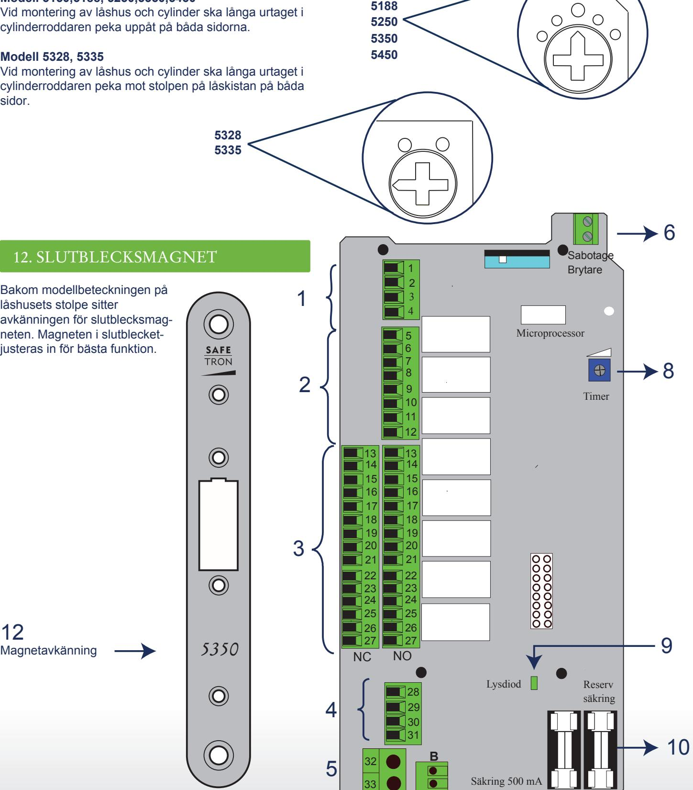

# **TEKNISK DATA**

Drivspänning. Drivström vid aktivering. Drivström viloläge. För / frånreglingstid. Kabel.

10-35 VDC / 8-24 VAC inga krav beträffande polaritet 150mA Max totalt 350mA 50mA Under 0,5 sekunder 12 trådar varav 4st kablar är reserv

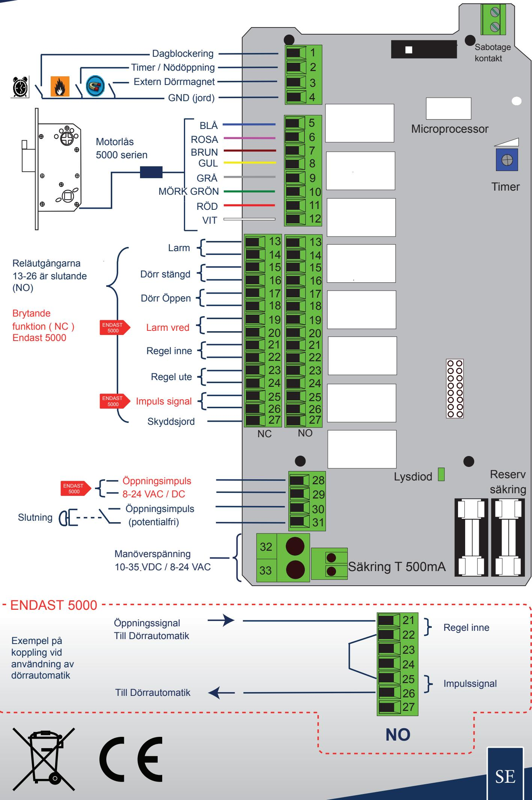

## MÅTTRITNINGAR

#### Montering låskista

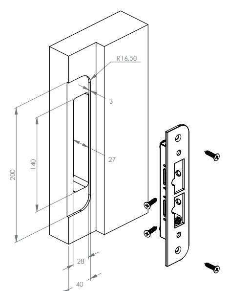

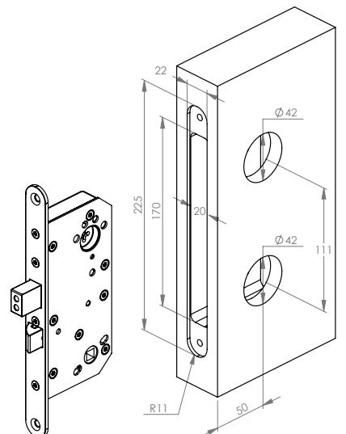

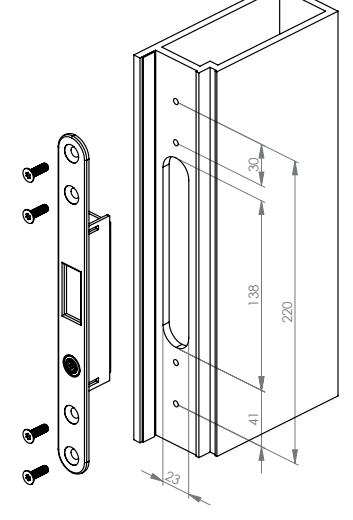

Montering låskista

**5188**

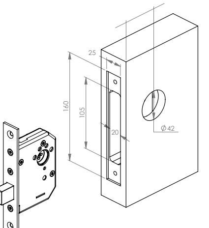

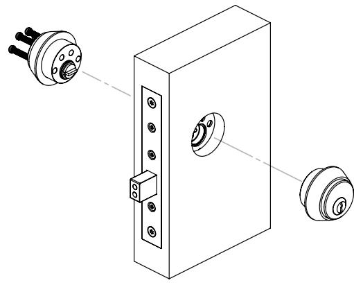

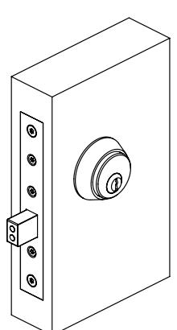

## MONTERING TRYCKE OCH VRED

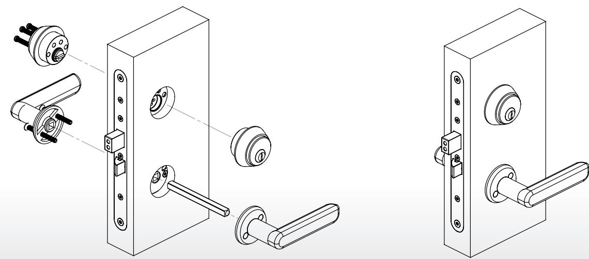

#### MONTERINGSANVISNING FOR SAFETRON MOTORLÅS 5000 / 5500

#### **Advarsel!**

At sikkerhetsegenskaper for et produkt er avgjørende for produktets godkjennelse i.h.t. EN 14846:2 008. Modifikasjoner eller andre typer endringer av installasjon / produkt, som avviker fra beskrivelse i denne dokumentasjon er ikke tillatt.

Safetron tar ikke ansvar for de produkter som avviker fra montasje instruks og vedlikeholds manualer.

#### **Spesifikasjoner:**

Safetron motorlås modell 5000 / 5500 er testet og sertifisert i.h.t. EN 14846:2008 Produktene oppfyller følgende krav i.h.t. EN 14846:2008

#### SPESIFIKASJONER

Safetron motorlås modell 5000 / 5500 er testet og sertifisert i.h.t. EN 14846:2008 Produktene oppfyller følgende krav i.h.t. EN 14846:2008

| Category of use | Durability and load on latch | Door mass and closing force | Suitability for use on fire/ smoke doors | Safety | Corrosion resistance and temperature | Security and drill resistance | Security electrical function | Security electrical manipula tion |
|--------------------|------------------------------------|-----------------------------------------|------------------------------------------------------|--------|-----------------------------------------------|-------------------------------------|------------------------------------|--------------------------------------------|
| 3                  | C                                  | 5                                       | 0                                                    | 0      | L                                             | 5                                   | 1                                  | 3                                          |

Dører Låse Tilbehør

Max vekt: 200 kg Max lukkekraft: 25 N Søren gap: 6mm

Safetron 5150 Safetron 5188 Safetron 5250 Safetron 5328 Safetron 5335 Safetron 5350 Safetron 5450

Skandinavisk oval og runde sylindre Bestått bor plate

## ANBEFALINGER VED INSTALLASJON AV MOTORLOCK

Anbefalinger ved installasjon av motorlock:

- Les og følg installasjonsveiledningen.
- I de tilfeller hvor dobbel sylinder ikke er i bruk bør et såkalt magnetisk knappvrider brukt. Dette er for å sikre sylinderfallrøret posisjon slik at reile ikke kan hindres / blokkeres.
- Motorlock bør i størst grad anvendes elektrisk hvorfor bruk av nøkkel bor minimeres
- Underhold for eksempel justering og smøring skal gjøres av kvalifisert montör.

## KABELDIMENSJONERING

Kabel av type data/tele/signal (entråds) med kvadrat mellom 0,1-0,2 må ikke benyttes til spenningsmating av motorlås. Safetron gir ingen funksjons garanti på installasjoner som avviker fra monterings instruks. Se tabell under.

Krav til minste kabel kvadrat mellom strømforsyning (f.eks. trafo, ikke adgangskontrollsystem) til styreenhet motorlås. (total lengde)

| Kabellengde | 0-10m   | 11-20m  | 21-40m  | 61-80m  | 81-100m |
|-------------|---------|---------|---------|---------|---------|
| 12-24 VDC   | 0,17mm² | 0,34mm² | 0,68mm² | 1,36mm² | 1,7mm²  |

#### **NB!**

Det er viktig at strømforsyningen til motorlåsens styreenhet er rett dimensjonert, for å unngå spenningsfall som kan påvirke motorlåsens drift og funksjoner.

Ved felles strømforsyning i et komplett anlegg, så skal de samme hensyn tas.

## 1. KOBLINGSPLINT 1-4

## **1. Dagblokkering**

Ved potensialfri forbindelse mellom plint 1 og 4 (jord) åpner låsen ved første åpningsimpuls på plint 30 og 31 eller 28 og 29 samt forblir åpen til forbindelsen brytes.

#### **2. Nødåpning / Tidsstyrning**

Ved sluttning mellom plint 2 og 4 (jord) åpner låsen direkte og forblir åpent til slutningen brytes.

#### **3. Dørmagnetkontakt**

Ekstern dørmagnetkontakt, alternativ til sluttstykkemagnet, kobles mellom plint 3 og 4 (jord).

#### **4. Jord (gnd)**

Bare 5000

Bare 5000 Anvendes sammen med plinterne 1-3.

## 2. KOBLINGSPLINT 5-12

Koblingsplinterne 5-12 kobles til låskassen med den medfølgende 11- leder kabel. O.B.S rett farge til respektiv plint nummer. Se koblingsskjema. side 4.

#### 3.KOBLINGSPLINT 13-27

13-14 **Alarm** Sluttende kontakt ved åpen dør i mer enn 2 min eller etter 6 forsøk på å låse. **Manipulation av reile**  aktiveres om ikke reilen når sin indre posisjon i løpet av 3 sek. **Alarm ved kabelbrudd**

15-16 **Dør stengt** Sluttende / kontakt når dørmagnet er påvirket.

17-18 **Dør åpen** / brytende kontakt når dørmagnet ikke er påvirket.

19-20 **Alarm knappvrider / nødutstyr** Sluttende / brytende kontakt vid manuell åpning med knappvrider/nødutstyr

21-22 **Reile inne** Sluttende brytende kontakt når reilen er inne i låskassen.

23-24 **Reile ute** Sluttende / brytende kontakt når reilen er ute. ( dør låst)

25-26 **Impuls signal** Sluttende / brytende kontakt ved åpnings impuls til låsen 30 og 31. Kan benytted till el sluttstykke ved daglåsning.Ved aktivering av dørautomatikk seriekobles med reile inne 22-23

27 **Jord (gnd)** Bør kobles till jording for å eliminere yttre forstyrrelser.

#### 4. KOBLINGSPLINT 28-31

28-29 **Aktivering med spenning** Aktiverer låsen med en spenningsimpuls fra f.eks porttelefon. 8-24 VAC /DC

30-31 **Aktivering** Aktivering av låsen via potensialfri slutning mellom plint 30 og 31f.eks kortleser, kodelås, nøkkelbrytere.

#### 5. KOBLINGSPLINT 32-33

32-33 **Inngang for strømforsyning** 10-35 VDC ikke polaritetsavhengig. 8-24 VAC ikke polaritetsavhengig.

Plint B. Utspenning = like som innspenningen

**Strømforbruk**  150 mAved aktivering

#### 6. SABOTASJEBRYTERE

Anvendes for overvåkning av styreenhet. Mikrobrytere aktiveres når styreenhetens lås demonteres.

## 7. SABOTASJEBESKYTTET KABEL

Alarm ved kabelbrudd plint 13-14

#### 8. VRIDPOTENTIOMETER / OPPETID

For justering av låsens oppetid. Justerbar, t = 1 ca 30 sek

#### 9. ON

Lysdiode som indikerer at styreenhet er i drift.

10. HOVEDSIKRING / RESERVESIKRING

Sikring T 500mA ( treg )

BARE 5000

## 11. SYLINDERFALLE

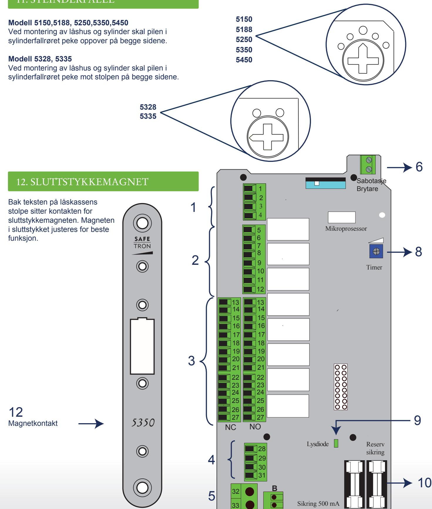

# **TEKNISK DATA**

Drivspenning. Strømforbruk ved aktivering. Hvilestrøm. Åpne / lukketid. Kabel.

10-35 VDC / 8-24 VAC ikke polaritetsavhengig 150mA Max totalt 350mA

NO

50mA Under 0,5 sekunder 12 tråder hvor av 4stk kabler er reserve

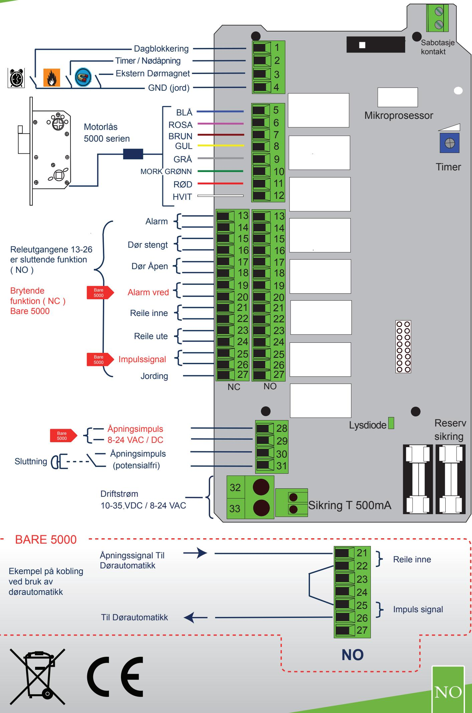

#### DIMENSJONSTEGNINGER

#### Installasjon låshus

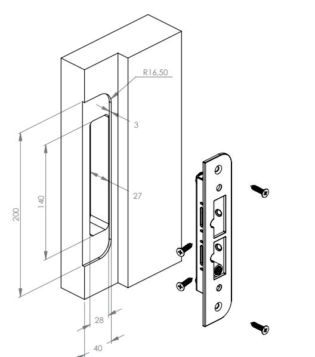

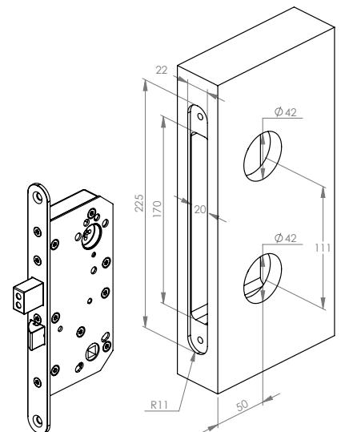

Installasjon låshus

**5188**

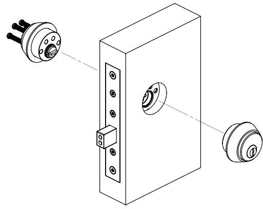

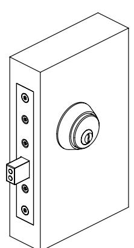

## INSTALLASJON TRYKKE OG KNAPPVRIDER

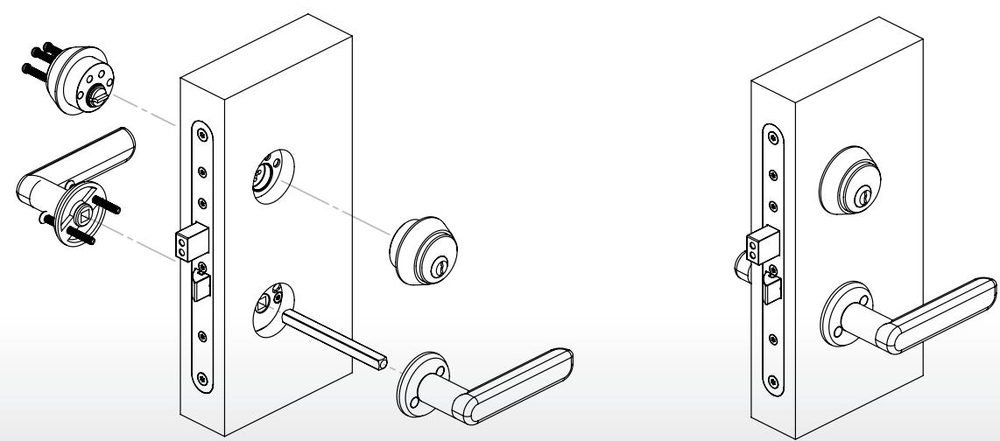

## INSTALLATION INSTRUCTIONS FOR SAFTRON MOTOR LOCK 5000/5500

#### **Caution**

The safety features of the product are essential to its conformity with EN 14846: 2008. Modifications or other changes in the installation / products other than those described in this documentation are not permitted.

Safetron take no responsibility for products that are not installed in accordance with local requirements or when maintenance instructions are not followed.

#### **Specifications**

Safetron motor lock model 5000/5500 are tested and certified in accordance with EN 14846: 2008 The product meets the requirements according to EN 14846: 2008

#### SPECIFICATIONS

Safetron motor lock model 5000/5500 are tested and certified in accordance with EN 14846: 2008 The product meets the requirements according to EN 14846: 2008

| Category of use | Durability and load on latch | Door mass and closing force | Suitability for use on fire/ smoke doors | Safety | Corrosion resistance and temperature | Security and drill resistance | Security electrical function | Security electrical manipula tion |
|--------------------|------------------------------------|-----------------------------------------|------------------------------------------------------|--------|-----------------------------------------------|-------------------------------------|------------------------------------|--------------------------------------------|
| 3                  | C                                  | 5                                       | 0                                                    | 0      | L                                             | 5                                   | 1                                  | 3                                          |

Doors

Max weight: 200 kg Max closing force: 25 N Max door gap: 6mm

Safetron 5150 Safetron 5188 Safetron 5250 Safetron 5328 Safetron 5335 Safetron 5350 Safetron 5450

#### Locks accessories

Scandinavian oval and round cylinder Approved drilling plate

## RECOMMENDATIONS WHEN INSTALLING MOTOR LOCKS

Recommendations when installing motor locks

- Read and follow the installation instructions.
- In cases where double cylinder is not used, a magnetic thumb turn should be used. This is to ensure that the position of the cylinder will not block the deadbolt.
- Motor locks should to the greatest extent be used electrically for best performance. Manual locking/unlocking with a key should therefore be minimized.
- Maintenance e.g. adjustment and lubrication should only be performed by a trained professional.

## CABLE RECOMMENDATIONS

Cable types like data / telecom / signal (single core) with areas between 0.1-0.2 mm may not be used as power supply to the lock.

Warranty is invalid if installation instructions are not followed. See table below.

Recommended minimum cable area between the power supply–control unit-lock cases (total length)

| Cable length | 0-10m   | 11-20m  | 21-40m  | 61-80m  | 81-100m |
|--------------|---------|---------|---------|---------|---------|
| 12-24 VDC    | 0,17mm² | 0,34mm² | 0,68mm² | 1,36mm² | 1,7mm²  |

#### **N.B.**

It is essential that the power supply to the control unit has a correct dimensioned cable, this to avoid a voltage drop that interferes with the function of the lock.

At common supply of several locks / access control / reader / centers and the like, the total power consumption is taken into account when calculating the cable area.

## 1. TERMINAL 1-4

## **1. Dayblocking**

Activating signal between terminal 1 and 4 (gnd) opens the lock when its activated between terminal 30 and 31 or 28 and 29 then the dead bolt remains in its retracted position until disconnection.

## **2. Emergency opening / Timer connection**

Conected to ground ( terminal 2 and 4 )the dead bolt will immiediately go to its retracted / unlocked position and remain there until disconnection.

#### **3. Door magnet switch**

For use with an external door magnet switch. e.g. when using an external magnet placed in the door header. Terminals 3 and 4 (gnd)

## **4. Ground (gnd)**

Use together with terminals 1-3

## 2. TERMINAL 5-12

Terminals 5-12 connect the 11 wire cable to the lock case as per colour marking. **NOTE** correct colour in correct position. See wire diagram page 4

## 3. TERMINAL 13-27

ONLY 5000

ONLY 5000

13-14 **Alarm Switch** closes/opens when door is open for more then 2 min or 8 cycles to lock.

15-16 **Door closed** Switch closes/when door magnet is activated ( door closes )

17-18 **Door open** Switch/opens when door magnet not is deactivated ( door opens )

19-20 **Pre alarm** Switch closes/opens before alarm (terminals 13-14 ) for example when dead bolt is blocked

21-22 **Dead bolt in** Switch closes/opens when bolt is unlocked.

23-24 **Dead bolt out** Switch closes/opens when bolt is locked.

25-26 **Impuls signal** Switch closes/opens when activating terminals 30,31 Can be used to an electrik strikes when dayblocking is needed. To activate dooropener connects together with bolt in 21,22. see example in wiring diagram.

27 **Ground** Connect to ground to eliminate external disturbance.

## 4. TERMINAL 28-31

28-29 **Activating with power** Activates lock with a power impuls as an exampel a card reader with a built in feeding voltage 8-24 VAC /DC

30-31 **Activating** Aktivates lock via potential free connection between terminal 30 and 31 as exampel card reader, key switch, code reader.

#### 5. TERMINAL 32-33

32-33 **Input power supply** 10-35 VDC no polarity requirement 8-24 VAC no polarity requirement.

Terminal **B.** Output voltage = same as power supply

**Powerconsumption when activated**  150mA on activation.

## 6. SABOTAGE SWITCH

Used to monitor the controller. Micro switch is activated when the controll unit lid is removed.

## 7. SABOTAGE PROTECTED CABLE

Prealarm for cable satotage. Terminal 13-14

## 8. POTENTIOMETER / OPENTIME

Used for adjusting opentime , t = 1 - 30 sec.

## 9. ON

LED power indicator

## 10. MAIN FUSE/ SPARE FUSE

Slow fuse 500mA

ONLY 5000

## 11. CYLINDER

#### **Modell 5150,5188, 5250,5350,5450**

Mounting the cylinder on lock case. Arrow shall point upp on both sides.

face plate on both sides.

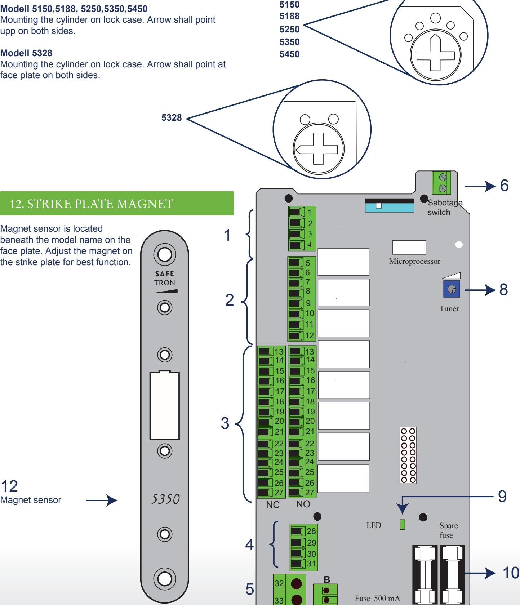

# **TECNICAL DATA**

Power supply. Power consumption when activate. Power consumption standby. Unlocking / locking time. Cable.

10-35 VDC / 8-24 VAC no polarity requirements 150mA Max totaly 350mA

50mA Less then 0,5 sec 12 wires with 4 parts availible

EN

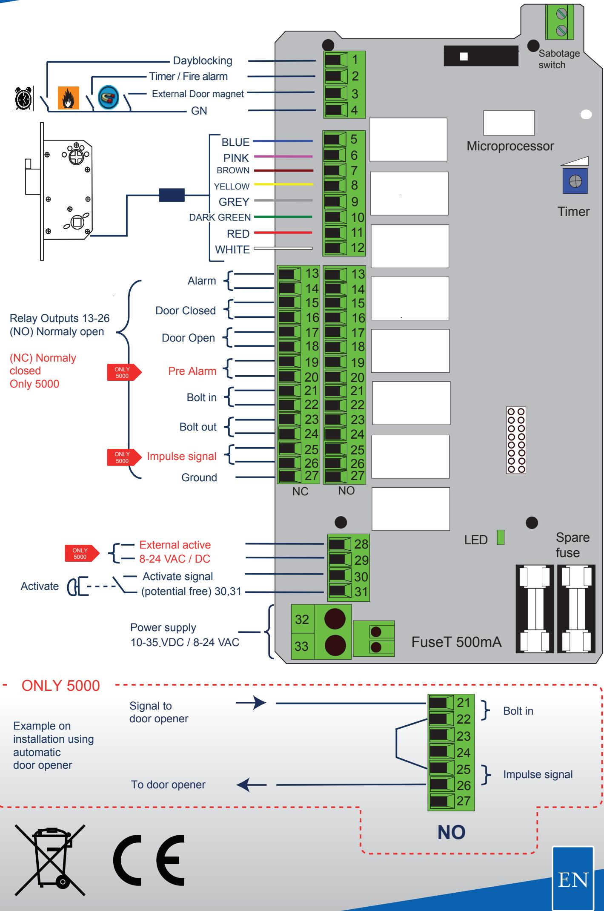

#### DIMENSIONS

#### Lock case Installation

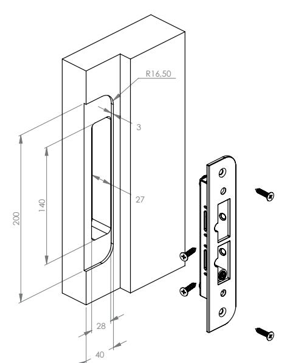

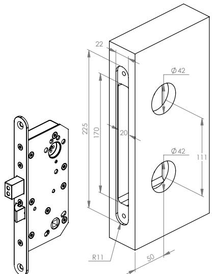

**5328 5335**

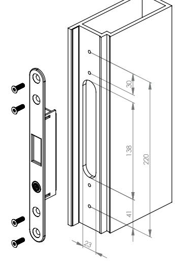

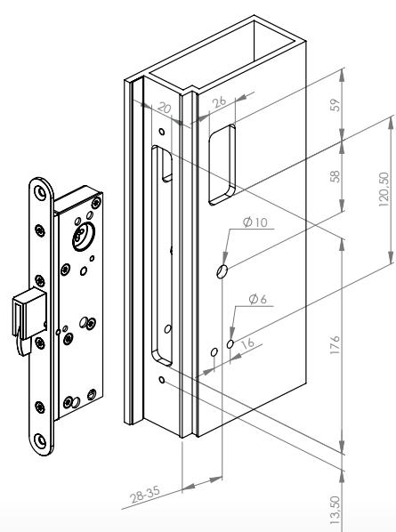

Lock case Installation

**5188**

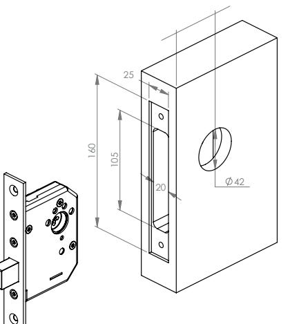

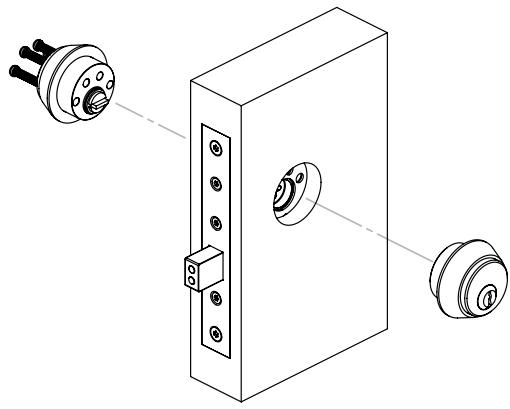

## INSTALLATION OF DOOR HANDLE AND THUMB TURN

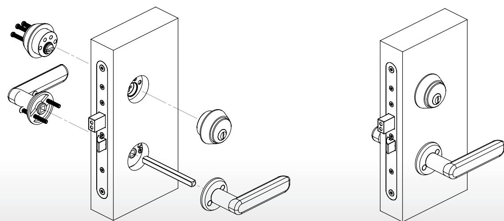

#### **UNDERHÅLL AV SAFETRON MOTORLÅS**

- Underhåll av lås ska utföras av utbildad fackman **•**
- Kontrollera att monterade vred, trycken och cylindrar fungerar tillfredsställande **•**
- Vid behov smörj och/eller justera **•**
- Vid normal användning smörjes låshusets mekaniska delar 1 gång per år. Använd ett smörjmedel som inte innehåller grafit eller lösningsmedel **•**
- Vid högfrekvent användning smörjes låshusets mekaniska delar efter behov. Smörjning av regelkolv behövs ej .Smörjning av regelkolv påverkar funktionen negativt. ( glider på teflonplattor ) **•**
- Låshusets elektriska delar är underhållsfria **•**
- Kontrollera och justera vid behov att dörren stängs korrekt. För att uppnå detta kan t.ex. dörrens gångjärn liksom dörrstängare behöva justeras. En dålig dörrfunktion påverkar låsfunktionen negativt **•**

#### **MAINTENANCE SAFETRON MOTOR LOCK**

- Maintenance should be performed by a trained professional **•**
- Ensure that mounted knobs, handles and cylinders are working satisfactory **•**
- If necessary, lubricate and / or adjust **•**
- Approximately once a year, a small amount of designated grease can be applied on latches and bolt. Highly frequented doors may need maintenance whith shorter intervals **•**
- Lubrication of dead bolt is not needed **•**
- Electric parts need NO maintenance **•**
- Check and adjust the entire door environment **•**

# Safetron AB

Box 2096, Säterivägen 18 65002 Karlstad

Tel: +46(0)54-19 02 45 Mail: info@safetron.com Internet: www.safetron.com