## MANUAL SAFETRON 6000

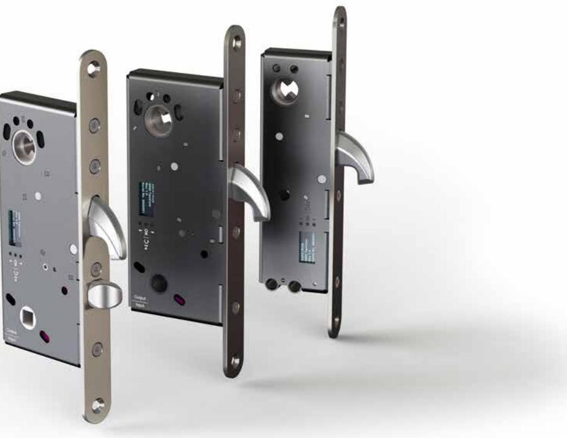

| Viktig information                                             | 3  |
|----------------------------------------------------------------|----|
| Specifikationer                                                | 4  |
| Rekommendationer / Kabelarea / SSF 3522                        | 5  |
| Inkoppling - ett lås                                           | 6  |
| Inkoppling - två lås - synkroniserat läge                      | 7  |
| Inkoppling - två lås - induviduellt läge                       | 8  |
| Inkoppling - två lås - slinga                                  | 9  |
| Menyval display Styrenhet TwoCom LITE                          | 10 |
| Menyval display Låshus 6000                                    | 11 |
| Felkoder                                                       | 12 |
| Inkoppling utan styrenhet - ML läge                            | 13 |
| Montering av låshus, slutbleck, cylinder (6100) | 14 |
| Montering av låshus, slutbleck, cylinder, trycke (6200)        | 15 |
| Montering av låshus, slutbleck, cylinder (6300)                | 16 |
| Urtagsritningar                                                | 17 |
| Vändning av fallkolv (6200)                                    | 18 |
| Underhåll av låshus                                            | 19 |

## VIKTIG INFORMATION | VIKTIG INFORMASJON

Safetron motorlås samt slutbleck är avsett för användning av allmänheten där det finns större incitament att vara försiktiga och där det finns hög risk för missbruk, t.ex. dörrar i offentliga byggnader. Avsett för dörrar upp till 200 kg dörrmassa, 15 N högsta stängningskraft.

• Innan man monterar ett elektriskt motorlås bör man kontrollera att dörren hänger korrekt och att dörrbladet löper fritt. Det är inte rekommenderbart att installera Safetron motorlås i dörrar med ihålig kärna. Kontrollera att dörrens konstruktion medger montage av motorlås, exempelvis genom kontroll av dolda gångjärn, att dörrblad som greppar i varandra kan öppnas samtidigt, att dörrspringan mellan dörrblad är 3 mm +/- 1mm, att rörliga delar inte påverkar varandra.

• Safetron motorlås får monteras i enkeldörrar eller pardörrar av trä, stål eller aluminium.

• O.B.S Motorlås tillverkade enligt SS-EN 14846:2008 ger en hög grad av rimlig säkerhet förutsatt att de monteras på dörrar och karmar i gott skick.

- Beaktande skall vidtas för säkerställande av att eventuella tätningar eller tätningslister inte hämmar motorlåsets funktion.
- Se till att rätt lås och slutbleck monteras för den avsedda dörren (se produktkatalog)
- Montagesättet skiljer sig inte mellan olika typer av dörrar, typ trä/metall.
- Safetron motorlås är inte avsett för att användas på dubbel (svängdörr).
- Fastställda anvisningar måste följas noga under installationen. De här instruktionerna måste överföras av installatören till användaren.
- Kontrollera motorlåsets kolvar så att de i indraget läge inte förhindrar dörrens öppnings- och stängningsfunktion (se skötselanvisning)

• Där motorlås monteras på dubbeldörrar (pardörrar) krävs att dörrstängare används som har dörr koordinator enligt EN 1158 (se standard) för att säkerställa rätt stängnings sekvens.

• Alla komponenter specificerade för installationen skall användas för att uppfylla europastandard SS-EN 14846:2008.

## IMPORTANT NOTICE

• Safetron motor lock and strike plates is intended for use by the general public where there is more incentive to be careful and where there is a high risk of abuse, such as doors in public buildings. Intended for doors up to 200 kg door mass, 15 N maximum closing force.

• Before installing the lock check that the door hangs properly and that the door blade runs freely. It is not advisable to install Safetron motor lock in doors with a hollow core. Check that the door's design allows mounting of the motor lock, for example, through the control of offset hinges, that the door leaf meshing together can be opened simultaneously. The gap between door leaf and frame should be 3 mm +/- 1mm, check that no moving parts affect each other.

• Safetron motor lock may be installed in single or double leaf doors of wood, steel or aluminum.

• NOTE Motor lock manufactured according to EN 14846: 2008 provides a high degree of safety and reasonable security provided that they are mounted on the doors and frames in good condition.

• Care shall be taken to ensure that any seals or weather-stripping fitted to the complete door assembly does not inhibit the correct operations of the electrical operated lock or striking plate.

• Ensure that the lock and strike plate model is suitable for the intended door (see product catalog)

- Installation method does not differ between different types of doors, type, wood / metal.
- Safetron motor lock is not intended for use on double action doors (revolving door).

• Established fixing instructions must be followed carefully during installation. These instructions and any maintenance instructions must be passed on by the installer to the user.

• Check bolt heads and keepers so that in the withdrawn position does not prevent the door opening and closing function (see Maintenance Instructions)

• Where motor lock mounted on double doors (double doors) requires door closers are used as the door coordinator of EN 1158 (see standard) to ensure the correct closing sequence.

• All components are specified for the installation shall be fitted in order to ensure compliance with this European standard SS-EN 14846:2008.

## MONTERINGSANVISNING FÖR SAFTRON MOTORLÅS 6000

## **Varning!**

Säkerhetsegenskaperna för produkt är avgörande för dess överenstämmelse med EN 14846:2 008. Modifikationer eller andra ändringar på installation/produkter utöver de som beskrivs i denna dokumentation är inte tillåtna.

Safetron tar inget ansvar för produkter som inte monterats i enlighet med gällande anvisningar eller då underhållsinstruktioner inte följs.

## SPECIFIKATIONER

Safetron motorlås i 6000 serien är testade och certifierade enligt SS-EN 14846:2008, SS-EN 179:2008 samt SSF 3522, klass 2B, 3, 4, 5

Safetron slutbleck i 6000 serien är testade och certifierade enligt EN 12209 samt SSF 3522, klass 5.

## **Produkten uppfyller följande krav enligt SS-EN 14846:2008**

| 1                  | 2                                       | 3                                    | 4                                               | 5      | 6                                           | 7                                   | 8                                  | 9                                      |
|--------------------|-----------------------------------------|--------------------------------------|-------------------------------------------------|--------|---------------------------------------------|-------------------------------------|------------------------------------|----------------------------------------|
| Category of use | Durability and load on latch bolt | Door mass and closing force | Suitability for use on fire / smoke doors | Safety | Corrosion re sistance and temperature | Security and drill resistance | Security electrical function | Security electrical manipulation |
| 3                  | X                                       | 8                                    | 0                                               | 0      | J                                           | 7                                   | 1                                  | 3                                      |

## **Produkten uppfyller följande krav enligt SS-EN 179:2008**

| 1                  | 2                                       | 3                                    | 4                                               | 5      | 6                                           | 7        | 8                                     | 9                    |
|--------------------|-----------------------------------------|--------------------------------------|-------------------------------------------------|--------|---------------------------------------------|----------|---------------------------------------|----------------------|
| Category of use | Durability and load on latch bolt | Door mass and closing force | Suitability for use on fire / smoke doors | Safety | Corrosion re sistance and temperature | Security | Projection of operating element | Type of operation |
| 3                  | 7                                       | 6                                    | 0                                               | 1      | 3                                           | 5        | 2                                     | A                    |

| Dörrar               | Lås           | Tillbehör                        | Art nr.     |
|----------------------|---------------|----------------------------------|-------------|
| Max vikt: 200 kg     | Safetron 6100 | Slutbleck 6125 (12,5mm plösmått) | 202 144 753 |
| Max stängkraft: 15 N | Safetron 6200 | Slutbleck 6150 (15,0mm plösmått) | 202 144 754 |
| Max dörrglipa: 6mm   | Safetron 6300 | Slutbleck 6190 (19,0mm plösmått) | 202 144 755 |
|                      |               | Slutbleck 6205 (20,5mm plösmått) | 202 144 756 |

Slutbleck 6301 (Smalprofil) 202 144 757 Anslutningskabel C04 10m 202 144 710 Anslutningskabel C04 100m 202 144 752 Adapterkabel C05 202 144 758 Anslutningskabel C02 10m 202 144 628 Nödutrymningsbehör 795 H 202 144 xxx Nödutrymningsbehör 795 V 202 144 xxx Nödutrymningsbehör 796 H 202 144 778 Nödutrymningsbehör 796 V 202 144 779 TwoCom reläkort 202 144 727 TwoCom öppnaknapp 202 144 726 Värmetejp 202 144 735

Skandinavisk oval och rundcylinder ABLOY Protec/Sento cylinder

Förstärkningsbehör ASSA 4559 (6300)

Godkänd borrplåt

## **Slutbleckspecifikationer**

Gäller slutbleck 6125, 6150, 6190, 6205, 6301

| För dörrar upp till 200 kg                             |
|--------------------------------------------------------|
| Max dörrspringa för kopplande funktion: 6mm            |
| Monteras med snedställda skruvar för högsta hållkraft  |
| Använd fästskruvar som är avsett för karmmaterial      |
| Justera slutblecket 1-2 gånger / år för bästa funktion |

4

## REKOMMENDATIONER VID INSTALLATION AV MOTORLÅS

Rekommendationer vid installation av motorlås:

• Läs igenom och följ installationsanvisningarna.

• I de fall inte dubbelcylinder inte används bör ett sk. magnetvred användas, detta för att säkerställa roddarens position så att kolven inte kan bli hindrad/spärrad.

- Motorlås bör i största mån användas elektriskt för bästa funktion. Därför bör användandet av nyckel minimeras.
- Service t.ex justering och smörjning skall ske av behörig installatör.

## REKOMMENDATIONER VID INSTALLATION AV MOTORLÅS

Kabel av typ data/tele/signal (enkelledare) med areor mellan 0,1-0,2 får inte användas som spänningsmatning av låset. Safetron ger ingen funktionsgaranti på installationer som inte följer rekommendationer. Se tabell nedan. Rekommenderad minsta kabelarea mellan spänningskälla (trafo, ej passage system)-styrenhet-låshus (totallängd)

| Kabellängd | 0-10m   | 11-20m  | 21-40m  | 61-80m  | 81-100m |
|------------|---------|---------|---------|---------|---------|
| 12-24 VDC  | 0,17mm2 | 0,34mm2 | 0,68mm2 | 1,36mm2 | 1,7mm2  |

## **O.B.S**

Det är viktigt att strömförsörjningen till styrenheten har rätt dimensionerad kabel för att inte få spänningsfall som stör låsets funktion.

Vid gemensam matning av flera lås/passagesystem/läsare/centraler och dylikt skall den sammanlagda strömförbrukningen tas i beaktande vid beräkning av kabelarea.

## SSF 3522

För att motorlås ur Safetron 6000 serien ska vara godkända enligt SSF 3522 låsklass 3, 4 och 5 skall inställningen SSF 3522 vara aktiverad i styrenhetens display: (Menyval 13. SSF 3522 -> **Enabled**).

För att uppfylla SSF 3522 klass 4 och 5 skall även styrenheten vara installerad i ett skyddat utrymme med minst klass 3 låsning.

Aktivering av SSF 3522 läget i styrenheten innebär följande ändringar på reläutgångarna:

- Låskolv ute aktiv indikering 7 sek
- Låskolv inne(olåst) aktiv indikering 7 sek
- Larm aktiv indikering 30 sek
- Öppettiden på aktivering 10 sek

Separat utgång för akustiskt indikeringsdon som indikerar om den spärrande kolven eller annat spärrande organ förhindras i växlingen mellan fullt utlåst och förreglat läge och fullt upplåst läge eller att förregling inte sker. Denna utgång ska aktiveras senast 2 sekunder efter det att den spärrande kolven eller annat spärrande organ skulle varit i sitt ändläge, och vara aktiverat minimum 30 sekunder, maximum 2 minuter. Denna utgång ska brytas om spärrande kolv eller annat spärrande organnår fullt låst och förreglat läge.

**OBS!** Samtliga komponenter för låsenheten (låshus, slutbleck, dörrförstärkningsbehör) skall minst ha samma klassning för att hela låsenheten skall kunna klassas enligt SSF 3522.

## INKOPPLING ETT LÅS

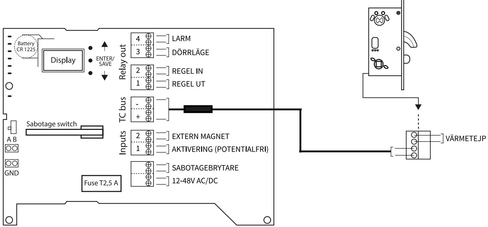

**OBS! Menyvalskonfiguration i display får aldrig göras samtidigt som aktivering eller manövrering av låshus sker.** 

## **ANSLUT LÅSHUS** 1

Anslutningskabel mellan låshus och styrenhet kopplas via plint i bakkant på låshuset via de två nedersta ingångarna. Låshusets plint är självlåsande och skalad ledare ansluts.

## **MANÖVERSPÄNNING**

Manöverspänning kopplas in på plint märkt **12-48V AC/DC** på styrenheten.

## **INITIERING**

2

3

4

5

6

Initiering av låshusen sker automatiskt vid installation.

#### **AKTIVERING**

Aktivering via potentialfri slutning kopplas in på position 1 på plintrad markerad INPUTS.

#### **SABOTAGEBRYTARE**

Övervakning av styrenhet. Aktiveras när lock till styrenhet avlägsnas.

#### **RELÄUTGÅNGAR**

| Larm            | Efter fyra kolvblockeringar aktiveras Larm och släcks när nästa försök att låsa/låsa upp påbörjas. Larm aktiveras även vid öppen dörr längre än 2 minuter. |
|-----------------|---------------------------------------------------------------------------------------------------------------------------------------------------------------|
| Dörr läge       | Styrs av magnet i slutbleck, ställbar NO/NC via display på styrenhet                                                                                          |
| Regel in        | Ställbar NO/NC via display på styrenhet                                                                                                                       |
| Regel ut        | Ställbar NO/NC via display på styrenhet                                                                                                                       |
| Extern magnet   | Ställbar NO/NC i display på styrenhet                                                                                                                         |
| Aktivering      | Potentialfri, ställbar NO/NC i display på styrenhet                                                                                                           |
| Sabotagebrytare | Slutning vid öppning av styrenhetens lock                                                                                                                     |
|                 |                                                                                                                                                               |

## INKOPPLING TVÅ LÅS - SYNKRONISERAT LÄGE

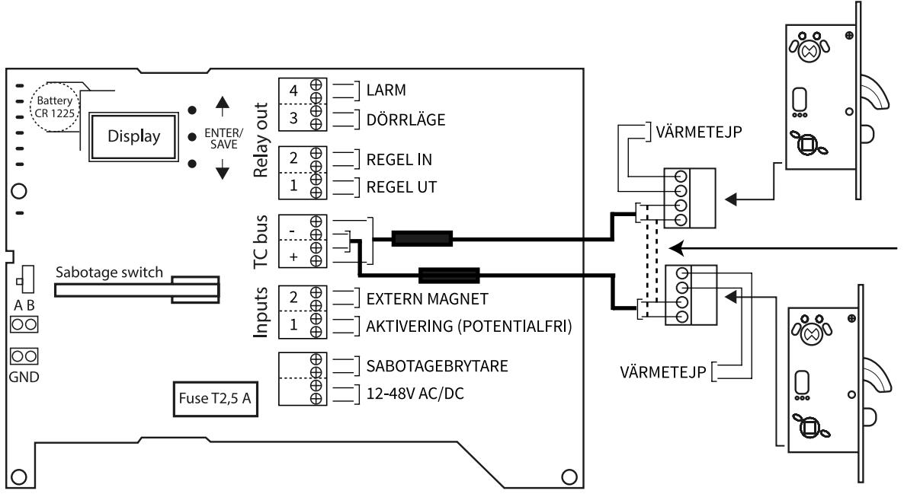

**OBS! Menyvalskonfiguration i display får aldrig göras samtidigt som aktivering eller manövrering av låshus sker.** 

## **ANSLUT LÅSHUS** 1

LÅS 1: Anslutningskabel mellan låshus och styrenhet kopplas via plint i bakkant på låshuset via de två nedersta ingångarna samt + och - i styrenheten på plint märkt TC BUS. Låshusets plint är självlåsande och skalad ledare ansluts.

LÅS 2: Kopplas på samma sätt som LÅS 1 men + och - på TC BUS måste vara samma på bägge låsen. Använd samma färg på ledarna på bägge låshusen för att säkerställa detta.

## **ADRESSERING** 2

Adressera låshusen 1 respektive 2 i låshusets display. Detta görs under Menyval 4: TC Setting. Har bägge låsen samma adress skall detta ändras.

## **MANÖVERSPÄNNING**  3

Manöverspänning kopplas in på plint märkt **12-48V AC/DC** på styrenheten.

## **INITIERING**

4

5

6

7

8

Initiering av låshusen sker automatiskt vid installation.

## **VAL AV LÅSLÄGE**

I styrenhetens display stega fram till Menyval 5: TWO LOCK SET. Välj **Synchronized**, bekräfta ändring med mittenknappen.

## **AKTIVERING**

Aktivering via potentialfri slutning kopplas in på position 1 på plintrad markerad INPUTS.

#### **SABOTAGEBRYTARE**

Övervakning av styrenhet. Aktiveras när lock till styrenhet avlägsnas.

## **RELÄUTGÅNGAR**

| Larm            | Efter fyra kolvblockeringar aktiveras Larm och släcks när nästa försök att låsa/låsa upp påbörjas. |
|-----------------|----------------------------------------------------------------------------------------------------|
|                 | Larm aktiveras även vid öppen dörr längre än 2 minuter.                                            |
| Dörr läge       | Styrs av magnet i slutbleck, ställbar NO/NC via display på styrenhet                               |
| Regel in        | Ställbar NO/NC via display på styrenhet                                                            |
| Regel ut        | Ställbar NO/NC via display på styrenhet                                                            |
| Extern magnet   | Ställbar NO/NC i display på styrenhet                                                              |
| Aktivering      | Potentialfri, ställbar NO/NC i display på styrenhet                                                |
| Sabotagebrytare | Slutning vid öppning av styrenhetens lock                                                          |

## INKOPPLING TVÅ LÅS - INDUVIDUELLT LÄGE

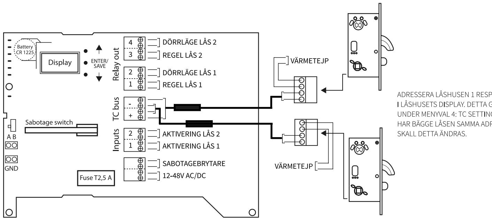

**OBS! Menyvalskonfiguration i display får aldrig göras samtidigt som aktivering eller manövrering av låshus sker.** 

## **ANSLUT LÅSHUS** 1

LÅS 1: Anslutningskabel mellan låshus och styrenhet kopplas via plint i bakkant på låshuset via de två nedersta ingångarna samt + och - i styrenheten på plint märkt TC BUS. Låshusets plint är självlåsande och skalad ledare ansluts.

LÅS 2: Kopplas på samma sätt som LÅS 1 men + och - på TC BUS måste vara samma på bägge låsen. Använd samma färg på ledarna på bägge låshusen för att säkerställa detta.

## **ADRESSERING**

2

5

6

7

8

Adressera låshusen 1 respektive 2 i låshusets display. Detta görs under Menyval 4: TC Setting. Har bägge låsen samma adress skall detta ändras.

## **MANÖVERSPÄNNING**  3

Manöverspänning kopplas in på plint märkt **12-48V AC/DC** på styrenheten.

## **INITIERING** 4

Initiering av låshusen sker automatiskt vid installation.

#### **VAL AV LÅSLÄGE**

I styrenhetens display stega fram till Menyval 5: TWO LOCK SET. Välj **Induvidual**, bekräfta ändring med mittenknappen.

#### **AKTIVERING**

Aktivering via potentialfri slutning för LÅS 1: kopplas in på position 1 på plintrad markerad INPUTS. Aktivering via potentialfri slutning för LÅS 2: kopplas in på position 2 på plintrad markerad INPUTS.

## **SABOTAGEBRYTARE**

Övervakning av styrenhet. Aktiveras när lock till styrenhet avlägsnas.

## **RELÄUTGÅNGAR**

| Dörr läge       |  | (Lås 2) Styrs av magnet i slutbleck, ställbar NO/NC via display på styrenhet |
|-----------------|--|------------------------------------------------------------------------------|
| Regel in/ut     |  | (Lås 2) Ställbar NO/NC via display på styrenhet                              |
| Dörr läge       |  | (Lås 1) Styrs av magnet i slutbleck, ställbar NO/NC via display på styrenhet |
| Regel in/ut     |  | (Lås 1) Ställbar NO/NC via display på styrenhet                              |
| Aktivering      |  | (Lås 2) Potentialfri, ställbar NO/NC i display på styrenhet                  |
| Aktivering      |  | (Lås 1) Potentialfri, ställbar NO/NC i display på styrenhet                  |
| Sabotagebrytare |  | Slutning vid öppning av styrenhetens lock                                    |

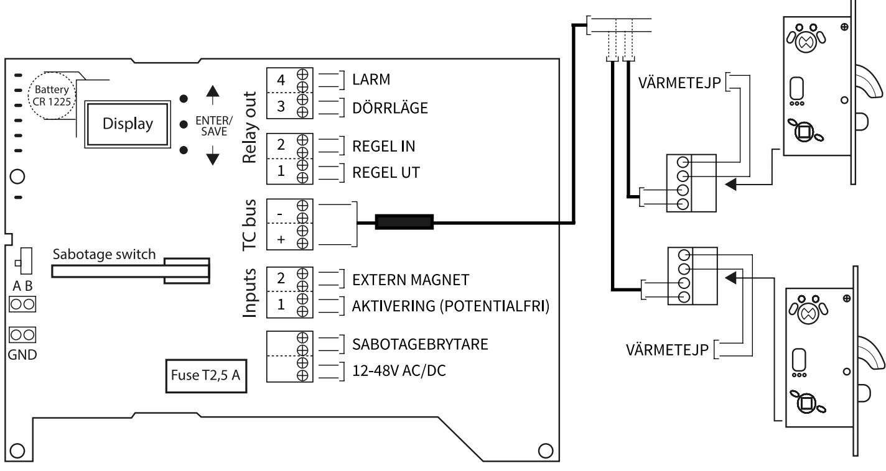

## **INKOPPLING TVÅ LÅS PÅ SLINGA**

Två lås kan seriekopplas via kopplingsdosa eller liknande för att använda samma gemensamma anslutningskabel till styrenheten. Används egen anslutningskabel skall kabelarea beräknas enligt tabell på sida 5.

Denna inkopplingsmetod möjliggör en mindre kabelåtgång.

## MENYVAL DISPLAY STYRENHET TC LITE

Använd knappar Upp och Ned för att navigera och OK knappen för att gå vidare och bekräfta ändringar. Gå ur ändringsläge och ångra ändringar genom att hålla in OK knappen i 2 sekunder.

| STATUS Locked DEV1:          | Current status of the main lock devices. TC Lite supports two lock devices.                                     |  |  |  |
|------------------------------------|-----------------------------------------------------------------------------------------------------------------|--|--|--|
| Door: Closed                    | DEV1 = first lock (example shows locked and door closed).                                                       |  |  |  |
| DEV2:  Unlocked Door: Open   | DEV2 = second lock (example shows unlocked and door open).                                                      |  |  |  |
|                                    |                                                                                                                 |  |  |  |
| 1.DATE/TIME                        | Display current date/time as long as on board battery is in good condition.                                     |  |  |  |
| 16-01-14                           | Set date/time by pressing Ok once and use Up/Down to change value.                                              |  |  |  |
|                                    |                                                                                                                 |  |  |  |
| 12:45:28                           |                                                                                                                 |  |  |  |
| 2.OPEN TIME                        | Open time for activation input in seconds.                                                                      |  |  |  |
| Seconds: 7                         | If activation input is set for longer than the specified open time it will keep that state until it's released. |  |  |  |
|                                    | Interval is 1s to 30s, in steps of 1s.                                                                          |  |  |  |
|                                    |                                                                                                                 |  |  |  |
| 3.RELAY SET 1 Bolt out: N.O     | Relay outputs can be changed from Normally Open(N.O) to Normally Closed (N.C).                                  |  |  |  |
| 2 Bolt in:  N.O                    | If Two Lock mode relay 2 will be 1* lock "Door", and for 2ª lock relay 3 will be "Bolt out" and relay 4 will be |  |  |  |
| 3 Door: N.O 4 Larm: N.O   | "Door".                                                                                                         |  |  |  |
| 4.INPUT SET                        |                                                                                                                 |  |  |  |
|                                    | Activation input (Activ) can be changed from Normally Open (N.O) to Normally Closed (N.C).                      |  |  |  |
| 1. Activ:  N.O 2. Extmag: N.O   | Extern magnet (Extmag) can also be changed from Normally Open (N.O) to Normally Closed (N.C).                   |  |  |  |
|                                    | If Two Lock Set (TLS) with individual control mode, Extmag will be activation input for the 200 lock.           |  |  |  |
| 5.TWO LOCK SET                     | Two locks can be connected and controlled by TC Lite in either synchronous or individual mode.                  |  |  |  |
|                                    | Synchronous mean they will operate as single lock and relay outputs will be depending on status of both.        |  |  |  |
| Synchronous                        | In individual mode 2ªª lock will use relay 3 = "Bolt out", relay 4 = "Door" and Ext.mag as activation input.    |  |  |  |
|                                    |                                                                                                                 |  |  |  |
| 6.TC-BUS INFO                      | Shows the number of connected devices, voltage (VDC) and power (W).                                             |  |  |  |
| Devices: 2 22V VDC:          | Stby is the stand by power usage. Peak is the highest power reading during active operation.                    |  |  |  |
| Stby: 0.8W                         |                                                                                                                 |  |  |  |
| Peak: 9.6W                         |                                                                                                                 |  |  |  |
| 7.DEV LIST 1/3 Lock 605487   | Lists all connected devices by type and serial number.                                                          |  |  |  |
| Lock 603324                     | Max connected devices on standard TC Lite controller is six.                                                    |  |  |  |
| Button 604952 Button 605492     | Press Ok button to switch between pages 1 to 3. (""Enter edit mode to change settings for each device."")       |  |  |  |
| 8.PCB ENVIRON                      |                                                                                                                 |  |  |  |
|                                    | Shows the current environment variables inside the device.                                                      |  |  |  |
| VDC: 24V RH: 16%                | Operating voltage as DC, relative humidity in percent and temperature in Celsius.                               |  |  |  |
| C : 27°                         |                                                                                                                 |  |  |  |
| 9.PCB INFO                         | Information such as device serial number (5/N), firmware (F/W) and installation date (I/D) is listed here.      |  |  |  |
| S/N: 6023578                       |                                                                                                                 |  |  |  |
| E/W: 1.00                       |                                                                                                                 |  |  |  |
| I/D: 160114                        |                                                                                                                 |  |  |  |
| 10.DEV RESET                       | Reset to default settings and clear list of valid devices can be performed if necessary. Detailed instructions  |  |  |  |
| No                                 | can be found in section "Device reset".                                                                         |  |  |  |
|                                    | Press Ok and Up/Down to select Yes/No and press Ok again to confirm selection.                                  |  |  |  |
| 11.ERRORS 0                        | In case there are errors of major importance they will be listed here. The four latest will be shown and if     |  |  |  |
|                                    | more occur the oldest one are removed. Clear entire list by pressing Ok button for 2s.                          |  |  |  |
|                                    |                                                                                                                 |  |  |  |
|                                    |                                                                                                                 |  |  |  |
| 12.ERRORS 1                        | Similar to "Errors 0" but for errors with minor importance.                                                     |  |  |  |
|                                    |                                                                                                                 |  |  |  |
|                                    |                                                                                                                 |  |  |  |
|                                    |                                                                                                                 |  |  |  |
| 13.SSF-3522                        | If enabled the relay outputs and activation input will be altered in order to conform with the SSF 3522         |  |  |  |
| Enabled: No                        | specifications. For more information please refer to documents of SSF 3522 standard (document 1093).            |  |  |  |
|                                    | Disabled by default.                                                                                            |  |  |  |
| 14. DEBUG MODE                     | Debug mode can be accessed by pressing Ok button for 2s. This will give access to additional menus              |  |  |  |
|                                    | containing more in depth data such as uptime, min-max operating voltage and log levels.                         |  |  |  |
| Press OK for 2s to enter debuq. | Disable debug mode by pressing Ok-button for 2s or restart the device.                                          |  |  |  |
|                                    |                                                                                                                 |  |  |  |

## MENYVAL DISPLAY LÅSHUS 6000

Använd knappar Upp och Ned för att navigera och OK knappen för att gå vidare och bekräfta ändringar. Gå ur ändringsläge och ångra ändringar genom att hålla in OK knappen i 2 sekunder.

| STATUS                      | Current status of the device.                                                                               |  |  |
|-----------------------------|-------------------------------------------------------------------------------------------------------------|--|--|
| Bolt: Out                   |                                                                                                             |  |  |
| Door: Closed                |                                                                                                             |  |  |
| Errors: No                  |                                                                                                             |  |  |
|                             |                                                                                                             |  |  |
| 1.DATE/TIME                 | When connected to a controller this menu will show current date and time.                                   |  |  |
| 16-01-14                    | In ML mode this function is disabled and will display as blank.                                             |  |  |
|                             |                                                                                                             |  |  |
| 12:45:28                    |                                                                                                             |  |  |
| 2.OPEN TIME                 | In TC mode this time will only apply to manual unlock.                                                      |  |  |
|                             | In ML mode this applies to both unlock by activation input and manual unlock.                               |  |  |
| Seconds: 7                  | Interval is 1s to 30s, in steps of 1s.                                                                      |  |  |
|                             |                                                                                                             |  |  |
| 3.LOCK MODE                 | Option to switch between TwoCom (TC) and ML (ML) mode.                                                      |  |  |
|                             | TC mode requires a controller and all signals are encrypted.                                                |  |  |
| TC                          |                                                                                                             |  |  |
|                             | ML mode is standalone device and control signals are analog.                                                |  |  |
| 4. TC SETTINGS              | TC settings for this device type only allows for selecting device address.                                  |  |  |
|                             |                                                                                                             |  |  |
| Address: 1                  | Caution: devices with same address will be excluded/ignored by controller.                                  |  |  |
|                             |                                                                                                             |  |  |
|                             |                                                                                                             |  |  |
| 5.ML SETTINGS               | In ML mode the relay output for Bolt can be changed to indicate "in" or "out".                              |  |  |
| 1 Bolt: Out                 | Door relay output can be changed from Normally Open (N.O) to Normally Closed (N.C).                         |  |  |
| 2 Door: N.O                 | Activation input can also be changed from Normally Open (N.O) to Normally Closed (N.C).                     |  |  |
| Activ: N.O                  |                                                                                                             |  |  |
| 6.LOCK DELAY                | Time between door got closed until the device starts locking procedure.                                     |  |  |
|                             | Interval between 0.5s to 5.0s, in steps of 0.5s.                                                            |  |  |
| Seconds: 1.5                | This option affects both TC and ML mode.                                                                    |  |  |
|                             |                                                                                                             |  |  |
| 7.AUX OUTPUT                | Off-mode output is disabled.                                                                                |  |  |
|                             | Heater-mode regulates the output depending on temperature and relative humidity.                            |  |  |
| Heater                      |                                                                                                             |  |  |
|                             | On-mode forces output to always be enabled.                                                                 |  |  |
| 8.PCB ENVIRON               | Shows the current environment variables inside the device.                                                  |  |  |
|                             | Operating voltage as DC, relative humidity in percent and temperature in Celsius.                           |  |  |
| VDC: 24V                    |                                                                                                             |  |  |
| 168 RH: 27° C :    |                                                                                                             |  |  |
| 9.PCB INFO                  | Information such as device serial number (S/N), firmware (F/W) and installation date (I/D) is listed here.  |  |  |
|                             |                                                                                                             |  |  |
| S/N: 6023578                |                                                                                                             |  |  |
| F/W: 1.00                |                                                                                                             |  |  |
| I/D: 160114 10.DEV RESET |                                                                                                             |  |  |
|                             | Reset to default settings and releasing device from controller can be performed if necessary. Detailed      |  |  |
| No                          | instructions  can be found in section "Device reset".                                                       |  |  |
|                             | Press Ok and Up/Down to select Yes/No and press Ok again to confirm selection.                              |  |  |
|                             |                                                                                                             |  |  |
| 11.ERRORS 0                 | In case there are errors of major importance they will be listed here. The four latest will be shown and if |  |  |
|                             | more occur the oldest one are removed. Clear entire list by pressing Ok button for 2s.                      |  |  |
|                             |                                                                                                             |  |  |
|                             |                                                                                                             |  |  |
|                             |                                                                                                             |  |  |
| 12 ERRORS 1                 | Similar to "Errors 0" but for errors with minor importance.                                                 |  |  |
|                             |                                                                                                             |  |  |
|                             |                                                                                                             |  |  |
|                             |                                                                                                             |  |  |
| 13.DEBUG MODE               | Debug mode can be accessed by pressing Ok button for 2s. This will give access to additional menus          |  |  |
| Press OK for 2s             | containing more in depth data such as uptime, bolt speeds, motor currents, min-max operating voltage.       |  |  |
| to enter debug.             | Disable debug mode by pressing Ok-button for 2s or restart the device.                                      |  |  |

## FELKODER I STYRENHET TWOCOM LITE

**Meny 11: Error 0** visar högprioriterade felkoder som kräver omedelbar åtgärd. **Meny 12: Error 1** visar lågprioriterade felkoder som över tid kräver åtgärd men som inte utgör någon omedelbar risk.

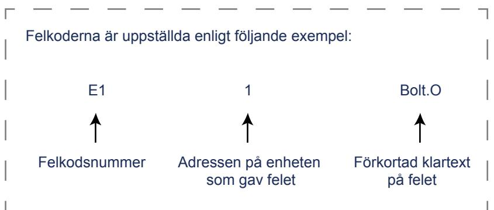

#### **Felkoder i Meny 11: Error 0**

| E1 | 1 | Bolt.O | = | Kolv blockerad, kan inte låsa ut.      |
|----|---|--------|---|----------------------------------------|
| E2 | 1 | Bolt.I | = | Kolv blockerad, kan inte låsa in.      |
| E3 | 1 | Motor  | = | Motor fallerad.                        |
| E4 | 1 | Lo VDC | = | För låg inspänning (triggas vid 9,5V). |
| E5 | 1 | Hi VDC | = | För hög inspänning (triggas vid 50V).  |

#### **Felkoder i Meny 12: Error 1**

| E6 | 1 | Lo Humi | = | Låg luftfuktighet.                        |
|----|---|---------|---|-------------------------------------------|
| E7 | 1 | Hi Humi | = | Hög luftfuktighet.                        |
| E8 | 1 | Lo Temp | = | Låg temperatur på PCB (triggas vid -30°C) |
| E9 | 1 | Hi Temp | = | Hög temperatur på PCB (triggas vid +70°C) |

## **ANSLUT LÅSHUS** 1

Anslut motorlåset enligt nedanstående diagram. Adapterkabel C05 krävs (art nr. 202 144 758) samt Anslutningskabel C02 10m (art nr. 202 144 628).

Strömmatning 12-48V AC/DC ansluts på låshusets plint via de två nedersta ingångarna. Använd röd och grön ledare i adapterkabeln.

3

#### **VAL AV LÅSLÄGE**

Aktivera ML läge i låshusets display. Navigera till Meny 3. LOCK MODE. Välj ML Mode. Bekräfta valet med mittenknappen

#### 8. RUBRIK **RELÄ UTGÅNGAR**

Ställbart NC/NO i låshusets display under Meny 5. ML SETTINGS

| Lila / Vit   | Dörr stängd (NO/NC)                      |
|--------------|------------------------------------------|
| Grå / Orange | Regel ute eller Regel inne               |
| Svart / Gul  | Aktivering potentialfri slutning (NO/NC) |
| Röd          | +/- 12-48V AC/DC                         |
| Grön         | +/- 12-48V AC/DC                         |

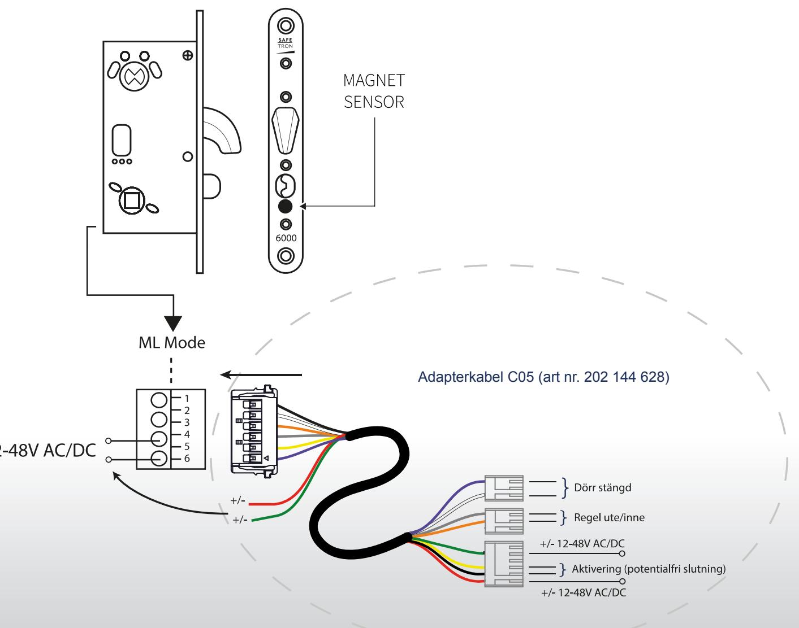

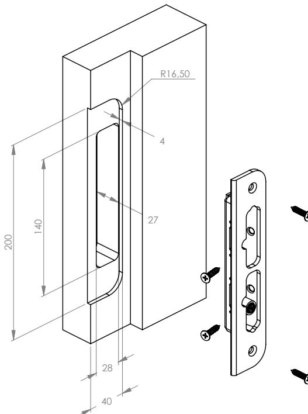

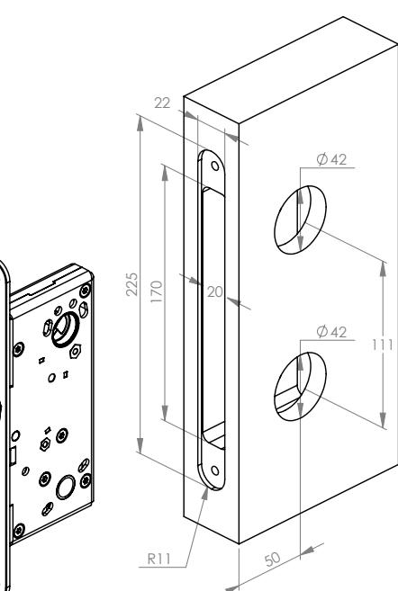

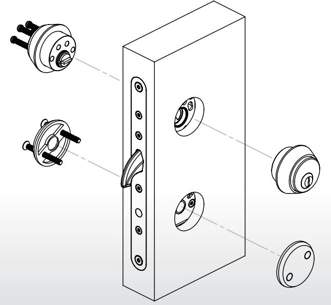

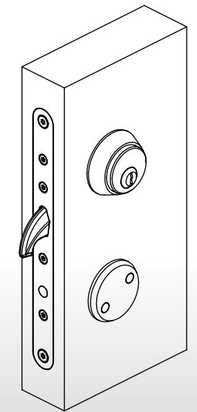

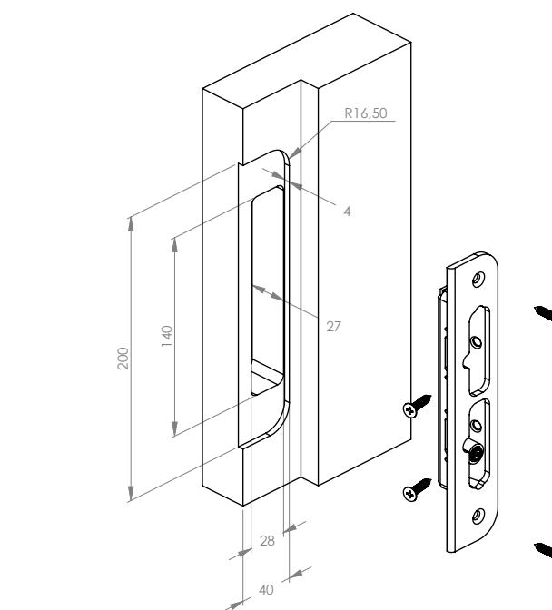

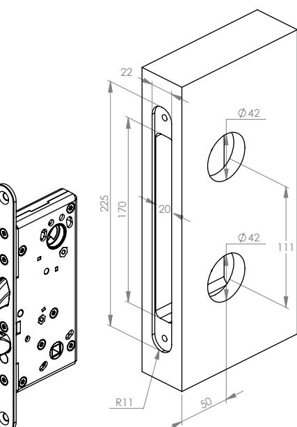

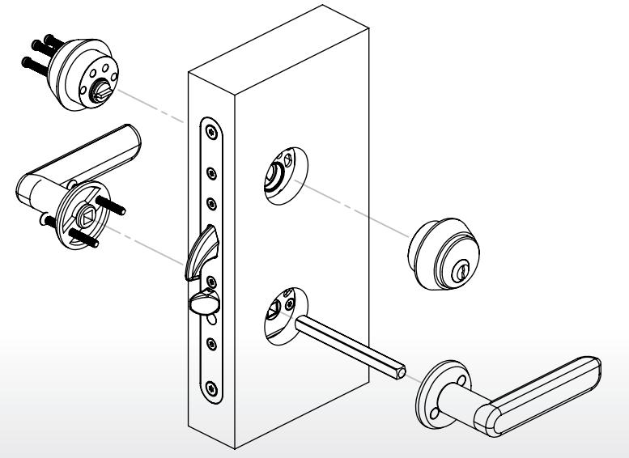

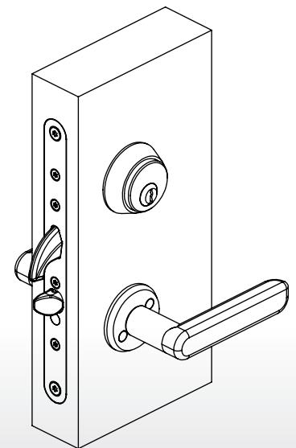

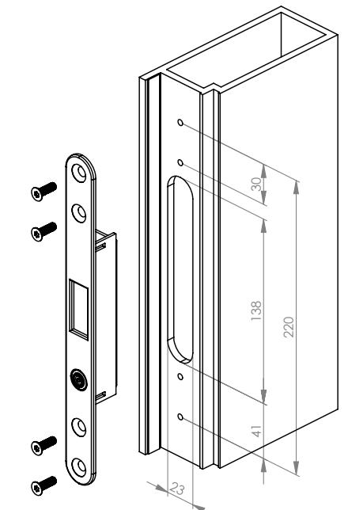

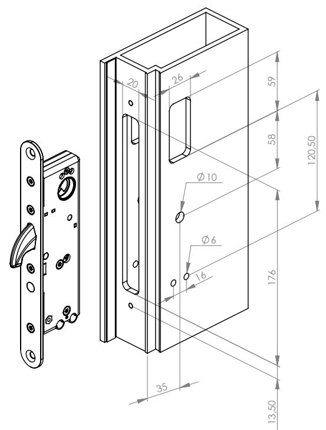

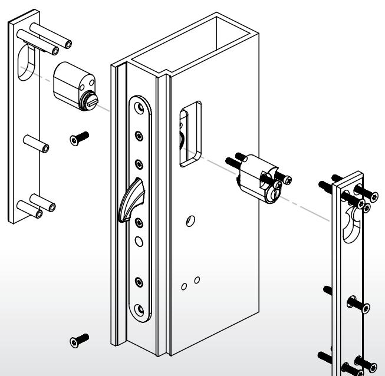

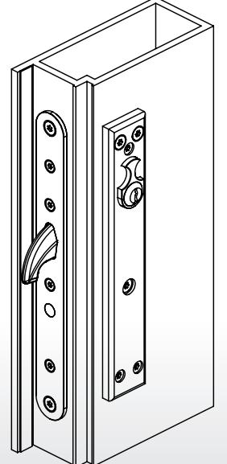

#### **SAFETRON 6100 & 6200**

8. RUBRIK

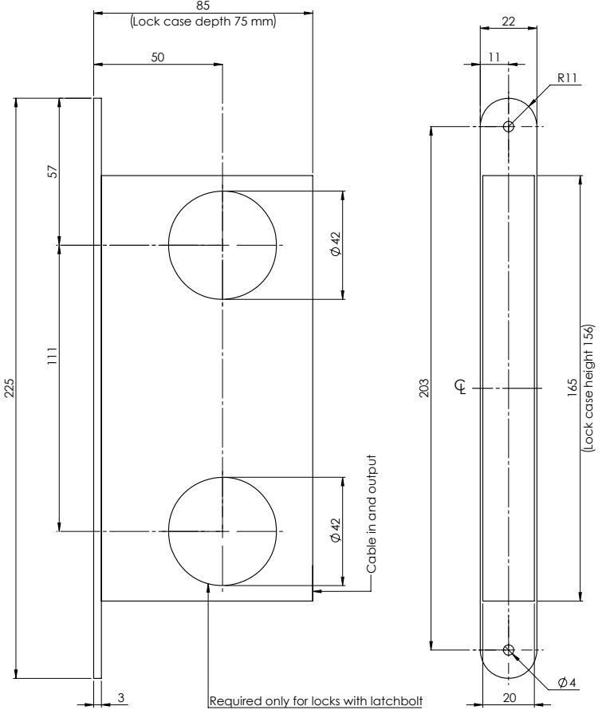

**SAFETRON 6300**

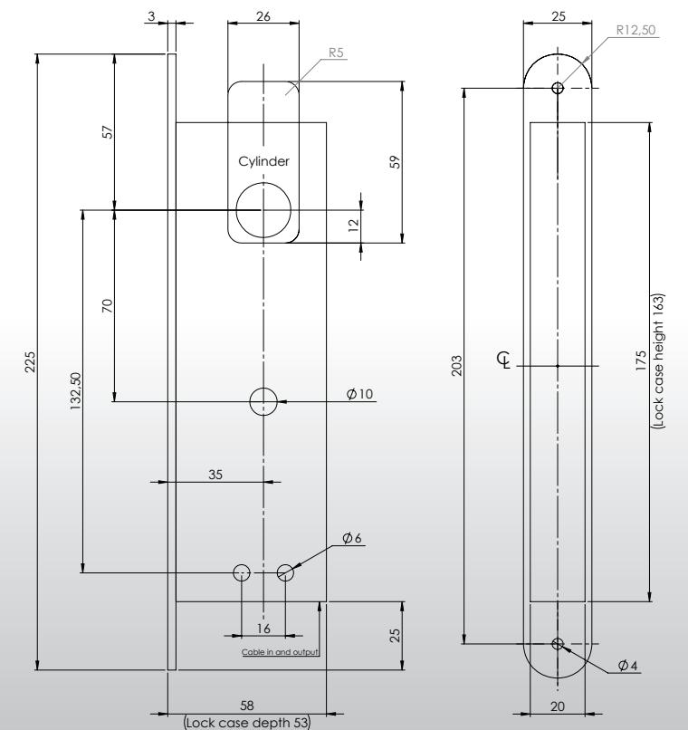

17

VÄNDNING AV FALLKOLV

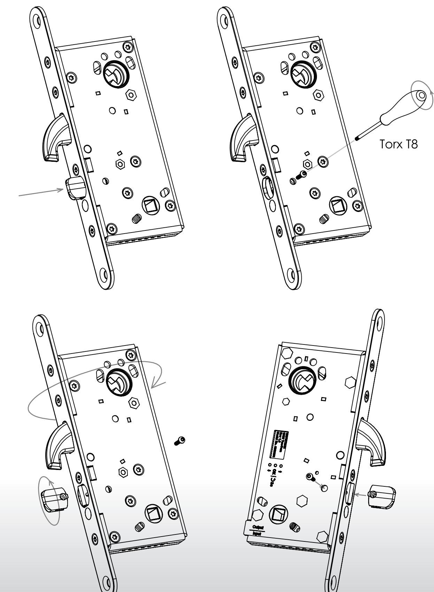

#### **UNDERHÅLL AV SAFETRON MOTORLÅS**

- Underhåll av lås ska utföras av utbildad fackman
- Kontrollera att monterade vred, trycken och cylindrar fungerar tillfredsställande
- Vid behov smörj och/eller justera
- Vid normal användning smörjes låshusets mekaniska delar 1 gång per år. Använd ett smörjmedel som inte innehåller grafit eller lösningsmedel
- Vid högfrekvent användning smörjes låshusets mekaniska delar efter behov.
- Låshusets elektriska delar är underhållsfria
- Kontrollera och justera vid behov att dörren stängs korrekt. För att uppnå detta kan t.ex. dörrens gångjärn liksom dörrstängare behöva justeras. En dålig dörrfunktion påverkar låsfunktionen negativt

#### **MAINTENANCE SAFETRON MOTOR LOCK**

- Maintenance should be performed by a trained professional
- Ensure that mounted knobs, handles and cylinders are working satisfactory
- Lubricate and make adjustments as necessary
- In normal use lubricate the lock housing mechanical parts once a year. Use a lubricant that does not contain graphite or solvents
- At high frequency use, lubricate mechanical parts as needed
- Lock housing electrical components are maintenance free
- Check that the door closes properly. If necessary adjust door hinges and/or door closers. A bad door function adversely affects locking

# Safetron AB

Box 2096, Säterivägen 18 65341 Karlstad

Tel:+46(0)54-190245 Mail:info@safetron.com Internet:www.safetron.com