# MANUAL NÖDUTRYMNINGSBEHÖR 791, 792, 795, 796

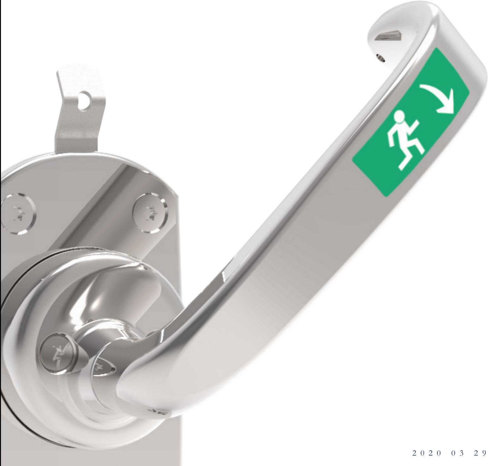

| Viktig information                                       | 3   |
|----------------------------------------------------------|-----|
| Underhåll av nödutrymningsbehör                          | 3   |
| Monteringsanvisning för 791/792 ihop med SL 530 / SL 531 | 4-5 |
| Monteringsanvisning för 795 ihop med Motorlås 6100       | 6-7 |
| Monteringsanvisning för 796 ihop med Motorlås 6200       | 8-9 |
| Inkoppling återinrymning                                 | 10  |
| Urtagsritning låshus                                     | 11  |

## VIKTIG INFORMATION | VIKTIG INFORMASJON | IMPORTANT NOTICE

Nödutrymningsbeslag 791/792/795/796 är avsett för användning på nödutrymningsdörrar.

#### **Varning!**

Säkerhetsegenskaperna för produkt är avgörande för dess överensstämmelse med SS-EN 179:2008. Modifikationer eller andra ändringar på installation/produkter utöver de som beskrivs i denna dokumentation är inte tillåtna.

Safetron tar inget ansvar för produkter som inte har monterats i enlighet med gällande anvisningar eller då underhållsinstruktioner inte följts.

#### **Specifikationer**

Nödutrymningsbeslag 791/792/795/796 är testad och typgodkänd i enlighet med SS-EN 179:2008.

| Dörrar                      | Nödbeslag | Lås                          |
|-----------------------------|-----------|------------------------------|
| Max dörrbladsbredd: 1320 mm | 791/792   | Safetron SL 530              |
| Max dörrbladshöjd: 2520 mm  | 791/792   | Safetron SL 531              |
| Max vikt: 200kg             | 795       | Safetron 6100, Safetron 6500 |
|                             | 796       | Safetron 6200, Safetron 6600 |

| Väsentlig egenskap                 | Klass | Angiven prestanda              |
|------------------------------------|-------|--------------------------------|
| Beständighet                       | 7     | 200 000 cykler                 |
| Dörrvikt                           | 6     | Upp till 200 kg                |
| Lämplighet för användning på brand | 0     | NPD                            |
| och brandgastäta dörrar            |       |                                |
| Korrosionsmotstånd                 | 3     | 96 timmar                      |
| Säkerhet                           | 5     | 5000 N                         |
| Beslagets utsprång från dörrbladet | 2     | ≥ 100 mm                       |
| Typ av beslag                      | A     | Nödutrymningsbeslag med trycke |
| Användningsområde                  | B     | Utåtgående enkeldörrar         |

# UNDERHÅLL

#### **Underhållsintervall: Minst två gånger per år.**

- Underhåll av beslag ska utföras av utbildad fackman.
- Kontrollera att alla skruvar är väl fastdragna samt att monterade vred, trycken och cylindrar fungerar tillfredsställande.
- Öppna behöret genom att trycka på öppningshandtaget.
- Kontrollera att låshusets fallkolv greppar väl in i slutblecket när dörren stänger.
- Kontrollera att öppningshandtaget återfjädrar till utgångsläget.
- Vid behov smörj och / eller justera.
- Vid normal användning smörjes slutbleckets och låsets glidytor samt behörets delar. Använd smörjmedel med god vidhäftning.
- Vid högfrekvent användning smörjes behöret efter behov.
- Kontrollera och justera vid behov att dörren stängs korrekt. För att uppnå detta kan t.ex. dörrens gångjärn liksom dörrstängare behöva justeras. En dålig dörrfunktion påverkar låsfunktionen negativt.

# MONTERINGSANVISNING FÖR 791/792 (SL 530 / SL 531)

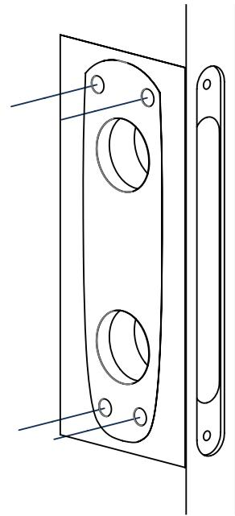

Borra fyra hål med Ø 10 mm borr för behörets genomgående skruvar enligt medföljande borrmall

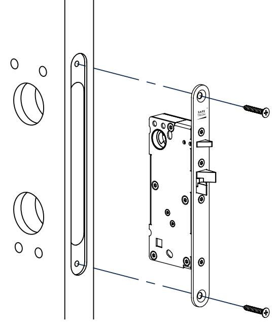

#### **2.**

Montera låshuset, exempel på bild, Safetron SL 530

För att säkerställa eventuell förreglingsfunktion skall dörrspringan vara max 3 mm

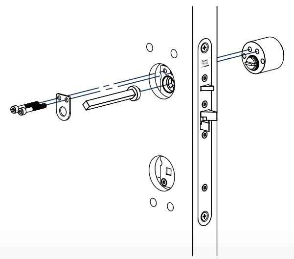

#### **3.**

Montera låscylinder tillsammans med behörets tryckespinne och tillhörande fästplåt.

Tryckespinnens längd kan behöva kortas beroende på dörrbladets tjocklek.

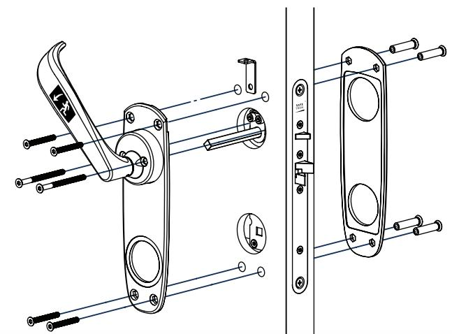

#### **4.**

Montera behöret med totalt 6 st M5 skruvar, fyra till de genomgående hålen. De två längre skruvas i låscylindern.

Tillse att tryckespinnen ligger i rätt vinkel när behöret monteras.

Nipplarna skall monteras på dörrens utsida.

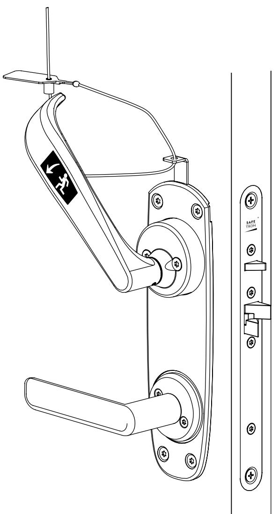

### **5.**

Funktionsprova trycket och låscylinder, de får ej påverkas utav varandra.

Trycket skall kunna återfjädra med lätthet Låscylindern kommer endast kunna rotera åt ett håll.

Montera plomberingstråden.

#### **Behör**

- Valfritt trycke för skandinaviskt modullås kan användas.
- Rund eller oval cylinder av valfri skandinavisk modell.

**OBS!** På Safetron SL 530 (exempel på bild) har det nedre trycket ingen funktion. Trycket kan ersättas med dörrknopp, eller så kan Safetron nödutrymningsbehör 792 utan nedre montagehål användas.

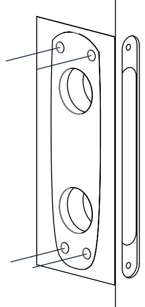

**1.**  Borra fyra hål med Ø 10 mm borr för behörets genomgående skruvar enligt medföljande borrmall

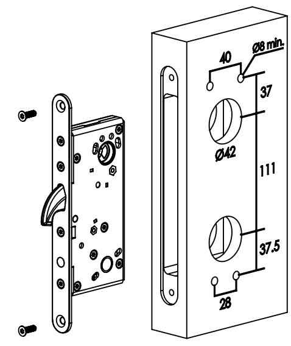

**2.**  Montera låshuset, Safetron 6100

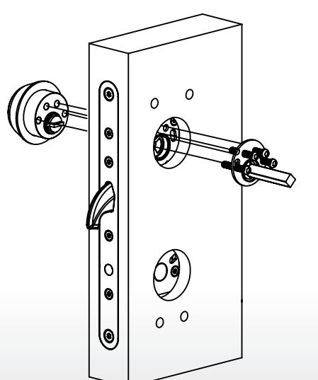

#### **3.**

Montera låscylinder tillsammans med behörets tryckespinne och tillhörande fästplåt med de medföljande förstärkta m5x40 skruvarna. Tryckespinnens längd kan behöva kortas beroende på dörrbladets tjocklek. Tryckespinnens rekommenderade utstick är 10-15mm från dörrbladet.

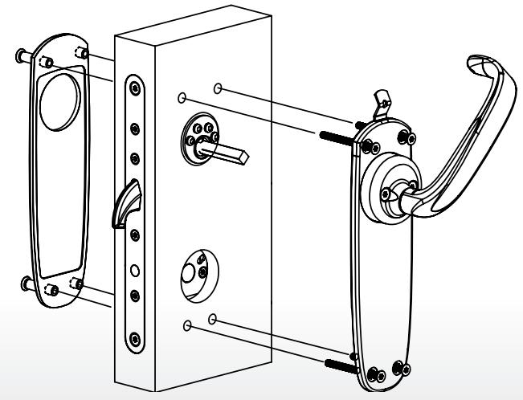

#### **4.**

Montera behöret med totalt 4 st M5 skruvar samt tillhörande nipplar på utsidan. Tillse att nödbehörets tryckespinne ligger i rätt vinkel när behöret monteras.

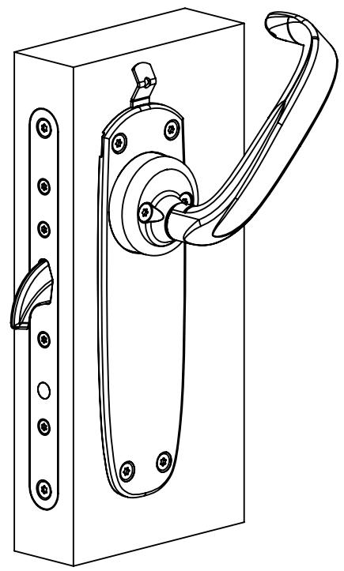

Funktionsprova trycket och låscylinder, de får ej påverkas utav varandra. Trycket skall kunna återfjädra med lätthet. Låscylindern kommer endast kunna rotera åt ett håll.

Montera plomberingstråden.

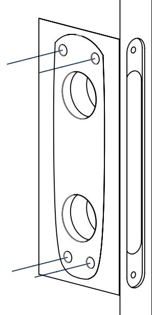

Borra fyra hål med Ø 10 mm borr för behörets genomgående skruvar enligt medföljande borrmall

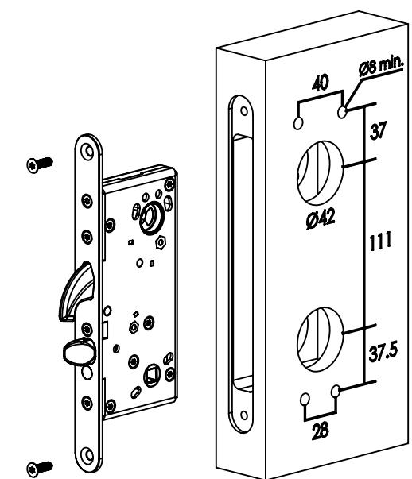

**2.**  Montera låshuset, Safetron 6200

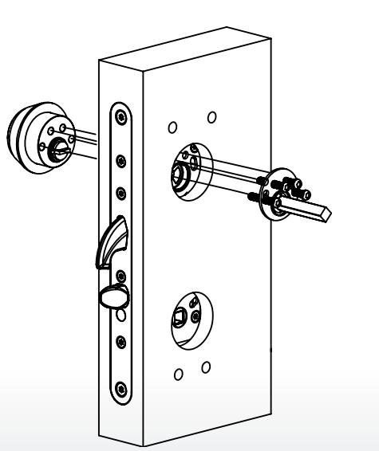

#### **3.**

Montera låscylinder tillsammans med behörets tryckespinne och tillhörande fästplåt med de medföljande förstärkta m5x40 skruvarna. Tryckespinnens längd kan behöva kortas beroende på dörrbladets tjocklek. Tryckespinnens rekommenderade utstick är 10-15mm från dörrbladet.

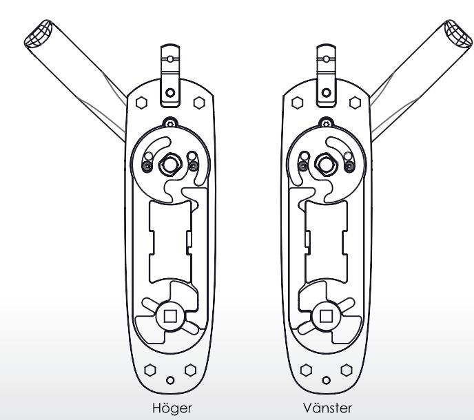

#### **4.**

Sammankopplingen mellan nödhandtag samt trycke sker i behöret. Skulle det bakre locket hamna ur läge visar illustrationen ovan hur detaljerna skall sitta för höger resp. vänster.

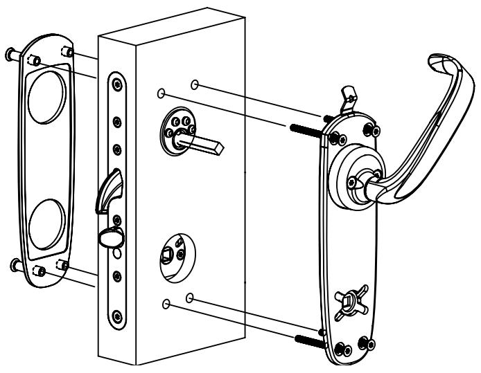

Montera behöret med totalt 4 st M5 skruvar samt tillhörande nipplar på utsidan. Tillse att nödbehörets tryckespinne ligger i rätt vinkel när behöret monteras.

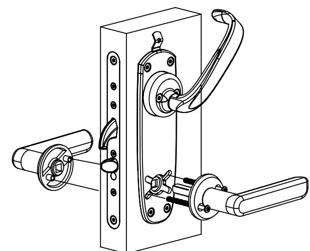

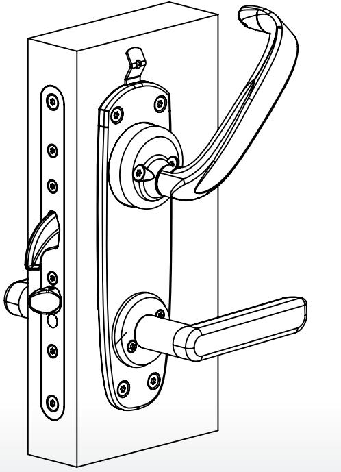

#### **7.**

Funktionsprova nödbehöret och låscylinder, de får ej påverkas utav varandra. Nödbehöret skall kunna återfjädra med lätthet.

Låscylindern kommer endast kunna rotera åt ett håll.

Montera plomberingstråden.

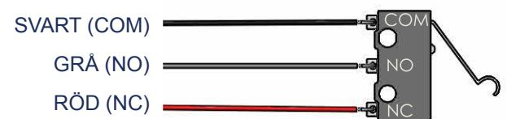

#### **8.**

Mikrobrytaren som finns inbyggd i nödutrymningsbehören 795 och 796 ansluts enligt skissen ovan.

Mikrobrytaren kan användas för att signalera larm och/eller för aktivering av återinrymningsfunktionen - se nästa kapitel för inkoppling av återinrymning.

# INKOPPLING ÅTERINRYMNING (6000-SERIEN)

Regel

Regel

Återinrymningsfunktionen i SAFETRON 6000-serien aktiveras elektroniskt i motorlåsets styrenhet TC CU2. Genom att ansluta nödutrymningsbehörets inbyggda mikrobrytare till styrenheten förblir motorlåset upplåst i händelse av nödutrymning och därmed kan återinrymning tillgodoses.

Regel

Dörr

Dörr

1. För att aktivera återinrymningsfunktionen skall kortslutningsbygeln märkt **'EMERGENCY'** flyttas till den högra positionen enligt ritning till höger. ute inne öppen stängd Impuls Larm Regel ute inne öppen stängd Impuls Larm AUX

2. Anslut nödbehörets mikrobrytare (NC) **röd och svart** till styrenheten på plint 41-42. Vid aktiverat nödutrymningsbehör kommer låset förbli upplåst tills dess att återställning sker.

3. Återställning sker genom potentialfri slutning på plint 43-44 OK

Styrenhet TC CU2

Dörr

Dörr

relä 1

AUX relä 2

> Anslutning **Lås 2**

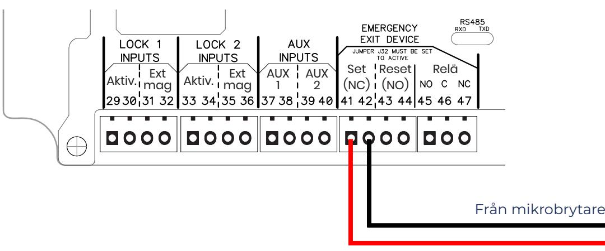

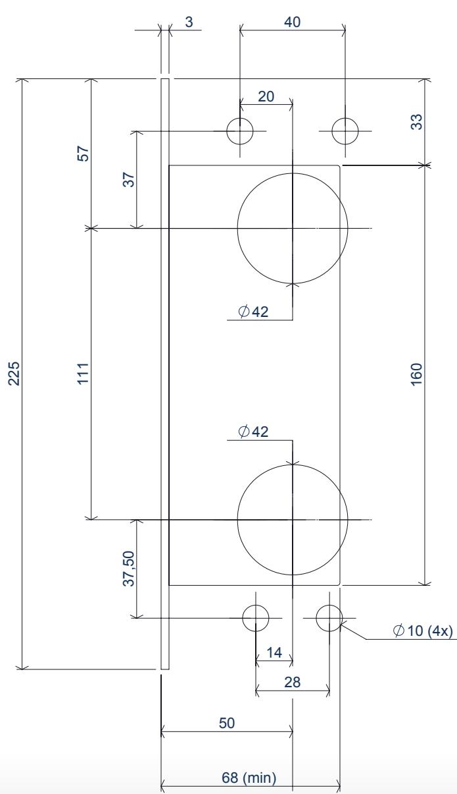

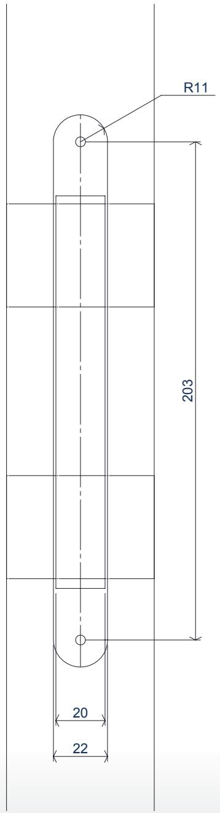

# KVALITET OCH INNOVATION FRÅN SVERIGE

Säterivägen 18 P.O. Box 2096 65002 Karlstad Sweden

Tel: +46 54 19 02 45 Email: info@safetron.com

www.safetron.com

NI HITTAR ALLTID DET SENASTE PÅ SAFETRON.COM

Rätt till ändringar av katalogens innehåll och sortiment förbehålls. Vi reserverar oss för eventuella tryckfel.SAFETRON™ är ett registrerat varumärke.