# MANUAL NÖDUTRYMNINGSBEHÖR 793, 794

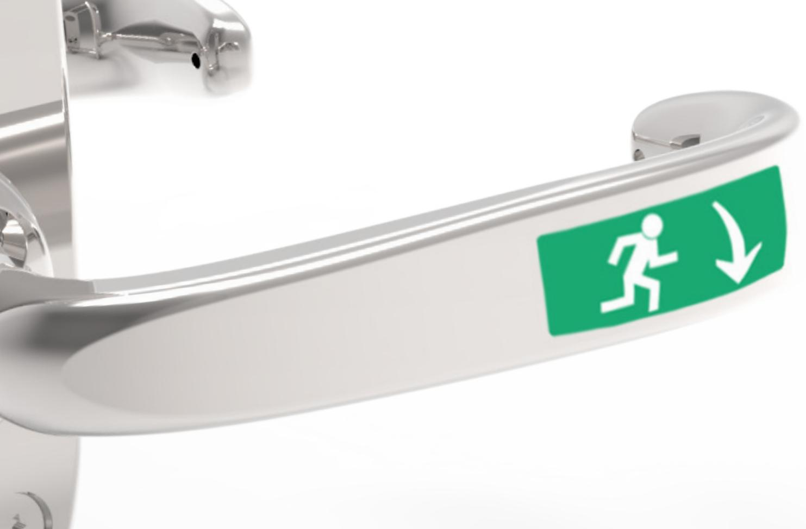

### **INNEHÅLLSFÖRTECKNING**

| Viktig information              | 2-3 |
|---------------------------------|-----|
| Underhåll av nödutrymningsbehör | 4   |
| Monteringsanvisning för 793     | 4-6 |
| Monteringsanvisning för 794     | 6-8 |
|                                 |     |

### **VIKTIG INFORMATION**

Nödutrymningsbeslag 793/794 är avsett för användning på nödutrymningsdörrar.

#### **Varning!**

Säkerhetsegenskaperna för produkt är avgörande för dess överensstämmelse med SS-EN 179:2008. Modifikationer eller andra ändringar på installation/produkter utöver de som beskrivs i denna dokumentation är inte tillåtna.

SAFETRON tar inget ansvar för produkter som inte har monterats i enlighet med gällande anvisningar eller då underhållsinstruktioner inte följts.

### **Specifikationer**

Nödutrymningsbeslag 793/794 är testad och typgodkänd i enlighet med SS-EN 179:2008.

| Dörrar                                                                       | Nödbeslag          | Lås                                    |
|------------------------------------------------------------------------------|--------------------|----------------------------------------|
| Max dörrbladsbredd: 1320 mm Max dörrbladshöjd: 2520 mm Max vikt: 200kg | 793/794 793/794 | SAFETRON SL620/SL621 SAFETRON SL630 |

| Väsentlig egenskap                                           | Klass | Angiven prestanda              |
|--------------------------------------------------------------|-------|--------------------------------|
| Beständighet                                                 | 7     | 200 000 cykler                 |
| Dörrvikt                                                     | 7     | Över 200 kg                    |
| Lämplighet för användning i brand och brandgastäta dörrar | B     | NPD                            |
| Korrosionsmotstånd                                           | 3     | 96 timmar                      |
| Säkerhet                                                     | 5     | 5000 N                         |
| Beslagets utsprång från dörrbladet                           | 2     | ≥ 100 mm                       |
| Typ av beslag                                                | A     | Nödutrymningsbeslag med trycke |

### **VIKTIG INFORMATION**

SAFETRON Nödutrymningsbehör 793-794 samt lås SL620-621 är avsett för användning av allmänheten där det finns större incitament att vara försiktiga och där det finns hög risk för missbruk, t.ex. dörrar i offentliga byggnader. Avsett för dörrar upp till 200 kg dörrmassa, 25 N högsta stängningskraft.

- Innan man monterar ett Nödutrymningsbehör på bör man kontrollera att dörren hänger korrekt och att dörrbladet löper fritt.
- Det är inte rekommenderbart att installera Nödutrymningsbehör i dörrar med ihålig kärna. Kontrollera att dörrens konstruktion medger montage av Nödutrymningsbehör, exempelvis genom kontroll av dolda gångjärn, att dörrblad som greppar i varandra kan öppnas samtidigt, att dörrspringan mellan dörrblad är 3 mm +/- 1mm, att rörliga delar inte påverkar varandra.
- O.B.S Nödutrymningsbehör tillverkade enligt SS-EN 179:2008 ger en hög grad av rimlig säkerhet förutsatt att de monteras på dörrar och karmar i gott skick.
- Innan montering av Nödutrymningsbehöri en brand/rök dörr behöver dörrens eventuella brandcertifikat kontrolleras för säkerställande av att det inte finns villkor i certifikatet som utesluter eller begränsar användning av aktuella behör.
- Beaktande skall vidtas för säkerställande av att eventuella tätningar eller tätningslister inte hämmar Nödutrymningsbehörets funktion.
- Se till att rätt lås, Nödutrymningsbehör och slutbleck monteras för den avsedda dörren (se produktkatalog)
- Montagesättet skiljer sig inte mellan olika typer av dörrar, typ trä/metall
- Safetron Nödutrymningsbehör är inte avsett för att användas på dubbel (svängdörr).
- Fastställda anvisningar måste följas noga under installationen. De här instruktionerna måste överföras av installatören till användaren.
- Kontrollera låsets kolvar så att de i indraget läge inte förhindrar dörrens öppnings- och stängningsfunktion (se skötselanvisning)
- Där Nödutrymningsbehöret monteras på dubbeldörrar (pardörrar) krävs att dörrstängare används som har dörr koordinator enligt EN 1158 (se standard) för att säkerställa rätt stängnings sekvens. Den här rekommendationen är särskilt viktig när det gäller brand/rök dörrars sammansättning.
- Alla komponenter specificerade för installationen skall användas för att uppfylla europastandard SS-EN 179:2008
- Brandklassning med hänvisning till testrapport med nummer: PHO10096A,B,C Testet utfördes med en enkeldörr i stål.
- Vid användning i brandcellsgränser måste Eltryckeslås SL620 användas i kombination med en certifierad dörr.
- På överfalsade pardörrar där båda dörrbladen är utrustade med nödbeslag måste funktion kontrolleras så att varje dörrblad kan öppna fritt oberoende av det andra dörrbladet.
- Nödbeslag med standard utstick (kategori 2) skall användas i dörrar med begränsad utrymningsbredd eller där dörrar inte kan öppnas mer än 90°.
- När ett nödutrymningsbehör skall användas på en glasdörr är det väsentligt att glaset är laminerat eller härdat.
- Nödbeslaget skall normalt monteras på dörrbladet på en höjd mellan 900 mm och 1100 mm från golvet. I miljöer där majoriteten av användarna är barn skall särskild hänsyn tas och man skall överväga att sänka höjdplaceringen av nödbeslaget.
- Vid installation av nödbeslag på dörrar vars dörrblad har en ojämn yta skall särskild hänsyn tas för att minimera risken att fingrar eller kläder fastnar vid nödsituation.
- Ingen utrustning med igenhållande funktion får installeras bortsett från dem som finns beskrivna i denna europeiska standard. Detta hindrar dock inte installation av dörrstängare.
- Om en dörrstängare används skall hänsyn tas att denna inte hindrar öppningen för äldre, barn och handikappade.
- Säkerställ att klisterlapp som beskriver öppningsförfarande finns på antingen nödutrymningsbeslag eller dörrblad. Är dörren av inåtgående typ skall detta tydligt visas genom bild eller text på dörrblad eller nödutrymningsbeslag.

### **UNDERHÅLL**

#### **Underhållsintervall: Minst två gånger per år.**

- Underhåll av beslag ska utföras av utbildad fackman.
- Kontrollera att alla skruvar är väl fastdragna samt att monterade vred, trycken och cylindrar fungerar tillfredsställande.
- Öppna behöret genom att trycka på öppningshandtaget.
- Kontrollera att låshusets fallkolv greppar väl in i slutblecket när dörren stänger.
- Kontrollera att öppningshandtaget återfjädrar till utgångsläget.
- Vid behov smörj och / eller justera.
- Vid normal användning smörjes slutbleckets och låsets glidytor samt behörets delar. Använd smörjmedel med god vidhäftning.
- Vid högfrekvent användning smörjes behöret efter behov.
- Kontrollera och justera vid behov att dörren stängs korrekt. För att uppnå detta kan t.ex. dörrens gångjärn liksom dörrstängare behöva justeras. En dålig dörrfunktion påverkar låsfunktionen negativt.

### **MONTERINGSANVISNING 793**

#### **1. Borra**

Borra fyra hål med Ø 10 mm borr för nödutrymningsbehörets genomgående skruvar enligt medföljande borrmall.

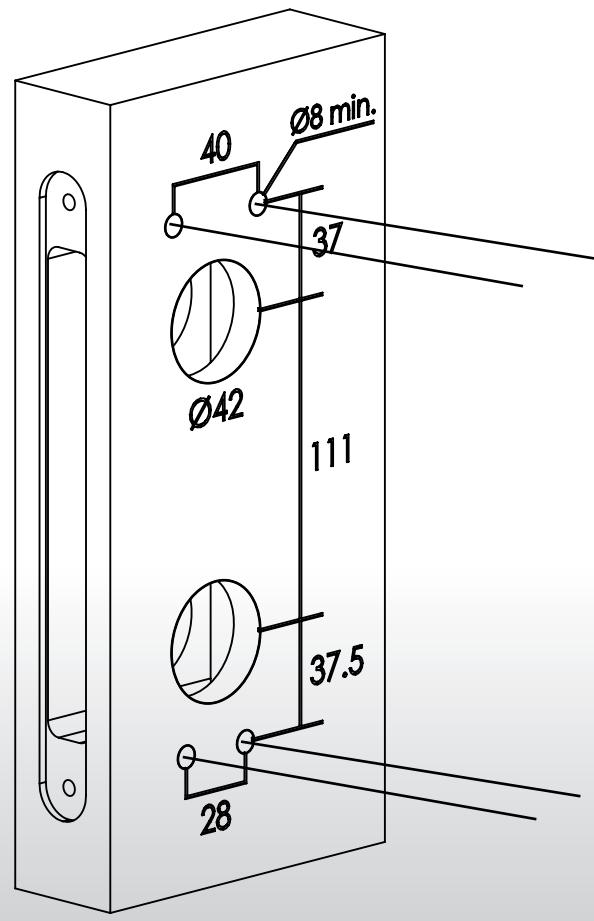

#### **2. Montera låshus**

Montera låshuset i dörrbladet, se exempel till höger, SAFETRON SL620

För att säkerställa förreglingsfunktion skall dörrspringan vara max 3 mm.

**Observera** att låshuset skall ställas i split funktion. Kontrollera att rätt sida för split funktionen är inställd på låshusets funktionsväljare

(se monteringsanvisning för aktuellt låshus)

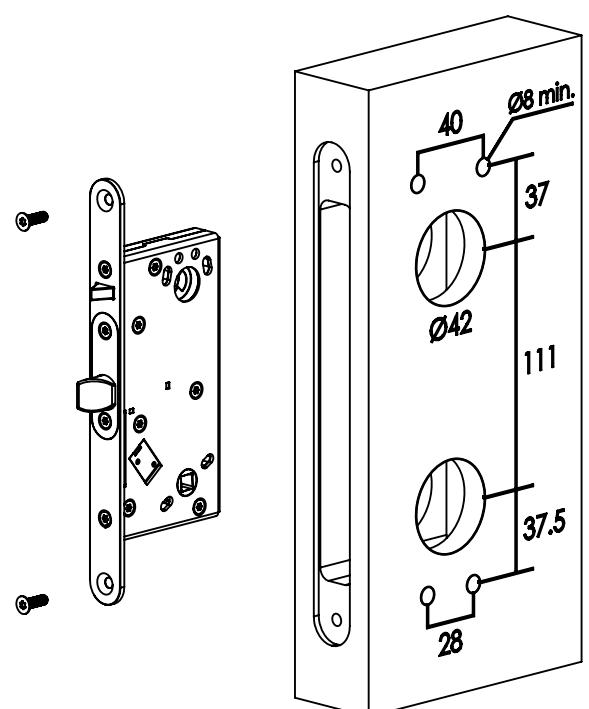

#### **3. Montera nödutrymningsbehör**

- Montera cylindrar och/eller eventuellt vred
- Montera nödbeslagets plåtar med medföljande M5 skruvar.
- Montera tryckespinnar
- Montera nödbeslagets trycken med medföljande skruvar
- Montera cylinderbehör

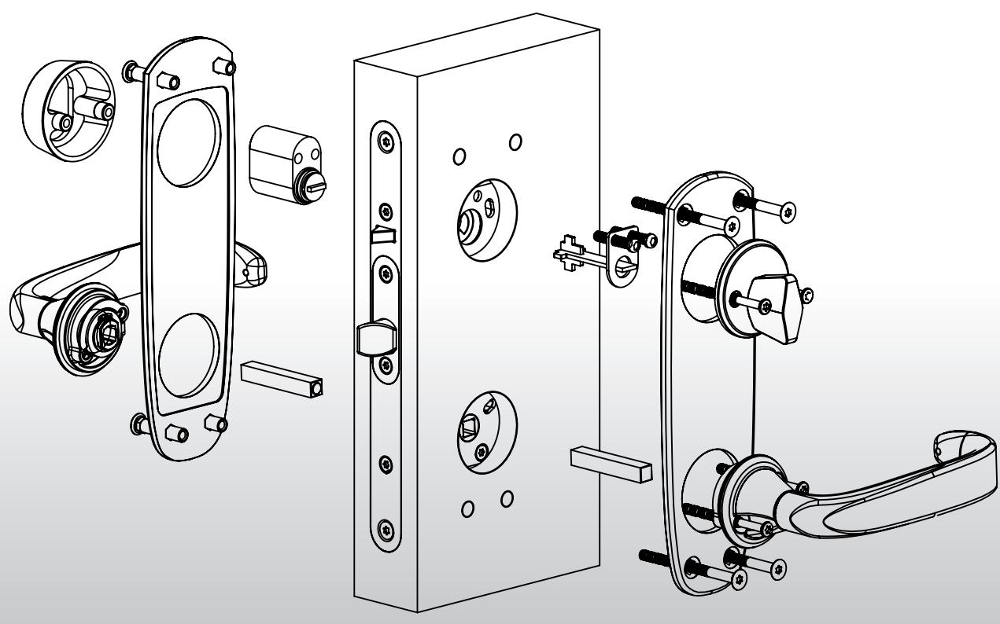

#### **4. Funktionstest**

Efter slutfört montage skall funktionsprov genomföras.

Säkerställ att trycket går att trycka ned obehindrat och att trycket återfjädrar med lätthet.

Kontrollera att cylinder och/eller vred fungerar obehindrat.

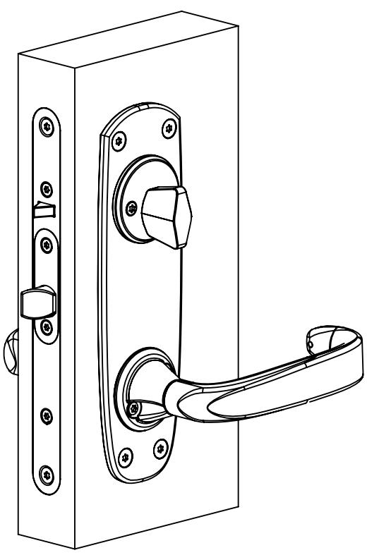

### **MONTERINGSANVISNING 794**

#### **1. Borra**

Borra fyra hål med Ø 10 mm borr för nödutrymningsbehörets genomgående skruvar enligt medföljande borrmall.

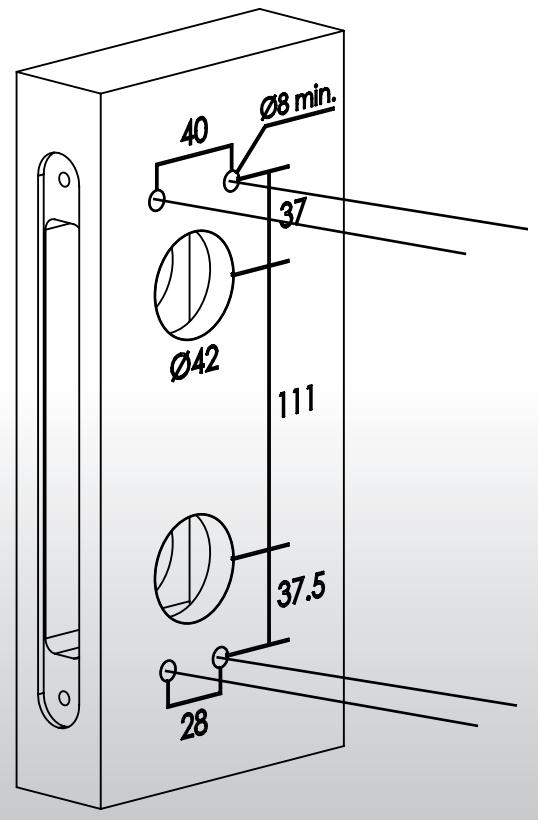

#### **2. Montera låshus**

Montera låshuset i dörrbladet, se exempel till höger, SAFETRON SL620

För att säkerställa förreglingsfunktion skall dörrspringan vara max 3 mm.

**Observera** att låshuset skall ställas i secure funktion. Detta innebär att låsets trycken endast styrs genom elektrisk aktivering

(se monteringsanvisning för aktuellt låshus)

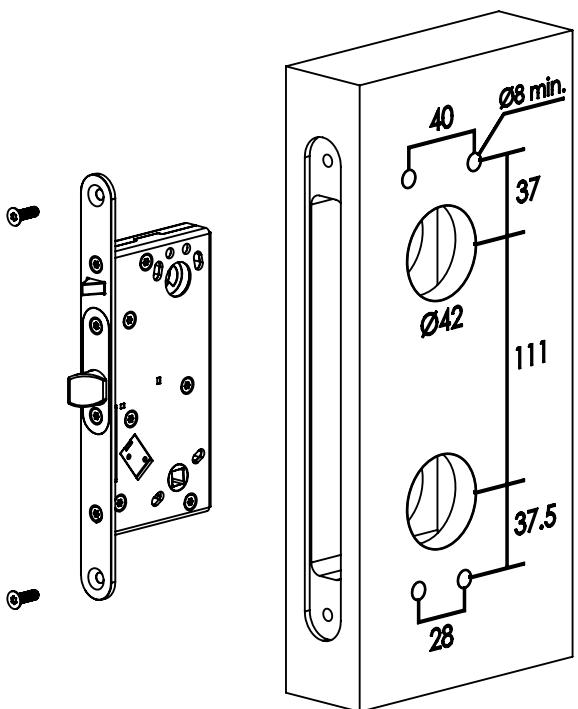

#### **3. Montera låscylinder**

Montera låscylinder tillsammans med nödbeslagets tryckespinne och tillhörande fästplåt.

**OBS!** Tryckespinnens längd kan behöva kortas ned beroendepå dörrbladets tjocklek.

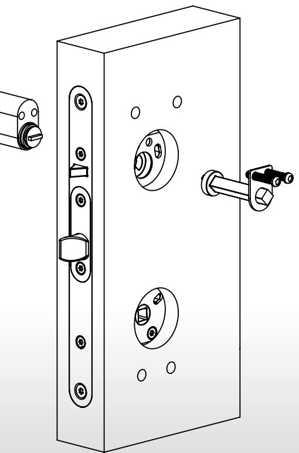

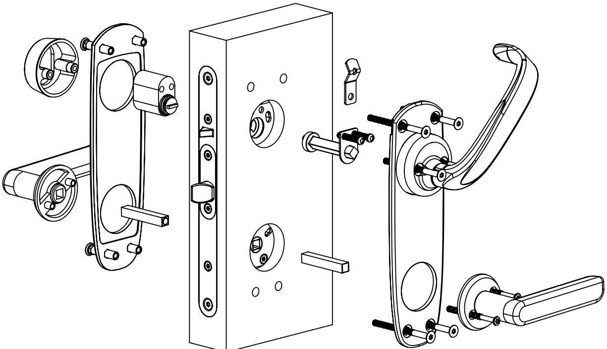

#### **3. Montera nödutrymningsbehör**

- Montera behöret med de medföljande M5 skruvar, totalt 6st. Fyra till de genomgående hålen. De två längre skruvas i låscylindern. Nipplarna skall monteras på dörrens utsida.
- Fästet för plomberingstråden monteras under behörets urtag.
- Tillse att tryckespinnen ligger i rätt vinkel när behöret monteras.

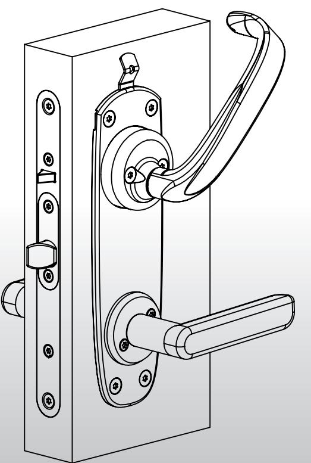

#### **4. Funktionstest**

Efter slutfört montage skall funktionsprov genomföras.

Säkerställ att nödbehörets trycke och cylinder ej påverkas av varandra. Trycket skall med läthet kunna återfjädra.

**OBS!** Låscylinder kommer endast kunna rotera åt ett håll

#### **Behör**

- Valfritt trycke för skandinaviskt modullås kan användas.
- Rund eller oval cylinder av valfri skandinavisk modell.

### **URTAGSRITNING LÅSHUS**

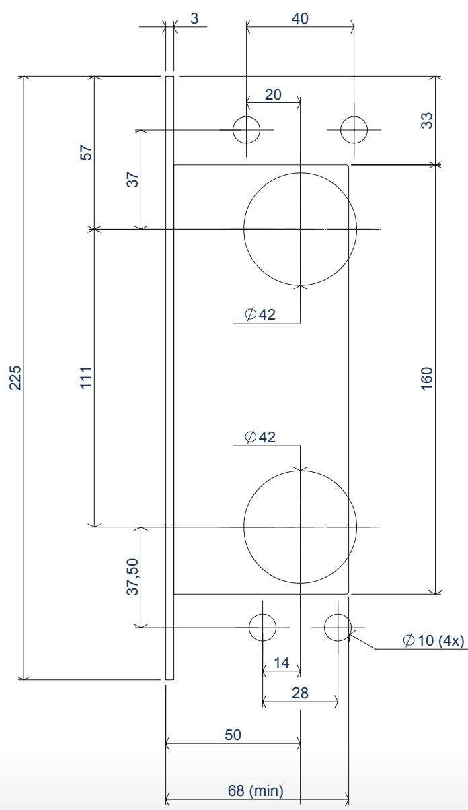

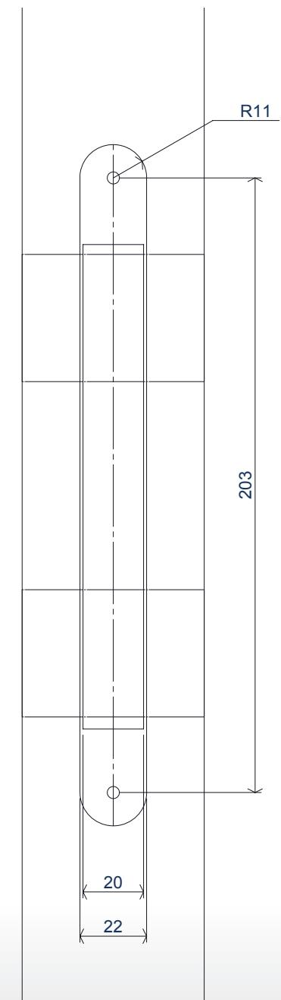

## **MÅTTRITNING 793**

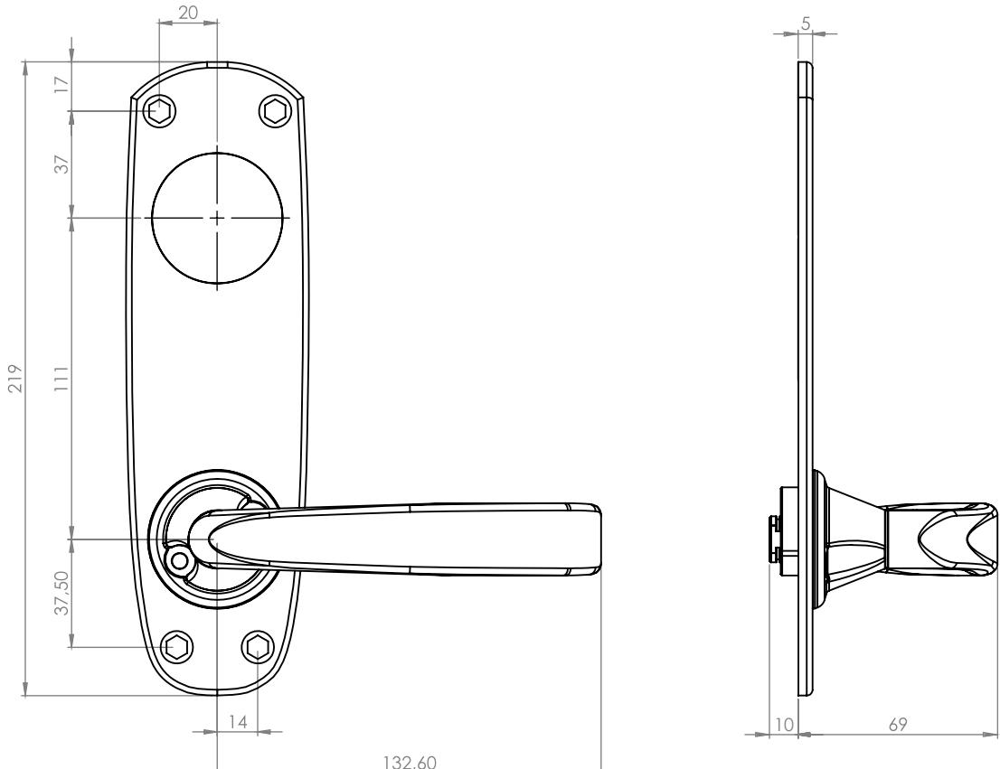

### **MÅTTRITNING 794**

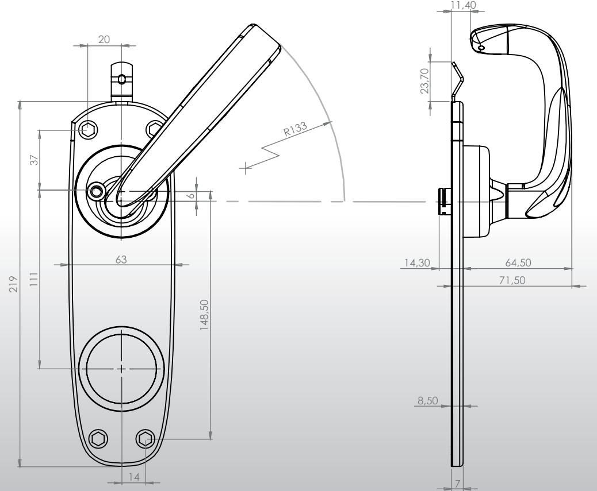

### **ANTECKNINGAR**

| …………………………………………………………………………………………………………………………………………………………………………………………………………………………………………………………………………………………………………………………………………………………………………………………………………………………………………………………………………… |
|-------------------------------------------------------------------------------------------------------------------------------------------------------------------------------|
| …………………………………………………………………………………………………………………………………………………………………………………………………………………………………………………………………………………………………………………………………………………………………………………………………………………………………………………………………………… |
| …………………………………………………………………………………………………………………………………………………………………………………………………………………………………………………………………………………………………………………………………………………………………………………………………………………………………………………………………………… |
| …………………………………………………………………………………………………………………………………………………………………………………………………………………………………………………………………………………………………………………………………………………………………………………………………………………………………………………………………………… |
| …………………………………………………………………………………………………………………………………………………………………………………………………………………………………………………………………………………………………………………………………………………………………………………………………………………………………………………………………………… |
| …………………………………………………………………………………………………………………………………………………………………………………………………………………………………………………………………………………………………………………………………………………………………………………………………………………………………………………………………………… |
| …………………………………………………………………………………………………………………………………………………………………………………………………………………………………………………………………………………………………………………………………………………………………………………………………………………………………………………………………………… |
| …………………………………………………………………………………………………………………………………………………………………………………………………………………………………………………………………………………………………………………………………………………………………………………………………………………………………………………………………………… |
| …………………………………………………………………………………………………………………………………………………………………………………………………………………………………………………………………………………………………………………………………………………………………………………………………………………………………………………………………………  |
| …………………………………………………………………………………………………………………………………………………………………………………………………………………………………………………………………………………………………………………………………………………………………………………………………………………………………………………………………………… |
| …………………………………………………………………………………………………………………………………………………………………………………………………………………………………………………………………………………………………………………………………………………………………………………………………………………………………………………………………………… |
| …………………………………………………………………………………………………………………………………………………………………………………………………………………………………………………………………………………………………………………………………………………………………………………………………………………………………………………………………………… |
| …………………………………………………………………………………………………………………………………………………………………………………………………………………………………………………………………………………………………………………………………………………………………………………………………………………………………………………………………………… |
| …………………………………………………………………………………………………………………………………………………………………………………………………………………………………………………………………………………………………………………………………………………………………………………………………………………………………………………………………………… |
| …………………………………………………………………………………………………………………………………………………………………………………………………………………………………………………………………………………………………………………………………………………………………………………………………………………………………………………………………………… |
| …………………………………………………………………………………………………………………………………………………………………………………………………………………………………………………………………………………………………………………………………………………………………………………………………………………………………………………………………………… |
| …………………………………………………………………………………………………………………………………………………………………………………………………………………………………………………………………………………………………………………………………………………………………………………………………………………………………………………………………………… |
| …………………………………………………………………………………………………………………………………………………………………………………………………………………………………………………………………………………………………………………………………………………………………………………………………………………………………………………………………………… |
| …………………………………………………………………………………………………………………………………………………………………………………………………………………………………………………………………………………………………………………………………………………………………………………………………………………………………………………………………………… |
| …………………………………………………………………………………………………………………………………………………………………………………………………………………………………………………………………………………………………………………………………………………………………………………………………………………………………………………………………………… |
| …………………………………………………………………………………………………………………………………………………………………………………………………………………………………………………………………………………………………………………………………………………………………………………………………………………………………………………………………………… |
| ����������������������������������������������������������������������������������������������������������������������������������������������������������������������������� |
| …………………………………………………………………………………………………………………………………………………………………………………………………………………………………………………………………………………………………………………………………………………………………………………………………………………………………………………………………………… |
| ����������������������������������������������������������������������������������������������������������������������������������������������������������������������������� |

### KVALITET OCH INNOVATION FRÅN SVERIGE

Säterivägen 18 P.O. Box 2096 65002 Karlstad Sweden

Tel: +46 54 19 02 45 Email: info@safetron.com

www.safetron.com

NI HITTAR ALLTID DET SENASTE PÅ SAFETRON.COM

Rätt till ändringar av katalogens innehåll och sortiment förbehålls. Vi reserverar oss för eventuella tryckfel.SAFETRON™ är ett registrerat varumärke.