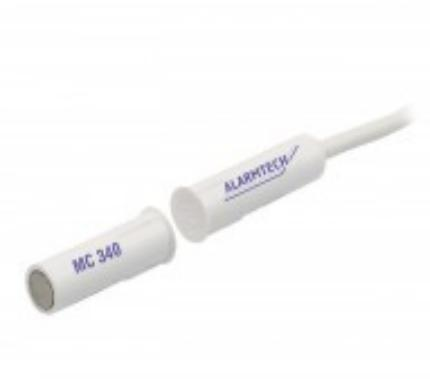
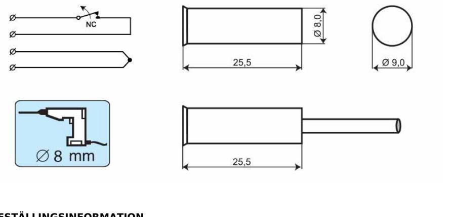

# MC 340

# Magnetkontakt för infällnad, NC

#### **Produktdetajler:**

| Monteringssätt             | Infälld                                                                                                                               |
|----------------------------|---------------------------------------------------------------------------------------------------------------------------------------|
| Kontaktfunktion            | NC                                                                                                                                    |
| Godkännanden               | EN 50131-2-6 Grade 2, Class IIIA, VdS G 196670 Class B, INCERT B-582-0013, SBSC 9-200, Class 1/2, NBÚ CZ Typ 2, NBÚ SK Typ 2 |
| Kontaktdata                | 48 VDC / 500 mA / 10 VA                                                                                                               |
| Borrdiameter mm            | 8                                                                                                                                     |
| Magnettyp                  | Alnico 5                                                                                                                              |
| Sluter (trä) mm            | 21                                                                                                                                    |
| Sluter (metal) mm          | X                                                                                                                                     |
| Sabotageskydd              | Ja                                                                                                                                    |
| Anslutning                 | Kabel                                                                                                                                 |
| Kapsling                   | ABS Plast                                                                                                                             |
| Färg                       | Vit                                                                                                                                   |
| Arbetstemperatur           | -40°C – +70°C                                                                                                                         |
| Kapslingsklass             | IP 67                                                                                                                                 |
| Mått kontaktdel (L x Ø) mm | 26 x 9                                                                                                                                |
| Mått magnetdel (L x Ø) mm  | 26 x 9                                                                                                                                |

MC 340 är en universell magnetkontakt med NC funktion som kan användas både i larm och passersystem för bevakning av t.ex. dörrar, grindar och fönster mot obehörig öppning. Både kontakt- och magnetdelen är i vattentät (IP 67) plastkapsling med flänsar vilket möjliggör enkel montering i trä utan några extra tillbehör. Det omfattade utbudet av installationstillbehör gör att det är enkelt att montera kontakten både infällt och utanpåliggande även på metall och andra material.

| BESTÄLLINGSINFORMATION |         |                                                     |  |  |
|------------------------|---------|-----------------------------------------------------|--|--|
| Typ                    | E-nr    | Beskrivning                                         |  |  |
| MC 340                 | 6332760 | Magnetkontakt för infällnad, NC, 2 m kabel          |  |  |
| MC 340-5               | 6332761 | Magnetkontakt för infällnad, NC, 5 m kabel          |  |  |
| MC 340-10              | 6332762 | Magnetkontakt för infällnad, NC, 10 m kabel         |  |  |
| MC 340-C               | 6332763 | Kontaktdel för infällnad utan magnet, NC, 5 m kabel |  |  |

## **ALARMTECH SWEDEN AB**

### **Relaterade produkter och tillbehör:**

| MC 300-S1 Plastadapter för MC 340, 346, 347, 370                 |  |
|---------------------------------------------------------------------------|--|
| MC 300-S3 Plastkapsling för MC 340, 346, 347                        |  |
| MC 300-S11 Plastadapter för MC 340, 346, 347 and 370             |  |
| MC 300-S12 Plastadapter med stark magnet för MC 340, 346, 347 |  |
| MC 300-S21 Plastadapter för MC 340, 346, 347, 370                |  |

## **ALARMTECH SWEDEN AB**

### **Relaterade produkter och tillbehör:**

| MC 300-S22 Plastadapter med stark magnet för MC 340, 346, 347 |  |
|---------------------------------------------------------------------------|--|
| MC 300-S31 Plastadapter för MC 340, 346, 347, 370                |  |
| MC 300-S32 Plastadapter med stark magnet för MC 340, 346, 347 |  |
| MC 300-S35 Plastkapsling för MC 340, 346, 347                       |  |

Powered by TCPDF (www.tcpdf.org)