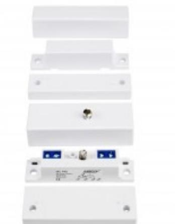
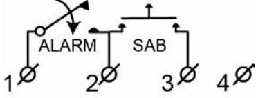

## MC 440

## Magnetkontakt utanpåliggande, NC

## **Produktdetajler:**

| Monteringssätt                 | Utanpåliggande                                                                   |
|--------------------------------|----------------------------------------------------------------------------------|
| Kontaktfunktion                | NC                                                                               |
| Godkännanden                   | EN 50131-2-6 Grade 2, Class II, INCERT B-582-1003, SBSC 9-210, Class 2, FG |
| Kontaktdata                    | 48 VDC / 400 mA / 10 VA                                                          |
| Magnettyp                      | Alnico 5                                                                         |
| Montering på stål              | Möjligt utan tillbehör                                                           |
| Sluter (trä) mm                | 37                                                                               |
| Sluter (stål) mm               | 24                                                                               |
| Sabotageskydd                  | Ja                                                                               |
| Anslutning                     | Skruvplint                                                                       |
| Kapsling                       | ABS Plast                                                                        |
| Arbetstemperatur               | +5°C – +40°C                                                                     |
| Kapslingsklass                 | IP 43                                                                            |
| Mått kontaktdel (L x W x H) mm | 65 x 20 x 15                                                                     |
| Mått magnetdel (L x W x H) mm  | 65 x 15 x 14,5                                                                   |
| Normal drift                   | 12 VDC                                                                           |
| Grade                          | 2                                                                                |

MC 440 är en magnetkontakt för utanpåliggande montage med NC-funktion som kan användas i både larm- och passersystem för bevakning av t.ex. dörrar och fönster mot obehörig öppning. Med stort gap och öppningsskydd mot obefogad öppning ger den ett utmärkt skydd i de flesta larminstallationer. Kontakten är designad för att kunna monteras på de flesta material såsom trä, plast, aluminium och stål. Vid montering på stål bör man använda de medföljande plastdistanserna både på magnetdelen och kontaktdelen. Det finns olika typer av montagevinklar för att klara av de flesta installationer. Behövs ytterligare plastdistanser använd MC 400-6 eller MC 400-7.

| BESTÄLLINGSINFORMATION |         |                                                                  |  |  |
|------------------------|---------|------------------------------------------------------------------|--|--|
| Typ                    | E-nr    | Beskrivning                                                      |  |  |
| MC 440                 | 6309310 | Magnetkontakt utanpåliggande, NC, sabotageskydd, skruvanslutning |  |  |
| MC 440-B               | 6309309 | MC 440 i brunt utförande                                         |  |  |
| MC 440-BL              | -       | MC 440 i svart utförande                                         |  |  |
| MC 440-6               | 6309313 | Plastdistans kontaktdel                                          |  |  |
| MC 440-7               | 6309314 | Plastdistans magnetdel                                           |  |  |

## **Relaterade produkter och tillbehör:**

| MC 440 med inbyggda resistanser Magnetkontakt, utanpåliggande, NC, med 2 st resistanser |  |
|-----------------------------------------------------------------------------------------------------------|--|
| MC 400-6 Plastdistans kontaktdel för MC 440                                                      |  |
| MC 400-7 Plastdistans magnetdel for MC 440                                                       |  |
| MC L Montagevinkel Montagevinkel L formad                                                        |  |
| MC Z Montagevinkel Montagevinkel Z formad                                                        |  |

Powered by TCPDF (www.tcpdf.org)