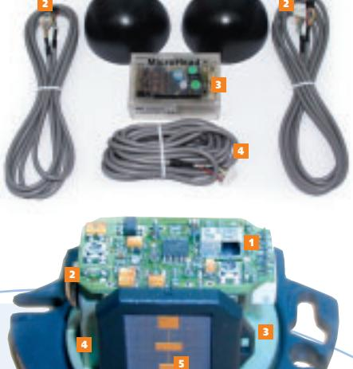
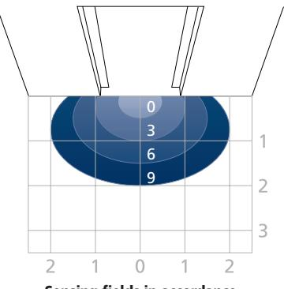
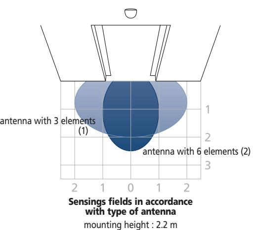
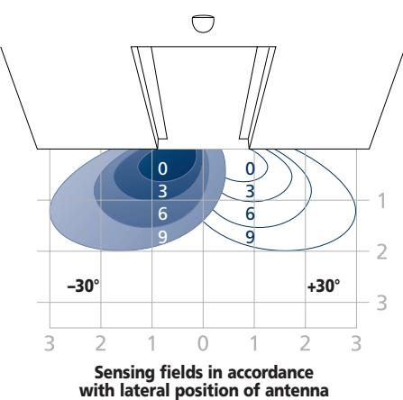
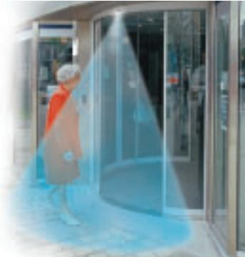

# **MICROHEAD ONE & TWO**

**The smallest** 

**microwave opening sensor** 

**for automatic** 

**doors**

## **Appearance**

- Optimized design with a miniature and translucent housing
- **Vandal proof with PC housing**

## **Technology**

- **Same K-band planar antenna** as the one developed for the Eagle range
- Digital electronics
- **Unidirectional** (for energy savings on heating and air conditioning) **or bidirectional**
- **MTF function :** adjustment that switches the unidirectional mode to the bidirectional one automatically in case the motion direction is inverted, which increases the safety for hesitating movement of some people

#### **Detection**

- **Wide or narrow** sensing field
- Mounting height **up to 4 m**

#### **Adjustments for universal use**

- **Fully controlled** by a coded infrared remote control unit, which enables you to adjust every BEA product
- **3D antenna's** adjustments front : from 0° to 90° lateral : from –30° to +30°
- Ceiling mounting without accessory

# Planar antenna and adjustments with the BEA universal remote control unit

A single control box in the door controller, two heads on the door controller… All the BEA Eagle experience in the smallest sensor ever. The MicroHead especially adapts to compact door controllers.

**MICROHEAD ONE** : unidirectional sensor **MICROHEAD TWO** : bidirectional sensor

# **Description**

**Sensing fields**

**1 1**

**1 2 3** 2 sensing heads 2 cables sensing heads-control box Control box

**4** Power supply cable

Internal view

- **1** Infrared receiver
- **2** LED
- **3 4** Lateral position of the antenna adjustment Vertical position of the antenna adjustment
- **5** Wide sensing field antenna (default)

Note : "Outdoor" and "indoor" terms are only used in order to ease the installation, as the 2 sensing head channels are electrically equivalent.

| Technical specifications |
|--------------------------|
|                          |

| Technology                                           | microwave and microprocessor                    |
|------------------------------------------------------|-------------------------------------------------|
| Transmitter frequency                                | 24.175 GHz                                      |
| Transmitter radiated power                           | 20 dBm EIRP                                     |
| Transmitter power density                            | < 5 m W/cm2                                     |
| Mounting height                                      |                                                 |
| • standard                                           | from 1.8 m to 3 m                               |
| • high                                               | from 3 m to 4 m                                 |
| Tilt angles                                          | 0° to 90° vertical                              |
|                                                      | –30° to +30° lateral                            |
| Detection area (mounting height = 2.2 m)             |                                                 |
| • wide sensing field                                 | 4 m (W) x 2 m (D)                               |
| • narrow sensing field                               | 2 m (W) x 2.5 m (D)                             |
| Detection mode                                       | motion                                          |
| Minimum speed                                        | 5 cm/s (measured in the sensor axis)            |
| Supply voltage                                       | 12 V to 24 V AC ±10%                            |
|                                                      | 12 V to 24 V DC +30% / –10%                     |
| Mains frequency                                      | 50 to 60 Hz                                     |
| Power consumption                                    | < 4 W (VA)                                      |
| Output relay (free of potential change-over contact) |                                                 |
| • max contact voltage                                | 42 V AC - 60 V DC                               |
| • max. contact current                               | 1 A (resistive)                                 |
| • max. switching power                               | 30 W (DC) / 60 VA (AC)                          |
| Hold time                                            | 0.5 s to 9 s (adjustable)                       |
| Temperature range                                    | –20°C to +55°C                                  |
| Degree of protection                                 | IP54                                            |
| Immunity                                             | R&TTE 1999/5/EC EMC 89/336/EEC                  |
| Material                                             | ABS & Polycarbonate                             |
| Dimensions                                           |                                                 |
| • sensing head                                       | 80 mm (W) x 60 mm (H) x 55 mm (D)               |
| • control box                                        | 77 mm (W) x 50 mm (H) x 30 mm (D)               |
| Weight                                               |                                                 |
| • sensing head                                       | 140 g                                           |
| • control box                                        | 60 g                                            |
| Color of head housing                                | black smoked                                    |
| Length of cable                                      |                                                 |
| • sensing head cable                                 | 2 m                                             |
| • power cable                                        | 2.5 m                                           |
| Manual adjustments                                   |                                                 |
| • sensitivity (by push buttons)                      |                                                 |
| • orientation of sensing field (mechanically)        |                                                 |
| • shape of the sensing field (by choice of antenna)  |                                                 |
| Remote control adjustments                           |                                                 |
| • sensitivity                                        | ten levels                                      |
| • hold time                                          | from 0.5 s to 9 s in 10 steps                   |
| • detection mode                                     | uni- or bidirectional, MTF (MicroHead ONE only) |
| • immunity                                           | quasi-presence, normal, increased immunity      |
| • output configuration                               | active/passive                                  |
| • door control                                       | automatic, permanently open/closed              |
| • security                                           | 4-digit access code                             |

**Sensing fields in accordance with sensitivity setting** mounting height : 2.2 m

mounting height : 2.2 m

**Application**

**B.E.A. s.a. /** Parc Scientifique du Sart-Tilman / Allée des Noisetiers 5 / B-4031 Angleur - Belgium / TEL. +32. 4 361 65 65 / FAX. +32. 4 361 28 58 / info@bea.be / www.beasensors.com

Subject to modifications