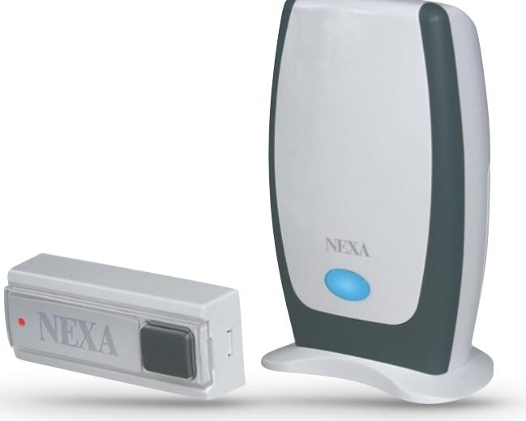
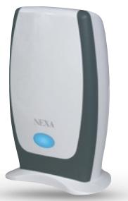
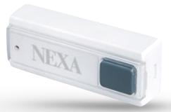

## MLR-1105

## **TRÅDLÖS DÖRRKLOCKA M SÄNDARE**

Art: 18661 E-nummer: 53 382 70

Batteridriven dörrklocka som trådlöst kommunicerar med upp till fyra sändare. Tack vara batteridriften är placeringen mycket flexibel.

Kan med fördel kombineras med rörelsevakter och magnetkontakter för automatisk övervakning.

4 olika ringsignaler. Men möjlighet att använda olika signal för olika sändare.

SPECIFIKATION RF-frekvens: 433,92 MHz Batteri (sändare): CR-2032 (ingår) Batteri (mottagare): 3 x AA (ingår ej) Strömförbrukning i standby: 0,8 W Räckvidd: Upp till 120 m

Extra mottagare Art. Nr: 18662 E-nummer: 53 382 71

Extra sändare Art. Nr: 18653 E-nummer: 53 382 68

www.nexa.se | support@nexa.se Facebook.com/NexaElectronics Twitter: @NexaElectronics