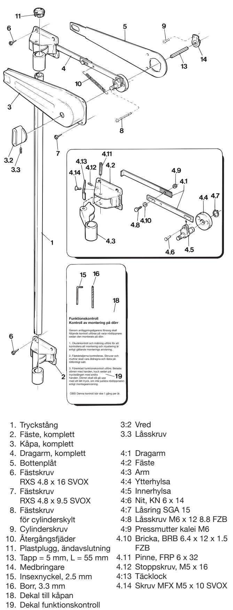
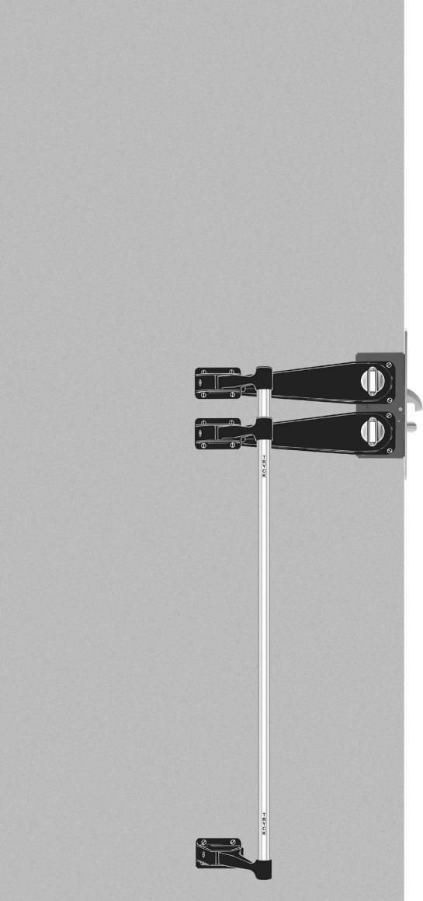
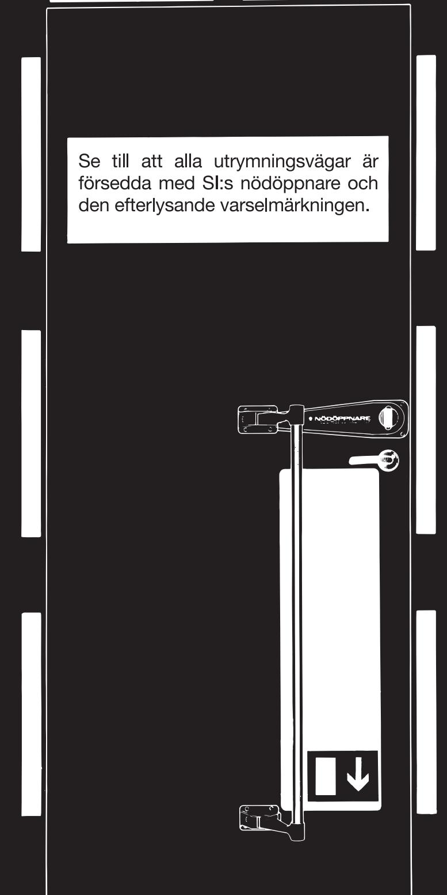
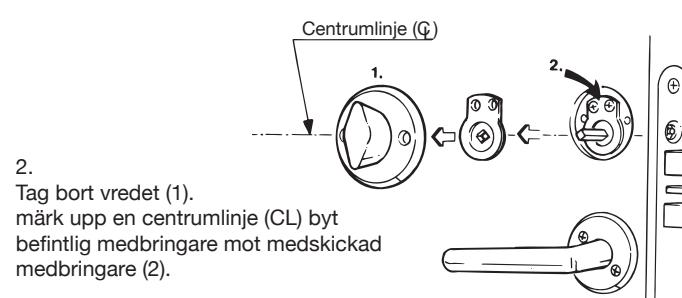
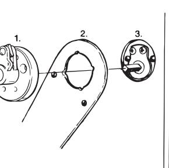
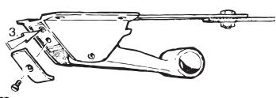
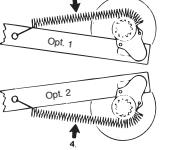
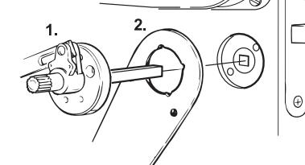
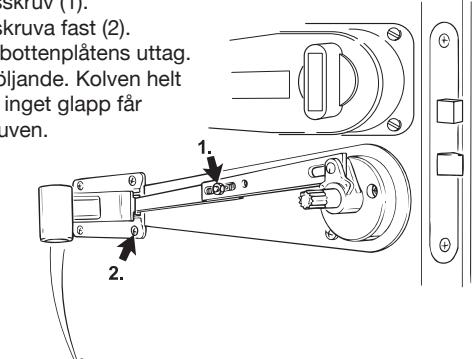

**DETALJ - SPECIFIKATION**

Marknadens mest kompletta motorlås

Läs mer på **safetron.com**

## **OBS!**

**För full funktionssäkerhet får ingående komponenter ej modifieras. Om så är fallet fråntar vi oss allt ansvar för produkten.**

#### **Denna nödöppnare är avsedd för lås:**

## SAFETRON MOTORLÅS 6200

1. Öppna dörren med befintligt vred (eller trycke) och känn om dörren och låset går lätt. Om ej, justera t.ex. i karmens urtag för låskolvarna. **Kom ihåg att smörja låset!**

3. Sätt fyrkantstappen, använd den vridna delen, i låsets medbringare (3) för ihop bottenplåten (2) med ytterhylsan (1) , (ytterhylsan av mässing) . Mekanismen föres på fyrkantstappen så att tappen går in i mekanismens innerhylsa.

 4. Kapa fyrkantstappen enligt denna skiss. Sätt därefter tillbaka tappen och häng på mekanismen på tappen.

Cut A + 2 mm

 5. Skruva fast ytterhylsan (av mässing) med låsets cylinderring. Känn efter att låset går lätt. Låt dragarmen hänga fritt. Rikta in bottenplåten efter centrumlinjen. Skruva fast bottenplåten.

**OBS! Samtliga hål borras med medskickad borr.**

## Lossa på dragarmens låsskruv (1). Märk upp för övre fästet och skruva fast (2). Se till att fästet hamnar i bottenplåtens urtag. OBS! Fästskruv RXS 4,8 x 16.

Justera dragarmen enl. följande: Kolvarna helt ute, övre fästets arm i ytterläge, inget "glapp" får finnas, skruva fast låsskruven.

6.

9.

# **OBS! VIKTIGT!**

7. Tryck sedan övre fästets arm mot dörren, så att kolvarna är helt indragna i låset. Skruva nu

insexskruven (3) in mot fästets arm tills att den stannar mot denna. Släpp nu ut armen och prova att allt fungerar. Om nu hela mekanismen går trögt kan det bero på att ytter hylsan har ej hamnat centriskt - bottenplåten likaså - Återgå till punkt 5.

**-**

8. Fäst dragarmens fjäder enl. alt. 1-2. Beroende på låsets vridriktning. Prova åter funktionen.

Ta bort trycket på dörren och märk upp en centrumlinje (lika som punkt 1) sätt dit mekanismen med 8 mm fyrkanttapp, tillsammans med bottenplåten, samt trä på trycket på utsidan.

10. Om nödvändigt, mät och kapa fyrkanttappen enligt skiss.

11. Skruva fast mekanismen tillsammans med trycket på utsidan, känn efter att trycket går lätt. Låt fästet hänga fritt och skruva fast bottenplåten efter den uppritade centrumlinjen.

Lossa på dragarmens låsskruv (1). Märk upp för fästet och skruva fast (2). Se till att fästet hamnar i bottenplåtens uttag. Justera dragarmen enl, följande. Kolven helt ute, armen (3) i ytterläge, inget glapp får finnas, skruva fast låsskruven.

## 13.

12.

När båda mekanismerna är monterade och tryckstången monterad så måste hakregelkolven finjusteras. Den måste börja röra sig först en bit så att båda kolvarna är i bottenläge samtidigt.

Lossa skruven på den övre dragarmen och dra försiktigt ihop de två delarna för hand tills att hakregelkolven blir stum i låset, skruva ihop dragarmen och tryck på tryckstången och kontrollera att de båda kolvarna bottnar samtidigt. Ev. får man justera stoppskruven bak i fästet för att få optimal funktion.

#### 14. När de båda kolvarna är rätt justerade monteras kåporna på de 2 mekanismerna.

## 15.

Montera ihop röret med det undre fästet och sedan med det övre fästet. Se till att röret sitter vertikalt. Snedvridning får ej uppstå! Märk därefter upp för det undre fästet och skruva fast fästet på dörren.

Medskickade dekal fästes enl. vidstående skiss: "Nödöppnare" (1). Medskickad plastplugg monteras på övre fästarm (2).

Nödöppnaren är nu färdigmonterad!

### **OBS! VIKTIGT**

Bifogad klisterlapp om funktionskontroll fästes på insidan av kåpan.

# **OBS! VIKTIGT!**

#### **Kontroll av montering på dörr.**

Genom anläggningsägarens försorg skall följande kontroll utföras på varje nödöppnare sedan den monterats på dörr.

- 1. Okulärkontroll och mätning utförs för att kontrollera att montering och injustering är enligt gällande monterings anvisning.
- 2. Fästdetaljerna kontrolleras. Skruvar och muttrar
	- skall vara åtdragna och låsta på tillförlitligt sätt.
- 3. Förenklad funktionskontroll utförs: Belasta dörren med handen, tryck sedan på tryckstången med andra handen. Dörren skall då gå upp med ett
	- lätt tryck, om inte justera nödöppnaren enligt montageanvisning.
- 4. Kontrollera att dekal är ditsatt på kåpan.
- **OBS! Denna kontroll bör ske 1 gång per år.**