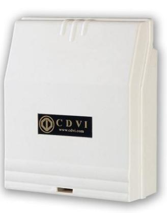
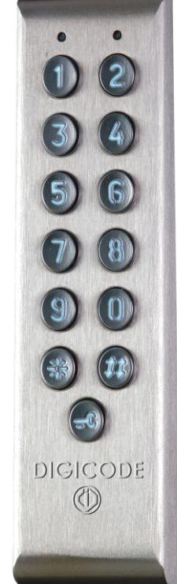
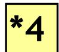
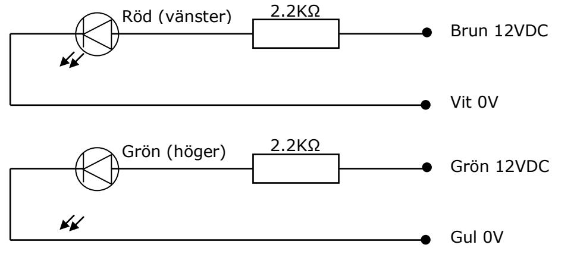
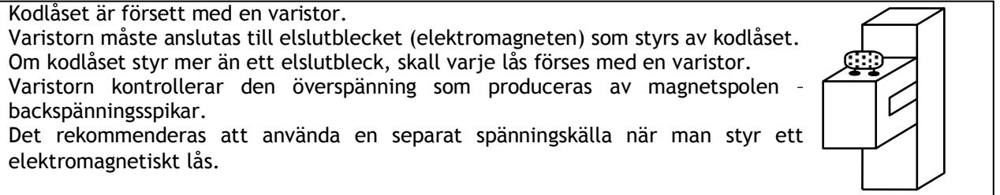
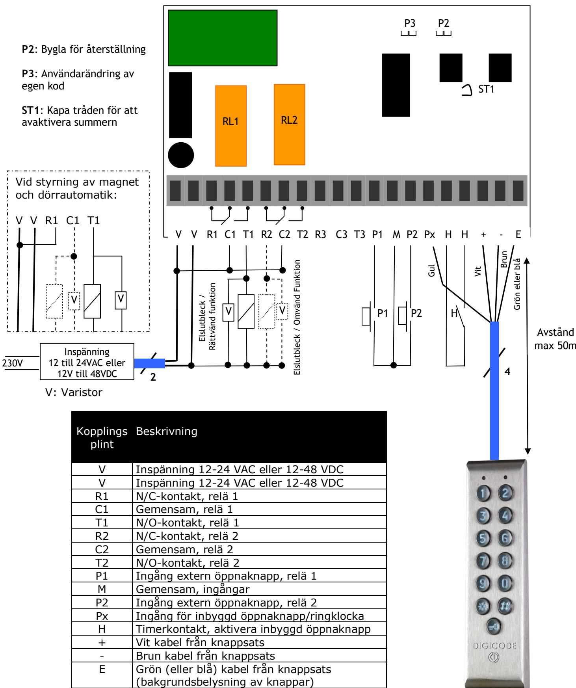

**Email: info@cdvi.se Web: www.cdvi.se**

# **PROFIL100EC**

*ROSTFRITT KODLÅS MED BAKGRUNDSBELYST KNAPPSATS, 100 PIN-KODER OCH SEPARAT CENTRALENHET*

**SKYDDSKLASS IP 67**

Centralenhet Knappsats PROFIL100EC

| Antal | Beskrivning           | Foto                              | Användning                               |  |
|-------|-----------------------|-----------------------------------|------------------------------------------|--|
| 1     | DIAX skruv M5x8       | Monteringsskruv till knappsats |                                          |  |
| 1     | DIAX fast nyckel      |                                   | Till M5x8 skruven                        |  |
| 4     | Monteringsskruv M4x30 |                                   | 2 * bakplatta kodlås 2 * centralenhet |  |
| 4     | Plastplugg S5         |                                   | 2 * bakplatta kodlås 2 * centralenhet |  |
| 1     | Varistor 05D 680K     |                                   | Till låset                               |  |
| 2     | Tätade toppklämmor    |                                   | Kabelhål, centralenhet                |  |

CDVI Sweden AB 1

| I. PRODUKTINFORMATION 3                             |  |
|-----------------------------------------------------|--|
| A. PRODUKTBESKRIVNING 3                             |  |
| B. STANDARDVÄRDEN 3                                 |  |
| C. SUMMER 3                                         |  |
| D. KODLÄNGD3                                        |  |
| E. INGÅNG FÖR EXTERNA ÖPPNAKNAPPAR 3                |  |
| F. FÖRBRUKNING3                                     |  |
| II. PROGRAMMERING4                                  |  |
| A. PROGRAMMERA TIDER4                               |  |
| B. STÄLLA IN KODLÄNGD SAMT ÄNDRA MASTERKOD4         |  |
| C. TOTAL ÅTERSTÄLLNING AV MINNET 5                  |  |
| D. ÅTERSTÄLLA MASTERKODEN 5                         |  |
| E. PROGRAMMERA EN UNDERMASTERKOD 5                  |  |
| F. ANVÄNDARÄNDRING AV EGEN KOD 5                    |  |
| G. LÄGGA TILL, ÄNDRA ELLER TA BORT EN ANVÄNDARKOD 6 |  |
| H. LJUDSIGNAL VID KNAPPTRYCKNING 6                  |  |
| I.INKOPPLING AV RÖD OCH GRÖN LED-DIOD6              |  |
| III. KOPPLINGSSCHEMA FÖR PROFIL100EC 7              |  |
| IV. ANTECKNINGAR8                                   |  |
|                                                     |  |
| MASTERKODER8                                        |  |
| ANVÄNDARKODLISTA8                                   |  |

## I. PRODUKTINFORMATION

#### *A. PRODUKTBESKRIVNING*

Inspänning 12 – 24 VAC fri spänning Inspänning 12 – 48 VDC fri spänning 13-siffrig bakgrundsbelyst knappsats EPROM minneslagring 100 valfria PIN-koder med 4-, 5- eller 6-siffrig kod 2 reläutgång, N/O eller N/C-kontakt 8A/250V 1 programmerbar masterkod, 4-, 5- eller 6 siffrig Summer 1 ingång för extern öppnaknapp 1 tryckknapp för dörröppning från knappsats

#### *B. STANDARDVÄRDEN*

| Bakgrundsbelysningstid: Reläslutningstid: Kodlängd: Masterkod: Programmeringslägestid: Undermasterkod, grupp 1: | 10 sekunders belysning av knappsatsen 1 sekund 5-siffrig 12345 120 sekunder * och # |
|--------------------------------------------------------------------------------------------------------------------------------|----------------------------------------------------------------------------------------------------|
| Undermasterkod, grupp 2:                                                                                                       | 1 och 3                                                                                            |
|                                                                                                                                |                                                                                                    |

#### *C. SUMMER*

#### **Summern indikerar olika ljudsignaler. Den kan kopplas bort genom att tråden ST1 på styrboxen kapas (se sidan 7)**

| 1 kort pipsignal    | kodlåset spänningssatt                             |
|---------------------|----------------------------------------------------|
| 1 lång pipsignal    | data sparas i programmeringsläge eller godkänd kod |
| 2 korta pipsignaler | åtkomst till eller avsluta programmeringsläget     |
| 4 korta pipsignaler | databehandlingsfel                                 |

#### *D. KODLÄNGD*

#### **Masterkoden och användarnas PIN-koder kan vara 4-, 5- eller 6-siffriga**

Alla knappar förutom den interna öppningsknappen på knappsatsen kan användas för att programmera en kod.

Masterkoden *KAN INTE* användas som användarkod.

Koderna 0000, 00000 och 000000 kan endast användas för att ta bort en PIN-kod. För att ta bort en specifik kod: ersätt den med 0000 om det är en fyrsiffrig kodlängd eller med 00000 eller 000000 för femsiffrig respektive sexsiffrig kodlängd.

#### *E. INGÅNG FÖR EXTERNA ÖPPNAKNAPPAR*

#### **Detta är en normalt öppen krets som aktiveras vid slutning av reläet. Denna funktion är speciellt användbar för att öppna dörr/grind/port inifrån utan knappsats.**

Ingång P1 aktiverar relä 1 om timeringången H är aktiverad.

Timeringången H (om ansluten) gör det möjligt att använda den interna öppnaknappen på knappsatsen för att öppna dörren utan att slå in en användarkod. Om timerkontakten är öppen, måste användarkoder användas för att öppna dörren. Vill man ha helt öppet under till exempel dagtid skall timern anslutas mellan C1 och T1, se kopplingsschema.

#### *F. FÖRBRUKNING*

| 12V AC:                                 | 20mA i standby-läge, 70mA max med 2 relän aktiverade |  |  |  |
|-----------------------------------------|------------------------------------------------------|--|--|--|
| 24V AC:                                 | 10mA i standby-läge, 40mA max med 2 relän aktiverade |  |  |  |
| 12V DC:                                 | Max 90mA med 2 relän aktiverade och tänd belysning   |  |  |  |
| 24V DC:                                 | Max 50mA med 2 relän aktiverade och tänd belysning   |  |  |  |
| (Låsens förbrukning är inte inkluderad) |                                                      |  |  |  |

# II. PROGRAMMERING

#### *A. PROGRAMMERA TIDER*

#### **Detta avsnitt beskriver programmeringen av tiderna för bakgrundsbelysning och reläaktivering**

- 1. Knappa in masterkoden två gånger (masterkodens default-värde är 12345). Knappsatsen piper två korta pipsignaler för att bekräfta att man är i programmeringsläget.
- 2. Knappa in ***0** för att programmera knappsatsens bakgrundsbelysningstid. Knappsatsen piper för varje knapptryckning samt ett kort pip för att bekräfta att belysningstid skall knappas in. Knappa alltid in tiden med 2 siffror som motsvarar öppettiden i sekunder – **10** för 10 sekunder upp till **99** för 99 sekunder. **01-09 tillåts ej!** Knappa in **00** för konstant belysning av knapparna. Ett långt pip bekräftar ändring av belysningstiden. Tryck **#** för att lämna programmeringsläget eller gå vidare till steg 3. Två korta pip bekräftar att man lämnat programmeringsläget!
- 3. Knappa in ***1** för att programmera tiden för reläutgång 1 (dörröppningstid). Knappsatsen piper för varje knapptryckning samt ett kort pip för att bekräfta att relätid skall knappas in. Om man vill ha en låst utgång, matas tiden in i sekunder – **01** för 1 sekund upp till **99** för 99 sekunder. Knappa in **00** om man vill en bistabil utgång (reläet ändrar tillstånd varje gång en korrekt PIN-kod anges). Ett långt pip bekräftar ändring av relätiden. Tryck **#** för att lämna programmeringsläget eller gå vidare till steg 4.

Två korta pip bekräftar att man lämnat programmeringsläget! 4. Knappa in ***2** för att programmera tiden för reläutgång 2 (dörröppningstid).

- Knappsatsen piper för varje knapptryckning samt ett kort pip för att bekräfta att relätid skall knappas in. Om det är en låst utgång, matas tiden in i sekunder – **01** för 1 sekund upp till **99** för 99 sekunder. Knappa in **00** om det är en bistabil utgång (reläet ändrar tillstånd varje gång en korrekt PIN-kod anges). Ett långt pip bekräftar ändring av relätiden. Tryck **#** för att lämna programmeringsläget eller gå vidare till steg 5. Två korta pip bekräftar att man lämnat programmeringsläget!
	- 5. Tryck **#** för att lämna programmeringsläget! Två korta pip bekräftar att man lämnat programmeringsläget! Fyra korta pip indikerar inmatningsfel eller databehandlingsfel.

# *B. STÄLLA IN KODLÄNGD SAMT ÄNDRA MASTERKOD*

#### **Detta avsnitt beskriver programmeringen av kodlängden**  1. Knappa in masterkoden två gånger (masterkodens default-värde är 12345).

- Knappsatsen piper två korta pipsignaler för att bekräfta att man är i programmeringsläget.

***5**

- 2. Knappa in ***4** för att programmera kodlängden. Knappsatsen piper för varje knapptryckning samt ett kort pip för att bekräfta att kodlängden skall knappas in. Tryck **4, 5** eller **6** för att ange önskad kodlängd. Ett långt pip bekräftar att ändring av kodlängden är utförd.
- 3. Knappa sedan direkt in ***5** för att ändra masterkoden. Knappsatsen piper för varje knapptryckning samt ett kort pip för att bekräfta att masterkoden skall knappas in. Knappa in en ny 4-, 5- eller 6 siffrig masterkod. Ett långt pip bekräftar att ändring av masterkoden är utförd.
- 4. Tryck **#** för att lämna programmeringsläget! Två korta pip bekräftar att man lämnat programmeringsläget! Fyra korta pip indikerar inmatningsfel eller databehandlingsfel.

Ändras kodlängden ändras även samtliga inlagda koder enligt nedan: Master- eller användarkod: 12369 Master- eller användarkod: 12369 Modifierad 4-siffrig kod: 2369 Modifierad 6-siffrig kod: 012369

***0**

***1**

#### *C. TOTAL ÅTERSTÄLLNING AV MINNET*

#### **Detta avsnitt beskriver en total återställning av minnet där alla inlagda koder raderas**

- 1. Knappa in masterkoden två gånger (masterkodens default-värde är 12345). Knappsatsen piper två korta pipsignaler för att bekräfta att man är i programmeringsläget.
- ***6**
- 2. Knappa in ***6** för att återställa Masterkoden och radera samtliga PIN-koder. Knappsatsen piper för varje knapptryckning samt ett kort pip för att bekräfta att Total Återställning skall göras. Tryck först ***** följt av **#** för att bekräfta radering av kodlåsets hela minne. Knappsatsen piper för varje knapptryckning samt avger två korta pip samt släcker bakgrundsbelysningen för att bekräfta att Total återställning av minnet har utförts. Masterkoden återställs till sitt default-värde (12345) och alla PIN-koder raderas från knappsatsen.

#### **ELLER**

- **P2**
- 1. Slå av strömmen. Bygla **P2**.
- 2. Slå på strömmen igen. Vänta ca 3 sekunder. 2 pipsignaler bekräftar att knappsatsen är återställd. Ta bort byglingen från **P2**. Masterkoden återställs till sitt default-värde (12345) och alla användarkoder raderas från knappsatsen.

#### *D. ÅTERSTÄLLA MASTERKODEN*

I stand-byläge, bygla **P2**. Ta bort byglingen på **P2.** Ett kort pip hörs ur knappsatsen för att bekräfta att Masterkoden är återställd.

Masterkoden återställs till sitt default-värde, 123456 för 6-siffrig kod respektive 12345 eller 1234 för 5- och 4-siffrig kodlängd.

#### *E. PROGRAMMERA EN UNDERMASTERKOD*

**Med Undermasterkoden kan användaren ändra sin egen kod utan att behöva gå in i programmeringsläget. Av säkerhetsskäl måste användarkoderna ändras med jämna mellanrum. Med denna funktion kan användarna enklare och snabbare ändra sin egen kod.** 

- 1. Knappa in masterkoden två gånger (masterkodens default-värde är 12345). Knappsatsen piper två korta pipsignaler för att bekräfta att man är i programmeringsläget.
- ***7**
- 2. Knappa in ***7** för att programmera en undermasterkod för grupp 1 som ger användaren möjlighet att ändra sin egen PIN-kod. Knappa in en ny 2-siffrig undermasterkod. Knappsatsen piper för varje knapptryckning samt ett kort pip för att bekräfta att Ny Undermasterkod skall programmeras. Ett långt pip bekräftar att ny kod är programmerad.
- ***8**

**P3**

- 3. Knappa in ***8** för att programmera en undermasterkod för grupp 2 som ger användaren möjlighet att ändra sin egen PIN-kod. Knappa in en ny 2-siffrig undermasterkod. Knappsatsen piper för varje knapptryckning samt ett kort pip för att bekräfta att Ny Undermasterkod skall programmeras. Ett långt pip bekräftar att ny kod är programmerad.
- 4. Tryck på **#** för att lämna programmeringsläget. Två korta pip bekräftar att knappsatsen är i stand-byläge.

#### *F. ANVÄNDARÄNDRING AV EGEN KOD*

#### **För att en användare ska få tillstånd att ändra sin egen PIN-kod skall P3 byglas (för att avaktivera funktionen, ta bort byglingen)**

- 1. Knappa in den gamla PIN-koden. Reläet aktiveras och Knappsatsen slocknar.
- 2. Knappa in den 2-siffriga undermasterkoden (default-undermasterkod är ***** och **#**). Knappsatsen piper för att bekräfta att ny kod skall knappas in.
- 3. Knappa in den nya PIN-koden. Knappsatsen piper för varje knapptryckning samt ett långt pip för att bekräfta att Ny PIN-kod är lagrad. Knappsatsen släcks.
- 4. Testa den nya PIN-koden för att försäkra dig om att ändringen gjorts.

### *G. LÄGGA TILL, ÄNDRA ELLER TA BORT EN ANVÄNDARKOD*

Grupp 1: från plats **00** till plats **59**, reläutgång 1

- Grupp 2: från plats **60** till plats **99**, reläutgång 2 1. Knappa in masterkoden två gånger (masterkodens default-värde är 12345). Knappsatsen piper två korta pipsignaler för att bekräfta att man är i programmeringsläget.
- **00 - 99**
- 2. **För att lägga till en användarkod**, knappa in användarens plats (mellan **00** och **99**). Knappsatsen piper för varje knapptryckning. Om användaradressen är ledig, hörs ingen pipsignal efter att platsen knappats in. Ange den nya 4-, 5- eller 6-siffriga PINkoden direkt efter platsen.
- 3. **För att ändra en användarkod**, knappa in användarens adress. 4 pipsignaler anger att användaradressen redan är programmerad. Knappa in en ny 4-, 5- eller 6 siffrig PIN-kod. En pipsignal bekräftar den nya användarkoden.
- 4. **För att ta bort en användarkod**, knappa in användarens adress. 4 pipsignaler hörs. Knappa in **00000** för en 5-siffrig kod eller **0000** respektive **000000** för en 4- eller 6 siffrig kod. En pipsignal bekräftar att PIN-koden är raderad. **OBS!** Om PIN-koden redan är använd eller är densamma som masterkoden, piper knappsatsen fyra gånger.
- 5. Tryck på **#** för att lämna programmeringsläget. Två korta pip bekräftar att knappsatsen åter är i stand-byläge.

#### *H. LJUDSIGNAL VID KNAPPTRYCKNING*

Summern är aktiverad i programmeringsläge och när reläet är slutet efter inmatning av giltig kod. För att aktivera ljudindikering vid knapptryckning:

- 1. Knappa in masterkoden två gånger (masterkodens default-värde är 12345). Knappsatsen piper två korta pipsignaler för att bekräfta att man är i programmeringsläget.
- ******
- 2. Tryck ******. 1 pigsignal hörs. Tryck **0** för att avaktivera ljudsignal vid knapptryckning. Tryck **1** för att aktivera ljudsignalen vid knapptryckning. 1 pipsignal bekräftar den nya inställningen.
- 3. Tryck **#** för att lämna programmeringsläget. Två korta pip bekräftar att knappsatsen åter är i stand-byläge.

#### *I.INKOPPLING AV RÖD OCH GRÖN LED-DIOD*

LED-dioderna skall spänningsmatas med 12 VDC, resistorer är inbyggda i knappsatsen.

# III. Kopplingsschema för PROFIL100EC

# IV. Anteckningar

#### *MASTERKODER*

| Masterkod |  |  |  | Masterkod |           |  |  |  |
|-----------|--|--|--|-----------|-----------|--|--|--|
| Masterkod |  |  |  |           | Masterkod |  |  |  |
|           |  |  |  |           |           |  |  |  |

| Masterkod |  |  |  |  |  |  |  |  |
|-----------|--|--|--|--|--|--|--|--|
|           |  |  |  |  |  |  |  |  |
| Masterkod |  |  |  |  |  |  |  |  |
|           |  |  |  |  |  |  |  |  |

Stryk över när ny kod programmeras. Skriv ner den nya koden i nästa lediga ruta. Använd blyerts för användarkoderna.

| Undermasterkod |  | Undermasterkod |                |  |
|----------------|--|----------------|----------------|--|
|                |  |                |                |  |
| Undermasterkod |  | Undermasterkod |                |  |
|                |  |                |                |  |
| Undermasterkod |  |                | Undermasterkod |  |
|                |  |                |                |  |

| Undermasterkod |  |  |  |  |  |
|----------------|--|--|--|--|--|
|                |  |  |  |  |  |
| Undermasterkod |  |  |  |  |  |
|                |  |  |  |  |  |
| Undermasterkod |  |  |  |  |  |
|                |  |  |  |  |  |

#### *ANVÄNDARKODLISTA*

| 00 |  |  |  | 34 |  |  |  | 68 |  |  |  |
|----|--|--|--|----|--|--|--|----|--|--|--|
| 01 |  |  |  | 35 |  |  |  | 69 |  |  |  |
| 02 |  |  |  | 36 |  |  |  | 70 |  |  |  |
| 03 |  |  |  | 37 |  |  |  | 71 |  |  |  |
| 04 |  |  |  | 38 |  |  |  | 72 |  |  |  |
| 05 |  |  |  | 39 |  |  |  | 73 |  |  |  |
| 06 |  |  |  | 40 |  |  |  | 74 |  |  |  |
| 07 |  |  |  | 41 |  |  |  | 75 |  |  |  |
| 08 |  |  |  | 42 |  |  |  | 76 |  |  |  |
| 09 |  |  |  | 43 |  |  |  | 77 |  |  |  |
| 10 |  |  |  | 44 |  |  |  | 78 |  |  |  |
| 11 |  |  |  | 45 |  |  |  | 79 |  |  |  |
| 12 |  |  |  | 46 |  |  |  | 80 |  |  |  |
| 13 |  |  |  | 47 |  |  |  | 81 |  |  |  |
| 14 |  |  |  | 48 |  |  |  | 82 |  |  |  |
| 15 |  |  |  | 49 |  |  |  | 83 |  |  |  |
| 16 |  |  |  | 50 |  |  |  | 84 |  |  |  |
| 17 |  |  |  | 51 |  |  |  | 85 |  |  |  |
| 18 |  |  |  | 52 |  |  |  | 86 |  |  |  |
| 19 |  |  |  | 53 |  |  |  | 87 |  |  |  |
| 20 |  |  |  | 54 |  |  |  | 88 |  |  |  |
| 21 |  |  |  | 55 |  |  |  | 89 |  |  |  |
| 22 |  |  |  | 56 |  |  |  | 90 |  |  |  |
| 23 |  |  |  | 57 |  |  |  | 91 |  |  |  |
| 24 |  |  |  | 58 |  |  |  | 92 |  |  |  |
| 25 |  |  |  | 59 |  |  |  | 93 |  |  |  |
| 26 |  |  |  | 60 |  |  |  | 94 |  |  |  |
| 27 |  |  |  | 61 |  |  |  | 95 |  |  |  |
| 28 |  |  |  | 62 |  |  |  | 96 |  |  |  |
| 29 |  |  |  | 63 |  |  |  | 97 |  |  |  |
| 30 |  |  |  | 64 |  |  |  | 98 |  |  |  |
| 31 |  |  |  | 65 |  |  |  | 99 |  |  |  |
| 32 |  |  |  | 66 |  |  |  |    |  |  |  |
| 33 |  |  |  | 67 |  |  |  |    |  |  |  |

Tryck **#** för att lämna programmeringsläget. Två korta pip bekräftar att knappsatsen åter är i stand-byläge.

| Ansvarig:           |        | Datum: |  |  |  |  |  |
|---------------------|--------|--------|--|--|--|--|--|
| Byggnad             |        |        |  |  |  |  |  |
|                     |        |        |  |  |  |  |  |
| :Nr :            | Gata : |        |  |  |  |  |  |
| Stad :              |        |        |  |  |  |  |  |
| Övrig information : |        |        |  |  |  |  |  |
|                     |        |        |  |  |  |  |  |