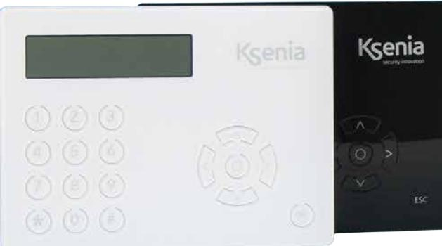
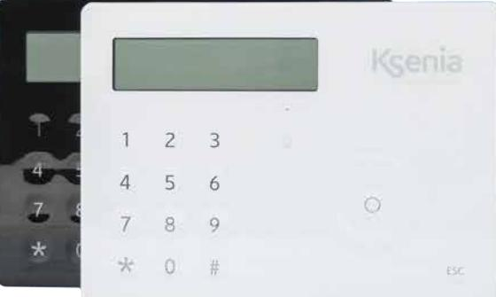

**ergo**

**ergo S**

## Produktbeskrivning **ergo M**

**ergo M** är en robust manöverpanel med mekaniska knappar och en stor grafisk display. Manöverpanelen finns i vitt eller svart utförande.

**ergo M**

## Produktbeskrivning **ergo S**

**ergo S** är en manöverpanel med touchknappar och en stor grafisk display. Manöverpanelen har inbyggd RFID-läsare som stödjer Ksenia-, mifare- och NFC-brickor. Den har dessutom inbyggd temperaturgivare och högtalare för röstmeddelanden. Manöverpanelen finns i vitt eller svart utförande.

#### Funktioner:

- Visar systemstatus.
- Visar funktionsparametrar (datum/tid, operatör och signalstyrka GSM, temperatur, m.m.)
- Systemkommandon (borta eller hemma tillkoppling, återställning, aktivering av utgångar, m.m.)
- Programmering av systemparametrar.
- Programmering av lokala parametrar (ljudvolym,
- bakgrundsbelysning)
- Mifare ISO 14443 A och B (endast ergo S)
- inbyggd temperaturgivare (endast ergo S)

### Teknisk specifikation **ergo S** och **ergo M**

| Strömförsörjning       | 13,8 VDC (Via KS-BUS).  |
|------------------------|-------------------------|
| Strömförbrukning       | 15 mA vila, 400 mA max. |
| Arbetstemperatur       | +5 to +40 °C.           |
| Ingångar/utgångar      | Nej.                    |
| Mifare (endast ergo S) | ISO 14443 A och B.      |
| Mått                   | 163 x 119 x 14,5 mm.    |
| IP klass               | IP34.                   |
| Vikt                   | 240 g.                  |

# Beställningsinformation

| Produkt                   | Beställningsnr |
|---------------------------|----------------|
| Manöverpanel ergo M vit   | 12090          |
| Manöverpanel ergo M svart | 12091          |
| Manöverpanel ergo S vit   | 12092          |
| Manöverpanel ergo S svart | 12093          |