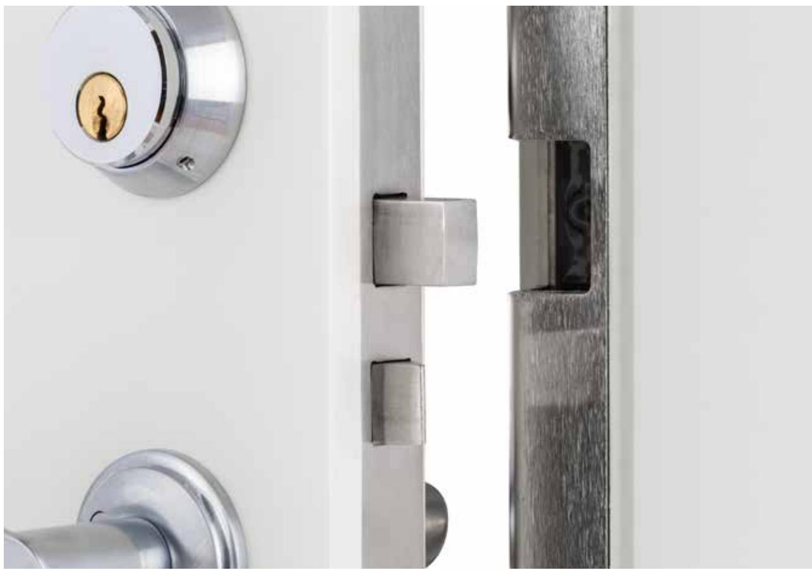

# Montering & Funktion **Compact**

Det svensktillverkade låssystemet

# Tack & välkommen

Vi på Exma Säkerhetssystem AB vill tacka dig för att du valt oss och hälsa dig välkommen som kund. Du är nu ägare av ett svensktillverkat lås av absolut högsta kvalitet.

| Produktbeskrivning  4                                 |
|-------------------------------------------------------------|
| Innehåll i standardförpackning 5                         |
| Val av stolpe  6                                      |
| Förteckning över stolpar för olika typer av låshus  7 |
| Montering av stolpe på motorslutbleck 8                  |
| Installation steg för steg 9                             |
| Montering 10                                             |
| Måttangivelser11                                            |
| Teknisk specifikation11                                     |
| Inkoppling på skruvplint 12                              |
| Fjädervred 13                                            |
| Vridbegränsare 13                                        |
| Service och underhåll 14                                 |
| Felsökning 15                                            |
| Stolpguide 16                                            |

#### **Produktbeskrivning Produktbeskrivning**

Exma Compact är ett motorslutbleck som erbjuder en stabil låsanordning och klarar de allra högsta kraven i SS-EN 14846:2008 gällande "brythållfasthet och borrskydd"(4.9). Det är konstruerat för att fungera säkert i besvärliga miljöer under lång tid och håller för slitage långt utöver det antal låsningscykler som gäller för denna låsstandard (se nedan). Vid installationer där krav på skydd mot elektronisk manipulation föreligger ska Exma Compact är ett motorslutbleck som erbjuder en stabil låsanordning och klarar de allra högsta kraven i SS-EN 14846:2008 gällande "brythållfasthet och borrskydd"(4.9). Det är konstruerat för att fungera säkert i besvärliga miljöer under lång tid och håller för slitage långt utöver det antal låsningscykler som gäller för denna låsstandard (se nedan). Vid installationer där krav på skydd mot elektronisk manipulation föreligger ska Exma Rapid tillsammans med styrenhet A1D och dörrindikering användas.

| 4.3                | 4.4                    | 4.5              | 4.6                       | 4.7           | Exma MiniRead tillsammans med styrenhet DC-3 och dörrindikering användas. 4.8 | 4.9                     | 4.10                   | 4.11                       |
|--------------------|------------------------|------------------|---------------------------|---------------|----------------------------------------------------------------------------------|-------------------------|------------------------|----------------------------|
| Category 4.3    | Durability 4.4      | Door mass 4.5 | Suitability 4.6        | Safety 4.7 | Corrosion 4.8                                                                 | Security 4.9         | Security 4.10       | Security 4.11           |
| of use Category | and load Durability | and Door mass | for use on Suitability | Safety        | resistance, Corrosion                                                         | and drill Security   | electrical Security | electrical Security     |
| of use             | on and load         | closing and   | fire/smoke for use on  |               | temperature resistance,                                                       | resistance and drill | function electrical | manipulation electrical |
|                    | latchbolt on        | force closing | doors fire/smoke       |               | and humidity temperature                                                      | resistance              | function               | manipulation               |
| 3                  | latchbolt C         | force 0       | doors 0                | 0             | and humidity M                                                                | 5                       | 1                      | 0                          |
| 3                  | C                      | 0                | 0                         | 0             | M                                                                                | 5                       | 1                      | 0                          |

Montering av motorslutblecket är enkel tack vare att ingen separat styrenhet behövs samt att montering sker i dörrkarmen utan karmöverföring eller kabeldragning till dörren. Exma Compact kan med fördel användas tillsammans med de flesta av försäkrings-Montering av motorslutblecket är enkel tack vare att ingen separat styrenhet behövs samt att montering sker i dörrkarmen utan karmöverföring eller kabeldragning till dörren. Exma Compact kan med fördel användas tillsammans med de flesta av försäkringsbolagen godkända regel-, fallregel- och hakregellås.

Samtliga nedan angivna komponenter uppfyller RoHS direktivet och elektronik-Samtliga nedan angivna komponenter uppfyller RoHS direktivet och elektronikkomponenterna berörs av WEEE-direktivet.

och ger tillsammans med dörrlägesgivare en impuls till slutblecket att låsa.

#### **Motorslutbleck Exma Compact**

- **Motorslutbleck Exma Compact** - Motorslutbleck med valbar typ av stolpe.
komponenterna berörs av WEEE-direktivet.

bolagen godkända regel-, fallregel- och hakregellås.

- Motorslutbleck med valbar typ av stolpe. - Slutblecket är tillverkat i rostfritt material.
- Slutblecket är tillverkat i rostfritt material. - Slutblecket har härdad låsmekanism som drivs av en motor.
- Slutblecket har härdad låsmekanism som drivs av en motor. - Låsnings- och öppningstid är ca 0,3 sek.
- Låsnings- och öppningstid är ca 0,3 sek. - Regelsensor, placerad i slutbleckets regelöppning känner av när låsets regel är på plats - Regelsensor, placerad i slutbleckets regelöppning känner av när låsets regel är på plats och ger tillsammans med dörrlägesgivare en impuls till slutblecket att låsa.

#### **Stolpe**

**Stolpe** Finns i olika utföranden anpassade till de flesta förekommande lås på marknaden. Vid beställning av Exma Compact måste stolpvariant alltid anges. För varianter av stolpar Finns i olika utföranden anpassade till de flesta förekommande lås på marknaden. Vid beställning av Exma Compact måste stolpvariant alltid anges. För varianter av stolpar se sid.6 och 7.

#### **Extra tillbehör med kort funktionsbeskrivning: Extra tillbehör med kort funktionsbeskrivning:**

#### **Fjädervred** (se sid.13)

se sid.6 och 7.

- **Fjädervred** (se sid.13) - Monteras på låset som vanligt vred och innehåller en fjäder som ser till att låsets regel alltid är utlåst. Med ett fjädervred monterat, erhålls en funktion som är identisk med - Monteras på låset som vanligt vred och innehåller en fjäder som ser till att låsets regel alltid är utlåst. Med ett fjädervred monterat, erhålls en funktion som är identisk med vanligt fallkolvslås, d.v.s bekväm och enkel utpassage med automatisk låsning.
#### vanligt fallkolvslås, d.v.s bekväm och enkel utpassage med automatisk låsning. **Vridbegränsare** (se sid.13)

- **Vridbegränsare** (se sid.13) - Monteras som cylinderförlängare bakom låscylindern. Vridbegränsaren gör det omöjligt att ta ut nyckeln utan att låset är låst. I de fall dörren ska ställas olåst, utförs detta - Monteras som cylinderförlängare bakom låscylindern. Vridbegränsaren gör det omöjligt att ta ut nyckeln utan att låset är låst. I de fall dörren ska ställas olåst, utförs detta elektriskt.
#### elektriskt. **Skyddsbeslag**

- **Skyddsbeslag** - Flera olika modeller av skyddsbeslag finns som tillval.
- Flera olika modeller av skyddsbeslag finns som tillval (se produktkatalog). - Exma Connection Box förenklar din installation och fungerar som avgränsningspunkt.

### **Innehåll i standardförpackning**

**Innehåll i standardförpackning**

Exma Compact levereras i standardförpackning med eller utan förmonterad stolpe. Exma Compact levereras i standardförpackning med eller utan förmonterad stolpe. Bilden nedan visar utan förmonterad stolpe. Stolpen ska vara anpassad till låshus och dörr (se sid.6 och 7).

Bilden nedan visar utan förmonterad stolpe. Stolpen ska vara anpassad till låshus och dörr (se sid.6 och 7). Kontrollera att följande materiel finns i förpackningen:

- Kontrollera att följande materiel finns i förpackningen: 1. Exma Compact motorslutbleck utan stolpe, inkl. 7 st fästskruvar för montage av stolpe (2 st M4x8 rostfri, 4 st M2x4 rostfri, 1 st M6x12 rostfri).
- 1. Exma Compact motorslutbleck utan stolpe, inkl. 7 st fästskruvar för montage av 2. Skyddsbeslag i standardutförande.

2. Skyddsbeslag i standardutförande. 3. Dörrlägesgivare (magnetkontakt).

- stolpe (2 st M4x8 rostfri, 4 st M2x4 rostfri, 1 st M6x12 rostfri). 3. Dörrlägesgivare (magnetkontakt).
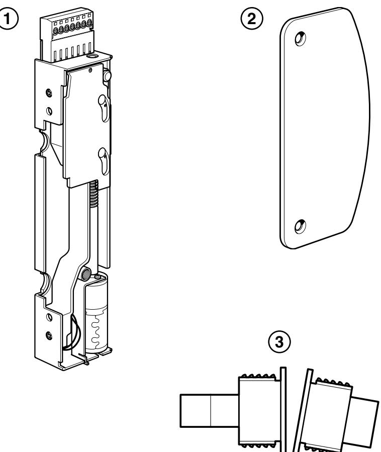

5

5

#### **Val av stolpe Val av stolpe** (se stolpguide på sida 16 )

(se stolpguide på sida 16 )

Exma Compact levereras normalt komplett med förmonterad stolpe. Det finns flera olika modeller av stolpar som är anpassade för de flesta på marknaden förekommande låshus (se sid.7). Vid behov kan denna stolpe bytas mot annan modell hos en av Exmas Exma Compact levereras normalt komplett med förmonterad stolpe. Det finns flera olika modeller av stolpar som är anpassade för de flesta på marknaden förekommande låshus (se sid.7). Vid behov kan denna stolpe bytas mot annan modell hos en av Exmas återförsäljare.

#### återförsäljare. **Slutbleckets utförande framgår av artikelnumret och utläses enligt nedan:**

**Slutbleckets utförande framgår av artikelnumret och utläses enligt nedan:** Första bokstäverna i artikelnumret anger till vilken typ av låshus slutblecket passar.

- Första bokstäverna i artikelnumret anger till vilken typ av låshus slutblecket passar. **R** = Regellås och fallregellås
- **R** = Regellås och fallregellås **H** = Hakregellås (med eller utan fallkolv)

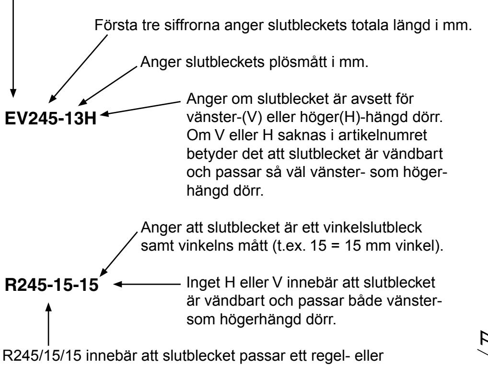

R245/15/15 innebär att slutblecket passar ett regel- eller fallregellås, har 15 mm plösmått och är ett vinkelslutbleck med 15 mm vinkel. Slutblecket är vändbart och passar fallregellås, har 15 mm plösmått och är ett vinkelslutbleck med 15 mm vinkel. Slutblecket är vändbart och passar både höger- och vänsterhängd dörr.

både höger- och vänsterhängd dörr.

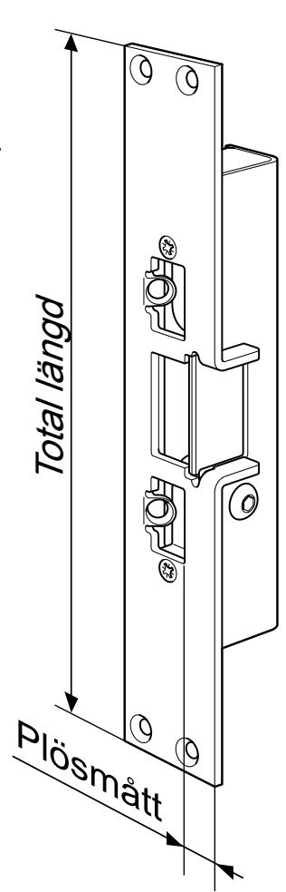

6

6

### **Förteckning över stolpar för olika typer av låshus**

(se stolpguide på sida 16 )

#### **Stolpar för regellås och fallregellås**

- **Total längd Artikelnummer**
	- 245 mm R245-13, R245-16, R245-15-15, R245-15-26
	- 410 mm R410-13V, R410-13H

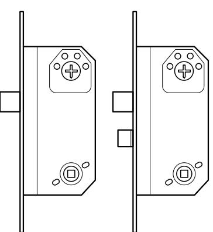

#### **Stolpar för ASSA Evolution och Connect låshus**

|           | Total längd Artikelnummer  |
|-----------|----------------------------|
| 245 mm | EV245-13V, EV245-13H       |
|           | EV245-16-15V, EV245-16-15H |
|           | EV245-15-26V, EV245-15-26H |

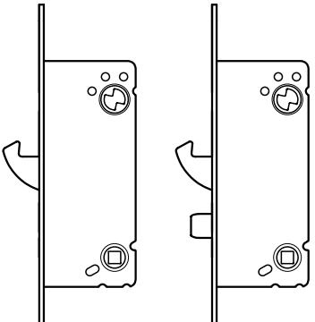

#### **Stolpar för hakregellås**

6

6

återförsäljare.

återförsäljare.

**EV245-13H**

**EV245-13H**

**R** = Regellås och fallregellås

**R** = Regellås och fallregellås

**H** = Hakregellås (med eller utan fallkolv)

**H** = Hakregellås (med eller utan fallkolv)

hängd dörr.

hängd dörr.

både höger- och vänsterhängd dörr.

både höger- och vänsterhängd dörr.

**EV** = ASSA Evolution/Connect regellås och fallregellås

**EV** = ASSA Evolution/Connect regellås och fallregellås

**Val av stolpe**

**Val av stolpe**

(se stolpguide på sida 16 )

(se stolpguide på sida 16 )

Exma Compact levereras normalt komplett med förmonterad stolpe. Det finns flera olika

Exma Compact levereras normalt komplett med förmonterad stolpe. Det finns flera olika

låshus (se sid.7). Vid behov kan denna stolpe bytas mot annan modell hos en av Exmas

låshus (se sid.7). Vid behov kan denna stolpe bytas mot annan modell hos en av Exmas

modeller av stolpar som är anpassade för de flesta på marknaden förekommande

modeller av stolpar som är anpassade för de flesta på marknaden förekommande

**Slutbleckets utförande framgår av artikelnumret och utläses enligt nedan:**

**Slutbleckets utförande framgår av artikelnumret och utläses enligt nedan:**

Första bokstäverna i artikelnumret anger till vilken typ av låshus slutblecket passar.

Första bokstäverna i artikelnumret anger till vilken typ av låshus slutblecket passar.

Första tre siffrorna anger slutbleckets totala längd i mm.

Första tre siffrorna anger slutbleckets totala längd i mm.

Anger att slutblecket är ett vinkelslutbleck samt vinkelns mått (t.ex. 15 = 15 mm vinkel).

Anger att slutblecket är ett vinkelslutbleck samt vinkelns mått (t.ex. 15 = 15 mm vinkel).

Anger om slutblecket är avsett för

Anger om slutblecket är avsett för

Om V eller H saknas i artikelnumret betyder det att slutblecket är vändbart och passar så väl vänster- som höger-

Om V eller H saknas i artikelnumret betyder det att slutblecket är vändbart och passar så väl vänster- som höger-

är vändbart och passar både vänster-

är vändbart och passar både vänster-

Plösmått

Plösmått

Total längd

Total längd

Anger slutbleckets plösmått i mm.

Anger slutbleckets plösmått i mm.

vänster-(V) eller höger(H)-hängd dörr.

vänster-(V) eller höger(H)-hängd dörr.

**R245-15-15** Inget H eller V innebär att slutblecket

**R245-15-15** Inget H eller V innebär att slutblecket

som högerhängd dörr.

som högerhängd dörr.

R245/15/15 innebär att slutblecket passar ett regel- eller fallregellås, har 15 mm plösmått och är ett vinkelslutbleck med 15 mm vinkel. Slutblecket är vändbart och passar

R245/15/15 innebär att slutblecket passar ett regel- eller fallregellås, har 15 mm plösmått och är ett vinkelslutbleck med 15 mm vinkel. Slutblecket är vändbart och passar

|           | Total längd Artikelnummer |  |  |
|-----------|---------------------------|--|--|
| 245 mm | H245-13V, H245-13H        |  |  |
|           | H245-16V, H245-16H        |  |  |
|           |                           |  |  |

410 mm H410-13V, H410-13H

**Obs!** *Vid montering tillsammans med låshus ASSA 13787 smalprofillås ska vänsterutförande användas vid högerhängd dörr och högerutförande användas vid vänsterhängd dörr. D.v.s. H245-13V ska användas vid högerhängd dörr och H245-13H ska användas vid vänsterhängd dörr (gäller ej stolparna H410).*

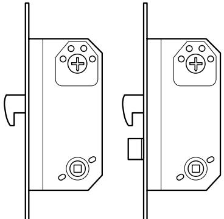

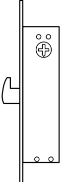

7

## **Montering av stolpe på motorslutbleck**

- 1. Se till att motorenhetens drivmutter/vagga (A) befinner sig i helt öppet läge. Vaggan kan vid behov flyttas med en skruvmejsel i motoraxelns skruvspår (B):
- 2. Placera bladfjädern (C) på vaggans nitar enligt bilden nedan.
- 3. Placera därefter spärrsliden (D) på vaggnitarna.
- 4. Med spärrsliden i detta läge kan valfri stolpe monteras. Håll med hjälp av tummen spärrsliden på plats vid montering. Vinkla stolpen och tryck fast spärrsliden med kanten på stolpen och låt därefter stolpen glida in i sin position, hela tiden med tryck på spärrsliden. Kontrollera att motorfästet ligger korrekt i sitt läge och att inga kablar kläms.
- 5. Skruva fast stolpen med de medföljande skruvarna i följande ordning: 2 st M4x8 rostfri (E), 4 st M2x4 rostfri (F), 1 st M6x12 rostfri (G)

#### **Fjädervredsfunktion**

Vid leverans öppnar slutblecket automatiskt då låsets regel försvinner ur stängt slutbleck och dörren öppnas. Denna funktion ska alltid användas när dörren är försedd med fjädervred. Om denna funktion ej önskas klipps byglingen (H) av.

**Obs!** Endast de skruvar som medlevereras för fastsättning av stolpe får användas. Om andra skruvar används kan dessa skada motorslutblecket.

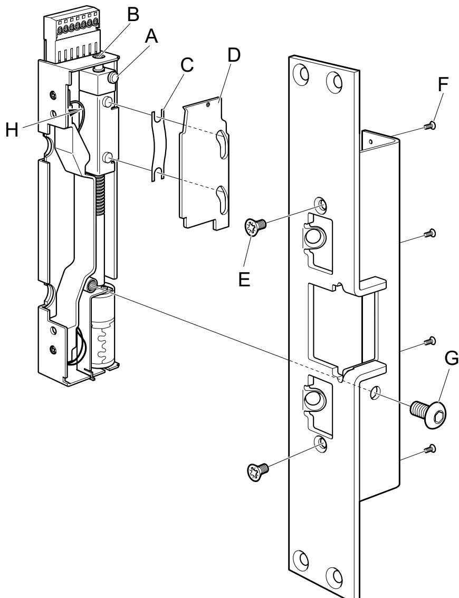

### **Installation steg för steg Installation steg för steg**

- 1. Tillse att Exma Compact matas med 24V DC stabiliserad och filtrerad likspänning. Felaktig matningsspänning kan orsaka allvarliga skador på motorslutblecket. Vid lägre temperatur än -25°C, exempelvis i grindar eller andra utsatta miljöer där kyla och fukt kan påverka motorslutbleckets funktioner, rekommenderas värmefolie för att 1. Tillse att Exma Compact matas med 24V DC stabiliserad och filtrerad likspänning. Felaktig matningsspänning kan orsaka allvarliga skador på motorslutblecket. Vid lägre temperatur än -25°C, exempelvis i grindar eller andra utsatta miljöer där kyla och fukt kan påverka motorslutbleckets funktioner, rekommenderas värmefolie för att undvika driftstörningar.
- undvika driftstörningar. 2. Kontrollera att rätt stolpe är monterad på motorslutblecket. Stolpen ska vara anpassad till lås och dörr (se sid.6 och 7). Vid otäta karmpartier där vatten kan rinna in i profilen och därmed tränga in i slutblecket, ska karmpartiet tätas. Kontrollera att dörren funge rar korrekt och att dörrspringan överensstämmer med dörrtillverkarens rekommendatio ner. Vid aktiva dubbeldörrar ska dörrkordinator monteras för att säkerställa att dörrarna 2. Kontrollera att rätt stolpe är monterad på motorslutblecket. Stolpen ska vara anpassad till lås och dörr (se sid.6 och 7). Vid otäta karmpartier där vatten kan rinna in i profilen och därmed tränga in i slutblecket, ska karmpartiet tätas. Kontrollera att dörren funge rar korrekt och att dörrspringan överensstämmer med dörrtillverkarens rekommendatio ner. Vid aktiva dubbeldörrar ska dörrkordinator monteras för att säkerställa att dörrarna stängs i rätt ordning.
- stängs i rätt ordning. 3. Montera Exma Compact i karmen med låsets regel centrerad i slutblecket. För att erhålla maximal styrka i låsförbandet vid montering i träkarmar ska de 3. Montera Exma Compact i karmen med låsets regel centrerad i slutblecket. För att erhålla maximal styrka i låsförbandet vid montering i träkarmar ska de långa fästskruvarna monteras i c:a 60 graders vinkel (se sid.10).
- långa fästskruvarna monteras i c:a 60 graders vinkel (se sid.10). 4. Som installationskabel används med fördel patchkabel Cat5 (partvinnad).
- 4. Som installationskabel används med fördel patchkabel Cat5 (partvinnad). 5. Anslut dörrsensor till skruvplinten. Givaren ska vara sluten vid stängd dörr. Använd med fördel den dörrmagnet som ingår i standard-förpackningen. Montera den skruvplintförsedda delen på lämpligt ställe i karmen och anslut kablarna i motorslutblecket. Montera magnetdelen i dörren mitt för den karmmonterade delen. Borra ett 19 mm hål för respektive del. Känselavståndet för magnetkontakten är c:a 40 mm i omagnetiskt material som aluminium, rostfritt eller trä, och c:a 20 mm i magnetiskt material (stål).Om avståndet mellan dörr och karm är så stort att indikering inte erhålls, 5. Anslut dörrsensor till skruvplinten. Givaren ska vara sluten vid stängd dörr. Använd med fördel den dörrmagnet som ingår i standard-förpackningen. Montera den skruvplintförsedda delen på lämpligt ställe i karmen och anslut kablarna i motorslutblecket. Montera magnetdelen i dörren mitt för den karmmonterade delen. Borra ett 19 mm hål för respektive del. Känselavståndet för magnetkontakten är c:a 40 mm i omagnetiskt material som aluminium, rostfritt eller trä, och c:a 20 mm i magnetiskt material (stål).Om avståndet mellan dörr och karm är så stort att indikering inte erhålls, kan det vara nödvändigt att byta magnetkontakten till annan typ av givare.
- kan det vara nödvändigt att byta magnetkontakten till annan typ av givare. 6. Prova före spänningssättning, att dörrlåset går att låsa upp med nyckel.
- 6. Prova före spänningssättning, att dörrlåset går att låsa upp med nyckel. 7. Spänningsätt motorslutblecket.

**Montering av stolpe på motorslutbleck**

1. Se till att motorenhetens drivmutter/vagga (A) befinner sig i helt öppet läge.

2. Placera bladfjädern (C) på vaggans nitar enligt bilden nedan.

3. Placera därefter spärrsliden (D) på vaggnitarna.

kläms.

**Fjädervredsfunktion** Vid leverans öppnar

byglingen (H) av.

slutblecket automatiskt då låsets regel försvinner ur stängt slutbleck och dörren öppnas. Denna funktion ska alltid användas när dörren är försedd med fjädervred. Om denna funktion ej önskas klipps

**Obs!** Endast de skruvar som medlevereras för fastsättning av stolpe får användas. Om andra skruvar används

kan dessa skada motorslutblecket.

Vaggan kan vid behov flyttas med en skruvmejsel i motoraxelns skruvspår (B):

4. Med spärrsliden i detta läge kan valfri stolpe monteras. Håll med hjälp av tummen spärrsliden på plats vid montering. Vinkla stolpen och tryck fast spärrsliden med kanten på stolpen och låt därefter stolpen glida in i sin position, hela tiden med tryck på spärrsliden. Kontrollera att motorfästet ligger korrekt i sitt läge och att inga kablar

A

B

C

D

E

G

F

5. Skruva fast stolpen med de medföljande skruvarna i följande ordning: 2 st M4x8 rostfri (E), 4 st M2x4 rostfri (F), 1 st M6x12 rostfri (G)

H

- 7. Spänningsätt motorslutblecket. 8. Tillse att låsets regel är utlåst och kontrollera att slutblecket låser när dörren stängs.
- 8. Tillse att låsets regel är utlåst och kontrollera att slutblecket låser när dörren stängs. 9. Kontrollera att slutblecket öppnar när öppnasignal skickas.
- 9. Kontrollera att slutblecket öppnar när öppnasignal skickas. 10. Om dörrens överfals ej täcker urtaget för låsregeln i karmen, ska skyddsbeslag monteras på dörren. Detta för att undvika klämrisk och onödiga driftstörningar 10. Om dörrens överfals ej täcker urtaget för låsregeln i karmen, ska skyddsbeslag monteras på dörren. Detta för att undvika klämrisk och onödiga driftstörningar orsakade av att föremål stoppas in i mekanismen.

#### orsakade av att föremål stoppas in i mekanismen. **Installation tillsammans med dörrautomatik**

**Installation tillsammans med dörrautomatik** Om Exma Compact ska installeras tillsammans med dörrautomatik måste funktionen öppningsfördröjning finnas och användas i dörrautomatiken. Detta för Om Exma Compact ska installeras tillsammans med dörrautomatik måste funktionen öppningsfördröjning finnas och användas i dörrautomatiken. Detta för att Exma Compact ska hinna öppna innan dörrautomatiken startar.

att Exma Compact ska hinna öppna innan dörrautomatiken startar.

## **Montering**

Exma Compact monteras i dörrkarmen på samma sätt som ett vanligt mekaniskt- eller elektroniskt slutbleck. Vid otäta karmpartier där vatten kan rinna in i profilen och därmed tränga in i slutblecket, ska karmpartiet tätas. För att erhålla korrekt brythållfasthet ska de medlevererade skruvarna användas enligt nedan.

#### **Vid montage i stål eller aluminiumkarmar**

4 st skruvar M5x10 (A)

#### **Vid montage i träkarmar**

- 1.) Skruva först fast slutblecket med 4 st skruvar (B).
- 2.) Skruva sedan i de 2 skruvarna (C) i 60° vinkel.

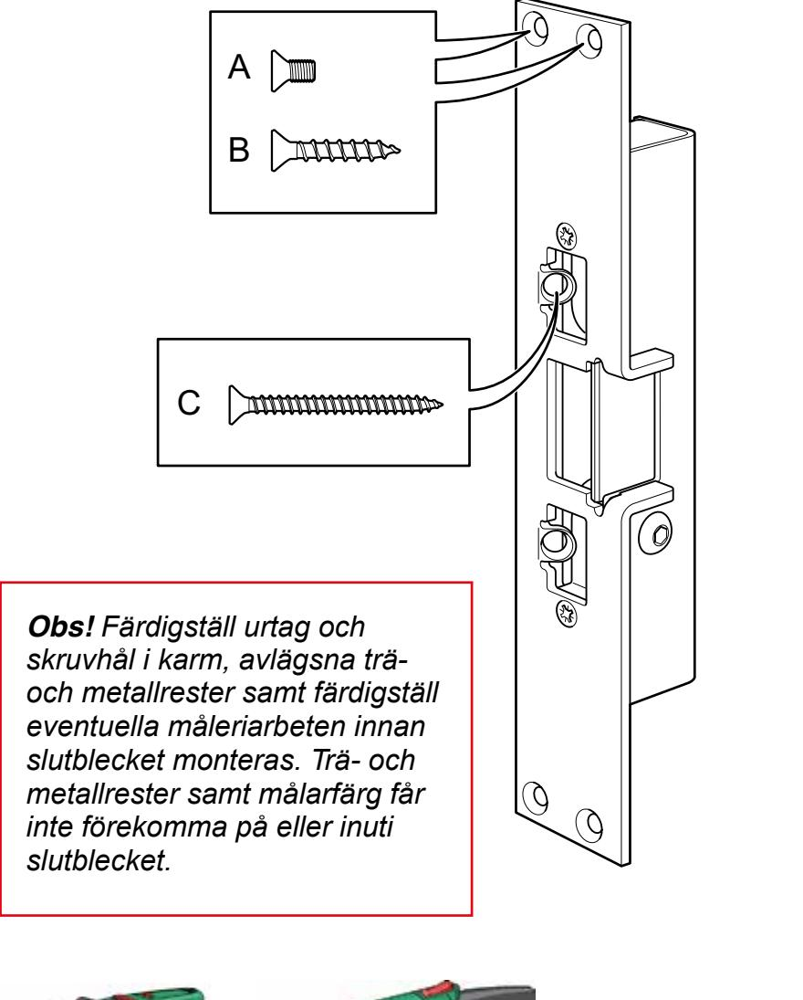

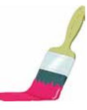

**Ej spån eller slipdamm! Ej målarfärg!**

#### **Måttangivelser Måttangivelser**

Urtag i dörrkarm ska vara minst 200 mm på höjden, centrerat från regelöppningen, detta för att skruvplint och kabelanslutningar ska få plats. Djupet på urtaget ska vara minst Urtag i dörrkarm ska vara minst 200 mm på höjden, centrerat från regelöppningen, detta för att skruvplint och kabelanslutningar ska få plats. Djupet på urtaget ska vara minst 39 mm om stolpen fälls in och minst 36 mm om den monteras utanpå dörrkarmen.

39 mm om stolpen fälls in och minst 36 mm om den monteras utanpå dörrkarmen.

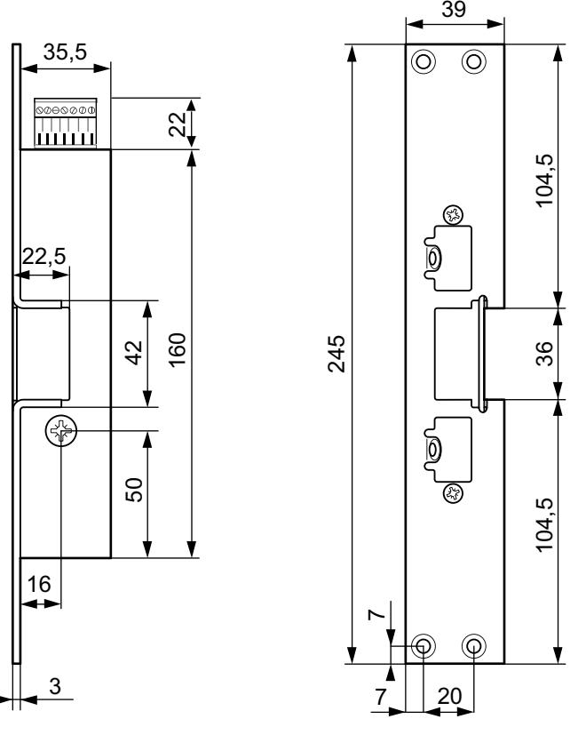

20

7

A

4 st skruvar M5x10 (A)

**Vid montage i träkarmar**

medlevererade skruvarna användas enligt nedan.

1.) Skruva först fast slutblecket med 4 st skruvar (B). 2.) Skruva sedan i de 2 skruvarna (C) i 60° vinkel.

**Vid montage i stål eller aluminiumkarmar**

**Montering**

**Ej spån eller slipdamm! Ej målarfärg!**

Exma Compact monteras i dörrkarmen på samma sätt som ett vanligt mekaniskt- eller elektroniskt slutbleck. Vid otäta karmpartier där vatten kan rinna in i profilen och därmed tränga in i slutblecket, ska karmpartiet tätas. För att erhålla korrekt brythållfasthet ska de

B

C

**Obs!** *Färdigställ urtag och skruvhål i karm, avlägsna träoch metallrester samt färdigställ eventuella måleriarbeten innan slutblecket monteras. Trä- och metallrester samt målarfärg får inte förekomma på eller inuti* 

*slutblecket.*

Måttskissen visar Exma Compact med stolpe R245-13 monterad. För måttskisser på övriga stolpar se Exma MiniRead produktinformation och Måttskissen visar Exma Compact med stolpe R245-13 monterad. För måttskisser på övriga stolpar se Exma MiniRead produktinformation och installationsanvisning.

installationsanvisning.

#### **Teknisk specifikation**

|                                                  | Teknisk specifikation                                                                    |  |  |  |
|--------------------------------------------------|------------------------------------------------------------------------------------------|--|--|--|
| Drivspänning:                                    | 24V DC +/-15% stabiliserad och filtrerad likspänning                                     |  |  |  |
| Strömförbrukning: Drivspänning:               | I vila 35mA vid 24V 24V DC +/-15% stabiliserad och filtrerad likspänning              |  |  |  |
| Strömförbrukning:                                | Vid gång 400mA I vila 35mA vid 24V                                                    |  |  |  |
|                                                  | Motorstart(20mS) 1600mA vid 24V Vid gång 400mA                                        |  |  |  |
| Temperaturområde: -25°C - + 70°C                 | Motorstart(20mS) 1600mA vid 24V                                                          |  |  |  |
| Låsningstid: Temperaturområde: -25°C - + 70°C | ca 0,3 sek vid 24V DC                                                                    |  |  |  |
| Reläutgång: Låsningstid:                      | Brytförmåga: 500mA, 50V ca 0,3 sek vid 24V DC                                         |  |  |  |
| Reläutgång:                                      | Kontaktresistens: < 50mOhm Brytförmåga: 500mA, 50V                                    |  |  |  |
| Kontaktdon:                                      | 7-polig skruvplint(jackbar) samt stiftanslutning för jord. Kontaktresistens: < 50mOhm |  |  |  |

Kontaktdon: 7-polig skruvplint(jackbar) samt stiftanslutning för jord.

### **Inkoppling på skruvplint Inkoppling på skruvplint**

#### **Inkoppling av drivspänning**

**Inkoppling av drivspänning** Ansluts till plint 1 = + 24V DC stabiliserad och filtrerad likspänning Ansluts till plint 1 = + 24V DC stabiliserad och filtrerad likspänning Ansluts till plint 2 = 0V

Ansluts till plint 2 = 0V **Obs!** *stabiliserad likspänning. Tillse att Exma Compact matas med 24V DC* **Obs!** Tillse att Exma Compact matas med 24V **Obs!** *stabiliserad likspänning. Tillse att Exma Compact matas med 24V DC* **Obs!** Tillse att Exma Compact matas med 24V DC stabiliserad och filtrerad likspänning.

#### DC stabiliserad och filtrerad likspänning. **Öppnasignal med slutning (tryckknapp)**

**Öppnasignal med slutning (tryckknapp)** Anslut en bygel mellan plint 1 och 3. Anslut därefter en potentialfri slutning (tryckknapp) till Anslut en bygel mellan plint 1 och 3. Anslut därefter en potentialfri slutning (tryckknapp) till plint 2 och 4.

#### **Öppnasignal med spänning**

plint 2 och 4.

**Öppnasignal med spänning** 10 - 30V AC/DC kan anslutas direkt på plint 3 och 4. Anslutningen är polaritetsoberoende. Om öppnasignal ska dras längre än 30 m bör 10 - 30V AC/DC kan anslutas direkt på plint 3 och 4. Anslutningen är polaritetsoberoende. Om öppnasignal ska dras längre än 30 m bör denna signal ske med spänning.

#### **Dörrlägesgivare (magnetkontakt)**

denna signal ske med spänning.

**Dörrlägesgivare (magnetkontakt)** Ansluts till plint 1 och 5. Använd med fördel den dörrmagnet som ingår i Ansluts till plint 1 och 5. Använd med fördel den dörrmagnet som ingår i standard-förpackningen.

#### **Reläslutning vid låst**

standard-förpackningen.

**Reläslutning vid låst** Ansluts till plint 6 och 7. Ansluts till plint 6 och 7. Dörr stängd, regel på plats i låst slutbleck.

Dörr stängd, regel på plats i låst slutbleck.

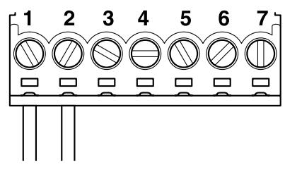

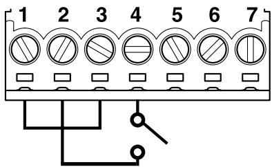

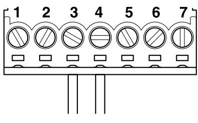

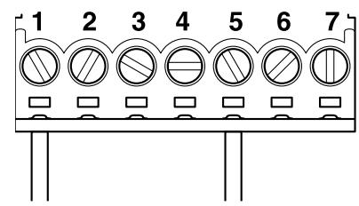

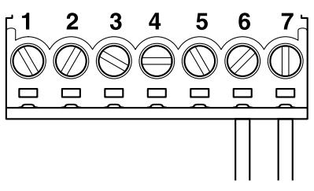

#### **Jordstift**

**Jordstift Obs!** Exma Compact ska alltid ansluts till skyddsjord. Detta skyddar produkten mot transienter. Om jord inte är ansluten på ett korrekt sätt kan det innebära drift-**Obs!** Exma Compact ska alltid ansluts till skyddsjord. Detta skyddar produkten mot transienter. Om jord inte är ansluten på ett korrekt sätt kan det innebära driftstörningar och att elektroniken helt upphör att fungera.

störningar och att elektroniken helt upphör att fungera.

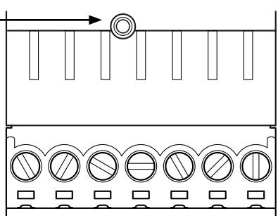

# **Fjädervred**

**Inkoppling på skruvplint**

**Inkoppling på skruvplint**

**Inkoppling av drivspänning**

**Inkoppling av drivspänning**

filtrerad likspänning Ansluts till plint 2 = 0V

filtrerad likspänning Ansluts till plint 2 = 0V

**Obs!**

**Obs!**

plint 2 och 4.

plint 2 och 4.

Ansluts till plint 1 = + 24V DC stabiliserad och

Ansluts till plint 1 = + 24V DC stabiliserad och

**Öppnasignal med slutning (tryckknapp)**

DC stabiliserad och filtrerad likspänning.

DC stabiliserad och filtrerad likspänning.

**Öppnasignal med slutning (tryckknapp)**

Anslut en bygel mellan plint 1 och 3.

Anslut en bygel mellan plint 1 och 3.

**Öppnasignal med spänning**

**Öppnasignal med spänning**

Anslutningen är polaritetsoberoende.

Anslutningen är polaritetsoberoende.

denna signal ske med spänning.

denna signal ske med spänning.

**Dörrlägesgivare (magnetkontakt)**

**Dörrlägesgivare (magnetkontakt)**

Ansluts till plint 1 och 5.

Ansluts till plint 1 och 5.

standard-förpackningen.

standard-förpackningen.

**Reläslutning vid låst** Ansluts till plint 6 och 7.

**Reläslutning vid låst** Ansluts till plint 6 och 7.

**Jordstift**

**Jordstift**

Om öppnasignal ska dras längre än 30 m bör

Om öppnasignal ska dras längre än 30 m bör

Använd med fördel den dörrmagnet som ingår i

Använd med fördel den dörrmagnet som ingår i

Dörr stängd, regel på plats i låst slutbleck.

Dörr stängd, regel på plats i låst slutbleck.

**Obs!** Exma Compact ska alltid ansluts till skyddsjord. Detta skyddar produkten mot transienter. Om jord inte är ansluten på ett korrekt sätt kan det innebära driftstörningar och att elektroniken helt upphör att fungera.

**Obs!** Exma Compact ska alltid ansluts till skyddsjord. Detta skyddar produkten mot transienter. Om jord inte är ansluten på ett korrekt sätt kan det innebära driftstörningar och att elektroniken helt upphör att fungera.

*stabiliserad likspänning. Tillse att Exma Compact matas med 24V DC*

*stabiliserad likspänning. Tillse att Exma Compact matas med 24V DC*

**Obs!** Tillse att Exma Compact matas med 24V

**Obs!** Tillse att Exma Compact matas med 24V

Anslut därefter en potentialfri slutning (tryckknapp) till

Anslut därefter en potentialfri slutning (tryckknapp) till

10 - 30V AC/DC kan anslutas direkt på plint 3 och 4.

10 - 30V AC/DC kan anslutas direkt på plint 3 och 4.

Fjädervred kan användas till de flesta godkända regel-, hakregel- och fallregellås. Fjädervredet ersätter det vanliga vredet och ser till att låsets regel automatiskt låses ut direkt efter verkställd öppning. Till hakregellås av smalprofiltyp används 2048VV eller 2048VH, till fallregellås och regellås används 1084VV eller 1084VH. För val av vänster eller högervridning se bilder nedan.

- Vredspaken är ställbar i olika lägen. Fjädervred med förlängd grön vredspak finns som tillval.
- För dörrar med hög användningsfrekvens rekommenderas öppning med tryckknapp istället för fjädervred.

*Obs! Tillsammans med ASSA Evolution/Connect låshus kan fjädervred endast användas om blindcylinder monteras. Om låscylinder ska monteras måste fjädervred Exma 122 användas.*

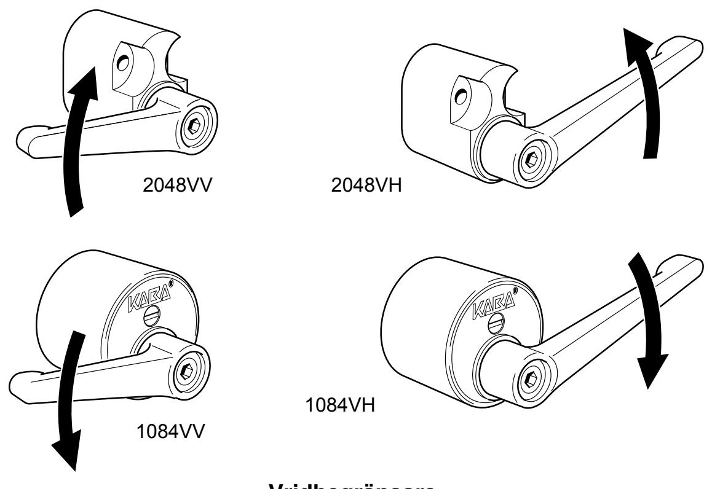

### **Vridbegränsare**

Vridbegränsare monteras under låscylindern och förhindrar att nyckeln kan tas ur cylindern i olåst läge. Finns i två varianter, 1084VB för montage under rund cylinder (regel- och fallregellås) och 2048VB för montage under ovalcylinder (hakregellås).

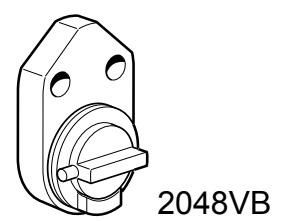

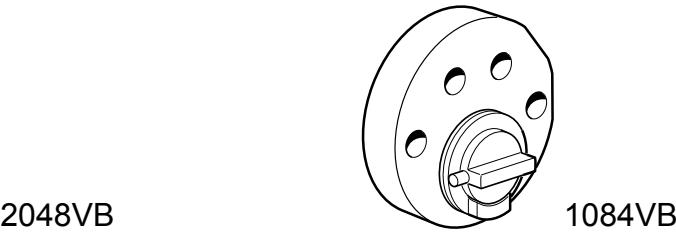

## **Service och underhåll**

**Service och underhåll**

Exma Compact är konstruerad för att fungera i besvärliga miljöer under lång tid. Den är testad och uppfyller de högsta kraven enligt SS-EN 14846:2008 vad gäller slitage (över 200 000 låsningscykler). För att erhålla en störningsfri funktion ska Exma Compact regelbundet smörjas. Serviceintervallerna är beroende av miljö och användarfrekvens. Smörjning ska utföras minst var 50 000 öppningscykel, alternativt minst var sjätte Exma Compact är konstruerad för att fungera i besvärliga miljöer under lång tid. Den är testad och uppfyller de högsta kraven enligt SS-EN 14846:2008 vad gäller slitage (över 200 000 låsningscykler). För att erhålla en störningsfri funktion ska Exma Compact regelbundet smörjas. Serviceintervallerna är beroende av miljö och användarfrekvens. Smörjning ska utföras minst var 50 000 öppningscykel, alternativt minst var sjätte månad eller oftare vid behov.

månad eller oftare vid behov. **Smörjning:** Smörj motoraxeln med t.ex Kaba Cleaner. Detta kan endast utföras när slutblecket är i öppet läge. Spraya t.ex Kaba Cleaner i det styrspår för sliden, som vid **Smörjning:** Smörj motoraxeln med t.ex Kaba Cleaner. Detta kan endast utföras när slutblecket är i öppet läge. Spraya t.ex Kaba Cleaner i det styrspår för sliden, som vid öppet slutbleck är synligt i botten på regelöppningen.

öppet slutbleck är synligt i botten på regelöppningen.  **Obs!** Applicera smörjmedel varsamt

 **Obs!** Applicera smörjmedel varsamt

**Rengöring:** Vid behov (starkt nedsmutsad produkt) kan rengöring vara nödvändig. **Rengöring:** Vid behov (starkt nedsmutsad produkt) kan rengöring vara nödvändig. Vid rengöring måste stolpen monteras bort från slutblecket.

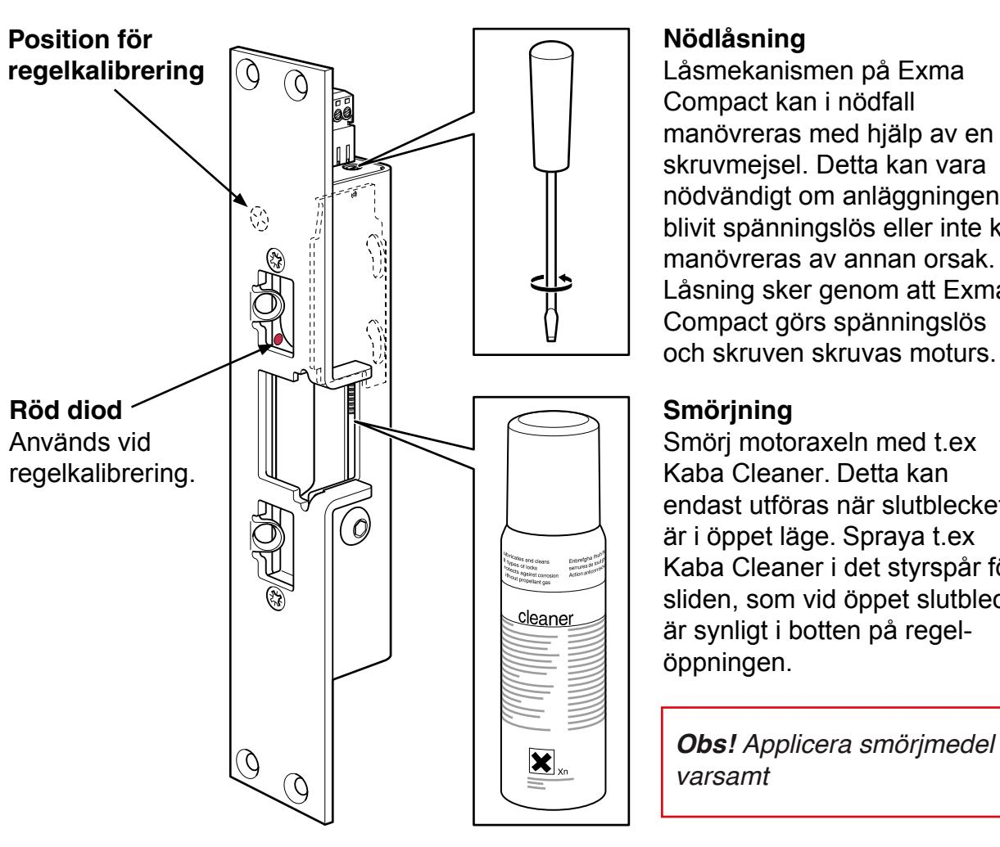

#### **Nödlåsning**

**Nödlåsning** Låsmekanismen på Exma Compact kan i nödfall manövreras med hjälp av en skruvmejsel. Detta kan vara nödvändigt om anläggningen blivit spänningslös eller inte kan manövreras av annan orsak. Låsning sker genom att Exma Låsmekanismen på Exma Compact kan i nödfall manövreras med hjälp av en skruvmejsel. Detta kan vara nödvändigt om anläggningen blivit spänningslös eller inte kan manövreras av annan orsak. Låsning sker genom att Exma Compact görs spänningslös och skruven skruvas moturs.

#### och skruven skruvas moturs. **Smörjning**

**Smörjning** Smörj motoraxeln med t.ex Kaba Cleaner. Detta kan endast utföras när slutblecket är i öppet läge. Spraya t.ex Kaba Cleaner i det styrspår för sliden, som vid öppet slutbleck Smörj motoraxeln med t.ex Kaba Cleaner. Detta kan endast utföras när slutblecket är i öppet läge. Spraya t.ex Kaba Cleaner i det styrspår för sliden, som vid öppet slutbleck är synligt i botten på regelöppningen.

**Obs!** Applicera smörjmedel varsamt

# **Felsökning**

### **Problem Kontroll/åtgärd**

- Slutblecket låser ej.
**Service och underhåll**

**Service och underhåll**

Exma Compact är konstruerad för att fungera i besvärliga miljöer under lång tid. Den är testad och uppfyller de högsta kraven enligt SS-EN 14846:2008 vad gäller slitage (över 200 000 låsningscykler). För att erhålla en störningsfri funktion ska Exma Compact regelbundet smörjas. Serviceintervallerna är beroende av miljö och användarfrekvens. Smörjning ska utföras minst var 50 000 öppningscykel, alternativt minst var sjätte

Exma Compact är konstruerad för att fungera i besvärliga miljöer under lång tid. Den är testad och uppfyller de högsta kraven enligt SS-EN 14846:2008 vad gäller slitage (över 200 000 låsningscykler). För att erhålla en störningsfri funktion ska Exma Compact regelbundet smörjas. Serviceintervallerna är beroende av miljö och användarfrekvens. Smörjning ska utföras minst var 50 000 öppningscykel, alternativt minst var sjätte

**Smörjning:** Smörj motoraxeln med t.ex Kaba Cleaner. Detta kan endast utföras när slutblecket är i öppet läge. Spraya t.ex Kaba Cleaner i det styrspår för sliden, som vid

**Smörjning:** Smörj motoraxeln med t.ex Kaba Cleaner. Detta kan endast utföras när slutblecket är i öppet läge. Spraya t.ex Kaba Cleaner i det styrspår för sliden, som vid

**Rengöring:** Vid behov (starkt nedsmutsad produkt) kan rengöring vara nödvändig.

**Rengöring:** Vid behov (starkt nedsmutsad produkt) kan rengöring vara nödvändig.

**Nödlåsning**

**Nödlåsning**

**Smörjning**

**Smörjning**

öppningen.

öppningen.

varsamt

varsamt

Låsmekanismen på Exma Compact kan i nödfall

Låsmekanismen på Exma Compact kan i nödfall

manövreras med hjälp av en skruvmejsel. Detta kan vara nödvändigt om anläggningen blivit spänningslös eller inte kan manövreras av annan orsak. Låsning sker genom att Exma Compact görs spänningslös och skruven skruvas moturs.

manövreras med hjälp av en skruvmejsel. Detta kan vara nödvändigt om anläggningen blivit spänningslös eller inte kan manövreras av annan orsak. Låsning sker genom att Exma Compact görs spänningslös och skruven skruvas moturs.

Smörj motoraxeln med t.ex Kaba Cleaner. Detta kan endast utföras när slutblecket är i öppet läge. Spraya t.ex Kaba Cleaner i det styrspår för sliden, som vid öppet slutbleck är synligt i botten på regel-

Smörj motoraxeln med t.ex Kaba Cleaner. Detta kan endast utföras när slutblecket är i öppet läge. Spraya t.ex Kaba Cleaner i det styrspår för sliden, som vid öppet slutbleck är synligt i botten på regel-

**Obs!** Applicera smörjmedel

**Obs!** Applicera smörjmedel

månad eller oftare vid behov.

månad eller oftare vid behov.

**Position för regelkalibrering**

**Position för regelkalibrering**

**Röd diod** Används vid regelkalibrering.

**Röd diod** Används vid regelkalibrering.

 **Obs!** Applicera smörjmedel varsamt

 **Obs!** Applicera smörjmedel varsamt

öppet slutbleck är synligt i botten på regelöppningen.

öppet slutbleck är synligt i botten på regelöppningen.

Vid rengöring måste stolpen monteras bort från slutblecket.

Vid rengöring måste stolpen monteras bort från slutblecket.

- Kontrollera att låsets regel är på plats och har minst 12 mm ingrepp i slutblecket.
- Kontrollera att dörrlägesgivaren(magnetkontakten) är korrekt monterad, samt att avståndet inte är mer än 10 mm mellan enheterna.
- Kontrollera att regelsensorn indikerar låsregel.
- Tillse att inte kontinuerlig öppnasignal föreligger.
- Slutblecket öppnar ej.
- Slutblecket försöker låsa men vänder och öppnar igen. Försöket upprepas ytterligare en gång.
- 
- Slutblecket öppnar ej när Kontrollera dörrlägesgivaren.
- Kontrollera att öppnasignal erhålls på korrekt sätt.
- Kontrollera slutbleckets fysiska montering. Slutblecket försöker låsa men når inte ändläget. Detta kan orsakas av för hårt åtdragen "sidskruv" i slutblecket, skadad stolpe på slutblecket eller annat fysikt hinder för lås mekanismen.
	- Kan även innebära dålig strömförsörjning (se nedan).
- Slutbleckets öppnacykel är Strömförsörjningen är lägre än 24V DC. Slutbleckets längre än 0,3 sekunder. hastighet påverkas av drivspänningen som ska vara 24V DC stabiliserad likspänning.
	- Kontrollera att det inte förekommer spänningsfall i anläggningen.
	-
	- dörren öppnas med fjädervred. Kontrollera att fjädervredsbygeln inuti slutblecket inte är avklippt.
		- Kontrollera så att det inte finns någon skada eller åverkan på kretskortet (i gjutmassan).
- efter en kort tids användning. likspänning.
- låsregel och dörrlägesgivare är på plats.

**Obs!** *Regelavkänning är fabriksinställd vid leverans för bästa funktion. Regelkalibrering ska endast utföras vid problem.*

- Slutblecket upphör att fungera Kontrollera att drivspänningen är 24V DC stabiliserad
	- Fungerar åter efter att spänning Kontrollera att slutblecket är korrekt anslutet till jord. varit bortkopplad. Detta skyddar slutblecket mot elektriska störningar som t. ex. ESD (se sid.12).
- Slutblecket låser fast låsregel ej Regelavkänningsfel kalibrera om slutblecket: är på plats alt. låser ej fast 1. Öppna dörren. 2. Håll en metallbit ca. 7 mm ut från kretskortet, centrerat i regelhålet - visa samtidigt en magnet vid positionen för regelavkänning (se sid.14). En röd diod tänds då upp, håll kvar magneten tills dioden slocknat(i ca. 3 sek.). Stäng dörren och prova att rätt funktion erhålls.
	- Om felet kvarstår kontrollera att det inte finns någon åverkan/skada i gjutmassan på kretskortet.

# **Stolpguide**

#### Matris förklaringar kombinationer av låstyp och monteringsstolpe till Exma Rapid motorslutbleck.

| Regeltyp | Låstyp DORMA                                                                                                                                                                   | Låstyp ASSA                                                                       | Låstyp KABA/MU           | Monteringsstolpe för vänsterhängd dörr                                              | Monteringsstolpe för högerhängd dörr                                                |
|----------|--------------------------------------------------------------------------------------------------------------------------------------------------------------------------------|-----------------------------------------------------------------------------------|-----------------------------|-------------------------------------------------------------------------------------------|-------------------------------------------------------------------------------------------|
|          | Tello Regellås Dorma DL912 Dorma DL712 Speciallås Dorma DL502* Tillhållarlås Dorma DL5029*                                                                   | Assa 565 Assa 8765 Assa 2588 Assa 8788 Assa 9788                      | 1216 1219 1241 316 | R245/13** R245/16** R245/15/15** R245/15/26** R410/13-V                       | R245/13** R245/16** R245/15/15** R245/15/26** R410/13-H                       |
|          | Tello Hakregellås Dorma DL903* Dorma DL913 Dorma DL 9132 Smalprofil Hakregellås Dorma DL8030* Tillhållarlås hakregel smalprofil Dorma DL8039* | Assa 2587 Assa 7787 Assa 9787                                               | 1248 1249                | H245/13-V H245/16-V H410/13-H*** H245/20-V                                       | H245/13-H H245/16-H H410/13-V*** H245/20-H                                       |
|          | Tello 2 Hakregellås Dorma DL909* Dorma DL919 Dorma DL9197 Dorma DL7197 Dorma DL7137 Dorma DL9192                                                          |                                                                                   |                             | D245/13-V D245/16-V                                                                    | D245/13-H D245/16-H                                                                    |
|          | Smalprofillås DL803*                                                                                                                                                        | Smalprofillås Assa 13787                                                       |                             | H245/13-H H245/16-H H410/13-V***                                                    | H245/13-V H245/16-V H410/13-H***                                                    |
|          |                                                                                                                                                                                | Abloy LC100                                                                       |                             | F245/10                                                                                   | F245/10                                                                                   |
|          |                                                                                                                                                                                | Assa 310 Assa 311 Assa 410 Assa 411 Assa 710 Assa 711 Assa 2002 |                             | EV245/13-V EV245/16-V EV245/20-V EV245/16/15-V EV245/19/15-V EV245/15/26-V | EV245/13-H EV245/16-H EV245/20-H EV245/16/15-H EV245/19/15-H EV245/15/26-H |
|          |                                                                                                                                                                                | Assa 511                                                                          |                             | EV245-13X-V EV245-16/15X-V                                                             | EV245-13X-H EV245-16/15x-H                                                             |

| Regeltyp | Låstyp DORMA                                                             | Låstyp ASSA | Låstyp KABA/MU | Monteringsstolpe för vänsterhängd dörr | Monteringsstolpe för högerhängd dörr |
|----------|--------------------------------------------------------------------------|-------------|-------------------|----------------------------------------------|--------------------------------------------|
|          | Blindstolpe används t.ex. vid förberedande installationer       |             |                   |                                              |                                            |
|          | Mekanisk- stolpinsats passar samtliga av våra monteringsstolpar |             |                   |                                              |                                            |

#### **Förklaringar**

- * lås utan tryckesfunktion
- ** Symmetrisk
- (kan användas både till vänster och högerfunktion)
- *** Används tillsammans med lås utan tryckesfunktion.
- ROT-stolpe efter KABA Delta

R = Rakregel H = Hakregel D = Dorma Tello 2 Hakregel EV = Evolution/Connect Hakregel V = Vänster H = Höger

245 eller 410 = Längd i mm 245/**15** = Plösmått 245/15/**26** = Bredd på vinkel

**Obs!** Att fallås eller dubbelfallås EJ kan användas. Vid andra, ej ovannämnda låstyper kontakta oss för konsultering

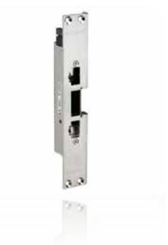

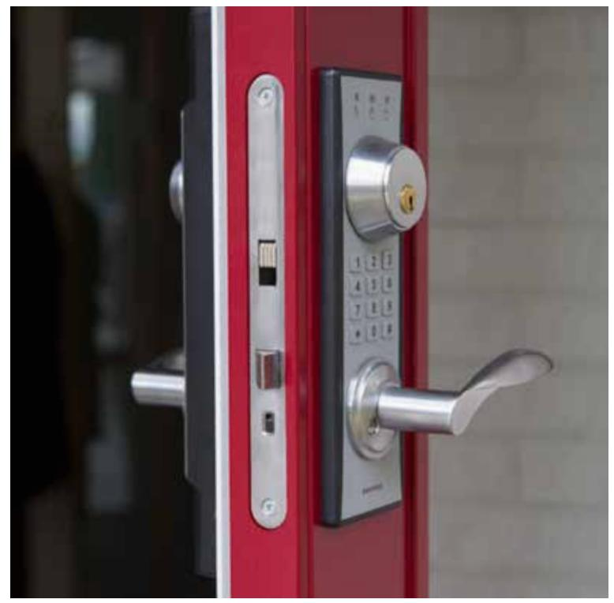

#### Företaget

Exma Säkerhetssystem AB startade sin verksamhet i Eskilstuna 1986 och har under åren vuxit sig till en central del inom framtagandet av säkra lås, till både bostäder och högsäkerhetsanläggningar. Redan från början specialiserade vi oss på att bli experter inom mekaniska och elektroniska lås samt passersystem.

Vår kompetens etablerade oss snabbt och vi har, sedan länge, djupgående samarbeten med andra aktörer inom branschen. Vi flyttar fram positionerna för användarvänliga lås av högsta kvalitet avseende såväl hållbarhet som säkerhet.

