# MotionCam (PhOD) Jeweller User Manual

Updated August 3, 2022

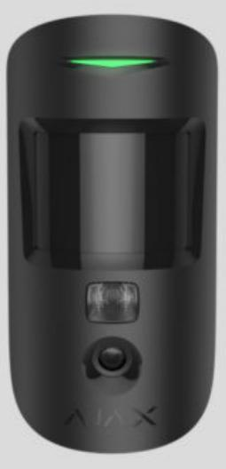

**MotionCam (PhOD) Jeweller** is a wireless motion detector supporting photo verification of alarms, **Photo on Demand**, and **Photo by Scenario** features. Intended for indoor installation. It can recognise movement at a distance of up to 12 meters. Ignores pets when installed and set up correctly.

A hub is required for the detector to operate.

List of compatible hubs and range extenders

MotionCam (PhOD) Jeweller works as part of the Ajax security system, communicating with the hub over two secure radio protocols: the detector uses Jeweller to transmit alarms and events and Wings to transmit photos. The hub communication range is up to 1,700 meters in an open space.

Buy MotionCam (PhOD) Jeweller motion detector

A without the support of Photo on Demand and Photo by Scenario is also available. version of the detector

# Functional elements

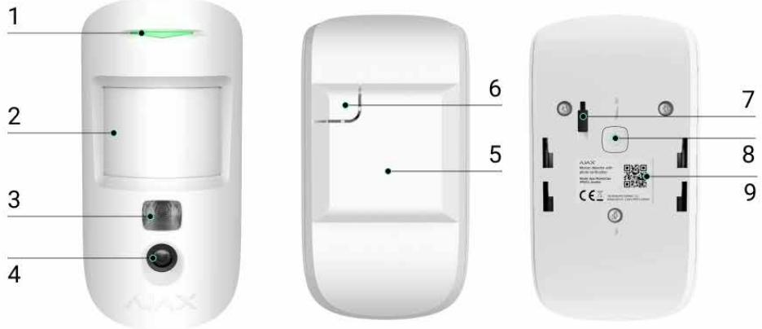

- **1.** LED indicator.
- **2.** Motion detector lens.
- **3.** Infrared backlight. Used to take photos in dark and low-light conditions.
- **4.** Camera.
- **5.** SmartBracket mounting panel. To remove the panel, slide it down.
- **6.** Perforated part of the mounting panel. Necessary to trigger a tamper in case of any attempt to detach the detector from the surface. Do not break it off!
- **7.** . Triggers when an attempt is made to detach the detector from the surface or remove it from the mounting panel. Tamper button
- **8.** Power button of the detector.
- **9.** Detector QR code. Used to connect to the Ajax security system.

### Compatible hubs and range extenders

MotionCam (PhOD) Jeweller requires a hub to operate. The list of compatible hubs and range extenders is available in the table below:

| Hubs Radio signal range extenders |
|--------------------------------------|
|                                      |

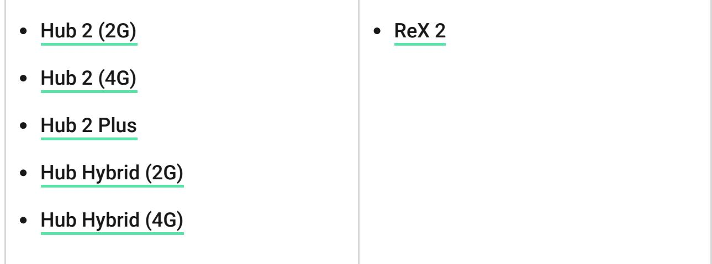

Connection to other , , and is not provided. hubs radio signal range extenders ocBridge Plus uartBridge

### Operating principle

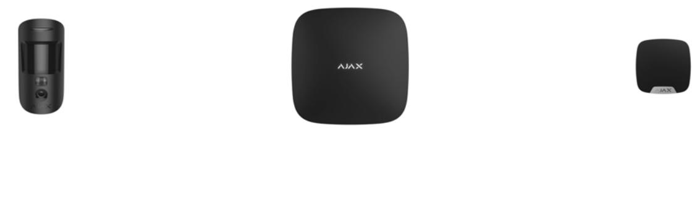

00:00 00:12

MotionCam (PhOD) Jeweller is a wireless motion detector supporting photo verification. It detects movement in the secure area with an infrared sensor by capturing moving objects with a temperature close to the human body. After a motion is detected, the built-in camera takes a series of photos, allowing you to dynamically assess what is happening at the site, saving users from unnecessary anxiety and security companies from false calls of patrol.

When an armed detector identifies motion, it instantly sends an alarm to the hub, which activates the sirens connected to the system, triggers , and notifies users and the security company. All MotionCam (PhOD) Jeweller alarms and events are recorded in the notification feed of the Ajax app. scenarios

Users know exactly where motion is detected. The notifications contain the hub name (name of the secured facility), name of the device, and to which the detector is assigned. virtual room

#### How does Ajax notify users about alarms

Learn more about Ajax motion detectors

# Photo verification

Photo verification allows you to assess what is happening in the secured facility with a built-in camera, which can take from 1 to 5 images with a resolution of 160 × 120 and 320 × 240, as well as up to 3 images with a resolution of 640 × 480 pixels. With photo verification, you can receive visual confirmations of alarms from MotionCam (PhOD) Jeweller and other Ajax devices. You can also check the situation: find out what the children are doing, check if your pet is OK, or simply monitor the situation at home.

The detector has an infrared backlight for shooting in the dark, which activates with insufficient light. MotionCam (PhOD) Jeweller takes black and white photos when shooting in these conditions.

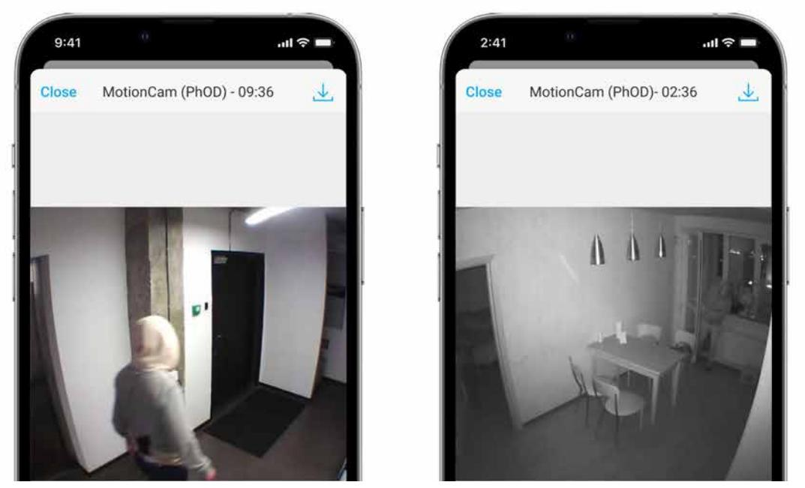

00:00 00:03

There are three types of photo verification: photo by alarm, photo by scenario, and photo on demand.

### Photo by Alarm

If the Photo by Alarm option is configured in the MotionCam (PhOD) Jeweller settings, the detector alarms in the Ajax apps are accompanied by photos or an animated series, depending on the selected viewing mode. The detector takes a photo only when armed.

> The detector does not switch to the armed mode instantly. The switching time depends on two factors: the exit delay (specified in the detector settings) and the hub–detector ping interval (hub settings, **Jeweller** section).

In the first case, the delay is set by an administrator or a PRO user with system configuration rights. In the second case, the delay occurs because the hub takes one ping interval to notify the detector about the security mode changing.

Click on the MotionCam (PhOD) Jeweller alarm notification in the event feed to view the photos. Photos are available to all users with access to the event feed.

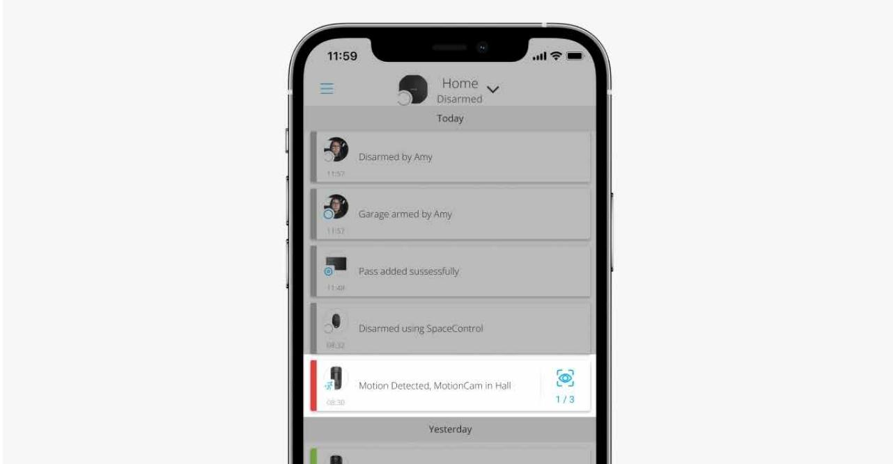

A series of photos are played back in the application as animation. It helps to evaluate the unfolding of the incident over time. You can also view all the photos individually by clicking on the icon at the bottom of the screen.

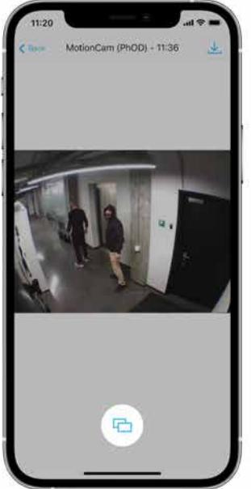

You can save photo verification as video or images by clicking the download icon.

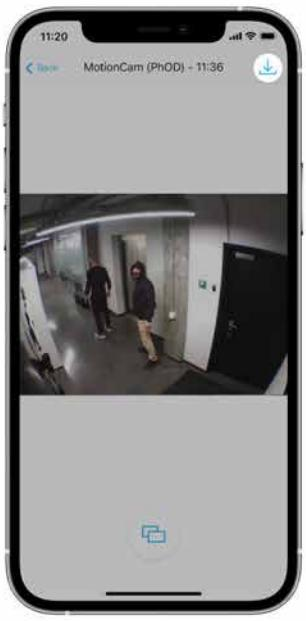

Features of alarm photo verification

Photo on Demand

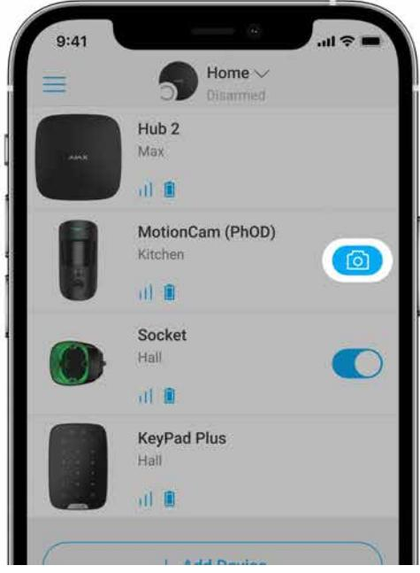

Photo on Demand feature allows users to take pictures with the built-in cameras of detectors with photo verification. With this feature, you can check the situation at the facility: find out what the children are doing, check if your pet is OK, or simply monitor the situation at home. Depending on the settings, photos can be taken at any time or when MotionCam (PhOD) Jeweller is armed.

By default, the Photo on Demand feature is disabled for all users. Users with the right to manage privacy settings (hub settings, **Privacy** section) determine who can take and view photos on demand and which detectors with photo verification can take pictures. PRO users cannot manage privacy settings, but they can take photos on demand if granted such permission.

Privacy settings do not apply to photos taken by detectors triggered in case of an alarm. All system users who have access to the hub event feed can view the photos taken in case of an alarm.

Photos on demand are not sent to the security company monitoring station.

 users can take and view photos on demand only from a personal account if a hub administrator has granted them the appropriate access rights. Taking and viewing photos on demand is not available for a security company profile in the PRO Desktop app. PRO Desktop

#### More about the Photo on Demand feature

How to set Photo on Demand

### Photo by Scenario

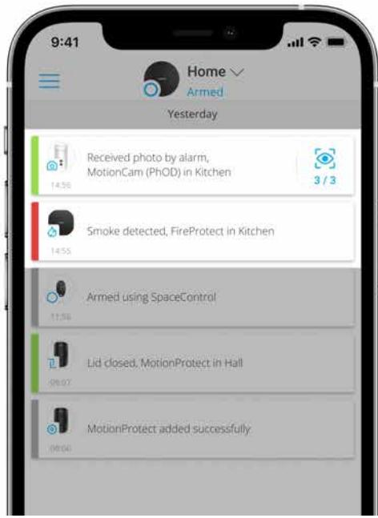

The Photo by Scenario feature allows you to create a scenario for motion detectors with photo verification, according to which they will take pictures in case of alarm from other Ajax devices.

By default, the Photo by Scenario feature is disabled for all detectors. A user with access to privacy settings can enable this feature. Users of PRO apps cannot manage the privacy settings, but can grant this right to any user of the system.

In the system settings, you can also set exactly when a detector with photo verification can take pictures according to a scenario: at any time or when MotionCam (PhOD) Jeweller is armed.

Photos by scenario are available to all users of the system with access to the event feed. The event of taking a photo after the alarm from other devices is sent to the security company monitoring station via SIA (DC-09) and other proprietary protocols. The event code is 730.

The photos taken by scenario are available to the CMS engineers if the CMS software supports photo verification. Photos by scenario are also available in the app. PRO Desktop

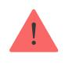

Photos by scenario will not be sent to the CMS if only a with the monitoring station is used. direct connection

More about the Photo by Scenario feature

How to set Photo on Scenario

# Jeweller and Wings data transfer protocols

Jeweller and Wings are two-way wireless data transfer protocols that provide fast and reliable communication between hub and devices. The detector uses Jeweller to transmit alarms and events. Wings are used to transmit photos.

Both protocols support encryption and authentication to prevent forgery. Connection with devices is monitored via a system of hub–detector polls. Their statuses are displayed in real-time in the Ajax apps. The polling frequency is set by a user or a PRO with system configuration rights.

Learn more

# Photo delivery time

The photo delivery time to Ajax apps depends on the selected resolution, detector connection to the radio signal range extender, Wings signal strength, and the Internet connection speed. The alarm messages are delivered immediately.

|                               | Delivery time*                          |                                                                                      |                                                                                          |  |
|-------------------------------|-----------------------------------------|--------------------------------------------------------------------------------------|------------------------------------------------------------------------------------------|--|
| Photo resolution              | When connected directly to the hub** | When connected to the hub using ReX 2 (ReX 2 transmits photos via Wings)*** | When connected to the hub using ReX 2 (ReX 2 transmits photos via Ethernet)**** |  |
| 160 × 120 pixels              | up to 6 seconds                         | up to 8 seconds                                                                      | up to 6 seconds                                                                          |  |
| 320 × 240 pixels (default) | up to 9 seconds                         | up to 18 seconds                                                                     | up to 10 seconds                                                                         |  |
| 640 × 480 pixels              | up to 17 seconds                        | up to 31 seconds                                                                     | up to 17 seconds                                                                         |  |

*The detector needs up to 3 seconds to start the Photo on Demand shooting. ** The delivery time of one photo when the signal strength between the hub and the detector is 2–3 bars and the hub is connected via Ethernet, Wi-Fi or 4G. *** Values were calculated with a signal strength of 3 bars between ReX 2 and the detector or between the hub and ReX 2. The hub works via Ethernet, Wi-Fi or 4G. **** Values were calculated with a signal strength of 3 bars between ReX 2 and the detector. The hub is connected via Ethernet, Wi-Fi or 4G.

### Temperature compensation

The detector perceives people and other objects as heat spots. The device monitors these heat spots and, if they move, registers an alarm. Under ideal conditions, the human body temperature (36.6°C on average) differs from the ambient temperature, and their contrast allows the motion detector to accurately record the movement of a person.

In situations where the ambient temperature is very close to the human body temperature, the detector may not work properly and may give false alarms. Temperature compensation is used in all Ajax motion detectors, so MotionCam (PhOD) Jeweller detects motion over the entire operating temperature range.

#### Learn more about temperature compensation

#### Pet immunity

When properly installed and configured, MotionCam (PhOD) Jeweller does not react to animals up to 50 centimeters tall and weighing up to 20 kilograms.

The detector is installed **at a height of 2.4 meters** without any obstruction to its view — for example, in the corner of the room, where the view won't be blocked by closets or other furniture.

The correct setting also requires a proper choice of the detector sensitivity:

- **High** the detector does not respond to cats (up to 25 cm tall).
- **Medium** it does not respond to small dogs (up to 35 cm tall).
- **Low** it does not respond to animals up to 50 cm tall.

If MotionCam (PhOD) Jeweller is installed below the recommended height, then the animals will move in the hypersensitive zone. The detector can raise the alarm if a dog walks on its hind legs or jumps on an armchair. It will also raise the alarm if the animal can jump to the level of the detector or move near it.

#### Why motion detectors react to animals and how to avoid this

How to install MotionCam (PhOD) Jeweller correctly

# Sending events to the monitoring station

The Ajax security system can transmit alarms to the Ajax PRO Desktop monitoring app as well as the central monitoring station (CMS) in the formats of **Sur-Gard (Contact ID)**, **SIA (DC-09), ADEMCO 685**, and other proprietary protocols. A complete list of supported protocols is . available here

More about the Ajax PRO Desktop monitoring app

Which CMSs can the Ajax security system be connected to

#### **MotionCam (PhOD) Jeweller can transmit the following events:**

- **1.** Motion alarm.
- **2.** MotionCam (PhOD) visual alarm verifications.
- **3.** Photo by Scenario.
- **4.** Tamper alarm / recovery.
- **5.** Loss / restoration of connection with the hub.
- **6.** Temporary deactivation / activation of the detector.
- **7.** Unsuccessful attempt to arm the security system (with the enabled). system integrity check

Photos on demand are not sent to the security company monitoring station.

 users can take and view photos on demand only from a personal account if a hub administrator has granted them the appropriate access rights. Taking and PRO Desktop

When an alarm is received, the operator of the security company monitoring station knows exactly what happened and where to send the rapid action team. The addressability of each Ajax device allows you to send not only events to PRO Desktop or CMS but also the type of the device, its name, and the virtual room to which the detector is assigned. Note that the list of transmitted parameters may differ depending on the type of CMS and the selected protocol for communication with the monitoring station.

The ID and the number of the device can be found in its . states in the Ajax app

Photos are sent to the security company monitoring station if the CMS software supports photo verification. A list of such CMSs is . At the same time, supports receiving photo verification without additional setup. available here Ajax PRO Desktop

# Adding to the system

#### Before adding a device

- **1.** Install the Ajax or Ajax PRO app.
- **2.** Create an if you don't have one. Add a compatible hub to the app, make the necessary settings, and create at least one . account virtual room
- **3.** Make sure that the hub is switched on and has Internet access via Ethernet and/or mobile network. You can check the connection in the Ajax app or by looking at the LED on the hub enclosure. It should light up white or green.
- **4.** Make sure that the hub is disarmed and does not start updates by checking its status in the Ajax app.

# How to add MotionCam (PhOD) Jeweller

- **1.** Open the . If your account has access to multiple hubs or if you are using the PRO app, select the hub to which you want to add MotionCam (PhOD) Jeweller. Ajax app
- **2.** Go to the **Devices** tab and click **Add Device**.
- **3.** Name the detector, scan, or type in the **QR code** (placed on the detector enclosure and the package box), select a room and a group (if is enabled). Group mode

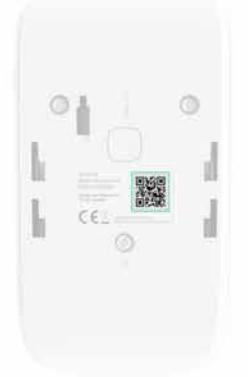

#### **4.** Press **Add**.

- **5.** Switch on the device by holding the power button for 3 seconds.
To connect MotionCam (PhOD) Jeweller to the hub, the detector must be located at the same secured facility as the system (within the range of the hub radio network). For the detector to work via the , you must first add the detector to the hub, then connect it to ReX 2 in the settings of the range extender. ReX 2 radio signal range extender

How to connect a device to ReX 2

The detector connected to the hub will appear in the list of hub devices in the Ajax app. Updating the statuses of devices in the list depends on the Jeweller settings; the default value is 36 seconds.

If the connection fails, turn the detector off and try again in 5 seconds. Note that if the maximum number of devices has already been added to the hub ( ), you will be notified when you try to add a new one. depending on the hub model

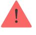

The hub and the device operating at different radio frequencies are incompatible. The radio-frequency range of the device may vary by region. We recommend purchasing and using Ajax devices in the same region. You can check the range of operating radio frequencies with the . technical support service

MotionCam (PhOD) Jeweller only works with one hub. When connected to a new hub, the detector stops sending commands to the old one. When added to a new hub, the detector is not removed from the device list of the old hub. This must be done through the Ajax app.

# Malfunctions

When a malfunction is detected (for example, there is no connection via Jeweller), the Ajax app displays a malfunction counter on the device icon.

All malfunctions are shown in the detector states. Fields with malfunctions will be highlighted in red.

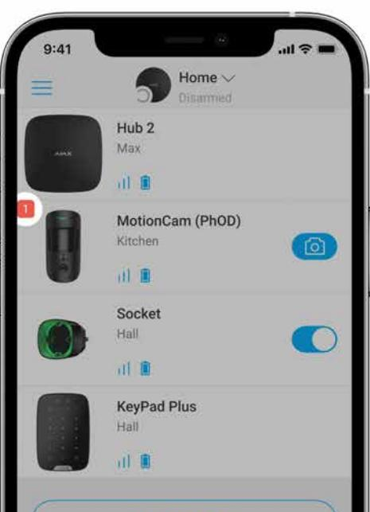

#### **A malfunction is displayed if:**

- The detector temperature is out of acceptable limits: below –10°C and above +40°C.
- The detector enclosure is open (tamper is triggered).
- No connection with the hub or radio signal range extender via Jeweller.
- No connection with the hub or radio signal range extender via Wings.
- The detector battery is low.

### Icons

The icons display some of MotionCam (PhOD) Jeweller states. You can view them in the Ajax app in the **Devices** tab.

| Icon | Meaning                                                                                                                                      |  |  |
|------|----------------------------------------------------------------------------------------------------------------------------------------------|--|--|
|      | Jeweller signal strength. Displays the signal strength between the hub and the detector. The recommended value is 2–3 bars. Learn more |  |  |
|      | Battery charge level of the detector. Learn more                                                                                          |  |  |
|      | The detector has a malfunction. The list of malfunctions is available in the detector states. Learn more                               |  |  |
|      | radio signal range Displayed when the detector is operating via a extender                                                             |  |  |
|      | The detector operates in the Always Active mode. Learn more                                                                               |  |  |
|      | Entry and/or exit delay is enabled.                                                                                                          |  |  |
|      | Learn more                                                                                                                                   |  |  |
|      | MotionCam (PhOD) Jeweller will be armed when Night Mode is enabled. Learn more                                                            |  |  |
|      | MotionCam (PhOD) Jeweller has detected motion. The icon is displayed when the detector is armed.                                          |  |  |

| MotionCam (PhOD) Jeweller is temporarily disabled. Learn more                                              |
|---------------------------------------------------------------------------------------------------------------|
| MotionCam (PhOD) Jeweller has been deactivated due to exceeding the preset number of alarms. Learn more |
| MotionCam (PhOD) Jeweller has tamper triggering events temporarily deactivated. Learn more              |

### States

The states include information about the device and its operating parameters. The states of MotionCam (PhOD) Jeweller can be found in the Ajax app:

**1.** Go to the **Devices** tab.

**2.** Select **MotionCam (PhOD) Jeweller** from the list.

| Parameter                | Value                                                                                                                                                                                                                                                                                          |
|--------------------------|------------------------------------------------------------------------------------------------------------------------------------------------------------------------------------------------------------------------------------------------------------------------------------------------|
| Malfunction              | Clicking on opens the MotionCam (PhOD) Jeweller malfunctions list. The field is displayed if a malfunction is detected.                                                                                                                                                            |
| Temperature              | Detector temperature. It is measured on the processor and changes gradually. The acceptable measurement error between the value in the app and the ambient temperature is 2°C. The value is updated as soon as the detector identifies a temperature change of at least 1°C. |
| Jeweller Signal Strength | Signal strength between the hub or range extender and the detector on the Jeweller                                                                                                                                                                                                          |

|                         | channel. The recommended value is 2–3 bars. Jeweller is a protocol for transmitting                                                |
|-------------------------|---------------------------------------------------------------------------------------------------------------------------------------|
|                         | MotionCam (PhOD) Jeweller events and alarms.                                                                                          |
|                         | Connection status on the Jeweller channel between the hub or the range extender and the detector:                               |
| Connection via Jeweller | Online — the detector is connected to the hub or the range extender.                                                               |
|                         | Offl ine — the detector is not connected to the hub or the range extender.                                                      |
|                         | Signal strength between the hub or the range extender and the detector on the Wings channel. The recommended value is 2–3 bars. |
| Wings Signal Strength   | Wings is a protocol for transmitting MotionCam (PhOD) Jeweller photo verifications.                                                |
|                         | Connection status on the Wings channel between the hub or the range extender and the detector:                                  |
| Connection via Wings    | Online — the detector is connected to the hub or the range extender.                                                               |
|                         | Offl ine — the detector is not connected to the hub or the range extender.                                                      |
|                         | The battery charge level of the device:                                                                                               |
|                         | OK                                                                                                                                    |
|                         | Battery low                                                                                                                           |
| Battery Charge          | When the batteries are low, the Ajax apps and the security company will receive appropriate notifications.                      |
|                         | After sending a low battery notification, the detector can work for up to 2 months.                                                |
|                         | How the battery charge is displayed                                                                                                   |
|                         | Battery life calculator                                                                                                               |

| Lid                                 | The status of the detector tamper that responds to detachment or opening of the device enclosure: Open — the detector was removed from the SmartBracket or its integrity was compromised. Closed — the detector is installed on the SmartBracket mounting panel. The integrity of the device enclosure and the mounting panel is not compromised. Normal state. |
|-------------------------------------|--------------------------------------------------------------------------------------------------------------------------------------------------------------------------------------------------------------------------------------------------------------------------------------------------------------------------------------------------------------------------------------------|
|                                     | Learn more                                                                                                                                                                                                                                                                                                                                                                                 |
|                                     | Delay time when entering: from 5 to 120 seconds.                                                                                                                                                                                                                                                                                                                                        |
| Delay When Entering, sec            | Delay when entering (alarm activation delay) is the time the user has to disarm the security system after entering the secured area.                                                                                                                                                                                                                                                 |
|                                     | Learn more                                                                                                                                                                                                                                                                                                                                                                                 |
|                                     | Delay time when leaving: from 5 to 120 seconds.                                                                                                                                                                                                                                                                                                                                         |
| Delay When Leaving, sec             | Delay when leaving (arming delay) is the time the user has to leave the secured area after the security system arming.                                                                                                                                                                                                                                                               |
|                                     | Learn more                                                                                                                                                                                                                                                                                                                                                                                 |
|                                     | Delay time when entering in the Night Mode: from 5 to 120 seconds.                                                                                                                                                                                                                                                                                                                      |
| Night Mode Delay When Entering, sec | Delay when entering (alarm activation delay) is the time the user has to disarm the security system after entering the premises.                                                                                                                                                                                                                                                     |
|                                     | Learn more                                                                                                                                                                                                                                                                                                                                                                                 |
| Night Mode Delay When Leaving, sec  | Delay time when leaving in the Night Mode: from 5 to 120 seconds.                                                                                                                                                                                                                                                                                                                       |
|                                     | Delay when leaving (arming delay) is the time the user has to leave the premises after the security system arming.                                                                                                                                                                                                                                                                   |

|                        | Learn more                                                                                                                                                                                                                                                                                                                                                                                                                                                                                                                                                                                                    |
|------------------------|---------------------------------------------------------------------------------------------------------------------------------------------------------------------------------------------------------------------------------------------------------------------------------------------------------------------------------------------------------------------------------------------------------------------------------------------------------------------------------------------------------------------------------------------------------------------------------------------------------------|
| Always Active          | When this option is enabled, the detector is constantly armed, detects motion, and raises alarms. Learn more                                                                                                                                                                                                                                                                                                                                                                                                                                                                                         |
| Sensitivity            | Sensitivity level of the motion detector: Low — it does not respond to animals up to 50 cm tall. Normal (by default) — it does not respond to small dogs (up to 35 cm tall). High — the detector does not respond to cats (up to 25 cm tall).                                                                                                                                                                                                                                                                                                                                               |
| Temporary Deactivation | Shows the status of the device temporary deactivation function: No — the device works in the normal mode. Lid only — the hub administrator has disabled notifications about triggering of the device tamper. Entirely — the detector is entirely excluded from the operation of the system. The device does not execute system commands and does not report alarms or other events. By number of alarms — the device is automatically disabled when the preset number of alarms is exceeded (specified in Devices Auto Deactivation the settings). Learn more |
| Photo on Demand        | Displayed if Photo on Demand is enabled in the hub settings in the Privacy section. Learn more                                                                                                                                                                                                                                                                                                                                                                                                                                                                                                          |
| Firmware               | Detector firmware version.                                                                                                                                                                                                                                                                                                                                                                                                                                                                                                                                                                                    |

| ID       | Detector ID. Also available on the QR code on the detector enclosure and its package box. |
|----------|----------------------------------------------------------------------------------------------|
| Device № | Number of the device loop (zone).                                                            |

# Settings

To change MotionCam (PhOD) Jeweller settings in the Ajax app:

- **1.** Go to the **Devices** tab.
- **2.** Select **MotionCam (PhOD) Jeweller** from the list.
- **3.** Go to **Settings** by clicking on the gear icon .
- **4.** Set the required parameters.
- **5.** Click **Back** to save the new settings.

| Settings                 | Value                                                                                                                                      |
|--------------------------|--------------------------------------------------------------------------------------------------------------------------------------------|
| Name                     | Detector name. Displayed in the list of hub devices, SMS text, and notifications in the event feed.                                  |
|                          | To change the detector name, click on the pencil icon                                                                                   |
|                          | The name can contain up to 12 Cyrillic characters or up to 24 Latin characters.                                                         |
| Room                     | Selecting the virtual room to which the MotionCam (PhOD) Jeweller is assigned.                                                          |
|                          | The name of the room is displayed in the SMS text and notifications in the event feed.                                                  |
| Delay When Entering, sec | Delay time when entering: from 5 to 120 seconds.                                                                                        |
|                          | Delay when entering (alarm activation delay) is the time the user has to disarm the security system after entering the secured area. |
|                          | Learn more                                                                                                                                 |

| Delay When Leaving, sec             | Delay time when leaving: from 5 to 120 seconds.                                                                                           |
|-------------------------------------|----------------------------------------------------------------------------------------------------------------------------------------------|
|                                     | Delay when leaving (arming delay) is the time the user has to leave the secured area after the security system arming. Learn more   |
|                                     | If this option is enabled, the detector will go into                                                                                         |
| Arm in Night Mode                   | the armed mode when the system is set to the Night Mode.                                                                                  |
|                                     | Learn more                                                                                                                                   |
| Night Mode Delay When Entering, sec | Delay time when entering in the Night Mode: from 5 to 120 seconds.                                                                        |
|                                     | Delay when entering (alarm activation delay) is the time the user has to disarm the security system after entering the premises.       |
|                                     | Learn more                                                                                                                                   |
|                                     | Delay time when leaving in the Night Mode: from 5 to 120 seconds.                                                                         |
| Night Mode Delay When Leaving, sec  | Delay when leaving (arming delay) is the time the user has to leave the premises after the security system arming.                     |
|                                     | Learn more                                                                                                                                   |
| Alarm LED indication                | When the option is disabled, the LED indicator of the detector doesn't notify about alarms or tamper triggering.                       |
| Sensitivity                         | Sensitivity level of the motion detector.                                                                                                    |
|                                     | The choice depends on the type of the object, the presence of probable sources of false alarms, and the specifics of the secured area: |
|                                     | Low — it does not respond to animals up to 50 cm tall.                                                                                    |
|                                     | Normal (by default) — it does not respond to small dogs (up to 35 cm tall).                                                               |

|                                | High — the detector does not respond to cats (up to 25 cm tall).                                                                                                                                           |
|--------------------------------|---------------------------------------------------------------------------------------------------------------------------------------------------------------------------------------------------------------|
|                                | Why motion detectors react to                                                                                                                                                                                 |
|                                | animals and how to avoid this                                                                                                                                                                                 |
|                                |                                                                                                                                                                                                               |
|                                | Selecting the image resolution (in pixels):                                                                                                                                                                   |
|                                | 160 × 120                                                                                                                                                                                                     |
|                                | 320 × 240 (default)                                                                                                                                                                                           |
|                                | 640 × 480                                                                                                                                                                                                     |
| Image resolution               | The higher the resolution, the more detailed the image is, but it takes longer to transfer the photos. The setting extends to visual alarm verification, photo by scenarios, and photo on demand. |
|                                | Learn more                                                                                                                                                                                                    |
| Photo by Alarm                 | Selecting the number of photos in case of an alarm:                                                                                                                                                        |
|                                | No photo                                                                                                                                                                                                      |
|                                | 1 photo                                                                                                                                                                                                       |
|                                | Series of 2                                                                                                                                                                                                   |
|                                | Series of 3                                                                                                                                                                                                   |
|                                | Series of 4 (only available with 320 × 240 or 160 × 120 resolutions)                                                                                                                                       |
|                                | Series of 5 (only available with 320 × 240 or 160 × 120 resolutions)                                                                                                                                       |
|                                | Applies to MotionCam (PhOD) Jeweler photos by alarm and by scenario.                                                                                                                                       |
| Alarms with photo verification | Selecting the number of alarms accompanied by photos.                                                                                                                                                      |
|                                | You can specify 1 to 10 alarms or set up the                                                                                                                                                                  |
|                                | transmission of a photo each time the device is triggered.                                                                                                                                                 |
|                                | An alarm counter with photo verification is reset when the security system is disarmed and re                                                                                                              |

|                                          | armed. The setting is available if the Always active option is disabled. When the detector is in the Always active mode, it will transmit a photo every time it is triggered.                                                                                                                 |
|------------------------------------------|-----------------------------------------------------------------------------------------------------------------------------------------------------------------------------------------------------------------------------------------------------------------------------------------------------------|
| Photo on Demand                          | Select the number of photos on demand: 1 photo Series of 2 Series of 3 Series of 4 (only available with 320 × 240 or 160 × 120 resolutions) Series of 5 (only available with 320 × 240 or 160 × 120 resolutions)                                                                     |
| Always Active                            | When this option is enabled, the detector is always in the armed mode and detects motion. Learn more                                                                                                                                                                                                |
| Alert with a siren if motion is detected | sirens When this option is enabled, the added to the system are activated when motion is detected by the MotionCam (PhOD) Jeweller.                                                                                                                                                           |
| Scenarios                                | Opens the menu for creating and setting scenarios for the MotionCam (PhOD) Jeweller detector. The menu allows you to create a scenario, according to which the detector will take pictures when other Ajax devices are triggered. Learn more                                            |
| Jeweller Signal Strength Test            | Switches the detector to the Jeweller signal strength test mode. The test allows you to check the signal strength between the hub or the range extender and the detector via the Jeweller wireless data transfer protocol to determine the optimal installation location. Learn more |

|                            | Switches the detector to the Wings signal strength test mode.                                                                                                                                                  |  |  |
|----------------------------|-------------------------------------------------------------------------------------------------------------------------------------------------------------------------------------------------------------------|--|--|
| Wings Signal Strength Test | The test allows you to check the signal strength between the hub or the range extender and the detector via the Wings wireless data transfer protocol to determine the optimal installation location. |  |  |
|                            | Learn more                                                                                                                                                                                                        |  |  |
|                            | Switches the detector to the detection zone test mode.                                                                                                                                                         |  |  |
| Detection Zone Test        | The test enables users to check how the detector responds to movement and determine the optimal installation location.                                                                                      |  |  |
|                            | Learn more                                                                                                                                                                                                        |  |  |
|                            | Switches the detector to the signal attenuation test mode.                                                                                                                                                     |  |  |
| Signal Attenuation Test    | During the test, the transmitter power is decreased or increased to simulate a change in the environment to test the stability of communication between the detector and the hub.                     |  |  |
|                            | Learn more                                                                                                                                                                                                        |  |  |
| User Guide                 | Opens the MotionCam (PhOD) Jeweller User Manual in the Ajax app.                                                                                                                                               |  |  |
| Temporary Deactivation     | Allows the user to disable the device without removing it from the system.                                                                                                                                     |  |  |
|                            | Two options are available:                                                                                                                                                                                        |  |  |
|                            | No                                                                                                                                                                                                                |  |  |
|                            | Entirely — the device does not execute system commands and does not participate in automation scenarios, and the system ignores alarms and other device notifications.                                |  |  |
|                            | Lid only — the system ignores the detector tamper triggering notifications.                                                                                                                                    |  |  |

|               | More about temporary deactivation                                                                                                        |  |  |
|---------------|------------------------------------------------------------------------------------------------------------------------------------------|--|--|
|               | The system can also automatically deactivate devices when the preset number of alarms is exceeded. More about auto deactivation |  |  |
| Unpair Device | Unpairs the detector, disconnects it from the hub, and deletes its settings.                                                          |  |  |

# Setting the Photo on Demand feature

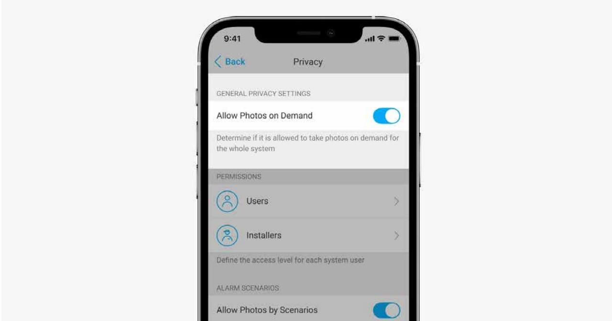

A user with the right to manage privacy settings can enable and configure the Photos on Demand feature. To do this, in the Ajax app:

- **1.** Select the facility if you have several of them.
- **2.** Go to the **Devices** tab and select a hub.
- **3.** Click the gear icon to go to the hub **Settings**.
- **4.** Select the **Privacy** menu and enable the **Allow Photos on Demand** option.
- **5.** Select the user category:
	- Users
	- Installers (PRO app users)
- **6.** Select a specific user or a PRO. A list of cameras, DVRs, and detectors with photo verification added to the hub will open.
- **7.** Select the detector to which you want to provide access.
- **8.** Enable the **Take & View Photo** option.
- **9.** Specify when the user can take on-demand photos: always or when MotionCam (PhOD) is armed.
- **10.** Click **Back** to save the settings.
- **11.** Repeat steps 6–10 for any other detectors to which you want to provide access. The blue icon marks detectors to which the user already has access.

After saving the privacy settings, all users with access to the event feed will receive a notification about who has received access rights, and which user has granted these rights.

# Setting the Photo by Scenario feature

#### How to enable Photo by Scenario

| PERMISSIONS                                                                      |  |
|----------------------------------------------------------------------------------|--|
| Users 0                                                                       |  |
| Installers 26                                                                 |  |
| Define the access level for each system user                                     |  |
| ALARM SCENARIOS                                                                  |  |
| Allow Photos by Scenarios                                                        |  |
| Select if motion detectors are allowed to take photos by fire detectors alarm |  |
| Alarm Scenarios Conditions                                                       |  |
| For already created scenarios, specify when it Is possible to take photos     |  |
|                                                                                  |  |
|                                                                                  |  |

A user with access to privacy settings can enable the Photo by Scenario feature. To do this, in the Ajax app:

- **1.** Select the facility if you have several of them.
- **2.** Go to the **Devices** tab and select a hub.
- **3.** Click on the gear icon to go to the detector **Settings**.
- **4.** Select the **Privacy** menu and enable the **Allow Photos by Scenario** option.
- **5.** Click **Back** to save the settings.

#### How to set up a scenario for taking photos in case of alarms from other devices

Any user or PRO with system configuration rights can create and configure a scenario. To do this:

- **1.** In the Ajax app, select the facility if you have several of them or if you are using a PRO app.
- **2.** Go to the **Devices** tab and select a detector with photo verification.
- **3.** Click on the gear icon to go to the detector **Settings**.
- **4.** Select the **Scenarios** item from the list.
- **5.** Define Ajax devices and the types of alarms for which the MotionCam (PhOD) will take photos.
- **6.** Click **Next**.
- **7.** Specify:
	- Name of the scenario.
	- Number of devices that trigger a scenario (available if there are two or more Ajax devices in the system):

**Any** — the scenario will run if at least one device triggers. **All selected** — the scenario will run if all selected devices trigger.

- Triggering time for all devices (the parameter is available if in the **Devices triggering the scenario** block the **All selected** option is specified).
To start the scenario, all selected devices should raise the alarm within the specified time. If the devices don't raise the alarm within the

specified time, the timer will reset, and the scenario will not run.

- When the detector can take photos: always or when MotionCam (PhOD) is armed. The option is only available to users with the right to manage privacy settings. By default, MotionCam (PhOD) takes photos by scenario only in the armed mode.
- **8.** Click **Save**. The scenario will appear in the list of device scenarios.

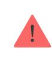

The scenario will not be executed if the **Allow Photos by Scenario** option is disabled in the privacy settings (hub settings, **Privacy** menu.

To delete or edit a scenario, click on it in the list. You can also disable the scenario with a toggle next to the scenario name: its settings will be saved but not executed after the alarm from other devices.

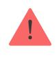

Temporarily disabled (PhOD) detectors cannot take photos by scenario, and temporarily disabled devices do not trigger the scenario for taking photos.

More about temporary deactivation

# Indication

The MotionCam (PhOD) Jeweller LED indicator may light up red or green, depending on the status of the detector.

#### Enabled detector indication

| Indication                                                      | Event                                                                                                                          | Note                                                                                                                                                           |
|-----------------------------------------------------------------|--------------------------------------------------------------------------------------------------------------------------------|----------------------------------------------------------------------------------------------------------------------------------------------------------------|
| Lights up green for 1 second.                                   | Motion alarm/tamper triggering.                                                                                             | The detector records movement once every 5 seconds.                                                                                                      |
| Lights up green for 0.5 seconds.                             | Taking photos on demand.                                                                                                       | When taking a photo on demand, the indicator lights up even if the LED indication is turned off in the detector settings.                          |
| Lights up green for a few seconds.                           | Connecting the detector to the hub.                                                                                         |                                                                                                                                                                |
| Lights up red and blinks after the first activation.         | Hardware error.                                                                                                                | The detector needs to be repaired, please contact our Technical Support                                                                                  |
| In case of an alarm, it slowly lights up green and goes out. | Detector batteries need to be replaced.                                                                                     | The procedure for replacing the batteries is described in How to replace the article the batteries in the MotionCam (PhOD) Jeweller detector |
| Blinks green frequently.                                        | The batteries are completely discharged. The detector stopped detecting motion and transmitting alarms to the hub. | The procedure for replacing the batteries is described in How to replace the article the batteries in the MotionCam (PhOD) Jeweller detector |

### Functionality testing

The Ajax security system provides several types of tests to make sure that installation place is chosen correctly. MotionCam (PhOD) Jeweller tests do not start straight away but not later than over a single hub–detector ping interval (36 seconds by default). You can change the ping interval of devices in the **Jeweller** menu of the hub settings.

#### **To run a test, in the Ajax app:**

- **1.** Select the required hub.
- **2.** Go to the **Devices** tab.
- **3.** Select **MotionCam (PhOD) Jeweller** from the list.
- **4.** Go to **Settings** .
- **5.** Select a test:
	- Jeweller Signal Strength Test
	- Wings Signal Strength Test
	- Detection Zone Test
	- Signal Attenuation Test
- **6.** Run the test.

#### Detector placement

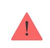

The device is designed for indoor use only.

When choosing where to place MotionCam (PhOD), consider the parameters that affect its operation:

- Motion detection zone.
- The camera's viewing angle and the presence of obstacles in front of it.
- Jeweller and Wings signal strength.
- Distance between the detector and the hub.
- Presence of obstacles for radio signal passage: walls, interfloor ceilings, large objects located in the room.

Consider the recommendations for placement when developing a project for the security system of the facility. The security system must be designed and installed by specialists. A list of recommended partners is . available here

### Signal strength

The Jeweller and Wings signal strength is determined by the number of undelivered or corrupted data packages over a certain period of time. The icon on the **Devices** tab indicates the signal strength:

- **Three bars** excellent signal strength.
- **Two bars** good signal strength.
- **One bar** low signal strength, stable operation is not guaranteed.
- **Crossed out icon** no signal.

Check the Jeweller and Wings signal strength before final installation. With a signal strength of one or zero bars, we do not guarantee stable operation of the device. Consider to relocate the device as repositioning even by 20 cm can significantly improve the signal strength. If there is still poor or unstable signal after the relocation, use radio signal range extender. **MotionCam (PhOD) Jeweller is incompatible with ReX radio signal range extenders**. ReX 2

# Detection zone

When choosing the installation place, consider the direction of the lens, viewing angles of the detector and camera, and the presence of obstacles impairing the view. The intended path of the intruder must be perpendicular to the axis of the detector's lens. Ensure that furniture, house plants, vases, decorative or glass elements do not obstruct the view of the detector.

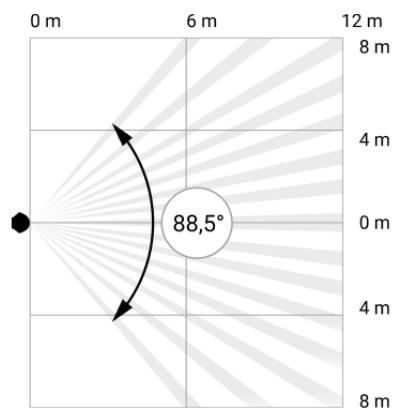

Horizontal viewing angle of the detector

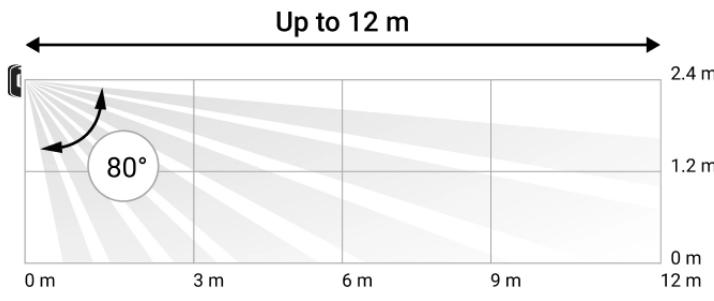

Vertical viewing angle of the detector

When installing the detector, perform the . This allows you to check the operation of the device and accurately determine the sector in which the detector registers motion. Detection Zone Test

Take several photos with MotionCam (PhOD) camera at the installation site to ensure that the detector captures the required area.

# Do not install the detector

- **1.** Outdoors. This can lead to false alarms and detector failure.
- **2.** In the direction where direct sunlight hits the detector lens. This can lead to false alarms.
- **3.** Opposite any objects with rapidly changing temperature like any electric or gas heater. This can lead to false alarms.
- **4.** Opposite any moving objects with a temperature close to the human body. For example, in front of swaying curtains above a radiator. This can lead to false alarms.
- **5.** In places with fast air circulation. For example, near fans, open windows, or doors. This can lead to false alarms.
- **6.** In places where objects and structures can block the detector's view. For example, behind a flower or a column. In this case, the view will be limited, and it will be more difficult for MotionCam (PhOD) to detect motion.
- **7.** In places where glass structures may block the detector's view. MotionCam (PhOD) does not register motion behind glass.
- **8.** Inside premises with temperature and humidity outside the permissible limits. This could damage the detector.

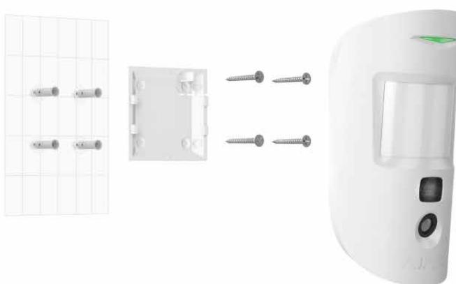

# Installation and connection

Before installing MotionCam (PhOD) Jeweller, ensure that you have selected the optimal location that complies with the requirements of this manual.

#### **To mount a detector:**

- **1.** Remove the SmartBracket mounting panel from the detector by sliding it down.
- **2.** Fix the SmartBracket panel using double-sided tape or other temporary fasteners. The panel can be mounted on a vertical surface or in a corner of the room. **The installation height is 2.4 meters**.

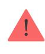

Double-sided tape can only be used for temporary installation. The device attached by the tape may come unstuck from the surface at any time. As long as the device

is taped, the tamper will not be triggered when the device is detached from the surface.

- **3.** Run the and signal strength tests. The recommended signal strength is two or three bars. If the signal strength is low (a single bar), we do not guarantee stable operation of the device. Consider to relocate the device as repositioning even by 20 cm can significantly improve the signal strength. If there is still poor or unstable signal after the relocation, use . Jeweller Wings ReX 2 radio signal range extender
- **4.** Run the . To check the motion detector, walk around the premises while observing the LED and determine the detection zone of the detector. The maximum range of motion detection is 12 meters. If the detector did not respond to movement during the test in 5 out of 5 cases, relocate the device. Detection zone test
- **5.** Take some test photos to make sure that the camera is capturing the required area and no obstacles are blocking its view.
- **6.** SmartBracket has special holes that need to be drilled to fix the panel with the bundled screws. Attach the SmartBracket mounting panel with the bundled screws using all fixation points (one of them is in the perforated part of the mounting panel above the tamper). When using other fasteners, make sure they do not damage or deform the mounting panel.
- **7.** Place the detector on the SmartBracket mounting panel.

#### Maintenance

Check the functioning of the detector on a regular basis. The optimal frequency of checks is once every three months. Clean the device enclosure of dust, cobwebs, and other contaminants as they emerge. Use a soft dry wipes suitable for equipment care.

Do not use substances that contain alcohol, acetone, gasoline, and other active solvents to clean the detector. Wipe the detector lens and camera gently: scratches can result in decreased sensitivity of the detector, poor-quality images, and camera failure.

### Technical specifications

#### Compliance with standards

# Complete set

- **1.** MotionCam (PhOD) Jeweller.
- **2.** SmartBracket mounting panel.
- **3.** Two CR123A batteries (pre-installed).
- **4.** Installation kit.
- **5.** Quick Start Guide.

# Warranty

Warranty for the AJAX SYSTEMS MANUFACTURING Limited Liability Company products is valid for 2 years after the purchase.

If the device does not function correctly, please contact the Ajax Technical Support first. In most cases, technical issues can be resolved remotely.

#### Warranty obligations

User agreement

#### **Contact Technical Support:**

- e-mail
- Telegram

Subscribe to the newsletter about safe life. No spam

Email Subscribe