# MotionProtect Curtain User Manual

Updated December 8, 2021

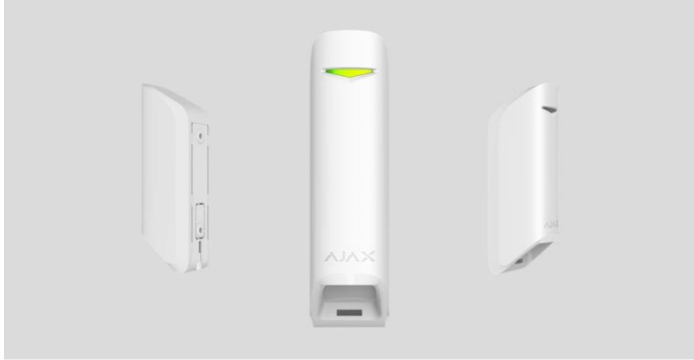

**MotionProtect Curtain** is a curtain type wireless motion detector. The detector has a narrow horizontal detection angle and is designed for indoor perimeter control: windows, doorways, and other entrances or exits of the guarded facility. Maximum motion detection distance is 15 m.

MotionProtect Curtain integrates into Ajax security systems, connecting to a through the secure protocol. Wireless coverage may reach up 1,700 m line-of-sight. The pre-installed battery ensures up to 3 years of autonomous operation. hub Jeweller

An iOS or Android is used for detector setup. It also notifies the user about any events with push notifications, SMS, or calls (if enabled). app

Ajax can be connected to the central monitoring station of a security company.

### Functional Elements

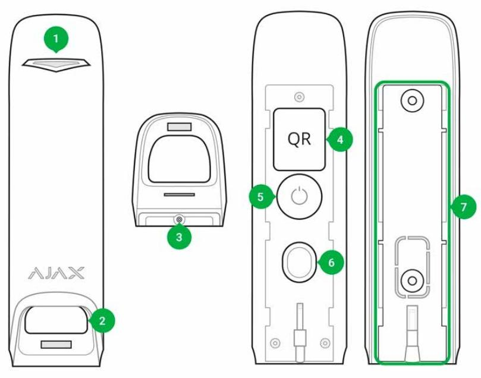

- **1.** LED indicator
- **2.** Detector light filter
- **3.** Screw aperture for SmartBracket attachment panel
- **4.** QR-Code
- **5.** Power button
- **6.** Tamper button
- **7.** SmartBracket attachment panel (the perforated part is a part of tamper protection for the cases when the detector gets pulled away from a surface)

## Operating Principle

MotionProtect Curtain's IR sensors detect intrusion into the premises by detecting moving objects having a temperature close to that of the human body.

Once the system is armed, the detector starts polling its two IR sensors. If a motion is detected, an alarm state is instantly sent to the hub and green LED starts flashing on the device. Having caught an alarm state, the Hub triggers sirens and notifies the user and the security company.

Motion alarms are sent every 5 seconds

To prevent false alarms, MotionProtect Curtain has a Correlation Signal Processing functionality that can be . Once it is active, the detector starts sending alarm states to the hub only if an identical motion signal is registered by both IR sensors. If it is disabled, MotionProtect Curtain sends an alarm state even with one of the two IR sensors triggered. enabled in the detector's settings

#### What is correlation signal analysis and how does it work

### Pairing the Detector with a hub

### Before you start pairing the detector:

- **1.** Turn on your hub and check the Internet connection (via Ethernet and/or GSM).
- **2.** Install the on your smartphone. Create an account, add your hub to the app, and create at least one room. Ajax application
- **3.** Check the status of the hub in the app to make sure it is disarmed and is not updating.

Please note that only a user with admin permissions can add devices to the hub

### Pairing MotionProtect Curtain with a hub:

- **1.** In the Ajax mobile app, tap **Add device**.
- **2.** Name the device, scan the **QR code** or enter it manually (placed on the back of the detector body or its packaging), select the room for placement, and

tap **Add**. The countdown will start.

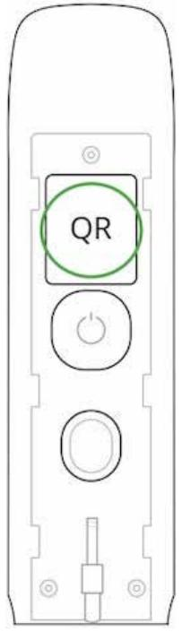

- **3.** Turn on the detector by holding its power button for 3 seconds.
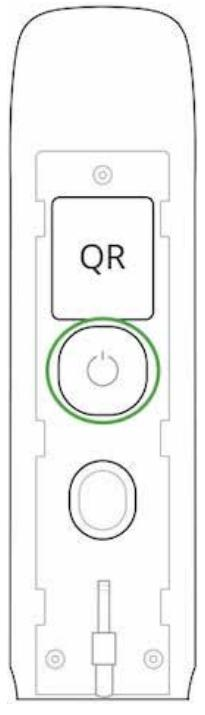

For detection and pairing to occur, the device must be within a hub's wireless coverage (at the same facility). The connection request will be sent to the Hub only once the device turns on.

If the MotionProtect Curtain fails to connect to the hub, it will automatically power down within 6 seconds after turning on. There is no need to turn off the device to retry.

If the MotionProtect Curtain has already been paired with another hub, turn off the detector, and then follow the standard pairing procedure.

After pairing, the detector will appear on the app's hub device list. The frequency of the device status updates depends on the polling interval indicated in the hub's settings (36 seconds by default).

If the detector identifies movement before the system is armed, it will activate not immediately but the next it is polled by the hub.

### Statuses

- **2.** MotionProtect Curtain

| Parameter                | Value                                                                                                  |  |
|--------------------------|--------------------------------------------------------------------------------------------------------|--|
| Temperature              | The detector's CPU temperature (changes gradually)                                                  |  |
| Jeweller Signal Strength | The strength of the signal between a hub and the detector                                           |  |
| ReX                      | radio signal Displays the status of using a range extender                                       |  |
| Battery Charge           | Battery level of the device. Two states available:                                                     |  |
|                          | ОК                                                                                                     |  |
|                          | Battery discharged                                                                                     |  |
|                          | How battery charge is displayed in                                                                     |  |
|                          | Ajax apps                                                                                              |  |
| Lid                      | The status of the detector's tamper device that responds to the detachment and removal attempts. |  |
| Delay When Entering, sec | The delay for security system activation when entering premises                                     |  |
| Delay When Leaving, sec  | The delay for security system activation when leaving premises                                      |  |
|                          |                                                                                                        |  |

| Connection                    | Status of the connection between the hub and the sensor                                                                                                                                                                                                                                                                                                                                                                                                                                                                                                                                                                                                                      |  |
|-------------------------------|---------------------------------------------------------------------------------------------------------------------------------------------------------------------------------------------------------------------------------------------------------------------------------------------------------------------------------------------------------------------------------------------------------------------------------------------------------------------------------------------------------------------------------------------------------------------------------------------------------------------------------------------------------------------------------|--|
| Sensitivity                   | Detector sensitivity: Low High Normal                                                                                                                                                                                                                                                                                                                                                                                                                                                                                                                                                                                                                                  |  |
| Correlation signal processing | signal correlation Status of the processing functionality                                                                                                                                                                                                                                                                                                                                                                                                                                                                                                                                                                                                              |  |
| Always Active                 | If enabled, motion detection is active always                                                                                                                                                                                                                                                                                                                                                                                                                                                                                                                                                                                                                                   |  |
| Temporary Deactivation        | Shows the status of the device temporary deactivation function: No — the device operates normally and transmits all events. Lid only — the hub administrator has disabled notifications about triggering on the device body. Entirely — the device is completely excluded from the system operation by the hub administrator. The device does not follow system commands and does not report alarms or other events. By number of alarms — the device is automatically disabled when the number of alarms is exceeded (specified in the settings for Devices Auto Deactivation). The feature is configured in the Ajax PRO app. |  |
| Firmware                      | The detector's firmware version                                                                                                                                                                                                                                                                                                                                                                                                                                                                                                                                                                                                                                                 |  |
| Device ID                     | Device identifier                                                                                                                                                                                                                                                                                                                                                                                                                                                                                                                                                                                                                                                               |  |

### Detector Setup

- **2.** MotionProtect Curtain
- **3.** Settings

| Setting                               | Value                                                                                                                                                                                                                     |  |  |
|---------------------------------------|---------------------------------------------------------------------------------------------------------------------------------------------------------------------------------------------------------------------------|--|--|
| First field                           | Detector name (editable)                                                                                                                                                                                                  |  |  |
| Room                                  | The virtual room to which the device can be assigned                                                                                                                                                                   |  |  |
| Sensitivity                           | The detector sensitivity selector: High Normal Low                                                                                                                                                               |  |  |
| Correlation signal processing         | correlation signal processing The function toggle                                                                                                                                                                   |  |  |
| Always active                         | If enabled, motion detection stays active always                                                                                                                                                                          |  |  |
| Delay When Entering, sec              | The delay for security system activation when entering the premises                                                                                                                                                    |  |  |
| Delay When Leaving, sec               | The delay for security system activation when leaving premises                                                                                                                                                         |  |  |
| Delays in Night Mode                  | The delay for security system activation in Night Mode                                                                                                                                                                 |  |  |
| Arm in Night Mode                     | If active, the detector becomes armed once system enters Night Mode                                                                                                                                                    |  |  |
| Alarm LED indication                  | Allows you to disable the flashing of the LED indicator during an alarm. Available for devices with firmware version 6.53.1.1 or higher How to find the firmware version or the ID of the detector or device? |  |  |
| Alert with a siren if motion detected | sirens If active, added to the system are activated if the motion is detected                                                                                                                                    |  |  |
| Signal Strength Test                  | Switches the detector into the signal level test mode                                                                                                                                                                  |  |  |
| Detection Zone Test                   | Switches the detector to the detection area test                                                                                                                                                                          |  |  |
| Attenuation test                      | Switches the detector into the signal attenuation test mode (available in detectors with firmware version 3.50 or later)                                                                                            |  |  |
| Temporary Deactivation                | Allows the user to disconnect the device without removing it from the system.                                                                                                                                          |  |  |

|               | Two options are available:                                                                                                                                                                                                                                                                                             |  |
|---------------|------------------------------------------------------------------------------------------------------------------------------------------------------------------------------------------------------------------------------------------------------------------------------------------------------------------------|--|
|               | Deactivate entirely — the device will not execute system commands or participate in automation scenarios, and the system will ignore device alarms and other notifications Deactivate lid notifications — the system will ignore only notifications about the triggering of the device tamper button |  |
|               | Learn more about temporary deactivation of devices                                                                                                                                                                                                                                                                  |  |
|               | The system can also automatically disable devices when the set number of alarms is exceeded.                                                                                                                                                                                                                     |  |
|               | Learn more about auto deactivation                                                                                                                                                                                                                                                                                     |  |
|               | of devices                                                                                                                                                                                                                                                                                                             |  |
| User Guide    | Opens the detector User Guide                                                                                                                                                                                                                                                                                          |  |
| Unpair Device | Unpairs the detector from the Hub and resets its settings                                                                                                                                                                                                                                                           |  |

### Detector Indication

The MotionProtect Curtain indicator LED may turn red or green, depending on the status of the device.

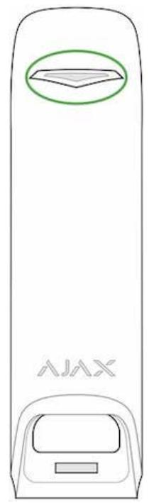

#### **Indication when pressing the power button**

| Event                                        | Indication                                     |  |
|----------------------------------------------|------------------------------------------------|--|
| The power button is pressed (detector is on) | Lights up red while the button is held         |  |
| Turning on                                   | Lights up green while the device is turning on |  |
| Turning off                                  | Lights up red, then flashes three times        |  |

#### **Active detector indication**

| Event                                 | Indication                               | Note                                                                          |
|---------------------------------------|------------------------------------------|-------------------------------------------------------------------------------|
| Connecting the detector to the hub | Lights up green for a few seconds     |                                                                               |
| Hardware error                        | Flashes red continuously                 | The detector needs to be repaired, contact support                         |
| Motion or tamper alarm triggered      | Lights up green for about 1 second    |                                                                               |
| Battery replacement needed            | Smoothly lights up green and goes off | For battery replacement Battery procedure, see replacement manual |

### Integrity Testing

Ajax security systems can run tests to verify the integrity of connected devices.

The tests start instantly, but no later than within 36 seconds by default. The test start time depends on the detector polling interval setting (see the **Jeweller** section in the Hub settings).

Signal Strength Test

Detection Zone Test

Attenuation test

### Detector Placement

The effectiveness of the security system depends on detector placement. Choosing a location to install MotionProtect Curtain, consider the direction of the light filter and obstacles that may affect the detector's field of view and the radio signal transmission.

Consider the detection range as well as the beam width when installing the detector. Incorrect device placement can lead to false alarms or improper operation of the device.

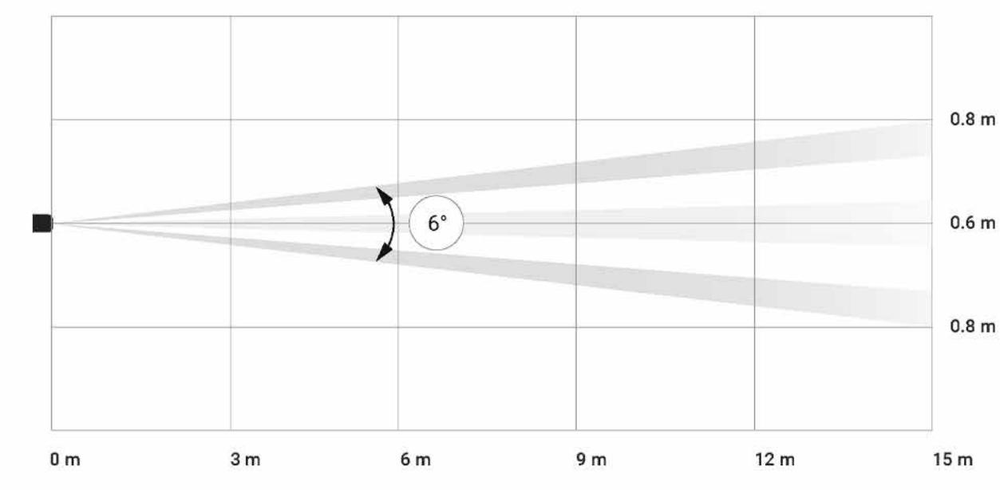

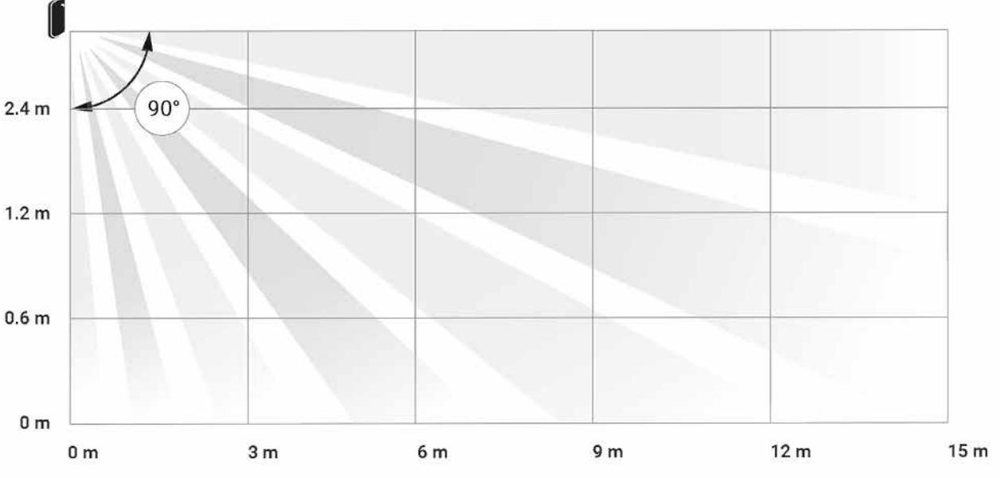

#### Horizontal and vertical detector's angles of view

| Detection range | Beam width |
|-----------------|------------|
| 3 meters        | 0.3 meters |
| 6 meters        | 0.6 meters |

| 9 meters  | 0.9 meters  |
|-----------|-------------|
| 12 meters | 1.25 meters |
| 15 meters | 1.55 meters |

The device developed only for indoor use.

#### **Do not install the detector:**

- Outside the premises (outdoors)
- In front of the windows within reach of direct sunlight
- Opposite of the objects that rapidly change temperature (e.g., electric and gas heaters)
- Opposite of the moving objects having a temperature close to that of the human body (curtains swaying above a heating radiator)
- In places with fast air circulation (near fans, open windows or doors)
- Near metal objects and mirrors that cause the attenuation or interfere with radio signals
- Within any premises with the temperature and humidity beyond the permitted range
- Closer than 1 m to a hub

If the detector keeps reacting to interference and raising false alarms, but it is impossible to install it anywhere else, the Correlation Signal Processing can be enabled in the settings.

Please note that if the **Correlation Signal Processing** is enabled, the range of motion detection is reduced depending on the detector sensitivity chosen

| Sensitivity | Motion detection range w/ Signal Correlation Processing * | Motion detection range w/o Signal Correlation Processing * |
|-------------|--------------------------------------------------------------|---------------------------------------------------------------|
|             |                                                              |                                                               |

| Low    | Up to 6 m | Up to 11 m |
|--------|-----------|------------|
| Normal | Up to 7 m | Up to 13 m |
| High   | Up to 8 m | Up to 15 m |

*at an ambient temperature of 23°C

If possible, avoid situations where the detector identifies movement at a longer distance than required. The best place to install it is within an enclosed place. For instance, to detect movement in an archway, install the detector in it. This way, the detector will be triggered only by a person that enters it.

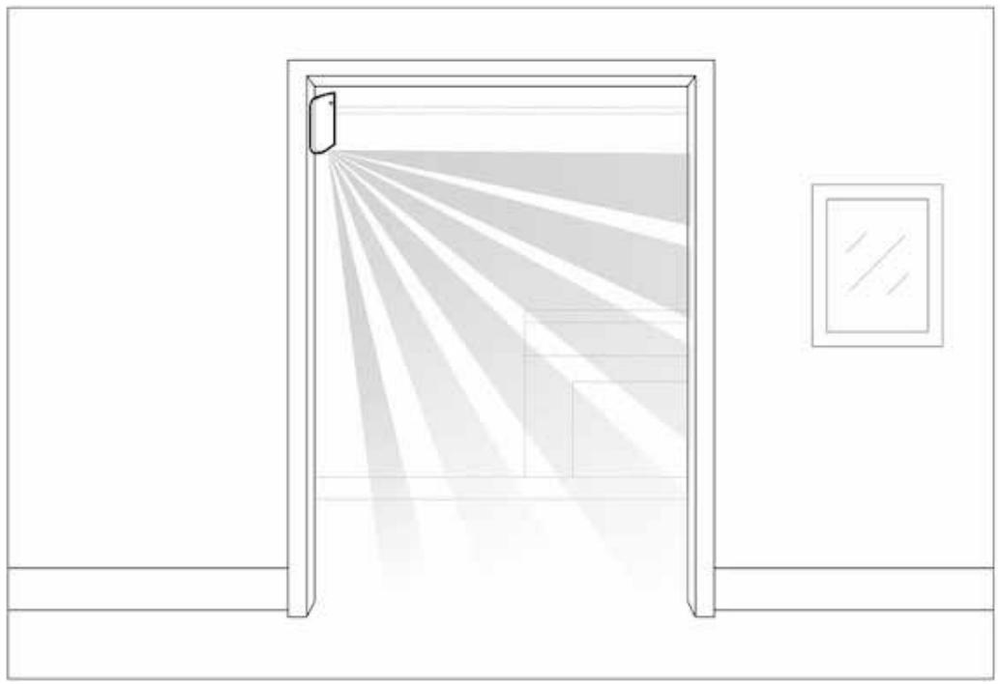

To prevent the detector from reacting to domestic animals, install it upside down, leaving space for the free movement of animals below the detection zone.

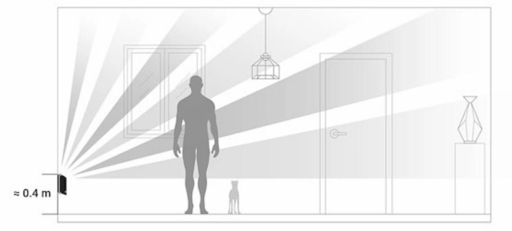

The placement of a MotionProtect Curtain also depends on the distance to a hub and whether there are any obstacles between the devices that may hinder the radio signal, e.g., walls, floor deck, or large objects in the room.

Check the signal strength at the placement location. If you have a signal level of one bar, there is no guarantee of the security system's stable operation. Take all necessary precautions to ensure maximum signal level. At least try moving the device—even 20 cm can make a difference.

If after moving the device still has a low or unstable signal strength, use a . radio signal range extender

Make sure that no furniture, home plants, vases, decorative or glass structures are blocking the detector's field of view.

We recommend installing the detector at a height of 2.4 m!

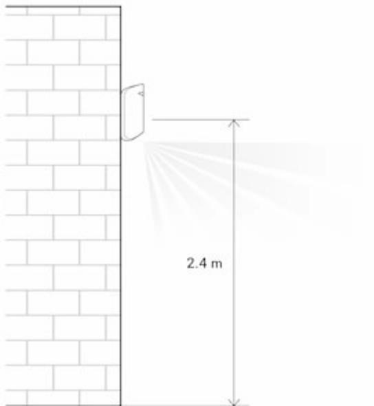

Installing the detector at any other height will narrow the detection zone, affecting the quality of motion detection.

Keep in mind that MotionProtect Curtain does not detect movement behind the glass. Therefore, do not install the detector in places where glass structures may block its range of view, e.g., in places where an open window may obstruct the device's field of view.

### Detector Installation

Before installing the detector, make sure that you have chosen an appropriate location as indicated in this manual.

#### **There are two options for installing MotionProtect Curtain:**

- directly to a surface
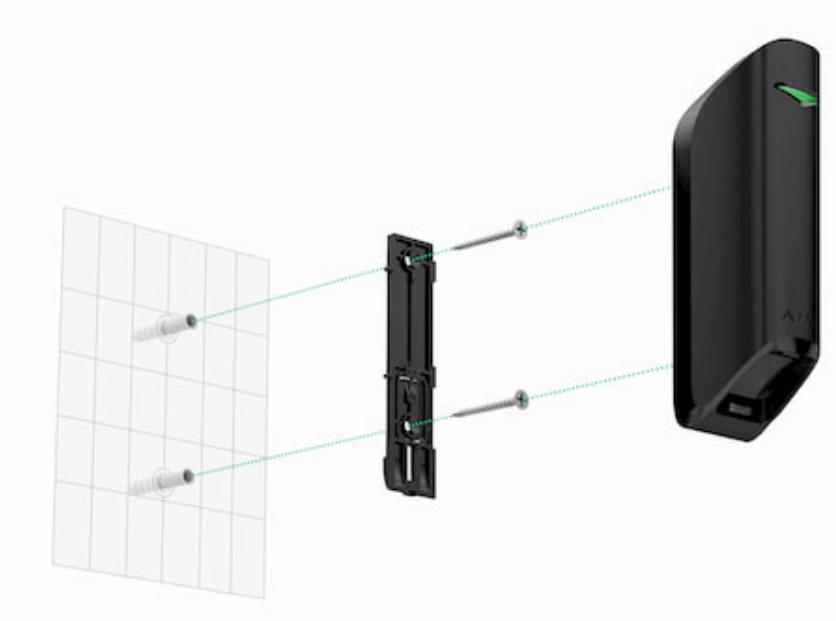

- to the included bracket.
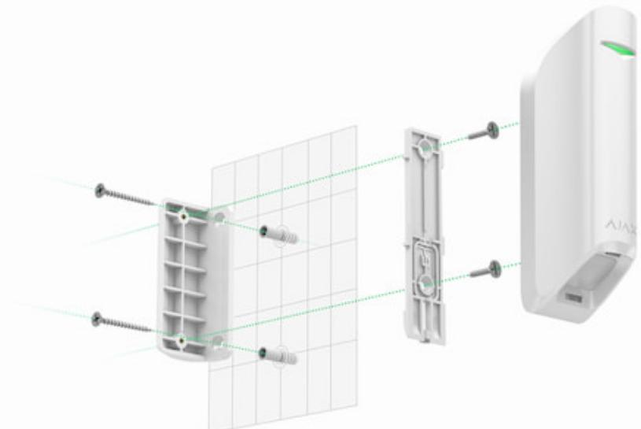

#### **Installation procedure:**

- **1.** Attach the SmartBracket panel or a bracket to the surface with the included screws or other equally reliable fasteners. Screw the SmartBracket panel onto the included bracket.
- **2.** Attach the detector to the SmartBracket attachment panel.
- **3.** Mount the detector on the SmartBracket attachment panel using a screw.

The double-sided adhesive tape should be used only for the temporary installation of the detector. It will dry out eventually, becoming unable to reliably hold the detector and possibly causing false alarms in the security system. The fall of the device may also result in its damage.

If the detector's LED fails to light up after the device is attached to the SmartBracket, check the tamper status in the Ajax app and then check if it fits tightly onto the attachment panel. If you try to detach the detector from the surface or the panel, you will receive a notification.

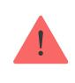

Having installed the detector, run the . In case of incorrect operation, the detector needs to be relocated. Detection Zone Test

### Detector Care and Battery Replacement

Check the integrity of the MotionProtect Curtain detector regularly. Clean the detector body from dust, spider webs, and other contaminations as they appear. Use soft dry cloth suitable for equipment care.

Do not clean the detector with any substances containing alcohol, acetone, gasoline, or any other active solvent. Wipe the lens carefully and gently—any scratches on the plastic may reduce the detector's sensitivity.

The pre-installed battery ensures up to 3 years of autonomous operation (at a polling interval of 3 min). If the detector battery is nearly depleted, the security system will send a notification, and the LED will smoothly light up and go out when the detector detects any motion or if the tamper is activated.

#### How long Ajax devices operate on batteries, and what affects this

#### Battery replacement

### Specifications

| Sensor                       | PIR sensor, 2 pcs                                                                                                   |
|------------------------------|---------------------------------------------------------------------------------------------------------------------|
| Detection angles             | Horizontal — 6°; vertical — 90°                                                                                     |
| Time for motion detection    | From 0.3 to 2 m/s                                                                                                   |
| Placement                    | Indoor only                                                                                                         |
| Motion detection range       | Up to 15/13/11 m (up to 8/7/6 m with Correlation Signal Processing enabled depending on sensitivity settings) |
| False alarm reduction        | Available — Correlation Signal Processing                                                                           |
| Tamper Protection            | Available — detector body detachment and damage                                                                  |
| Radio communication protocol | Jeweller Learn more                                                                                              |
| Radio frequency band         | 866.0 – 866.5 MHz 868.0 – 868.6 MHz 868.7 – 869.2 MHz 905.0 – 926.5 MHz 915.85 – 926.5 MHz              |

|                             | 921.0 – 922.0 MHz Depends on the region of sale.                             |
|-----------------------------|---------------------------------------------------------------------------------|
| Compatibility               | hubs radio Operates only with all Ajax , and signal range extenders |
| RF signal strength          | Up to 20 mW                                                                     |
| Radio signal modulation     | GFSK                                                                            |
| Radio signal range          | Up to 1700 m line-of-sight                                                      |
| Power supply                | 1 battery CR123A, 3 V                                                           |
| Battery life                | Up to 3 years                                                                   |
| Installation method         | Indoors only                                                                    |
| Operating temperature range | From -10°С to +40°С                                                             |
| Protection class            | IP54                                                                            |
| Overall dimensions          | 134 × 44 × 34 mm                                                                |
| Weight                      | 118 g                                                                           |
| Service life                | 10 years                                                                        |

#### Compliance with standards

### Complete Set

- **1.** MotionProtect Curtain
- **2.** SmartBracket panel
- **3.** Battery CR123A (pre-installed)
- **4.** Installation kit
- **5.** Quick Start Guide
- **6.** Bundled Bracket

### Warranty

The warranty for the "AJAX SYSTEMS MANUFACTURING" LIMITED LIABILITY COMPANY products is valid for 2 years after the purchase and does not apply to the pre-installed battery.

If the device does not work correctly, contact our customer support first—in 50% the cases, technical issues can be solved remotely!

#### The full text of the warranty

#### User Agreement

Technical support: support@ajax.systems