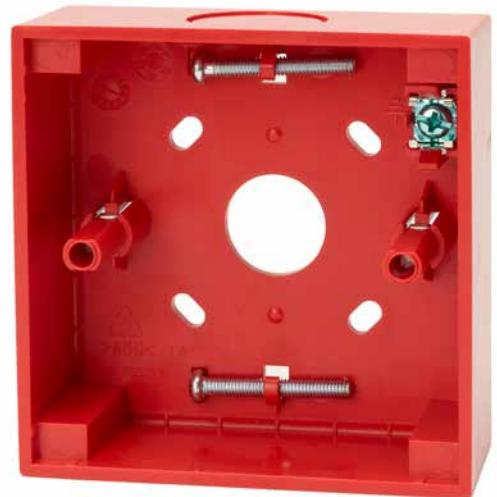

## N-MC-BB-R **MCP accessory, intelligent manual call point back box, red**

#### **General**

The N-MC-BB-R is a surface mount back-box for DM3000, KAL750 and ZP780 series manual call points. It offers cable entry from behind when used with hidden cable trunking, or cable entry from the top and bottom when surface mount cable trunking is used. Suitable mounting screws to fit the compatible manual call point to the back box are conveniently housed in the base of the box. A screen connection terminal is provided for convenient cable screen connection when used in electricity noisy environments.

#### **Easy to install**

Adjustable screw mounting holes allows for perfect alignment of the back box even if the drilled holes are not exactly level. The flexibility of cable entry from the large opening in the rear, or the dust proof knockouts at the top and bottom of the unit greatly enhances the applications possible for fitting in all types of installations. The back box may be rotated through 180° to position the selected entry orientation in the most convenient location at the top or the bottom of the unit.

A perfect fit between the back box and the manual call point front is guaranteed by device alignment guides that avoid misalignment of the back box with the front part, presenting the manual call point as a single aesthetic product on the wall.

#### **Details**

- Compatible with quality wall boxes and MCPs
- Rear and side cable entry using a single unit
- Suitable screws provided for MCP fitting
- Screen connection terminal for electrically noisy installations
- Alignment holes for wall mounting allows for perfect horizontal alignment
- Aligns perfectly with the NC-MC series conventional, as well as DM3000, KAL750 and ZP780 series addressable MCPs to provide a smooth aesthetic single unit finish

# N-MC-BB-R

**MCP accessory, intelligent manual call point back box, red**

### **Technical specifications**

| General               |                                           |
|-----------------------|-------------------------------------------|
| Compatibility         | Aritech, Kilsen, Ziton manual call points |
| Electrical            |                                           |
| Terminals             | 1 (cable screen)                          |
| Physical              |                                           |
| Physical dimensions   | 87.1 x 87.1 x 35 mm (W x H x D)           |
| Net weight            | 60 g                                      |
| Colour                | Red (RAL 3028)                            |
| Mounting type         | Wall mount                                |
| Cable entries         | 3 side, 1 rear                            |
| Material (body)       | Noryl SE100 (self-extinguishing)          |
| Environmental         |                                           |
| Vandal proof          | No                                        |
| Operating temperature | −25 to +72°C                              |
| Storage temperature   | −25 to +72°C                              |
| Relative humidity     | 10 to 95% noncondensing                   |
| Miljö                 | Indoor                                    |
| Regulatory            |                                           |
| Compliancy            | REACH, RoHS 2, WEEE                       |

Powered by TCPDF (www.tcpdf.org)

Carrier Fire & Security förbehåller sig rätten att ändra produktspecifikationer utan föregående meddelande. För de senaste produktspecifikationerna, besök se.firesecurityproducts.com online eller kontakta din försäljningsrepresentant.