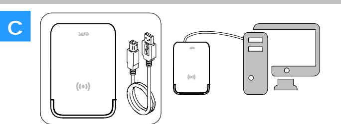
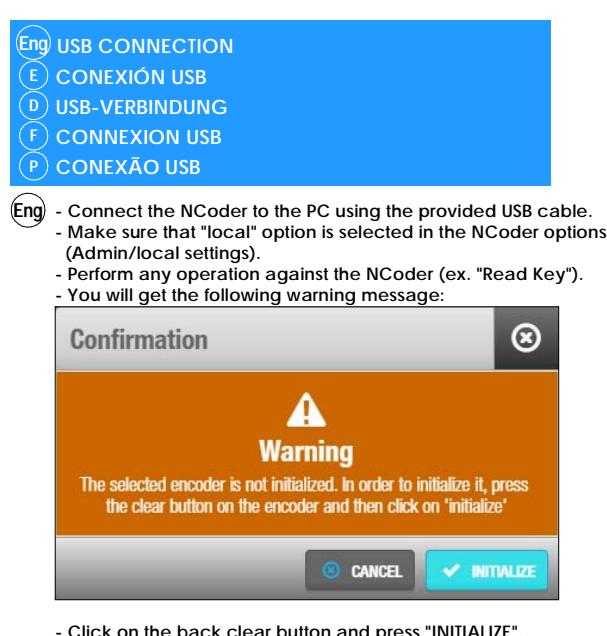
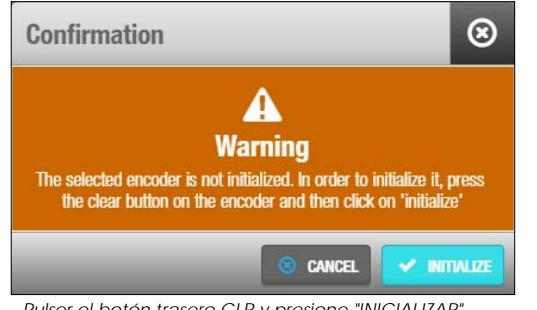
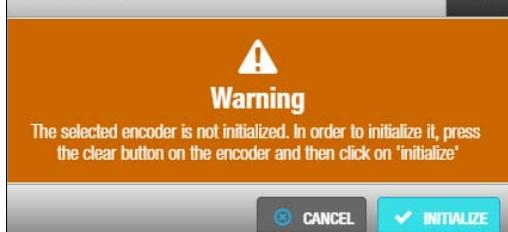
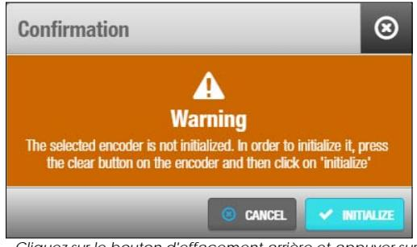
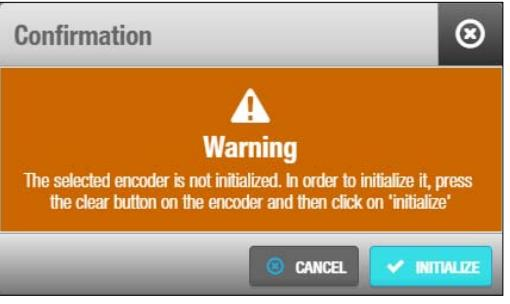
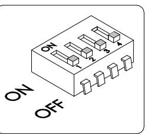

**Select desired communication mode, USB (a) or Ethernet (b). /** *Seleccione modo de comunicación deseado, USB (a) o Ethernet (b).* Wählen Sie den gewünschten Kommunikationsmodus, USB (a) oder Ethernet (b). / *Sélectionnez le mode de communication souhaité, USB (a) ou Ethernet (b).* Selecione o modo de comunicação desejado, USB (a) ou Ethernet (b).

# **DESKTOP READER MODE**

**Only with USB communication. /** *Solo es posible la comunicación USB.* Nur USB Kommunikation. / *Uniquement la communication USB.* Apenas comunicação USB.

**To be able to work in Desktop Reader mode, the NCoder must be configured through the Space software. /** *Para poder funcionar en modo Desktop Reader, el NCoder debe ser configurado a través del Space.*

*Um im Modus "Desktop Reader" zu arbeiten, muss das Gerät über SPACE konfiguriert werden.* / *Pour fonctionner en mode Desktop Reader, le périphérique doit être configuré via Space. / Para poder operar no modo Desktop Reader, o dispositivo deve ser configurado através de Space.*

### **Electrical characteristics Características eléctricas Elektrische Eigenschaften Característiques electriques Características eléctricas Eng E D F P**

|     | OPERATING CHARACTERISTICS |   |           |      |  |
|-----|---------------------------|---|-----------|------|--|
| Eng |                           |   | Min. Max. | Unit |  |
|     | Temperature               | 0 | 50        | °C   |  |
|     | Humidity                  | 0 | 95        | %    |  |

| RF CHARACTERISTICS           |      |       |        |      |  |
|------------------------------|------|-------|--------|------|--|
|                              | Min. | Cen.  | Max.   | Unit |  |
| RFID frecuency               | -    | 13.56 | -      | Mhz  |  |
| Bluetooth Smart frecuency | 2400 | 2445  | 2483.5 | Mhz  |  |

| CONDICIONES AMBIENTALES |   |           |        |
|-------------------------|---|-----------|--------|
|                         |   | Min. Max. | Unidad |
| Temperatura             | 0 | 50        | °C     |
| Humedad                 | 0 | 95        | %      |

**E**

| CARACTERÍSTICAS RF            |      |       |        |        |  |
|-------------------------------|------|-------|--------|--------|--|
|                               | Min. | Cen.  | Max.   | Unidad |  |
| Frecuencia RFID               | -    | 13.56 | -      | Mhz    |  |
| Frecuencia Bluetooth Smart | 2400 | 2445  | 2483.5 | Mhz    |  |

| POWER CONSUMPTION |     |           |        |  |
|-------------------|-----|-----------|--------|--|
|                   |     | Typ. Max. | Unidad |  |
| USB               | 250 | 400       | mA     |  |
| Ethernet          | 350 | 500       | mA     |  |

| CABLE REQUIREMENTS |                            |  |  |  |
|--------------------|----------------------------|--|--|--|
| Ethernet           | UTP CAT5e                  |  |  |  |
|                    | USB 2.0 Male USB A to Male |  |  |  |
| USB                | USB B                      |  |  |  |

| CONSUMO ENERGÍA     |     |     |    |  |  |  |  |  |  |
|---------------------|-----|-----|----|--|--|--|--|--|--|
| Typ. Max. Unidad |     |     |    |  |  |  |  |  |  |
| USB                 | 250 | 400 | mA |  |  |  |  |  |  |
| Ethernet            | 350 | 500 | mA |  |  |  |  |  |  |

| REQUERIMIENTOS CABLE  |                       |  |  |  |  |  |  |
|-----------------------|-----------------------|--|--|--|--|--|--|
| Ethernet UTP CAT5e |                       |  |  |  |  |  |  |
| USB                   | USB 2.0 USB A - USB B |  |  |  |  |  |  |

|     |                             | OMGEVING |           |                   |                                  |   | RF CHARAKTERISTIK  |                  |               |              | STROMVERBRAUCH     |     |                        |          | KABELANFORDERUNGEN         |
|-----|-----------------------------|----------|-----------|-------------------|----------------------------------|---|--------------------|------------------|---------------|--------------|--------------------|-----|------------------------|----------|----------------------------|
| D   |                             |          | Min. Max. | Einheit           |                                  |   | Min. Mittel Max.   |                  | Einheit       |              | Typ. Max.          |     | Einheit                | Ethernet | UTP CAT5e                  |
|     | Temperatur                  | 0        | 50        | °C                | RFID Frequenz                    | - | 13.56              | -                | Mhz           | USB          | 250                | 400 | mA                     | USB      | USB 2.0 männlich USB A auf |
|     | Luftfeuchtigke              | 0        | 95        | %                 | Bluetooth Smart                  |   |                    | 2400 2445 2483.5 | Mhz           | Ethernet 350 |                    | 500 | mA                     |          | männlich USB B             |
|     |                             |          |           |                   | Frequenz                         |   |                    |                  |               |              |                    |     |                        |          |                            |
|     |                             |          |           |                   |                                  |   |                    |                  |               |              |                    |     |                        |          |                            |
| F   | CONDITION DE FONCTIONNEMENT |          |           |                   |                                  |   | CARACTERISTIQUE RF |                  |               |              |                    |     | CONSOMMATION D'ÉNERGIE |          | CABLE NECESSAIRE           |
|     |                             |          | Min. Max. | Unité             |                                  |   | Min. Cen.          | Max.             | Unité         |              | Typ. Max.          |     | Unité                  | Ethernet | UTP CAT5e                  |
|     | Température                 | 0        | 50        | °C                | FREQUENCE RFID                   | - | 13.56              | -                | Mhz           | USB          | 250                | 400 | mA                     | USB      | USB 2.0 Male USB A vers    |
|     | Humidité                    | 0        | 95        | %                 | Fréquence                        |   |                    |                  | Mhz           | Ethernet 350 |                    | 500 | mA                     |          | Male USB B                 |
|     |                             |          |           |                   | Bluetooth Smart 2400 2445 2483.5 |   |                    |                  |               |              |                    |     |                        |          |                            |
|     |                             |          |           |                   |                                  |   |                    |                  |               |              |                    |     |                        |          |                            |
| P   | CONDIÇÕES AMBIENTAIS        |          |           |                   |                                  |   | CARACTERÍSTICAS RF |                  |               |              | CONSUMO DE ENERGIA |     |                        |          | TIPO DE CABO               |
|     |                             |          |           | Min. Max. Unidade |                                  |   | Min. Cen.          | Max.             | Unidade       |              |                    |     | Tip. Máx. Unidade      | Ethernet | UTP CAT5e                  |
|     | Temperatura                 | 0        | 50        | °C                | Frequência RFID                  | - | 13.56              | -                | Mhz           | USB          | 250                | 400 | mA                     | USB      | USB 2.0 USB A - USB B      |
|     | Humidade                    | 0        | 95        | %                 | Frequência                       |   |                    |                  | Mhz           | Ethernet 350 |                    | 500 | mA                     |          |                            |
|     |                             |          |           |                   | Bluetooth Smart 2400 2445 2483.5 |   |                    |                  |               |              |                    |     |                        |          |                            |
|     |                             |          |           |                   |                                  |   |                    |                  |               |              |                    |     |                        |          |                            |
| Eng | Configuration               |          |           | E                 | Configuración                    | D |                    |                  | Konfiguration | F            |                    |     | Configuration          | P        | Configuração               |
|     |                             |          |           |                   |                                  |   |                    |                  |               |              |                    |     |                        |          |                            |
|     |                             |          |           |                   |                                  |   |                    |                  |               |              |                    |     |                        |          |                            |
| Eng | ETHERNET CONNECTION         |          |           |                   |                                  |   |                    |                  |               |              |                    |     |                        |          |                            |
| E   | CONEXIÓN ETHERNET           |          |           |                   |                                  |   |                    |                  |               |              |                    |     |                        |          |                            |

- **ETHERNET-VERBINDUNG D**
 **CONNEXION ETHERNET F**

- **CONEXÃO ETHERNET P**
**Eng - The NCoder is a DHCP ready device.**

- **It is possible to manually change the IP settings from dynamic to static using a web browser.**
- **Connect the NCoder to the PC using an Ethernet cable (not provided).**
- **Make sure that the NCoder (v2) has been declared in "SALTO Network" and that the "Online" option is selected in the NCoder options (Admin/local settings).**
- **Press the back clear button for 5s to access the addressing mode (see addressing status signaling).**
- **Access the 192.168.0.234 IP internal IP address using a web browser. - Change the needed parameters and use the "send" option. The NCoder will leave the addressing mode automatically (if no actions are required you can leave the addresing mode by pressing the CLR button for 5s). - Click on the back clear button and press "INITIALIZE" (SALTO Network/NCoder).**
- **The NCoder is now ready to be used.**

#### *- El NCoder es un dispositivo DHCP.* **E**

- *Es posible cambiar manualmente los ajustes de dinámico a estático utilizando un navegador web.*
- *Conectar el NCoder al ordenador utilizando un cable Ethernet (No suministrado). - Comprobar que el NCoder (v2) ha sido declarado en la "Red SALTO" y que la*
- *opción "Online" está seleccionada en las opciones del NCoder (Admin/ajustes). - Pulsar el botón trasero CLR durante 5 segundos para acceder al modo direccionamiento (ver señalética modo direccionamiento).*
- *Acceder mediante el navegador web a la dirección interna IP 192.168.0.234- - Configurar los parámetros de red y pulsar "enviar. El NCoder abandonará automaticamente el modo de direccionamiento. ( Si desea que la configuración del dispositivo no cambie, pulse durante 5 segundos el botón CLR).*
- *Pulsar el botón trasero CLR y pulsar "INICIALIZAR" (SALTO Network/Ncoder). - El Ncoder está listo para su funcionamiento.*

#### - Der NCoder ist ein DHCP-fähiges Gerät. **D**

- Es ist möglich, die IP-Einstellungen über einen Webbrowser manuell von dynamisch auf statisch zu ändern.
- Verbinden Sie den NCoder über ein Ethernet-Kabel mit dem PC (nicht mitgeliefert). - Stellen Sie sicher, dass der NCoder (v2) unter "System/SALTO Netzwerk" als neues Netzwerkgerät hinzugefügt wurde und dass die Option "Online" in den
- NCoder-Einstellungen (Admin/Lokale Einstellungen) ausgewählt ist. - Drücken Sie 5 s lang auf den Reset-Knopf, um den Adressierungsmodus zu aktivieren (siehe Signalisierung Adressierungsstatus).
- Greifen Sie mit einem Webbrowser auf die Default-IP-Adresse 192.168.0.234 zu. - Ändern Sie die erforderlichen Parameter und klicken Sie anschließend auf "Senden". Der NCoder verlässt den Adressierungsmodus automatisch (wenn keine Änderungen erforderlich sind, können Sie den Adressierungsmodus durch Drücken
- des Reset-Knopfes für 5 s verlassen). - Reset-Knopf kurz drücken und "Initialize" anklicken (SALTO Netzwerk/NCoder).
- Der NCoder ist jetzt einsatzbereit.

- *Le NCoder est un périphérique prêt pour DHCP.* **F**

- *Il est possible de modifier manuellement les paramètres IP de dynamique à statique en utilisant un navigateur web.*
- *Connecter le NCoder au PC à l'aide d'un câble Ethernet (non fourni). - Assurez-vous que le NCoder (v2) a été déclaré dans "SALTO Réseau" et que l'option*
- *"Online" est sélectionnée dans les options NCoder (Paramètres Admin/Local). - Appuyez sur le bouton d'effacement arrière pendant 5s pour accéder au mode*
- *d'adressage (voir le statut de l'adresse de signalisation). - Accéder à l'adresse 192.168.0.234 IP interne à l'aide d'un navigateur Web.*
- *Changer les paramètres nécessaires et utilisez l'option "envoyer". Le NCoder quittera automatiquement le mode d'adressage (si aucune action n'est requise, vous pouvez quitter le mode d'adressage en appuyant sur le bouton CLEAR pendant 5s). - Cliquer sur le bouton d'effacement arrière et appuyer sur "INITIALISER" (SALTO*
- *Réseau/NCoder).*
- *Le NCoder est maintenant prêt à être utilisé.*

| STROMVERBRAUCH |     |           |         |  |  |  |  |  |
|----------------|-----|-----------|---------|--|--|--|--|--|
|                |     | Typ. Max. | Einheit |  |  |  |  |  |
| USB            | 250 | 400       | mA      |  |  |  |  |  |
| Ethernet 350   |     | 500       | mA      |  |  |  |  |  |

| KABELANFORDERUNGEN    |                            |  |  |  |  |  |
|-----------------------|----------------------------|--|--|--|--|--|
| Ethernet UTP CAT5e |                            |  |  |  |  |  |
|                       | USB 2.0 männlich USB A auf |  |  |  |  |  |
| USB                   | männlich USB B             |  |  |  |  |  |

| CONSOMMATION D'ÉNERGIE |     |           |       |  |  |  |  |  |  |
|------------------------|-----|-----------|-------|--|--|--|--|--|--|
|                        |     | Typ. Max. | Unité |  |  |  |  |  |  |
| USB                    | 250 | 400       | mA    |  |  |  |  |  |  |
| Ethernet 350           |     | 500       | mA    |  |  |  |  |  |  |

| Male USB B   |  |  |  |  |  |
|--------------|--|--|--|--|--|
|              |  |  |  |  |  |
|              |  |  |  |  |  |
|              |  |  |  |  |  |
| TIPO DE CABO |  |  |  |  |  |

USB 2.0 Male USB A vers

| TIPO DE CABO          |                       |  |  |  |  |  |
|-----------------------|-----------------------|--|--|--|--|--|
| Ethernet UTP CAT5e |                       |  |  |  |  |  |
| USB                   | USB 2.0 USB A - USB B |  |  |  |  |  |

| e |  |  |  |
|---|--|--|--|

**P**

- *O NCoder é um dispositivo pronto para DHCP. - É possível alterar manualmente as definições de IP, de dinâmico para estático usando um navegador web.*
- *Ligue o NCoder ao PC utilizando um cabo Ethernet (não fornecido). - Certifique-se de que o NCoder (v2) foi criado na "Rede SALTO" e que a opção "Online" foi seleccionada nas opções do NCoder (Admin/opções locais).*
- *Prima o botão na parte de trás durante 5s para aceder ao modo de endereçamento (ver sinalização do estado de endereçamento).*
- *Aceda ao endereço IP interno 192.168.0.234 usando um navegador web.*
- *Altere os parâmetros necessários e utilize a opção "enviar". O NCoder deixará automaticamente o modo de endereçamento (se não forem necessárias ações, pode deixar o modo de endereçamento premindo o botão CLR durante 5s).*
- *Clique no o botão na parte de trás e prima "INICIALIZAR" (Rede SALTO/NCoder).*
- *O NCoder está agora pronto para ser utilizado.*

|                              |                                   | NCoder Mac Number: 000A8304B0F0 |
|------------------------------|-----------------------------------|------------------------------------|
| Address configuration:       | Static Dynamic                 |                                    |
| Mac Number: Network Name: | 000A8304B0F0 SALTO-NCOD-04B0F0 |                                    |
|                              |                                   | Send                               |

|                        | NCoder Mac Number: 000A8304B0F0 |  |                   |  |     |     |      |
|------------------------|------------------------------------|--|-------------------|--|-----|-----|------|
| Address configuration: |                                    |  | Static Dynamic |  |     |     |      |
| Address :              | 192                                |  | 168               |  | 0   | 234 |      |
| Netmask:               | 255                                |  | 255               |  | 255 | 0   |      |
| Gateway:               | 192                                |  | 168               |  | 0   |     |      |
|                        |                                    |  |                   |  |     |     | Send |

- **Click on the back clear button and press "INITIALIZE". - The NCoder is now ready to be used.**
- *Conecte el NCoder al ordenador mediante el cable USB suministrado. - Compruebe que la opción "local" está seleccionada en las opciones del NCoder (Admin/Ajustes).* **E**
	- *Realice cualquier operación contra el NCoder (ej. "Leer llave"). - Recibirá este mensaje de advertencia:*

- *Pulser el botón trasero CLR y presione "INICIALIZAR".*
- *El NCoder está listo para su funcionamiento.*
- **-** Schließen Sie den NCoder mit dem mitgelieferten USB-Kabel an den PC an. - Stellen Sie sicher, dass die Option "Lokaler Encoder" in den NCoder-Einstellungen (Admin/Lokale Einstellungen) ausgewählt ist. **D**
	- Führen Sie eine Operation aus, z.B. "Medium lesen".
	- Sie erhalten die folgende Meldung:

- Reset-Knopf kurz drücken und "Initialize" anklicken.
- Der NCoder ist jetzt einsatzbereit.

**F**

- *Connecter le NCoder au PC à l'aide du câble USB fourni. - Assurez-vous que l'option "locale" est sélectionnée dans les options NCoder (Paramètres Admin/Local).*
- *Effectuer toute opération contre NCoder (ex. "Lecture de clé"). - Vous obtiendrez le message d'avertissement suivant:*

- *Cliquez sur le bouton d'effacement arrière et appuyer sur "INITIALISER". - Le NCoder est maintenant prêt à être utilisé.*
- 226011-ED1.-24/06/2021 All contents current at time of publication. SALTO Systems S.L. reserves the right to change availability of any

- **3/5**
- **-** Ligue o NCoder ao PC utilizando o cabo USB fornecido. **-** Certifique-se de que a opção "local" está selecionada nas opções do NCoder (Admin/opções locais). **P**
	- Realize qualquer operação com o NCoder (ex. "Ler chave").
	- **-** Receberá a seguinte mensagem de aviso:

- **-** Clique no o botão na parte de trás e prima "INICIALIZAR". - O NCoder está agora pronto para ser utilizado.
### **DIPSWITCH SET UP Eng**

- *CONFIGURCIÓN DEL DIPSIWTCH* **E**
- **DIP-SCHALTER EINSTELLUNGEN D**
- *CONFIGURATION DU DIPSWITCH* **F**
- **CONFIGURAÇÃO DIPSWITCH P**
- **For future uses Eng**

**E**

**P**

- *Para usos futuros*
- Für zukünftige Anwendungen **D**
- Pour des utilisations futures **F**
- Para usos futuros

 **If it is necessary to re-install the NCoder, it is possible to restart it to factory mode. If you connect power supply while pressing CLR button during 5 seconds, the NCoder will return to the same status as when it left the factory.**  *En caso de requerir re-instalación del NCoder se puede realizar un reinicio a estado de fábrica. Si conecta la alimentación mientras se pulsa el botón CLR y se mantiene éste pulsado durante 5 segundos, se provocará un reinicio a estado de fábrica, devolviendo el NCoder a la misma situación que cuando salió de fábrica.* Wenn Sie die Stromversorgung anschließen, während Sie die CLR-Taste 5 Sekunden lang gedrückt halten, startet der NCoder mit den Werkseinstellungen. Si vous connectez l'alimentation en maintenant la touche CLR enfoncée pendant 5 secondes, le NCoder reviendra au même état qu'à sa sortie d'usine. Se ligar a fonte de alimentação enquanto estiver a pressionar o botão CLR durante 5 segundos, o Ncoder irá voltar ao mesmo estado que tinha quando saiu de fábrica.  **It is necessary that NCoder be in factory mode (factory mode signalling). Press CLR button during 5 seconds and continue the steps described at Space's user manual.**  *Será necesario que el NCoder se encuentre en modo fábrica (señalización estado fábrica). Pulsar el botón CLR y completar los pasos indicados en el manual de Space.* Wenn es notwendig ist, den NCoder neu zu installieren, ist es möglich, ihn mit Werkseinstellungen neu zu starten. S'il est nécessaire de réinstaller le NCoder, il est possible de le redémarrer en mode usine. Se for necessário reinstalar o NCoder, é possível reiniciá-lo para modo de fábrica. **Eng E D F P Eng E D F P INITIALIZATION ON SPACE**  *INICIALIZACIÓN EN EL SPACE*  **INITIALISIERUNG IN SPACE**  *INITIALISATION SUR SPACE*  **INICIALIZAÇÃO NO SPACE Eng E D F P FATORY RESET**  *RESTABLECER A ESTADO FÁBRICA*  **WERKEINSTELLUNG ZURÜCKSETZEN**  *RETOUR AUX PARAMÈTRES D'USINE*  **RESET DE FÁBRICA Eng E D F P Maintenance Mantenimiento Instandhaltung Entretien Manutenção Eng E D F P ALCOHOL Dampen a lint-free cloth or cotton swap with alcohol. Gently rub the cloth back and forth across the sensor. Repeat the process once or twice as needed. Visually observe that no residual solution remains on the sensor, especially the edges. Caution: Harsh and abrasive materials are not recommended for cleaning sensors. Keep the device in a safe place!** *Humedezca un paño sin pelusa o un algodón con alcohol. Frótelo suavemente de un lado a otro del sensor. Repita el proceso una o dos veces según sea necesario. Comprobar que no queden residuos, especialmente en los bordes. Precaución: No se recomiendan materiales ásperos y abrasivos para limpiar el sensor. ¡Guarde el dispositivo en un lugar seguro!* Befeuchten Sie ein fusselfreies Tuch oder einen Wattestäbchen mit Alkohol. Reiben Sie das Tuch vorsichtig über den Sensor hin und her. Wiederholen Sie den Vorgang bei Bedarf ein- bis zweimal. Beobachten Sie optisch, dass keine Restlösung auf dem Sensor verbleibt, insbesondere in den Ecken. Vorsicht: Harte und abrasive Materialien werden nicht zur Reinigung des Sensors empfohlen. Bewahren Sie das Gerät an einem sicheren Ort auf! *Humidifiez un chiffon non pelucheux ou un coton-tige avec de l'alcool. Frottez doucement le chiffon d'avant en arrière sur le capteur. Répétez le processus une ou deux fois au besoin. Observez visuellement qu'aucune solution résiduelle ne reste sur le capteur, en particulier les bords. Attention: Les matériaux durs et abrasifs ne sont pas recommandés pour le nettoyage des capteurs.* Gardez le dispositif en lieu sûr! Humedeça um pano sem fiapos ou uma cotonete de algodão em álcool. Esfregue suavemente para frente e para trás toda a superfície do sensor. Repita o processo uma ou duas vezes, conforme necessário. Verifique visualmente se nenhum resíduo permanece no sensor, especialmente nas bordas. **1 2 Eng E D F P**

Atenção: Materiais agressivos e abrasivos não são recomendados para limpeza de sensores. *Mantenha o dispositivo em um local seguro!*

**4/5**

## **Signalling Señalética Signal Signal Sinal Eng E D F P**

| SIGNALLING                              | LIGHT                   | TIME     | BUZZER                          | TIME     |
|-----------------------------------------|-------------------------|----------|---------------------------------|----------|
| Waiting for key/finger                  | Blinking green 500/500  | Cont.    | Low pitched 500/500             | Cont.    |
| Key processing                          | Blinking yellow 50/50   | 100 msec | Low pitched 50/50               | 100 msec |
| Successfully processed key/finger Green |                         | 1 sec    | Low pitched                     | 1 sec    |
| Operation failure                       | Red                     | 1 sec    | High pitched 50/50              | 1 sec    |
| Factory mode                            | Red                     | Cont.    | No                              | -        |
| Addressing status                       | Yellow                  | Cont     | No                              | -        |
| Waiting for initialization              | Blinking red 500/500    | Cont.    | No                              | -        |
| Ncoder start up                         | Green                   | 1 sec    | No                              | -        |
| DR activation                           | Yellow 1000 + Green 500 | 1,5 sec  | Silence 1000 + high pitched 500 | 1,5 sec  |
| Finger successfully reading             | Blinking green 50/50    | 300 msec | Low pitched 50/50               | 300 msec |
| Finger failure reading                  | Blinking red 100/100    | 200 msec | No                              | -        |

| SEÑAL                                  | LUZ                         | TIEMPO   | BUZZER                     | TIEMPO   |
|----------------------------------------|-----------------------------|----------|----------------------------|----------|
| Espera de llave/Huella                 | Verde intermitente 500/500  | Cont.    | Grave intermitente 500/500 | Cont.    |
| Procesado de llave/Huella              | Amarillo intermitente 50/50 | 100 mseg | Grave intermitente 50/50   | 100 mseg |
| Llave/Huella procesada con éxito Verde |                             | 1 seg    | Medio                      | 1 seg    |
| Fracaso de la operación                | Rojo                        | 1 seg    | Agudo intermitente 50/50   | 1 seg    |
| Estado de fábrica                      | Rojo                        | Cont.    | No                         | -        |
| Estado de addressing                   | Amarillo                    | Cont     | No                         | -        |
| Esperando inicialización               | Rojo parpadeante 500/500    | Cont.    | No                         | -        |
| Arranque del NCoder                    | Verde                       | 1 seg    | No                         | -        |
| Activación de DR                       | Amarillo 1000 + Verde 500   | 1,5 seg  | Silencio 1000 + Agudo 500  | 1,5 seg  |
| Lectura correcta huella                | Verde parpadeante 50/50     | 300 mseg | Grave intermitente 50/50   | 300 mseg |
| Lectura incorrecta huella              | Rojo parpadeante 100/100    | 200 mseg | No                         | -        |

| SIGNAL                                                 | LED                  | ZEIT     | BUZZER                    | ZEIT     |
|--------------------------------------------------------|----------------------|----------|---------------------------|----------|
| Warte auf Finger / Medium                              | Grün blinken 500/500 | Konst.   | Tiefer Ton 500/500        | Konst.   |
| Schlüssel wird verarbeitet                             | Gelb blinken 50/50   | 100 msec | Tiefer Ton 50/50          | 100 msec |
| Medium / Finger erfolgreich verarbGrün blinken 500/500 |                      | 1 sec    | Tiefer Ton                | 1 sec    |
| Operation fehlgeschlagem                               | Rot                  | 1 sec    | Hoher Ton 50/50           | 1 sec    |
| Werkszustand                                           | Rot                  | Konst.   | Aus                       | -        |
| Adressiermodus                                         | Gelb                 | Konst.   | Aus                       | -        |
| Warte auf Initialisierung                              | Rot blinken 500/500  | Konst.   | Aus                       | -        |
| Ncoder startet                                         | Grün                 | 1 sec    | Aus                       | -        |
| DR Aktivierung                                         | Gelb 1000 + Grün 500 | 1,5 sec  | Ruhe 1000 + Hoher Ton 500 | 1,5 sec  |
| Finger erfolgreich gelesen                             | Grün blinken 50/50   | 300 msec | Tiefer Ton 50/50          | 300 msec |
| Finger unerfolgreich gelesen                           | Rot blinken 100/100  | 200 msec | Aus                       | -        |

| SIGNAL                        | VOYANT                   | TEMP     | BUZZER                  | TEMP     |
|-------------------------------|--------------------------|----------|-------------------------|----------|
| En attente de la clé/du doigt | Vert clignotant 500/500  | Cont.    | Grave 500/500           | Cont.    |
| Traitement de la clé          | Vert clignotant 50/50    | 100 msec | Grave 50/50             | 100 msec |
| Clé/doigt validée avec succès | Vert                     | 1 sec    | Moyen                   | 1 sec    |
| Echec de l'opération          | Rouge                    | 1 sec    | Aigu 50/50              | 1 sec    |
| Mode usine                    | Rouge                    | Cont.    | Non                     | -        |
| En attente d'initialisation   | Rouge clignotant 500/500 | Cont     | Non                     | -        |
| En cours d'adressage          | Jaune clignotant 500/500 | Cont.    | Non                     | -        |
| Ncoder démarrer               | Vert                     | 1 sec    | Non                     | -        |
| Activation du DR              | Jaune 1000 + Vert 500    | 1,5 sec  | Silence 1000 + Aigu 500 | 1,5 sec  |
| Lecture réussie du doigt      | Clignotant vert 50/50    | 300 msec | Aigu intermittent 50/50 | 1 sec    |
| Erreur de lecture du doigt    | Clignotant rouge 100/100 | 200 msec | Off                     | Cont.    |

| SINAL                                                            | LUZ                           | TIME     | BUZZER                     | TIME     |
|------------------------------------------------------------------|-------------------------------|----------|----------------------------|----------|
| A aguardar chave/impressão digita Verde intermitente 500/500     |                               | Cont.    | Grave intermitente 500/500 | Cont.    |
| A processar chave/impressão digitaAmarelo intermitente 50/50     |                               | 100 msec | Grave intermitente 50/50   | 100 msec |
| Chave/impressão digital processadVerde                           |                               | 1 sec    | Grave intermitente         | 1 sec    |
| Operação falhada                                                 | Vermelho                      | 1 sec    | Agudo intermitente 50/50   | 1 sec    |
| Modo de fábrica                                                  | Vermelho                      | Cont.    | Não                        | -        |
| Estado de endereçamento                                          | Amarelo                       | Cont     | Não                        | -        |
| A aguardar inicialização                                         | Vermelho intermitente 500/500 | Cont.    | Não                        | -        |
| Arranque do Ncoder                                               | Verde                         | 1 sec    | Não                        | -        |
| Ativação de DR                                                   | Amarelo 1000 + Verde 500      | 1,5 sec  | Silêncio 1000 + Agudo 500  | 1,5 sec  |
| Leitura bem sucedida da impressãoVerde intermitente 50/50        |                               | 300 msec | Grave intermitente 50/50   | 300 msec |
| Leitura falhada da impressão digitaVermelho intermitente 100/100 |                               | 200 msec | Não                        | -        |