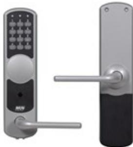

## NOKEY FORCE K01

Artikelnummer: 12040250, E-nummer: 5801063

NoKey force är ett batteridrivet kodlås som erbjuder snabb och smidig dörrpassage för den som är behörig samtidigt som obehöriga effektivt stängs ute. Kodlåset passar för *innerdörrar* och är mycket enkelt att montera på exempelvis kontorsdörrar, datarum, arkiv och lager. Denna modell är avsedd för enkla dörrar och är helt utan cylinder och vred. Genom att slå förvald kod kan man öppna dörren och passera. Utpassage sker direkt genom att handtaget dras ner.

Kodlåset använder sig av vanliga AA-batterier som har väldigt lång livslängd – cirka tre år räknat på hundra öppningar om dagen. Ett batteribyte är dessutom väldigt enkelt att göra på egen hand då endast en skruv behöver lossas för att utföra bytet. Enheterna varnar i god tid innan de förbrukat batterierna.

NoKey force bygger på principen att handtaget i normalläge är frikopplat. Men med en giltig kod kopplas handtaget in under en inställbar tid och dörren går att öppna.

*Viktigt: Endast inomhusmontage.*

Svensk manual:  [NoKey Force – Installera och driftsätta](https://www.rco.se/File/DownLoadFile?fileId=9c1db7ca-70ce-4dd7-855b-8aaf3ae17283)

Norsk manual:  [NoKey Force – Installere og idriftsette](https://www.rco.se/File/DownLoadFile?fileId=3088d348-8b72-4bed-a91e-b9c5c0642213)

Engelsk manual:  [NoKey Force – Installing and Operating](https://www.rco.se/File/DownLoadFile?fileId=9047b13f-6e97-4081-b5e3-1c30fd264100)

| Utförande:                   | Silvermetallic                                     |
|------------------------------|----------------------------------------------------|
| Material:                    | Zink (nickelfria och antibakteriella handtag)      |
| Matningsspänning:            | 5 st Alkaline AA LR6-batterier (ingår ej)          |
| Alternativ strömförsörjning: | 9-volts batteri (6LR6) för reservkraft på utsidan  |
| Vikt:                        | 1,16 kg                                            |
| Vikt inre enhet:             | 1,44 kg                                            |
| Temperaturområde insida:     | +5 till +40 grader C                               |
| Temperaturområde utsida:     | +5 till +55 grader C Rekommenderas för inomhusbruk |
| Mått (BxHxD):                | 67x260x17 mm                                       |
| Mått inre enhet (BxHxD:      | 68x272x25                                          |
| Livslängd batterier:         | Mer än 3 år vid normal användning                  |
| Antal koder:                 | 98 st                                              |