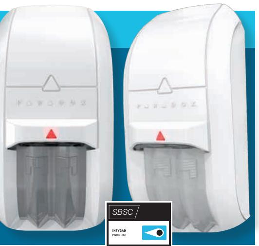
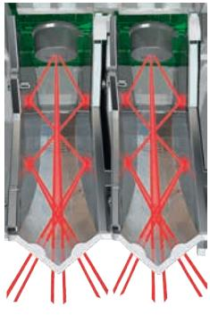
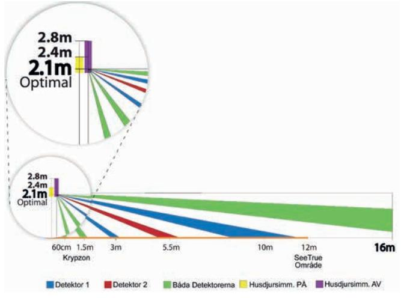
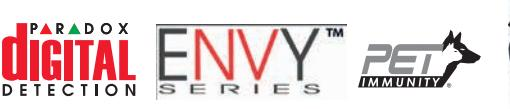

‣ Robust IR kombinationsdetektor. Antimask, mikrovågsdetektering, krypzon eller husdjursimmunitet

## **NV75MW, Mironel optik**

Trådbunden kombidetektor med microvågor NV75MW, art. nr 100-117

## Upptäcker kamouflerade rörelser

*NV75MW, en vandalsäker IR/MW detektor för inomhusbruk som klarar tekniska hinder som traditionella PIR detektorer inte kan hantera, till exempel detekteringsnedsättningarna i områden med hög temperatur. Används med fördel på sporthallar, skolor, öppna landskap hos företag och fängelser där en robust detektor med hög räckvidd efterfrågas.*

### **Halva storleken!**

Paradox har utvecklat en optik för stabil detektering på stora ytor med precision. En detektor med Mironel optik ger samma täckningsyta och räckvidd som en detektor som använder endast en Fresel lins eller spegel optik, men är hälften så stor.

### **Antimask med unik SeeTrue™ teknologi**

NV75MW använder en kombination av IR och mikrovågs rörelsedetektering för att identifiera kamouflerade rörelser som används för att lura vanliga PIR och kombinations detektorer. SeeTrue ger förstärkt detektering upp till 12 m från detektorn utan att tappa detekterings pålitlighet, vilket gör det näst intill omöjligt att röra sig i det skyddade området utan att detekteras. SeeTrue har två olika nivåer av detektering.

### **Krypzon, SeeTrue eller husdjursimmun detektering**

Välj mellan att aktivera nedåtriktad krypzon och/eller SeeTrue, alternativt husdjursimmunitet (djur upp till 50 cm) genom en enkel mekaniskt justering.

### **Mironel Optik**

Mironels teknologi är ett stort steg framåt i utvecklingen av detektionslösningar. Här har Paradox kombinerat spegelreflektions teknologin med Paradox Fresel lins i en W formad optimal lösning.

Linsen är 5 gånger starkare och slagtåligare än andra detektorer i samma storlek.

### Innehåller

- ‣ 2 st. Mironel linser, räckvidd 16 m
- ‣ Antimask detektering Aktiv IR detektering för blockeringar upp till 30 cm från linsen, inklusive material på linsen, t.ex. genomskinlig lack. MW Antimask detekterar rörelser nära detektorn, upp till 75cm.
- ‣ Husdjursimmunitet, upp till 50 cm.
- ‣ Dubbel eller enkel signalbehandling.
- ‣ Mekaniskt aktiverad krypzon.
- ‣ Dubbel sabotageavkänning.
- ‣ Monteras på vägg eller i hörn.
- ‣ Monteringsfäste finns som tillval.
- ‣ EN50131-2-4 Grade 3, Class II. CE

*Med reservation för tryckfel och ändringar*

# ‣ NV75MW med infraröd anti-mask och microvågs teknologier

Vandalsäker IR detektor med Mironel optik för detektering på stora ytor såsom exempelvis idrottshallar där bollsporter är vanligt förekommande. För inomhusbruk.

### **Figur 1: Toppvy**

### **Figur 2: Sidovy med val av husdjursimmunitet**

Trådbunden kombidetektor med microvågor NV75MW, art. nr 100-117

### **Sensor**

2 st. dubbla element. 2 st. mironel linser

### **Lins**

2 st. mironel speglar med Fresnel linser. Mekaniskt val av husdjursimmunitet eller krypzon

### **Antimask**

Aktiv IR detektering för blockeringar upp till 30 cm från linsen, inklusive material på linsen, t.ex. genomskinlig lack.

MW Antimask detekterar rörelser nära detektorn, upp till 75cm.

| AM kalibrering Detekteringshastighet |                     |                        |
|--------------------------------------|---------------------|------------------------|
| 60 sek                               | 0.2 m/sek – 4 m/sek |                        |
| Strömförbrukning                     |                     | IR räckvidd            |
| 23mA                                 |                     | 16 m, 1,5 m krypzon    |
| MW räckvidd                          |                     | SeeTrue räckvidd       |
| 16 m                                 |                     | 12 m                   |
| Husdjursimmunitet                    |                     | Interna motstånd       |
| Upp till 50 cm                       |                     | 1KΩ Sabotage, 1KΩ Larm |
| Driftstemperatur                     |                     | Luftfuktighet          |
| -35°C – +50°C                        |                     | 95%                    |
| Dimensioner                          |                     | Vikt                   |
| 12.8 x 6.2 x 5.4 cm                  |                     | 120 g                  |
| Certifiering                         |                     |                        |
| EN50131-2-4 Grade 3, Class II CE  |                     |                        |

Seetrue – avaktiverar husdjursimmunitet. Krypzon – avaktiverar husdjursimmunitet.

Paradox Security • Ekholmsvägen 36 • 127 48 Skärholmen • 08-556 465 50. www.paradox-security.se