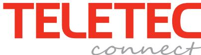
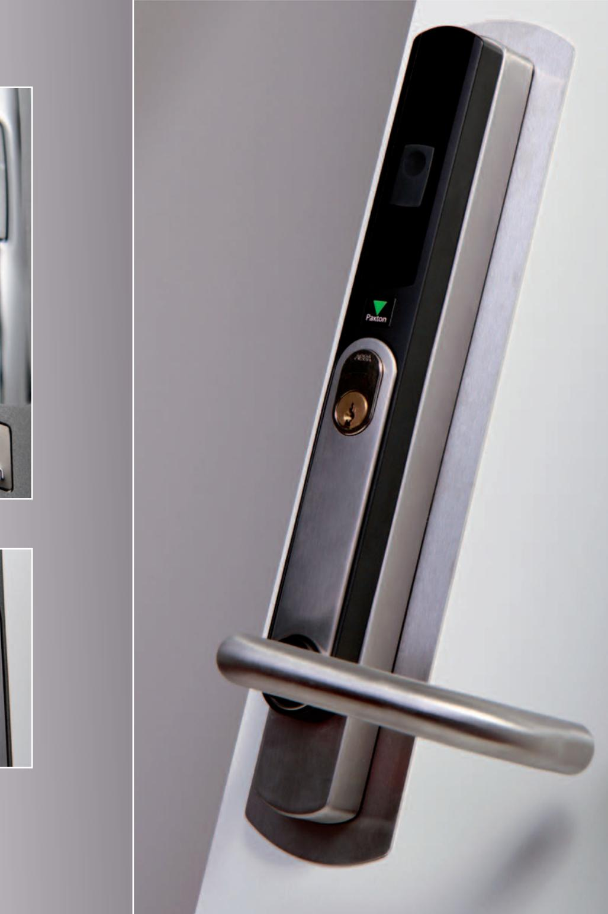
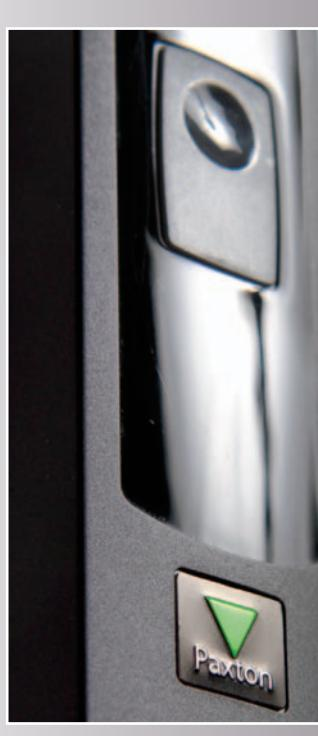
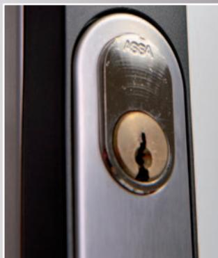
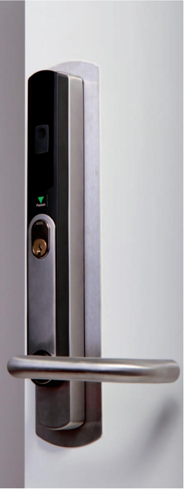
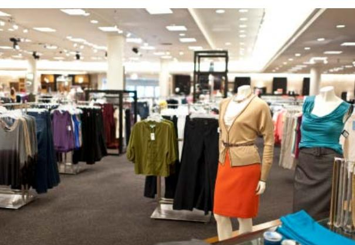
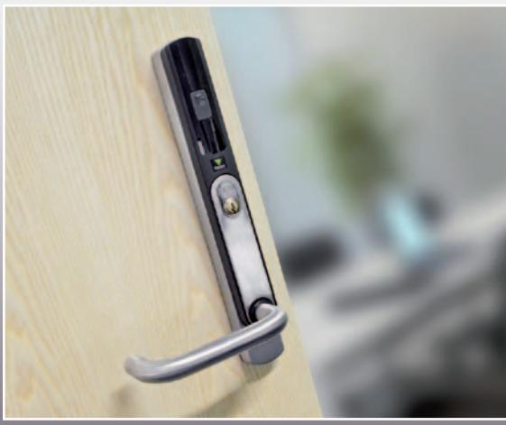
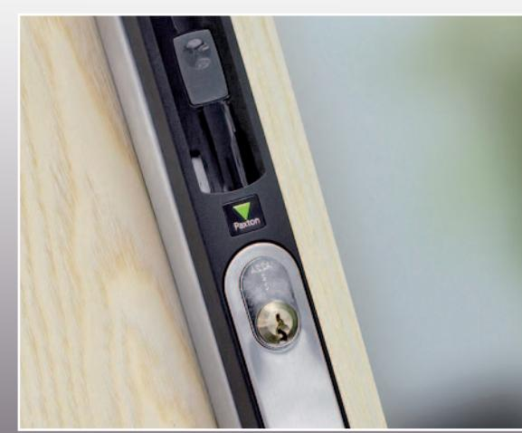
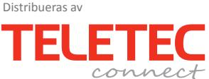

En komplett trådlös säkerhetslösning Net2 PaxLock

# Net2 PaxLock

Passerkontroll handlar om att kontrollera tillträde till lokaler, allt för att skydda dig själv, din personal och din egendom. Net2 PaxLock jobbar tillsammans med Paxtons moderna Net2 mjukvara, vilket ger dig en enkel och smidig passerkontroll.

PaxLock är en mångsidig produkt, designad för att enkelt komplettera din nuvarande dörrlösning och bli en del av ditt passersystem. PaxLock kombinerar trådlös teknik med en stilren batteridriven dörrbladsläsare, detta för att med ett minimum av installationsinsatser kunna kontrollera passager in och ut i din byggnad.

#### Dra nytta av fördelarna av trådlös passerkontroll

- En idealisk lösning för platser där kabeldragning tidigare visat sig vara krånglig och tidskrävande. Minimera arbetskostnaden som man ofta associerar med kabeldragning till varje dörrmiljö.
#### Upptäck fördelarna med ett system som rör sig bortom gränserna för traditionell passerkontroll

- PaxLock kombinerar marknadsledande passerkontrollsfunktioner med en mjukvara som är mycket enkel att använda.
#### En idealisk lösning för anläggningar med begränsad budget

- Med PaxLock får du en kompakt lösning som sparar pengar åt alla berörda, vad gäller installation och hårdvara.
### Ett attraktivt utseende som förstärker intrycket av din dörrmiljö

- PaxLock passar väl in i designade interiörer där utseendeet är viktigt. Den borstade stålfinishen smälter väl in i de flesta miljöer.

## Net2 PaxLock- En komplett trådlös säkerhetslösning, oavsett dina krav

Din anläggning kan dra nytta av fördelarna med de trådlösa funktioner som Net2 PaxLock erbjuder, framförallt i områden där kabeldragning är krångligt. En snabb och ekonomisk lösning som med Net2 PaxLock ger den trygghet som är självklar för ett tillförlitligt säkerhetssystem, tillsammans med alla de andra fördelarna som Net2 mjukvaran ger.

En enkel men säker kostnadseffektiv lösning. Installera PaxLock när behovet finns, och utöka ditt passersystem i samma takt som dina lokalers säkerhet behöver utökas. Ett attraktivt och mångsidigt alternativ, PaxLock är idealisk för innerdörrar, öppna planlösningar och moderna miljöer.

Klassrum Banker Studentbostäder Fabriker Personalkontor Butiker

Hälso och sjukvård Logi

Privata kliniker Vandrarhem Undersökningsrum Äldreboende Rum för förvaring av medicin Hotell Journalarkiv

Gym Kyrkor Föreningslokaler Stadshus Möteslokaler Bibliotek

Skolor och universitet Kommersiella fastigheter

Fritid Övriga byggnader

Ostmästargränd 8 120 40 ÅRSTA Tel. +46-8-602 16 00 Fax +46-8-602 16 01 www.teletec.se

Gullbergs Strandgata 36D 411 06 GÖTEBORG Tel. +46-31-61 70 90 Fax +46-31-61 70 91 www.teletec.se

Enebakkveien 117 b NO-0680 OSLO Tel.. +47 22 08 02 20 Fax +47 22 08 02 21 www.teletec.no

Virkeholm 3B DK-2730 HERLEV Tel. +45-70 23 30 50 Fax +45-69 80 45 56 www.teletec.dk

Teknobulevardi 3-5 FI-01530 VANTAA Tel. +359 40 158 5550

www.teletec.fi